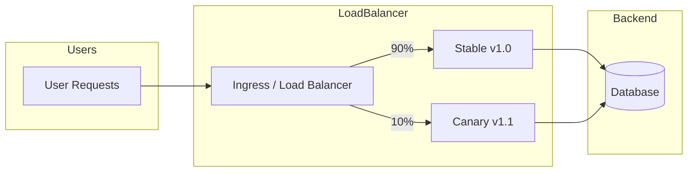
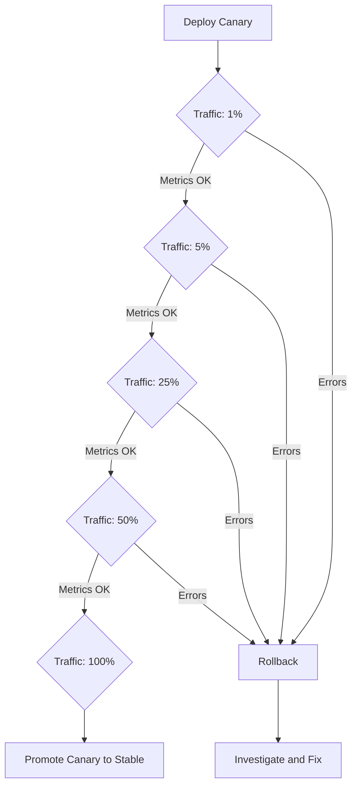

# How to Create Traffic Percentage Control

Author: [nawazdhandala](https://github.com/nawazdhandala)

Tags: DevOps, Canary, Traffic Control, Deployments

Description: Learn to create traffic percentage control for gradual canary rollouts.

---

Deploying new code to production is always risky. No matter how thorough your testing, real user traffic exposes edge cases that staging environments miss. Traffic percentage control gives you a safety valve: route a small fraction of requests to the new version, monitor for errors, and gradually increase the percentage as confidence grows.

This guide covers the mechanics of traffic splitting, from load balancer configuration to application-level routing, with code you can adapt to your own infrastructure.

---

## Why Percentage-Based Traffic Control

Traditional deployments are all-or-nothing. You push a new version, and if something breaks, every user experiences the failure. Canary deployments flip this model by exposing new code to a subset of traffic first.

The benefits are straightforward:

| Approach | Blast Radius | Rollback Time | Confidence Before Full Deploy |
|----------|--------------|---------------|-------------------------------|
| Big bang deployment | 100% of users | Minutes to hours | Low |
| Canary with traffic control | 1-10% of users | Seconds | High |
| Blue-green | 100% (but instant switch) | Seconds | Medium |

Traffic percentage control is the foundation of canary deployments. Get this right, and you can ship multiple times per day without fear.

---

## Traffic Splitting Architecture

The following diagram shows a typical setup where a load balancer splits traffic between stable and canary versions based on configured weights.



The load balancer inspects each incoming request and routes it to either the stable or canary backend based on the configured percentages. Both versions share the same database and downstream services, which keeps the deployment simple but requires backward-compatible changes.

---

## Nginx Traffic Splitting

Nginx provides the `split_clients` directive for deterministic traffic routing. The directive hashes a request attribute (like client IP or a cookie) and assigns requests to different upstreams based on the hash value.

The configuration below routes 10% of traffic to the canary upstream while sending the remaining 90% to the stable version.

```nginx
# Define the traffic split based on client IP hash
# This ensures the same client consistently hits the same backend
split_clients "${remote_addr}" $backend_pool {
    10%     canary;      # 10% of requests go to canary
    *       stable;      # Remaining 90% go to stable
}

# Upstream definitions for each version
upstream stable {
    server 10.0.1.10:8080 weight=1;
    server 10.0.1.11:8080 weight=1;
    server 10.0.1.12:8080 weight=1;
}

upstream canary {
    server 10.0.2.10:8080 weight=1;
}

server {
    listen 80;
    server_name api.example.com;

    location / {
        # Route to the upstream selected by split_clients
        proxy_pass http://$backend_pool;

        # Pass headers for observability
        proxy_set_header X-Backend-Version $backend_pool;
        proxy_set_header X-Real-IP $remote_addr;
        proxy_set_header Host $host;
    }
}
```

To change the traffic percentage, update the `split_clients` block and reload Nginx. The hash-based approach means users see consistent behavior across requests, which prevents confusing experiences where features appear and disappear.

---

## Kubernetes Ingress with Traffic Weights

If you run on Kubernetes, Nginx Ingress Controller supports traffic splitting through annotations. This approach keeps your routing configuration in Kubernetes manifests alongside your deployments.

First, deploy both versions with separate Services.

```yaml
# Stable deployment and service
apiVersion: apps/v1
kind: Deployment
metadata:
  name: api-stable
  labels:
    app: api
    version: stable
spec:
  replicas: 3
  selector:
    matchLabels:
      app: api
      version: stable
  template:
    metadata:
      labels:
        app: api
        version: stable
    spec:
      containers:
        - name: api
          image: myregistry/api:1.0.0
          ports:
            - containerPort: 8080
---
apiVersion: v1
kind: Service
metadata:
  name: api-stable
spec:
  selector:
    app: api
    version: stable
  ports:
    - port: 80
      targetPort: 8080
---
# Canary deployment and service
apiVersion: apps/v1
kind: Deployment
metadata:
  name: api-canary
  labels:
    app: api
    version: canary
spec:
  replicas: 1
  selector:
    matchLabels:
      app: api
      version: canary
  template:
    metadata:
      labels:
        app: api
        version: canary
    spec:
      containers:
        - name: api
          image: myregistry/api:1.1.0
          ports:
            - containerPort: 8080
---
apiVersion: v1
kind: Service
metadata:
  name: api-canary
spec:
  selector:
    app: api
    version: canary
  ports:
    - port: 80
      targetPort: 8080
```

Then create an Ingress that splits traffic between the two services. The `nginx.ingress.kubernetes.io/canary` annotations control the routing behavior.

```yaml
# Main ingress for stable traffic
apiVersion: networking.k8s.io/v1
kind: Ingress
metadata:
  name: api-stable
  annotations:
    kubernetes.io/ingress.class: nginx
spec:
  rules:
    - host: api.example.com
      http:
        paths:
          - path: /
            pathType: Prefix
            backend:
              service:
                name: api-stable
                port:
                  number: 80
---
# Canary ingress with weight annotation
apiVersion: networking.k8s.io/v1
kind: Ingress
metadata:
  name: api-canary
  annotations:
    kubernetes.io/ingress.class: nginx
    nginx.ingress.kubernetes.io/canary: "true"
    nginx.ingress.kubernetes.io/canary-weight: "10"
spec:
  rules:
    - host: api.example.com
      http:
        paths:
          - path: /
            pathType: Prefix
            backend:
              service:
                name: api-canary
                port:
                  number: 80
```

Adjusting the `canary-weight` annotation from 10 to 50 to 100 lets you gradually shift traffic to the new version.

---

## Gradual Rollout Workflow

A successful canary deployment follows a progression from minimal exposure to full rollout. The diagram below shows the typical stages.



At each stage, you check error rates, latency percentiles, and business metrics before proceeding. Automation can handle the percentage increases, but human judgment should gate the final promotion.

---

## Application-Level Traffic Control

Sometimes you need finer control than load balancers provide. Application-level routing lets you split traffic based on user attributes, feature flags, or request properties.

The following Node.js middleware implements percentage-based routing with consistent user assignment.

```typescript
import { Request, Response, NextFunction } from 'express';
import crypto from 'crypto';

interface TrafficConfig {
  canaryPercentage: number;  // 0-100
  canaryHeader: string;      // Header to identify canary requests
}

// Hash user ID to get consistent routing
function getUserBucket(userId: string): number {
  const hash = crypto.createHash('md5').update(userId).digest('hex');
  // Convert first 8 hex chars to number, mod 100 for percentage
  return parseInt(hash.substring(0, 8), 16) % 100;
}

// Middleware factory for traffic splitting
export function trafficSplitter(config: TrafficConfig) {
  return (req: Request, res: Response, next: NextFunction) => {
    // Extract user identifier from session, header, or IP
    const userId = req.user?.id || req.ip || 'anonymous';
    const bucket = getUserBucket(userId);

    // Determine if this request should go to canary
    const isCanary = bucket < config.canaryPercentage;

    // Set header for downstream services and observability
    req.headers[config.canaryHeader] = isCanary ? 'true' : 'false';

    // Attach routing decision to request for handler logic
    (req as any).isCanary = isCanary;

    // Log for debugging traffic distribution
    console.log(`User ${userId} bucket ${bucket} -> ${isCanary ? 'canary' : 'stable'}`);

    next();
  };
}

// Usage in Express app
import express from 'express';

const app = express();

app.use(trafficSplitter({
  canaryPercentage: 10,
  canaryHeader: 'x-canary-request',
}));

app.get('/api/feature', (req, res) => {
  if ((req as any).isCanary) {
    // New implementation
    return res.json({ version: 'canary', data: newFeatureLogic() });
  }
  // Stable implementation
  return res.json({ version: 'stable', data: stableFeatureLogic() });
});
```

This approach works well when different code paths exist in the same deployment. The hash-based bucketing ensures users consistently see the same version across requests.

---

## Monitoring Your Canary

Traffic splitting without monitoring is just hoping for the best. You need real-time visibility into how both versions perform.

Track these metrics separately for canary and stable traffic:

| Metric | Why It Matters | Alert Threshold |
|--------|----------------|-----------------|
| Error rate (5xx) | Detects crashes and bugs | Canary > 2x stable |
| P99 latency | Finds performance regressions | Canary > 1.5x stable |
| Request throughput | Confirms traffic is flowing | Canary receiving expected % |
| Business metrics | Catches functional issues | Conversion drop > 5% |

The following Prometheus query compares error rates between versions.

```promql
# Calculate error rate by version label
sum(rate(http_requests_total{status=~"5.."}[5m])) by (version)
/
sum(rate(http_requests_total[5m])) by (version)
```

Set up alerts that trigger when canary error rates exceed stable by a configurable threshold. Automatic rollback on alert is possible but requires careful tuning to avoid false positives.

---

## Automated Traffic Progression

For mature deployments, you can automate the traffic increase based on metrics. The script below demonstrates a simple progression with health checks.

```bash
#!/bin/bash
# Automated canary progression script

CANARY_INGRESS="api-canary"
NAMESPACE="production"
STAGES=(5 10 25 50 100)
WAIT_MINUTES=10

check_canary_health() {
  # Query Prometheus for canary error rate
  local error_rate=$(curl -s "http://prometheus:9090/api/v1/query" \
    --data-urlencode 'query=sum(rate(http_requests_total{version="canary",status=~"5.."}[5m]))/sum(rate(http_requests_total{version="canary"}[5m]))' \
    | jq -r '.data.result[0].value[1]')

  # Return success if error rate below 1%
  if (( $(echo "$error_rate < 0.01" | bc -l) )); then
    return 0
  else
    return 1
  fi
}

for percentage in "${STAGES[@]}"; do
  echo "Setting canary traffic to ${percentage}%"

  # Update the canary weight annotation
  kubectl annotate ingress "$CANARY_INGRESS" \
    -n "$NAMESPACE" \
    nginx.ingress.kubernetes.io/canary-weight="$percentage" \
    --overwrite

  echo "Waiting ${WAIT_MINUTES} minutes before health check..."
  sleep $((WAIT_MINUTES * 60))

  if ! check_canary_health; then
    echo "Canary health check failed at ${percentage}%. Rolling back."
    kubectl annotate ingress "$CANARY_INGRESS" \
      -n "$NAMESPACE" \
      nginx.ingress.kubernetes.io/canary-weight="0" \
      --overwrite
    exit 1
  fi

  echo "Canary healthy at ${percentage}%"
done

echo "Canary rollout complete. Promote canary to stable."
```

Run this script in your CI/CD pipeline after deploying the canary. It handles the mechanical work of increasing traffic while you focus on monitoring dashboards.

---

## Common Pitfalls

Avoid these mistakes when implementing traffic percentage control:

1. **Database schema changes**: Both versions must work with the same schema. Run migrations separately from code deployments.

2. **Sticky sessions without hash consistency**: If users bounce between versions mid-session, they may see inconsistent state. Use consistent hashing on user ID.

3. **Ignoring downstream dependencies**: Canary traffic to your service becomes canary traffic to services you call. Coordinate with downstream teams.

4. **Too fast progression**: Jumping from 1% to 50% skips the gradual confidence building. Small increments catch problems early.

5. **No rollback plan**: Automation should fail safe. If health checks break, default to routing all traffic to stable.

---

## Summary

Traffic percentage control transforms risky deployments into controlled experiments. Start with load balancer or ingress-level splitting for simplicity, then add application-level routing when you need user-aware targeting.

The key principles:

- Hash user identifiers for consistent routing
- Progress through small increments with monitoring at each stage
- Automate the mechanics but keep humans in the loop for promotion decisions
- Always have a fast rollback path

Combine traffic splitting with feature flags and you can ship code whenever it is ready, decoupled from when features go live. This separation of deployment from release is what enables high-velocity teams to move fast without breaking things.
