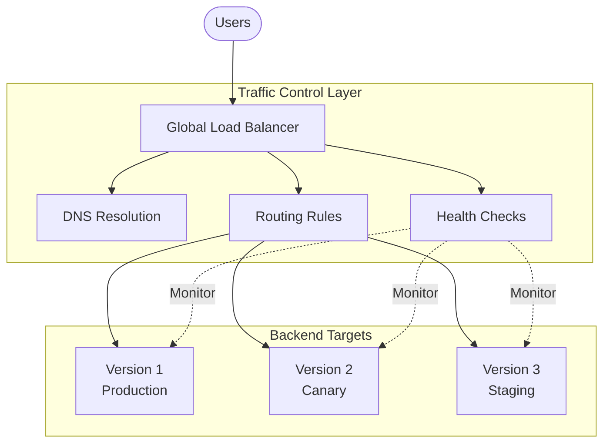
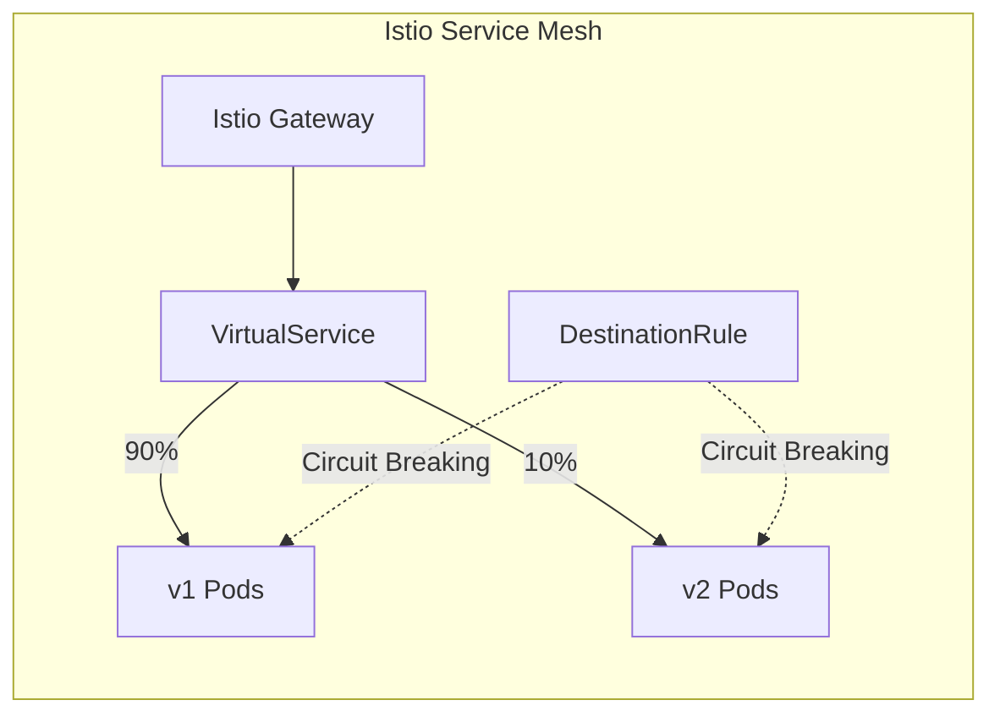
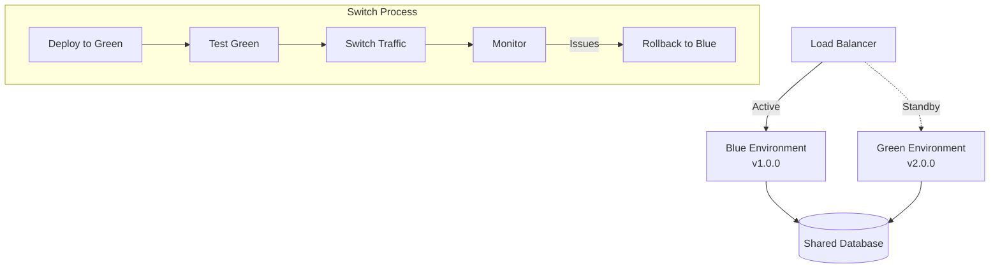
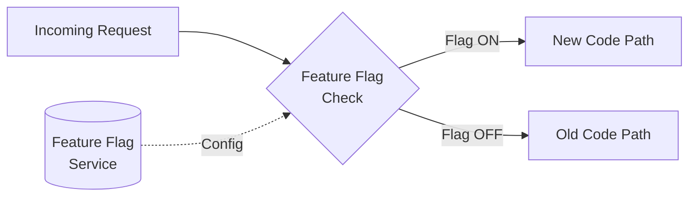
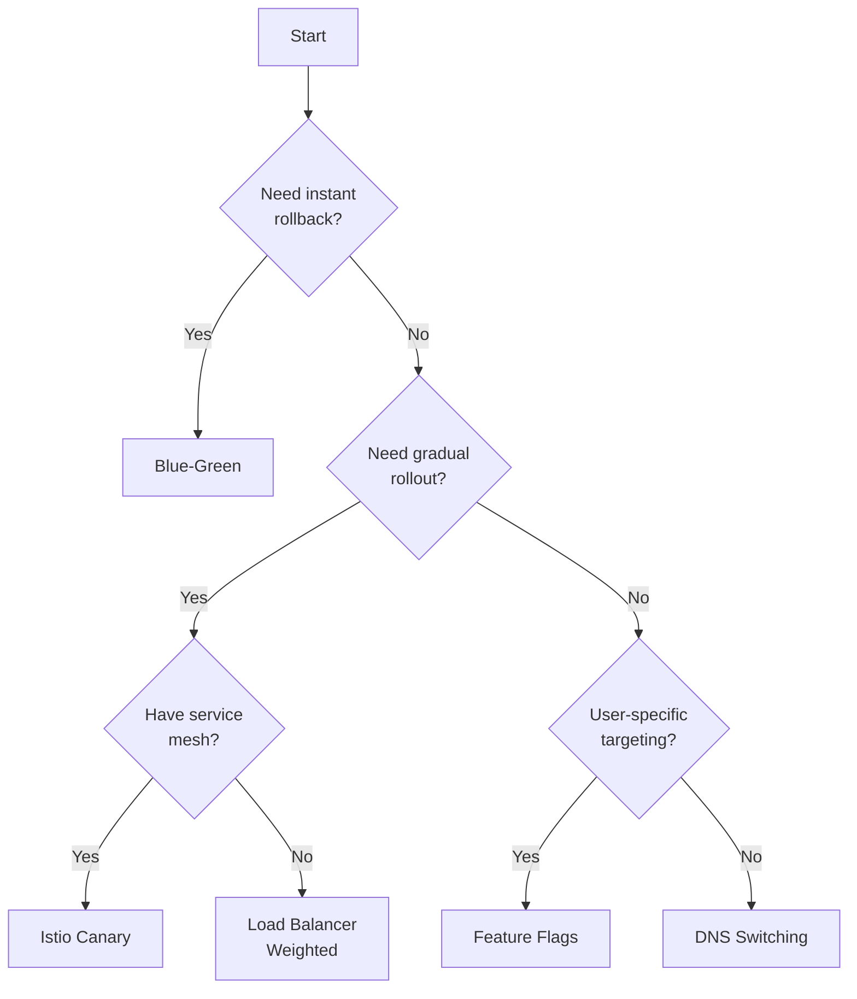

# How to Build Traffic Switching Strategies

Author: [nawazdhandala](https://github.com/nawazdhandala)

Tags: Deployment, DevOps, Kubernetes, Traffic Management

Description: Learn how to implement traffic switching strategies for zero-downtime deployments, A/B testing, and gradual rollouts using load balancers, service meshes, and DNS.

---

Traffic switching is the foundation of modern deployment practices. Whether you are rolling out a new feature, testing performance under load, or recovering from an incident, controlling where traffic goes is essential. This guide covers the strategies, tools, and real-world patterns you need to build reliable traffic switching into your infrastructure.

## Why Traffic Switching Matters

Traffic switching enables:

- **Zero-downtime deployments** - Ship new versions without dropping requests
- **Canary releases** - Test changes with a small percentage of users first
- **A/B testing** - Compare different versions with real user traffic
- **Disaster recovery** - Instantly redirect traffic away from failing systems
- **Blue-green deployments** - Maintain two identical environments and switch between them

## Traffic Switching Architecture



## Strategy 1: DNS-Based Traffic Switching

DNS-based switching is the simplest approach. You update DNS records to point to different backends. It works at the network edge and requires no changes to your application.

### Weighted DNS Routing

Cloud providers like AWS Route 53, Google Cloud DNS, and Cloudflare support weighted routing. Here is an example using AWS Route 53 CLI.

This configuration splits traffic 90/10 between two endpoints. The weights do not need to sum to 100 - Route 53 calculates percentages automatically.

```bash
# Create weighted DNS records for gradual traffic shift
aws route53 change-resource-record-sets \
  --hosted-zone-id Z1234567890ABC \
  --change-batch '{
    "Changes": [
      {
        "Action": "UPSERT",
        "ResourceRecordSet": {
          "Name": "api.example.com",
          "Type": "A",
          "SetIdentifier": "production-v1",
          "Weight": 90,
          "TTL": 60,
          "ResourceRecords": [{"Value": "10.0.1.100"}]
        }
      },
      {
        "Action": "UPSERT",
        "ResourceRecordSet": {
          "Name": "api.example.com",
          "Type": "A",
          "SetIdentifier": "canary-v2",
          "Weight": 10,
          "TTL": 60,
          "ResourceRecords": [{"Value": "10.0.2.100"}]
        }
      }
    ]
  }'
```

### DNS Switching Considerations

| Pros | Cons |
|------|------|
| Simple to implement | TTL delays propagation |
| Works with any backend | No per-request control |
| No application changes | Limited routing logic |
| Cloud-native support | Client caching issues |

### Lowering TTL Before Switching

Always reduce TTL before a planned switch. This ensures clients pick up changes quickly.

```bash
# Step 1: Lower TTL to 60 seconds (do this hours before the switch)
aws route53 change-resource-record-sets \
  --hosted-zone-id Z1234567890ABC \
  --change-batch '{
    "Changes": [{
      "Action": "UPSERT",
      "ResourceRecordSet": {
        "Name": "api.example.com",
        "Type": "A",
        "TTL": 60,
        "ResourceRecords": [{"Value": "10.0.1.100"}]
      }
    }]
  }'

# Step 2: Wait for old TTL to expire (previous TTL value)
# Step 3: Perform the actual switch
# Step 4: After verification, raise TTL back to normal (e.g., 300 or 3600)
```

## Strategy 2: Load Balancer Traffic Splitting

Load balancers give you more control than DNS. They can route based on headers, cookies, paths, and weights - all without client-side caching delays.

### NGINX Traffic Splitting

This NGINX configuration uses the `split_clients` directive to distribute traffic. The hash is computed from the client IP and User-Agent, ensuring the same client consistently hits the same backend (sticky routing).

```nginx
# nginx.conf - Traffic splitting with weighted upstreams

# Define the split ratio based on client characteristics
# This creates consistent routing - same client always hits same backend
split_clients "${remote_addr}${http_user_agent}" $backend_pool {
    90%     production;    # 90% of traffic to production
    10%     canary;        # 10% of traffic to canary
}

# Production backend pool
upstream production {
    server 10.0.1.10:8080 weight=5;
    server 10.0.1.11:8080 weight=5;
    server 10.0.1.12:8080 weight=5;
    keepalive 32;
}

# Canary backend pool
upstream canary {
    server 10.0.2.10:8080;
    keepalive 16;
}

server {
    listen 80;
    server_name api.example.com;

    location / {
        # Route to the selected backend pool
        proxy_pass http://$backend_pool;

        # Pass useful headers for debugging
        proxy_set_header X-Backend-Pool $backend_pool;
        proxy_set_header X-Real-IP $remote_addr;
        proxy_set_header Host $host;

        # Connection pooling
        proxy_http_version 1.1;
        proxy_set_header Connection "";
    }

    # Health check endpoint - always goes to production
    location /health {
        proxy_pass http://production;
    }
}
```

### HAProxy Traffic Splitting

HAProxy offers powerful ACL-based routing. This configuration demonstrates header-based routing combined with weighted backend selection.

```haproxy
# haproxy.cfg - Advanced traffic splitting

global
    maxconn 50000
    log stdout format raw local0

defaults
    mode http
    timeout connect 5s
    timeout client 30s
    timeout server 30s
    option httplog

frontend api_frontend
    bind *:80

    # ACL for canary header override - allows forcing canary for testing
    acl is_canary_header hdr(X-Canary) -i true

    # ACL for internal testing IPs
    acl is_internal_ip src 10.0.0.0/8 192.168.0.0/16

    # Route canary header requests to canary
    use_backend canary_servers if is_canary_header

    # Use weighted backend selection for normal traffic
    default_backend weighted_servers

# Weighted backend for gradual rollout
backend weighted_servers
    balance roundrobin

    # Production servers get 90% of traffic (weight 9 out of 10)
    server prod1 10.0.1.10:8080 weight 3 check
    server prod2 10.0.1.11:8080 weight 3 check
    server prod3 10.0.1.12:8080 weight 3 check

    # Canary server gets 10% of traffic (weight 1 out of 10)
    server canary1 10.0.2.10:8080 weight 1 check

# Dedicated canary backend for header-based routing
backend canary_servers
    balance roundrobin
    server canary1 10.0.2.10:8080 check
    server canary2 10.0.2.11:8080 check
```

## Strategy 3: Service Mesh Traffic Management

Service meshes like Istio and Linkerd provide the most sophisticated traffic control. They operate at Layer 7 and can make routing decisions based on any aspect of the request.

### Istio VirtualService for Canary Deployments



This Istio configuration demonstrates percentage-based traffic splitting with header-based overrides. The VirtualService routes 90% of traffic to v1 and 10% to v2, but requests with a specific header always go to v2.

```yaml
# virtualservice.yaml - Canary deployment with header override
apiVersion: networking.istio.io/v1beta1
kind: VirtualService
metadata:
  name: api-service
  namespace: production
spec:
  hosts:
    - api.example.com
    - api-service.production.svc.cluster.local
  gateways:
    - api-gateway
  http:
    # Rule 1: Header-based routing for testing
    # Requests with X-Canary: true always go to v2
    - match:
        - headers:
            x-canary:
              exact: "true"
      route:
        - destination:
            host: api-service
            subset: v2
          headers:
            response:
              add:
                x-served-by: canary-v2

    # Rule 2: Percentage-based traffic split for normal requests
    - route:
        - destination:
            host: api-service
            subset: v1
          weight: 90
          headers:
            response:
              add:
                x-served-by: production-v1
        - destination:
            host: api-service
            subset: v2
          weight: 10
          headers:
            response:
              add:
                x-served-by: canary-v2
```

### DestinationRule for Subset Definitions

The DestinationRule defines which pods belong to each subset and configures connection pooling and circuit breaking for each.

```yaml
# destinationrule.yaml - Define subsets and connection policies
apiVersion: networking.istio.io/v1beta1
kind: DestinationRule
metadata:
  name: api-service
  namespace: production
spec:
  host: api-service

  # Connection pool settings apply to all subsets
  trafficPolicy:
    connectionPool:
      tcp:
        maxConnections: 100
      http:
        h2UpgradePolicy: UPGRADE
        http1MaxPendingRequests: 100
        http2MaxRequests: 1000

    # Circuit breaker settings
    outlierDetection:
      consecutive5xxErrors: 5
      interval: 30s
      baseEjectionTime: 60s
      maxEjectionPercent: 50

  # Define subsets based on pod labels
  subsets:
    - name: v1
      labels:
        version: v1
      trafficPolicy:
        connectionPool:
          http:
            http2MaxRequests: 500

    - name: v2
      labels:
        version: v2
      trafficPolicy:
        connectionPool:
          http:
            http2MaxRequests: 100
```

### Kubernetes Deployments for Each Version

Create separate deployments for each version with appropriate labels.

```yaml
# deployment-v1.yaml - Production deployment
apiVersion: apps/v1
kind: Deployment
metadata:
  name: api-service-v1
  namespace: production
spec:
  replicas: 5
  selector:
    matchLabels:
      app: api-service
      version: v1
  template:
    metadata:
      labels:
        app: api-service
        version: v1
    spec:
      containers:
        - name: api
          image: myregistry/api-service:1.0.0
          ports:
            - containerPort: 8080
          resources:
            requests:
              cpu: 100m
              memory: 128Mi
            limits:
              cpu: 500m
              memory: 512Mi
          readinessProbe:
            httpGet:
              path: /health/ready
              port: 8080
            initialDelaySeconds: 5
            periodSeconds: 10
          livenessProbe:
            httpGet:
              path: /health/live
              port: 8080
            initialDelaySeconds: 10
            periodSeconds: 30
---
# deployment-v2.yaml - Canary deployment
apiVersion: apps/v1
kind: Deployment
metadata:
  name: api-service-v2
  namespace: production
spec:
  replicas: 1
  selector:
    matchLabels:
      app: api-service
      version: v2
  template:
    metadata:
      labels:
        app: api-service
        version: v2
    spec:
      containers:
        - name: api
          image: myregistry/api-service:2.0.0
          ports:
            - containerPort: 8080
          resources:
            requests:
              cpu: 100m
              memory: 128Mi
            limits:
              cpu: 500m
              memory: 512Mi
          readinessProbe:
            httpGet:
              path: /health/ready
              port: 8080
            initialDelaySeconds: 5
            periodSeconds: 10
```

## Strategy 4: Blue-Green Deployments

Blue-green deployments maintain two identical production environments. At any time, only one (blue or green) serves live traffic. This allows instant rollback by switching the active environment.



### Kubernetes Blue-Green with Services

This approach uses a single Service that selects pods by a color label. Switching traffic is as simple as updating the selector.

```yaml
# service.yaml - Points to active color
apiVersion: v1
kind: Service
metadata:
  name: api-service
  namespace: production
spec:
  selector:
    app: api-service
    color: blue  # Change to 'green' to switch
  ports:
    - port: 80
      targetPort: 8080
---
# deployment-blue.yaml
apiVersion: apps/v1
kind: Deployment
metadata:
  name: api-service-blue
  namespace: production
spec:
  replicas: 3
  selector:
    matchLabels:
      app: api-service
      color: blue
  template:
    metadata:
      labels:
        app: api-service
        color: blue
        version: v1.0.0
    spec:
      containers:
        - name: api
          image: myregistry/api-service:1.0.0
          ports:
            - containerPort: 8080
---
# deployment-green.yaml
apiVersion: apps/v1
kind: Deployment
metadata:
  name: api-service-green
  namespace: production
spec:
  replicas: 3
  selector:
    matchLabels:
      app: api-service
      color: green
  template:
    metadata:
      labels:
        app: api-service
        color: green
        version: v2.0.0
    spec:
      containers:
        - name: api
          image: myregistry/api-service:2.0.0
          ports:
            - containerPort: 8080
```

### Blue-Green Switch Script

This script automates the blue-green switch with validation checks at each step.

```bash
#!/bin/bash
# blue-green-switch.sh - Automated blue-green deployment switch

set -euo pipefail

NAMESPACE="production"
SERVICE="api-service"
NEW_COLOR="${1:-green}"
OLD_COLOR=$([[ "$NEW_COLOR" == "green" ]] && echo "blue" || echo "green")

echo "Switching from $OLD_COLOR to $NEW_COLOR"

# Step 1: Verify new deployment is healthy
echo "Checking $NEW_COLOR deployment health..."
READY_REPLICAS=$(kubectl get deployment "api-service-$NEW_COLOR" -n "$NAMESPACE" \
  -o jsonpath='{.status.readyReplicas}')
DESIRED_REPLICAS=$(kubectl get deployment "api-service-$NEW_COLOR" -n "$NAMESPACE" \
  -o jsonpath='{.spec.replicas}')

if [[ "$READY_REPLICAS" != "$DESIRED_REPLICAS" ]]; then
  echo "ERROR: $NEW_COLOR deployment not fully ready ($READY_REPLICAS/$DESIRED_REPLICAS)"
  exit 1
fi
echo "All $DESIRED_REPLICAS replicas are ready"

# Step 2: Run smoke tests against new deployment directly
echo "Running smoke tests against $NEW_COLOR..."
NEW_POD=$(kubectl get pods -n "$NAMESPACE" -l "color=$NEW_COLOR" \
  -o jsonpath='{.items[0].metadata.name}')
kubectl exec -n "$NAMESPACE" "$NEW_POD" -- curl -sf http://localhost:8080/health || {
  echo "ERROR: Smoke test failed"
  exit 1
}
echo "Smoke tests passed"

# Step 3: Switch the service selector
echo "Switching service to $NEW_COLOR..."
kubectl patch service "$SERVICE" -n "$NAMESPACE" \
  -p "{\"spec\":{\"selector\":{\"color\":\"$NEW_COLOR\"}}}"

# Step 4: Verify the switch
echo "Verifying switch..."
sleep 5
ENDPOINTS=$(kubectl get endpoints "$SERVICE" -n "$NAMESPACE" \
  -o jsonpath='{.subsets[0].addresses[*].ip}' | wc -w)
echo "Service now has $ENDPOINTS endpoints"

# Step 5: Monitor for errors
echo "Monitoring for 60 seconds..."
for i in {1..12}; do
  sleep 5
  # Add your monitoring check here (e.g., query Prometheus for error rates)
  echo "Check $i/12: OK"
done

echo "Switch complete. $NEW_COLOR is now active."
echo "To rollback, run: $0 $OLD_COLOR"
```

## Strategy 5: Feature Flag-Based Routing

Feature flags allow traffic switching at the application level. This gives you fine-grained control based on user attributes, not just request percentages.



### Node.js Feature Flag Implementation

This example shows a simple feature flag service that can be used for traffic routing decisions.

```javascript
// feature-flags.js - Simple feature flag service

const flags = new Map();

// Flag configuration with percentage rollout and user targeting
const flagConfig = {
  'new-checkout-flow': {
    enabled: true,
    percentage: 10,  // 10% of users see the new flow
    allowedUsers: ['beta-tester-1', 'internal-qa'],
    blockedUsers: [],
  },
  'new-search-algorithm': {
    enabled: true,
    percentage: 50,
    allowedUsers: [],
    blockedUsers: ['high-value-customer-1'],
  },
};

/**
 * Check if a feature flag is enabled for a given user
 * @param {string} flagName - The name of the feature flag
 * @param {string} userId - The user ID to check
 * @returns {boolean} - Whether the flag is enabled for this user
 */
function isEnabled(flagName, userId) {
  const config = flagConfig[flagName];

  if (!config || !config.enabled) {
    return false;
  }

  // Check blocked users first
  if (config.blockedUsers.includes(userId)) {
    return false;
  }

  // Check allowed users (always enabled)
  if (config.allowedUsers.includes(userId)) {
    return true;
  }

  // Percentage-based rollout using consistent hashing
  // Same user always gets the same result
  const hash = hashUserId(userId, flagName);
  return hash < config.percentage;
}

/**
 * Generate a consistent hash for user-flag combination
 * Returns a number between 0-99
 */
function hashUserId(userId, flagName) {
  const str = `${userId}:${flagName}`;
  let hash = 0;
  for (let i = 0; i < str.length; i++) {
    const char = str.charCodeAt(i);
    hash = ((hash << 5) - hash) + char;
    hash = hash & hash;  // Convert to 32-bit integer
  }
  return Math.abs(hash) % 100;
}

module.exports = { isEnabled };
```

### Express Middleware for Feature Flags

Use middleware to route requests based on feature flags.

```javascript
// middleware/feature-routing.js

const featureFlags = require('./feature-flags');

/**
 * Middleware that routes requests based on feature flags
 * Adds routing decision to request object for downstream handlers
 */
function featureRouting(flagName) {
  return (req, res, next) => {
    // Extract user ID from session, JWT, or header
    const userId = req.user?.id || req.headers['x-user-id'] || 'anonymous';

    // Check if feature is enabled for this user
    const useNewFeature = featureFlags.isEnabled(flagName, userId);

    // Attach decision to request for use in route handlers
    req.featureFlags = req.featureFlags || {};
    req.featureFlags[flagName] = useNewFeature;

    // Add header for debugging and metrics
    res.setHeader('X-Feature-Flag', `${flagName}=${useNewFeature}`);

    next();
  };
}

/**
 * Route handler that calls different services based on feature flag
 */
async function checkoutHandler(req, res) {
  const useNewCheckout = req.featureFlags['new-checkout-flow'];

  if (useNewCheckout) {
    // Route to new checkout service
    const result = await fetch('http://checkout-v2/process', {
      method: 'POST',
      body: JSON.stringify(req.body),
      headers: { 'Content-Type': 'application/json' },
    });
    return res.json(await result.json());
  }

  // Route to existing checkout service
  const result = await fetch('http://checkout-v1/process', {
    method: 'POST',
    body: JSON.stringify(req.body),
    headers: { 'Content-Type': 'application/json' },
  });
  return res.json(await result.json());
}

module.exports = { featureRouting, checkoutHandler };
```

## Automating Traffic Switching with GitOps

Combine traffic switching with GitOps for auditable, automated deployments. Argo Rollouts extends Kubernetes with advanced deployment strategies.

### Argo Rollouts Canary Strategy

Argo Rollouts automates the gradual traffic shift and can automatically rollback based on metrics.

```yaml
# rollout.yaml - Automated canary with analysis
apiVersion: argoproj.io/v1alpha1
kind: Rollout
metadata:
  name: api-service
  namespace: production
spec:
  replicas: 5
  selector:
    matchLabels:
      app: api-service
  template:
    metadata:
      labels:
        app: api-service
    spec:
      containers:
        - name: api
          image: myregistry/api-service:2.0.0
          ports:
            - containerPort: 8080
  strategy:
    canary:
      # Traffic splitting steps
      steps:
        - setWeight: 5
        - pause: { duration: 2m }
        - setWeight: 10
        - pause: { duration: 5m }
        - setWeight: 25
        - pause: { duration: 5m }
        - setWeight: 50
        - pause: { duration: 10m }
        - setWeight: 75
        - pause: { duration: 10m }
        - setWeight: 100

      # Automatic rollback on failure
      maxSurge: 1
      maxUnavailable: 0

      # Traffic routing using Istio
      trafficRouting:
        istio:
          virtualService:
            name: api-service
            routes:
              - primary
          destinationRule:
            name: api-service
            canarySubsetName: canary
            stableSubsetName: stable

      # Analysis for automated promotion/rollback
      analysis:
        templates:
          - templateName: success-rate
        startingStep: 2
        args:
          - name: service-name
            value: api-service
```

### Analysis Template for Automated Decisions

The AnalysisTemplate queries Prometheus to determine if the canary is healthy.

```yaml
# analysis-template.yaml - Prometheus-based canary analysis
apiVersion: argoproj.io/v1alpha1
kind: AnalysisTemplate
metadata:
  name: success-rate
  namespace: production
spec:
  args:
    - name: service-name
  metrics:
    - name: success-rate
      # Query every 60 seconds
      interval: 60s
      # Require at least 3 successful checks
      successCondition: result[0] >= 0.95
      # Fail if success rate drops below 90%
      failureCondition: result[0] < 0.90
      # Maximum number of failures before rollback
      failureLimit: 3
      provider:
        prometheus:
          address: http://prometheus.monitoring:9090
          query: |
            sum(rate(
              http_requests_total{
                service="{{args.service-name}}",
                status=~"2.."
              }[5m]
            )) /
            sum(rate(
              http_requests_total{
                service="{{args.service-name}}"
              }[5m]
            ))

    - name: latency-p99
      interval: 60s
      successCondition: result[0] < 500
      failureCondition: result[0] > 1000
      failureLimit: 3
      provider:
        prometheus:
          address: http://prometheus.monitoring:9090
          query: |
            histogram_quantile(0.99,
              sum(rate(
                http_request_duration_seconds_bucket{
                  service="{{args.service-name}}"
                }[5m]
              )) by (le)
            ) * 1000
```

## Monitoring Traffic Switches

Effective traffic switching requires real-time visibility. Here are the key metrics to track.

### Key Metrics to Monitor

| Metric | Purpose | Alert Threshold |
|--------|---------|-----------------|
| Request success rate | Detect failures | < 99% |
| P99 latency | Performance regression | > 2x baseline |
| Error rate by version | Compare versions | Canary > Stable |
| Requests per second | Traffic distribution | Outside expected % |

### Prometheus Queries for Traffic Monitoring

```yaml
# prometheus-rules.yaml - Alerting rules for traffic switching
apiVersion: monitoring.coreos.com/v1
kind: PrometheusRule
metadata:
  name: traffic-switching-alerts
  namespace: monitoring
spec:
  groups:
    - name: canary-alerts
      rules:
        # Alert if canary error rate exceeds stable
        - alert: CanaryHighErrorRate
          expr: |
            (
              sum(rate(http_requests_total{version="canary", status=~"5.."}[5m]))
              /
              sum(rate(http_requests_total{version="canary"}[5m]))
            ) > 1.5 * (
              sum(rate(http_requests_total{version="stable", status=~"5.."}[5m]))
              /
              sum(rate(http_requests_total{version="stable"}[5m]))
            )
          for: 2m
          labels:
            severity: warning
          annotations:
            summary: Canary error rate is 1.5x higher than stable
            description: Consider rolling back the canary deployment

        # Alert if traffic distribution is wrong
        - alert: TrafficDistributionMismatch
          expr: |
            abs(
              (sum(rate(http_requests_total{version="canary"}[5m])) /
               sum(rate(http_requests_total{}[5m]))) - 0.10
            ) > 0.05
          for: 5m
          labels:
            severity: warning
          annotations:
            summary: Traffic distribution deviates from expected 10%
```

## Best Practices Summary

1. **Start small** - Begin with 1-5% canary traffic
2. **Monitor aggressively** - Set up alerts before you switch
3. **Automate rollback** - Never rely on manual intervention
4. **Use consistent hashing** - Same user should see the same version
5. **Test the switch** - Practice rollbacks in staging
6. **Document runbooks** - Have clear procedures for incidents
7. **Lower DNS TTL** - Reduce TTL before DNS-based switches
8. **Keep both versions running** - Maintain rollback capability

## Choosing the Right Strategy



| Strategy | Best For | Complexity | Rollback Speed |
|----------|----------|------------|----------------|
| DNS | Simple switches, DR | Low | Minutes |
| Load Balancer | Percentage splits | Medium | Seconds |
| Service Mesh | Complex routing | High | Immediate |
| Blue-Green | Zero-risk deploys | Medium | Immediate |
| Feature Flags | User targeting | Medium | Immediate |

---

Traffic switching is not just about deployments. It is a fundamental capability for operating reliable systems. Start with the simplest approach that meets your needs, and add sophistication as your requirements grow. Whatever strategy you choose, make sure you can roll back faster than your users can complain.
