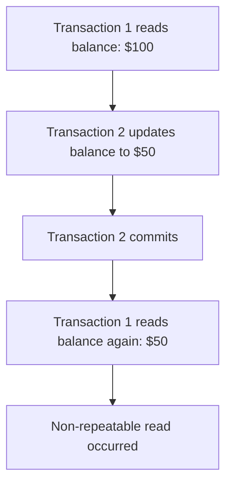
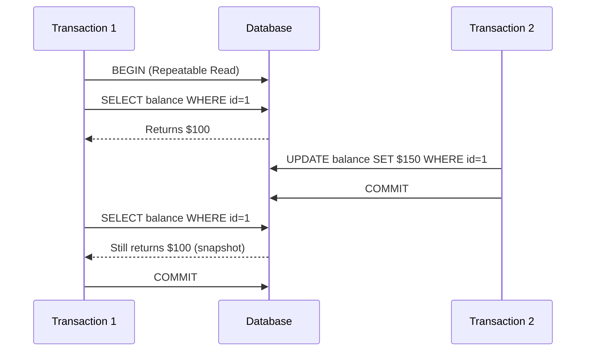
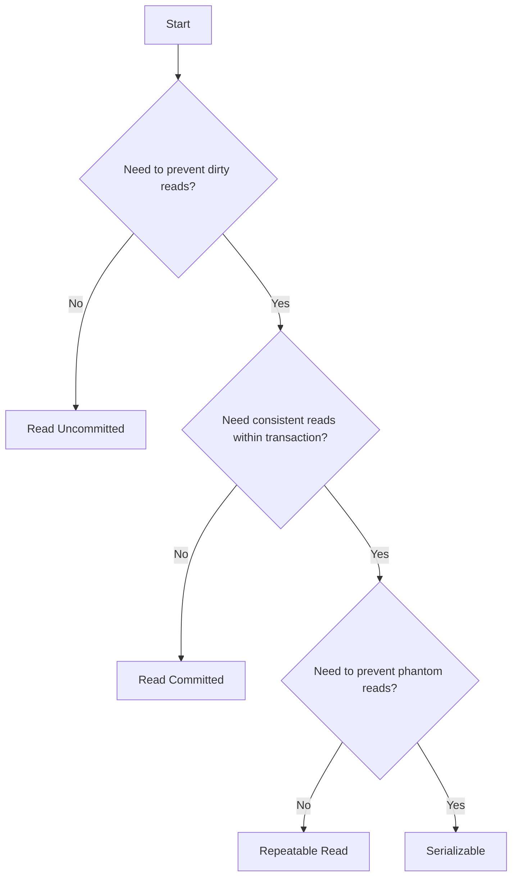

# How to Implement Transaction Isolation Levels

Author: [nawazdhandala](https://github.com/nawazdhandala)

Tags: Database, Transactions, ACID, Concurrency

Description: Learn to implement transaction isolation levels for data consistency and concurrent access control.

---

Transaction isolation levels determine how database transactions interact with each other when running concurrently. Choosing the right isolation level is critical for balancing data consistency against performance. This guide walks through each isolation level with practical examples you can apply in your applications.

## Understanding the Problem

When multiple transactions access the same data simultaneously, several anomalies can occur.



These anomalies fall into distinct categories that isolation levels are designed to prevent.

| Anomaly | Description | Example |
|---------|-------------|---------|
| Dirty Read | Reading uncommitted changes from another transaction | Transaction A reads data that Transaction B modified but has not committed |
| Non-repeatable Read | Same query returns different results within a transaction | Reading a row twice and getting different values because another transaction modified it |
| Phantom Read | New rows appear in repeated queries | Running the same SELECT twice and getting additional rows because another transaction inserted data |
| Lost Update | Two transactions overwrite each other's changes | Both transactions read the same value, modify it, and write back, losing one update |

## The Four Isolation Levels

SQL defines four standard isolation levels, each offering different guarantees.

| Isolation Level | Dirty Read | Non-repeatable Read | Phantom Read | Performance |
|-----------------|------------|---------------------|--------------|-------------|
| Read Uncommitted | Possible | Possible | Possible | Highest |
| Read Committed | Prevented | Possible | Possible | High |
| Repeatable Read | Prevented | Prevented | Possible | Medium |
| Serializable | Prevented | Prevented | Prevented | Lowest |


## Implementing Each Level

### Read Uncommitted

This level provides no isolation between transactions. It offers the best performance but should only be used when reading stale or uncommitted data is acceptable, such as for approximate analytics.

```sql
-- PostgreSQL: Set isolation level for the current transaction
BEGIN;
SET TRANSACTION ISOLATION LEVEL READ UNCOMMITTED;

-- This query might see uncommitted changes from other transactions
SELECT * FROM account_balances WHERE user_id = 123;

COMMIT;
```

In application code, you can set the isolation level programmatically.

```python
import psycopg2
from psycopg2 import sql
from psycopg2.extensions import ISOLATION_LEVEL_READ_UNCOMMITTED

# Connect and set isolation level
conn = psycopg2.connect(database="mydb")
conn.set_isolation_level(ISOLATION_LEVEL_READ_UNCOMMITTED)

cursor = conn.cursor()
cursor.execute("SELECT balance FROM accounts WHERE id = %s", (account_id,))
balance = cursor.fetchone()[0]

conn.commit()
conn.close()
```

### Read Committed

This is the default level in PostgreSQL and Oracle. Each query sees only committed data, but repeated queries within the same transaction may return different results if other transactions commit changes between reads.

```sql
-- PostgreSQL defaults to Read Committed
BEGIN;
SET TRANSACTION ISOLATION LEVEL READ COMMITTED;

-- First read: balance is $100
SELECT balance FROM accounts WHERE id = 1;

-- Another transaction commits, changing balance to $150

-- Second read: balance is now $150 (non-repeatable read)
SELECT balance FROM accounts WHERE id = 1;

COMMIT;
```

Here is a practical implementation in Node.js using a connection pool.

```javascript
const { Pool } = require('pg');

const pool = new Pool({
  connectionString: process.env.DATABASE_URL
});

async function getAccountBalance(accountId) {
  const client = await pool.connect();

  try {
    // Start transaction with Read Committed isolation
    await client.query('BEGIN');
    await client.query('SET TRANSACTION ISOLATION LEVEL READ COMMITTED');

    // Query sees only committed data
    const result = await client.query(
      'SELECT balance FROM accounts WHERE id = $1',
      [accountId]
    );

    await client.query('COMMIT');
    return result.rows[0]?.balance;

  } catch (error) {
    await client.query('ROLLBACK');
    throw error;
  } finally {
    client.release();
  }
}
```

### Repeatable Read

This level guarantees that if you read a row once in a transaction, subsequent reads will return the same data. MySQL uses this as the default.



This example demonstrates handling repeatable read in a transfer operation.

```python
import psycopg2
from psycopg2.extensions import ISOLATION_LEVEL_REPEATABLE_READ

def transfer_funds(from_account, to_account, amount):
    conn = psycopg2.connect(database="mydb")
    conn.set_isolation_level(ISOLATION_LEVEL_REPEATABLE_READ)

    try:
        cursor = conn.cursor()

        # Read source account balance
        # This snapshot is locked for the duration of the transaction
        cursor.execute(
            "SELECT balance FROM accounts WHERE id = %s FOR UPDATE",
            (from_account,)
        )
        source_balance = cursor.fetchone()[0]

        if source_balance < amount:
            raise ValueError("Insufficient funds")

        # Perform the transfer
        cursor.execute(
            "UPDATE accounts SET balance = balance - %s WHERE id = %s",
            (amount, from_account)
        )
        cursor.execute(
            "UPDATE accounts SET balance = balance + %s WHERE id = %s",
            (amount, to_account)
        )

        conn.commit()
        return True

    except Exception as e:
        conn.rollback()
        raise e
    finally:
        conn.close()
```

### Serializable

The strictest isolation level makes transactions appear as if they executed one after another. This prevents all anomalies but may cause serialization failures that require retry logic.

```sql
-- Serializable isolation prevents all anomalies
BEGIN;
SET TRANSACTION ISOLATION LEVEL SERIALIZABLE;

-- Check inventory before placing order
SELECT quantity FROM inventory WHERE product_id = 100;

-- If another serializable transaction modifies this row,
-- one transaction will be aborted with a serialization error
UPDATE inventory SET quantity = quantity - 1 WHERE product_id = 100;

COMMIT;
```

Applications must handle serialization failures gracefully.

```python
import psycopg2
from psycopg2 import errors
from psycopg2.extensions import ISOLATION_LEVEL_SERIALIZABLE
import time

def execute_with_retry(operation, max_retries=3):
    """
    Execute a database operation with automatic retry on serialization failure.
    """
    retries = 0

    while retries < max_retries:
        conn = psycopg2.connect(database="mydb")
        conn.set_isolation_level(ISOLATION_LEVEL_SERIALIZABLE)

        try:
            result = operation(conn)
            conn.commit()
            return result

        except errors.SerializationFailure:
            # Transaction was aborted due to concurrent modification
            conn.rollback()
            retries += 1
            # Exponential backoff before retry
            time.sleep(0.1 * (2 ** retries))

        except Exception as e:
            conn.rollback()
            raise e

        finally:
            conn.close()

    raise Exception("Max retries exceeded for serializable transaction")


def place_order(conn):
    cursor = conn.cursor()

    # Check and decrement inventory atomically
    cursor.execute("""
        UPDATE inventory
        SET quantity = quantity - 1
        WHERE product_id = %s AND quantity > 0
        RETURNING quantity
    """, (product_id,))

    result = cursor.fetchone()
    if result is None:
        raise ValueError("Product out of stock")

    return result[0]


# Usage with automatic retry
remaining = execute_with_retry(place_order)
```

## Choosing the Right Level

Consider these factors when selecting an isolation level.



For most web applications, Read Committed provides a good balance. Use Repeatable Read when you need consistent snapshots, such as generating reports. Reserve Serializable for operations where correctness is critical and you can tolerate retries, like financial transactions or inventory management.

## Database-Specific Considerations

Different databases implement isolation levels with subtle variations.

| Database | Default Level | Notes |
|----------|---------------|-------|
| PostgreSQL | Read Committed | Uses MVCC; Repeatable Read prevents phantom reads |
| MySQL/InnoDB | Repeatable Read | Uses gap locks to prevent some phantom reads |
| SQL Server | Read Committed | Offers snapshot isolation as an alternative |
| Oracle | Read Committed | Does not support Read Uncommitted |

## Conclusion

Transaction isolation levels give you control over the tradeoff between consistency and performance. Start with your database's default level and adjust based on your specific requirements. Always implement retry logic when using Serializable isolation, and test thoroughly with concurrent workloads to verify your application handles edge cases correctly.
