# How to Create Trend Analysis

Author: [nawazdhandala](https://github.com/nawazdhandala)

Tags: Capacity Planning, Analytics, SRE, Monitoring

Description: Learn how to perform trend analysis on infrastructure metrics for capacity forecasting.

---

## What is Trend Analysis?

Trend analysis is the practice of examining historical data to identify patterns and predict future values. For infrastructure and SRE teams, trend analysis answers critical questions:

- When will we run out of disk space?
- How much CPU capacity do we need next quarter?
- Are memory usage patterns indicating a leak?
- What traffic should we expect during the next holiday season?

This guide covers three foundational techniques: linear regression, moving averages, and seasonal decomposition. We will also explore practical implementations using Prometheus and Python.

---

## Why Trend Analysis Matters for Capacity Planning


Without trend analysis, teams operate reactively. They scramble to add capacity after outages instead of scaling ahead of demand. Proper forecasting enables:

- **Cost optimization**: Provision only what you need
- **Reliability**: Avoid resource exhaustion incidents
- **Planning confidence**: Back infrastructure requests with data
- **Early warning**: Detect anomalies before they become incidents

---

## Linear Regression: Predicting Future Values

Linear regression fits a straight line through your data points. The line equation `y = mx + b` gives you:
- `m`: The slope (rate of change)
- `b`: The y-intercept (starting value)

### When to Use Linear Regression

Linear regression works well when:
- Growth is steady and consistent
- You need a simple, explainable model
- Short to medium term forecasting (days to weeks)


### Prometheus predict_linear() Function

Prometheus provides a built-in function for linear regression forecasting. The `predict_linear()` function extrapolates the value of a time series at a future point based on linear regression.

```promql
# Predict disk usage 24 hours from now
# Uses the last 7 days of data to fit the trend line
predict_linear(
    node_filesystem_avail_bytes{mountpoint="/"}[7d],
    24 * 3600
)
```

Let us break down this query:

```promql
# predict_linear(metric[lookback_window], seconds_ahead)
#
# Arguments:
#   metric[lookback_window] - The metric and time range to analyze
#   seconds_ahead           - How far into the future to predict
#
# Example: Alert when disk will fill in 4 hours
# This query returns bytes available 4 hours from now

predict_linear(
    node_filesystem_avail_bytes{
        mountpoint="/",
        job="node-exporter"
    }[1d],          # Use last 24 hours of data for regression
    4 * 3600        # Predict 4 hours ahead (4 * 3600 seconds)
)
```

### Practical Alerting with predict_linear()

Create an alert that fires when disk space will be exhausted within 4 hours:

```yaml
# Prometheus alerting rule for disk exhaustion prediction
# File: /etc/prometheus/rules/capacity-alerts.yml

groups:
  - name: capacity_predictions
    rules:
      # Alert when disk will fill within 4 hours
      - alert: DiskWillFillIn4Hours
        expr: |
          predict_linear(
            node_filesystem_avail_bytes{
              fstype!~"tmpfs|overlay"
            }[6h],
            4 * 3600
          ) < 0
        for: 30m
        labels:
          severity: warning
        annotations:
          summary: "Disk {{ $labels.mountpoint }} filling up"
          description: |
            Based on current growth rate, disk {{ $labels.mountpoint }}
            on {{ $labels.instance }} will be full within 4 hours.
            Current available: {{ $value | humanize1024 }}B

      # Alert when memory will be exhausted in 1 hour
      - alert: MemoryExhaustionPredicted
        expr: |
          predict_linear(
            node_memory_MemAvailable_bytes[1h],
            3600
          ) < 0
        for: 10m
        labels:
          severity: critical
        annotations:
          summary: "Memory exhaustion predicted on {{ $labels.instance }}"
```

### Python Implementation of Linear Regression

For more control and analysis, implement linear regression in Python:

```python
"""
Linear regression for capacity forecasting.

This module provides functions to analyze metric trends
and predict future resource utilization.
"""

import numpy as np
from datetime import datetime, timedelta
from typing import Tuple, List


def linear_regression(
    timestamps: List[float],
    values: List[float]
) -> Tuple[float, float]:
    """
    Calculate linear regression coefficients.

    Uses the least squares method to find the best fit line
    through the data points.

    Args:
        timestamps: Unix timestamps (seconds since epoch)
        values: Metric values corresponding to each timestamp

    Returns:
        Tuple of (slope, intercept) where:
          - slope: Rate of change per second
          - intercept: Value at timestamp 0

    Example:
        >>> times = [1000, 2000, 3000, 4000]
        >>> vals = [10, 20, 30, 40]
        >>> slope, intercept = linear_regression(times, vals)
        >>> slope
        0.01  # Value increases by 0.01 per second
    """
    # Convert to numpy arrays for vectorized operations
    x = np.array(timestamps)
    y = np.array(values)

    # Number of data points
    n = len(x)

    # Calculate means
    x_mean = np.mean(x)
    y_mean = np.mean(y)

    # Calculate slope using least squares formula:
    # slope = sum((x - x_mean)(y - y_mean)) / sum((x - x_mean)^2)
    numerator = np.sum((x - x_mean) * (y - y_mean))
    denominator = np.sum((x - x_mean) ** 2)

    slope = numerator / denominator

    # Calculate intercept: y = mx + b => b = y_mean - m * x_mean
    intercept = y_mean - slope * x_mean

    return slope, intercept


def predict_value(
    slope: float,
    intercept: float,
    future_timestamp: float
) -> float:
    """
    Predict value at a future timestamp.

    Args:
        slope: Rate of change per second
        intercept: Value at timestamp 0
        future_timestamp: Unix timestamp to predict

    Returns:
        Predicted value at the future timestamp
    """
    return slope * future_timestamp + intercept


def time_until_threshold(
    slope: float,
    intercept: float,
    current_time: float,
    threshold: float
) -> float:
    """
    Calculate time until a threshold is reached.

    Args:
        slope: Rate of change per second
        intercept: Value at timestamp 0
        current_time: Current unix timestamp
        threshold: Target value to reach

    Returns:
        Seconds until threshold is reached.
        Returns float('inf') if threshold will never be reached.
        Returns 0 if already past threshold.
    """
    if slope == 0:
        # No change, threshold will never be reached
        return float('inf')

    # Solve for t: threshold = slope * t + intercept
    # t = (threshold - intercept) / slope
    target_time = (threshold - intercept) / slope

    seconds_remaining = target_time - current_time

    if seconds_remaining < 0:
        return 0  # Already past threshold

    return seconds_remaining


# Example usage
if __name__ == "__main__":
    # Simulated disk usage data (percentage used)
    # Collected hourly over the past 24 hours
    base_time = datetime.now().timestamp()
    hour_seconds = 3600

    # Generate sample data: disk filling at ~1% per hour
    timestamps = [
        base_time - (24 - i) * hour_seconds
        for i in range(24)
    ]
    disk_usage = [
        50 + i * 1.0 + np.random.normal(0, 0.5)  # ~1% growth + noise
        for i in range(24)
    ]

    # Calculate trend
    slope, intercept = linear_regression(timestamps, disk_usage)

    # Predict usage in 24 hours
    future_time = base_time + 24 * hour_seconds
    predicted_usage = predict_value(slope, intercept, future_time)

    print(f"Current usage: {disk_usage[-1]:.1f}%")
    print(f"Predicted usage in 24h: {predicted_usage:.1f}%")
    print(f"Growth rate: {slope * hour_seconds:.2f}% per hour")

    # Time until disk is full (100%)
    seconds_to_full = time_until_threshold(
        slope, intercept, base_time, 100
    )
    hours_to_full = seconds_to_full / 3600
    print(f"Time until disk full: {hours_to_full:.1f} hours")
```

---

## Moving Averages: Smoothing Noisy Data

Moving averages smooth out short-term fluctuations to reveal underlying trends. They are essential when your data is noisy but you need to identify the general direction.


### Types of Moving Averages


### Prometheus avg_over_time() for Moving Averages

```promql
# Simple moving average of CPU usage over 1 hour
# Useful for dashboards to reduce visual noise
avg_over_time(
    node_cpu_seconds_total{mode="idle"}[1h]
)

# Compare current value to moving average
# Values > 1 indicate above-average usage
node_memory_MemUsed_bytes
/
avg_over_time(node_memory_MemUsed_bytes[24h])

# Alert when memory exceeds 1.5x the daily average
# This catches unusual spikes that may indicate problems
(
    node_memory_MemUsed_bytes
    /
    avg_over_time(node_memory_MemUsed_bytes[24h])
) > 1.5
```

### Python Implementation of Moving Averages

```python
"""
Moving average implementations for metric smoothing.

Moving averages help filter noise from time series data,
making trends easier to identify and analyze.
"""

import numpy as np
from typing import List, Optional
from collections import deque


def simple_moving_average(
    values: List[float],
    window_size: int
) -> List[float]:
    """
    Calculate Simple Moving Average (SMA).

    SMA gives equal weight to all values in the window.
    Best for data with consistent volatility.

    Args:
        values: Time series data points
        window_size: Number of points to average

    Returns:
        List of averaged values (shorter than input by window_size - 1)

    Example:
        >>> values = [10, 20, 30, 40, 50]
        >>> simple_moving_average(values, 3)
        [20.0, 30.0, 40.0]
    """
    if window_size > len(values):
        raise ValueError(
            f"Window size ({window_size}) cannot exceed "
            f"data length ({len(values)})"
        )

    result = []

    # Use a sliding window approach
    for i in range(len(values) - window_size + 1):
        window = values[i:i + window_size]
        average = sum(window) / window_size
        result.append(average)

    return result


def exponential_moving_average(
    values: List[float],
    span: int
) -> List[float]:
    """
    Calculate Exponential Moving Average (EMA).

    EMA gives more weight to recent values, making it
    more responsive to recent changes than SMA.

    The smoothing factor alpha = 2 / (span + 1)
    Higher span = smoother output, slower response
    Lower span = noisier output, faster response

    Args:
        values: Time series data points
        span: The decay span (similar to window size concept)

    Returns:
        List of EMA values (same length as input)

    Example:
        >>> values = [10, 20, 30, 40, 50]
        >>> exponential_moving_average(values, 3)
        [10.0, 15.0, 22.5, 31.25, 40.625]
    """
    if not values:
        return []

    # Calculate smoothing factor
    # Common formula: alpha = 2 / (span + 1)
    alpha = 2 / (span + 1)

    result = [values[0]]  # First value is unchanged

    for i in range(1, len(values)):
        # EMA formula: EMA_today = alpha * value + (1 - alpha) * EMA_yesterday
        ema = alpha * values[i] + (1 - alpha) * result[-1]
        result.append(ema)

    return result


def weighted_moving_average(
    values: List[float],
    weights: List[float]
) -> List[float]:
    """
    Calculate Weighted Moving Average (WMA).

    WMA allows custom weighting of values in the window.
    Useful when you have domain knowledge about which
    data points matter more.

    Args:
        values: Time series data points
        weights: Custom weights for each position in window
                 (weights are normalized automatically)

    Returns:
        List of weighted average values

    Example:
        >>> values = [10, 20, 30, 40, 50]
        >>> weights = [1, 2, 3]  # Recent values weighted more
        >>> weighted_moving_average(values, weights)
        [23.33, 33.33, 43.33]
    """
    window_size = len(weights)

    if window_size > len(values):
        raise ValueError(
            f"Weights length ({window_size}) cannot exceed "
            f"data length ({len(values)})"
        )

    # Normalize weights to sum to 1
    weight_sum = sum(weights)
    normalized_weights = [w / weight_sum for w in weights]

    result = []

    for i in range(len(values) - window_size + 1):
        window = values[i:i + window_size]
        weighted_sum = sum(
            v * w for v, w in zip(window, normalized_weights)
        )
        result.append(weighted_sum)

    return result


class StreamingEMA:
    """
    Streaming Exponential Moving Average calculator.

    Use this when processing data in real-time rather than
    in batch. Maintains state between updates.

    Example:
        >>> ema = StreamingEMA(span=10)
        >>> for value in incoming_metrics:
        ...     smoothed = ema.update(value)
        ...     print(f"Smoothed: {smoothed}")
    """

    def __init__(self, span: int):
        """
        Initialize streaming EMA.

        Args:
            span: Decay span for smoothing factor calculation
        """
        self.alpha = 2 / (span + 1)
        self.current_ema: Optional[float] = None

    def update(self, value: float) -> float:
        """
        Update EMA with new value.

        Args:
            value: New data point

        Returns:
            Updated EMA value
        """
        if self.current_ema is None:
            self.current_ema = value
        else:
            self.current_ema = (
                self.alpha * value +
                (1 - self.alpha) * self.current_ema
            )
        return self.current_ema

    def reset(self):
        """Reset the EMA state."""
        self.current_ema = None


# Demonstration of moving averages
if __name__ == "__main__":
    # Sample noisy CPU usage data
    np.random.seed(42)

    # Generate data: underlying trend of 50% + noise + occasional spikes
    raw_data = [
        50 + np.random.normal(0, 5) + (20 if i % 10 == 0 else 0)
        for i in range(50)
    ]

    # Apply different smoothing methods
    sma_5 = simple_moving_average(raw_data, 5)
    ema_5 = exponential_moving_average(raw_data, 5)

    print("Comparison of raw vs smoothed (last 5 values):")
    print(f"Raw:  {[f'{v:.1f}' for v in raw_data[-5:]]}")
    print(f"SMA5: {[f'{v:.1f}' for v in sma_5[-5:]]}")
    print(f"EMA5: {[f'{v:.1f}' for v in ema_5[-5:]]}")
```

---

## Seasonal Patterns: Handling Cyclical Data

Real infrastructure metrics rarely follow straight lines. Traffic peaks during business hours, batch jobs run nightly, and monthly billing cycles create load spikes. Seasonal decomposition separates these components:


### Common Seasonal Patterns in Infrastructure

```mermaid
gantt
    title Daily Traffic Pattern
    dateFormat HH:mm
    axisFormat %H:%M

    section Traffic Level
    Low (Night)      :done, 00:00, 6h
    Ramp Up (Morning):active, 06:00, 3h
    Peak (Business)  :crit, 09:00, 9h
    Wind Down        :active, 18:00, 4h
    Low (Night)      :done, 22:00, 2h
```



### Prometheus Queries for Seasonal Analysis

```promql
# Compare current hour to same hour last week
# Useful for detecting anomalies vs normal weekly patterns
node_cpu_seconds_total{mode="idle"}
/
(
    node_cpu_seconds_total{mode="idle"} offset 7d
)

# Calculate hour-over-hour change ratio
# Values significantly different from 1.0 may indicate problems
rate(http_requests_total[1h])
/
rate(http_requests_total[1h] offset 1d)

# Alert if traffic is less than 50% of same time yesterday
# Catches unexpected traffic drops that may indicate issues
(
    rate(http_requests_total[5m])
    /
    rate(http_requests_total[5m] offset 1d)
) < 0.5
```

### Python Implementation of Seasonal Decomposition

```python
"""
Seasonal decomposition for infrastructure metrics.

This module implements additive seasonal decomposition,
separating time series into trend, seasonal, and residual
components for better forecasting.
"""

import numpy as np
from typing import List, Tuple, NamedTuple
from dataclasses import dataclass


@dataclass
class DecompositionResult:
    """
    Result of seasonal decomposition.

    Attributes:
        trend: Long-term trend component
        seasonal: Repeating seasonal pattern
        residual: Remaining unexplained variation
        period: Length of one seasonal cycle
    """
    trend: List[float]
    seasonal: List[float]
    residual: List[float]
    period: int


def seasonal_decompose(
    values: List[float],
    period: int
) -> DecompositionResult:
    """
    Perform additive seasonal decomposition.

    Decomposes a time series into:
      observed = trend + seasonal + residual

    This implementation uses a centered moving average for
    trend extraction and averages over periods for seasonal
    component estimation.

    Args:
        values: Time series data points
        period: Length of seasonal cycle
                (e.g., 24 for hourly data with daily pattern,
                 7 for daily data with weekly pattern)

    Returns:
        DecompositionResult with trend, seasonal, and residual

    Example:
        >>> # Hourly data with daily seasonality
        >>> result = seasonal_decompose(hourly_cpu_data, period=24)
        >>> print(f"Peak hour seasonal effect: {max(result.seasonal)}")
    """
    n = len(values)

    if period > n // 2:
        raise ValueError(
            f"Period ({period}) must be at most half the data length ({n})"
        )

    # Step 1: Extract trend using centered moving average
    # This smooths out seasonal variations
    trend = _centered_moving_average(values, period)

    # Step 2: Remove trend to get seasonal + residual
    # (detrended series)
    detrended = []
    for i, val in enumerate(values):
        if trend[i] is not None:
            detrended.append(val - trend[i])
        else:
            detrended.append(None)

    # Step 3: Calculate seasonal component
    # Average the detrended values for each position in the cycle
    seasonal = _calculate_seasonal_component(detrended, period)

    # Step 4: Calculate residual
    # residual = observed - trend - seasonal
    residual = []
    for i in range(n):
        if trend[i] is not None:
            res = values[i] - trend[i] - seasonal[i % period]
            residual.append(res)
        else:
            residual.append(None)

    # Expand seasonal pattern to match data length
    full_seasonal = [seasonal[i % period] for i in range(n)]

    return DecompositionResult(
        trend=trend,
        seasonal=full_seasonal,
        residual=residual,
        period=period
    )


def _centered_moving_average(
    values: List[float],
    window: int
) -> List[float]:
    """
    Calculate centered moving average.

    Centers the window on each point, which produces
    better trend estimates than trailing averages.
    Edge values are set to None where the window cannot
    be centered.

    Args:
        values: Input time series
        window: Window size for averaging

    Returns:
        Centered moving average with None at edges
    """
    n = len(values)
    result = [None] * n

    # Handle even window sizes
    half_window = window // 2

    for i in range(half_window, n - half_window):
        # Sum values in the centered window
        window_vals = values[i - half_window:i + half_window + 1]

        # For even windows, we need to handle edges specially
        if window % 2 == 0:
            # Average the two edge values to center properly
            window_vals = values[i - half_window:i + half_window]
            avg = sum(window_vals) / len(window_vals)
        else:
            avg = sum(window_vals) / len(window_vals)

        result[i] = avg

    return result


def _calculate_seasonal_component(
    detrended: List[float],
    period: int
) -> List[float]:
    """
    Calculate average seasonal effect for each cycle position.

    Groups values by their position in the cycle and averages
    them to find the typical seasonal effect.

    Args:
        detrended: Data with trend removed
        period: Seasonal period length

    Returns:
        Seasonal component (length = period)
    """
    # Group values by position in cycle
    period_values = [[] for _ in range(period)]

    for i, val in enumerate(detrended):
        if val is not None:
            period_values[i % period].append(val)

    # Calculate average for each position
    seasonal = []
    for position_vals in period_values:
        if position_vals:
            seasonal.append(np.mean(position_vals))
        else:
            seasonal.append(0)

    # Center the seasonal component (remove mean)
    # This ensures seasonal effects sum to zero
    seasonal_mean = np.mean(seasonal)
    seasonal = [s - seasonal_mean for s in seasonal]

    return seasonal


def forecast_with_seasonality(
    decomposition: DecompositionResult,
    values: List[float],
    periods_ahead: int
) -> List[float]:
    """
    Forecast future values using decomposition results.

    Extrapolates trend and applies seasonal pattern to
    generate future predictions.

    Args:
        decomposition: Result from seasonal_decompose()
        values: Original time series
        periods_ahead: Number of future periods to forecast

    Returns:
        List of forecasted values
    """
    n = len(values)
    period = decomposition.period

    # Get recent trend values (excluding None)
    valid_trends = [
        (i, t) for i, t in enumerate(decomposition.trend)
        if t is not None
    ]

    if len(valid_trends) < 2:
        raise ValueError("Insufficient trend data for forecasting")

    # Fit linear regression to trend
    indices = [v[0] for v in valid_trends]
    trend_vals = [v[1] for v in valid_trends]

    # Simple linear fit for trend extrapolation
    x = np.array(indices)
    y = np.array(trend_vals)
    slope = np.sum((x - x.mean()) * (y - y.mean())) / np.sum((x - x.mean())**2)
    intercept = y.mean() - slope * x.mean()

    # Generate forecasts
    forecasts = []
    for i in range(periods_ahead):
        future_index = n + i

        # Extrapolate trend
        trend_forecast = slope * future_index + intercept

        # Add seasonal component
        seasonal_effect = decomposition.seasonal[future_index % period]

        forecast = trend_forecast + seasonal_effect
        forecasts.append(forecast)

    return forecasts


# Example: Analyzing daily traffic patterns
if __name__ == "__main__":
    np.random.seed(42)

    # Generate 7 days of hourly data
    # Pattern: base load + daily cycle + linear growth + noise
    hours = 24 * 7  # One week of hourly data

    data = []
    for hour in range(hours):
        # Base load
        base = 1000

        # Daily seasonal pattern (peak at hour 14, low at hour 4)
        hour_of_day = hour % 24
        seasonal = 200 * np.sin(2 * np.pi * (hour_of_day - 6) / 24)

        # Linear growth trend
        trend = 0.5 * hour

        # Random noise
        noise = np.random.normal(0, 30)

        data.append(base + seasonal + trend + noise)

    # Decompose the time series
    result = seasonal_decompose(data, period=24)

    print("Seasonal Decomposition Results:")
    print(f"Period: {result.period} hours (daily)")
    print(f"\nHourly seasonal effects:")

    for hour in range(24):
        effect = result.seasonal[hour]
        bar = "+" * int(abs(effect) / 10) if effect > 0 else "-" * int(abs(effect) / 10)
        print(f"  Hour {hour:02d}: {effect:+7.1f} {bar}")

    # Forecast next 24 hours
    forecasts = forecast_with_seasonality(result, data, 24)

    print(f"\nForecast for next 24 hours:")
    print(f"  Min: {min(forecasts):.0f}")
    print(f"  Max: {max(forecasts):.0f}")
    print(f"  Mean: {np.mean(forecasts):.0f}")
```

---

## Putting It All Together: A Complete Forecasting Pipeline


### Complete Prometheus Rules for Capacity Planning

```yaml
# File: /etc/prometheus/rules/capacity-planning.yml
# Comprehensive capacity planning rules

groups:
  - name: capacity_forecasting
    interval: 5m
    rules:

      # Record smoothed disk usage for trend analysis
      - record: instance:disk_used_percent:avg_1h
        expr: |
          100 - (
            avg_over_time(
              node_filesystem_avail_bytes{fstype!~"tmpfs|overlay"}[1h]
            )
            /
            node_filesystem_size_bytes{fstype!~"tmpfs|overlay"}
            * 100
          )

      # Record memory usage trend
      - record: instance:memory_used_percent:avg_1h
        expr: |
          100 * (
            1 - avg_over_time(node_memory_MemAvailable_bytes[1h])
            / node_memory_MemTotal_bytes
          )

      # Disk exhaustion prediction (hours until full)
      - record: instance:disk_hours_until_full
        expr: |
          (
            node_filesystem_avail_bytes{fstype!~"tmpfs|overlay"}
            /
            (
              deriv(node_filesystem_avail_bytes{fstype!~"tmpfs|overlay"}[6h])
              * -1
            )
          ) / 3600

  - name: capacity_alerts
    rules:

      # Alert: Disk will fill within 24 hours
      - alert: DiskExhaustionIn24Hours
        expr: |
          predict_linear(
            node_filesystem_avail_bytes{fstype!~"tmpfs|overlay"}[24h],
            24 * 3600
          ) < 0
          and
          node_filesystem_avail_bytes{fstype!~"tmpfs|overlay"} > 0
        for: 1h
        labels:
          severity: warning
        annotations:
          summary: "Disk exhaustion predicted within 24 hours"
          description: |
            Disk {{ $labels.mountpoint }} on {{ $labels.instance }}
            is predicted to fill within 24 hours based on current
            growth rate. Current free space:
            {{ $value | humanize1024 }}B

      # Alert: Memory growth anomaly
      - alert: MemoryGrowthAnomaly
        expr: |
          (
            rate(node_memory_MemUsed_bytes[1h])
            /
            rate(node_memory_MemUsed_bytes[1h] offset 1d)
          ) > 2
        for: 30m
        labels:
          severity: warning
        annotations:
          summary: "Memory growth 2x higher than yesterday"
          description: |
            Memory consumption rate on {{ $labels.instance }}
            is growing at 2x the rate of the same time yesterday.
            This may indicate a memory leak or unexpected load.

      # Alert: Traffic significantly below seasonal norm
      - alert: TrafficBelowSeasonalNorm
        expr: |
          (
            sum(rate(http_requests_total[5m])) by (job)
            /
            sum(rate(http_requests_total[5m] offset 7d)) by (job)
          ) < 0.5
        for: 15m
        labels:
          severity: warning
        annotations:
          summary: "Traffic 50% below same time last week"
          description: |
            Traffic for {{ $labels.job }} is significantly below
            the seasonal norm. This may indicate an outage upstream
            or a configuration problem.
```

---

## Best Practices for Trend Analysis

### Choosing the Right Lookback Window

| Use Case | Recommended Window | Rationale |
|----------|-------------------|-----------|
| Disk exhaustion alerts | 6h to 24h | Captures daily patterns without too much lag |
| Memory leak detection | 1h to 6h | Leaks need fast detection |
| Capacity planning | 7d to 30d | Long-term trends need more data |
| Traffic anomaly detection | Compare to 7d ago | Weekly seasonality is common |

### Common Pitfalls to Avoid

1. **Too short lookback**: Noisy predictions based on temporary spikes
2. **Too long lookback**: Slow response to genuine changes in trend
3. **Ignoring seasonality**: Linear predictions fail for cyclical workloads
4. **Alert fatigue**: Tune thresholds to avoid noise while catching real issues
5. **Stale data**: Ensure metrics collection is continuous and reliable

### Validation Checklist


---

## Conclusion

Trend analysis transforms reactive firefighting into proactive capacity management. The key techniques covered in this guide include:

- **Linear regression** for simple, steady growth patterns and Prometheus `predict_linear()` for built-in forecasting
- **Moving averages** for smoothing noisy data and identifying underlying trends
- **Seasonal decomposition** for handling cyclical patterns like daily traffic or weekly batch jobs

Start simple. Implement disk exhaustion alerts using `predict_linear()` first. Once you are comfortable with basic forecasting, add seasonal analysis for more sophisticated capacity planning.

The goal is not perfect predictions. The goal is early warning, buying you time to act before resources run out.

---

## Further Reading

- [Prometheus Documentation: predict_linear()](https://prometheus.io/docs/prometheus/latest/querying/functions/#predict_linear)
- [Google SRE Book: Practical Alerting](https://sre.google/sre-book/practical-alerting/)
- [Time Series Analysis Fundamentals](https://otexts.com/fpp3/)

---
