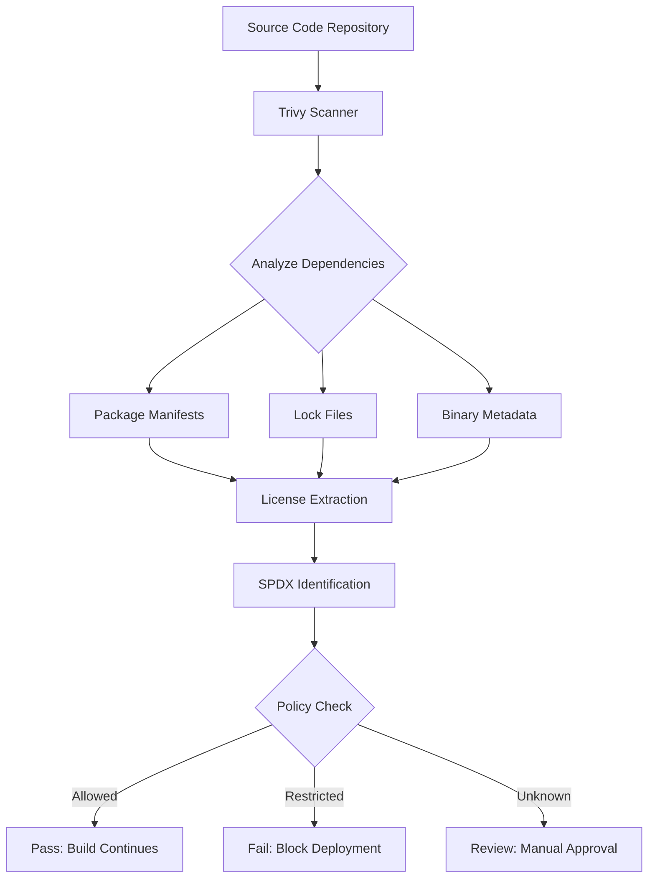
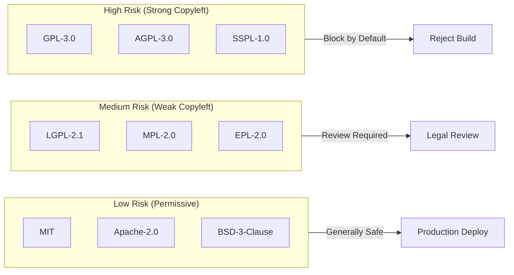

# How to Build Trivy License Scanning

Author: [nawazdhandala](https://github.com/nawazdhandala)

Tags: Trivy, Security, Licensing, Compliance

Description: Automate open source license compliance checking with Trivy to detect restricted licenses and enforce organizational policies in your CI/CD pipeline.

---

Software licenses are legal contracts. Using a library with an incompatible license can force you to open-source your proprietary code or face litigation. Trivy scans your dependencies for license information and flags violations before they reach production.

## How License Detection Works

Trivy analyzes package manifests, lockfiles, and binary metadata to identify licenses. It cross-references findings against the SPDX (Software Package Data Exchange) license list, which standardizes license identifiers across ecosystems.



## Basic License Scanning

Run a filesystem scan to detect licenses in your project. Trivy examines all supported package formats and reports findings.

```bash
# Scan current directory for licenses
# --scanners license: Enable only license scanning (skip vulnerabilities)
# --format table: Human-readable output for terminal review
trivy fs --scanners license --format table .

# Scan a container image for licenses
# Useful for auditing third-party images before deployment
trivy image --scanners license alpine:latest

# Output results as JSON for programmatic processing
# Pipe to jq for filtering or integration with other tools
trivy fs --scanners license --format json . > licenses.json
```

## SPDX License Identification

SPDX provides standardized identifiers for over 500 licenses. Trivy maps discovered licenses to these identifiers for consistent policy enforcement.

Common SPDX identifiers you will encounter:

| SPDX Identifier | License Name | Risk Level |
|-----------------|--------------|------------|
| MIT | MIT License | Low |
| Apache-2.0 | Apache License 2.0 | Low |
| BSD-3-Clause | BSD 3-Clause | Low |
| GPL-3.0-only | GNU GPL v3 | High (copyleft) |
| AGPL-3.0-only | GNU Affero GPL v3 | High (network copyleft) |
| LGPL-2.1-only | GNU LGPL v2.1 | Medium (weak copyleft) |
| MPL-2.0 | Mozilla Public License 2.0 | Medium |
| CDDL-1.0 | Common Development and Distribution License | Medium |
| Unlicense | The Unlicense | Low |
| BUSL-1.1 | Business Source License 1.1 | High (commercial restriction) |

## License Risk Categorization

Organizations typically classify licenses into three risk categories based on legal obligations and business model compatibility.



**Low Risk (Permissive)**: Allow commercial use with minimal obligations. Usually require attribution only.

**Medium Risk (Weak Copyleft)**: Require sharing modifications to the licensed component itself, but not your entire application.

**High Risk (Strong Copyleft)**: May require releasing your entire application under the same license if you distribute it.

## Creating a License Policy File

Trivy uses YAML policy files to define allowed, denied, and flagged licenses. Store this in your repository for version-controlled compliance rules.

```yaml
# trivy-license-policy.yaml
# Define organizational license compliance rules

# Packages matching these rules are always allowed
allowlist:
  licenses:
    - MIT
    - Apache-2.0
    - BSD-2-Clause
    - BSD-3-Clause
    - ISC
    - Unlicense
    - CC0-1.0
    - 0BSD
  # Allow specific packages regardless of license (use sparingly)
  packages:
    - name: "gnu-libc"
      reason: "System library, not distributed with application"

# Packages matching these rules will fail the scan
denylist:
  licenses:
    - GPL-3.0-only
    - GPL-3.0-or-later
    - AGPL-3.0-only
    - AGPL-3.0-or-later
    - SSPL-1.0
    - BUSL-1.1
  # Block specific packages regardless of license
  packages:
    - name: "crypto-banned-lib"
      reason: "Export control restrictions"

# Packages matching these rules generate warnings but do not fail
# Use for licenses requiring legal review before approval
flaglist:
  licenses:
    - LGPL-2.1-only
    - LGPL-2.1-or-later
    - LGPL-3.0-only
    - MPL-2.0
    - EPL-2.0
    - CDDL-1.0
```

## Running Scans with Policy Enforcement

Apply your policy file during scans to automate compliance checking. Non-compliant dependencies will cause the scan to exit with a non-zero status.

```bash
# Run license scan with policy enforcement
# --license-policy: Path to your policy YAML file
# --exit-code 1: Return exit code 1 if policy violations found
trivy fs --scanners license \
  --license-policy trivy-license-policy.yaml \
  --exit-code 1 \
  .

# Scan with severity filtering
# Only fail on high-severity (denied) licenses, warn on others
trivy fs --scanners license \
  --license-policy trivy-license-policy.yaml \
  --severity HIGH \
  --exit-code 1 \
  .

# Generate compliance report in SARIF format for GitHub integration
# SARIF uploads to GitHub Security tab for visibility
trivy fs --scanners license \
  --license-policy trivy-license-policy.yaml \
  --format sarif \
  --output license-results.sarif \
  .
```

## CI/CD Integration Example

Integrate license scanning into your GitHub Actions workflow to block merges that introduce restricted licenses.

```yaml
# .github/workflows/license-compliance.yaml
name: License Compliance Check

on:
  pull_request:
    branches: [main, master]
  push:
    branches: [main, master]

jobs:
  license-scan:
    runs-on: ubuntu-latest
    steps:
      - name: Checkout code
        uses: actions/checkout@v4

      - name: Install Trivy
        # Use official Trivy action for caching and version management
        uses: aquasecurity/trivy-action@master
        with:
          scan-type: 'fs'
          scanners: 'license'
          # Path to policy file in repository
          trivy-config: trivy-license-policy.yaml
          # Fail workflow on policy violations
          exit-code: '1'
          # Output format for GitHub Security integration
          format: 'sarif'
          output: 'trivy-license-results.sarif'

      - name: Upload results to GitHub Security
        # Upload even on failure to show violations in Security tab
        if: always()
        uses: github/codeql-action/upload-sarif@v3
        with:
          sarif_file: 'trivy-license-results.sarif'

      - name: Generate license summary
        # Create human-readable summary for PR comments
        if: failure()
        run: |
          echo "## License Compliance Failed" >> $GITHUB_STEP_SUMMARY
          echo "Review the Security tab for detailed violations." >> $GITHUB_STEP_SUMMARY
          trivy fs --scanners license --format table . >> $GITHUB_STEP_SUMMARY
```

## Handling Unknown Licenses

Some packages lack standard license declarations or use custom licenses. Trivy reports these as "Unknown" which requires manual review.

```bash
# List all packages with unknown licenses
# Filter JSON output to find packages needing review
trivy fs --scanners license --format json . | \
  jq '.Results[].Licenses[] | select(.Name == "Unknown" or .Name == "")'

# Common causes of unknown licenses:
# 1. Missing LICENSE file in package
# 2. Non-standard license text
# 3. Multiple licenses (complex expressions)
# 4. Binary-only distributions
```

Add approved unknown-license packages to your allowlist after legal review:

```yaml
# trivy-license-policy.yaml
allowlist:
  packages:
    - name: "internal-shared-lib"
      version: ">=1.0.0"
      reason: "Internal package, proprietary license approved by legal team"
    - name: "legacy-vendor-sdk"
      reason: "Commercial license on file, contract #12345"
```

## Generating License Reports

Create comprehensive license reports for legal teams and compliance audits.

```bash
# Generate full SBOM with license information
# CycloneDX format is widely supported by compliance tools
trivy fs --scanners license \
  --format cyclonedx \
  --output sbom-with-licenses.json \
  .

# Generate SPDX format for organizations using SPDX tooling
trivy fs --scanners license \
  --format spdx-json \
  --output licenses.spdx.json \
  .

# Create HTML report for stakeholder review
# Requires trivy-report template or custom formatting
trivy fs --scanners license \
  --format template \
  --template "@contrib/html.tpl" \
  --output license-report.html \
  .
```

## Multi-Project License Aggregation

For organizations with multiple repositories, aggregate license data into a central compliance database.

```bash
#!/bin/bash
# scan-all-repos.sh
# Scan multiple repositories and aggregate results

REPOS=(
  "/path/to/frontend"
  "/path/to/backend"
  "/path/to/shared-libs"
)

OUTPUT_DIR="./license-reports"
mkdir -p "$OUTPUT_DIR"

for repo in "${REPOS[@]}"; do
  repo_name=$(basename "$repo")
  echo "Scanning $repo_name..."

  # Generate JSON report for each repository
  trivy fs --scanners license \
    --format json \
    "$repo" > "$OUTPUT_DIR/${repo_name}-licenses.json"
done

# Aggregate all unique licenses across projects
# Useful for organization-wide license inventory
jq -s '[.[].Results[].Licenses[].Name] | unique | sort' \
  "$OUTPUT_DIR"/*.json > "$OUTPUT_DIR/all-licenses.json"

echo "License inventory saved to $OUTPUT_DIR/all-licenses.json"
```

## Best Practices for License Compliance

1. **Scan Early**: Run license checks on pull requests before code merges, not just before releases.

2. **Version Your Policy**: Store trivy-license-policy.yaml in version control. Changes to allowed licenses should go through code review.

3. **Document Exceptions**: When adding packages to the allowlist, include the reason and any legal approval references.

4. **Review Regularly**: Licenses can change between package versions. Scan dependencies after every update.

5. **Separate Prod and Dev**: Development-only dependencies (test frameworks, linters) may have different license requirements since they are not distributed.

6. **Monitor Transitive Dependencies**: A package with MIT license may depend on GPL-licensed code. Trivy scans the full dependency tree.

---

License compliance is a continuous process. Trivy automates the detection, but humans must define the policies and review edge cases. Integrate scanning into your CI pipeline, maintain clear policies, and involve legal teams when licenses fall outside your approved list.
