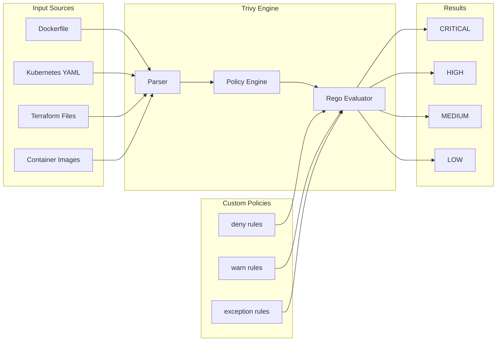
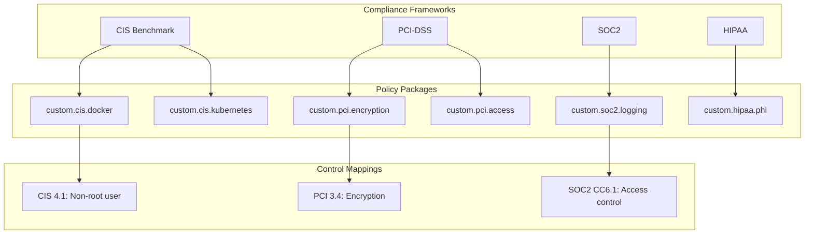
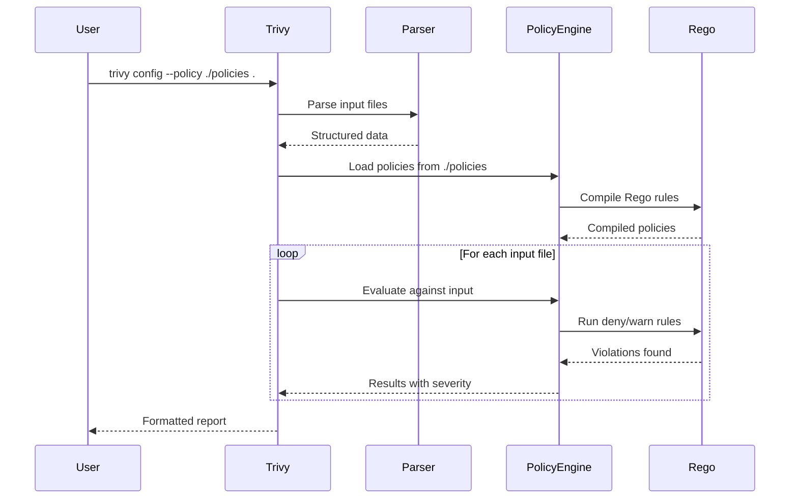

# How to Build Custom Policies in Trivy

Author: [nawazdhandala](https://github.com/nawazdhandala)

Tags: Trivy, Security, Policy, Scanning

Description: A practical guide to writing custom Rego policies for Trivy to enforce security and compliance rules across your infrastructure.

---

Trivy scans containers, filesystems, and IaC for vulnerabilities out of the box. But every organization has unique security requirements that built-in checks cannot cover. Custom policies let you encode your own rules using Rego, the policy language from Open Policy Agent.

## Understanding Trivy Policy Architecture

Trivy uses Rego policies to evaluate configurations against security rules. Each policy defines what to check and what constitutes a violation.



## Policy File Structure

Every Trivy custom policy needs specific metadata and at least one rule. Here is the skeleton:

```rego
# METADATA
# title: Descriptive title for the check
# description: Explain what the policy checks and why
# scope: package
# schemas:
#   - input: schema["dockerfile"]
# related_resources:
#   - https://docs.example.com/security-guidelines
# custom:
#   id: CUSTOM-001
#   avd_id: AVD-CUSTOM-0001
#   severity: HIGH
#   short_code: no-root-user
#   recommended_action: Add USER instruction to run as non-root
#   input:
#     selector:
#       - type: dockerfile

package custom.dockerfile.no_root

import rego.v1

deny contains res if {
    # Policy logic here
    some instruction in input.Stages[_].Commands
    instruction.Cmd == "user"
    instruction.Value[0] == "root"
    res := result.new(
        "Container runs as root user",
        instruction
    )
}
```

## Severity Levels

Trivy policies support four severity levels that determine how violations appear in scan results:

| Severity | Use Case | Exit Code Behavior |
|----------|----------|-------------------|
| CRITICAL | Must fix before deployment | Fails CI by default |
| HIGH | Should fix soon | Fails with --exit-code 1 |
| MEDIUM | Fix when possible | Warning only |
| LOW | Informational | Warning only |

Configure severity thresholds in your CI pipeline:

```bash
# Fail only on CRITICAL and HIGH
trivy config --severity CRITICAL,HIGH --exit-code 1 .

# Report all severities but only fail on CRITICAL
trivy config --severity CRITICAL --exit-code 1 --severity HIGH,MEDIUM,LOW --exit-code 0 .
```

## Writing Dockerfile Policies

### Prevent Running as Root

```rego
# METADATA
# title: Containers must not run as root
# description: Running as root gives full host access if container escape occurs
# scope: package
# custom:
#   id: CUSTOM-001
#   severity: CRITICAL
#   input:
#     selector:
#       - type: dockerfile

package custom.dockerfile.no_root

import rego.v1

deny contains res if {
    not user_instruction_exists
    res := result.new(
        "Dockerfile does not contain USER instruction",
        {}
    )
}

deny contains res if {
    some stage in input.Stages
    some instruction in stage.Commands
    instruction.Cmd == "user"
    lower(instruction.Value[0]) == "root"
    res := result.new(
        "Container explicitly runs as root",
        instruction
    )
}

user_instruction_exists if {
    some stage in input.Stages
    some instruction in stage.Commands
    instruction.Cmd == "user"
}
```

### Require Specific Base Images

```rego
# METADATA
# title: Only approved base images allowed
# description: Enforce use of hardened base images from internal registry
# scope: package
# custom:
#   id: CUSTOM-002
#   severity: HIGH
#   input:
#     selector:
#       - type: dockerfile

package custom.dockerfile.approved_base

import rego.v1

approved_registries := [
    "gcr.io/distroless/",
    "registry.internal.company.com/",
    "cgr.dev/chainguard/"
]

deny contains res if {
    some stage in input.Stages
    from_instruction := stage.Commands[0]
    from_instruction.Cmd == "from"
    image := from_instruction.Value[0]
    not starts_with_approved(image)
    res := result.new(
        sprintf("Base image '%s' is not from an approved registry", [image]),
        from_instruction
    )
}

starts_with_approved(image) if {
    some registry in approved_registries
    startswith(image, registry)
}
```

### Block Sensitive Environment Variables

```rego
# METADATA
# title: No secrets in environment variables
# description: Secrets should be mounted at runtime, not baked into images
# scope: package
# custom:
#   id: CUSTOM-003
#   severity: CRITICAL
#   input:
#     selector:
#       - type: dockerfile

package custom.dockerfile.no_secrets_env

import rego.v1

sensitive_patterns := [
    "PASSWORD",
    "SECRET",
    "API_KEY",
    "PRIVATE_KEY",
    "TOKEN",
    "CREDENTIALS"
]

deny contains res if {
    some stage in input.Stages
    some instruction in stage.Commands
    instruction.Cmd == "env"
    some var in instruction.Value
    contains_sensitive(upper(var))
    res := result.new(
        sprintf("Environment variable '%s' may contain secrets", [var]),
        instruction
    )
}

contains_sensitive(var_name) if {
    some pattern in sensitive_patterns
    contains(var_name, pattern)
}
```

## Writing Kubernetes Policies

### Require Resource Limits

```rego
# METADATA
# title: Containers must have resource limits
# description: Prevent resource exhaustion and noisy neighbor issues
# scope: package
# custom:
#   id: CUSTOM-K8S-001
#   severity: HIGH
#   input:
#     selector:
#       - type: kubernetes

package custom.kubernetes.resource_limits

import rego.v1

deny contains res if {
    container := input.spec.containers[_]
    not container.resources.limits.memory
    res := result.new(
        sprintf("Container '%s' does not have memory limit", [container.name]),
        container
    )
}

deny contains res if {
    container := input.spec.containers[_]
    not container.resources.limits.cpu
    res := result.new(
        sprintf("Container '%s' does not have CPU limit", [container.name]),
        container
    )
}
```

### Enforce Network Policies Exist

```rego
# METADATA
# title: Namespace must have default deny NetworkPolicy
# description: Zero trust requires explicit network allow rules
# scope: package
# custom:
#   id: CUSTOM-K8S-002
#   severity: MEDIUM
#   input:
#     selector:
#       - type: kubernetes

package custom.kubernetes.network_policy

import rego.v1

deny contains res if {
    input.kind == "Namespace"
    namespace_name := input.metadata.name
    not has_default_deny_policy(namespace_name)
    res := result.new(
        sprintf("Namespace '%s' lacks default deny NetworkPolicy", [namespace_name]),
        input.metadata
    )
}

has_default_deny_policy(ns) if {
    # This would check against all resources in the scan
    some policy in data.kubernetes.networkpolicies[ns]
    policy.spec.podSelector == {}
    policy.spec.policyTypes[_] == "Ingress"
}
```

## Writing Terraform Policies

### Require Encryption at Rest

```rego
# METADATA
# title: S3 buckets must have encryption enabled
# description: Data at rest encryption is required for compliance
# scope: package
# custom:
#   id: CUSTOM-TF-001
#   severity: HIGH
#   input:
#     selector:
#       - type: terraform

package custom.terraform.s3_encryption

import rego.v1

deny contains res if {
    resource := input.resource.aws_s3_bucket[name]
    not has_encryption_config(name)
    res := result.new(
        sprintf("S3 bucket '%s' does not have encryption configured", [name]),
        resource
    )
}

has_encryption_config(bucket_name) if {
    input.resource.aws_s3_bucket_server_side_encryption_configuration[_].bucket == bucket_name
}

has_encryption_config(bucket_name) if {
    # Check for inline encryption in older Terraform versions
    bucket := input.resource.aws_s3_bucket[bucket_name]
    bucket.server_side_encryption_configuration
}
```

### Block Public Access

```rego
# METADATA
# title: S3 buckets must block public access
# description: Prevent accidental data exposure
# scope: package
# custom:
#   id: CUSTOM-TF-002
#   severity: CRITICAL
#   input:
#     selector:
#       - type: terraform

package custom.terraform.s3_public_access

import rego.v1

deny contains res if {
    bucket := input.resource.aws_s3_bucket[name]
    not has_public_access_block(name)
    res := result.new(
        sprintf("S3 bucket '%s' missing public access block", [name]),
        bucket
    )
}

has_public_access_block(bucket_name) if {
    block := input.resource.aws_s3_bucket_public_access_block[_]
    block.bucket == bucket_name
    block.block_public_acls == true
    block.block_public_policy == true
    block.ignore_public_acls == true
    block.restrict_public_buckets == true
}
```

## Compliance Checking with Custom Policies

Create policies that map to compliance frameworks by organizing them into packages:



### PCI-DSS Encryption Policy

```rego
# METADATA
# title: "[PCI-DSS 3.4] Encrypt stored cardholder data"
# description: All storage containing cardholder data must use encryption
# scope: package
# related_resources:
#   - https://www.pcisecuritystandards.org/
# custom:
#   id: PCI-DSS-3-4
#   severity: CRITICAL
#   input:
#     selector:
#       - type: terraform

package custom.pci.encryption

import rego.v1

# RDS instances must have encryption
deny contains res if {
    db := input.resource.aws_db_instance[name]
    not db.storage_encrypted == true
    res := result.new(
        sprintf("[PCI-DSS 3.4] RDS instance '%s' storage not encrypted", [name]),
        db
    )
}

# EBS volumes must have encryption
deny contains res if {
    volume := input.resource.aws_ebs_volume[name]
    not volume.encrypted == true
    res := result.new(
        sprintf("[PCI-DSS 3.4] EBS volume '%s' not encrypted", [name]),
        volume
    )
}
```

### SOC2 Logging Policy

```rego
# METADATA
# title: "[SOC2 CC6.1] CloudTrail must be enabled"
# description: All API activity must be logged for audit purposes
# scope: package
# custom:
#   id: SOC2-CC6-1
#   severity: HIGH
#   input:
#     selector:
#       - type: terraform

package custom.soc2.logging

import rego.v1

warn contains res if {
    count(input.resource.aws_cloudtrail) == 0
    res := result.new(
        "[SOC2 CC6.1] No CloudTrail configuration found",
        {}
    )
}

deny contains res if {
    trail := input.resource.aws_cloudtrail[name]
    not trail.is_multi_region_trail == true
    res := result.new(
        sprintf("[SOC2 CC6.1] CloudTrail '%s' is not multi-region", [name]),
        trail
    )
}
```

## Directory Structure for Custom Policies

Organize your policies in a structured directory:

```
policies/
  dockerfile/
    no-root.rego
    approved-base.rego
    no-secrets.rego
  kubernetes/
    resource-limits.rego
    network-policy.rego
    pod-security.rego
  terraform/
    aws/
      s3-encryption.rego
      s3-public-access.rego
      rds-encryption.rego
    gcp/
      bucket-encryption.rego
  compliance/
    pci-dss/
      encryption.rego
      access-control.rego
    soc2/
      logging.rego
    lib/
      helpers.rego
```

## Running Custom Policies

### Local Scanning

```bash
# Scan with custom policies directory
trivy config --policy ./policies --namespaces custom .

# Scan specific file types
trivy config --policy ./policies --namespaces custom --include-non-failures ./terraform

# Output as JSON for CI integration
trivy config --policy ./policies --namespaces custom --format json --output results.json .
```

### CI Pipeline Integration

```yaml
# GitHub Actions example
name: Security Scan
on: [push, pull_request]

jobs:
  trivy-scan:
    runs-on: ubuntu-latest
    steps:
      - uses: actions/checkout@v4

      - name: Run Trivy with custom policies
        uses: aquasecurity/trivy-action@master
        with:
          scan-type: 'config'
          scan-ref: '.'
          trivy-config: trivy.yaml
          exit-code: '1'
          severity: 'CRITICAL,HIGH'

      - name: Upload results
        uses: github/codeql-action/upload-sarif@v3
        with:
          sarif_file: 'trivy-results.sarif'
```

### Trivy Configuration File

```yaml
# trivy.yaml
scan:
  policy:
    - ./policies
  namespaces:
    - custom
    - custom.pci
    - custom.soc2

severity:
  - CRITICAL
  - HIGH

exit-code: 1

format: table
```

## Testing Your Policies

### Unit Testing with OPA

```rego
# policies/dockerfile/no-root_test.rego
package custom.dockerfile.no_root_test

import rego.v1
import data.custom.dockerfile.no_root

# Test: Should fail when no USER instruction
test_no_user_instruction if {
    input := {
        "Stages": [{
            "Commands": [
                {"Cmd": "from", "Value": ["ubuntu:22.04"]},
                {"Cmd": "run", "Value": ["apt-get update"]}
            ]
        }]
    }
    count(no_root.deny) > 0
}

# Test: Should fail when USER is root
test_user_root if {
    input := {
        "Stages": [{
            "Commands": [
                {"Cmd": "from", "Value": ["ubuntu:22.04"]},
                {"Cmd": "user", "Value": ["root"]}
            ]
        }]
    }
    count(no_root.deny) > 0
}

# Test: Should pass when USER is non-root
test_user_nonroot if {
    input := {
        "Stages": [{
            "Commands": [
                {"Cmd": "from", "Value": ["ubuntu:22.04"]},
                {"Cmd": "user", "Value": ["appuser"]}
            ]
        }]
    }
    count(no_root.deny) == 0
}
```

Run tests with OPA:

```bash
opa test ./policies -v
```

## Exception Handling

Sometimes you need to allow exceptions for specific cases. Use the exception pattern:

```rego
# METADATA
# title: Containers must not run as root (with exceptions)
# scope: package
# custom:
#   id: CUSTOM-001
#   severity: CRITICAL
#   input:
#     selector:
#       - type: dockerfile

package custom.dockerfile.no_root_with_exceptions

import rego.v1

# Main deny rule
deny contains res if {
    some stage in input.Stages
    some instruction in stage.Commands
    instruction.Cmd == "user"
    lower(instruction.Value[0]) == "root"
    not is_excepted
    res := result.new(
        "Container runs as root",
        instruction
    )
}

# Exception for specific image names
is_excepted if {
    some stage in input.Stages
    from_cmd := stage.Commands[0]
    from_cmd.Cmd == "from"
    # Allow root for specific init containers
    contains(from_cmd.Value[0], "init-container")
}

# Exception based on annotation/label
is_excepted if {
    input.metadata.labels["security.policy/root-allowed"] == "true"
}
```

## Policy Evaluation Flow

Here is how Trivy processes custom policies:



## Debugging Policies

When policies do not work as expected:

```bash
# Enable debug output
trivy config --policy ./policies --debug .

# Check policy syntax with OPA
opa check ./policies

# Test policy evaluation with sample input
opa eval --data ./policies --input sample-dockerfile.json "data.custom.dockerfile.no_root.deny"

# Print input structure Trivy sees
trivy config --policy ./policies --format json . | jq '.Results[].Input'
```

## Best Practices

1. **Start with built-in policies**: Trivy includes hundreds of checks. Extend rather than replace.

2. **Use meaningful IDs**: Map policy IDs to your internal tracking system (JIRA, compliance docs).

3. **Document exceptions**: Every exception rule should explain why it exists and who approved it.

4. **Version your policies**: Store policies in Git and tag releases that match deployment cycles.

5. **Test before enforcement**: Run policies in warn-only mode before enabling enforcement.

6. **Layer severity appropriately**: Reserve CRITICAL for issues that must block deployment.

7. **Share helper functions**: Put common checks in a `lib/` package and import them.

---

Custom Trivy policies turn security requirements into automated gates. Start with your most critical rules, test them thoroughly, and expand coverage as your team builds confidence. The goal is not to block every build but to catch the issues that matter before they reach production.
