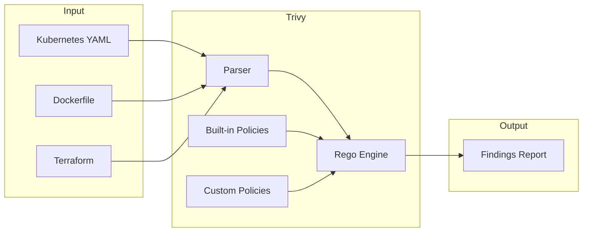
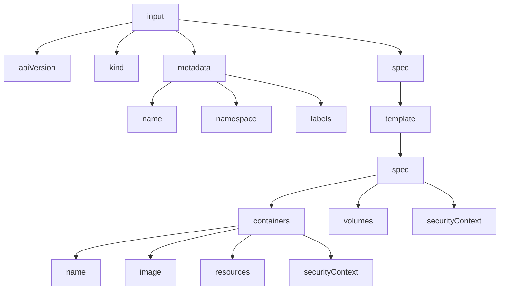
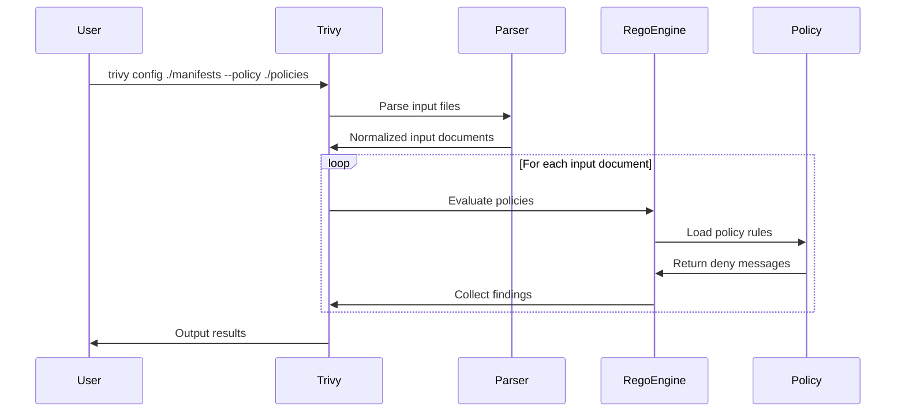

# How to Implement Trivy Rego Policies

Author: [nawazdhandala](https://github.com/nawazdhandala)

Tags: Trivy, Security, Rego, PolicyAsCode

Description: Learn to write custom Rego policies for Trivy to enforce organization-specific security checks on container images, Kubernetes manifests, and infrastructure code.

---

Trivy is a powerful vulnerability scanner, but its real strength lies in custom misconfiguration checks using Rego policies. With Rego, you can enforce organization-specific security rules that go beyond built-in checks.

## What is Rego?

Rego is the policy language used by Open Policy Agent (OPA). Trivy uses Rego to evaluate configurations against security rules. Think of it as writing security requirements as code.



## Rego Policy Structure for Trivy

Every Trivy Rego policy needs specific metadata and structure.

### Basic Policy Template

```rego
# METADATA
# title: Containers must not run as root
# description: Running as root increases the attack surface
# schemas:
#   - input: schema["kubernetes"]
# related_resources:
#   - https://kubernetes.io/docs/concepts/security/pod-security-standards/
# custom:
#   id: CUSTOM-K8S-001
#   avd_id: AVD-CUSTOM-0001
#   severity: HIGH
#   short_code: no-root-containers
#   recommended_action: Set securityContext.runAsNonRoot to true
#   input:
#     selector:
#       - type: kubernetes
#         subtypes:
#           - kind: deployment
#           - kind: statefulset
#           - kind: daemonset

package custom.kubernetes.no_root_containers

import rego.v1

# deny returns a message when the rule is violated
deny contains msg if {
    # Access container spec from the input document
    container := input.spec.template.spec.containers[_]

    # Check if runAsNonRoot is not set or is false
    not container.securityContext.runAsNonRoot

    # Build the violation message
    msg := sprintf("Container '%s' should set securityContext.runAsNonRoot to true", [container.name])
}
```

### Understanding the Metadata Block

The metadata block tells Trivy how to handle your policy:

```rego
# METADATA
# title: Human-readable policy name
# description: Detailed explanation of what this policy checks
# schemas:
#   - input: schema["kubernetes"]  # Validates input structure
# custom:
#   id: CUSTOM-K8S-001            # Unique identifier
#   avd_id: AVD-CUSTOM-0001       # Aqua Vulnerability Database ID
#   severity: HIGH                 # LOW, MEDIUM, HIGH, CRITICAL
#   short_code: descriptive-name   # URL-friendly identifier
#   recommended_action: How to fix the issue
#   input:
#     selector:
#       - type: kubernetes         # Target type: kubernetes, dockerfile, terraform
#         subtypes:
#           - kind: deployment     # Specific resource kinds to check
```

## Input Document Structure

Understanding the input structure is essential for writing effective policies. Trivy normalizes different input types into a consistent format.

### Kubernetes Input Structure



For a Kubernetes Deployment, the input looks like this:

```json
{
  "apiVersion": "apps/v1",
  "kind": "Deployment",
  "metadata": {
    "name": "web-app",
    "namespace": "production",
    "labels": {
      "app": "web"
    }
  },
  "spec": {
    "replicas": 3,
    "template": {
      "spec": {
        "containers": [
          {
            "name": "app",
            "image": "nginx:1.25",
            "resources": {
              "limits": {
                "memory": "128Mi",
                "cpu": "500m"
              }
            },
            "securityContext": {
              "runAsNonRoot": true,
              "readOnlyRootFilesystem": true
            }
          }
        ]
      }
    }
  }
}
```

### Dockerfile Input Structure

```json
{
  "Stages": [
    {
      "Name": "builder",
      "Commands": [
        {
          "Cmd": "from",
          "Value": ["golang:1.21-alpine"]
        },
        {
          "Cmd": "run",
          "Value": ["go build -o app ."]
        }
      ]
    }
  ]
}
```

## Custom Misconfiguration Checks

### Example 1: Enforce Resource Limits

```rego
# METADATA
# title: Containers must have resource limits
# description: Resource limits prevent containers from consuming excessive resources
# custom:
#   id: CUSTOM-K8S-002
#   severity: MEDIUM
#   input:
#     selector:
#       - type: kubernetes
#         subtypes:
#           - kind: deployment
#           - kind: statefulset

package custom.kubernetes.resource_limits

import rego.v1

# Check for missing memory limits
deny contains msg if {
    container := input.spec.template.spec.containers[_]
    not container.resources.limits.memory
    msg := sprintf("Container '%s' is missing memory limit", [container.name])
}

# Check for missing CPU limits
deny contains msg if {
    container := input.spec.template.spec.containers[_]
    not container.resources.limits.cpu
    msg := sprintf("Container '%s' is missing CPU limit", [container.name])
}
```

### Example 2: Enforce Image Registry Allowlist

```rego
# METADATA
# title: Images must come from approved registries
# description: Only allow images from trusted container registries
# custom:
#   id: CUSTOM-K8S-003
#   severity: HIGH
#   input:
#     selector:
#       - type: kubernetes
#         subtypes:
#           - kind: deployment
#           - kind: pod

package custom.kubernetes.approved_registries

import rego.v1

# List of approved registries
approved_registries := [
    "gcr.io/my-project/",
    "docker.io/library/",
    "ghcr.io/my-org/"
]

# Check if image starts with any approved registry
image_from_approved_registry(image) if {
    some registry in approved_registries
    startswith(image, registry)
}

deny contains msg if {
    container := input.spec.template.spec.containers[_]
    not image_from_approved_registry(container.image)
    msg := sprintf(
        "Container '%s' uses image '%s' from unapproved registry. Approved: %v",
        [container.name, container.image, approved_registries]
    )
}
```

### Example 3: Enforce Pod Security Standards

```rego
# METADATA
# title: Pods must not use hostNetwork
# description: Using hostNetwork exposes the pod to the node's network namespace
# custom:
#   id: CUSTOM-K8S-004
#   severity: HIGH
#   input:
#     selector:
#       - type: kubernetes
#         subtypes:
#           - kind: deployment
#           - kind: pod

package custom.kubernetes.no_host_network

import rego.v1

deny contains msg if {
    input.spec.template.spec.hostNetwork == true
    msg := "Pod should not use hostNetwork"
}

deny contains msg if {
    input.spec.hostNetwork == true
    msg := "Pod should not use hostNetwork"
}
```

### Example 4: Dockerfile Best Practices

```rego
# METADATA
# title: Dockerfile must not use latest tag
# description: Using latest tag leads to unpredictable builds
# custom:
#   id: CUSTOM-DOCKER-001
#   severity: MEDIUM
#   input:
#     selector:
#       - type: dockerfile

package custom.dockerfile.no_latest_tag

import rego.v1

deny contains msg if {
    # Iterate through all stages
    stage := input.Stages[_]

    # Find FROM commands
    cmd := stage.Commands[_]
    cmd.Cmd == "from"

    # Check if image uses latest tag or no tag (defaults to latest)
    image := cmd.Value[0]
    uses_latest_tag(image)

    msg := sprintf("Base image '%s' should use a specific version tag, not 'latest'", [image])
}

# Check for explicit :latest tag
uses_latest_tag(image) if {
    endswith(image, ":latest")
}

# Check for no tag (implies latest)
uses_latest_tag(image) if {
    not contains(image, ":")
    not contains(image, "@")  # Not using digest
}
```

### Example 5: Terraform Security Checks

```rego
# METADATA
# title: S3 buckets must have encryption enabled
# description: All S3 buckets should use server-side encryption
# custom:
#   id: CUSTOM-AWS-001
#   severity: HIGH
#   input:
#     selector:
#       - type: terraform

package custom.terraform.s3_encryption

import rego.v1

deny contains msg if {
    # Find S3 bucket resources
    resource := input.resource.aws_s3_bucket[name]

    # Check for missing server_side_encryption_configuration
    not has_encryption(name)

    msg := sprintf("S3 bucket '%s' must have server-side encryption enabled", [name])
}

# Check if bucket has encryption configuration
has_encryption(bucket_name) if {
    input.resource.aws_s3_bucket_server_side_encryption_configuration[_].bucket == bucket_name
}
```

## Testing Rego Policies Locally

Before deploying policies, test them locally to verify they work correctly.

### Directory Structure

```
policies/
  kubernetes/
    no_root_containers.rego
    no_root_containers_test.rego
    resource_limits.rego
    resource_limits_test.rego
  dockerfile/
    no_latest_tag.rego
    no_latest_tag_test.rego
```

### Writing Unit Tests

Create a test file alongside your policy:

```rego
# no_root_containers_test.rego
package custom.kubernetes.no_root_containers

import rego.v1

# Test case: should fail when runAsNonRoot is not set
test_deny_missing_run_as_non_root if {
    result := deny with input as {
        "kind": "Deployment",
        "spec": {
            "template": {
                "spec": {
                    "containers": [{
                        "name": "app",
                        "image": "nginx:1.25"
                    }]
                }
            }
        }
    }
    count(result) > 0
}

# Test case: should pass when runAsNonRoot is true
test_allow_run_as_non_root if {
    result := deny with input as {
        "kind": "Deployment",
        "spec": {
            "template": {
                "spec": {
                    "containers": [{
                        "name": "app",
                        "image": "nginx:1.25",
                        "securityContext": {
                            "runAsNonRoot": true
                        }
                    }]
                }
            }
        }
    }
    count(result) == 0
}

# Test case: should fail when runAsNonRoot is false
test_deny_run_as_non_root_false if {
    result := deny with input as {
        "kind": "Deployment",
        "spec": {
            "template": {
                "spec": {
                    "containers": [{
                        "name": "app",
                        "image": "nginx:1.25",
                        "securityContext": {
                            "runAsNonRoot": false
                        }
                    }]
                }
            }
        }
    }
    count(result) > 0
}
```

### Running Tests with OPA

```bash
# Install OPA CLI
brew install opa

# Run all tests in the policies directory
opa test policies/ -v

# Run tests for a specific policy
opa test policies/kubernetes/no_root_containers.rego \
         policies/kubernetes/no_root_containers_test.rego -v

# Run tests with coverage report
opa test policies/ -v --coverage
```

### Running Trivy with Custom Policies

```bash
# Scan a Kubernetes manifest with custom policies
trivy config ./manifests \
    --policy ./policies \
    --namespaces custom

# Scan with both built-in and custom policies
trivy config ./manifests \
    --policy ./policies \
    --namespaces builtin,custom

# Scan a Dockerfile
trivy config ./Dockerfile \
    --policy ./policies/dockerfile \
    --namespaces custom

# Output as JSON for CI/CD integration
trivy config ./manifests \
    --policy ./policies \
    --namespaces custom \
    --format json \
    --output results.json
```

## Policy Evaluation Flow



## CI/CD Integration

### GitHub Actions Example

```yaml
name: Security Scan

on:
  pull_request:
    branches: [main]

jobs:
  trivy-scan:
    runs-on: ubuntu-latest
    steps:
      - uses: actions/checkout@v4

      - name: Run Trivy with custom policies
        uses: aquasecurity/trivy-action@master
        with:
          scan-type: 'config'
          scan-ref: './manifests'
          trivy-config: trivy.yaml
          exit-code: '1'  # Fail on findings

      # Alternative: Run Trivy directly
      - name: Install Trivy
        run: |
          curl -sfL https://raw.githubusercontent.com/aquasecurity/trivy/main/contrib/install.sh | sh -s -- -b /usr/local/bin

      - name: Run custom policy scan
        run: |
          trivy config ./manifests \
            --policy ./policies \
            --namespaces custom \
            --exit-code 1 \
            --severity HIGH,CRITICAL
```

### trivy.yaml Configuration

```yaml
# trivy.yaml
scan:
  security-checks:
    - config

config:
  policy:
    - ./policies
  namespaces:
    - custom
    - builtin

severity:
  - HIGH
  - CRITICAL

exit-code: 1
```

## Best Practices

### 1. Use Descriptive Policy IDs

```rego
# Good: Clear naming convention
# custom:
#   id: CUSTOM-K8S-SECURITY-001
#   short_code: no-root-containers

# Avoid: Generic or unclear IDs
# custom:
#   id: CHECK1
#   short_code: check
```

### 2. Provide Actionable Recommendations

```rego
# Good: Tells the user exactly what to do
# recommended_action: |
#   Set securityContext.runAsNonRoot to true in your container spec:
#   securityContext:
#     runAsNonRoot: true

# Avoid: Vague or unhelpful
# recommended_action: Fix the security issue
```

### 3. Include Related Resources

```rego
# Good: Links to documentation
# related_resources:
#   - https://kubernetes.io/docs/concepts/security/pod-security-standards/
#   - https://cheatsheetseries.owasp.org/cheatsheets/Kubernetes_Security_Cheat_Sheet.html
```

### 4. Handle Edge Cases

```rego
# Check for nil values and missing fields
deny contains msg if {
    container := input.spec.template.spec.containers[_]

    # Safely check nested fields
    security_context := object.get(container, "securityContext", {})
    run_as_non_root := object.get(security_context, "runAsNonRoot", null)

    run_as_non_root != true

    msg := sprintf("Container '%s' should set runAsNonRoot to true", [container.name])
}
```

### 5. Group Related Policies

```rego
# Group related checks in one package
package custom.kubernetes.pod_security

import rego.v1

# Check 1: No privileged containers
deny contains msg if {
    container := input.spec.template.spec.containers[_]
    container.securityContext.privileged == true
    msg := sprintf("Container '%s' must not be privileged", [container.name])
}

# Check 2: No host PID
deny contains msg if {
    input.spec.template.spec.hostPID == true
    msg := "Pod must not share host PID namespace"
}

# Check 3: No host IPC
deny contains msg if {
    input.spec.template.spec.hostIPC == true
    msg := "Pod must not share host IPC namespace"
}
```

## Debugging Policies

### Print Statements for Debugging

```rego
package custom.kubernetes.debug

import rego.v1

# Use print for debugging (remove in production)
deny contains msg if {
    container := input.spec.template.spec.containers[_]
    print("Checking container:", container.name)
    print("Security context:", container.securityContext)

    not container.securityContext.runAsNonRoot
    msg := sprintf("Container '%s' violation", [container.name])
}
```

### Run with Trace Output

```bash
# Enable trace output for debugging
opa eval \
    --data policies/ \
    --input test-deployment.json \
    'data.custom.kubernetes.no_root_containers.deny' \
    --explain full
```

---

Custom Rego policies transform Trivy from a vulnerability scanner into a comprehensive security enforcement tool. Start with a few critical policies, test them thoroughly, and expand coverage as your team gains confidence. The policies become living documentation of your security requirements.
