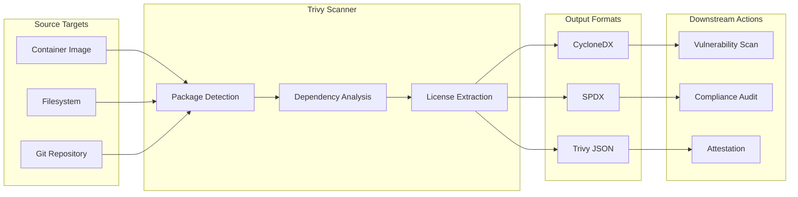
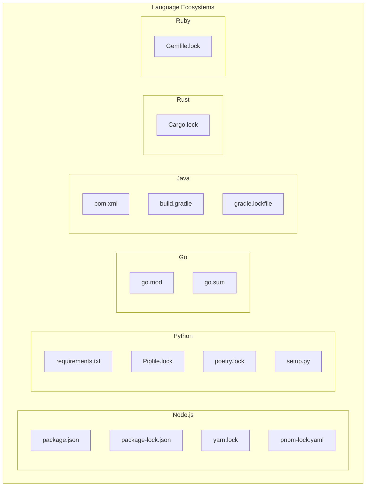
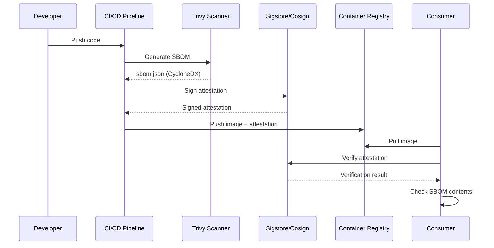

# How to Implement Trivy SBOM Generation

Author: [nawazdhandala](https://github.com/nawazdhandala)

Tags: Trivy, Security, SBOM, SupplyChain

Description: A comprehensive guide to generating Software Bill of Materials with Trivy for container images, filesystems, and CI/CD pipelines.

---

A Software Bill of Materials (SBOM) is an inventory of all components in your software. It lists packages, libraries, and dependencies along with their versions and licenses. In an era of supply chain attacks like Log4Shell, SBOMs have become essential for security, compliance, and vulnerability management.

Trivy is an open-source security scanner from Aqua Security that excels at SBOM generation. It supports multiple output formats, scans various targets, and integrates seamlessly with CI/CD pipelines.

## SBOM Generation Flow

Here is how SBOM generation fits into a typical software delivery pipeline:



## Installing Trivy

Install Trivy on your system before generating SBOMs.

```bash
# macOS using Homebrew
brew install trivy

# Ubuntu/Debian
sudo apt-get install wget apt-transport-https gnupg lsb-release
wget -qO - https://aquasecurity.github.io/trivy-repo/deb/public.key | sudo apt-key add -
echo "deb https://aquasecurity.github.io/trivy-repo/deb $(lsb_release -sc) main" | sudo tee -a /etc/apt/sources.list.d/trivy.list
sudo apt-get update
sudo apt-get install trivy

# Using Docker (no installation required)
docker run aquasec/trivy --version
```

Verify the installation:

```bash
trivy --version
# Output: Version: 0.58.0
```

## SBOM Output Formats

Trivy supports three primary SBOM formats. Each serves different use cases.

### CycloneDX Format

CycloneDX is a lightweight SBOM standard designed for security use cases. It integrates well with vulnerability databases and dependency track systems.

```bash
# Generate CycloneDX SBOM for a container image
# --format cyclonedx: Output in CycloneDX format
# --output: Write SBOM to a file instead of stdout
trivy image --format cyclonedx --output sbom.cdx.json nginx:1.25

# Generate CycloneDX in XML format
trivy image --format cyclonedx --output sbom.cdx.xml nginx:1.25
```

Sample CycloneDX output structure:

```json
{
  "bomFormat": "CycloneDX",
  "specVersion": "1.5",
  "serialNumber": "urn:uuid:3e671687-395b-41f5-a30f-a58921a69b79",
  "version": 1,
  "metadata": {
    "timestamp": "2026-01-30T10:00:00Z",
    "tools": [
      {
        "vendor": "aquasecurity",
        "name": "trivy",
        "version": "0.58.0"
      }
    ],
    "component": {
      "type": "container",
      "name": "nginx",
      "version": "1.25"
    }
  },
  "components": [
    {
      "type": "library",
      "name": "openssl",
      "version": "3.0.13",
      "purl": "pkg:deb/debian/openssl@3.0.13?arch=amd64"
    }
  ]
}
```

### SPDX Format

SPDX (Software Package Data Exchange) is an ISO standard (ISO/IEC 5962:2021) widely used for license compliance and legal reviews.

```bash
# Generate SPDX SBOM in JSON format
# spdx-json: Machine-readable SPDX format
trivy image --format spdx-json --output sbom.spdx.json nginx:1.25

# Generate SPDX in tag-value format (human-readable)
# spdx: Traditional SPDX tag-value format
trivy image --format spdx --output sbom.spdx nginx:1.25
```

Sample SPDX JSON output:

```json
{
  "spdxVersion": "SPDX-2.3",
  "dataLicense": "CC0-1.0",
  "SPDXID": "SPDXRef-DOCUMENT",
  "name": "nginx-1.25",
  "documentNamespace": "https://aquasecurity.github.io/trivy/nginx-1.25",
  "creationInfo": {
    "created": "2026-01-30T10:00:00Z",
    "creators": ["Tool: trivy-0.58.0"]
  },
  "packages": [
    {
      "SPDXID": "SPDXRef-Package-openssl",
      "name": "openssl",
      "versionInfo": "3.0.13",
      "downloadLocation": "NOASSERTION",
      "licenseConcluded": "Apache-2.0",
      "licenseDeclared": "Apache-2.0"
    }
  ]
}
```

### Trivy Native JSON Format

Trivy's native JSON format provides the most detailed output including vulnerability information alongside the SBOM.

```bash
# Generate Trivy native JSON with full details
# --list-all-pkgs: Include all packages, not just vulnerable ones
trivy image --format json --list-all-pkgs --output sbom.trivy.json nginx:1.25
```

## Container Image SBOM Generation

Container images are the most common SBOM target. Trivy detects OS packages and application dependencies.

```bash
# Basic container image SBOM
trivy image --format cyclonedx nginx:1.25

# Scan image from a private registry
# Authenticate first with docker login or set credentials
TRIVY_USERNAME=myuser TRIVY_PASSWORD=mytoken trivy image \
    --format cyclonedx \
    registry.example.com/myapp:v1.2.3

# Scan a local image (not pulled from registry)
# --input: Read image from a tar archive
docker save myapp:latest -o myapp.tar
trivy image --input myapp.tar --format cyclonedx --output sbom.json
```

### Filtering Packages by Type

Focus on specific package ecosystems:

```bash
# Scan only OS packages (apt, rpm, apk)
# --pkg-types os: Limit to operating system packages
trivy image --format cyclonedx --pkg-types os nginx:1.25

# Scan only application dependencies (npm, pip, go modules)
trivy image --format cyclonedx --pkg-types library python:3.12

# Combine both explicitly
trivy image --format cyclonedx --pkg-types os,library node:20
```

## Filesystem SBOM Generation

Generate SBOMs from source code repositories or build directories.

```bash
# Scan current directory for application dependencies
# Detects package.json, requirements.txt, go.mod, etc.
trivy filesystem --format cyclonedx --output sbom.json .

# Scan a specific project directory
trivy filesystem --format spdx-json --output sbom.spdx.json /path/to/project

# Include hidden directories and files
trivy filesystem --format cyclonedx --skip-dirs "" .
```

### Supported Manifest Files

Trivy automatically detects these dependency files:



### Example: Node.js Project SBOM

```bash
# Navigate to your Node.js project
cd /path/to/nodejs-app

# Generate SBOM including dev dependencies
# --include-dev-deps: Include devDependencies from package.json
trivy filesystem --format cyclonedx --include-dev-deps --output sbom.json .

# Generate SBOM for production only (default behavior)
trivy filesystem --format cyclonedx --output sbom-prod.json .
```

### Example: Python Project SBOM

```bash
# Scan a Python project with multiple dependency files
trivy filesystem --format spdx-json --output sbom.json /path/to/python-app

# Specify which files to scan
# --file-patterns: Custom patterns for dependency files
trivy filesystem --format cyclonedx \
    --file-patterns "pip:requirements*.txt" \
    --output sbom.json .
```

## Git Repository SBOM

Scan a remote Git repository without cloning it locally.

```bash
# Scan a public GitHub repository
trivy repository --format cyclonedx \
    --output sbom.json \
    https://github.com/aquasecurity/trivy

# Scan a specific branch
trivy repository --format cyclonedx \
    --branch main \
    --output sbom.json \
    https://github.com/your-org/your-repo

# Scan with authentication for private repos
GITHUB_TOKEN=ghp_xxxx trivy repository --format cyclonedx \
    --output sbom.json \
    https://github.com/your-org/private-repo
```

## SBOM Attestation and Signing

Attestations provide cryptographic proof of SBOM authenticity. They are essential for supply chain security frameworks like SLSA.

### Generate SBOM Attestation with Cosign

```bash
# Install cosign for signing and verification
brew install sigstore/tap/cosign

# Generate a keypair for signing (do this once)
# Creates cosign.key (private) and cosign.pub (public)
cosign generate-key-pair

# Generate SBOM and sign it as an attestation
# Step 1: Generate the SBOM
trivy image --format cyclonedx --output sbom.json myregistry.io/myapp:v1.0.0

# Step 2: Create and sign the attestation
# --predicate: The SBOM file to attest
# --type: Attestation predicate type (cyclonedx for CycloneDX SBOMs)
# --key: Private key for signing
cosign attest --predicate sbom.json \
    --type cyclonedx \
    --key cosign.key \
    myregistry.io/myapp:v1.0.0
```

### Keyless Signing with Sigstore

Use Sigstore's keyless signing for CI/CD pipelines. No key management required.

```bash
# Keyless attestation using Sigstore OIDC
# Requires authentication via browser or CI identity
COSIGN_EXPERIMENTAL=1 cosign attest --predicate sbom.json \
    --type cyclonedx \
    myregistry.io/myapp:v1.0.0

# Verify the attestation
COSIGN_EXPERIMENTAL=1 cosign verify-attestation \
    --type cyclonedx \
    myregistry.io/myapp:v1.0.0
```

### Attestation Verification Flow



## CI/CD Integration

### GitHub Actions Workflow

```yaml
name: Build and Generate SBOM

on:
  push:
    branches: [main]
  pull_request:
    branches: [main]

jobs:
  build-and-sbom:
    runs-on: ubuntu-latest
    permissions:
      contents: read
      packages: write
      id-token: write  # Required for keyless signing

    steps:
      - name: Checkout code
        uses: actions/checkout@v4

      - name: Set up Docker Buildx
        uses: docker/setup-buildx-action@v3

      - name: Log in to Container Registry
        uses: docker/login-action@v3
        with:
          registry: ghcr.io
          username: ${{ github.actor }}
          password: ${{ secrets.GITHUB_TOKEN }}

      - name: Build and push image
        uses: docker/build-push-action@v5
        with:
          context: .
          push: true
          tags: ghcr.io/${{ github.repository }}:${{ github.sha }}

      - name: Install Trivy
        uses: aquasecurity/trivy-action@master
        with:
          scan-type: 'image'
          image-ref: 'ghcr.io/${{ github.repository }}:${{ github.sha }}'
          format: 'cyclonedx'
          output: 'sbom.cdx.json'

      - name: Install Cosign
        uses: sigstore/cosign-installer@v3

      - name: Sign SBOM attestation
        # Keyless signing using GitHub OIDC identity
        run: |
          cosign attest --predicate sbom.cdx.json \
            --type cyclonedx \
            ghcr.io/${{ github.repository }}:${{ github.sha }}
        env:
          COSIGN_EXPERIMENTAL: 1

      - name: Upload SBOM as artifact
        uses: actions/upload-artifact@v4
        with:
          name: sbom
          path: sbom.cdx.json
```

### GitLab CI Pipeline

```yaml
stages:
  - build
  - sbom
  - sign

variables:
  IMAGE_TAG: $CI_REGISTRY_IMAGE:$CI_COMMIT_SHA

build:
  stage: build
  image: docker:24
  services:
    - docker:24-dind
  script:
    - docker login -u $CI_REGISTRY_USER -p $CI_REGISTRY_PASSWORD $CI_REGISTRY
    - docker build -t $IMAGE_TAG .
    - docker push $IMAGE_TAG

generate-sbom:
  stage: sbom
  image: aquasec/trivy:latest
  script:
    # Generate CycloneDX SBOM
    - trivy image --format cyclonedx --output sbom.cdx.json $IMAGE_TAG
    # Generate SPDX SBOM for compliance
    - trivy image --format spdx-json --output sbom.spdx.json $IMAGE_TAG
  artifacts:
    paths:
      - sbom.cdx.json
      - sbom.spdx.json
    expire_in: 1 week

sign-attestation:
  stage: sign
  image: alpine:3.19
  before_script:
    - apk add --no-cache cosign
  script:
    - cosign attest --predicate sbom.cdx.json --type cyclonedx $IMAGE_TAG
  needs:
    - generate-sbom
```

## Vulnerability Scanning with SBOMs

Use generated SBOMs as input for vulnerability scanning.

```bash
# Generate SBOM once
trivy image --format cyclonedx --output sbom.json nginx:1.25

# Scan the SBOM for vulnerabilities (faster than re-scanning the image)
# --sbom: Use SBOM as input instead of scanning the target directly
trivy sbom sbom.json

# Scan with specific severity threshold
trivy sbom --severity HIGH,CRITICAL sbom.json

# Output vulnerability scan in JSON
trivy sbom --format json --output vulns.json sbom.json
```

### Continuous Vulnerability Monitoring

```bash
#!/bin/bash
# scan-sboms.sh
# Scan all SBOMs in a directory for new vulnerabilities

SBOM_DIR="/path/to/sboms"
REPORT_DIR="/path/to/reports"

# Update Trivy vulnerability database
trivy image --download-db-only

# Scan each SBOM
for sbom in "$SBOM_DIR"/*.json; do
    filename=$(basename "$sbom" .json)
    echo "Scanning $filename..."

    # Generate vulnerability report
    trivy sbom --format json \
        --output "$REPORT_DIR/${filename}-vulns.json" \
        "$sbom"

    # Check for critical vulnerabilities
    critical_count=$(jq '.Results[].Vulnerabilities | select(.) | map(select(.Severity == "CRITICAL")) | length' "$REPORT_DIR/${filename}-vulns.json" | awk '{s+=$1} END {print s}')

    if [ "$critical_count" -gt 0 ]; then
        echo "WARNING: $critical_count critical vulnerabilities found in $filename"
    fi
done
```

## Advanced Configuration

### Custom Trivy Configuration File

Create `trivy.yaml` for consistent settings across scans:

```yaml
# trivy.yaml
# Global configuration for SBOM generation

# Database settings
db:
  # Skip database update (use cached)
  skip-update: false
  # Database repository
  repository: ghcr.io/aquasecurity/trivy-db

# SBOM generation settings
format: cyclonedx
list-all-pkgs: true

# Package filtering
pkg-types:
  - os
  - library

# Scanning settings
scanners:
  - vuln
  - secret
  - misconfig

# Severity filtering for vulnerability scans
severity:
  - HIGH
  - CRITICAL

# Ignore specific vulnerabilities
ignorefile: .trivyignore

# Cache settings
cache:
  dir: /tmp/trivy-cache
  ttl: 24h
```

Use the configuration file:

```bash
# Trivy automatically reads trivy.yaml from current directory
trivy image --output sbom.json nginx:1.25

# Or specify explicitly
trivy image --config /path/to/trivy.yaml --output sbom.json nginx:1.25
```

### Ignore File for False Positives

Create `.trivyignore` to exclude known false positives:

```text
# .trivyignore
# Ignore specific CVEs that are false positives or accepted risks

# OpenSSL vulnerability - mitigated by network policy
CVE-2024-0727

# Accepted risk - not exploitable in our environment
CVE-2023-44487

# Ignore by package name and version
pkg:deb/debian/libssl3@3.0.11
```

## SBOM Storage and Distribution

### Upload to Dependency Track

Dependency Track is an open-source platform for SBOM management and vulnerability analysis.

```bash
# Upload CycloneDX SBOM to Dependency Track
# Replace with your Dependency Track instance URL and API key
curl -X POST "https://dtrack.example.com/api/v1/bom" \
    -H "Content-Type: application/json" \
    -H "X-Api-Key: $DTRACK_API_KEY" \
    -d @- << EOF
{
    "projectName": "myapp",
    "projectVersion": "1.0.0",
    "autoCreate": true,
    "bom": "$(base64 -w 0 sbom.cdx.json)"
}
EOF
```

### Store in OCI Registry

Store SBOMs alongside container images in the same registry.

```bash
# Push SBOM as OCI artifact
# oras is a tool for OCI artifact operations
oras push myregistry.io/myapp:v1.0.0-sbom \
    sbom.cdx.json:application/vnd.cyclonedx+json

# Pull SBOM artifact
oras pull myregistry.io/myapp:v1.0.0-sbom
```

## Compliance and Regulatory Requirements

SBOMs are increasingly required by regulations and security frameworks:

| Framework | SBOM Requirement |
|-----------|------------------|
| US Executive Order 14028 | Required for software sold to federal government |
| NIST SP 800-218 | SBOM generation in secure development lifecycle |
| PCI DSS 4.0 | Inventory of third-party components |
| EU Cyber Resilience Act | SBOM for products with digital elements |
| FDA Cybersecurity Guidance | SBOM for medical devices |

Generate compliant SBOMs:

```bash
# NTIA minimum elements compliant SBOM
# SPDX format meets NTIA requirements
trivy image --format spdx-json \
    --output sbom-ntia-compliant.json \
    myapp:v1.0.0

# Verify SBOM contains required fields
# Use spdx-tools or cyclonedx-cli for validation
```

## Troubleshooting Common Issues

### Empty or Incomplete SBOM

```bash
# Enable debug logging to see what Trivy detects
trivy image --debug --format cyclonedx nginx:1.25

# Ensure all package types are included
trivy image --format cyclonedx --pkg-types os,library nginx:1.25

# For filesystem scans, check if lock files exist
ls -la package-lock.json requirements.txt go.sum
```

### Slow SBOM Generation

```bash
# Use local cache to speed up repeated scans
trivy image --cache-dir /tmp/trivy-cache --format cyclonedx nginx:1.25

# Skip database update if recently updated
trivy image --skip-db-update --format cyclonedx nginx:1.25

# Scan only specific layers for large images
trivy image --format cyclonedx --pkg-types library nginx:1.25
```

### Authentication Errors

```bash
# For private registries, set credentials
export TRIVY_USERNAME=myuser
export TRIVY_PASSWORD=mytoken
trivy image --format cyclonedx registry.example.com/myapp:latest

# For AWS ECR
aws ecr get-login-password | docker login --username AWS --password-stdin $ECR_REGISTRY
trivy image --format cyclonedx $ECR_REGISTRY/myapp:latest

# For Google Container Registry
gcloud auth configure-docker
trivy image --format cyclonedx gcr.io/myproject/myapp:latest
```

---

SBOM generation is no longer optional. It is a fundamental practice for software supply chain security. Trivy makes it straightforward to generate SBOMs in standard formats, integrate them into CI/CD pipelines, and sign them for authenticity. Start with container images, expand to filesystem scans, and build attestation into your release process.
