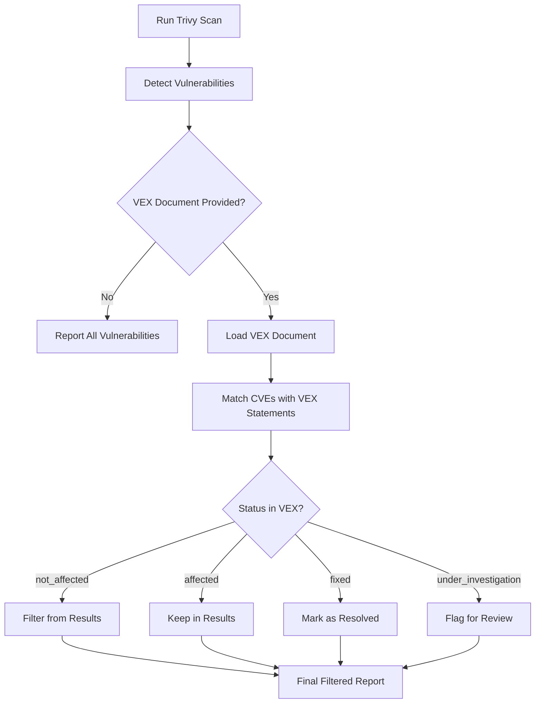

# How to Create Trivy VEX Documents

Author: [nawazdhandala](https://github.com/nawazdhandala)

Tags: Trivy, Security, VEX, Vulnerabilities

Description: Learn how to use VEX documents with Trivy to manage vulnerability exceptions and reduce false positives in your security scans.

---

## Introduction

Vulnerability Exploitability eXchange (VEX) is a standardized format for communicating the exploitability status of vulnerabilities in software products. When running Trivy scans, you often encounter vulnerabilities that are not actually exploitable in your specific context. VEX documents allow you to formally document these exceptions, making your security workflow cleaner and more maintainable.

## What is VEX?

VEX documents provide a machine-readable way to state whether a product is affected by a specific vulnerability. Instead of manually filtering scan results or maintaining complex ignore lists, VEX allows you to:

- Document why certain vulnerabilities do not affect your software
- Share vulnerability assessments across teams
- Maintain an audit trail of security decisions
- Integrate with automated CI/CD pipelines

## VEX Processing Flow



## VEX Document Structure

Trivy supports two main VEX formats: OpenVEX and CSAF. Both formats share core concepts but differ in their structure and metadata requirements.

### Vulnerability Status Values

VEX documents use four standard status values:

| Status | Description |
|--------|-------------|
| `not_affected` | The product is not affected by the vulnerability |
| `affected` | The product is affected and action is recommended |
| `fixed` | The vulnerability has been fixed in this version |
| `under_investigation` | The vendor is investigating the impact |

### Justification Labels

When marking a vulnerability as `not_affected`, you must provide a justification:

| Justification | Description |
|---------------|-------------|
| `component_not_present` | The vulnerable component is not included |
| `vulnerable_code_not_present` | The vulnerable code path does not exist |
| `vulnerable_code_not_in_execute_path` | The code exists but is never executed |
| `vulnerable_code_cannot_be_controlled_by_adversary` | An attacker cannot reach the vulnerable code |
| `inline_mitigations_already_exist` | Security controls prevent exploitation |

## OpenVEX Format

OpenVEX is a lightweight, purpose-built format specifically designed for VEX use cases. It uses JSON and provides a simple structure for vulnerability statements.

### Basic OpenVEX Document

```json
{
  "@context": "https://openvex.dev/ns/v0.2.0",
  "@id": "https://example.com/vex/myapp-2026-001",
  "author": "security-team@example.com",
  "timestamp": "2026-01-30T10:00:00Z",
  "version": 1,
  "statements": [
    {
      "vulnerability": {
        "@id": "CVE-2024-12345"
      },
      "products": [
        {
          "@id": "pkg:docker/myapp@1.0.0"
        }
      ],
      "status": "not_affected",
      "justification": "vulnerable_code_not_present",
      "impact_statement": "The vulnerable function is not compiled into our build."
    }
  ]
}
```

### OpenVEX with Multiple Statements

```json
{
  "@context": "https://openvex.dev/ns/v0.2.0",
  "@id": "https://example.com/vex/myapp-2026-002",
  "author": "security-team@example.com",
  "timestamp": "2026-01-30T10:00:00Z",
  "version": 1,
  "statements": [
    {
      "vulnerability": {
        "@id": "CVE-2024-12345"
      },
      "products": [
        {
          "@id": "pkg:docker/myapp@1.0.0"
        }
      ],
      "status": "not_affected",
      "justification": "component_not_present",
      "impact_statement": "This dependency was removed in version 0.9.0."
    },
    {
      "vulnerability": {
        "@id": "CVE-2024-67890"
      },
      "products": [
        {
          "@id": "pkg:docker/myapp@1.0.0"
        }
      ],
      "status": "not_affected",
      "justification": "vulnerable_code_not_in_execute_path",
      "impact_statement": "The affected code path requires XML parsing which is disabled."
    },
    {
      "vulnerability": {
        "@id": "CVE-2024-11111"
      },
      "products": [
        {
          "@id": "pkg:docker/myapp@1.0.0"
        }
      ],
      "status": "fixed",
      "impact_statement": "Patched in upstream dependency update."
    }
  ]
}
```

## CSAF Format

Common Security Advisory Framework (CSAF) is a more comprehensive format that includes additional metadata and is widely used by security vendors.

### Basic CSAF VEX Document

```json
{
  "document": {
    "category": "csaf_vex",
    "csaf_version": "2.0",
    "publisher": {
      "category": "vendor",
      "name": "Example Corp",
      "namespace": "https://example.com"
    },
    "title": "VEX Document for MyApp",
    "tracking": {
      "current_release_date": "2026-01-30T10:00:00Z",
      "id": "EXAMPLE-VEX-2026-001",
      "initial_release_date": "2026-01-30T10:00:00Z",
      "revision_history": [
        {
          "date": "2026-01-30T10:00:00Z",
          "number": "1",
          "summary": "Initial release"
        }
      ],
      "status": "final",
      "version": "1"
    }
  },
  "product_tree": {
    "branches": [
      {
        "category": "product_name",
        "name": "MyApp",
        "product": {
          "name": "MyApp 1.0.0",
          "product_id": "myapp-1.0.0"
        }
      }
    ]
  },
  "vulnerabilities": [
    {
      "cve": "CVE-2024-12345",
      "notes": [
        {
          "category": "description",
          "text": "The vulnerable component is not included in our distribution."
        }
      ],
      "product_status": {
        "known_not_affected": ["myapp-1.0.0"]
      },
      "threats": [
        {
          "category": "impact",
          "details": "Component not present in build."
        }
      ]
    }
  ]
}
```

## Using VEX Documents with Trivy

### Basic Usage

```bash
# Scan an image with an OpenVEX document
trivy image --vex openvex.json myregistry/myapp:1.0.0

# Scan with a CSAF VEX document
trivy image --vex csaf-vex.json myregistry/myapp:1.0.0

# Use multiple VEX documents
trivy image --vex vex1.json --vex vex2.json myregistry/myapp:1.0.0
```

### Filtering by VEX Status

```bash
# Show only vulnerabilities not covered by VEX
trivy image --vex openvex.json --ignore-status not_affected myregistry/myapp:1.0.0

# Ignore both not_affected and fixed status
trivy image --vex openvex.json \
  --ignore-status not_affected \
  --ignore-status fixed \
  myregistry/myapp:1.0.0
```

### Generating VEX Documents from Trivy

Trivy can generate VEX documents from scan results:

```bash
# Generate an OpenVEX document from scan results
trivy image --format openvex -o baseline-vex.json myregistry/myapp:1.0.0

# Generate a CSAF document
trivy image --format csaf -o baseline-csaf.json myregistry/myapp:1.0.0
```

## Automating VEX Document Creation

### Using vexctl

The `vexctl` tool from the OpenVEX project helps create and manage VEX documents:

```bash
# Install vexctl
go install github.com/openvex/vexctl@latest

# Create a new VEX document
vexctl create \
  --product="pkg:docker/myapp@1.0.0" \
  --vuln="CVE-2024-12345" \
  --status="not_affected" \
  --justification="component_not_present" \
  --output=vex.json

# Add a statement to an existing document
vexctl add vex.json \
  --product="pkg:docker/myapp@1.0.0" \
  --vuln="CVE-2024-67890" \
  --status="not_affected" \
  --justification="vulnerable_code_not_in_execute_path"

# Merge multiple VEX documents
vexctl merge vex1.json vex2.json -o merged-vex.json
```

### Shell Script for Batch Processing

```bash
#!/bin/bash
# create-vex-statements.sh
# Generate VEX statements for a list of CVEs

# Configuration
PRODUCT="pkg:docker/myapp@1.0.0"
AUTHOR="security-team@example.com"
OUTPUT_FILE="vex-batch.json"

# CVEs to mark as not affected with their justifications
declare -A CVE_JUSTIFICATIONS=(
  ["CVE-2024-12345"]="component_not_present"
  ["CVE-2024-67890"]="vulnerable_code_not_in_execute_path"
  ["CVE-2024-11111"]="inline_mitigations_already_exist"
)

# Initialize the VEX document
cat > "$OUTPUT_FILE" << EOF
{
  "@context": "https://openvex.dev/ns/v0.2.0",
  "@id": "https://example.com/vex/batch-$(date +%Y%m%d)",
  "author": "$AUTHOR",
  "timestamp": "$(date -u +%Y-%m-%dT%H:%M:%SZ)",
  "version": 1,
  "statements": []
}
EOF

# Add statements using jq
for cve in "${!CVE_JUSTIFICATIONS[@]}"; do
  justification="${CVE_JUSTIFICATIONS[$cve]}"

  jq --arg cve "$cve" \
     --arg product "$PRODUCT" \
     --arg justification "$justification" \
     '.statements += [{
       "vulnerability": {"@id": $cve},
       "products": [{"@id": $product}],
       "status": "not_affected",
       "justification": $justification
     }]' "$OUTPUT_FILE" > tmp.json && mv tmp.json "$OUTPUT_FILE"

  echo "Added statement for $cve"
done

echo "VEX document created: $OUTPUT_FILE"
```

### Python Script for VEX Generation

```python
#!/usr/bin/env python3
"""
vex_generator.py
Generate OpenVEX documents from Trivy scan results
"""

import json
import subprocess
import sys
from datetime import datetime, timezone
from typing import Optional


def run_trivy_scan(image: str) -> dict:
    """Run Trivy scan and return JSON results."""
    # Execute Trivy scan with JSON output format
    result = subprocess.run(
        ["trivy", "image", "--format", "json", image],
        capture_output=True,
        text=True
    )

    if result.returncode != 0:
        print(f"Error running Trivy: {result.stderr}")
        sys.exit(1)

    return json.loads(result.stdout)


def create_vex_document(
    document_id: str,
    author: str,
    statements: list
) -> dict:
    """Create an OpenVEX document structure."""
    # Build the base VEX document with required fields
    return {
        "@context": "https://openvex.dev/ns/v0.2.0",
        "@id": document_id,
        "author": author,
        "timestamp": datetime.now(timezone.utc).isoformat(),
        "version": 1,
        "statements": statements
    }


def create_statement(
    cve_id: str,
    product_id: str,
    status: str,
    justification: Optional[str] = None,
    impact_statement: Optional[str] = None
) -> dict:
    """Create a single VEX statement."""
    # Build the statement with required fields
    statement = {
        "vulnerability": {"@id": cve_id},
        "products": [{"@id": product_id}],
        "status": status
    }

    # Add optional justification for not_affected status
    if justification:
        statement["justification"] = justification

    # Add optional impact statement for documentation
    if impact_statement:
        statement["impact_statement"] = impact_statement

    return statement


def extract_cves_from_scan(scan_results: dict) -> list:
    """Extract CVE IDs from Trivy scan results."""
    cves = []

    # Iterate through all scan results
    for result in scan_results.get("Results", []):
        for vuln in result.get("Vulnerabilities", []):
            cve_id = vuln.get("VulnerabilityID")
            if cve_id:
                cves.append({
                    "id": cve_id,
                    "package": vuln.get("PkgName"),
                    "severity": vuln.get("Severity")
                })

    return cves


def interactive_vex_creation(image: str, output_file: str):
    """Interactively create VEX statements from scan results."""
    # Run the initial scan
    print(f"Scanning {image}...")
    scan_results = run_trivy_scan(image)
    cves = extract_cves_from_scan(scan_results)

    if not cves:
        print("No vulnerabilities found.")
        return

    print(f"\nFound {len(cves)} vulnerabilities.\n")

    # Define valid justifications for reference
    justifications = [
        "component_not_present",
        "vulnerable_code_not_present",
        "vulnerable_code_not_in_execute_path",
        "vulnerable_code_cannot_be_controlled_by_adversary",
        "inline_mitigations_already_exist"
    ]

    statements = []
    product_id = f"pkg:docker/{image}"

    # Process each CVE interactively
    for cve in cves:
        print(f"\n{cve['id']} ({cve['severity']}) in {cve['package']}")
        response = input("Mark as not_affected? (y/n/skip): ").lower()

        if response == "y":
            print("Justifications:")
            for i, j in enumerate(justifications, 1):
                print(f"  {i}. {j}")

            choice = int(input("Select justification (1-5): ")) - 1
            impact = input("Impact statement (optional): ")

            # Create the statement with user input
            statement = create_statement(
                cve_id=cve["id"],
                product_id=product_id,
                status="not_affected",
                justification=justifications[choice],
                impact_statement=impact if impact else None
            )
            statements.append(statement)

    # Generate the final document
    if statements:
        doc = create_vex_document(
            document_id=f"https://example.com/vex/{image.replace(':', '-')}",
            author="security-team@example.com",
            statements=statements
        )

        # Write to output file
        with open(output_file, "w") as f:
            json.dump(doc, f, indent=2)

        print(f"\nVEX document saved to {output_file}")


if __name__ == "__main__":
    if len(sys.argv) != 3:
        print("Usage: python vex_generator.py <image> <output.json>")
        sys.exit(1)

    interactive_vex_creation(sys.argv[1], sys.argv[2])
```

## CI/CD Integration

### GitHub Actions Workflow

```yaml
# .github/workflows/security-scan.yml
name: Security Scan with VEX

on:
  push:
    branches: [main]
  pull_request:
    branches: [main]

jobs:
  trivy-scan:
    runs-on: ubuntu-latest
    steps:
      - name: Checkout code
        uses: actions/checkout@v4

      - name: Build Docker image
        run: docker build -t myapp:${{ github.sha }} .

      - name: Download VEX documents
        run: |
          # Fetch VEX documents from your security repository
          curl -o baseline-vex.json https://security.example.com/vex/myapp.json

      - name: Run Trivy scan with VEX
        uses: aquasecurity/trivy-action@master
        with:
          image-ref: myapp:${{ github.sha }}
          format: table
          exit-code: 1
          severity: CRITICAL,HIGH
          vex: baseline-vex.json

      - name: Upload scan results
        uses: actions/upload-artifact@v4
        if: always()
        with:
          name: trivy-results
          path: trivy-results.json
```

### GitLab CI Pipeline

```yaml
# .gitlab-ci.yml
security-scan:
  stage: test
  image: docker:latest
  services:
    - docker:dind
  variables:
    TRIVY_VERSION: "0.50.0"
  before_script:
    # Install Trivy scanner
    - apk add --no-cache curl
    - curl -sfL https://raw.githubusercontent.com/aquasecurity/trivy/main/contrib/install.sh | sh -s -- -b /usr/local/bin v${TRIVY_VERSION}
  script:
    # Build the application image
    - docker build -t myapp:${CI_COMMIT_SHA} .

    # Run scan with VEX document from repository
    - trivy image
        --vex security/vex/baseline.json
        --ignore-status not_affected
        --exit-code 1
        --severity CRITICAL,HIGH
        myapp:${CI_COMMIT_SHA}
  artifacts:
    paths:
      - trivy-report.json
    when: always
```

## Best Practices

### 1. Version Your VEX Documents

Always include version information and track changes over time:

```json
{
  "@context": "https://openvex.dev/ns/v0.2.0",
  "@id": "https://example.com/vex/myapp-v3",
  "author": "security-team@example.com",
  "timestamp": "2026-01-30T10:00:00Z",
  "version": 3,
  "last_updated": "2026-01-30T10:00:00Z",
  "statements": []
}
```

### 2. Document Your Reasoning

Always include detailed impact statements explaining your analysis:

```json
{
  "vulnerability": {"@id": "CVE-2024-12345"},
  "products": [{"@id": "pkg:docker/myapp@1.0.0"}],
  "status": "not_affected",
  "justification": "vulnerable_code_not_in_execute_path",
  "impact_statement": "This vulnerability affects XML external entity processing. Our application explicitly disables XXE parsing in config/xml_settings.json and never processes untrusted XML input."
}
```

### 3. Organize VEX Documents by Product

Maintain separate VEX documents for different products or components:

```
security/
  vex/
    frontend-app.json
    backend-api.json
    shared-libraries.json
    base-images.json
```

### 4. Regular Reviews

Schedule periodic reviews of your VEX documents:

- Re-evaluate statements when dependencies are updated
- Remove statements for vulnerabilities that have been patched
- Update justifications if your architecture changes

### 5. Automate Where Possible

Use automation to keep VEX documents current:

```bash
#!/bin/bash
# update-vex-status.sh
# Check if fixed versions are available and update VEX documents

IMAGE="myapp:latest"
VEX_FILE="vex/current.json"

# Scan for vulnerabilities
trivy image --format json "$IMAGE" > scan-results.json

# Check each CVE in VEX against current scan
# If CVE no longer appears, it may be fixed
python3 scripts/check-vex-status.py scan-results.json "$VEX_FILE"
```

## Conclusion

VEX documents provide a standardized, maintainable approach to managing vulnerability exceptions in Trivy scans. By properly documenting why certain vulnerabilities do not affect your software, you can reduce noise in security reports while maintaining a clear audit trail of your security decisions.

Key takeaways:

- Use OpenVEX for simple, lightweight VEX documents
- Use CSAF when you need comprehensive security advisory metadata
- Always provide clear justifications and impact statements
- Integrate VEX documents into your CI/CD pipeline
- Regularly review and update your VEX documents

For more information, visit the [Trivy VEX documentation](https://aquasecurity.github.io/trivy/latest/docs/supply-chain/vex/) and the [OpenVEX specification](https://openvex.dev/).
