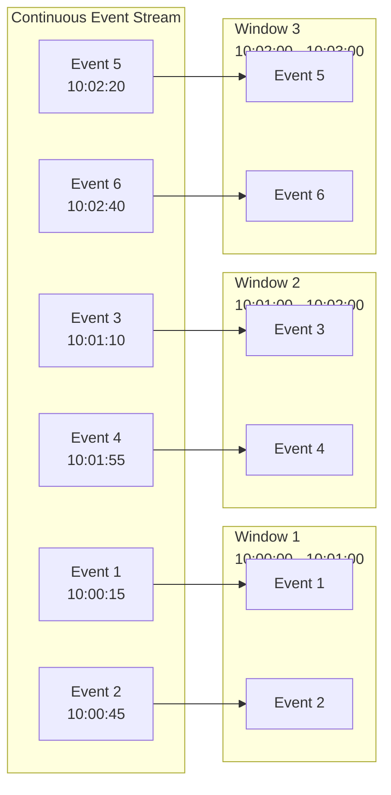
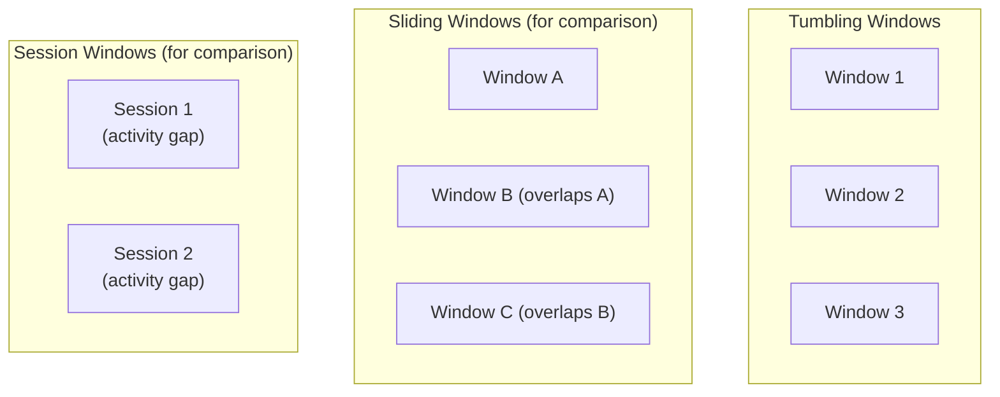
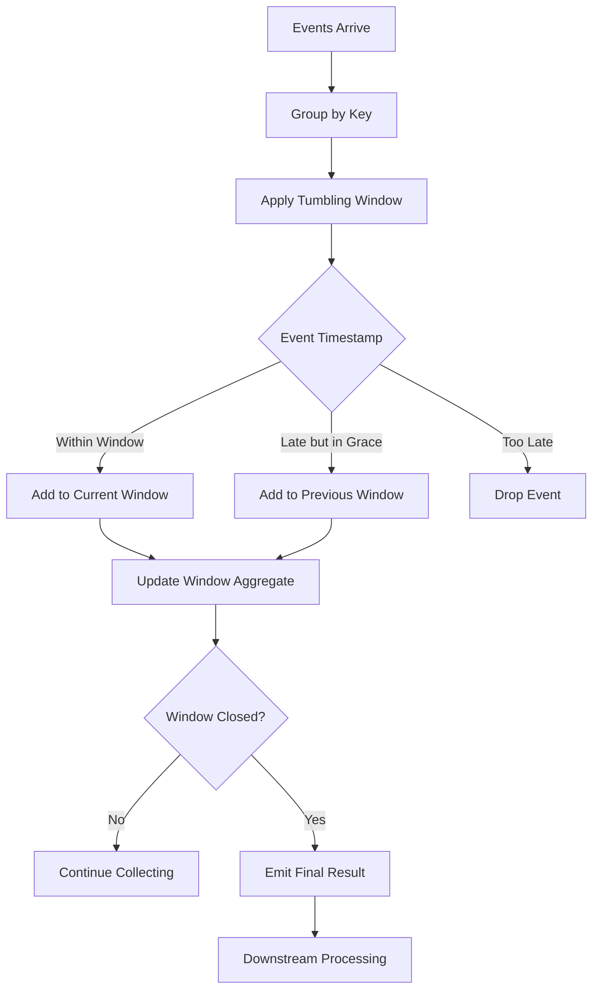
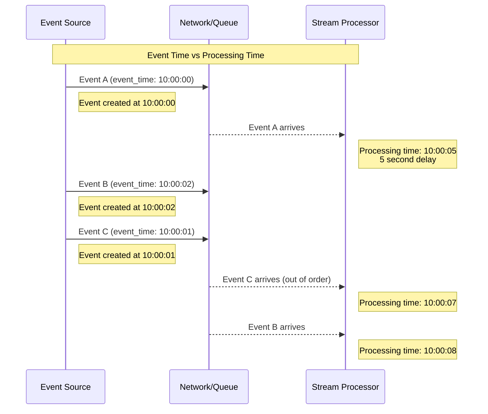
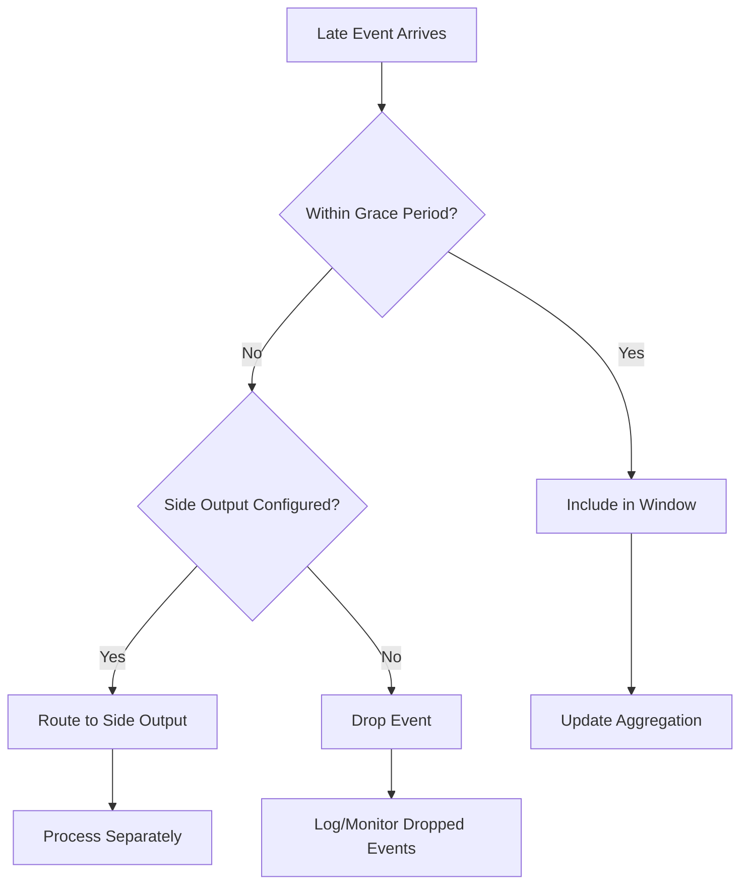
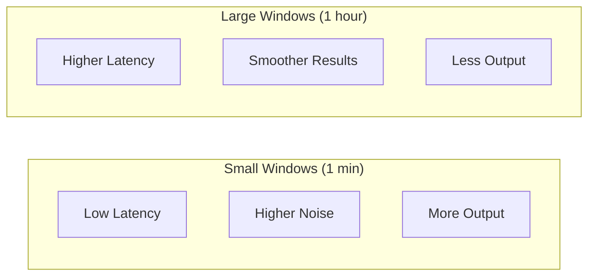

# How to Create Tumbling Windows

Author: [nawazdhandala](https://github.com/nawazdhandala)

Tags: Stream Processing, Windowing, Kafka, Apache Flink

Description: Learn how to implement tumbling windows for fixed-interval stream aggregations.

---

Tumbling windows are one of the most fundamental concepts in stream processing. They allow you to group continuous streams of data into fixed-size, non-overlapping time intervals for aggregation. Whether you are counting page views per minute, calculating average temperatures per hour, or summing transactions per day, tumbling windows provide a clean and predictable way to batch your streaming data.

In this post, we will explore what tumbling windows are, how they differ from other window types, and how to implement them using Kafka Streams and Apache Flink.

## What Are Tumbling Windows?

A tumbling window divides a continuous stream of events into discrete, non-overlapping chunks based on time or count. Each event belongs to exactly one window, and windows never overlap.

### Key Characteristics

- **Fixed size**: Every window has the same duration (e.g., 1 minute, 1 hour)
- **Non-overlapping**: Windows do not share any events
- **Aligned**: Windows typically align to clock time (e.g., minute boundaries)
- **Complete coverage**: Every event falls into exactly one window



## Tumbling vs Other Window Types

Understanding how tumbling windows compare to other windowing strategies helps you choose the right approach for your use case.

### Window Type Comparison



| Window Type | Overlap | Size | Use Case |
|-------------|---------|------|----------|
| Tumbling | None | Fixed | Periodic reports, billing cycles |
| Sliding | Yes | Fixed | Moving averages, trend detection |
| Session | None | Variable | User activity tracking |
| Hopping | Yes | Fixed | Smoothed aggregations |

**When to use tumbling windows:**
- Generating periodic reports (hourly, daily)
- Billing and metering
- Batch-style aggregations over streams
- Simple counting and summing per time period

## Implementing Tumbling Windows in Kafka Streams

Kafka Streams provides a straightforward API for creating tumbling windows. Let us walk through a complete example.

### Basic Tumbling Window Example

```java
import org.apache.kafka.common.serialization.Serdes;
import org.apache.kafka.streams.KafkaStreams;
import org.apache.kafka.streams.StreamsBuilder;
import org.apache.kafka.streams.StreamsConfig;
import org.apache.kafka.streams.kstream.KStream;
import org.apache.kafka.streams.kstream.KTable;
import org.apache.kafka.streams.kstream.Materialized;
import org.apache.kafka.streams.kstream.TimeWindows;
import org.apache.kafka.streams.kstream.Windowed;

import java.time.Duration;
import java.util.Properties;

/**
 * Kafka Streams application demonstrating tumbling windows.
 *
 * This example counts page views per URL in 1-minute tumbling windows.
 * Each window is independent and non-overlapping, providing clean
 * aggregation boundaries.
 */
public class TumblingWindowExample {

    public static void main(String[] args) {
        // Configure the Kafka Streams application
        Properties props = new Properties();
        props.put(StreamsConfig.APPLICATION_ID_CONFIG, "tumbling-window-app");
        props.put(StreamsConfig.BOOTSTRAP_SERVERS_CONFIG, "localhost:9092");
        props.put(StreamsConfig.DEFAULT_KEY_SERDE_CLASS_CONFIG, Serdes.String().getClass());
        props.put(StreamsConfig.DEFAULT_VALUE_SERDE_CLASS_CONFIG, Serdes.String().getClass());

        // Build the stream processing topology
        StreamsBuilder builder = new StreamsBuilder();

        // Read page view events from the input topic
        // Each record contains: key = user_id, value = page_url
        KStream<String, String> pageViews = builder.stream("page-views");

        // Create tumbling windows of 1 minute duration
        // TimeWindows.ofSizeWithNoGrace creates non-overlapping windows
        // that close immediately when the window period ends
        KTable<Windowed<String>, Long> viewCounts = pageViews
            // Re-key by the page URL so we count views per page
            .selectKey((userId, pageUrl) -> pageUrl)
            // Group records by the new key (page URL)
            .groupByKey()
            // Apply tumbling window of 1 minute
            // ofSizeWithNoGrace means late-arriving events are dropped
            .windowedBy(TimeWindows.ofSizeWithNoGrace(Duration.ofMinutes(1)))
            // Count the number of events in each window
            .count(Materialized.as("page-view-counts"));

        // Output the windowed counts
        // The key is now Windowed<String> containing the page URL and window bounds
        viewCounts.toStream()
            .foreach((windowedKey, count) -> {
                // Extract window information for logging
                String pageUrl = windowedKey.key();
                long windowStart = windowedKey.window().start();
                long windowEnd = windowedKey.window().end();

                System.out.printf(
                    "Page: %s | Window: [%d - %d] | Views: %d%n",
                    pageUrl, windowStart, windowEnd, count
                );
            });

        // Create and start the Kafka Streams application
        KafkaStreams streams = new KafkaStreams(builder.build(), props);
        streams.start();

        // Add shutdown hook for graceful termination
        Runtime.getRuntime().addShutdownHook(new Thread(streams::close));
    }
}
```

### Handling Late Arrivals with Grace Period

In real-world scenarios, events may arrive after their window has closed. Kafka Streams allows you to define a grace period to handle late arrivals.

```java
import org.apache.kafka.streams.kstream.TimeWindows;
import org.apache.kafka.streams.kstream.Suppressed;
import org.apache.kafka.streams.kstream.Suppressed.BufferConfig;

import java.time.Duration;

/**
 * Demonstrates tumbling windows with grace period for late events.
 *
 * The grace period allows events to arrive late and still be included
 * in the correct window. This is crucial for handling network delays
 * and out-of-order processing.
 */
public class TumblingWindowWithGrace {

    public KTable<Windowed<String>, Long> createWindowedCounts(KStream<String, String> events) {

        // Create 5-minute tumbling windows with 30-second grace period
        // Events arriving up to 30 seconds after window close are included
        TimeWindows tumblingWindow = TimeWindows
            .ofSizeAndGrace(
                Duration.ofMinutes(5),    // Window size: 5 minutes
                Duration.ofSeconds(30)     // Grace period: 30 seconds
            );

        return events
            .groupByKey()
            .windowedBy(tumblingWindow)
            .count()
            // Suppress intermediate results and emit only final counts
            // This reduces downstream processing and provides stable results
            .suppress(
                Suppressed.untilWindowCloses(
                    // Buffer configuration for holding windowed records
                    BufferConfig.unbounded()
                )
            );
    }
}
```

### Processing Flow Diagram



## Implementing Tumbling Windows in Apache Flink

Apache Flink provides powerful windowing capabilities with its DataStream API. Let us implement the same page view counting example in Flink.

### Basic Flink Tumbling Window

```java
import org.apache.flink.api.common.eventtime.WatermarkStrategy;
import org.apache.flink.api.common.functions.AggregateFunction;
import org.apache.flink.api.java.tuple.Tuple2;
import org.apache.flink.streaming.api.datastream.DataStream;
import org.apache.flink.streaming.api.environment.StreamExecutionEnvironment;
import org.apache.flink.streaming.api.windowing.assigners.TumblingEventTimeWindows;
import org.apache.flink.streaming.api.windowing.time.Time;

import java.time.Duration;

/**
 * Apache Flink application demonstrating tumbling windows.
 *
 * Flink provides two types of tumbling windows:
 * - TumblingEventTimeWindows: Based on event timestamps (preferred)
 * - TumblingProcessingTimeWindows: Based on system clock
 */
public class FlinkTumblingWindowExample {

    public static void main(String[] args) throws Exception {
        // Create the execution environment
        StreamExecutionEnvironment env = StreamExecutionEnvironment.getExecutionEnvironment();

        // Create a source of page view events
        // In production, this would typically be a Kafka source
        DataStream<PageViewEvent> pageViews = env
            .fromElements(
                new PageViewEvent("user1", "/home", 1000L),
                new PageViewEvent("user2", "/home", 2000L),
                new PageViewEvent("user3", "/products", 3000L),
                new PageViewEvent("user1", "/products", 61000L),
                new PageViewEvent("user2", "/home", 62000L)
            )
            // Assign timestamps and watermarks for event-time processing
            // Watermarks track progress in event time and trigger window evaluation
            .assignTimestampsAndWatermarks(
                WatermarkStrategy
                    .<PageViewEvent>forBoundedOutOfOrderness(Duration.ofSeconds(5))
                    .withTimestampAssigner((event, timestamp) -> event.timestamp)
            );

        // Apply tumbling window aggregation
        DataStream<Tuple2<String, Long>> viewCounts = pageViews
            // Key the stream by page URL
            .keyBy(event -> event.pageUrl)
            // Apply 1-minute tumbling window based on event time
            .window(TumblingEventTimeWindows.of(Time.minutes(1)))
            // Aggregate: count events in each window
            .aggregate(new CountAggregator());

        // Print results to stdout
        viewCounts.print();

        // Execute the Flink job
        env.execute("Tumbling Window Page View Counter");
    }

    /**
     * Simple event class representing a page view.
     */
    public static class PageViewEvent {
        public String userId;
        public String pageUrl;
        public long timestamp;

        public PageViewEvent(String userId, String pageUrl, long timestamp) {
            this.userId = userId;
            this.pageUrl = pageUrl;
            this.timestamp = timestamp;
        }
    }

    /**
     * Aggregate function that counts events in a window.
     *
     * The AggregateFunction interface provides efficient incremental aggregation:
     * - createAccumulator: Initialize the counter
     * - add: Increment for each event
     * - getResult: Extract final count
     * - merge: Combine accumulators (for parallel processing)
     */
    public static class CountAggregator
            implements AggregateFunction<PageViewEvent, Long, Tuple2<String, Long>> {

        private String currentKey;

        @Override
        public Long createAccumulator() {
            // Start counting from zero
            return 0L;
        }

        @Override
        public Long add(PageViewEvent event, Long accumulator) {
            // Store the key for result extraction
            this.currentKey = event.pageUrl;
            // Increment the count
            return accumulator + 1;
        }

        @Override
        public Tuple2<String, Long> getResult(Long accumulator) {
            // Return the page URL and its count
            return Tuple2.of(currentKey, accumulator);
        }

        @Override
        public Long merge(Long acc1, Long acc2) {
            // Merge two partial counts (used in parallel processing)
            return acc1 + acc2;
        }
    }
}
```

### Flink Window with Process Function

For more control over window processing, you can use a ProcessWindowFunction.

```java
import org.apache.flink.streaming.api.functions.windowing.ProcessWindowFunction;
import org.apache.flink.streaming.api.windowing.windows.TimeWindow;
import org.apache.flink.util.Collector;

import java.time.Instant;
import java.time.ZoneId;
import java.time.format.DateTimeFormatter;

/**
 * ProcessWindowFunction provides access to window metadata and context.
 *
 * Use this when you need:
 * - Window start/end times in the output
 * - Access to all elements at once (not incremental)
 * - Custom output formatting
 */
public class PageViewWindowFunction
        extends ProcessWindowFunction<PageViewEvent, WindowedPageViewCount, String, TimeWindow> {

    // Formatter for human-readable timestamps
    private static final DateTimeFormatter formatter =
        DateTimeFormatter.ofPattern("yyyy-MM-dd HH:mm:ss").withZone(ZoneId.systemDefault());

    @Override
    public void process(
            String pageUrl,                        // The window key
            Context context,                       // Window context with metadata
            Iterable<PageViewEvent> events,        // All events in the window
            Collector<WindowedPageViewCount> out)  // Output collector
    {
        // Count events in this window
        long count = 0;
        for (PageViewEvent event : events) {
            count++;
        }

        // Get window boundaries from context
        TimeWindow window = context.window();
        String windowStart = formatter.format(Instant.ofEpochMilli(window.getStart()));
        String windowEnd = formatter.format(Instant.ofEpochMilli(window.getEnd()));

        // Emit the result with full window information
        out.collect(new WindowedPageViewCount(
            pageUrl,
            windowStart,
            windowEnd,
            count
        ));
    }
}

/**
 * Output record containing page view count with window boundaries.
 */
class WindowedPageViewCount {
    public String pageUrl;
    public String windowStart;
    public String windowEnd;
    public long count;

    public WindowedPageViewCount(String pageUrl, String windowStart, String windowEnd, long count) {
        this.pageUrl = pageUrl;
        this.windowStart = windowStart;
        this.windowEnd = windowEnd;
        this.count = count;
    }

    @Override
    public String toString() {
        return String.format(
            "Page: %s | Window: [%s to %s] | Views: %d",
            pageUrl, windowStart, windowEnd, count
        );
    }
}
```

## Event Time vs Processing Time

Understanding the difference between event time and processing time is crucial for correct tumbling window implementation.



| Time Type | Description | Use When |
|-----------|-------------|----------|
| Event Time | Timestamp when event occurred | Results must reflect actual event order |
| Processing Time | Timestamp when event is processed | Low latency is priority over accuracy |
| Ingestion Time | Timestamp when event enters the system | Compromise between the two |

**Best Practice:** Use event time for tumbling windows whenever possible. It provides deterministic results regardless of processing delays or out-of-order arrival.

## Handling Late Data

Late data is a reality in distributed systems. Here is how to handle it effectively.

### Strategies for Late Data



### Flink Side Output for Late Data

```java
import org.apache.flink.streaming.api.datastream.SingleOutputStreamOperator;
import org.apache.flink.streaming.api.windowing.assigners.TumblingEventTimeWindows;
import org.apache.flink.streaming.api.windowing.time.Time;
import org.apache.flink.util.OutputTag;

/**
 * Demonstrates handling late data with Flink side outputs.
 *
 * Side outputs allow you to capture late events instead of dropping them.
 * This is useful for:
 * - Debugging and monitoring late event frequency
 * - Reprocessing late events separately
 * - Alerting on excessive lateness
 */
public class LateDataHandling {

    // Define a tag for late events
    // This creates a separate stream for events that arrive too late
    public static final OutputTag<PageViewEvent> LATE_EVENTS =
        new OutputTag<PageViewEvent>("late-events") {};

    public void processWithLateDataHandling(DataStream<PageViewEvent> events) {

        SingleOutputStreamOperator<WindowedPageViewCount> mainOutput = events
            .keyBy(event -> event.pageUrl)
            .window(TumblingEventTimeWindows.of(Time.minutes(1)))
            // Allow events up to 30 seconds late
            .allowedLateness(Time.seconds(30))
            // Route events that are even later to side output
            .sideOutputLateData(LATE_EVENTS)
            .process(new PageViewWindowFunction());

        // Access the late events stream
        DataStream<PageViewEvent> lateEvents = mainOutput.getSideOutput(LATE_EVENTS);

        // Process late events separately
        // Options: store for later analysis, alert, or reprocess
        lateEvents.map(event -> {
            System.out.printf(
                "Late event detected: page=%s, timestamp=%d%n",
                event.pageUrl, event.timestamp
            );
            return event;
        });
    }
}
```

## Best Practices for Tumbling Windows

### 1. Choose the Right Window Size

The window size affects both latency and accuracy. Smaller windows provide faster results but may be noisier.



### 2. Set Appropriate Grace Periods

Balance between data completeness and latency:

```java
// For real-time dashboards: short grace period
TimeWindows.ofSizeAndGrace(Duration.ofMinutes(1), Duration.ofSeconds(5));

// For batch-style reporting: longer grace period
TimeWindows.ofSizeAndGrace(Duration.ofHours(1), Duration.ofMinutes(5));

// For financial reconciliation: very long grace period
TimeWindows.ofSizeAndGrace(Duration.ofDays(1), Duration.ofHours(2));
```

### 3. Monitor Window Metrics

Track these metrics to ensure healthy window processing:

| Metric | Description | Alert Threshold |
|--------|-------------|-----------------|
| Window latency | Time from window close to result emission | > 2x window size |
| Late event rate | Percentage of events arriving after grace | > 5% |
| Window record count | Events per window | Sudden drops or spikes |
| Watermark lag | Difference between watermark and current time | > grace period |

### 4. Consider State Size

Tumbling windows must maintain state until the window closes. For high-cardinality keys:

```java
// Configure state backend for large state
env.setStateBackend(new RocksDBStateBackend("hdfs://namenode:9000/flink/checkpoints"));

// Enable incremental checkpointing for faster recovery
env.getCheckpointConfig().setCheckpointingMode(CheckpointingMode.EXACTLY_ONCE);
env.getCheckpointConfig().setMinPauseBetweenCheckpoints(500);
```

## Common Pitfalls and Solutions

### Pitfall 1: Incorrect Timestamp Assignment

```java
// Wrong: Using processing time when you need event time
.assignTimestampsAndWatermarks(
    WatermarkStrategy.forMonotonousTimestamps()
);

// Correct: Extract timestamp from the event
.assignTimestampsAndWatermarks(
    WatermarkStrategy
        .<PageViewEvent>forBoundedOutOfOrderness(Duration.ofSeconds(5))
        .withTimestampAssigner((event, timestamp) -> event.eventTime)
);
```

### Pitfall 2: Not Handling Watermark Stalls

If one partition stops sending events, watermarks stall. Configure idle source detection:

```java
WatermarkStrategy
    .<PageViewEvent>forBoundedOutOfOrderness(Duration.ofSeconds(5))
    .withIdleness(Duration.ofMinutes(1))  // Mark source idle after 1 minute
    .withTimestampAssigner((event, timestamp) -> event.timestamp);
```

### Pitfall 3: Window Alignment Issues

By default, tumbling windows align to the epoch (1970-01-01 00:00:00 UTC). For custom alignment:

```java
// Align 1-hour windows to start at minute 30 of each hour
TumblingEventTimeWindows.of(
    Time.hours(1),           // Window size
    Time.minutes(30)         // Offset
);
```

## Conclusion

Tumbling windows are a foundational building block for stream processing applications. They provide a clean, predictable way to aggregate streaming data into fixed-size intervals. Key takeaways:

- Tumbling windows are non-overlapping and each event belongs to exactly one window
- Use event time processing for accurate, reproducible results
- Configure appropriate grace periods based on your latency requirements
- Handle late data explicitly using side outputs or allowed lateness
- Monitor window metrics to detect issues early

Both Kafka Streams and Apache Flink provide excellent support for tumbling windows with similar concepts but slightly different APIs. Choose based on your existing infrastructure and performance requirements.

Start with simple tumbling windows for your aggregation needs, and as you become comfortable, explore more advanced windowing strategies like sliding windows and session windows for specific use cases.
