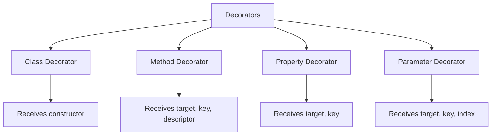

# How to Build Custom Decorators in TypeScript

Author: [nawazdhandala](https://www.github.com/nawazdhandala)

Tags: TypeScript, Decorators, JavaScript, Design Patterns, Metaprogramming

Description: Create powerful TypeScript decorators for classes, methods, properties, and parameters with practical examples for validation, logging, and caching.

---

Decorators in TypeScript provide a clean way to add metadata and modify behavior of classes, methods, properties, and parameters. If you have worked with frameworks like NestJS or Angular, you have already seen decorators in action. But building your own custom decorators unlocks a whole new level of code reusability and expressiveness.

In this guide, we will explore the four types of decorators, understand how they work under the hood, and build practical examples you can use in your projects.

## Enabling Decorators in TypeScript

First, you need to enable decorators in your `tsconfig.json`. Decorators are still an experimental feature, so you must explicitly opt in:

```json
{
  "compilerOptions": {
    "experimentalDecorators": true,
    "emitDecoratorMetadata": true,
    "target": "ES2020"
  }
}
```

The `emitDecoratorMetadata` option is useful when you want to access type information at runtime, which is helpful for dependency injection and validation.

## Understanding Decorator Types

TypeScript supports four types of decorators, each receiving different arguments and serving different purposes:



## Class Decorators

A class decorator is applied to the constructor of a class. It can be used to observe, modify, or replace a class definition. The decorator function receives the constructor as its only argument.

Here is a simple decorator that logs when a class is instantiated:

```typescript
// Class decorator that tracks instantiation
function LogClass(constructor: Function) {
  // Store the original constructor
  const original = constructor;

  // Create a new constructor that logs creation
  const newConstructor: any = function (...args: any[]) {
    console.log(`Creating instance of ${original.name}`);
    return new (original as any)(...args);
  };

  // Copy the prototype so instanceof still works
  newConstructor.prototype = original.prototype;

  return newConstructor;
}

@LogClass
class UserService {
  constructor(private name: string) {}
}

// Output: "Creating instance of UserService"
const service = new UserService("admin");
```

For more flexibility, you can create a decorator factory that accepts configuration options:

```typescript
// Decorator factory with configuration options
function Singleton<T extends { new (...args: any[]): {} }>(constructor: T) {
  let instance: T | null = null;

  // Return a new class that wraps the original
  return class extends constructor {
    constructor(...args: any[]) {
      // Return existing instance if available
      if (instance) {
        return instance;
      }
      super(...args);
      instance = this as any;
    }
  };
}

@Singleton
class ConfigService {
  private settings: Map<string, string> = new Map();

  set(key: string, value: string) {
    this.settings.set(key, value);
  }

  get(key: string): string | undefined {
    return this.settings.get(key);
  }
}

// Both variables reference the same instance
const config1 = new ConfigService();
const config2 = new ConfigService();
console.log(config1 === config2); // true
```

## Method Decorators

Method decorators are the most commonly used type. They receive three arguments: the target object, the method name, and the property descriptor. You can use them to wrap methods with additional behavior.

Here is a logging decorator that records method execution time:

```typescript
// Method decorator for performance logging
function LogExecutionTime() {
  return function (
    target: any,
    propertyKey: string,
    descriptor: PropertyDescriptor
  ) {
    // Save reference to the original method
    const originalMethod = descriptor.value;

    // Replace the method with a wrapped version
    descriptor.value = async function (...args: any[]) {
      const start = performance.now();
      const result = await originalMethod.apply(this, args);
      const duration = performance.now() - start;

      console.log(`${propertyKey} completed in ${duration.toFixed(2)}ms`);
      return result;
    };

    return descriptor;
  };
}

class DataProcessor {
  @LogExecutionTime()
  async processRecords(records: any[]) {
    // Simulate processing time
    await new Promise((resolve) => setTimeout(resolve, 100));
    return records.map((r) => ({ ...r, processed: true }));
  }
}
```

A practical caching decorator can save expensive computations:

```typescript
// Method decorator for caching results
function Memoize(ttlMs: number = 60000) {
  // Cache storage outside the decorator function
  const cache = new Map<string, { value: any; expiry: number }>();

  return function (
    target: any,
    propertyKey: string,
    descriptor: PropertyDescriptor
  ) {
    const originalMethod = descriptor.value;

    descriptor.value = function (...args: any[]) {
      // Create a cache key from method name and arguments
      const cacheKey = `${propertyKey}:${JSON.stringify(args)}`;

      // Check if we have a valid cached value
      const cached = cache.get(cacheKey);
      if (cached && cached.expiry > Date.now()) {
        return cached.value;
      }

      // Execute the method and cache the result
      const result = originalMethod.apply(this, args);
      cache.set(cacheKey, {
        value: result,
        expiry: Date.now() + ttlMs,
      });

      return result;
    };

    return descriptor;
  };
}

class ApiClient {
  @Memoize(30000) // Cache for 30 seconds
  fetchUserProfile(userId: string) {
    console.log(`Fetching profile for ${userId}`);
    // Expensive API call here
    return { id: userId, name: "John Doe" };
  }
}

const client = new ApiClient();
client.fetchUserProfile("123"); // Logs and fetches
client.fetchUserProfile("123"); // Returns cached value, no log
```

## Property Decorators

Property decorators allow you to add metadata or validation to class properties. They receive the target object and property name, but unlike method decorators, they do not have access to a property descriptor.

Here is a validation decorator that enforces constraints:

```typescript
// Store for validation rules
const validationRules = new Map<string, Map<string, Function[]>>();

// Property decorator for minimum length validation
function MinLength(length: number) {
  return function (target: any, propertyKey: string) {
    const className = target.constructor.name;

    // Initialize storage for this class if needed
    if (!validationRules.has(className)) {
      validationRules.set(className, new Map());
    }

    const classRules = validationRules.get(className)!;
    if (!classRules.has(propertyKey)) {
      classRules.set(propertyKey, []);
    }

    // Add the validation rule
    classRules.get(propertyKey)!.push((value: any) => {
      if (typeof value === "string" && value.length < length) {
        throw new Error(
          `${propertyKey} must be at least ${length} characters`
        );
      }
      return true;
    });
  };
}

// Validate function to check all rules
function validate(instance: any): boolean {
  const className = instance.constructor.name;
  const rules = validationRules.get(className);

  if (!rules) return true;

  for (const [property, validators] of rules) {
    const value = instance[property];
    for (const validator of validators) {
      validator(value);
    }
  }

  return true;
}

class CreateUserDto {
  @MinLength(3)
  username: string;

  @MinLength(8)
  password: string;

  constructor(username: string, password: string) {
    this.username = username;
    this.password = password;
  }
}

const dto = new CreateUserDto("ab", "short");
validate(dto); // Throws: "username must be at least 3 characters"
```

## Parameter Decorators

Parameter decorators mark specific parameters for special handling. They receive the target, method name, and the parameter index. These are commonly used for dependency injection.

```typescript
// Storage for injection metadata
const injectableParams = new Map<string, Map<string, number[]>>();

// Parameter decorator to mark injectable dependencies
function Inject(serviceKey: string) {
  return function (
    target: any,
    propertyKey: string,
    parameterIndex: number
  ) {
    const className = target.constructor.name;
    const key = `${className}:${propertyKey}`;

    if (!injectableParams.has(key)) {
      injectableParams.set(key, new Map());
    }

    // Store which parameter index needs which service
    injectableParams.get(key)!.set(serviceKey, parameterIndex);

    console.log(
      `Marked parameter ${parameterIndex} of ${propertyKey} for injection: ${serviceKey}`
    );
  };
}

// Simple service container
const container = new Map<string, any>();
container.set("logger", { log: (msg: string) => console.log(msg) });
container.set("config", { apiUrl: "https://api.example.com" });

class OrderService {
  processOrder(
    @Inject("logger") logger: any,
    @Inject("config") config: any,
    orderId: string
  ) {
    logger.log(`Processing order ${orderId} with API: ${config.apiUrl}`);
  }
}
```

## Combining Decorators

Multiple decorators can be applied to a single target. They execute in reverse order from how they are listed:

```typescript
// Decorators execute bottom-to-top
function First() {
  return function (
    target: any,
    key: string,
    descriptor: PropertyDescriptor
  ) {
    console.log("First decorator applied");
    return descriptor;
  };
}

function Second() {
  return function (
    target: any,
    key: string,
    descriptor: PropertyDescriptor
  ) {
    console.log("Second decorator applied");
    return descriptor;
  };
}

class Example {
  @First()   // Applied second
  @Second()  // Applied first
  method() {}
}

// Output:
// "Second decorator applied"
// "First decorator applied"
```

## Practical Example: Rate Limiting Decorator

Here is a complete example combining everything we have learned:

```typescript
// Rate limiting decorator with configurable limits
function RateLimit(maxCalls: number, windowMs: number) {
  // Track calls per instance
  const callHistory = new WeakMap<object, number[]>();

  return function (
    target: any,
    propertyKey: string,
    descriptor: PropertyDescriptor
  ) {
    const originalMethod = descriptor.value;

    descriptor.value = function (...args: any[]) {
      const now = Date.now();

      // Get or initialize call history for this instance
      if (!callHistory.has(this)) {
        callHistory.set(this, []);
      }

      const history = callHistory.get(this)!;

      // Remove calls outside the current window
      const validCalls = history.filter(
        (timestamp) => now - timestamp < windowMs
      );
      callHistory.set(this, validCalls);

      // Check if limit exceeded
      if (validCalls.length >= maxCalls) {
        throw new Error(
          `Rate limit exceeded: ${maxCalls} calls per ${windowMs}ms`
        );
      }

      // Record this call and execute
      validCalls.push(now);
      return originalMethod.apply(this, args);
    };

    return descriptor;
  };
}

class NotificationService {
  @RateLimit(5, 10000) // 5 calls per 10 seconds
  sendNotification(userId: string, message: string) {
    console.log(`Sending to ${userId}: ${message}`);
    return { success: true };
  }
}
```

## Summary

Custom decorators provide a powerful way to add cross-cutting concerns to your TypeScript code without cluttering business logic. Class decorators modify or replace constructors, method decorators wrap function behavior, property decorators add metadata for validation or serialization, and parameter decorators mark arguments for injection.

Start with simple logging or validation decorators and gradually build more complex patterns as you become comfortable with the decorator API. The key is to keep each decorator focused on a single responsibility, making them easy to compose and reuse across your codebase.
