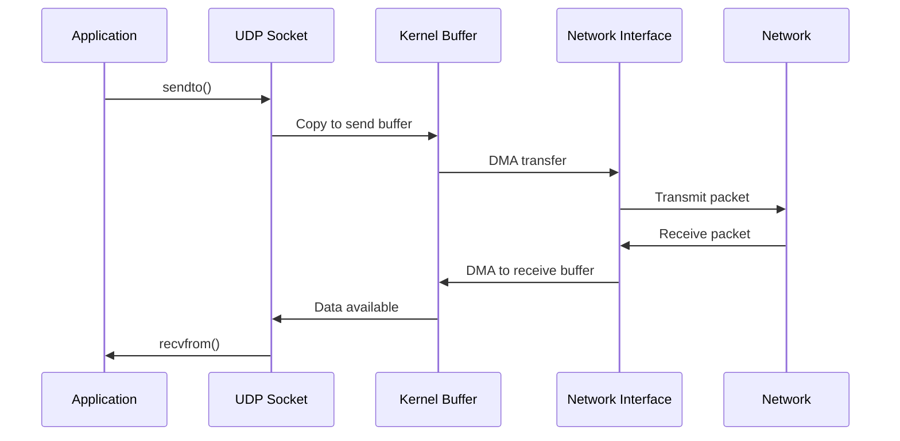
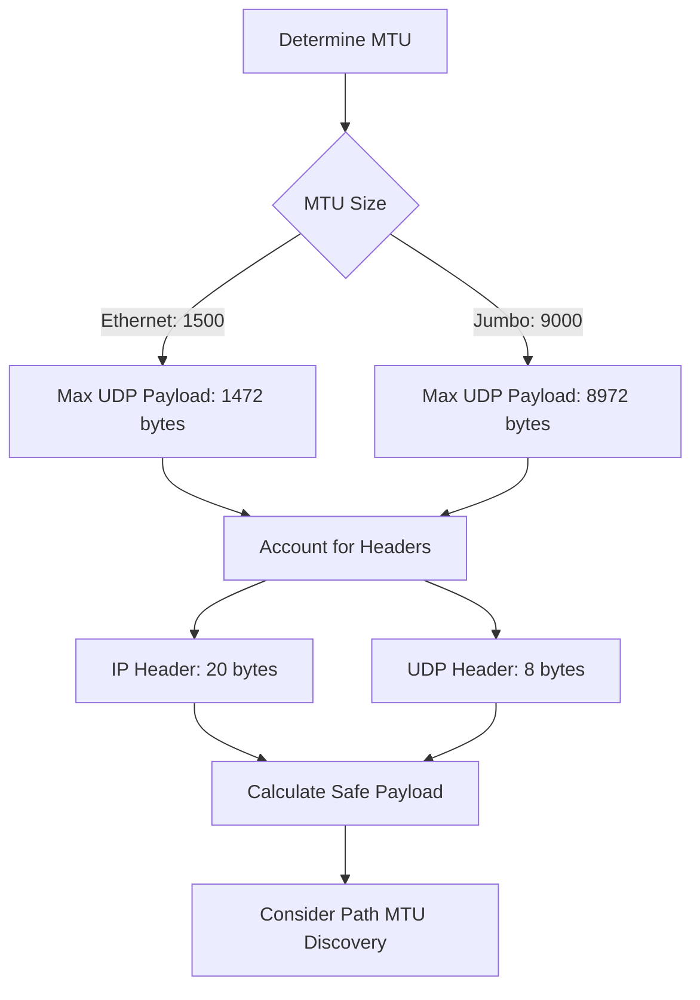
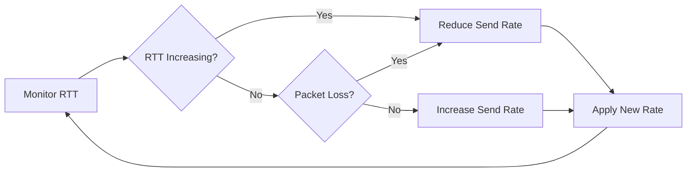

# How to Build UDP Optimization Strategies

Author: [nawazdhandala](https://github.com/nawazdhandala)

Tags: Networking, UDP, Performance, LowLatency

Description: A comprehensive guide to optimizing UDP for low-latency communication in real-time applications.

---

## Introduction

User Datagram Protocol (UDP) is the backbone of real-time communication systems where speed matters more than guaranteed delivery. From online gaming to video streaming, voice over IP, and financial trading systems, UDP provides the foundation for applications that cannot tolerate the latency overhead of TCP's reliability mechanisms.

This guide explores practical strategies to optimize UDP for low-latency communication, covering buffer tuning, socket options, packet sizing, and flow control techniques.

## Understanding UDP Communication Flow

Before diving into optimization strategies, let's visualize how UDP communication works:



## UDP Buffer Tuning

Buffer sizes significantly impact UDP performance. Too small, and you risk packet loss during traffic bursts. Too large, and you introduce unnecessary latency.

### System-Level Buffer Configuration

```bash
# Check current UDP buffer sizes (Linux)
sysctl net.core.rmem_default
sysctl net.core.rmem_max
sysctl net.core.wmem_default
sysctl net.core.wmem_max

# Set optimal buffer sizes for low-latency applications
# Default receive buffer: 256KB
sudo sysctl -w net.core.rmem_default=262144

# Maximum receive buffer: 16MB (for burst handling)
sudo sysctl -w net.core.rmem_max=16777216

# Default send buffer: 256KB
sudo sysctl -w net.core.wmem_default=262144

# Maximum send buffer: 16MB
sudo sysctl -w net.core.wmem_max=16777216
```

### Application-Level Buffer Tuning

```python
import socket

def create_optimized_udp_socket(
    recv_buffer_size: int = 262144,  # 256KB receive buffer
    send_buffer_size: int = 262144   # 256KB send buffer
) -> socket.socket:
    """
    Create a UDP socket with optimized buffer sizes.

    Args:
        recv_buffer_size: Size of the receive buffer in bytes
        send_buffer_size: Size of the send buffer in bytes

    Returns:
        Configured UDP socket
    """
    # Create UDP socket (SOCK_DGRAM for UDP)
    sock = socket.socket(socket.AF_INET, socket.SOCK_DGRAM)

    # Set receive buffer size
    # Larger buffers help absorb traffic bursts without packet loss
    sock.setsockopt(socket.SOL_SOCKET, socket.SO_RCVBUF, recv_buffer_size)

    # Set send buffer size
    # Allows queuing multiple packets for transmission
    sock.setsockopt(socket.SOL_SOCKET, socket.SO_SNDBUF, send_buffer_size)

    # Verify the actual buffer sizes (kernel may adjust)
    actual_recv = sock.getsockopt(socket.SOL_SOCKET, socket.SO_RCVBUF)
    actual_send = sock.getsockopt(socket.SOL_SOCKET, socket.SO_SNDBUF)

    print(f"Receive buffer: requested={recv_buffer_size}, actual={actual_recv}")
    print(f"Send buffer: requested={send_buffer_size}, actual={actual_send}")

    return sock
```

## Socket Options for Low-Latency UDP

### Essential Socket Options

```python
import socket
import struct

def configure_low_latency_socket(sock: socket.socket) -> None:
    """
    Configure socket options for minimum latency.

    Args:
        sock: UDP socket to configure
    """
    # SO_REUSEADDR: Allow quick socket reuse after restart
    # Prevents "Address already in use" errors
    sock.setsockopt(socket.SOL_SOCKET, socket.SO_REUSEADDR, 1)

    # SO_REUSEPORT: Allow multiple processes to bind to same port
    # Useful for load balancing across worker processes
    sock.setsockopt(socket.SOL_SOCKET, socket.SO_REUSEPORT, 1)

    # Set non-blocking mode for asynchronous I/O
    sock.setblocking(False)

    # IP_TOS: Set Type of Service for QoS
    # IPTOS_LOWDELAY (0x10) requests low-delay routing
    sock.setsockopt(socket.IPPROTO_IP, socket.IP_TOS, 0x10)
```

### Platform-Specific Optimizations

```python
import sys

def apply_platform_optimizations(sock: socket.socket) -> None:
    """
    Apply platform-specific socket optimizations.

    Args:
        sock: UDP socket to optimize
    """
    if sys.platform == 'linux':
        # SO_BUSY_POLL: Reduce latency by busy-polling
        # Value is microseconds to busy-poll before blocking
        try:
            sock.setsockopt(socket.SOL_SOCKET, 46, 50)  # SO_BUSY_POLL = 46
        except OSError:
            pass  # May require CAP_NET_ADMIN

        # IP_PKTINFO: Receive packet info for multi-homed hosts
        sock.setsockopt(socket.IPPROTO_IP, socket.IP_PKTINFO, 1)

    elif sys.platform == 'darwin':  # macOS
        # SO_NOSIGPIPE: Prevent SIGPIPE on write errors
        sock.setsockopt(socket.SOL_SOCKET, socket.SO_NOSIGPIPE, 1)
```

## Packet Size Optimization

Choosing the right packet size is crucial for UDP performance:



### Calculating Optimal Packet Size

```python
import subprocess
import re

def discover_path_mtu(destination: str) -> int:
    """
    Discover the Path MTU to a destination.

    Args:
        destination: Target IP address or hostname

    Returns:
        Discovered MTU in bytes
    """
    # Standard Ethernet MTU
    default_mtu = 1500

    try:
        # Use tracepath for PMTU discovery (Linux)
        result = subprocess.run(
            ['tracepath', '-n', destination],
            capture_output=True,
            text=True,
            timeout=10
        )

        # Parse the output for MTU information
        mtu_match = re.search(r'pmtu (\d+)', result.stdout)
        if mtu_match:
            return int(mtu_match.group(1))
    except (subprocess.TimeoutExpired, FileNotFoundError):
        pass

    return default_mtu


def calculate_optimal_payload(mtu: int, use_ipv6: bool = False) -> int:
    """
    Calculate the optimal UDP payload size.

    Args:
        mtu: Maximum Transmission Unit in bytes
        use_ipv6: Whether using IPv6 (larger header)

    Returns:
        Optimal payload size in bytes
    """
    # IP header size: IPv4 = 20 bytes, IPv6 = 40 bytes
    ip_header = 40 if use_ipv6 else 20

    # UDP header is always 8 bytes
    udp_header = 8

    # Calculate maximum payload
    max_payload = mtu - ip_header - udp_header

    # Leave some margin for optional headers and tunneling
    safe_payload = max_payload - 20

    return safe_payload


# Example usage
mtu = 1500  # Standard Ethernet
optimal_size = calculate_optimal_payload(mtu)
print(f"Optimal UDP payload size: {optimal_size} bytes")  # Output: 1452 bytes
```

### Packet Size Guidelines

| Use Case | Recommended Size | Rationale |
|----------|-----------------|-----------|
| Real-time gaming | 512-1024 bytes | Balance latency and overhead |
| Voice over IP | 160-320 bytes | Match codec frame sizes |
| Video streaming | 1200-1400 bytes | Maximize throughput |
| Financial data | 64-256 bytes | Minimize serialization time |

## Rate Limiting and Flow Control

Since UDP lacks built-in congestion control, implementing your own is essential to prevent network flooding.

### Token Bucket Rate Limiter

```python
import time
from threading import Lock

class TokenBucketRateLimiter:
    """
    Token bucket algorithm for UDP rate limiting.

    Allows burst traffic up to bucket capacity while
    maintaining an average rate over time.
    """

    def __init__(
        self,
        rate: float,           # Tokens per second
        capacity: float        # Maximum bucket size
    ):
        """
        Initialize the rate limiter.

        Args:
            rate: Number of tokens added per second
            capacity: Maximum tokens the bucket can hold
        """
        self.rate = rate
        self.capacity = capacity
        self.tokens = capacity      # Start with full bucket
        self.last_update = time.monotonic()
        self.lock = Lock()

    def acquire(self, tokens: float = 1.0) -> bool:
        """
        Attempt to acquire tokens for sending.

        Args:
            tokens: Number of tokens to acquire

        Returns:
            True if tokens acquired, False if rate limited
        """
        with self.lock:
            now = time.monotonic()
            elapsed = now - self.last_update

            # Add tokens based on elapsed time
            self.tokens = min(
                self.capacity,
                self.tokens + elapsed * self.rate
            )
            self.last_update = now

            # Check if we have enough tokens
            if self.tokens >= tokens:
                self.tokens -= tokens
                return True

            return False

    def wait_for_token(self, tokens: float = 1.0) -> float:
        """
        Wait until tokens are available.

        Args:
            tokens: Number of tokens needed

        Returns:
            Time waited in seconds
        """
        start = time.monotonic()

        while not self.acquire(tokens):
            # Calculate wait time for tokens to regenerate
            with self.lock:
                tokens_needed = tokens - self.tokens
                wait_time = tokens_needed / self.rate

            # Sleep for a fraction of the needed time
            time.sleep(min(wait_time, 0.001))  # Max 1ms sleep

        return time.monotonic() - start


# Example: Limit to 10,000 packets per second with burst of 100
rate_limiter = TokenBucketRateLimiter(rate=10000, capacity=100)

def send_packet(sock: socket.socket, data: bytes, addr: tuple) -> bool:
    """
    Send a packet with rate limiting.

    Args:
        sock: UDP socket
        data: Data to send
        addr: Destination address tuple (host, port)

    Returns:
        True if sent, False if rate limited
    """
    if rate_limiter.acquire():
        sock.sendto(data, addr)
        return True
    return False
```

### Adaptive Flow Control



```python
import statistics
from collections import deque
from dataclasses import dataclass
from typing import Optional

@dataclass
class FlowMetrics:
    """Metrics for adaptive flow control."""
    rtt_samples: deque        # Recent RTT measurements
    loss_count: int           # Packets lost in window
    sent_count: int           # Packets sent in window
    current_rate: float       # Current send rate (packets/sec)

class AdaptiveFlowController:
    """
    Adaptive flow control based on network conditions.

    Adjusts send rate based on RTT and packet loss.
    """

    def __init__(
        self,
        initial_rate: float = 1000,   # Initial packets per second
        min_rate: float = 100,         # Minimum rate
        max_rate: float = 50000,       # Maximum rate
        rtt_window: int = 50           # RTT samples to keep
    ):
        self.metrics = FlowMetrics(
            rtt_samples=deque(maxlen=rtt_window),
            loss_count=0,
            sent_count=0,
            current_rate=initial_rate
        )
        self.min_rate = min_rate
        self.max_rate = max_rate
        self.baseline_rtt: Optional[float] = None

    def record_rtt(self, rtt_ms: float) -> None:
        """
        Record an RTT measurement.

        Args:
            rtt_ms: Round-trip time in milliseconds
        """
        self.metrics.rtt_samples.append(rtt_ms)

        # Establish baseline RTT from first samples
        if self.baseline_rtt is None and len(self.metrics.rtt_samples) >= 10:
            self.baseline_rtt = statistics.median(self.metrics.rtt_samples)

    def record_loss(self) -> None:
        """Record a packet loss event."""
        self.metrics.loss_count += 1

    def record_sent(self) -> None:
        """Record a successful send."""
        self.metrics.sent_count += 1

    def adjust_rate(self) -> float:
        """
        Adjust the send rate based on current metrics.

        Returns:
            New send rate in packets per second
        """
        if len(self.metrics.rtt_samples) < 10:
            return self.metrics.current_rate

        # Calculate current RTT
        current_rtt = statistics.median(self.metrics.rtt_samples)

        # Calculate loss rate
        total = self.metrics.sent_count + self.metrics.loss_count
        loss_rate = self.metrics.loss_count / max(total, 1)

        # Determine rate adjustment
        if loss_rate > 0.05:  # More than 5% loss
            # Multiplicative decrease
            new_rate = self.metrics.current_rate * 0.5
        elif self.baseline_rtt and current_rtt > self.baseline_rtt * 1.5:
            # RTT increased significantly
            new_rate = self.metrics.current_rate * 0.8
        elif loss_rate < 0.01 and current_rtt <= self.baseline_rtt * 1.1:
            # Good conditions, additive increase
            new_rate = self.metrics.current_rate + 100
        else:
            new_rate = self.metrics.current_rate

        # Clamp to allowed range
        self.metrics.current_rate = max(
            self.min_rate,
            min(self.max_rate, new_rate)
        )

        # Reset counters
        self.metrics.loss_count = 0
        self.metrics.sent_count = 0

        return self.metrics.current_rate
```

## Complete Low-Latency UDP Server Example

```python
import socket
import select
import time
from typing import Callable, Dict, Tuple

class LowLatencyUDPServer:
    """
    High-performance UDP server optimized for low latency.
    """

    def __init__(
        self,
        host: str,
        port: int,
        handler: Callable[[bytes, Tuple[str, int]], bytes]
    ):
        """
        Initialize the UDP server.

        Args:
            host: Bind address
            port: Bind port
            handler: Function to process incoming data
        """
        self.host = host
        self.port = port
        self.handler = handler
        self.sock: socket.socket = None
        self.running = False

        # Performance metrics
        self.packets_received = 0
        self.packets_sent = 0
        self.total_latency_us = 0

    def setup_socket(self) -> None:
        """Configure the server socket with optimizations."""
        self.sock = socket.socket(socket.AF_INET, socket.SOCK_DGRAM)

        # Reuse address for quick restarts
        self.sock.setsockopt(socket.SOL_SOCKET, socket.SO_REUSEADDR, 1)

        # Increase buffer sizes
        self.sock.setsockopt(socket.SOL_SOCKET, socket.SO_RCVBUF, 1048576)
        self.sock.setsockopt(socket.SOL_SOCKET, socket.SO_SNDBUF, 1048576)

        # Set low-delay TOS
        self.sock.setsockopt(socket.IPPROTO_IP, socket.IP_TOS, 0x10)

        # Non-blocking for event loop
        self.sock.setblocking(False)

        # Bind to address
        self.sock.bind((self.host, self.port))

        print(f"UDP server listening on {self.host}:{self.port}")

    def run(self, timeout: float = 0.001) -> None:
        """
        Run the server event loop.

        Args:
            timeout: Select timeout in seconds (lower = lower latency)
        """
        self.setup_socket()
        self.running = True

        while self.running:
            # Use select for efficient I/O multiplexing
            readable, _, _ = select.select([self.sock], [], [], timeout)

            if readable:
                self._handle_readable()

    def _handle_readable(self) -> None:
        """Process incoming packets."""
        try:
            # Receive packet with timestamp
            recv_time = time.perf_counter_ns()
            data, addr = self.sock.recvfrom(65535)

            self.packets_received += 1

            # Process the packet
            response = self.handler(data, addr)

            if response:
                self.sock.sendto(response, addr)
                self.packets_sent += 1

            # Track processing latency
            process_time = time.perf_counter_ns() - recv_time
            self.total_latency_us += process_time / 1000

        except BlockingIOError:
            pass  # No data available
        except Exception as e:
            print(f"Error handling packet: {e}")

    def get_stats(self) -> Dict:
        """Get server performance statistics."""
        avg_latency = 0
        if self.packets_received > 0:
            avg_latency = self.total_latency_us / self.packets_received

        return {
            'packets_received': self.packets_received,
            'packets_sent': self.packets_sent,
            'avg_processing_latency_us': avg_latency
        }

    def stop(self) -> None:
        """Stop the server."""
        self.running = False
        if self.sock:
            self.sock.close()


# Example usage
def echo_handler(data: bytes, addr: Tuple[str, int]) -> bytes:
    """Simple echo handler that returns received data."""
    return data

if __name__ == '__main__':
    server = LowLatencyUDPServer('0.0.0.0', 9999, echo_handler)
    try:
        server.run()
    except KeyboardInterrupt:
        server.stop()
        print(f"Stats: {server.get_stats()}")
```

## Performance Monitoring and Debugging

### Measuring UDP Latency

```python
import socket
import struct
import time

def measure_udp_latency(
    host: str,
    port: int,
    num_packets: int = 100
) -> Dict[str, float]:
    """
    Measure UDP round-trip latency to a server.

    Args:
        host: Target host
        port: Target port
        num_packets: Number of test packets

    Returns:
        Dictionary with latency statistics
    """
    sock = socket.socket(socket.AF_INET, socket.SOCK_DGRAM)
    sock.settimeout(1.0)  # 1 second timeout

    latencies = []
    lost = 0

    for seq in range(num_packets):
        # Create packet with sequence number and timestamp
        send_time = time.perf_counter_ns()
        packet = struct.pack('!QQ', seq, send_time)

        try:
            sock.sendto(packet, (host, port))
            response, _ = sock.recvfrom(1024)
            recv_time = time.perf_counter_ns()

            # Calculate round-trip time in microseconds
            rtt_us = (recv_time - send_time) / 1000
            latencies.append(rtt_us)

        except socket.timeout:
            lost += 1

    sock.close()

    if not latencies:
        return {'error': 'All packets lost'}

    latencies.sort()

    return {
        'min_us': latencies[0],
        'max_us': latencies[-1],
        'avg_us': sum(latencies) / len(latencies),
        'median_us': latencies[len(latencies) // 2],
        'p99_us': latencies[int(len(latencies) * 0.99)],
        'loss_percent': (lost / num_packets) * 100
    }
```

## Best Practices Summary

1. **Buffer Sizing**: Match buffer sizes to your traffic patterns. Larger buffers absorb bursts but add latency.

2. **Packet Size**: Stay below MTU to avoid fragmentation. Target 1400 bytes for general use, smaller for latency-critical applications.

3. **Socket Options**: Enable SO_REUSEADDR, set appropriate TOS bits, and use non-blocking I/O.

4. **Rate Limiting**: Implement token bucket or similar algorithms to prevent network flooding.

5. **Flow Control**: Monitor RTT and packet loss to adapt send rates dynamically.

6. **Monitoring**: Continuously measure latency and loss to detect issues early.

## Conclusion

Optimizing UDP for low-latency communication requires careful attention to buffer sizes, socket configuration, packet sizing, and flow control. By implementing the strategies outlined in this guide, you can build high-performance UDP applications suitable for real-time gaming, video streaming, voice communication, and other latency-sensitive use cases.

Remember that UDP optimization is highly application-specific. Profile your application, measure actual network conditions, and tune parameters based on real-world data rather than theoretical values.
