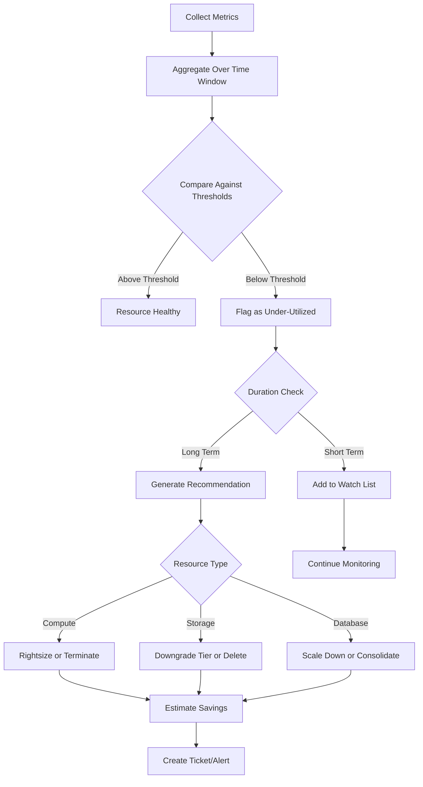
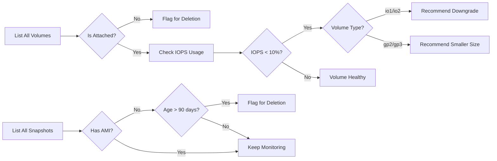
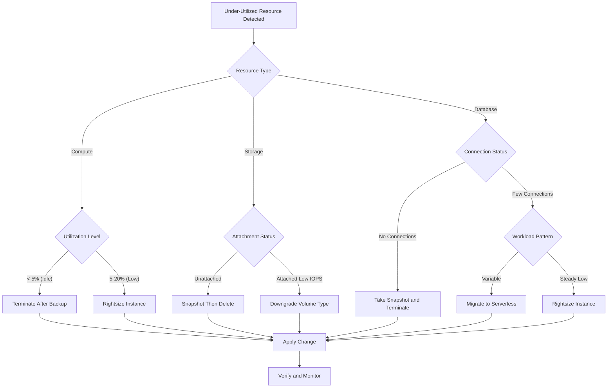
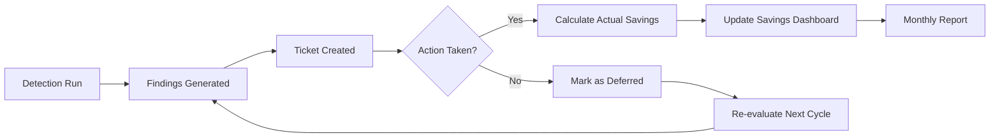

# How to Implement Under-Utilized Detection

Author: [nawazdhandala](https://github.com/nawazdhandala)

Tags: Cost Optimization, FinOps, Cloud, Efficiency

Description: Learn how to detect and remediate under-utilized cloud resources.

---

Cloud waste is a silent budget killer. Studies consistently show that 25-35% of cloud spend goes to under-utilized or idle resources. Detecting these resources before they drain your budget is a foundational FinOps practice that every engineering team should implement.

This guide walks through practical strategies to identify under-utilized compute, storage, and database resources, along with automation patterns to remediate waste continuously.

---

## Understanding Under-Utilization Thresholds

Before you can detect waste, you need to define what "under-utilized" means for your organization. Here are industry-standard thresholds to start with:

| Resource Type | Metric | Under-Utilized Threshold | Idle Threshold |
|---------------|--------|--------------------------|----------------|
| Compute (VM/Container) | CPU Utilization | < 20% avg over 7 days | < 5% avg over 14 days |
| Compute (VM/Container) | Memory Utilization | < 30% avg over 7 days | < 10% avg over 14 days |
| Storage (Block) | IOPS Used | < 10% of provisioned | < 1% for 30 days |
| Storage (Object) | Access Frequency | No reads in 30 days | No reads in 90 days |
| Database (RDS/SQL) | Connections | < 5 active connections | 0 connections for 7 days |
| Database (RDS/SQL) | CPU Utilization | < 10% avg over 7 days | < 2% avg over 14 days |
| Load Balancer | Request Count | < 100 requests/day | 0 requests for 7 days |

Adjust these thresholds based on your workload patterns. Batch processing systems may legitimately spike once daily, while real-time services should show consistent utilization.

---

## The Under-Utilization Detection Flow

Here's how a comprehensive detection system works:



---

## Compute Utilization Analysis

Compute resources are typically the largest source of cloud waste. Here's how to build a detection system.

### Collecting CPU and Memory Metrics

Use OpenTelemetry or cloud-native APIs to collect utilization data. This Python script demonstrates pulling EC2 metrics from CloudWatch:

`scripts/collect_compute_metrics.py`

This script fetches CPU and memory utilization from CloudWatch for all EC2 instances. It calculates 7-day averages and flags instances below threshold.

```python
import boto3
from datetime import datetime, timedelta
from dataclasses import dataclass

@dataclass
class InstanceMetrics:
    instance_id: str
    instance_type: str
    avg_cpu: float
    avg_memory: float
    cost_per_hour: float

def get_ec2_utilization(days: int = 7) -> list[InstanceMetrics]:
    """
    Collect CPU utilization for all EC2 instances over the specified period.
    Returns a list of InstanceMetrics with utilization data.
    """
    ec2 = boto3.client('ec2')
    cloudwatch = boto3.client('cloudwatch')

    # Get all running instances
    instances = ec2.describe_instances(
        Filters=[{'Name': 'instance-state-name', 'Values': ['running']}]
    )

    results = []
    end_time = datetime.utcnow()
    start_time = end_time - timedelta(days=days)

    for reservation in instances['Reservations']:
        for instance in reservation['Instances']:
            instance_id = instance['InstanceId']
            instance_type = instance['InstanceType']

            # Fetch CPU utilization metric
            cpu_response = cloudwatch.get_metric_statistics(
                Namespace='AWS/EC2',
                MetricName='CPUUtilization',
                Dimensions=[{'Name': 'InstanceId', 'Value': instance_id}],
                StartTime=start_time,
                EndTime=end_time,
                Period=3600,  # 1-hour granularity
                Statistics=['Average']
            )

            # Calculate average CPU over the period
            datapoints = cpu_response.get('Datapoints', [])
            avg_cpu = sum(d['Average'] for d in datapoints) / len(datapoints) if datapoints else 0

            results.append(InstanceMetrics(
                instance_id=instance_id,
                instance_type=instance_type,
                avg_cpu=avg_cpu,
                avg_memory=0,  # Requires CloudWatch agent
                cost_per_hour=get_instance_cost(instance_type)
            ))

    return results

def get_instance_cost(instance_type: str) -> float:
    """Look up hourly on-demand cost for instance type."""
    # In production, use AWS Price List API or a pricing database
    pricing = {
        't3.micro': 0.0104,
        't3.small': 0.0208,
        't3.medium': 0.0416,
        'm5.large': 0.096,
        'm5.xlarge': 0.192,
        'c5.large': 0.085,
        'r5.large': 0.126,
    }
    return pricing.get(instance_type, 0.10)

def find_underutilized(
    metrics: list[InstanceMetrics],
    cpu_threshold: float = 20.0
) -> list[dict]:
    """
    Identify instances with average CPU below threshold.
    Returns recommendations with potential savings.
    """
    recommendations = []

    for m in metrics:
        if m.avg_cpu < cpu_threshold:
            monthly_cost = m.cost_per_hour * 730  # Hours per month

            recommendations.append({
                'instance_id': m.instance_id,
                'instance_type': m.instance_type,
                'avg_cpu_percent': round(m.avg_cpu, 2),
                'current_monthly_cost': round(monthly_cost, 2),
                'recommendation': 'rightsize' if m.avg_cpu > 5 else 'terminate',
                'potential_savings': round(monthly_cost * 0.5, 2)  # Conservative estimate
            })

    return sorted(recommendations, key=lambda x: x['potential_savings'], reverse=True)
```

### Running the Analysis

Execute the script and review the recommendations:

```bash
# Set AWS credentials
export AWS_PROFILE=production

# Run the analysis
python scripts/collect_compute_metrics.py

# Output example:
# Instance i-0abc123 (m5.xlarge): 8.3% CPU avg
#   Recommendation: Rightsize to m5.large
#   Potential savings: $70.08/month
```

---

## Storage Usage Tracking

Storage waste often hides in plain sight. Unattached volumes, outdated snapshots, and over-provisioned disks add up quickly.

### Detecting Unattached and Under-Utilized Volumes

`scripts/analyze_storage.py`

This script identifies EBS volumes that are unattached, have low IOPS utilization, or haven't been accessed recently.

```python
import boto3
from datetime import datetime, timedelta
from typing import Literal

def analyze_ebs_volumes() -> list[dict]:
    """
    Analyze all EBS volumes for under-utilization.
    Checks attachment status, IOPS usage, and access patterns.
    """
    ec2 = boto3.client('ec2')
    cloudwatch = boto3.client('cloudwatch')

    volumes = ec2.describe_volumes()['Volumes']
    recommendations = []

    for vol in volumes:
        volume_id = vol['VolumeId']
        size_gb = vol['Size']
        volume_type = vol['VolumeType']

        # Check if volume is attached
        attachments = vol.get('Attachments', [])
        is_attached = len(attachments) > 0

        if not is_attached:
            # Unattached volume - immediate savings opportunity
            monthly_cost = calculate_ebs_cost(size_gb, volume_type)
            recommendations.append({
                'volume_id': volume_id,
                'size_gb': size_gb,
                'volume_type': volume_type,
                'status': 'unattached',
                'recommendation': 'delete_or_snapshot',
                'monthly_cost': monthly_cost,
                'potential_savings': monthly_cost
            })
            continue

        # For attached volumes, check IOPS utilization
        iops_utilization = get_volume_iops_utilization(cloudwatch, volume_id)

        if iops_utilization < 10:  # Less than 10% IOPS used
            monthly_cost = calculate_ebs_cost(size_gb, volume_type)

            # Recommend downgrade for provisioned IOPS volumes
            if volume_type in ['io1', 'io2']:
                recommendations.append({
                    'volume_id': volume_id,
                    'size_gb': size_gb,
                    'volume_type': volume_type,
                    'status': 'under_utilized',
                    'iops_utilization_percent': iops_utilization,
                    'recommendation': 'downgrade_to_gp3',
                    'monthly_cost': monthly_cost,
                    'potential_savings': monthly_cost * 0.6
                })

    return recommendations

def get_volume_iops_utilization(cloudwatch, volume_id: str, days: int = 7) -> float:
    """Calculate average IOPS utilization for a volume."""
    end_time = datetime.utcnow()
    start_time = end_time - timedelta(days=days)

    # Get read and write IOPS
    response = cloudwatch.get_metric_statistics(
        Namespace='AWS/EBS',
        MetricName='VolumeReadOps',
        Dimensions=[{'Name': 'VolumeId', 'Value': volume_id}],
        StartTime=start_time,
        EndTime=end_time,
        Period=86400,  # Daily
        Statistics=['Sum']
    )

    total_ops = sum(d['Sum'] for d in response.get('Datapoints', []))
    # Simplified calculation - compare against provisioned IOPS
    return min(100, (total_ops / (days * 86400 * 3000)) * 100)  # Assume 3000 baseline IOPS

def calculate_ebs_cost(size_gb: int, volume_type: str) -> float:
    """Calculate monthly cost for EBS volume."""
    pricing = {
        'gp2': 0.10,    # per GB-month
        'gp3': 0.08,
        'io1': 0.125,
        'io2': 0.125,
        'st1': 0.045,
        'sc1': 0.025,
    }
    return size_gb * pricing.get(volume_type, 0.10)

def find_orphaned_snapshots(days_old: int = 90) -> list[dict]:
    """Find snapshots older than threshold with no associated AMI."""
    ec2 = boto3.client('ec2')

    # Get all snapshots owned by this account
    snapshots = ec2.describe_snapshots(OwnerIds=['self'])['Snapshots']

    # Get all AMIs to check for associations
    amis = ec2.describe_images(Owners=['self'])['Images']
    ami_snapshot_ids = set()
    for ami in amis:
        for block_device in ami.get('BlockDeviceMappings', []):
            if 'Ebs' in block_device:
                ami_snapshot_ids.add(block_device['Ebs'].get('SnapshotId'))

    orphaned = []
    cutoff_date = datetime.utcnow() - timedelta(days=days_old)

    for snap in snapshots:
        # Skip if snapshot is used by an AMI
        if snap['SnapshotId'] in ami_snapshot_ids:
            continue

        # Check age
        if snap['StartTime'].replace(tzinfo=None) < cutoff_date:
            size_gb = snap['VolumeSize']
            orphaned.append({
                'snapshot_id': snap['SnapshotId'],
                'size_gb': size_gb,
                'age_days': (datetime.utcnow() - snap['StartTime'].replace(tzinfo=None)).days,
                'monthly_cost': size_gb * 0.05,  # Snapshot pricing
                'recommendation': 'delete'
            })

    return orphaned
```

### Storage Analysis Flow



---

## Database Capacity Analysis

Databases are often over-provisioned "just in case" and then forgotten. Here's how to detect idle and under-utilized database instances.

### RDS Utilization Detection

`scripts/analyze_databases.py`

This script analyzes RDS instances for connection patterns, CPU utilization, and storage efficiency.

```python
import boto3
from datetime import datetime, timedelta
from dataclasses import dataclass

@dataclass
class DatabaseMetrics:
    db_identifier: str
    db_class: str
    engine: str
    avg_cpu: float
    avg_connections: float
    storage_used_percent: float
    monthly_cost: float

def analyze_rds_utilization(days: int = 7) -> list[dict]:
    """
    Analyze all RDS instances for under-utilization.
    Checks CPU, connections, and storage efficiency.
    """
    rds = boto3.client('rds')
    cloudwatch = boto3.client('cloudwatch')

    instances = rds.describe_db_instances()['DBInstances']
    recommendations = []

    end_time = datetime.utcnow()
    start_time = end_time - timedelta(days=days)

    for db in instances:
        db_id = db['DBInstanceIdentifier']
        db_class = db['DBInstanceClass']

        # Get CPU utilization
        cpu_data = cloudwatch.get_metric_statistics(
            Namespace='AWS/RDS',
            MetricName='CPUUtilization',
            Dimensions=[{'Name': 'DBInstanceIdentifier', 'Value': db_id}],
            StartTime=start_time,
            EndTime=end_time,
            Period=3600,
            Statistics=['Average']
        )
        avg_cpu = calculate_average(cpu_data)

        # Get database connections
        conn_data = cloudwatch.get_metric_statistics(
            Namespace='AWS/RDS',
            MetricName='DatabaseConnections',
            Dimensions=[{'Name': 'DBInstanceIdentifier', 'Value': db_id}],
            StartTime=start_time,
            EndTime=end_time,
            Period=3600,
            Statistics=['Average']
        )
        avg_connections = calculate_average(conn_data)

        # Determine utilization status
        monthly_cost = estimate_rds_cost(db_class)

        if avg_connections < 1:
            # No active connections - potentially idle
            recommendations.append({
                'db_identifier': db_id,
                'db_class': db_class,
                'avg_cpu_percent': round(avg_cpu, 2),
                'avg_connections': round(avg_connections, 2),
                'status': 'idle',
                'recommendation': 'terminate_or_snapshot',
                'monthly_cost': monthly_cost,
                'potential_savings': monthly_cost
            })
        elif avg_cpu < 10 and avg_connections < 5:
            # Very low utilization - rightsize candidate
            recommendations.append({
                'db_identifier': db_id,
                'db_class': db_class,
                'avg_cpu_percent': round(avg_cpu, 2),
                'avg_connections': round(avg_connections, 2),
                'status': 'under_utilized',
                'recommendation': 'rightsize_down',
                'monthly_cost': monthly_cost,
                'potential_savings': monthly_cost * 0.5
            })

    return recommendations

def calculate_average(metric_data: dict) -> float:
    """Calculate average from CloudWatch metric response."""
    datapoints = metric_data.get('Datapoints', [])
    if not datapoints:
        return 0
    return sum(d['Average'] for d in datapoints) / len(datapoints)

def estimate_rds_cost(db_class: str) -> float:
    """Estimate monthly cost for RDS instance class."""
    # Simplified pricing - use AWS Price List API in production
    pricing = {
        'db.t3.micro': 12.41,
        'db.t3.small': 24.82,
        'db.t3.medium': 49.64,
        'db.m5.large': 125.00,
        'db.m5.xlarge': 250.00,
        'db.r5.large': 175.00,
    }
    return pricing.get(db_class, 100.00)

def check_aurora_serverless_candidate(db_id: str) -> dict:
    """
    Check if a database would benefit from Aurora Serverless.
    Good for variable workloads with idle periods.
    """
    cloudwatch = boto3.client('cloudwatch')

    # Get hourly CPU patterns for the last week
    end_time = datetime.utcnow()
    start_time = end_time - timedelta(days=7)

    response = cloudwatch.get_metric_statistics(
        Namespace='AWS/RDS',
        MetricName='CPUUtilization',
        Dimensions=[{'Name': 'DBInstanceIdentifier', 'Value': db_id}],
        StartTime=start_time,
        EndTime=end_time,
        Period=3600,
        Statistics=['Average', 'Maximum']
    )

    datapoints = response.get('Datapoints', [])
    if not datapoints:
        return {'candidate': False, 'reason': 'no_data'}

    # Calculate variability
    avg_values = [d['Average'] for d in datapoints]
    max_values = [d['Maximum'] for d in datapoints]

    avg_cpu = sum(avg_values) / len(avg_values)
    max_cpu = max(max_values)
    idle_hours = sum(1 for v in avg_values if v < 5)

    # Serverless is good for highly variable workloads
    variability_ratio = max_cpu / avg_cpu if avg_cpu > 0 else 0
    idle_percent = (idle_hours / len(avg_values)) * 100

    if variability_ratio > 5 or idle_percent > 40:
        return {
            'candidate': True,
            'reason': 'variable_workload',
            'avg_cpu': avg_cpu,
            'max_cpu': max_cpu,
            'idle_hours_percent': idle_percent,
            'recommendation': 'Consider Aurora Serverless v2 for cost optimization'
        }

    return {'candidate': False, 'reason': 'stable_workload'}
```

---

## Remediation Strategies

Detecting waste is only half the battle. Here are proven remediation patterns:

### Remediation Decision Tree



### Automated Remediation Script

`scripts/remediate.py`

This script applies remediation actions with proper safeguards. It creates backups before destructive actions and requires approval for production resources.

```python
import boto3
from datetime import datetime
from typing import Literal

Action = Literal['terminate', 'rightsize', 'snapshot_delete', 'downgrade']

def remediate_ec2_instance(
    instance_id: str,
    action: Action,
    target_type: str = None,
    dry_run: bool = True
) -> dict:
    """
    Apply remediation action to EC2 instance.
    Always creates AMI backup before destructive actions.
    """
    ec2 = boto3.client('ec2')

    result = {
        'instance_id': instance_id,
        'action': action,
        'dry_run': dry_run,
        'timestamp': datetime.utcnow().isoformat()
    }

    if action == 'terminate':
        # Create AMI backup first
        if not dry_run:
            ami_response = ec2.create_image(
                InstanceId=instance_id,
                Name=f'backup-before-terminate-{instance_id}-{datetime.utcnow().strftime("%Y%m%d")}',
                Description='Automatic backup before termination due to under-utilization',
                NoReboot=True
            )
            result['backup_ami_id'] = ami_response['ImageId']

            # Terminate instance
            ec2.terminate_instances(InstanceIds=[instance_id])
            result['status'] = 'terminated'
        else:
            result['status'] = 'would_terminate'

    elif action == 'rightsize':
        if not target_type:
            raise ValueError('target_type required for rightsize action')

        if not dry_run:
            # Stop instance
            ec2.stop_instances(InstanceIds=[instance_id])
            waiter = ec2.get_waiter('instance_stopped')
            waiter.wait(InstanceIds=[instance_id])

            # Modify instance type
            ec2.modify_instance_attribute(
                InstanceId=instance_id,
                InstanceType={'Value': target_type}
            )

            # Start instance
            ec2.start_instances(InstanceIds=[instance_id])
            result['new_instance_type'] = target_type
            result['status'] = 'rightsized'
        else:
            result['status'] = 'would_rightsize'
            result['target_type'] = target_type

    return result

def remediate_ebs_volume(
    volume_id: str,
    action: Action,
    dry_run: bool = True
) -> dict:
    """
    Apply remediation action to EBS volume.
    Creates snapshot before deletion.
    """
    ec2 = boto3.client('ec2')

    result = {
        'volume_id': volume_id,
        'action': action,
        'dry_run': dry_run,
        'timestamp': datetime.utcnow().isoformat()
    }

    if action == 'snapshot_delete':
        if not dry_run:
            # Create snapshot first
            snap_response = ec2.create_snapshot(
                VolumeId=volume_id,
                Description=f'Backup before deletion - {datetime.utcnow().isoformat()}',
                TagSpecifications=[{
                    'ResourceType': 'snapshot',
                    'Tags': [{'Key': 'Purpose', 'Value': 'pre-deletion-backup'}]
                }]
            )
            result['backup_snapshot_id'] = snap_response['SnapshotId']

            # Wait for snapshot to complete
            waiter = ec2.get_waiter('snapshot_completed')
            waiter.wait(SnapshotIds=[snap_response['SnapshotId']])

            # Delete volume
            ec2.delete_volume(VolumeId=volume_id)
            result['status'] = 'deleted'
        else:
            result['status'] = 'would_delete'

    return result

def generate_remediation_report(recommendations: list[dict]) -> str:
    """Generate a remediation report for review."""
    total_savings = sum(r.get('potential_savings', 0) for r in recommendations)

    report = f"""
# Under-Utilization Remediation Report
Generated: {datetime.utcnow().isoformat()}

## Summary
- Total resources flagged: {len(recommendations)}
- Estimated monthly savings: ${total_savings:,.2f}
- Estimated annual savings: ${total_savings * 12:,.2f}

## Recommendations by Priority

"""

    # Sort by savings potential
    sorted_recs = sorted(recommendations, key=lambda x: x.get('potential_savings', 0), reverse=True)

    for i, rec in enumerate(sorted_recs[:20], 1):
        report += f"""### {i}. {rec.get('instance_id') or rec.get('volume_id') or rec.get('db_identifier')}
- **Type**: {rec.get('instance_type') or rec.get('volume_type') or rec.get('db_class')}
- **Status**: {rec.get('status')}
- **Recommendation**: {rec.get('recommendation')}
- **Current Cost**: ${rec.get('monthly_cost', 0):,.2f}/month
- **Potential Savings**: ${rec.get('potential_savings', 0):,.2f}/month

"""

    return report
```

---

## Automation Opportunities

Manual detection runs get forgotten. Build automation into your workflow with these patterns.

### Scheduled Detection with AWS Lambda

`lambda/under_utilization_detector.py`

This Lambda function runs on a schedule to detect under-utilized resources and send notifications.

```python
import json
import boto3
from datetime import datetime

def lambda_handler(event, context):
    """
    Scheduled Lambda function for under-utilization detection.
    Runs daily and sends findings to SNS for notification.
    """
    sns = boto3.client('sns')

    # Run all detection functions
    compute_findings = detect_underutilized_ec2()
    storage_findings = detect_underutilized_ebs()
    database_findings = detect_underutilized_rds()

    all_findings = compute_findings + storage_findings + database_findings

    if not all_findings:
        return {'statusCode': 200, 'body': 'No under-utilized resources found'}

    # Calculate total potential savings
    total_savings = sum(f.get('potential_savings', 0) for f in all_findings)

    # Send notification
    message = {
        'title': 'Under-Utilization Detection Report',
        'date': datetime.utcnow().isoformat(),
        'total_findings': len(all_findings),
        'monthly_savings_potential': f'${total_savings:,.2f}',
        'annual_savings_potential': f'${total_savings * 12:,.2f}',
        'top_findings': all_findings[:10]  # Top 10 by savings
    }

    sns.publish(
        TopicArn='arn:aws:sns:us-east-1:123456789:cost-optimization-alerts',
        Subject=f'Cost Alert: ${total_savings:,.0f}/month in under-utilized resources',
        Message=json.dumps(message, indent=2)
    )

    # Store findings in S3 for historical tracking
    s3 = boto3.client('s3')
    s3.put_object(
        Bucket='cost-optimization-reports',
        Key=f'under-utilization/{datetime.utcnow().strftime("%Y/%m/%d")}/findings.json',
        Body=json.dumps(all_findings, indent=2)
    )

    return {
        'statusCode': 200,
        'body': json.dumps({
            'findings_count': len(all_findings),
            'savings_potential': total_savings
        })
    }

def detect_underutilized_ec2():
    # Implementation from earlier examples
    pass

def detect_underutilized_ebs():
    # Implementation from earlier examples
    pass

def detect_underutilized_rds():
    # Implementation from earlier examples
    pass
```

### Infrastructure as Code for the Detection Pipeline

`terraform/under_utilization_detector.tf`

Deploy the detection pipeline with Terraform for repeatability across environments.

```hcl
# Lambda function for under-utilization detection
resource "aws_lambda_function" "under_utilization_detector" {
  filename         = "lambda/detector.zip"
  function_name    = "under-utilization-detector"
  role            = aws_iam_role.detector_role.arn
  handler         = "under_utilization_detector.lambda_handler"
  runtime         = "python3.11"
  timeout         = 300  # 5 minutes
  memory_size     = 256

  environment {
    variables = {
      SNS_TOPIC_ARN    = aws_sns_topic.cost_alerts.arn
      S3_BUCKET        = aws_s3_bucket.reports.id
      CPU_THRESHOLD    = "20"
      MEMORY_THRESHOLD = "30"
    }
  }
}

# Schedule detection to run daily at 6 AM UTC
resource "aws_cloudwatch_event_rule" "daily_detection" {
  name                = "daily-under-utilization-detection"
  description         = "Trigger under-utilization detection daily"
  schedule_expression = "cron(0 6 * * ? *)"
}

resource "aws_cloudwatch_event_target" "detection_lambda" {
  rule      = aws_cloudwatch_event_rule.daily_detection.name
  target_id = "UnderUtilizationDetector"
  arn       = aws_lambda_function.under_utilization_detector.arn
}

# SNS topic for alerts
resource "aws_sns_topic" "cost_alerts" {
  name = "cost-optimization-alerts"
}

# S3 bucket for historical reports
resource "aws_s3_bucket" "reports" {
  bucket = "cost-optimization-reports-${data.aws_caller_identity.current.account_id}"
}

# IAM role for Lambda
resource "aws_iam_role" "detector_role" {
  name = "under-utilization-detector-role"

  assume_role_policy = jsonencode({
    Version = "2012-10-17"
    Statement = [{
      Action = "sts:AssumeRole"
      Effect = "Allow"
      Principal = {
        Service = "lambda.amazonaws.com"
      }
    }]
  })
}

resource "aws_iam_role_policy" "detector_policy" {
  name = "under-utilization-detector-policy"
  role = aws_iam_role.detector_role.id

  policy = jsonencode({
    Version = "2012-10-17"
    Statement = [
      {
        Effect = "Allow"
        Action = [
          "ec2:DescribeInstances",
          "ec2:DescribeVolumes",
          "rds:DescribeDBInstances",
          "cloudwatch:GetMetricStatistics",
          "sns:Publish",
          "s3:PutObject"
        ]
        Resource = "*"
      },
      {
        Effect = "Allow"
        Action = [
          "logs:CreateLogGroup",
          "logs:CreateLogStream",
          "logs:PutLogEvents"
        ]
        Resource = "arn:aws:logs:*:*:*"
      }
    ]
  })
}
```

---

## Monitoring Your Savings

Track the impact of your cost optimization efforts over time.

### Cost Optimization Dashboard Metrics

| Metric | Description | Target |
|--------|-------------|--------|
| Under-utilized resource count | Number of flagged resources | Decreasing trend |
| Remediation rate | % of findings addressed within 30 days | > 80% |
| Monthly savings realized | Actual cost reduction from remediation | Increasing |
| False positive rate | Findings that were not actionable | < 10% |
| Detection coverage | % of resources monitored | 100% |

### Savings Tracking Flow



---

## Getting Started Checklist

1. **Define thresholds** - Start with the defaults in this guide, adjust based on your workload patterns
2. **Inventory resources** - List all compute, storage, and database resources by environment
3. **Deploy detection** - Use the Lambda function or adapt for your platform (GCP, Azure, Kubernetes)
4. **Review findings weekly** - Build a habit of reviewing the top 10 recommendations
5. **Automate safe remediations** - Start with unattached volumes and orphaned snapshots
6. **Track savings** - Report monthly savings to stakeholders to build momentum

---

## Summary

Under-utilization detection is not a one-time project but an ongoing practice. The key principles:

- **Set clear thresholds** based on your workload characteristics, not arbitrary numbers
- **Automate detection** so it runs consistently without manual intervention
- **Create safeguards** by always backing up before destructive actions
- **Track savings** to demonstrate value and maintain organizational support
- **Review regularly** since cloud usage patterns change over time

The tools and scripts in this guide provide a foundation. Adapt them to your cloud provider, integrate with your existing observability stack, and build a culture where cost efficiency is part of every deployment decision.

For integrated cost monitoring alongside your infrastructure health, OneUptime provides unified dashboards that correlate resource utilization with application performance, helping you make informed rightsizing decisions without sacrificing reliability.

---
