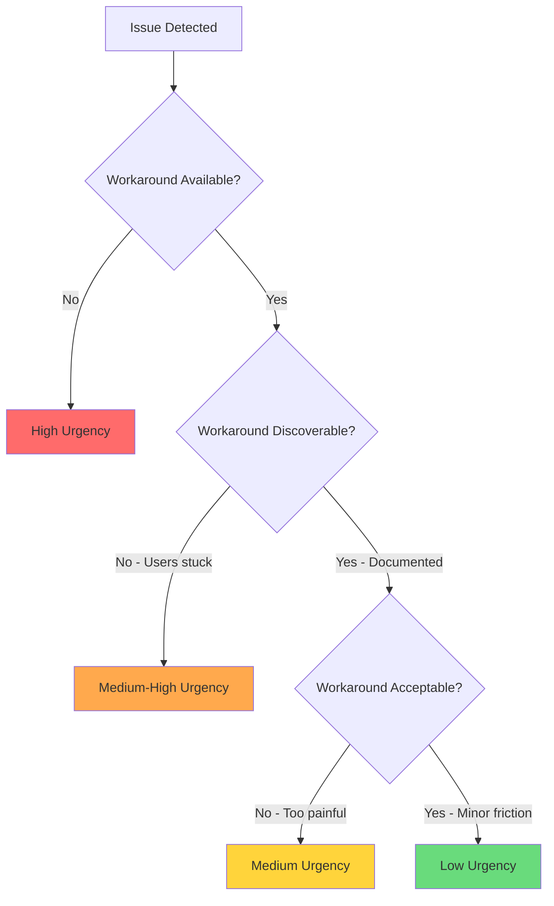
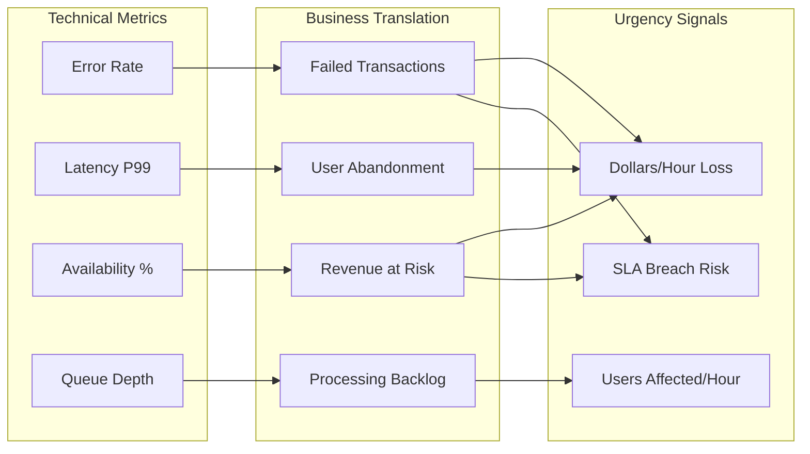
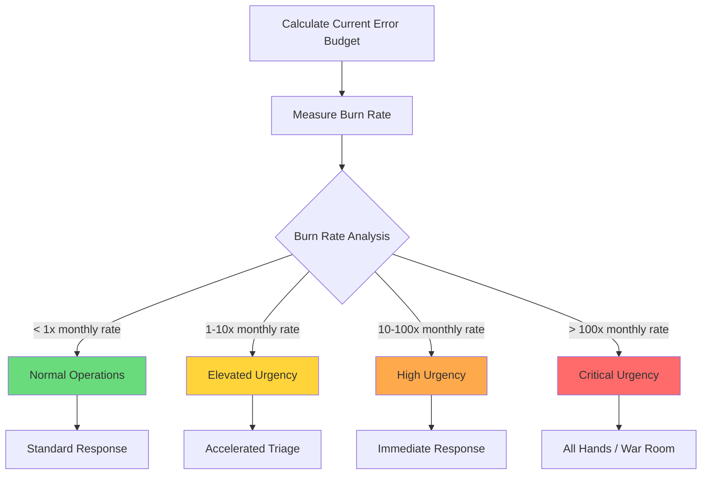
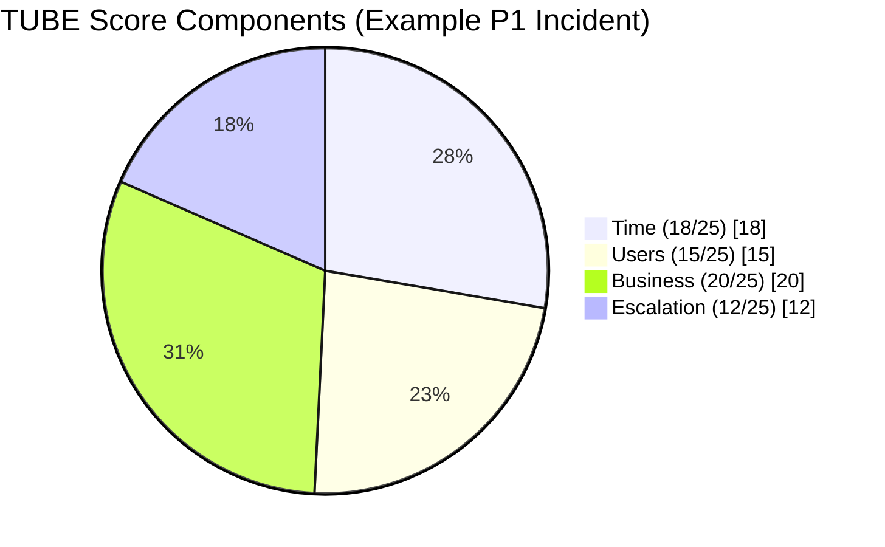
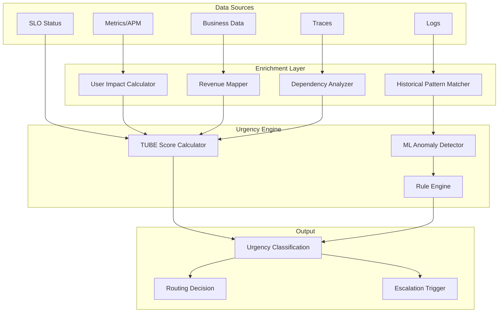
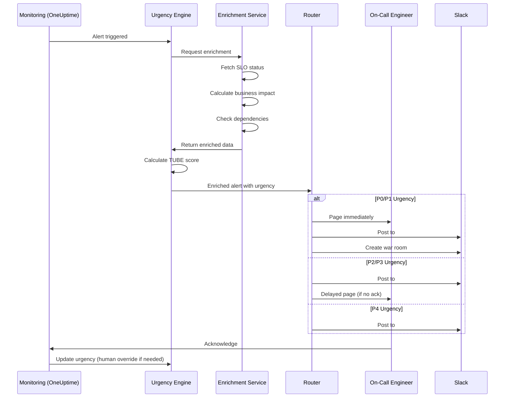

# How to Implement Urgency Assessment

Author: [nawazdhandala](https://github.com/nawazdhandala)

Tags: Incident Management, SRE, Triage, Operations

Description: Learn how to assess incident urgency for proper prioritization and response.

---

## Why Urgency Assessment Matters

When an incident hits, your team faces a critical question: *How quickly do we need to act?* Without a systematic approach to urgency assessment, teams either over-react to minor issues (burning out responders) or under-react to critical ones (burning customer trust).

Urgency assessment creates a structured framework for answering that question consistently, enabling:
- Faster, more accurate triage decisions
- Appropriate resource allocation
- Better SLA/SLO compliance
- Reduced alert fatigue and burnout

---

## Urgency vs Severity: The Critical Distinction

Many teams conflate urgency and severity. They are related but distinct concepts:

| Dimension | Definition | Question It Answers |
|-----------|------------|---------------------|
| **Severity** | The magnitude of impact | *How bad is it?* |
| **Urgency** | Time-sensitivity of response | *How fast must we act?* |

A high-severity, low-urgency incident: Database corruption discovered in a backup system (bad, but can wait until business hours).

A low-severity, high-urgency incident: Minor UI bug affecting a live product demo happening in 30 minutes.

```mermaid
quadrantChart
    title Urgency vs Severity Matrix
    x-axis Low Urgency --> High Urgency
    y-axis Low Severity --> High Severity
    quadrant-1 Critical: Act Now
    quadrant-2 Major: Schedule Promptly
    quadrant-3 Minor: Backlog
    quadrant-4 Time-Sensitive: Handle Today
    "Database outage": [0.9, 0.95]
    "API degradation": [0.7, 0.7]
    "Backup failure": [0.3, 0.8]
    "Demo blocker bug": [0.85, 0.3]
    "Typo in docs": [0.1, 0.1]
    "Scheduled maintenance": [0.2, 0.5]
```

---

## Time-Sensitivity Factors

Urgency stems from time constraints. Here are the key factors that drive time-sensitivity:

### 1. Active User Impact Window

Is the issue affecting users right now during peak hours, or at 3 AM when traffic is minimal?

```typescript
interface TimeWindowContext {
  currentHour: number;
  dayOfWeek: string;
  isHoliday: boolean;
  trafficPercentile: number; // 0-100, current traffic vs peak
}

function calculateTimeWindowUrgency(context: TimeWindowContext): number {
  let urgencyMultiplier = 1.0;

  // Peak hours (9 AM - 6 PM local) increase urgency
  if (context.currentHour >= 9 && context.currentHour <= 18) {
    urgencyMultiplier *= 1.5;
  }

  // Weekdays are typically higher traffic
  const weekdays = ['Monday', 'Tuesday', 'Wednesday', 'Thursday', 'Friday'];
  if (weekdays.includes(context.dayOfWeek)) {
    urgencyMultiplier *= 1.3;
  }

  // Scale by current traffic relative to peak
  urgencyMultiplier *= (0.5 + (context.trafficPercentile / 200));

  // Holidays reduce urgency (for most B2B services)
  if (context.isHoliday) {
    urgencyMultiplier *= 0.6;
  }

  return Math.min(urgencyMultiplier, 2.0); // Cap at 2x
}
```

### 2. Degradation Velocity

Is the problem stable, getting worse, or cascading?

```typescript
enum DegradationTrend {
  STABLE = 'stable',
  IMPROVING = 'improving',
  DEGRADING_SLOWLY = 'degrading_slowly',
  DEGRADING_RAPIDLY = 'degrading_rapidly',
  CASCADING = 'cascading'
}

function getDegradationUrgencyScore(trend: DegradationTrend): number {
  const scores: Record<DegradationTrend, number> = {
    [DegradationTrend.IMPROVING]: 0.5,
    [DegradationTrend.STABLE]: 1.0,
    [DegradationTrend.DEGRADING_SLOWLY]: 1.5,
    [DegradationTrend.DEGRADING_RAPIDLY]: 2.0,
    [DegradationTrend.CASCADING]: 3.0
  };
  return scores[trend];
}
```

### 3. Workaround Availability

Can users accomplish their goals through alternative means?



### 4. External Deadlines

Contractual, regulatory, or business-critical deadlines create hard urgency boundaries:

```typescript
interface ExternalDeadline {
  name: string;
  deadline: Date;
  consequence: 'financial' | 'regulatory' | 'reputational' | 'contractual';
  penaltyPerHour?: number; // For financial consequences
}

function calculateDeadlineUrgency(
  deadlines: ExternalDeadline[],
  currentTime: Date
): number {
  let maxUrgency = 1.0;

  for (const deadline of deadlines) {
    const hoursRemaining = (deadline.deadline.getTime() - currentTime.getTime())
      / (1000 * 60 * 60);

    if (hoursRemaining <= 0) {
      // Deadline missed - maximum urgency for damage control
      maxUrgency = Math.max(maxUrgency, 3.0);
    } else if (hoursRemaining <= 4) {
      maxUrgency = Math.max(maxUrgency, 2.5);
    } else if (hoursRemaining <= 24) {
      maxUrgency = Math.max(maxUrgency, 2.0);
    } else if (hoursRemaining <= 72) {
      maxUrgency = Math.max(maxUrgency, 1.5);
    }

    // Regulatory consequences boost urgency further
    if (deadline.consequence === 'regulatory' && hoursRemaining <= 24) {
      maxUrgency *= 1.2;
    }
  }

  return Math.min(maxUrgency, 3.0);
}
```

---

## Business Impact Correlation

Urgency must correlate with business impact. Here is a framework for mapping technical metrics to business outcomes:



### Business Impact Calculator

```typescript
interface ServiceContext {
  serviceName: string;
  revenuePerTransaction: number;
  transactionsPerHour: number;
  activeUsers: number;
  slaTarget: number; // e.g., 99.9
  currentAvailability: number;
}

interface IncidentMetrics {
  errorRate: number; // 0-1
  affectedUserPercentage: number; // 0-100
  degradedTransactionPercentage: number; // 0-100
}

interface BusinessImpact {
  estimatedRevenueAtRisk: number;
  affectedUsers: number;
  slaBurnRate: number; // How fast we're consuming error budget
  urgencyScore: number;
}

function calculateBusinessImpact(
  context: ServiceContext,
  metrics: IncidentMetrics
): BusinessImpact {
  // Revenue impact
  const failedTransactions = context.transactionsPerHour * metrics.errorRate;
  const estimatedRevenueAtRisk = failedTransactions * context.revenuePerTransaction;

  // User impact
  const affectedUsers = Math.round(
    context.activeUsers * (metrics.affectedUserPercentage / 100)
  );

  // SLA burn rate calculation
  const errorBudgetTotal = (100 - context.slaTarget) / 100; // e.g., 0.001 for 99.9%
  const currentErrorRate = (100 - context.currentAvailability) / 100;
  const slaBurnRate = currentErrorRate / errorBudgetTotal;

  // Composite urgency score (1-10 scale)
  let urgencyScore = 1;

  // Revenue component (up to 4 points)
  if (estimatedRevenueAtRisk > 10000) urgencyScore += 4;
  else if (estimatedRevenueAtRisk > 1000) urgencyScore += 3;
  else if (estimatedRevenueAtRisk > 100) urgencyScore += 2;
  else if (estimatedRevenueAtRisk > 0) urgencyScore += 1;

  // User impact component (up to 3 points)
  if (affectedUsers > 10000) urgencyScore += 3;
  else if (affectedUsers > 1000) urgencyScore += 2;
  else if (affectedUsers > 100) urgencyScore += 1;

  // SLA burn rate component (up to 3 points)
  if (slaBurnRate > 100) urgencyScore += 3; // Burning 100x normal rate
  else if (slaBurnRate > 10) urgencyScore += 2;
  else if (slaBurnRate > 1) urgencyScore += 1;

  return {
    estimatedRevenueAtRisk,
    affectedUsers,
    slaBurnRate,
    urgencyScore: Math.min(urgencyScore, 10)
  };
}
```

---

## SLA/SLO Consideration in Urgency

Your SLOs provide objective urgency boundaries. When error budget burns faster than planned, urgency automatically increases.

### Error Budget Burn Rate Model



### SLO-Based Urgency Calculator

```typescript
interface SLOConfig {
  target: number; // e.g., 99.9
  windowDays: number; // e.g., 30
  currentGoodMinutes: number;
  totalMinutes: number;
}

interface BurnRateResult {
  errorBudgetRemaining: number; // percentage
  currentBurnRate: number; // multiplier vs sustainable rate
  projectedExhaustionHours: number | null;
  urgencyLevel: 'normal' | 'elevated' | 'high' | 'critical';
}

function calculateSLOUrgency(
  slo: SLOConfig,
  currentErrorRate: number // errors per minute, current
): BurnRateResult {
  const targetGoodRate = slo.target / 100;
  const windowMinutes = slo.windowDays * 24 * 60;
  const allowedBadMinutes = windowMinutes * (1 - targetGoodRate);

  // Current budget status
  const currentBadMinutes = slo.totalMinutes - slo.currentGoodMinutes;
  const errorBudgetRemaining = Math.max(
    0,
    ((allowedBadMinutes - currentBadMinutes) / allowedBadMinutes) * 100
  );

  // Sustainable burn rate (budget / remaining window)
  const remainingWindowMinutes = windowMinutes - slo.totalMinutes;
  const remainingBudgetMinutes = allowedBadMinutes - currentBadMinutes;
  const sustainableBurnRate = remainingWindowMinutes > 0
    ? remainingBudgetMinutes / remainingWindowMinutes
    : 0;

  // Current burn rate comparison
  const currentBurnRate = sustainableBurnRate > 0
    ? currentErrorRate / sustainableBurnRate
    : Infinity;

  // Projected exhaustion
  let projectedExhaustionHours: number | null = null;
  if (currentErrorRate > 0 && remainingBudgetMinutes > 0) {
    projectedExhaustionHours = remainingBudgetMinutes / currentErrorRate / 60;
  }

  // Determine urgency level
  let urgencyLevel: BurnRateResult['urgencyLevel'];
  if (currentBurnRate > 100 || errorBudgetRemaining < 10) {
    urgencyLevel = 'critical';
  } else if (currentBurnRate > 10 || errorBudgetRemaining < 30) {
    urgencyLevel = 'high';
  } else if (currentBurnRate > 1 || errorBudgetRemaining < 50) {
    urgencyLevel = 'elevated';
  } else {
    urgencyLevel = 'normal';
  }

  return {
    errorBudgetRemaining,
    currentBurnRate,
    projectedExhaustionHours,
    urgencyLevel
  };
}
```

---

## Urgency Scoring Models

Here is a comprehensive urgency scoring model that combines all factors:

### The TUBE Model (Time, Users, Business, Escalation)

```typescript
interface TUBEInput {
  // Time factors
  timeWindow: TimeWindowContext;
  degradationTrend: DegradationTrend;
  externalDeadlines: ExternalDeadline[];

  // User factors
  affectedUserCount: number;
  totalUserCount: number;
  workaroundAvailable: boolean;
  workaroundQuality: 'none' | 'poor' | 'acceptable' | 'good';

  // Business factors
  revenueImpactPerHour: number;
  reputationRisk: 'none' | 'low' | 'medium' | 'high' | 'critical';

  // Escalation factors
  sloUrgency: BurnRateResult;
  previousIncidentsThisWeek: number;
  relatedServicesAffected: number;
}

interface TUBEScore {
  timeScore: number;
  userScore: number;
  businessScore: number;
  escalationScore: number;
  totalScore: number;
  urgencyLevel: 'P4' | 'P3' | 'P2' | 'P1' | 'P0';
  recommendedResponseTime: string;
}

function calculateTUBEScore(input: TUBEInput): TUBEScore {
  // Time Score (0-25)
  let timeScore = 5; // Base
  timeScore += (calculateTimeWindowUrgency(input.timeWindow) - 1) * 5;
  timeScore += (getDegradationUrgencyScore(input.degradationTrend) - 1) * 3;
  timeScore += Math.min(
    calculateDeadlineUrgency(input.externalDeadlines, new Date()) * 3,
    10
  );
  timeScore = Math.min(timeScore, 25);

  // User Score (0-25)
  const userPercentage = (input.affectedUserCount / input.totalUserCount) * 100;
  let userScore = 0;
  if (userPercentage > 50) userScore = 15;
  else if (userPercentage > 20) userScore = 10;
  else if (userPercentage > 5) userScore = 5;
  else if (userPercentage > 0) userScore = 2;

  // Workaround adjustment
  const workaroundPenalty: Record<string, number> = {
    'none': 10, 'poor': 6, 'acceptable': 3, 'good': 0
  };
  userScore += workaroundPenalty[input.workaroundQuality];
  userScore = Math.min(userScore, 25);

  // Business Score (0-25)
  let businessScore = 0;
  if (input.revenueImpactPerHour > 50000) businessScore = 15;
  else if (input.revenueImpactPerHour > 10000) businessScore = 10;
  else if (input.revenueImpactPerHour > 1000) businessScore = 5;
  else if (input.revenueImpactPerHour > 0) businessScore = 2;

  const reputationScores: Record<string, number> = {
    'none': 0, 'low': 2, 'medium': 4, 'high': 7, 'critical': 10
  };
  businessScore += reputationScores[input.reputationRisk];
  businessScore = Math.min(businessScore, 25);

  // Escalation Score (0-25)
  let escalationScore = 0;
  const sloScores: Record<string, number> = {
    'normal': 0, 'elevated': 5, 'high': 10, 'critical': 15
  };
  escalationScore += sloScores[input.sloUrgency.urgencyLevel];
  escalationScore += Math.min(input.previousIncidentsThisWeek * 2, 5);
  escalationScore += Math.min(input.relatedServicesAffected * 2, 5);
  escalationScore = Math.min(escalationScore, 25);

  // Total and mapping
  const totalScore = timeScore + userScore + businessScore + escalationScore;

  let urgencyLevel: TUBEScore['urgencyLevel'];
  let recommendedResponseTime: string;

  if (totalScore >= 80) {
    urgencyLevel = 'P0';
    recommendedResponseTime = 'Immediate (< 5 minutes)';
  } else if (totalScore >= 60) {
    urgencyLevel = 'P1';
    recommendedResponseTime = '< 15 minutes';
  } else if (totalScore >= 40) {
    urgencyLevel = 'P2';
    recommendedResponseTime = '< 1 hour';
  } else if (totalScore >= 20) {
    urgencyLevel = 'P3';
    recommendedResponseTime = '< 4 hours';
  } else {
    urgencyLevel = 'P4';
    recommendedResponseTime = 'Next business day';
  }

  return {
    timeScore,
    userScore,
    businessScore,
    escalationScore,
    totalScore,
    urgencyLevel,
    recommendedResponseTime
  };
}
```

### Score Visualization



---

## Automated Urgency Classification

Manual urgency assessment does not scale. Here is how to automate it:

### Architecture for Automated Classification



### Implementation with OpenTelemetry and OneUptime

```typescript
import { metrics, trace } from '@opentelemetry/api';

interface AlertPayload {
  alertName: string;
  serviceName: string;
  severity: string;
  metrics: {
    errorRate: number;
    latencyP99: number;
    requestCount: number;
  };
  labels: Record<string, string>;
  timestamp: Date;
}

interface EnrichedAlert extends AlertPayload {
  urgencyAssessment: TUBEScore;
  enrichment: {
    affectedUsers: number;
    revenueAtRisk: number;
    relatedIncidents: string[];
    sloStatus: BurnRateResult;
  };
}

class UrgencyClassifier {
  private serviceRegistry: Map<string, ServiceContext>;
  private sloTracker: SLOTracker;
  private incidentHistory: IncidentHistoryStore;

  constructor(
    serviceRegistry: Map<string, ServiceContext>,
    sloTracker: SLOTracker,
    incidentHistory: IncidentHistoryStore
  ) {
    this.serviceRegistry = serviceRegistry;
    this.sloTracker = sloTracker;
    this.incidentHistory = incidentHistory;
  }

  async classifyAlert(alert: AlertPayload): Promise<EnrichedAlert> {
    const span = trace.getTracer('urgency-classifier')
      .startSpan('classifyAlert');

    try {
      // Fetch service context
      const serviceContext = this.serviceRegistry.get(alert.serviceName);
      if (!serviceContext) {
        throw new Error(`Unknown service: ${alert.serviceName}`);
      }

      // Parallel enrichment
      const [sloStatus, recentIncidents, activeUsers] = await Promise.all([
        this.sloTracker.getStatus(alert.serviceName),
        this.incidentHistory.getRecent(alert.serviceName, 7), // Last 7 days
        this.getActiveUserCount(alert.serviceName)
      ]);

      // Calculate affected users from error rate
      const affectedUsers = Math.round(
        activeUsers * alert.metrics.errorRate
      );

      // Estimate revenue at risk
      const revenueAtRisk = this.calculateRevenueAtRisk(
        serviceContext,
        alert.metrics.errorRate
      );

      // Build TUBE input
      const tubeInput: TUBEInput = {
        timeWindow: this.getCurrentTimeWindow(),
        degradationTrend: this.analyzeTrend(alert),
        externalDeadlines: await this.getDeadlines(alert.serviceName),
        affectedUserCount: affectedUsers,
        totalUserCount: activeUsers,
        workaroundAvailable: false, // Would need manual input or knowledge base
        workaroundQuality: 'none',
        revenueImpactPerHour: revenueAtRisk,
        reputationRisk: this.assessReputationRisk(alert),
        sloUrgency: sloStatus,
        previousIncidentsThisWeek: recentIncidents.length,
        relatedServicesAffected: await this.countAffectedDependencies(alert)
      };

      const urgencyAssessment = calculateTUBEScore(tubeInput);

      // Record metrics
      const meter = metrics.getMeter('urgency-classifier');
      const urgencyHistogram = meter.createHistogram('urgency_score');
      urgencyHistogram.record(urgencyAssessment.totalScore, {
        service: alert.serviceName,
        priority: urgencyAssessment.urgencyLevel
      });

      span.setAttribute('urgency.level', urgencyAssessment.urgencyLevel);
      span.setAttribute('urgency.score', urgencyAssessment.totalScore);

      return {
        ...alert,
        urgencyAssessment,
        enrichment: {
          affectedUsers,
          revenueAtRisk,
          relatedIncidents: recentIncidents.map(i => i.id),
          sloStatus
        }
      };
    } finally {
      span.end();
    }
  }

  private getCurrentTimeWindow(): TimeWindowContext {
    const now = new Date();
    return {
      currentHour: now.getHours(),
      dayOfWeek: now.toLocaleDateString('en-US', { weekday: 'long' }),
      isHoliday: false, // Would integrate with holiday calendar
      trafficPercentile: 75 // Would fetch from real metrics
    };
  }

  private analyzeTrend(alert: AlertPayload): DegradationTrend {
    // In production, compare against historical baseline
    if (alert.metrics.errorRate > 0.5) {
      return DegradationTrend.CASCADING;
    } else if (alert.metrics.errorRate > 0.2) {
      return DegradationTrend.DEGRADING_RAPIDLY;
    } else if (alert.metrics.errorRate > 0.05) {
      return DegradationTrend.DEGRADING_SLOWLY;
    }
    return DegradationTrend.STABLE;
  }

  private assessReputationRisk(
    alert: AlertPayload
  ): 'none' | 'low' | 'medium' | 'high' | 'critical' {
    // High-profile services or customer-facing issues
    const criticalServices = ['checkout', 'login', 'api-gateway'];
    if (criticalServices.includes(alert.serviceName)) {
      if (alert.metrics.errorRate > 0.1) return 'critical';
      if (alert.metrics.errorRate > 0.01) return 'high';
    }
    return 'low';
  }

  private calculateRevenueAtRisk(
    context: ServiceContext,
    errorRate: number
  ): number {
    return context.transactionsPerHour *
           errorRate *
           context.revenuePerTransaction;
  }

  private async getActiveUserCount(serviceName: string): Promise<number> {
    // Fetch from real-time analytics
    return 10000; // Placeholder
  }

  private async getDeadlines(serviceName: string): Promise<ExternalDeadline[]> {
    // Fetch from deadline registry
    return [];
  }

  private async countAffectedDependencies(alert: AlertPayload): Promise<number> {
    // Query service mesh or dependency map
    return 0;
  }
}
```

### Alert Routing Based on Urgency

```typescript
interface RoutingRule {
  minScore: number;
  maxScore: number;
  actions: RoutingAction[];
}

interface RoutingAction {
  type: 'page' | 'slack' | 'email' | 'ticket' | 'war_room';
  target: string;
  escalationDelayMinutes?: number;
}

const routingRules: RoutingRule[] = [
  {
    // P0: Critical
    minScore: 80,
    maxScore: 100,
    actions: [
      { type: 'page', target: 'primary-oncall' },
      { type: 'page', target: 'secondary-oncall' },
      { type: 'slack', target: '#incidents-critical' },
      { type: 'war_room', target: 'auto-create' },
      { type: 'page', target: 'engineering-manager', escalationDelayMinutes: 10 }
    ]
  },
  {
    // P1: High
    minScore: 60,
    maxScore: 79,
    actions: [
      { type: 'page', target: 'primary-oncall' },
      { type: 'slack', target: '#incidents' },
      { type: 'page', target: 'secondary-oncall', escalationDelayMinutes: 15 }
    ]
  },
  {
    // P2: Medium
    minScore: 40,
    maxScore: 59,
    actions: [
      { type: 'slack', target: '#incidents' },
      { type: 'page', target: 'primary-oncall', escalationDelayMinutes: 30 }
    ]
  },
  {
    // P3: Low
    minScore: 20,
    maxScore: 39,
    actions: [
      { type: 'slack', target: '#alerts' },
      { type: 'ticket', target: 'incident-queue' }
    ]
  },
  {
    // P4: Minimal
    minScore: 0,
    maxScore: 19,
    actions: [
      { type: 'ticket', target: 'backlog' },
      { type: 'email', target: 'team-digest' }
    ]
  }
];

async function routeAlert(enrichedAlert: EnrichedAlert): Promise<void> {
  const score = enrichedAlert.urgencyAssessment.totalScore;
  const rule = routingRules.find(r => score >= r.minScore && score <= r.maxScore);

  if (!rule) {
    console.error('No routing rule matched for score:', score);
    return;
  }

  for (const action of rule.actions) {
    if (action.escalationDelayMinutes) {
      // Schedule delayed escalation
      scheduleEscalation(enrichedAlert, action, action.escalationDelayMinutes);
    } else {
      // Execute immediately
      await executeRoutingAction(enrichedAlert, action);
    }
  }
}
```

---

## Putting It All Together: Complete Workflow



---

## Best Practices

### 1. Calibrate Regularly

Review urgency classifications monthly. Look for:
- Incidents where urgency was over/under-estimated
- Patterns in manual overrides
- Services with consistently wrong assessments

### 2. Enable Human Override

Automated urgency is a starting point, not a final answer:

```typescript
interface UrgencyOverride {
  incidentId: string;
  originalScore: number;
  overrideScore: number;
  reason: string;
  overriddenBy: string;
  timestamp: Date;
}

// Track overrides to improve the model
async function recordOverride(override: UrgencyOverride): Promise<void> {
  await overrideStore.save(override);

  // Feed back into ML model training
  if (override.originalScore !== override.overrideScore) {
    await mlPipeline.addTrainingExample({
      features: await getIncidentFeatures(override.incidentId),
      label: override.overrideScore,
      weight: 2.0 // Human feedback weighted higher
    });
  }
}
```

### 3. Communicate Urgency Clearly

Every incident notification should include:

```
[P1] Payment Service Degradation
-------------------------------------
Urgency Score: 72/100
Response Time: < 15 minutes

Impact Summary:
- 2,340 users affected (23% of active)
- $4,200/hour revenue at risk
- SLO burn rate: 15x normal

Key Factors:
- Peak traffic hours (score +8)
- No workaround available (score +10)
- 3 related incidents this week (score +6)

Runbook: https://wiki/runbooks/payment-degradation
Dashboard: https://oneuptime.com/dashboard/payment
```

### 4. Integrate with OneUptime

OneUptime provides native support for urgency-based routing:

- Configure SLO-based alerting with automatic urgency calculation
- Set up tiered escalation policies by urgency level
- Track urgency accuracy in post-incident reviews
- Correlate urgency scores with resolution times

---

## Conclusion

Effective urgency assessment transforms incident response from reactive firefighting to systematic triage. By combining time-sensitivity factors, business impact correlation, SLO considerations, and automated classification, teams can:

- Respond to the right incidents at the right time
- Protect error budgets proactively
- Reduce responder burnout from false urgency
- Build trust through consistent, explainable prioritization

Start simple: implement the severity/urgency distinction and basic TUBE scoring. Then iterate based on real incident data to refine your model.

Your on-call engineers and your customers will thank you.

---

## Further Reading

- [The Ultimate SRE Reliability Checklist](https://oneuptime.com/blog/post/2025-09-10-sre-checklist)
- [Designing an SRE On-Call Rotation](https://oneuptime.com/blog/post/2025-11-28-sre-on-call-rotation-design)
- [Effective Incident Postmortem Templates](https://oneuptime.com/blog/post/2025-09-09-effective-incident-postmortem-templates)
