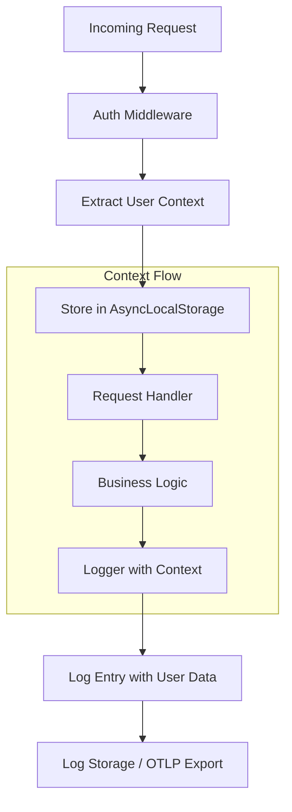
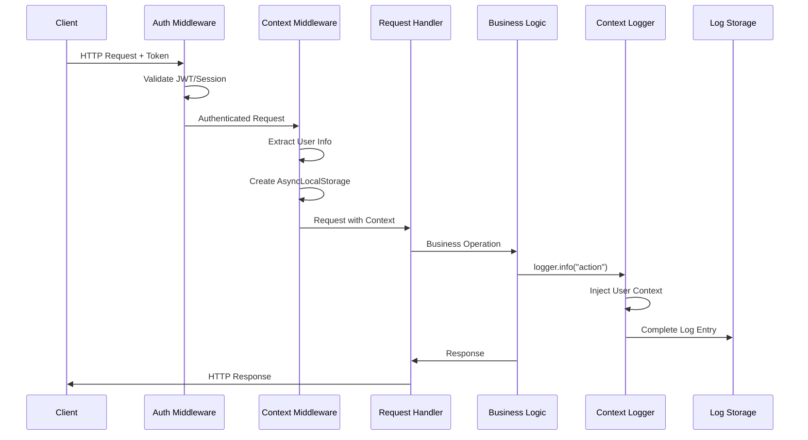

# How to Create User Context Logging

Author: [nawazdhandala](https://github.com/nawazdhandala)

Tags: Logging, User Context, Security, Audit

Description: Learn to create user context logging for tracking user actions and audit trails.

---

When something goes wrong in production, the first question is usually "who did what?" Without user context in your logs, you are left piecing together fragments from different sources, hoping timestamps align. User context logging solves this by automatically attaching user identity and session information to every log entry within a request.

This guide walks through building a complete user context logging system that captures who performed actions, what they did, and the full execution path of their requests.

---

## Why User Context Matters

Traditional logging captures technical events but misses the human element. Consider debugging these two log entries.

Without user context, you see only the technical action:

```typescript
// Without user context - who updated this setting?
logger.info("Organization settings updated", {
  setting: "billing_email",
  old_value: "admin@company.com",
  new_value: "finance@company.com"
});
```

With user context, you have the complete picture:

```typescript
// With user context - full audit trail
logger.info("Organization settings updated", {
  setting: "billing_email",
  old_value: "admin@company.com",
  new_value: "finance@company.com",
  "user.id": "user_abc123",
  "user.email": "jane@company.com",
  "user.role": "admin",
  "session.id": "sess_xyz789",
  "request.ip": "192.168.1.50"
});
```

The second log entry tells a complete story. You know who made the change, their permission level, and where the request originated. This information is essential for security audits, compliance requirements, and debugging user-reported issues.

---

## System Architecture

The user context logging system flows through several components, from the initial request to the final log storage.



The key insight is using AsyncLocalStorage to maintain request-scoped context. This allows any code executed within a request to access user information without passing it through every function call.

---

## Building the User Context Store

AsyncLocalStorage provides a way to store data that follows the execution flow of async operations. This is the foundation of our user context system.

```typescript
// context/user-context.ts
import { AsyncLocalStorage } from "async_hooks";

// Define the structure of user context we want to track
interface UserContext {
  userId: string;
  email: string;
  role: string;
  tenantId?: string;
  sessionId: string;
  requestId: string;
  ipAddress: string;
  userAgent: string;
  permissions?: string[];
}

// Create a singleton storage instance
const userContextStorage = new AsyncLocalStorage<UserContext>();

export class UserContextStore {
  // Run a function with user context attached to its execution
  static run<T>(context: UserContext, fn: () => T): T {
    return userContextStorage.run(context, fn);
  }

  // Get the current user context (returns undefined outside of context)
  static get(): UserContext | undefined {
    return userContextStorage.getStore();
  }

  // Get context or throw if not available (use in authenticated routes)
  static require(): UserContext {
    const context = this.get();
    if (!context) {
      throw new Error("User context not initialized");
    }
    return context;
  }

  // Check if user has a specific permission
  static hasPermission(permission: string): boolean {
    const context = this.get();
    return context?.permissions?.includes(permission) ?? false;
  }
}
```

---

## Middleware for Context Injection

The middleware extracts user information from the authenticated request and establishes the context for all downstream operations.

```typescript
// middleware/user-context-middleware.ts
import { Request, Response, NextFunction } from "express";
import { UserContextStore } from "../context/user-context";
import { randomUUID } from "crypto";

// Extend Express Request to include authenticated user
interface AuthenticatedRequest extends Request {
  user?: {
    id: string;
    email: string;
    role: string;
    tenantId?: string;
    permissions?: string[];
  };
  session?: {
    id: string;
  };
}

export function userContextMiddleware(
  req: AuthenticatedRequest,
  res: Response,
  next: NextFunction
) {
  // Generate a unique request ID for correlation
  const requestId = req.headers["x-request-id"] as string || randomUUID();

  // Set request ID header for response correlation
  res.setHeader("x-request-id", requestId);

  // Build context from authenticated user and request metadata
  const context = {
    userId: req.user?.id || "anonymous",
    email: req.user?.email || "unknown",
    role: req.user?.role || "guest",
    tenantId: req.user?.tenantId,
    sessionId: req.session?.id || "no-session",
    requestId: requestId,
    ipAddress: extractClientIP(req),
    userAgent: req.headers["user-agent"] || "unknown",
    permissions: req.user?.permissions || []
  };

  // Execute the rest of the request within this context
  UserContextStore.run(context, () => {
    next();
  });
}

// Extract the real client IP, handling proxies and load balancers
function extractClientIP(req: Request): string {
  const forwarded = req.headers["x-forwarded-for"];
  if (typeof forwarded === "string") {
    // Take the first IP in the chain (original client)
    return forwarded.split(",")[0].trim();
  }
  return req.socket.remoteAddress || "unknown";
}
```

---

## Context-Aware Logger

The logger automatically enriches every log entry with the current user context. This means you never need to manually pass user information to your logging calls.

```typescript
// logger/context-logger.ts
import winston from "winston";
import { UserContextStore } from "../context/user-context";

// Custom format that injects user context into every log entry
const contextFormat = winston.format((info) => {
  const userContext = UserContextStore.get();

  if (userContext) {
    // Add user identification fields
    info["user.id"] = userContext.userId;
    info["user.email"] = userContext.email;
    info["user.role"] = userContext.role;

    // Add session and request correlation
    info["session.id"] = userContext.sessionId;
    info["request.id"] = userContext.requestId;

    // Add request origin information
    info["request.ip"] = userContext.ipAddress;
    info["request.user_agent"] = userContext.userAgent;

    // Add tenant context for multi-tenant applications
    if (userContext.tenantId) {
      info["tenant.id"] = userContext.tenantId;
    }
  }

  return info;
});

// Create the logger with context enrichment
export const logger = winston.createLogger({
  level: process.env.LOG_LEVEL || "info",
  format: winston.format.combine(
    winston.format.timestamp({ format: "YYYY-MM-DDTHH:mm:ss.SSSZ" }),
    contextFormat(),
    winston.format.errors({ stack: true }),
    winston.format.json()
  ),
  transports: [
    new winston.transports.Console(),
    new winston.transports.File({
      filename: "logs/audit.log",
      level: "info"
    })
  ]
});
```

---

## Audit Trail Logging

For security-sensitive operations, you need structured audit logs that capture not just what happened, but the before and after state of changes.

```typescript
// audit/audit-logger.ts
import { logger } from "../logger/context-logger";
import { UserContextStore } from "../context/user-context";

// Types of auditable events in your system
type AuditAction =
  | "create"
  | "read"
  | "update"
  | "delete"
  | "login"
  | "logout"
  | "permission_change"
  | "export"
  | "bulk_operation";

interface AuditEntry {
  action: AuditAction;
  resourceType: string;
  resourceId: string;
  details?: Record<string, unknown>;
  previousState?: Record<string, unknown>;
  newState?: Record<string, unknown>;
}

export class AuditLogger {
  // Log an auditable action with full context
  static log(entry: AuditEntry): void {
    const context = UserContextStore.get();

    logger.info("Audit event recorded", {
      "audit.action": entry.action,
      "audit.resource_type": entry.resourceType,
      "audit.resource_id": entry.resourceId,
      "audit.timestamp": new Date().toISOString(),
      "audit.details": entry.details,
      "audit.previous_state": entry.previousState,
      "audit.new_state": entry.newState,
      // User context is automatically added by contextFormat
    });
  }

  // Convenience methods for common audit scenarios
  static logCreate(resourceType: string, resourceId: string, newState: Record<string, unknown>): void {
    this.log({
      action: "create",
      resourceType,
      resourceId,
      newState
    });
  }

  static logUpdate(
    resourceType: string,
    resourceId: string,
    previousState: Record<string, unknown>,
    newState: Record<string, unknown>
  ): void {
    this.log({
      action: "update",
      resourceType,
      resourceId,
      previousState,
      newState,
      details: {
        // Calculate which fields changed
        changedFields: Object.keys(newState).filter(
          key => previousState[key] !== newState[key]
        )
      }
    });
  }

  static logDelete(resourceType: string, resourceId: string, previousState: Record<string, unknown>): void {
    this.log({
      action: "delete",
      resourceType,
      resourceId,
      previousState
    });
  }
}
```

---

## Practical Usage Example

Here is how all the pieces come together in a real service. The user context flows automatically through every operation.

```typescript
// services/organization-service.ts
import { logger } from "../logger/context-logger";
import { AuditLogger } from "../audit/audit-logger";
import { UserContextStore } from "../context/user-context";

interface Organization {
  id: string;
  name: string;
  billingEmail: string;
  plan: string;
  updatedAt: string;
}

export class OrganizationService {
  async updateSettings(
    orgId: string,
    updates: Partial<Organization>
  ): Promise<Organization> {
    // User context is automatically available
    const context = UserContextStore.require();

    logger.info("Starting organization settings update", {
      organizationId: orgId,
      requestedChanges: Object.keys(updates)
    });

    // Verify user has permission for this operation
    if (!UserContextStore.hasPermission("org:settings:write")) {
      logger.warn("Permission denied for settings update", {
        organizationId: orgId,
        requiredPermission: "org:settings:write"
      });
      throw new Error("Insufficient permissions");
    }

    // Fetch current state for audit trail
    const currentOrg = await this.findById(orgId);

    // Apply updates
    const updatedOrg: Organization = {
      ...currentOrg,
      ...updates,
      updatedAt: new Date().toISOString()
    };

    // Save to database
    await this.save(updatedOrg);

    // Log the audit trail with before/after state
    AuditLogger.logUpdate(
      "organization",
      orgId,
      { billingEmail: currentOrg.billingEmail, plan: currentOrg.plan },
      { billingEmail: updatedOrg.billingEmail, plan: updatedOrg.plan }
    );

    logger.info("Organization settings updated successfully", {
      organizationId: orgId
    });

    return updatedOrg;
  }

  private async findById(id: string): Promise<Organization> {
    // Database lookup - logs automatically include user context
    logger.debug("Fetching organization from database", { organizationId: id });
    // ... database query
    return {} as Organization;
  }

  private async save(org: Organization): Promise<void> {
    logger.debug("Saving organization to database", { organizationId: org.id });
    // ... database save
  }
}
```

---

## Visualizing the Data Flow

The complete flow from request to stored log entry follows this pattern:



---

## Log Output Example

With this system in place, every log entry automatically contains the full user context:

```json
{
  "level": "info",
  "message": "Organization settings updated successfully",
  "timestamp": "2026-01-30T14:32:15.892Z",
  "organizationId": "org_123",
  "user.id": "user_abc123",
  "user.email": "jane@company.com",
  "user.role": "admin",
  "session.id": "sess_xyz789",
  "request.id": "req_def456",
  "request.ip": "192.168.1.50",
  "request.user_agent": "Mozilla/5.0...",
  "tenant.id": "tenant_456"
}
```

This log entry can be correlated with other entries from the same request using `request.id`, traced back to a specific user session with `session.id`, and filtered by user, tenant, or IP for security investigations.

---

## Integration with OpenTelemetry

For complete observability, integrate user context with OpenTelemetry traces. This connects your audit logs to distributed traces.

```typescript
// telemetry/otel-user-context.ts
import { trace, context } from "@opentelemetry/api";
import { UserContextStore } from "../context/user-context";

export function enrichSpanWithUserContext(): void {
  const span = trace.getActiveSpan();
  const userContext = UserContextStore.get();

  if (span && userContext) {
    span.setAttributes({
      "enduser.id": userContext.userId,
      "enduser.role": userContext.role,
      "session.id": userContext.sessionId,
      "tenant.id": userContext.tenantId || "none"
    });
  }
}
```

---

## Best Practices

Keep these principles in mind when implementing user context logging:

1. **Never log sensitive data** - Exclude passwords, tokens, credit card numbers, and PII that violates regulations
2. **Use consistent field names** - Stick to a naming convention like `user.id`, `session.id` across all services
3. **Log at appropriate levels** - Use INFO for business events, DEBUG for technical details, WARN for suspicious activity
4. **Include timestamps** - Always use ISO 8601 format with timezone information
5. **Set retention policies** - Audit logs often have compliance requirements for how long they must be kept

---

## Wrapping Up

User context logging transforms your logs from technical noise into actionable audit trails. By using AsyncLocalStorage to maintain request-scoped context and automatically injecting that context into every log entry, you eliminate the manual work of passing user information through your codebase.

The system we built provides: automatic user context propagation, structured audit logging with before/after state tracking, integration with OpenTelemetry for distributed tracing, and consistent log formats that work with any log aggregation platform.

Start with the context store and middleware, then gradually add audit logging to your most sensitive operations. Your future self debugging a production issue at 2 AM will thank you.

---

*Need to ship your user context logs somewhere useful? [OneUptime](https://oneuptime.com) provides native OpenTelemetry log ingestion with powerful search and correlation features. Connect your logs to traces and metrics in one unified platform.*

**Related Reading:**

- [How to Structure Logs Properly in OpenTelemetry](https://oneuptime.com/blog/post/2025-08-28-how-to-structure-logs-properly-in-opentelemetry/view)
- [Logs, Metrics and Traces: Turning Three Noisy Streams into One Story](https://oneuptime.com/blog/post/2025-08-20-three-pillars-of-observability-logs-metrics-traces/view)
- [Keep PII Out of Observability Telemetry](https://oneuptime.com/blog/post/2025-11-13-keep-pii-out-of-observability-telemetry/view)
