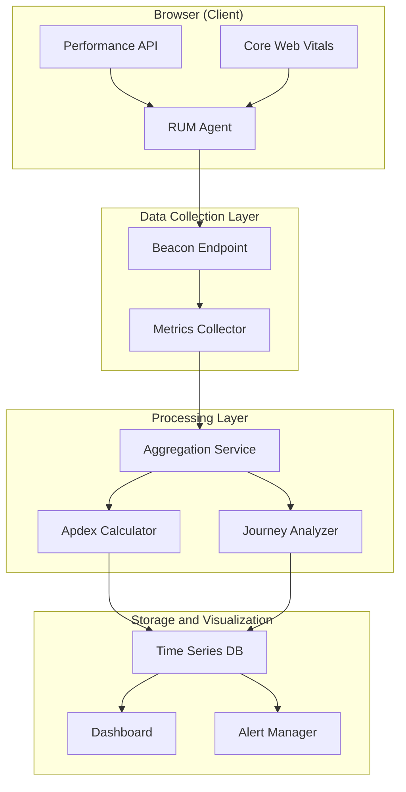
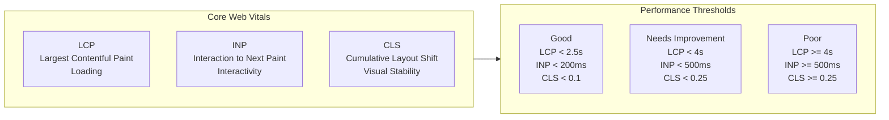
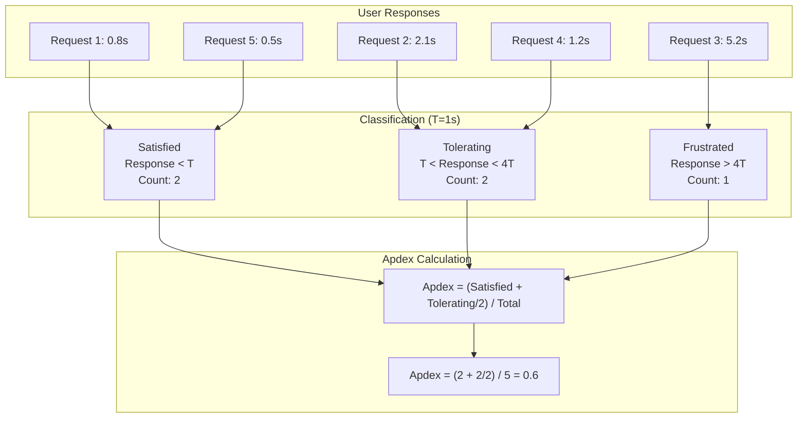
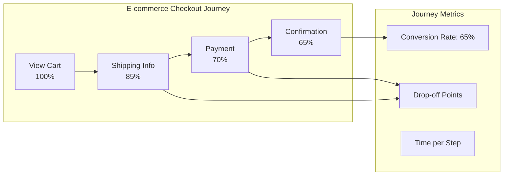
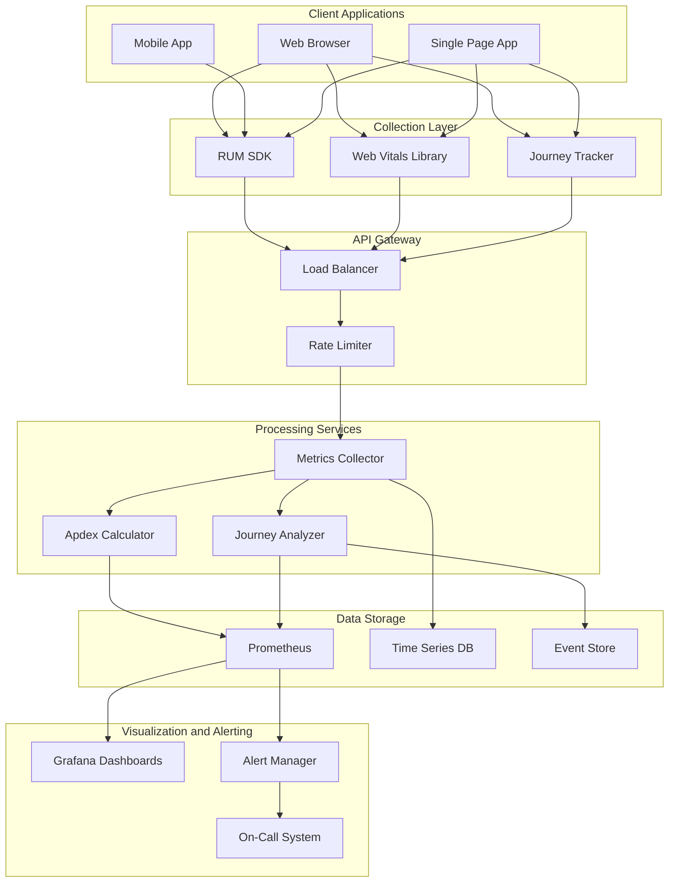

# How to Implement User Metrics

Author: [nawazdhandala](https://github.com/nawazdhandala)

Tags: Observability, Metrics, User Experience, SRE

Description: Learn how to implement user-centric metrics for monitoring real user experience and satisfaction.

---

> Traditional server-side metrics tell you if your systems are running. User metrics tell you if your users are happy. By capturing real user experience data, you gain insights that infrastructure metrics simply cannot provide.

Understanding how users actually experience your application is critical. Response times at the server mean nothing if the user's browser takes 10 seconds to render the page. This guide covers the essential techniques for implementing user-centric metrics that capture what truly matters: the end user experience.

---

## What Are User Metrics?

User metrics measure the actual experience users have when interacting with your application. Unlike server-side metrics that measure backend performance, user metrics capture:

- **Page load times** as experienced by real users
- **Interaction responsiveness** when clicking buttons or navigating
- **Visual stability** during page rendering
- **User satisfaction** through Apdex scores
- **Journey completion rates** for critical workflows

---

## User Metrics Architecture Overview

Understanding how user metrics flow through your system is essential for proper implementation:



---

## Real User Monitoring (RUM)

Real User Monitoring captures performance data from actual user sessions. Unlike synthetic monitoring that simulates users, RUM shows you what real users experience across different devices, networks, and locations.

### Basic RUM Implementation

Here is a foundational RUM implementation that captures essential timing metrics:

```javascript
// rum-collector.js
// Real User Monitoring collector for capturing user experience metrics

class RUMCollector {
    constructor(options = {}) {
        // Configuration with sensible defaults
        this.endpoint = options.endpoint || '/api/rum/collect';
        this.sampleRate = options.sampleRate || 1.0; // 100% by default
        this.bufferSize = options.bufferSize || 10;
        this.flushInterval = options.flushInterval || 5000; // 5 seconds

        // Buffer to batch metrics before sending
        this.metricsBuffer = [];

        // Session identifier for correlating metrics
        this.sessionId = this.generateSessionId();

        // Start the collection process
        this.init();
    }

    generateSessionId() {
        // Generate a unique session ID using crypto API
        // Falls back to random number if crypto is unavailable
        if (window.crypto && window.crypto.randomUUID) {
            return window.crypto.randomUUID();
        }
        return 'session_' + Math.random().toString(36).substring(2, 15);
    }

    init() {
        // Wait for the page to fully load before collecting metrics
        if (document.readyState === 'complete') {
            this.collectNavigationMetrics();
        } else {
            window.addEventListener('load', () => {
                // Small delay to ensure all metrics are available
                setTimeout(() => this.collectNavigationMetrics(), 0);
            });
        }

        // Set up periodic flush of buffered metrics
        setInterval(() => this.flush(), this.flushInterval);

        // Flush remaining metrics when user leaves the page
        window.addEventListener('visibilitychange', () => {
            if (document.visibilityState === 'hidden') {
                this.flush();
            }
        });
    }

    collectNavigationMetrics() {
        // Check if Performance API is available
        if (!window.performance || !window.performance.timing) {
            console.warn('Performance API not available');
            return;
        }

        const timing = window.performance.timing;
        const navigationStart = timing.navigationStart;

        // Calculate key timing metrics
        // All times are relative to navigationStart for consistency
        const metrics = {
            type: 'navigation',
            sessionId: this.sessionId,
            url: window.location.href,
            userAgent: navigator.userAgent,
            timestamp: Date.now(),

            // DNS lookup time
            // High values indicate DNS resolution issues
            dnsLookup: timing.domainLookupEnd - timing.domainLookupStart,

            // TCP connection time
            // High values may indicate network latency
            tcpConnect: timing.connectEnd - timing.connectStart,

            // TLS handshake time (for HTTPS)
            // Measured only when secure connection is used
            tlsHandshake: timing.secureConnectionStart > 0
                ? timing.connectEnd - timing.secureConnectionStart
                : 0,

            // Time to First Byte (TTFB)
            // Measures server response time from user perspective
            ttfb: timing.responseStart - navigationStart,

            // Content download time
            // Large values indicate bandwidth constraints or large payloads
            contentDownload: timing.responseEnd - timing.responseStart,

            // DOM parsing time
            // High values may indicate complex HTML or blocking scripts
            domParsing: timing.domInteractive - timing.domLoading,

            // DOM content loaded
            // When DOM is ready for manipulation
            domContentLoaded: timing.domContentLoadedEventEnd - navigationStart,

            // Full page load time
            // Total time until load event fires
            pageLoad: timing.loadEventEnd - navigationStart,

            // First paint (if available)
            // When first pixels are rendered
            firstPaint: this.getFirstPaint(),

            // First contentful paint
            // When first content (text, image) is rendered
            firstContentfulPaint: this.getFirstContentfulPaint()
        };

        this.record(metrics);
    }

    getFirstPaint() {
        // Get First Paint timing from Performance Observer
        const paintEntries = performance.getEntriesByType('paint');
        const fpEntry = paintEntries.find(entry => entry.name === 'first-paint');
        return fpEntry ? Math.round(fpEntry.startTime) : null;
    }

    getFirstContentfulPaint() {
        // Get First Contentful Paint timing
        const paintEntries = performance.getEntriesByType('paint');
        const fcpEntry = paintEntries.find(
            entry => entry.name === 'first-contentful-paint'
        );
        return fcpEntry ? Math.round(fcpEntry.startTime) : null;
    }

    record(metric) {
        // Apply sampling to reduce data volume if needed
        if (Math.random() > this.sampleRate) {
            return;
        }

        // Add common context to all metrics
        metric.context = {
            viewport: {
                width: window.innerWidth,
                height: window.innerHeight
            },
            connection: this.getConnectionInfo(),
            deviceMemory: navigator.deviceMemory || null
        };

        this.metricsBuffer.push(metric);

        // Flush if buffer is full
        if (this.metricsBuffer.length >= this.bufferSize) {
            this.flush();
        }
    }

    getConnectionInfo() {
        // Get network connection information if available
        // Useful for segmenting metrics by connection quality
        const connection = navigator.connection ||
                          navigator.mozConnection ||
                          navigator.webkitConnection;

        if (!connection) {
            return null;
        }

        return {
            effectiveType: connection.effectiveType, // 4g, 3g, 2g, slow-2g
            downlink: connection.downlink, // Mbps
            rtt: connection.rtt, // Round trip time in ms
            saveData: connection.saveData // Data saver enabled
        };
    }

    flush() {
        // Nothing to send
        if (this.metricsBuffer.length === 0) {
            return;
        }

        // Copy and clear buffer
        const metricsToSend = [...this.metricsBuffer];
        this.metricsBuffer = [];

        // Use sendBeacon for reliable delivery
        // sendBeacon works even when the page is unloading
        const payload = JSON.stringify({
            metrics: metricsToSend,
            sentAt: Date.now()
        });

        if (navigator.sendBeacon) {
            navigator.sendBeacon(this.endpoint, payload);
        } else {
            // Fallback to fetch for older browsers
            fetch(this.endpoint, {
                method: 'POST',
                body: payload,
                headers: {
                    'Content-Type': 'application/json'
                },
                // Keep request alive even if page unloads
                keepalive: true
            }).catch(err => console.error('RUM send failed:', err));
        }
    }
}

// Initialize RUM collector with configuration
const rum = new RUMCollector({
    endpoint: '/api/rum/collect',
    sampleRate: 1.0, // Collect from all users
    bufferSize: 10,
    flushInterval: 5000
});

// Export for module usage
export default RUMCollector;
```

---

## Core Web Vitals Monitoring

Core Web Vitals are Google's essential metrics for measuring user experience. They focus on loading, interactivity, and visual stability.



### Core Web Vitals Implementation

This implementation captures all three Core Web Vitals using the Performance Observer API:

```javascript
// core-web-vitals.js
// Captures LCP, INP, and CLS metrics for Core Web Vitals monitoring

class CoreWebVitalsMonitor {
    constructor(reportCallback) {
        // Callback function to report metrics
        this.reportCallback = reportCallback;

        // Store for calculating cumulative metrics
        this.clsValue = 0;
        this.clsEntries = [];

        // Store for INP calculation
        this.inpEntries = [];

        // Initialize observers
        this.initLCPObserver();
        this.initCLSObserver();
        this.initINPObserver();
    }

    initLCPObserver() {
        // Largest Contentful Paint observer
        // LCP measures loading performance
        // Good: < 2.5s, Needs Improvement: < 4s, Poor: >= 4s

        try {
            const lcpObserver = new PerformanceObserver((entryList) => {
                const entries = entryList.getEntries();
                // LCP is the last entry - it updates as larger elements load
                const lastEntry = entries[entries.length - 1];

                this.reportCallback({
                    name: 'LCP',
                    value: Math.round(lastEntry.startTime),
                    rating: this.rateLCP(lastEntry.startTime),
                    element: lastEntry.element
                        ? lastEntry.element.tagName
                        : 'unknown',
                    url: lastEntry.url || null
                });
            });

            // buffered: true captures entries that occurred before observer was created
            lcpObserver.observe({ type: 'largest-contentful-paint', buffered: true });

            // Stop observing LCP after user interaction
            // LCP is only valid before first input
            ['keydown', 'click', 'scroll'].forEach(type => {
                window.addEventListener(type, () => {
                    lcpObserver.disconnect();
                }, { once: true, capture: true });
            });

        } catch (e) {
            console.warn('LCP observer not supported:', e);
        }
    }

    initCLSObserver() {
        // Cumulative Layout Shift observer
        // CLS measures visual stability
        // Good: < 0.1, Needs Improvement: < 0.25, Poor: >= 0.25

        try {
            const clsObserver = new PerformanceObserver((entryList) => {
                for (const entry of entryList.getEntries()) {
                    // Only count shifts without recent user input
                    // hadRecentInput filters out intentional layout changes
                    if (!entry.hadRecentInput) {
                        this.clsValue += entry.value;
                        this.clsEntries.push({
                            value: entry.value,
                            time: entry.startTime,
                            sources: entry.sources
                                ? entry.sources.map(s => s.node?.tagName)
                                : []
                        });
                    }
                }

                this.reportCallback({
                    name: 'CLS',
                    value: Math.round(this.clsValue * 1000) / 1000,
                    rating: this.rateCLS(this.clsValue),
                    entries: this.clsEntries.length
                });
            });

            clsObserver.observe({ type: 'layout-shift', buffered: true });

        } catch (e) {
            console.warn('CLS observer not supported:', e);
        }
    }

    initINPObserver() {
        // Interaction to Next Paint observer
        // INP measures responsiveness to user interactions
        // Good: < 200ms, Needs Improvement: < 500ms, Poor: >= 500ms

        try {
            const inpObserver = new PerformanceObserver((entryList) => {
                for (const entry of entryList.getEntries()) {
                    // Track all interactions
                    // INP is typically the worst interaction (98th percentile)
                    this.inpEntries.push({
                        duration: entry.duration,
                        interactionId: entry.interactionId,
                        name: entry.name,
                        startTime: entry.startTime
                    });
                }

                // Calculate INP as the 98th percentile of interactions
                // For most pages, this equals the worst interaction
                const inp = this.calculateINP();

                if (inp !== null) {
                    this.reportCallback({
                        name: 'INP',
                        value: Math.round(inp),
                        rating: this.rateINP(inp),
                        totalInteractions: this.inpEntries.length
                    });
                }
            });

            // First Input Delay is captured via 'first-input'
            // INP uses 'event' type for all interactions
            inpObserver.observe({ type: 'event', buffered: true, durationThreshold: 16 });

        } catch (e) {
            console.warn('INP observer not supported:', e);
        }
    }

    calculateINP() {
        // INP is calculated as the 98th percentile of interaction durations
        // This typically represents the worst interaction on most pages

        if (this.inpEntries.length === 0) {
            return null;
        }

        // Group by interactionId to get unique interactions
        const interactionMap = new Map();
        for (const entry of this.inpEntries) {
            const existing = interactionMap.get(entry.interactionId);
            if (!existing || entry.duration > existing.duration) {
                interactionMap.set(entry.interactionId, entry);
            }
        }

        const interactions = Array.from(interactionMap.values());
        interactions.sort((a, b) => b.duration - a.duration);

        // 98th percentile calculation
        const index = Math.min(
            interactions.length - 1,
            Math.floor(interactions.length * 0.98)
        );

        return interactions[index]?.duration || null;
    }

    rateLCP(value) {
        // Rate LCP according to Core Web Vitals thresholds
        if (value < 2500) return 'good';
        if (value < 4000) return 'needs-improvement';
        return 'poor';
    }

    rateCLS(value) {
        // Rate CLS according to Core Web Vitals thresholds
        if (value < 0.1) return 'good';
        if (value < 0.25) return 'needs-improvement';
        return 'poor';
    }

    rateINP(value) {
        // Rate INP according to Core Web Vitals thresholds
        if (value < 200) return 'good';
        if (value < 500) return 'needs-improvement';
        return 'poor';
    }
}

// Usage example
const vitalsMonitor = new CoreWebVitalsMonitor((metric) => {
    console.log(`Core Web Vital: ${metric.name}`, metric);

    // Send to your analytics endpoint
    navigator.sendBeacon('/api/vitals', JSON.stringify(metric));
});

export default CoreWebVitalsMonitor;
```

---

## Apdex Score Implementation

Apdex (Application Performance Index) provides a simple 0-1 score that measures user satisfaction based on response time thresholds.



### Apdex Calculator Implementation

```python
# apdex_calculator.py
# Apdex score calculator for measuring user satisfaction

from dataclasses import dataclass
from typing import List, Dict, Optional
from enum import Enum
import time


class SatisfactionLevel(Enum):
    """Classification of user satisfaction based on response time."""
    SATISFIED = "satisfied"      # Response time < T
    TOLERATING = "tolerating"    # Response time between T and 4T
    FRUSTRATED = "frustrated"    # Response time > 4T


@dataclass
class ApdexConfig:
    """Configuration for Apdex calculation.

    Attributes:
        threshold_t: The target response time (T) in seconds.
                    Responses faster than T are considered satisfying.
        name: Optional name for this Apdex configuration (e.g., "checkout", "search")
    """
    threshold_t: float  # Target threshold in seconds
    name: str = "default"

    @property
    def tolerating_threshold(self) -> float:
        """Calculate the tolerating threshold (4T)."""
        return self.threshold_t * 4


@dataclass
class ApdexResult:
    """Result of an Apdex calculation.

    Attributes:
        score: The Apdex score (0.0 to 1.0)
        satisfied_count: Number of satisfied responses
        tolerating_count: Number of tolerating responses
        frustrated_count: Number of frustrated responses
        total_count: Total number of responses
        threshold_t: The T threshold used for calculation
    """
    score: float
    satisfied_count: int
    tolerating_count: int
    frustrated_count: int
    total_count: int
    threshold_t: float

    @property
    def rating(self) -> str:
        """Get a human-readable rating based on the Apdex score.

        Ratings follow industry standard thresholds:
        - Excellent: 0.94 - 1.00
        - Good: 0.85 - 0.93
        - Fair: 0.70 - 0.84
        - Poor: 0.50 - 0.69
        - Unacceptable: 0.00 - 0.49
        """
        if self.score >= 0.94:
            return "excellent"
        elif self.score >= 0.85:
            return "good"
        elif self.score >= 0.70:
            return "fair"
        elif self.score >= 0.50:
            return "poor"
        else:
            return "unacceptable"


class ApdexCalculator:
    """Calculator for Application Performance Index (Apdex) scores.

    Apdex provides a standardized method to measure and report on
    user satisfaction with application response times.

    Formula: Apdex = (Satisfied + Tolerating/2) / Total

    Example usage:
        calculator = ApdexCalculator(threshold_t=0.5)
        calculator.record(0.3)  # Satisfied
        calculator.record(1.2)  # Tolerating
        calculator.record(3.0)  # Frustrated
        result = calculator.calculate()
        print(f"Apdex Score: {result.score}")
    """

    def __init__(self, config: Optional[ApdexConfig] = None, threshold_t: float = 0.5):
        """Initialize the Apdex calculator.

        Args:
            config: Optional ApdexConfig object for configuration
            threshold_t: The target response time threshold in seconds
                        (used if config is not provided)
        """
        if config:
            self.config = config
        else:
            self.config = ApdexConfig(threshold_t=threshold_t)

        # Storage for response times
        self.response_times: List[float] = []

        # Counters for each satisfaction level
        self.satisfied_count = 0
        self.tolerating_count = 0
        self.frustrated_count = 0

    def classify(self, response_time: float) -> SatisfactionLevel:
        """Classify a response time into a satisfaction level.

        Args:
            response_time: The response time in seconds

        Returns:
            The satisfaction level for the given response time
        """
        if response_time <= self.config.threshold_t:
            return SatisfactionLevel.SATISFIED
        elif response_time <= self.config.tolerating_threshold:
            return SatisfactionLevel.TOLERATING
        else:
            return SatisfactionLevel.FRUSTRATED

    def record(self, response_time: float) -> SatisfactionLevel:
        """Record a response time and classify it.

        Args:
            response_time: The response time in seconds

        Returns:
            The satisfaction level assigned to this response
        """
        self.response_times.append(response_time)
        level = self.classify(response_time)

        # Increment the appropriate counter
        if level == SatisfactionLevel.SATISFIED:
            self.satisfied_count += 1
        elif level == SatisfactionLevel.TOLERATING:
            self.tolerating_count += 1
        else:
            self.frustrated_count += 1

        return level

    def calculate(self) -> ApdexResult:
        """Calculate the Apdex score from recorded response times.

        Returns:
            ApdexResult containing the score and breakdown
        """
        total = len(self.response_times)

        if total == 0:
            # No data recorded, return perfect score with zero samples
            return ApdexResult(
                score=1.0,
                satisfied_count=0,
                tolerating_count=0,
                frustrated_count=0,
                total_count=0,
                threshold_t=self.config.threshold_t
            )

        # Apdex formula: (Satisfied + Tolerating/2) / Total
        # Tolerating users count as half satisfied
        score = (self.satisfied_count + (self.tolerating_count / 2)) / total

        return ApdexResult(
            score=round(score, 4),
            satisfied_count=self.satisfied_count,
            tolerating_count=self.tolerating_count,
            frustrated_count=self.frustrated_count,
            total_count=total,
            threshold_t=self.config.threshold_t
        )

    def reset(self) -> None:
        """Reset the calculator, clearing all recorded data."""
        self.response_times.clear()
        self.satisfied_count = 0
        self.tolerating_count = 0
        self.frustrated_count = 0


class MultiEndpointApdexTracker:
    """Track Apdex scores for multiple endpoints with different thresholds.

    Different operations have different performance expectations.
    A search should be faster than a complex report generation.

    Example usage:
        tracker = MultiEndpointApdexTracker()
        tracker.configure_endpoint('/api/search', threshold_t=0.3)
        tracker.configure_endpoint('/api/reports', threshold_t=2.0)

        tracker.record('/api/search', 0.2)
        tracker.record('/api/reports', 1.5)

        scores = tracker.get_all_scores()
    """

    def __init__(self, default_threshold: float = 0.5):
        """Initialize the multi-endpoint tracker.

        Args:
            default_threshold: Default T threshold for unconfigured endpoints
        """
        self.default_threshold = default_threshold
        self.calculators: Dict[str, ApdexCalculator] = {}
        self.endpoint_configs: Dict[str, ApdexConfig] = {}

    def configure_endpoint(self, endpoint: str, threshold_t: float) -> None:
        """Configure a specific threshold for an endpoint.

        Args:
            endpoint: The endpoint path (e.g., '/api/users')
            threshold_t: The target response time threshold in seconds
        """
        config = ApdexConfig(threshold_t=threshold_t, name=endpoint)
        self.endpoint_configs[endpoint] = config

        # Create or update the calculator for this endpoint
        self.calculators[endpoint] = ApdexCalculator(config=config)

    def record(self, endpoint: str, response_time: float) -> SatisfactionLevel:
        """Record a response time for an endpoint.

        Args:
            endpoint: The endpoint path
            response_time: The response time in seconds

        Returns:
            The satisfaction level for this response
        """
        # Create calculator if it doesn't exist
        if endpoint not in self.calculators:
            config = self.endpoint_configs.get(
                endpoint,
                ApdexConfig(threshold_t=self.default_threshold, name=endpoint)
            )
            self.calculators[endpoint] = ApdexCalculator(config=config)

        return self.calculators[endpoint].record(response_time)

    def get_score(self, endpoint: str) -> Optional[ApdexResult]:
        """Get the Apdex score for a specific endpoint.

        Args:
            endpoint: The endpoint path

        Returns:
            ApdexResult for the endpoint, or None if no data recorded
        """
        if endpoint not in self.calculators:
            return None
        return self.calculators[endpoint].calculate()

    def get_all_scores(self) -> Dict[str, ApdexResult]:
        """Get Apdex scores for all tracked endpoints.

        Returns:
            Dictionary mapping endpoint names to their ApdexResult
        """
        return {
            endpoint: calc.calculate()
            for endpoint, calc in self.calculators.items()
        }

    def get_overall_score(self) -> ApdexResult:
        """Calculate an overall Apdex score across all endpoints.

        This combines all response times from all endpoints.
        Note: This treats all endpoints equally regardless of their
        configured thresholds.

        Returns:
            Combined ApdexResult across all endpoints
        """
        combined = ApdexCalculator(threshold_t=self.default_threshold)

        for calc in self.calculators.values():
            combined.satisfied_count += calc.satisfied_count
            combined.tolerating_count += calc.tolerating_count
            combined.frustrated_count += calc.frustrated_count
            combined.response_times.extend(calc.response_times)

        return combined.calculate()


# Example usage demonstrating the Apdex calculator
if __name__ == "__main__":
    # Create a tracker with endpoint-specific thresholds
    tracker = MultiEndpointApdexTracker(default_threshold=0.5)

    # Configure different thresholds for different operations
    # Fast operations like search need stricter thresholds
    tracker.configure_endpoint('/api/search', threshold_t=0.2)

    # Complex operations can have more lenient thresholds
    tracker.configure_endpoint('/api/reports/generate', threshold_t=3.0)

    # Standard CRUD operations
    tracker.configure_endpoint('/api/users', threshold_t=0.5)

    # Simulate some response times
    import random

    # Search endpoint - mostly fast responses
    for _ in range(100):
        response_time = random.uniform(0.05, 0.5)
        tracker.record('/api/search', response_time)

    # Users endpoint - variable response times
    for _ in range(100):
        response_time = random.uniform(0.1, 2.0)
        tracker.record('/api/users', response_time)

    # Reports endpoint - slower but expected
    for _ in range(50):
        response_time = random.uniform(1.0, 5.0)
        tracker.record('/api/reports/generate', response_time)

    # Print results
    print("Apdex Scores by Endpoint:")
    print("-" * 60)

    for endpoint, result in tracker.get_all_scores().items():
        print(f"\n{endpoint}:")
        print(f"  Score: {result.score} ({result.rating})")
        print(f"  Threshold (T): {result.threshold_t}s")
        print(f"  Satisfied: {result.satisfied_count}")
        print(f"  Tolerating: {result.tolerating_count}")
        print(f"  Frustrated: {result.frustrated_count}")

    print("\n" + "-" * 60)
    overall = tracker.get_overall_score()
    print(f"\nOverall Apdex Score: {overall.score} ({overall.rating})")
```

---

## User Journey Metrics

User journeys track the completion of multi-step workflows that matter to your business. These metrics reveal where users struggle and abandon critical processes.



### User Journey Tracker Implementation

```javascript
// journey-tracker.js
// Tracks user progress through multi-step workflows

class UserJourneyTracker {
    constructor(options = {}) {
        this.endpoint = options.endpoint || '/api/journeys/track';
        this.storage = options.storage || window.sessionStorage;

        // Active journeys keyed by journey name
        this.activeJourneys = new Map();

        // Load any persisted journeys from storage
        this.loadPersistedJourneys();
    }

    loadPersistedJourneys() {
        // Restore journeys from session storage
        // This handles page refreshes during multi-page journeys
        try {
            const stored = this.storage.getItem('active_journeys');
            if (stored) {
                const journeys = JSON.parse(stored);
                for (const [name, data] of Object.entries(journeys)) {
                    this.activeJourneys.set(name, data);
                }
            }
        } catch (e) {
            console.warn('Failed to load persisted journeys:', e);
        }
    }

    persistJourneys() {
        // Save active journeys to session storage
        try {
            const journeys = Object.fromEntries(this.activeJourneys);
            this.storage.setItem('active_journeys', JSON.stringify(journeys));
        } catch (e) {
            console.warn('Failed to persist journeys:', e);
        }
    }

    startJourney(journeyName, metadata = {}) {
        // Start tracking a new user journey
        // journeyName: Identifier for the journey (e.g., 'checkout', 'onboarding')
        // metadata: Additional context (e.g., { userId: '123', cartValue: 99.99 })

        const journey = {
            name: journeyName,
            id: this.generateJourneyId(),
            startTime: Date.now(),
            steps: [],
            metadata: metadata,
            status: 'in_progress'
        };

        this.activeJourneys.set(journeyName, journey);
        this.persistJourneys();

        // Report journey start
        this.report({
            type: 'journey_start',
            journey: journeyName,
            journeyId: journey.id,
            metadata: metadata
        });

        return journey.id;
    }

    recordStep(journeyName, stepName, stepMetadata = {}) {
        // Record completion of a step within a journey
        // Returns false if journey doesn't exist

        const journey = this.activeJourneys.get(journeyName);
        if (!journey) {
            console.warn(`No active journey found: ${journeyName}`);
            return false;
        }

        const previousStep = journey.steps[journey.steps.length - 1];
        const now = Date.now();

        const step = {
            name: stepName,
            timestamp: now,
            // Time since journey started
            elapsedFromStart: now - journey.startTime,
            // Time since previous step (if any)
            elapsedFromPrevious: previousStep
                ? now - previousStep.timestamp
                : 0,
            metadata: stepMetadata
        };

        journey.steps.push(step);
        this.persistJourneys();

        // Report step completion
        this.report({
            type: 'journey_step',
            journey: journeyName,
            journeyId: journey.id,
            step: stepName,
            stepNumber: journey.steps.length,
            elapsedFromStart: step.elapsedFromStart,
            elapsedFromPrevious: step.elapsedFromPrevious,
            metadata: { ...journey.metadata, ...stepMetadata }
        });

        return true;
    }

    completeJourney(journeyName, outcome = 'success', finalMetadata = {}) {
        // Mark a journey as completed
        // outcome: 'success', 'failure', or custom outcome

        const journey = this.activeJourneys.get(journeyName);
        if (!journey) {
            console.warn(`No active journey found: ${journeyName}`);
            return null;
        }

        const now = Date.now();
        journey.status = 'completed';
        journey.outcome = outcome;
        journey.endTime = now;
        journey.totalDuration = now - journey.startTime;
        journey.finalMetadata = finalMetadata;

        // Calculate step durations
        const stepDurations = journey.steps.map((step, index) => ({
            step: step.name,
            duration: step.elapsedFromPrevious
        }));

        // Report journey completion
        this.report({
            type: 'journey_complete',
            journey: journeyName,
            journeyId: journey.id,
            outcome: outcome,
            totalDuration: journey.totalDuration,
            stepCount: journey.steps.length,
            stepDurations: stepDurations,
            metadata: { ...journey.metadata, ...finalMetadata }
        });

        // Remove from active journeys
        this.activeJourneys.delete(journeyName);
        this.persistJourneys();

        return journey;
    }

    abandonJourney(journeyName, reason = 'unknown', metadata = {}) {
        // Record that a user abandoned a journey
        // This is called when user navigates away or times out

        const journey = this.activeJourneys.get(journeyName);
        if (!journey) {
            return null;
        }

        const now = Date.now();
        const lastStep = journey.steps[journey.steps.length - 1];

        journey.status = 'abandoned';
        journey.abandonReason = reason;
        journey.endTime = now;
        journey.totalDuration = now - journey.startTime;

        // Report abandonment
        this.report({
            type: 'journey_abandon',
            journey: journeyName,
            journeyId: journey.id,
            reason: reason,
            lastStep: lastStep ? lastStep.name : 'none',
            stepCount: journey.steps.length,
            totalDuration: journey.totalDuration,
            metadata: { ...journey.metadata, ...metadata }
        });

        // Remove from active journeys
        this.activeJourneys.delete(journeyName);
        this.persistJourneys();

        return journey;
    }

    generateJourneyId() {
        // Generate unique journey identifier
        return `journey_${Date.now()}_${Math.random().toString(36).substr(2, 9)}`;
    }

    report(data) {
        // Send journey event to collection endpoint
        const payload = JSON.stringify({
            ...data,
            timestamp: Date.now(),
            url: window.location.href,
            userAgent: navigator.userAgent
        });

        if (navigator.sendBeacon) {
            navigator.sendBeacon(this.endpoint, payload);
        } else {
            fetch(this.endpoint, {
                method: 'POST',
                body: payload,
                headers: { 'Content-Type': 'application/json' },
                keepalive: true
            }).catch(err => console.error('Journey report failed:', err));
        }
    }

    getActiveJourney(journeyName) {
        // Get the current state of an active journey
        return this.activeJourneys.get(journeyName) || null;
    }

    getAllActiveJourneys() {
        // Get all currently active journeys
        return Object.fromEntries(this.activeJourneys);
    }
}

// Example: E-commerce checkout journey tracking
const journeyTracker = new UserJourneyTracker({
    endpoint: '/api/analytics/journeys'
});

// Usage in a checkout flow
function startCheckout(cartId, cartValue) {
    journeyTracker.startJourney('checkout', {
        cartId: cartId,
        cartValue: cartValue,
        itemCount: getCartItemCount()
    });
}

function proceedToShipping() {
    journeyTracker.recordStep('checkout', 'shipping_info', {
        hasAccount: isUserLoggedIn()
    });
}

function proceedToPayment(shippingMethod) {
    journeyTracker.recordStep('checkout', 'payment', {
        shippingMethod: shippingMethod
    });
}

function completeOrder(orderId, paymentMethod) {
    journeyTracker.completeJourney('checkout', 'success', {
        orderId: orderId,
        paymentMethod: paymentMethod
    });
}

function handleCheckoutError(error) {
    journeyTracker.abandonJourney('checkout', 'error', {
        errorType: error.type,
        errorMessage: error.message
    });
}

// Detect page unload during checkout
window.addEventListener('beforeunload', () => {
    const checkout = journeyTracker.getActiveJourney('checkout');
    if (checkout) {
        journeyTracker.abandonJourney('checkout', 'page_unload');
    }
});

export default UserJourneyTracker;
```

---

## Backend Metrics Collection Service

Here is a Python service that collects, processes, and stores user metrics:

```python
# user_metrics_service.py
# Backend service for collecting and processing user metrics

from fastapi import FastAPI, Request, Response
from pydantic import BaseModel
from typing import List, Dict, Optional, Any
from datetime import datetime, timedelta
from prometheus_client import (
    Counter, Histogram, Gauge,
    generate_latest, CONTENT_TYPE_LATEST
)
import json


app = FastAPI(title="User Metrics Service")


# Prometheus metrics definitions
# These metrics will be scraped by Prometheus for alerting and visualization

# RUM metrics
RUM_PAGE_LOAD = Histogram(
    'rum_page_load_seconds',
    'Page load time from RUM data',
    ['page', 'connection_type'],
    buckets=[0.5, 1.0, 2.0, 3.0, 5.0, 8.0, 10.0, 15.0, 20.0]
)

RUM_TTFB = Histogram(
    'rum_ttfb_seconds',
    'Time to First Byte from RUM data',
    ['page'],
    buckets=[0.1, 0.2, 0.5, 1.0, 2.0, 3.0, 5.0]
)

RUM_FCP = Histogram(
    'rum_fcp_seconds',
    'First Contentful Paint from RUM data',
    ['page'],
    buckets=[0.5, 1.0, 1.5, 2.0, 3.0, 4.0, 5.0]
)

# Core Web Vitals metrics
CWV_LCP = Histogram(
    'cwv_lcp_seconds',
    'Largest Contentful Paint',
    ['page', 'rating'],
    buckets=[1.0, 2.0, 2.5, 3.0, 4.0, 5.0, 8.0, 10.0]
)

CWV_CLS = Histogram(
    'cwv_cls_score',
    'Cumulative Layout Shift',
    ['page', 'rating'],
    buckets=[0.05, 0.1, 0.15, 0.2, 0.25, 0.3, 0.5, 1.0]
)

CWV_INP = Histogram(
    'cwv_inp_milliseconds',
    'Interaction to Next Paint',
    ['page', 'rating'],
    buckets=[50, 100, 150, 200, 300, 500, 750, 1000]
)

# Apdex metrics
APDEX_SCORE = Gauge(
    'apdex_score',
    'Current Apdex score',
    ['endpoint']
)

APDEX_RESPONSES = Counter(
    'apdex_responses_total',
    'Total responses by satisfaction level',
    ['endpoint', 'level']
)

# Journey metrics
JOURNEY_STARTED = Counter(
    'journey_started_total',
    'Total journeys started',
    ['journey']
)

JOURNEY_COMPLETED = Counter(
    'journey_completed_total',
    'Total journeys completed',
    ['journey', 'outcome']
)

JOURNEY_ABANDONED = Counter(
    'journey_abandoned_total',
    'Total journeys abandoned',
    ['journey', 'last_step', 'reason']
)

JOURNEY_DURATION = Histogram(
    'journey_duration_seconds',
    'Journey completion time',
    ['journey', 'outcome'],
    buckets=[10, 30, 60, 120, 300, 600, 1200, 1800]
)

JOURNEY_STEP_DURATION = Histogram(
    'journey_step_duration_seconds',
    'Time spent on each journey step',
    ['journey', 'step'],
    buckets=[5, 10, 30, 60, 120, 300, 600]
)


# Request models for API endpoints
class RUMMetric(BaseModel):
    """Real User Monitoring metric data."""
    type: str
    sessionId: str
    url: str
    timestamp: int
    dnsLookup: Optional[int] = None
    tcpConnect: Optional[int] = None
    ttfb: Optional[int] = None
    domContentLoaded: Optional[int] = None
    pageLoad: Optional[int] = None
    firstPaint: Optional[int] = None
    firstContentfulPaint: Optional[int] = None
    context: Optional[Dict[str, Any]] = None


class CoreWebVitalMetric(BaseModel):
    """Core Web Vital metric data."""
    name: str  # LCP, CLS, or INP
    value: float
    rating: str  # good, needs-improvement, poor
    url: Optional[str] = None
    element: Optional[str] = None
    totalInteractions: Optional[int] = None


class JourneyEvent(BaseModel):
    """User journey event data."""
    type: str  # journey_start, journey_step, journey_complete, journey_abandon
    journey: str
    journeyId: str
    timestamp: int
    step: Optional[str] = None
    stepNumber: Optional[int] = None
    outcome: Optional[str] = None
    reason: Optional[str] = None
    lastStep: Optional[str] = None
    totalDuration: Optional[int] = None
    stepDurations: Optional[List[Dict[str, Any]]] = None
    metadata: Optional[Dict[str, Any]] = None


class MetricsBatch(BaseModel):
    """Batch of metrics from RUM collector."""
    metrics: List[Dict[str, Any]]
    sentAt: int


def extract_page_name(url: str) -> str:
    """Extract a normalized page name from URL for metric labeling.

    This reduces cardinality by grouping similar URLs together.
    """
    from urllib.parse import urlparse

    parsed = urlparse(url)
    path = parsed.path.rstrip('/')

    # Normalize dynamic segments (IDs, UUIDs, etc.)
    # /users/123 -> /users/:id
    # /orders/abc-def-ghi -> /orders/:id
    import re
    path = re.sub(r'/[0-9]+', '/:id', path)
    path = re.sub(r'/[a-f0-9-]{36}', '/:uuid', path)
    path = re.sub(r'/[a-f0-9]{24}', '/:objectid', path)

    return path or '/'


@app.post("/api/rum/collect")
async def collect_rum_metrics(batch: MetricsBatch):
    """Collect Real User Monitoring metrics from browser clients.

    This endpoint receives batched metrics from the RUM collector
    running in user browsers.
    """
    for metric_data in batch.metrics:
        try:
            metric = RUMMetric(**metric_data)
            page = extract_page_name(metric.url)

            # Get connection type from context
            connection_type = 'unknown'
            if metric.context and metric.context.get('connection'):
                connection_type = metric.context['connection'].get(
                    'effectiveType', 'unknown'
                )

            # Record navigation metrics
            if metric.type == 'navigation':
                # Page load time in seconds
                if metric.pageLoad:
                    RUM_PAGE_LOAD.labels(
                        page=page,
                        connection_type=connection_type
                    ).observe(metric.pageLoad / 1000)

                # Time to First Byte
                if metric.ttfb:
                    RUM_TTFB.labels(page=page).observe(metric.ttfb / 1000)

                # First Contentful Paint
                if metric.firstContentfulPaint:
                    RUM_FCP.labels(page=page).observe(
                        metric.firstContentfulPaint / 1000
                    )

        except Exception as e:
            # Log but don't fail on individual metric errors
            print(f"Error processing RUM metric: {e}")

    return {"status": "ok", "processed": len(batch.metrics)}


@app.post("/api/vitals")
async def collect_web_vitals(metric: CoreWebVitalMetric, request: Request):
    """Collect Core Web Vitals metrics.

    Receives individual Core Web Vital measurements (LCP, CLS, INP)
    from browser clients.
    """
    # Extract page from referrer header
    referrer = request.headers.get('referer', '')
    page = extract_page_name(referrer) if referrer else 'unknown'

    if metric.name == 'LCP':
        # LCP is reported in milliseconds, convert to seconds
        CWV_LCP.labels(
            page=page,
            rating=metric.rating
        ).observe(metric.value / 1000)

    elif metric.name == 'CLS':
        # CLS is a unitless score
        CWV_CLS.labels(
            page=page,
            rating=metric.rating
        ).observe(metric.value)

    elif metric.name == 'INP':
        # INP is in milliseconds
        CWV_INP.labels(
            page=page,
            rating=metric.rating
        ).observe(metric.value)

    return {"status": "ok"}


@app.post("/api/journeys/track")
async def track_journey_event(event: JourneyEvent):
    """Track user journey events.

    Receives journey lifecycle events: start, step, complete, abandon.
    """
    journey = event.journey

    if event.type == 'journey_start':
        JOURNEY_STARTED.labels(journey=journey).inc()

    elif event.type == 'journey_step':
        if event.step and event.elapsedFromPrevious:
            JOURNEY_STEP_DURATION.labels(
                journey=journey,
                step=event.step
            ).observe(event.elapsedFromPrevious / 1000)

    elif event.type == 'journey_complete':
        outcome = event.outcome or 'success'
        JOURNEY_COMPLETED.labels(
            journey=journey,
            outcome=outcome
        ).inc()

        if event.totalDuration:
            JOURNEY_DURATION.labels(
                journey=journey,
                outcome=outcome
            ).observe(event.totalDuration / 1000)

        # Record individual step durations
        if event.stepDurations:
            for step_data in event.stepDurations:
                JOURNEY_STEP_DURATION.labels(
                    journey=journey,
                    step=step_data.get('step', 'unknown')
                ).observe(step_data.get('duration', 0) / 1000)

    elif event.type == 'journey_abandon':
        JOURNEY_ABANDONED.labels(
            journey=journey,
            last_step=event.lastStep or 'unknown',
            reason=event.reason or 'unknown'
        ).inc()

    return {"status": "ok"}


@app.post("/api/apdex/record")
async def record_apdex_response(endpoint: str, response_time: float, threshold: float = 0.5):
    """Record a response for Apdex calculation.

    Args:
        endpoint: The API endpoint or page
        response_time: Response time in seconds
        threshold: Apdex T threshold in seconds
    """
    # Classify the response
    if response_time <= threshold:
        level = 'satisfied'
    elif response_time <= threshold * 4:
        level = 'tolerating'
    else:
        level = 'frustrated'

    APDEX_RESPONSES.labels(endpoint=endpoint, level=level).inc()

    return {"status": "ok", "level": level}


@app.get("/metrics")
async def prometheus_metrics():
    """Expose Prometheus metrics endpoint.

    This endpoint is scraped by Prometheus to collect all defined metrics.
    """
    return Response(
        content=generate_latest(),
        media_type=CONTENT_TYPE_LATEST
    )


@app.get("/health")
async def health_check():
    """Health check endpoint for load balancers."""
    return {"status": "healthy", "timestamp": datetime.utcnow().isoformat()}


# Run with: uvicorn user_metrics_service:app --host 0.0.0.0 --port 8000
```

---

## Dashboard and Alerting

Once metrics are collected, you need to visualize and alert on them. Here are example PromQL queries and alert rules:

### PromQL Queries for Dashboards

```yaml
# dashboard_queries.yaml
# PromQL queries for user metrics dashboards

# Core Web Vitals Overview
queries:
  # LCP 75th percentile by page
  lcp_p75:
    query: |
      histogram_quantile(0.75,
        sum(rate(cwv_lcp_seconds_bucket[5m])) by (le, page)
      )
    description: "LCP 75th percentile - target under 2.5s"

  # CLS average by page
  cls_average:
    query: |
      sum(rate(cwv_cls_score_sum[5m])) by (page)
      /
      sum(rate(cwv_cls_score_count[5m])) by (page)
    description: "Average CLS score - target under 0.1"

  # INP 75th percentile
  inp_p75:
    query: |
      histogram_quantile(0.75,
        sum(rate(cwv_inp_milliseconds_bucket[5m])) by (le, page)
      )
    description: "INP 75th percentile - target under 200ms"

  # Percentage of good Core Web Vitals
  cwv_good_percentage:
    query: |
      sum(rate(cwv_lcp_seconds_bucket{rating="good"}[1h]))
      /
      sum(rate(cwv_lcp_seconds_count[1h])) * 100
    description: "Percentage of page loads with good LCP"

# Page Load Performance
page_load_queries:
  # Page load time P95
  page_load_p95:
    query: |
      histogram_quantile(0.95,
        sum(rate(rum_page_load_seconds_bucket[5m])) by (le, page)
      )
    description: "95th percentile page load time"

  # Page load by connection type
  page_load_by_connection:
    query: |
      histogram_quantile(0.75,
        sum(rate(rum_page_load_seconds_bucket[5m])) by (le, connection_type)
      )
    description: "Page load P75 segmented by connection type"

# User Journey Metrics
journey_queries:
  # Journey completion rate
  journey_completion_rate:
    query: |
      sum(rate(journey_completed_total{outcome="success"}[1h])) by (journey)
      /
      sum(rate(journey_started_total[1h])) by (journey) * 100
    description: "Journey completion rate percentage"

  # Journey abandonment by step
  journey_abandonment:
    query: |
      sum(rate(journey_abandoned_total[1h])) by (journey, last_step)
    description: "Journey abandonments by last completed step"

  # Average journey duration
  journey_duration_avg:
    query: |
      sum(rate(journey_duration_seconds_sum[1h])) by (journey)
      /
      sum(rate(journey_duration_seconds_count[1h])) by (journey)
    description: "Average time to complete journey"
```

### Alert Rules

```yaml
# alerts.yaml
# Prometheus alerting rules for user metrics

groups:
  - name: core_web_vitals
    rules:
      # Alert when LCP degrades
      - alert: HighLCP
        expr: |
          histogram_quantile(0.75,
            sum(rate(cwv_lcp_seconds_bucket[15m])) by (le, page)
          ) > 4.0
        for: 10m
        labels:
          severity: warning
        annotations:
          summary: "High Largest Contentful Paint on {{ $labels.page }}"
          description: "LCP P75 is {{ $value | humanizeDuration }} which exceeds the 4s threshold"

      # Alert when CLS is problematic
      - alert: HighCLS
        expr: |
          sum(rate(cwv_cls_score_sum[15m])) by (page)
          /
          sum(rate(cwv_cls_score_count[15m])) by (page) > 0.25
        for: 10m
        labels:
          severity: warning
        annotations:
          summary: "High Cumulative Layout Shift on {{ $labels.page }}"
          description: "CLS average is {{ $value | printf \"%.3f\" }} which exceeds 0.25"

      # Alert when INP is poor
      - alert: PoorINP
        expr: |
          histogram_quantile(0.75,
            sum(rate(cwv_inp_milliseconds_bucket[15m])) by (le, page)
          ) > 500
        for: 10m
        labels:
          severity: warning
        annotations:
          summary: "Poor Interaction to Next Paint on {{ $labels.page }}"
          description: "INP P75 is {{ $value }}ms which exceeds 500ms threshold"

  - name: user_journeys
    rules:
      # Alert on low journey completion rate
      - alert: LowJourneyCompletionRate
        expr: |
          (
            sum(rate(journey_completed_total{outcome="success"}[1h])) by (journey)
            /
            sum(rate(journey_started_total[1h])) by (journey)
          ) < 0.5
        for: 30m
        labels:
          severity: critical
        annotations:
          summary: "Low completion rate for {{ $labels.journey }} journey"
          description: "Only {{ $value | humanizePercentage }} of users are completing the {{ $labels.journey }} journey"

      # Alert on high abandonment at specific step
      - alert: HighStepAbandonment
        expr: |
          sum(rate(journey_abandoned_total[1h])) by (journey, last_step) > 10
        for: 15m
        labels:
          severity: warning
        annotations:
          summary: "High abandonment at {{ $labels.last_step }} in {{ $labels.journey }}"
          description: "{{ $value | printf \"%.1f\" }} users per hour abandoning at {{ $labels.last_step }}"

  - name: apdex
    rules:
      # Alert when Apdex drops below threshold
      - alert: LowApdexScore
        expr: |
          (
            sum(rate(apdex_responses_total{level="satisfied"}[1h])) by (endpoint)
            +
            sum(rate(apdex_responses_total{level="tolerating"}[1h])) by (endpoint) / 2
          )
          /
          sum(rate(apdex_responses_total[1h])) by (endpoint) < 0.7
        for: 15m
        labels:
          severity: warning
        annotations:
          summary: "Low Apdex score for {{ $labels.endpoint }}"
          description: "Apdex score is {{ $value | printf \"%.2f\" }} which indicates poor user satisfaction"
```

---

## Integration Architecture

Here is how all components work together in a complete user metrics system:



---

## Best Practices

### 1. Sample Appropriately

High-traffic sites should sample RUM data to manage costs and volume:

```javascript
// Sampling strategy based on traffic and user segments
const sampleRate = determineSampleRate();

function determineSampleRate() {
    // Always capture metrics for new users (better onboarding insights)
    if (isNewUser()) return 1.0;

    // Higher sampling for important pages
    if (isCheckoutPage()) return 1.0;

    // Lower sampling for high-traffic pages
    if (isHomepage()) return 0.1;

    // Default sampling rate
    return 0.25;
}
```

### 2. Normalize URLs for Metrics

Prevent high cardinality by normalizing dynamic URL segments:

```python
# Before: /users/12345, /users/67890 (infinite cardinality)
# After: /users/:id (bounded cardinality)

import re

def normalize_url(url: str) -> str:
    """Normalize URLs to reduce metric cardinality."""
    # Remove query parameters
    url = url.split('?')[0]

    # Replace numeric IDs
    url = re.sub(r'/\d+', '/:id', url)

    # Replace UUIDs
    url = re.sub(r'/[a-f0-9-]{36}', '/:uuid', url)

    # Replace MongoDB ObjectIds
    url = re.sub(r'/[a-f0-9]{24}', '/:objectid', url)

    return url
```

### 3. Set Appropriate Thresholds

Different operations have different performance expectations:

| Operation Type | Apdex T | LCP Target | Rationale |
|---------------|---------|------------|-----------|
| Search | 0.2s | 1.5s | Users expect instant results |
| Dashboard Load | 1.0s | 2.5s | Complex data is expected to take time |
| Form Submission | 0.5s | N/A | Quick feedback is critical |
| Report Generation | 5.0s | N/A | Users understand reports take time |
| Checkout | 0.3s | 2.0s | Friction here costs revenue |

### 4. Track Business-Critical Journeys

Focus journey tracking on workflows that directly impact business outcomes:

- **E-commerce**: Cart to purchase completion
- **SaaS**: Signup to first value delivered
- **Media**: Content discovery to engagement
- **Finance**: Application to approval

---

## Conclusion

Implementing user metrics gives you visibility into what truly matters: the experience your users have with your application. By combining Real User Monitoring, Core Web Vitals, Apdex scores, and user journey tracking, you build a complete picture of user satisfaction.

Key takeaways:

- **RUM captures real-world performance** across diverse devices and networks
- **Core Web Vitals focus on loading, interactivity, and stability** as key UX indicators
- **Apdex provides a simple satisfaction score** that non-technical stakeholders understand
- **Journey metrics reveal where users struggle** in critical workflows

Start with the basics: page load times and Core Web Vitals. Then expand to Apdex and journey tracking as your observability practice matures. The investment pays dividends in happier users and better business outcomes.

---

*Want to monitor your user experience metrics without the complexity? [OneUptime](https://oneuptime.com) provides built-in RUM, Core Web Vitals tracking, and customizable dashboards to help you understand and improve your user experience.*

**Related Reading:**
- [What are Metrics in OpenTelemetry](https://oneuptime.com/blog/post/2025-08-26-what-are-metrics-in-opentelemetry/view)
- [SLI, SLA, and SLO: The Complete Guide](https://oneuptime.com/blog/post/2023-06-12-sli-sla-slo/view)
- [How to Add Custom Metrics to Python Applications](https://oneuptime.com/blog/post/2025-01-06-python-custom-metrics-prometheus/view)
