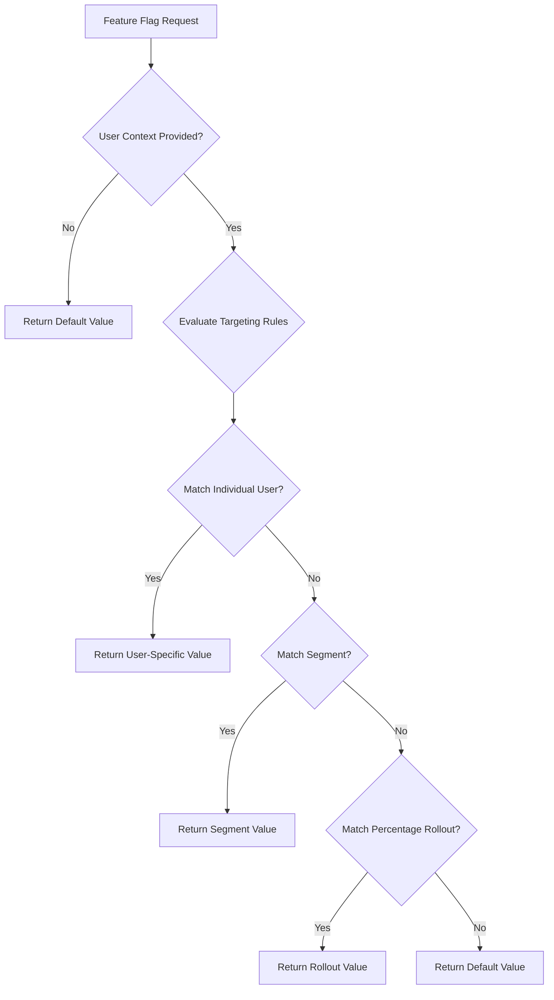
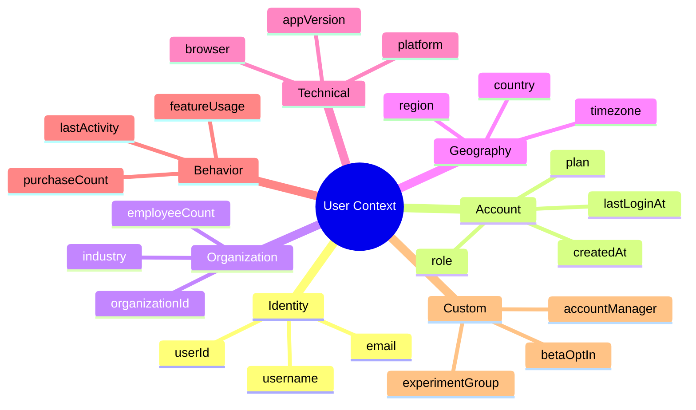
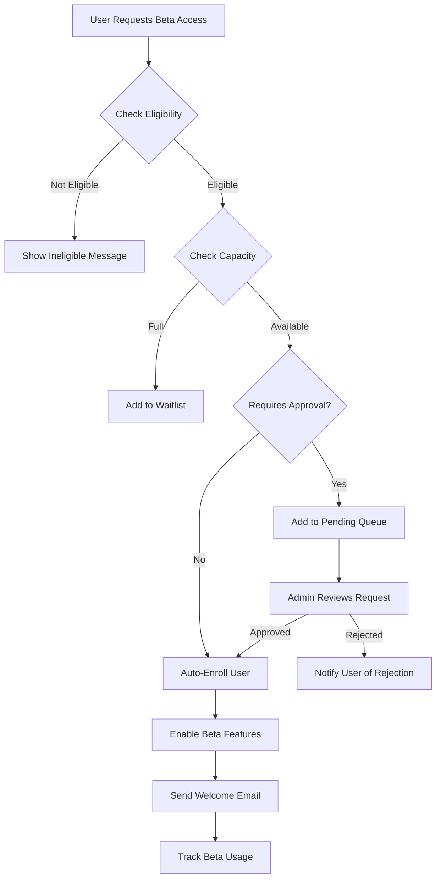
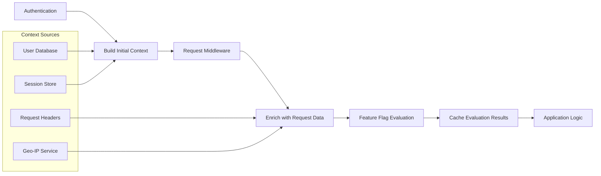
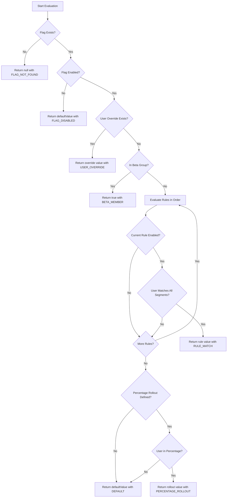

# How to Create User Targeting Flags

Author: [nawazdhandala](https://github.com/nawazdhandala)

Tags: Feature Flags, DevOps, Personalization, SRE

Description: Learn how to implement user-targeted feature flags for personalized experiences and beta testing.

---

Feature flags let you toggle functionality on or off without deploying new code. User targeting takes this concept further by enabling specific features for specific users or groups. This allows you to roll out features gradually, run A/B tests, create beta programs, and deliver personalized experiences.

In this guide, we will walk through the core concepts of user targeting, explore practical implementation patterns, and show you how to build a robust targeting system for your applications.

---

## Table of Contents

1. What is User Targeting?
2. User Attributes and Context
3. Segment Targeting Strategies
4. Building Beta Groups
5. Evaluation Context in Practice
6. Implementation Examples
7. Targeting Rule Evaluation Flow
8. Best Practices
9. Common Pitfalls to Avoid

---

## 1. What is User Targeting?

User targeting allows you to control which users see a feature based on their attributes, behavior, or group membership. Instead of a simple on/off toggle, you define rules that evaluate against user data to determine flag values.



Common use cases for user targeting:

| Use Case | Description | Example |
|----------|-------------|---------|
| Beta Testing | Release features to internal users first | Enable for employees before public launch |
| Gradual Rollout | Incrementally increase user exposure | Start with 5%, then 25%, then 100% |
| A/B Testing | Compare feature variants | Show variant A to 50%, variant B to 50% |
| Personalization | Customize based on user attributes | Different UI for enterprise vs free users |
| Canary Releases | Test with a small subset | Enable for users in a specific region first |

---

## 2. User Attributes and Context

The evaluation context contains all the information about the current user that your targeting rules can evaluate against. A well-structured context enables precise targeting.

### Core Attributes

```typescript
// evaluation-context.ts
// Define the structure for user evaluation context

interface EvaluationContext {
  // Required: Unique user identifier
  userId: string;

  // Optional: User email for domain-based targeting
  email?: string;

  // Optional: Plan or subscription level
  plan?: 'free' | 'starter' | 'professional' | 'enterprise';

  // Optional: Account creation date for tenure-based targeting
  createdAt?: Date;

  // Optional: Geographic information
  country?: string;
  region?: string;

  // Optional: Device and platform info
  platform?: 'web' | 'ios' | 'android' | 'desktop';
  appVersion?: string;

  // Optional: Organization for B2B scenarios
  organizationId?: string;
  organizationName?: string;

  // Custom attributes for application-specific targeting
  customAttributes?: Record<string, string | number | boolean>;
}
```

### Building the Context

```typescript
// context-builder.ts
// Helper class to construct evaluation contexts consistently

class EvaluationContextBuilder {
  private context: Partial<EvaluationContext> = {};

  // Set the required user identifier
  withUserId(userId: string): this {
    this.context.userId = userId;
    return this;
  }

  // Add email for domain-based targeting rules
  withEmail(email: string): this {
    this.context.email = email;
    return this;
  }

  // Set the user's subscription plan
  withPlan(plan: EvaluationContext['plan']): this {
    this.context.plan = plan;
    return this;
  }

  // Add geographic targeting attributes
  withLocation(country: string, region?: string): this {
    this.context.country = country;
    this.context.region = region;
    return this;
  }

  // Set platform and version for mobile targeting
  withPlatform(platform: EvaluationContext['platform'], version?: string): this {
    this.context.platform = platform;
    this.context.appVersion = version;
    return this;
  }

  // Add organization info for B2B targeting
  withOrganization(id: string, name?: string): this {
    this.context.organizationId = id;
    this.context.organizationName = name;
    return this;
  }

  // Add any custom attribute for flexible targeting
  withCustomAttribute(key: string, value: string | number | boolean): this {
    if (!this.context.customAttributes) {
      this.context.customAttributes = {};
    }
    this.context.customAttributes[key] = value;
    return this;
  }

  // Validate and build the final context
  build(): EvaluationContext {
    if (!this.context.userId) {
      throw new Error('userId is required for evaluation context');
    }
    return this.context as EvaluationContext;
  }
}

// Usage example
const userContext = new EvaluationContextBuilder()
  .withUserId('user_12345')
  .withEmail('developer@acme.com')
  .withPlan('professional')
  .withLocation('US', 'California')
  .withPlatform('web')
  .withOrganization('org_789', 'Acme Corp')
  .withCustomAttribute('teamSize', 25)
  .withCustomAttribute('hasCompletedOnboarding', true)
  .build();
```

### Attribute Categories



---

## 3. Segment Targeting Strategies

Segments are reusable groups of users defined by rules. Instead of duplicating targeting logic across multiple flags, you define a segment once and reference it everywhere.

### Segment Definition

```typescript
// segment.ts
// Define segment structure and rule types

// Supported comparison operators for targeting rules
type Operator =
  | 'equals'           // Exact match
  | 'notEquals'        // Not equal
  | 'contains'         // String contains
  | 'startsWith'       // String starts with
  | 'endsWith'         // String ends with
  | 'greaterThan'      // Numeric comparison
  | 'lessThan'         // Numeric comparison
  | 'in'               // Value in list
  | 'notIn'            // Value not in list
  | 'matches';         // Regex pattern match

// Individual targeting rule
interface TargetingRule {
  attribute: string;      // The context attribute to evaluate
  operator: Operator;     // How to compare the values
  value: any;             // The value to compare against
}

// Segment combines multiple rules with AND/OR logic
interface Segment {
  id: string;
  name: string;
  description?: string;

  // How to combine rules: 'all' = AND, 'any' = OR
  matchType: 'all' | 'any';

  // The rules that define segment membership
  rules: TargetingRule[];

  // Optional: Explicit user list for overrides
  includedUsers?: string[];
  excludedUsers?: string[];
}
```

### Common Segment Patterns

```typescript
// segment-examples.ts
// Pre-defined segments for common targeting scenarios

const segments: Segment[] = [
  // Internal employees for dogfooding
  {
    id: 'segment_internal',
    name: 'Internal Employees',
    description: 'All company employees for internal testing',
    matchType: 'any',
    rules: [
      {
        attribute: 'email',
        operator: 'endsWith',
        value: '@ourcompany.com'
      },
      {
        attribute: 'email',
        operator: 'endsWith',
        value: '@ourcompany.io'
      }
    ]
  },

  // Enterprise tier customers
  {
    id: 'segment_enterprise',
    name: 'Enterprise Customers',
    description: 'Users on enterprise plans',
    matchType: 'all',
    rules: [
      {
        attribute: 'plan',
        operator: 'in',
        value: ['enterprise', 'enterprise_plus']
      }
    ]
  },

  // Power users based on usage metrics
  {
    id: 'segment_power_users',
    name: 'Power Users',
    description: 'Highly engaged users based on activity',
    matchType: 'all',
    rules: [
      {
        attribute: 'customAttributes.loginCount',
        operator: 'greaterThan',
        value: 50
      },
      {
        attribute: 'customAttributes.featuresUsed',
        operator: 'greaterThan',
        value: 10
      }
    ]
  },

  // Mobile users for platform-specific features
  {
    id: 'segment_mobile',
    name: 'Mobile Users',
    description: 'Users on iOS or Android apps',
    matchType: 'any',
    rules: [
      {
        attribute: 'platform',
        operator: 'equals',
        value: 'ios'
      },
      {
        attribute: 'platform',
        operator: 'equals',
        value: 'android'
      }
    ]
  },

  // North American users for regional rollouts
  {
    id: 'segment_north_america',
    name: 'North American Users',
    description: 'Users in US, Canada, or Mexico',
    matchType: 'any',
    rules: [
      {
        attribute: 'country',
        operator: 'in',
        value: ['US', 'CA', 'MX']
      }
    ]
  },

  // New users for onboarding experiments
  {
    id: 'segment_new_users',
    name: 'New Users',
    description: 'Users who signed up in the last 30 days',
    matchType: 'all',
    rules: [
      {
        attribute: 'customAttributes.accountAgeDays',
        operator: 'lessThan',
        value: 30
      }
    ]
  }
];
```

### Segment Evaluation

```typescript
// segment-evaluator.ts
// Logic to determine if a user matches a segment

class SegmentEvaluator {

  // Check if user context matches a segment
  evaluate(context: EvaluationContext, segment: Segment): boolean {
    // Check explicit exclusion list first
    if (segment.excludedUsers?.includes(context.userId)) {
      return false;
    }

    // Check explicit inclusion list
    if (segment.includedUsers?.includes(context.userId)) {
      return true;
    }

    // Evaluate rules based on match type
    if (segment.matchType === 'all') {
      // All rules must match (AND logic)
      return segment.rules.every(rule => this.evaluateRule(context, rule));
    } else {
      // Any rule can match (OR logic)
      return segment.rules.some(rule => this.evaluateRule(context, rule));
    }
  }

  // Evaluate a single targeting rule against context
  private evaluateRule(context: EvaluationContext, rule: TargetingRule): boolean {
    // Get the attribute value from context (supports nested paths)
    const value = this.getAttributeValue(context, rule.attribute);

    // Handle missing attributes
    if (value === undefined || value === null) {
      return false;
    }

    // Apply the appropriate operator
    switch (rule.operator) {
      case 'equals':
        return value === rule.value;

      case 'notEquals':
        return value !== rule.value;

      case 'contains':
        return String(value).includes(String(rule.value));

      case 'startsWith':
        return String(value).startsWith(String(rule.value));

      case 'endsWith':
        return String(value).endsWith(String(rule.value));

      case 'greaterThan':
        return Number(value) > Number(rule.value);

      case 'lessThan':
        return Number(value) < Number(rule.value);

      case 'in':
        return Array.isArray(rule.value) && rule.value.includes(value);

      case 'notIn':
        return Array.isArray(rule.value) && !rule.value.includes(value);

      case 'matches':
        return new RegExp(rule.value).test(String(value));

      default:
        return false;
    }
  }

  // Extract attribute value supporting dot notation for nested paths
  private getAttributeValue(context: EvaluationContext, path: string): any {
    const parts = path.split('.');
    let current: any = context;

    for (const part of parts) {
      if (current === undefined || current === null) {
        return undefined;
      }
      current = current[part];
    }

    return current;
  }
}
```

---

## 4. Building Beta Groups

Beta groups allow you to test features with a controlled set of users before general availability. A well-designed beta program includes opt-in mechanisms, staged rollouts, and feedback collection.

### Beta Group Structure

```typescript
// beta-group.ts
// Define beta program structure and membership

interface BetaGroup {
  id: string;
  name: string;
  description: string;

  // Beta program status
  status: 'recruiting' | 'active' | 'closed';

  // Maximum participants allowed
  maxParticipants?: number;

  // Currently enrolled users
  members: BetaMember[];

  // Qualification criteria for joining
  eligibilitySegment?: string;

  // Features enabled for this beta group
  enabledFeatures: string[];

  // Program timeline
  startDate: Date;
  endDate?: Date;
}

interface BetaMember {
  userId: string;
  joinedAt: Date;

  // Opt-in source for tracking
  source: 'invite' | 'self_service' | 'automatic';

  // Member can leave beta if desired
  optedOut: boolean;
  optedOutAt?: Date;

  // Feedback status
  feedbackSubmitted: boolean;
}
```

### Beta Enrollment Flow



### Beta Group Management

```typescript
// beta-manager.ts
// Service for managing beta group enrollment and features

class BetaGroupManager {
  private groups: Map<string, BetaGroup> = new Map();
  private segmentEvaluator: SegmentEvaluator;
  private segments: Map<string, Segment>;

  constructor(
    segmentEvaluator: SegmentEvaluator,
    segments: Map<string, Segment>
  ) {
    this.segmentEvaluator = segmentEvaluator;
    this.segments = segments;
  }

  // Check if user is eligible to join a beta group
  isEligible(context: EvaluationContext, groupId: string): boolean {
    const group = this.groups.get(groupId);
    if (!group) return false;

    // Check if beta is accepting new members
    if (group.status !== 'recruiting' && group.status !== 'active') {
      return false;
    }

    // Check capacity
    const activeMembers = group.members.filter(m => !m.optedOut).length;
    if (group.maxParticipants && activeMembers >= group.maxParticipants) {
      return false;
    }

    // Check eligibility segment if defined
    if (group.eligibilitySegment) {
      const segment = this.segments.get(group.eligibilitySegment);
      if (segment && !this.segmentEvaluator.evaluate(context, segment)) {
        return false;
      }
    }

    return true;
  }

  // Enroll a user in a beta group
  enroll(
    context: EvaluationContext,
    groupId: string,
    source: BetaMember['source'] = 'self_service'
  ): { success: boolean; message: string } {
    const group = this.groups.get(groupId);
    if (!group) {
      return { success: false, message: 'Beta group not found' };
    }

    // Check if already enrolled
    const existingMember = group.members.find(m => m.userId === context.userId);
    if (existingMember && !existingMember.optedOut) {
      return { success: false, message: 'Already enrolled in beta' };
    }

    // Verify eligibility
    if (!this.isEligible(context, groupId)) {
      return { success: false, message: 'Not eligible for this beta program' };
    }

    // Add or update member
    if (existingMember) {
      // Re-enroll previously opted-out user
      existingMember.optedOut = false;
      existingMember.joinedAt = new Date();
      existingMember.source = source;
    } else {
      // Add new member
      group.members.push({
        userId: context.userId,
        joinedAt: new Date(),
        source,
        optedOut: false,
        feedbackSubmitted: false
      });
    }

    return { success: true, message: 'Successfully enrolled in beta' };
  }

  // Allow user to leave beta program
  optOut(userId: string, groupId: string): boolean {
    const group = this.groups.get(groupId);
    if (!group) return false;

    const member = group.members.find(m => m.userId === userId);
    if (!member) return false;

    member.optedOut = true;
    member.optedOutAt = new Date();
    return true;
  }

  // Check if user is an active beta member
  isBetaMember(userId: string, groupId: string): boolean {
    const group = this.groups.get(groupId);
    if (!group) return false;

    const member = group.members.find(m => m.userId === userId);
    return member !== undefined && !member.optedOut;
  }

  // Get all enabled features for a user across all beta groups
  getEnabledBetaFeatures(userId: string): string[] {
    const features = new Set<string>();

    for (const group of this.groups.values()) {
      if (group.status === 'active' && this.isBetaMember(userId, group.id)) {
        group.enabledFeatures.forEach(f => features.add(f));
      }
    }

    return Array.from(features);
  }
}
```

### Progressive Beta Rollout

```typescript
// beta-rollout.ts
// Staged rollout configuration for beta programs

interface RolloutStage {
  name: string;
  percentage: number;        // Percentage of eligible users
  startDate: Date;
  segmentOverrides?: string[]; // Segments that get early access
}

interface BetaRolloutConfig {
  featureId: string;
  stages: RolloutStage[];
  currentStageIndex: number;
}

// Example: Three-stage rollout over 4 weeks
const dashboardRedesignRollout: BetaRolloutConfig = {
  featureId: 'new_dashboard_v2',
  currentStageIndex: 0,
  stages: [
    {
      name: 'Internal Testing',
      percentage: 0,                    // Only segment overrides
      startDate: new Date('2026-01-15'),
      segmentOverrides: ['segment_internal']
    },
    {
      name: 'Early Adopters',
      percentage: 10,
      startDate: new Date('2026-01-22'),
      segmentOverrides: ['segment_internal', 'segment_power_users']
    },
    {
      name: 'Expanded Beta',
      percentage: 50,
      startDate: new Date('2026-01-29'),
      segmentOverrides: ['segment_internal', 'segment_power_users', 'segment_enterprise']
    },
    {
      name: 'General Availability',
      percentage: 100,
      startDate: new Date('2026-02-05')
    }
  ]
};
```

---

## 5. Evaluation Context in Practice

The evaluation context flows through your application, carrying user information that targeting rules evaluate against. Here is how to implement context management effectively.

### Context Propagation Architecture



### Express Middleware Example

```typescript
// feature-flag-middleware.ts
// Express middleware for context building and flag evaluation

import { Request, Response, NextFunction } from 'express';

// Extend Express Request to include feature flag context
declare global {
  namespace Express {
    interface Request {
      featureContext: EvaluationContext;
      flags: FeatureFlagResult;
    }
  }
}

interface FeatureFlagResult {
  get(flagKey: string): boolean | string | number;
  isEnabled(flagKey: string): boolean;
  getVariant(flagKey: string): string;
}

// Middleware to build evaluation context from request
function buildContextMiddleware(
  getUserData: (userId: string) => Promise<any>
) {
  return async (req: Request, res: Response, next: NextFunction) => {
    try {
      // Get authenticated user ID from session or JWT
      const userId = req.user?.id;

      if (!userId) {
        // Anonymous user context
        req.featureContext = {
          userId: req.sessionID || 'anonymous',
          platform: detectPlatform(req.headers['user-agent']),
          country: req.headers['cf-ipcountry'] as string,
        };
      } else {
        // Fetch user data for rich context
        const userData = await getUserData(userId);

        req.featureContext = new EvaluationContextBuilder()
          .withUserId(userId)
          .withEmail(userData.email)
          .withPlan(userData.plan)
          .withLocation(
            req.headers['cf-ipcountry'] as string,
            req.headers['cf-region'] as string
          )
          .withPlatform(detectPlatform(req.headers['user-agent']))
          .withOrganization(userData.organizationId, userData.organizationName)
          .withCustomAttribute('accountAgeDays', calculateAccountAge(userData.createdAt))
          .withCustomAttribute('loginCount', userData.loginCount)
          .build();
      }

      next();
    } catch (error) {
      next(error);
    }
  };
}

// Helper to detect platform from user agent
function detectPlatform(userAgent?: string): EvaluationContext['platform'] {
  if (!userAgent) return 'web';

  const ua = userAgent.toLowerCase();
  if (ua.includes('oneuptime-ios')) return 'ios';
  if (ua.includes('oneuptime-android')) return 'android';
  if (ua.includes('electron')) return 'desktop';
  return 'web';
}

// Calculate account age in days
function calculateAccountAge(createdAt: Date): number {
  const now = new Date();
  const diffTime = Math.abs(now.getTime() - createdAt.getTime());
  return Math.ceil(diffTime / (1000 * 60 * 60 * 24));
}
```

### Flag Evaluation Middleware

```typescript
// flag-evaluation-middleware.ts
// Middleware to evaluate flags and attach results to request

import { FeatureFlagService } from './feature-flag-service';

function evaluateFlagsMiddleware(flagService: FeatureFlagService) {
  return async (req: Request, res: Response, next: NextFunction) => {
    try {
      // Evaluate all flags for this user
      const evaluations = await flagService.evaluateAll(req.featureContext);

      // Create a convenient accessor
      req.flags = {
        get(flagKey: string) {
          return evaluations[flagKey]?.value ?? null;
        },
        isEnabled(flagKey: string) {
          return evaluations[flagKey]?.value === true;
        },
        getVariant(flagKey: string) {
          return String(evaluations[flagKey]?.value ?? 'control');
        }
      };

      next();
    } catch (error) {
      // Log error but do not block request
      console.error('Flag evaluation failed:', error);

      // Provide safe defaults
      req.flags = {
        get: () => null,
        isEnabled: () => false,
        getVariant: () => 'control'
      };

      next();
    }
  };
}
```

### Using Flags in Route Handlers

```typescript
// routes.ts
// Example route handlers using feature flags

import express from 'express';

const router = express.Router();

// Use flag to control feature access
router.get('/dashboard', async (req, res) => {
  // Check if user should see new dashboard
  if (req.flags.isEnabled('new_dashboard_v2')) {
    return res.render('dashboard-v2', {
      user: req.user,
      features: {
        advancedCharts: req.flags.isEnabled('advanced_charts'),
        exportToPdf: req.flags.isEnabled('export_pdf')
      }
    });
  }

  // Fallback to old dashboard
  return res.render('dashboard', { user: req.user });
});

// Use flag variant for A/B testing
router.get('/checkout', async (req, res) => {
  const checkoutVariant = req.flags.getVariant('checkout_flow');

  // Track which variant user sees for analytics
  analytics.track('checkout_viewed', {
    userId: req.featureContext.userId,
    variant: checkoutVariant
  });

  switch (checkoutVariant) {
    case 'single_page':
      return res.render('checkout-single-page');
    case 'multi_step':
      return res.render('checkout-multi-step');
    default:
      return res.render('checkout-standard');
  }
});

// Gate beta features behind flag and segment
router.post('/api/reports/generate', async (req, res) => {
  // Check if user has access to advanced reports
  if (!req.flags.isEnabled('advanced_reports_beta')) {
    return res.status(403).json({
      error: 'Feature not available',
      message: 'Advanced reports are currently in beta. Contact support for access.'
    });
  }

  // Proceed with report generation
  const report = await generateAdvancedReport(req.body);
  return res.json(report);
});
```

---

## 6. Implementation Examples

Here is a complete feature flag service implementation with user targeting support.

### Feature Flag Service

```typescript
// feature-flag-service.ts
// Complete feature flag service with targeting

interface FeatureFlag {
  key: string;
  name: string;
  description?: string;

  // Flag type determines value structure
  type: 'boolean' | 'string' | 'number' | 'json';

  // Default value when no rules match
  defaultValue: any;

  // Global kill switch
  enabled: boolean;

  // Targeting configuration
  targeting: TargetingConfig;
}

interface TargetingConfig {
  // Individual user overrides (highest priority)
  userOverrides: Map<string, any>;

  // Segment-based rules (evaluated in order)
  rules: TargetingRuleConfig[];

  // Percentage-based rollout for remaining users
  percentageRollout?: {
    percentage: number;
    valueWhenIncluded: any;
  };
}

interface TargetingRuleConfig {
  id: string;
  segmentIds: string[];       // User must match all these segments
  value: any;                 // Value to return when rule matches
  enabled: boolean;           // Rule can be disabled without removal
}

interface FlagEvaluation {
  flagKey: string;
  value: any;
  reason: string;             // Why this value was returned
  ruleId?: string;            // Which rule matched (if any)
  segmentIds?: string[];      // Which segments matched
  timestamp: Date;
}

class FeatureFlagService {
  private flags: Map<string, FeatureFlag> = new Map();
  private segments: Map<string, Segment> = new Map();
  private segmentEvaluator: SegmentEvaluator;
  private betaManager: BetaGroupManager;

  constructor() {
    this.segmentEvaluator = new SegmentEvaluator();
    this.betaManager = new BetaGroupManager(this.segmentEvaluator, this.segments);
  }

  // Evaluate a single flag for a user
  evaluate(context: EvaluationContext, flagKey: string): FlagEvaluation {
    const flag = this.flags.get(flagKey);

    // Flag not found
    if (!flag) {
      return {
        flagKey,
        value: null,
        reason: 'FLAG_NOT_FOUND',
        timestamp: new Date()
      };
    }

    // Flag globally disabled
    if (!flag.enabled) {
      return {
        flagKey,
        value: flag.defaultValue,
        reason: 'FLAG_DISABLED',
        timestamp: new Date()
      };
    }

    // Check individual user override (highest priority)
    if (flag.targeting.userOverrides.has(context.userId)) {
      return {
        flagKey,
        value: flag.targeting.userOverrides.get(context.userId),
        reason: 'USER_OVERRIDE',
        timestamp: new Date()
      };
    }

    // Check beta group membership
    const betaFeatures = this.betaManager.getEnabledBetaFeatures(context.userId);
    if (betaFeatures.includes(flagKey)) {
      return {
        flagKey,
        value: true,  // Beta features default to enabled
        reason: 'BETA_MEMBER',
        timestamp: new Date()
      };
    }

    // Evaluate targeting rules in order
    for (const rule of flag.targeting.rules) {
      if (!rule.enabled) continue;

      // Check if user matches all required segments
      const matchedSegments = rule.segmentIds.filter(segmentId => {
        const segment = this.segments.get(segmentId);
        return segment && this.segmentEvaluator.evaluate(context, segment);
      });

      // All segments must match
      if (matchedSegments.length === rule.segmentIds.length) {
        return {
          flagKey,
          value: rule.value,
          reason: 'RULE_MATCH',
          ruleId: rule.id,
          segmentIds: matchedSegments,
          timestamp: new Date()
        };
      }
    }

    // Check percentage rollout
    if (flag.targeting.percentageRollout) {
      const { percentage, valueWhenIncluded } = flag.targeting.percentageRollout;

      if (this.isInRolloutPercentage(context.userId, flagKey, percentage)) {
        return {
          flagKey,
          value: valueWhenIncluded,
          reason: 'PERCENTAGE_ROLLOUT',
          timestamp: new Date()
        };
      }
    }

    // No rules matched, return default
    return {
      flagKey,
      value: flag.defaultValue,
      reason: 'DEFAULT',
      timestamp: new Date()
    };
  }

  // Evaluate all flags for a user
  async evaluateAll(context: EvaluationContext): Promise<Record<string, FlagEvaluation>> {
    const results: Record<string, FlagEvaluation> = {};

    for (const [flagKey] of this.flags) {
      results[flagKey] = this.evaluate(context, flagKey);
    }

    return results;
  }

  // Deterministic percentage rollout based on user ID and flag key
  private isInRolloutPercentage(
    userId: string,
    flagKey: string,
    percentage: number
  ): boolean {
    // Create a deterministic hash from userId and flagKey
    // This ensures the same user always gets the same result for a given flag
    const hash = this.hashString(`${userId}:${flagKey}`);
    const normalizedHash = hash % 100;

    return normalizedHash < percentage;
  }

  // Simple hash function for percentage calculation
  private hashString(str: string): number {
    let hash = 0;
    for (let i = 0; i < str.length; i++) {
      const char = str.charCodeAt(i);
      hash = ((hash << 5) - hash) + char;
      hash = hash & hash; // Convert to 32-bit integer
    }
    return Math.abs(hash);
  }
}
```

### Flag Configuration Example

```typescript
// flag-config.ts
// Example feature flag configurations

const featureFlags: FeatureFlag[] = [
  // Boolean flag with segment targeting
  {
    key: 'new_dashboard_v2',
    name: 'New Dashboard V2',
    description: 'Redesigned dashboard with improved analytics',
    type: 'boolean',
    defaultValue: false,
    enabled: true,
    targeting: {
      userOverrides: new Map([
        ['user_ceo_123', true],      // CEO always sees new dashboard
        ['user_demo_456', true],     // Demo account for sales
      ]),
      rules: [
        {
          id: 'rule_internal',
          segmentIds: ['segment_internal'],
          value: true,
          enabled: true
        },
        {
          id: 'rule_enterprise',
          segmentIds: ['segment_enterprise'],
          value: true,
          enabled: true
        }
      ],
      percentageRollout: {
        percentage: 25,
        valueWhenIncluded: true
      }
    }
  },

  // Multi-variant flag for A/B testing
  {
    key: 'checkout_flow',
    name: 'Checkout Flow Variant',
    description: 'A/B test for checkout page design',
    type: 'string',
    defaultValue: 'control',
    enabled: true,
    targeting: {
      userOverrides: new Map(),
      rules: [
        {
          id: 'rule_mobile_single_page',
          segmentIds: ['segment_mobile'],
          value: 'single_page',  // Mobile users get single page
          enabled: true
        }
      ],
      percentageRollout: {
        percentage: 50,
        valueWhenIncluded: 'multi_step'  // 50% get multi-step variant
      }
    }
  },

  // JSON flag for complex configuration
  {
    key: 'rate_limits',
    name: 'API Rate Limits',
    description: 'Dynamic rate limit configuration per plan',
    type: 'json',
    defaultValue: { requestsPerMinute: 60, burstLimit: 100 },
    enabled: true,
    targeting: {
      userOverrides: new Map([
        ['user_partner_789', { requestsPerMinute: 1000, burstLimit: 2000 }]
      ]),
      rules: [
        {
          id: 'rule_enterprise_limits',
          segmentIds: ['segment_enterprise'],
          value: { requestsPerMinute: 500, burstLimit: 1000 },
          enabled: true
        },
        {
          id: 'rule_power_user_limits',
          segmentIds: ['segment_power_users'],
          value: { requestsPerMinute: 200, burstLimit: 400 },
          enabled: true
        }
      ]
    }
  }
];
```

---

## 7. Targeting Rule Evaluation Flow

Understanding the evaluation order is crucial for debugging and designing targeting rules.



### Evaluation Priority Summary

| Priority | Source | Use Case |
|----------|--------|----------|
| 1 | User Overrides | VIP access, testing, support debugging |
| 2 | Beta Group Membership | Beta programs, early access |
| 3 | Segment Rules (in order) | Targeted rollouts by user type |
| 4 | Percentage Rollout | Gradual release to remaining users |
| 5 | Default Value | Fallback when no rules match |

---

## 8. Best Practices

### Naming Conventions

```typescript
// Good flag names are descriptive and consistent
const goodFlagNames = [
  'new_dashboard_v2',           // Feature with version
  'enable_dark_mode',           // Clear action
  'checkout_flow_variant',      // Indicates A/B test
  'api_rate_limit_config',      // Configuration flag
  'show_promo_banner_q1_2026',  // Time-bounded
];

// Avoid vague or overly generic names
const badFlagNames = [
  'test',                       // Too vague
  'flag1',                      // Not descriptive
  'new_feature',                // Which feature?
  'temporary',                  // No context
];
```

### Segment Design Guidelines

1. **Keep segments focused**: Each segment should represent one concept
2. **Use descriptive names**: `enterprise_customers` not `seg_1`
3. **Document segment purpose**: Include description of intended use
4. **Review segment overlap**: Understand when users match multiple segments
5. **Set up segment monitoring**: Track segment sizes over time

### Testing Strategies

```typescript
// test/feature-flags.test.ts
// Example tests for targeting rules

describe('FeatureFlagService', () => {
  let service: FeatureFlagService;

  beforeEach(() => {
    service = new FeatureFlagService();
    // Load test configuration
  });

  it('should return user override when present', () => {
    const context = { userId: 'user_ceo_123', email: 'ceo@example.com' };
    const result = service.evaluate(context, 'new_dashboard_v2');

    expect(result.value).toBe(true);
    expect(result.reason).toBe('USER_OVERRIDE');
  });

  it('should match segment rules correctly', () => {
    const context = {
      userId: 'user_456',
      email: 'dev@ourcompany.com',
      plan: 'professional'
    };
    const result = service.evaluate(context, 'new_dashboard_v2');

    expect(result.value).toBe(true);
    expect(result.reason).toBe('RULE_MATCH');
    expect(result.segmentIds).toContain('segment_internal');
  });

  it('should apply percentage rollout deterministically', () => {
    const context = { userId: 'user_789', email: 'user@example.com' };

    // Same user should always get same result
    const result1 = service.evaluate(context, 'new_dashboard_v2');
    const result2 = service.evaluate(context, 'new_dashboard_v2');

    expect(result1.value).toBe(result2.value);
  });

  it('should return default when no rules match', () => {
    const context = { userId: 'user_new', email: 'new@random.com' };

    // Set percentage to 0 to test default
    const result = service.evaluate(context, 'disabled_feature');

    expect(result.value).toBe(false);
    expect(result.reason).toBe('DEFAULT');
  });
});
```

### Monitoring and Observability

```typescript
// flag-metrics.ts
// Track flag evaluation metrics

interface FlagMetrics {
  flagKey: string;
  evaluations: number;
  uniqueUsers: Set<string>;
  valueDistribution: Map<string, number>;
  reasonDistribution: Map<string, number>;
  latencyMs: number[];
}

class FlagMetricsCollector {
  private metrics: Map<string, FlagMetrics> = new Map();

  record(evaluation: FlagEvaluation, context: EvaluationContext, latencyMs: number) {
    let metric = this.metrics.get(evaluation.flagKey);

    if (!metric) {
      metric = {
        flagKey: evaluation.flagKey,
        evaluations: 0,
        uniqueUsers: new Set(),
        valueDistribution: new Map(),
        reasonDistribution: new Map(),
        latencyMs: []
      };
      this.metrics.set(evaluation.flagKey, metric);
    }

    metric.evaluations++;
    metric.uniqueUsers.add(context.userId);

    const valueKey = String(evaluation.value);
    metric.valueDistribution.set(
      valueKey,
      (metric.valueDistribution.get(valueKey) || 0) + 1
    );

    metric.reasonDistribution.set(
      evaluation.reason,
      (metric.reasonDistribution.get(evaluation.reason) || 0) + 1
    );

    metric.latencyMs.push(latencyMs);
  }

  // Export metrics to observability platform
  getMetricsSummary(flagKey: string): object {
    const metric = this.metrics.get(flagKey);
    if (!metric) return {};

    const avgLatency = metric.latencyMs.reduce((a, b) => a + b, 0) / metric.latencyMs.length;

    return {
      flagKey,
      totalEvaluations: metric.evaluations,
      uniqueUsers: metric.uniqueUsers.size,
      valueDistribution: Object.fromEntries(metric.valueDistribution),
      reasonDistribution: Object.fromEntries(metric.reasonDistribution),
      avgLatencyMs: avgLatency.toFixed(2)
    };
  }
}
```

---

## 9. Common Pitfalls to Avoid

### Pitfall 1: Evaluation Order Confusion

```typescript
// Problem: Rules evaluated in wrong order
const badConfig = {
  rules: [
    // This broad rule matches first
    { segmentIds: ['all_users'], value: 'variant_a' },
    // This specific rule never gets evaluated
    { segmentIds: ['vip_users'], value: 'variant_vip' }
  ]
};

// Solution: Order rules from most specific to least specific
const goodConfig = {
  rules: [
    // Specific rules first
    { segmentIds: ['vip_users'], value: 'variant_vip' },
    // Broader rules last
    { segmentIds: ['all_users'], value: 'variant_a' }
  ]
};
```

### Pitfall 2: Missing Context Attributes

```typescript
// Problem: Evaluating against attributes that may not exist
const riskyRule = {
  attribute: 'customAttributes.teamSize',
  operator: 'greaterThan',
  value: 10
};
// If teamSize is undefined, comparison fails silently

// Solution: Handle missing attributes explicitly
private evaluateRule(context: EvaluationContext, rule: TargetingRule): boolean {
  const value = this.getAttributeValue(context, rule.attribute);

  // Explicit handling for missing values
  if (value === undefined || value === null) {
    console.warn(`Missing attribute: ${rule.attribute} for user: ${context.userId}`);
    return false;  // Or implement "attributeMissing" operator
  }

  // Continue with evaluation...
}
```

### Pitfall 3: Non-deterministic Percentage Rollouts

```typescript
// Problem: Random percentage creates inconsistent experience
function badPercentageCheck(percentage: number): boolean {
  return Math.random() * 100 < percentage;
  // User might see feature on one request, not on next
}

// Solution: Deterministic hash based on user ID
function goodPercentageCheck(userId: string, flagKey: string, percentage: number): boolean {
  const hash = deterministicHash(`${userId}:${flagKey}`);
  return (hash % 100) < percentage;
  // Same user always gets same result
}
```

### Pitfall 4: Stale Context Data

```typescript
// Problem: Context built once and cached too long
const cachedContext = buildContext(user);  // Built at login
// User upgrades plan, but context still shows old plan

// Solution: Refresh context for critical evaluations
async function evaluateWithFreshContext(
  userId: string,
  flagKey: string
): Promise<FlagEvaluation> {
  // Fetch latest user data
  const userData = await userService.getUser(userId);

  // Build fresh context
  const context = buildContext(userData);

  return flagService.evaluate(context, flagKey);
}
```

### Pitfall 5: No Fallback Strategy

```typescript
// Problem: Application breaks when flag service fails
async function getFeatureValue(flagKey: string): Promise<any> {
  return await flagService.evaluate(context, flagKey);
  // If service throws, application crashes
}

// Solution: Always have fallback defaults
async function getFeatureValueSafe(
  flagKey: string,
  fallback: any
): Promise<any> {
  try {
    const result = await flagService.evaluate(context, flagKey);
    return result.value;
  } catch (error) {
    console.error(`Flag evaluation failed for ${flagKey}:`, error);
    // Return safe fallback
    return fallback;
  }
}
```

---

## Summary

User targeting transforms feature flags from simple toggles into powerful tools for personalization and controlled rollouts. The key components are:

| Component | Purpose |
|-----------|---------|
| Evaluation Context | Carries user attributes for rule matching |
| Segments | Reusable user groupings based on rules |
| Beta Groups | Managed programs for early access |
| Targeting Rules | Define which users get which values |
| Percentage Rollout | Gradual release to remaining users |

When implementing user targeting:

1. Design a comprehensive context schema covering all targeting needs
2. Create focused, well-documented segments
3. Order targeting rules from most specific to least specific
4. Use deterministic hashing for percentage rollouts
5. Always provide fallback defaults
6. Monitor flag evaluations for debugging and optimization

With these patterns in place, you can confidently roll out features to specific user groups, run A/B experiments, and deliver personalized experiences while maintaining control over your release process.

---

**Related Reading:**

- [What is Site Reliability Engineering?](https://oneuptime.com/blog/post/2025-11-28-what-is-site-reliability-engineering/view)
- [The Five Stages of SRE Maturity](https://oneuptime.com/blog/post/2025-09-01-the-five-stages-of-sre-maturity/view)
- [SRE Best Practices](https://oneuptime.com/blog/post/2025-11-28-sre-best-practices/view)
