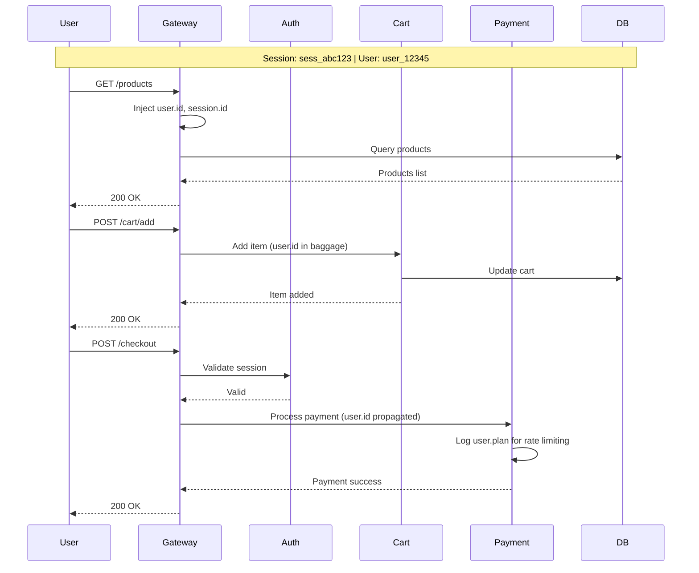
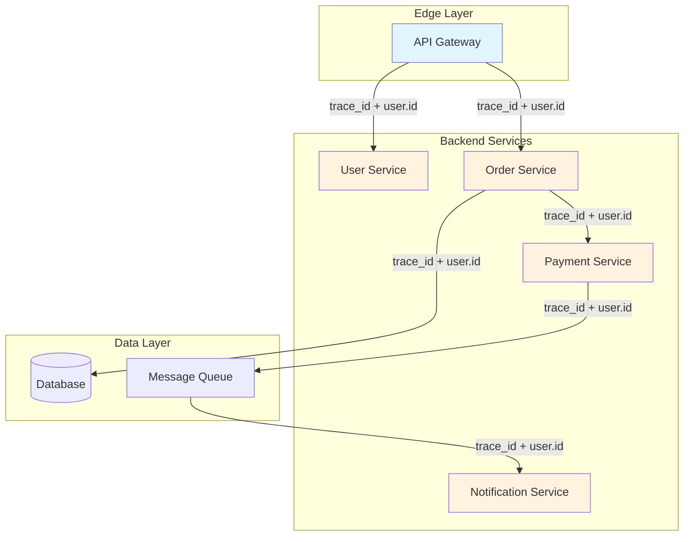

# How to Build User-Trace Correlation

Author: [nawazdhandala](https://github.com/nawazdhandala)

Tags: Tracing, User Analytics, Observability, Correlation

Description: Learn how to connect distributed traces to real user identities for faster debugging and deeper behavior insights.

---

Your distributed traces tell you what happened. Your user analytics tell you who did what. But when a customer reports "checkout was slow," you are stuck trying to bridge two separate worlds.

User-trace correlation solves this. By attaching user identity to every span, you can answer questions like:

- Which users experienced the payment timeout?
- What did user X do in the 30 seconds before the crash?
- Are premium users getting slower response times than free users?

This guide walks through the patterns, code, and architecture for connecting user identity to distributed traces.

---

## Table of Contents

1. Why User-Trace Correlation Matters
2. Core Concepts
3. User Context Injection Patterns
4. Session Tracing
5. User ID Propagation Across Services
6. Behavior Analysis with Traces
7. Mermaid Diagrams: Visualizing User Journeys
8. Implementation Examples
9. Privacy Considerations
10. Querying Correlated Data
11. Common Pitfalls

---

## 1. Why User-Trace Correlation Matters

Without user correlation, debugging follows this pattern:

1. User reports: "The app was slow at 2:15 PM"
2. You search logs for that timeframe
3. You find hundreds of requests
4. You guess which trace belongs to that user
5. You give up and ask for more details

With user correlation:

1. User reports issue
2. You search: `user.id = "user_12345" AND timestamp > 2:15pm`
3. You find the exact trace showing a 4-second database query
4. You fix it

The difference is minutes versus hours.

---

## 2. Core Concepts

| Concept | Description |
|---------|-------------|
| User ID | The stable identifier for a user (UUID, email hash, account ID) |
| Session ID | A temporary identifier for one browsing/app session |
| Trace Context | The trace_id and span_id that tie operations together |
| User Attributes | Metadata like plan type, region, or cohort attached to spans |
| Baggage | Key-value pairs that propagate across service boundaries with trace context |

The goal is to ensure every span carries enough user context to answer: "Who triggered this operation?"

---

## 3. User Context Injection Patterns

There are three main patterns for injecting user context into traces:

### Pattern A: Middleware Injection (Recommended)

Inject user context at the edge, once, and let it flow through.

```typescript
// middleware/tracing.ts
import { trace, context } from '@opentelemetry/api';

export function userTracingMiddleware(req: Request, res: Response, next: NextFunction) {
  const span = trace.getSpan(context.active());

  if (span && req.user) {
    // Core user identity
    span.setAttribute('user.id', req.user.id);
    span.setAttribute('user.session_id', req.sessionId);

    // Business context
    span.setAttribute('user.plan', req.user.plan); // free, pro, enterprise
    span.setAttribute('user.region', req.user.region);
    span.setAttribute('user.cohort', req.user.cohort); // A/B test group
  }

  next();
}
```

### Pattern B: Authentication Handler Injection

Add user context right after authentication succeeds.

```typescript
// auth/handler.ts
import { trace, context } from '@opentelemetry/api';

export async function handleAuth(token: string): Promise<User> {
  const user = await validateToken(token);

  const span = trace.getSpan(context.active());
  if (span) {
    span.setAttribute('user.id', user.id);
    span.setAttribute('user.authenticated', true);
    span.setAttribute('user.auth_method', 'jwt');
  }

  return user;
}
```

### Pattern C: Baggage Propagation

Use OpenTelemetry Baggage for cross-service propagation without modifying every span manually.

```typescript
// baggage/user.ts
import { propagation, context, ROOT_CONTEXT } from '@opentelemetry/api';

export function setUserBaggage(userId: string, sessionId: string) {
  const baggage = propagation.createBaggage({
    'user.id': { value: userId },
    'session.id': { value: sessionId },
  });

  return propagation.setBaggage(context.active(), baggage);
}

// In downstream service, extract from baggage
export function getUserFromBaggage(): { userId?: string; sessionId?: string } {
  const baggage = propagation.getBaggage(context.active());
  return {
    userId: baggage?.getEntry('user.id')?.value,
    sessionId: baggage?.getEntry('session.id')?.value,
  };
}
```

---

## 4. Session Tracing

Sessions group multiple traces from a single user visit. This lets you reconstruct the full user journey, not just individual requests.

### Session ID Generation

Generate session IDs client-side and pass them with every request:

```typescript
// client/session.ts
function getOrCreateSessionId(): string {
  let sessionId = sessionStorage.getItem('trace_session_id');

  if (!sessionId) {
    sessionId = crypto.randomUUID();
    sessionStorage.setItem('trace_session_id', sessionId);
  }

  return sessionId;
}

// Attach to all outgoing requests
fetch('/api/checkout', {
  headers: {
    'X-Session-ID': getOrCreateSessionId(),
    'X-User-ID': currentUser.id,
  },
});
```

### Server-Side Session Extraction

```typescript
// middleware/session.ts
export function sessionMiddleware(req: Request, res: Response, next: NextFunction) {
  const sessionId = req.headers['x-session-id'] || generateServerSessionId();
  const span = trace.getSpan(context.active());

  if (span) {
    span.setAttribute('session.id', sessionId);
    span.setAttribute('session.source', req.headers['x-session-id'] ? 'client' : 'server');
  }

  req.sessionId = sessionId;
  next();
}
```

---

## 5. User ID Propagation Across Services

In microservices, user context must flow from the edge gateway to every downstream service.

### Architecture Overview

```
User Request
    |
    v
[API Gateway] -- adds user.id to span + baggage
    |
    v
[Auth Service] -- validates, enriches user context
    |
    v
[Order Service] -- inherits user.id from propagated context
    |
    v
[Payment Service] -- still has user.id for this trace
```

### Implementation with Baggage

```typescript
// gateway/index.ts
import { propagation, context, trace } from '@opentelemetry/api';

app.use((req, res, next) => {
  const user = authenticateRequest(req);

  // Set baggage that will propagate to downstream services
  const baggage = propagation.createBaggage({
    'user.id': { value: user.id },
    'user.plan': { value: user.plan },
  });

  const newContext = propagation.setBaggage(context.active(), baggage);

  context.with(newContext, () => {
    // Also set on current span for immediate visibility
    const span = trace.getSpan(context.active());
    span?.setAttribute('user.id', user.id);
    span?.setAttribute('user.plan', user.plan);
    next();
  });
});
```

### Downstream Service Extraction

```typescript
// order-service/middleware.ts
app.use((req, res, next) => {
  const baggage = propagation.getBaggage(context.active());
  const userId = baggage?.getEntry('user.id')?.value;

  if (userId) {
    const span = trace.getSpan(context.active());
    span?.setAttribute('user.id', userId);
  }

  next();
});
```

---

## 6. Behavior Analysis with Traces

With user-correlated traces, you can analyze behavior patterns:

### User Journey Reconstruction

Query all traces for a user in a time window:

```sql
SELECT
  trace_id,
  span_name,
  duration_ms,
  timestamp
FROM spans
WHERE user_id = 'user_12345'
  AND timestamp BETWEEN '2024-01-15 14:00:00' AND '2024-01-15 14:30:00'
ORDER BY timestamp;
```

### Cohort Performance Comparison

Compare latency between user segments:

```sql
SELECT
  user_plan,
  percentile_cont(0.95) WITHIN GROUP (ORDER BY duration_ms) as p95_latency,
  COUNT(*) as request_count
FROM spans
WHERE span_name = 'checkout.complete'
  AND timestamp > NOW() - INTERVAL '1 day'
GROUP BY user_plan;
```

### Error Rate by User Segment

```sql
SELECT
  user_region,
  COUNT(CASE WHEN status = 'ERROR' THEN 1 END)::float / COUNT(*) as error_rate
FROM spans
WHERE span_name LIKE 'payment.%'
GROUP BY user_region
ORDER BY error_rate DESC;
```

---

## 7. Mermaid Diagrams: Visualizing User Journeys

### Single User Session Flow



### Cross-Service Trace Propagation



### User Journey Timeline

```mermaid
gantt
    title User Journey: Checkout Flow (user_12345)
    dateFormat X
    axisFormat %L ms

    section Page Load
    Load products      :0, 120

    section Cart
    Add item 1         :150, 80
    Add item 2         :280, 75
    View cart          :400, 50

    section Checkout
    Start checkout     :500, 30
    Validate address   :530, 100
    Process payment    :630, 450
    Confirm order      :1080, 60
```



---

## 8. Implementation Examples

### Full Express.js Setup

```typescript
// telemetry.ts
import { NodeSDK } from '@opentelemetry/sdk-node';
import { getNodeAutoInstrumentations } from '@opentelemetry/auto-instrumentations-node';
import { OTLPTraceExporter } from '@opentelemetry/exporter-otlp-http';
import { Resource } from '@opentelemetry/resources';

const sdk = new NodeSDK({
  resource: new Resource({
    'service.name': 'user-api',
  }),
  traceExporter: new OTLPTraceExporter({
    url: process.env.OTLP_ENDPOINT || 'https://otlp.oneuptime.com/v1/traces',
    headers: { 'x-oneuptime-token': process.env.ONEUPTIME_TOKEN },
  }),
  instrumentations: [getNodeAutoInstrumentations()],
});

sdk.start();

// server.ts
import express from 'express';
import { trace, context, propagation } from '@opentelemetry/api';

const app = express();

// User context middleware
app.use((req, res, next) => {
  const span = trace.getSpan(context.active());

  // Extract user from JWT or session
  const user = extractUser(req);

  if (user && span) {
    // Set attributes on span
    span.setAttribute('user.id', user.id);
    span.setAttribute('user.email_domain', user.email.split('@')[1]); // Not full email
    span.setAttribute('user.plan', user.plan);
    span.setAttribute('user.created_days_ago', daysSince(user.createdAt));

    // Set baggage for downstream propagation
    const baggage = propagation.createBaggage({
      'user.id': { value: user.id },
      'user.plan': { value: user.plan },
    });
    const newCtx = propagation.setBaggage(context.active(), baggage);

    return context.with(newCtx, () => next());
  }

  next();
});

// Example endpoint
app.get('/api/orders', async (req, res) => {
  const span = trace.getSpan(context.active());

  span?.addEvent('orders.fetch.start', {
    'user.id': req.user.id,
    'filter.status': req.query.status,
  });

  const orders = await fetchOrders(req.user.id);

  span?.setAttribute('orders.count', orders.length);
  span?.addEvent('orders.fetch.complete');

  res.json(orders);
});
```

### Python FastAPI Example

```python
# middleware.py
from opentelemetry import trace, baggage
from opentelemetry.context import attach, detach
from fastapi import Request

tracer = trace.get_tracer(__name__)

async def user_tracing_middleware(request: Request, call_next):
    span = trace.get_current_span()
    user = request.state.user  # Set by auth middleware

    if user and span:
        span.set_attribute("user.id", user.id)
        span.set_attribute("user.plan", user.plan)
        span.set_attribute("session.id", request.headers.get("x-session-id", "unknown"))

        # Set baggage for propagation
        ctx = baggage.set_baggage("user.id", user.id)
        token = attach(ctx)

        try:
            response = await call_next(request)
        finally:
            detach(token)

        return response

    return await call_next(request)
```

---

## 9. Privacy Considerations

User-trace correlation requires careful handling of personal data.

### What to Include

| Safe to Include | Avoid Including |
|-----------------|-----------------|
| Hashed user ID | Raw email address |
| Plan/tier type | Full name |
| Region (country level) | Exact location |
| Cohort/segment ID | IP address |
| Account age (days) | Payment details |
| Session ID | Password attempts |

### Attribute Sanitization

```typescript
function sanitizeUserAttributes(user: User): Record<string, string> {
  return {
    'user.id': user.id, // UUID is safe
    'user.email_domain': user.email.split('@')[1], // Domain only
    'user.plan': user.plan,
    'user.region': user.country, // Country, not city
    'user.account_age_days': String(daysSince(user.createdAt)),
    // Never include: full email, name, address, phone
  };
}
```

### Data Retention

Configure trace retention to comply with regulations:

- Keep user-correlated traces for your standard retention period
- Ensure ability to delete traces for specific users (GDPR right to erasure)
- Document what user data appears in traces

---

## 10. Querying Correlated Data

Once you have user-correlated traces, build useful queries.

### Find All Traces for a User

```sql
SELECT
  trace_id,
  MIN(timestamp) as started_at,
  MAX(timestamp) as ended_at,
  SUM(duration_ms) as total_duration,
  COUNT(*) as span_count
FROM spans
WHERE attributes->>'user.id' = 'user_12345'
  AND timestamp > NOW() - INTERVAL '7 days'
GROUP BY trace_id
ORDER BY started_at DESC;
```

### Identify Slow User Experiences

```sql
SELECT
  attributes->>'user.id' as user_id,
  COUNT(*) as slow_requests,
  AVG(duration_ms) as avg_latency
FROM spans
WHERE span_name = 'http.request'
  AND duration_ms > 2000
  AND timestamp > NOW() - INTERVAL '1 day'
GROUP BY attributes->>'user.id'
ORDER BY slow_requests DESC
LIMIT 20;
```

### Session Replay Query

```sql
SELECT
  span_name,
  attributes,
  duration_ms,
  status,
  timestamp
FROM spans
WHERE attributes->>'session.id' = 'sess_abc123'
ORDER BY timestamp ASC;
```

---

## 11. Common Pitfalls

### Pitfall 1: High Cardinality User IDs in Span Names

Bad:
```typescript
span.updateName(`checkout.user_${userId}`); // Creates millions of unique names
```

Good:
```typescript
span.updateName('checkout.complete');
span.setAttribute('user.id', userId);
```

### Pitfall 2: Missing User Context in Async Operations

```typescript
// Bad: User context lost in setTimeout
setTimeout(() => {
  processOrder(); // No user.id on spans
}, 1000);

// Good: Preserve context
const currentContext = context.active();
setTimeout(() => {
  context.with(currentContext, () => {
    processOrder(); // User context preserved
  });
}, 1000);
```

### Pitfall 3: Not Propagating to Background Jobs

```typescript
// When enqueueing a job, include trace context
await queue.add('process-order', {
  orderId: order.id,
  traceContext: {
    traceId: span.spanContext().traceId,
    spanId: span.spanContext().spanId,
    userId: user.id,
  },
});

// In the worker, restore context
worker.process('process-order', async (job) => {
  const { traceContext } = job.data;

  const span = tracer.startSpan('job.process-order', {
    links: [{ context: traceContext }],
  });

  span.setAttribute('user.id', traceContext.userId);
  // Process job...
  span.end();
});
```

### Pitfall 4: Inconsistent User ID Formats

Standardize user ID format across services:

```typescript
// Bad: Different formats
span.setAttribute('user.id', 'user_12345');    // Service A
span.setAttribute('userId', '12345');           // Service B
span.setAttribute('user_identifier', 'U12345'); // Service C

// Good: Consistent format everywhere
span.setAttribute('user.id', 'user_12345');
```

---

## Summary

User-trace correlation transforms your observability from "something went wrong" to "here is exactly what user X experienced." The key points:

| Aspect | Recommendation |
|--------|----------------|
| Injection Point | Add user context at the edge, in middleware |
| Propagation | Use OpenTelemetry Baggage for cross-service flow |
| Session Tracking | Generate client-side session IDs for journey reconstruction |
| Privacy | Hash/anonymize PII, include only necessary attributes |
| Querying | Index on user.id and session.id for fast lookups |

Start simple: add `user.id` to your root spans. Then expand to session tracking and behavior analysis as your needs grow.

---

*Ready to correlate users with traces? Send your OpenTelemetry data to [OneUptime](https://oneuptime.com) and query user journeys alongside metrics, logs, and incidents in one place.*

---

**Related Reading:**

- [What are Traces and Spans in OpenTelemetry](https://oneuptime.com/blog/post/2025-08-27-traces-and-spans-in-opentelemetry/view)
- [Logs, Metrics, and Traces: The Three Pillars of Observability](https://oneuptime.com/blog/post/2025-08-20-three-pillars-of-observability-logs-metrics-traces/view)
- [How to Structure Logs Properly in OpenTelemetry](https://oneuptime.com/blog/post/2025-08-28-how-to-structure-logs-properly-in-opentelemetry/view)
