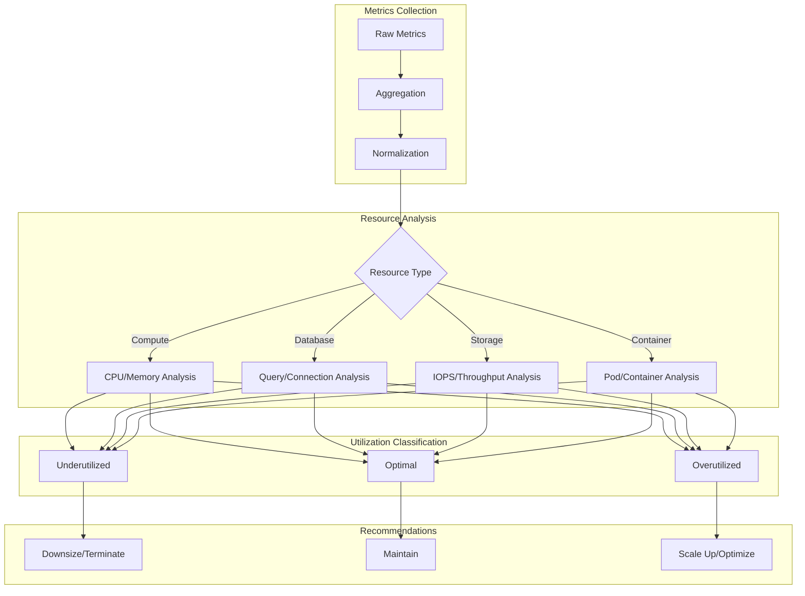
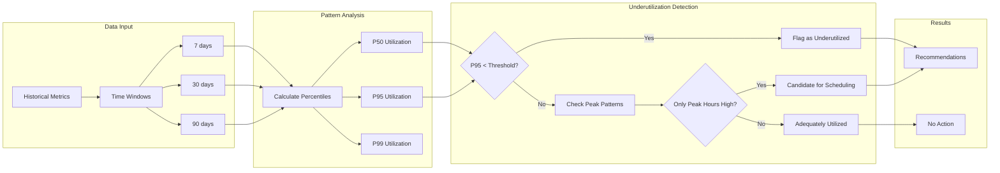
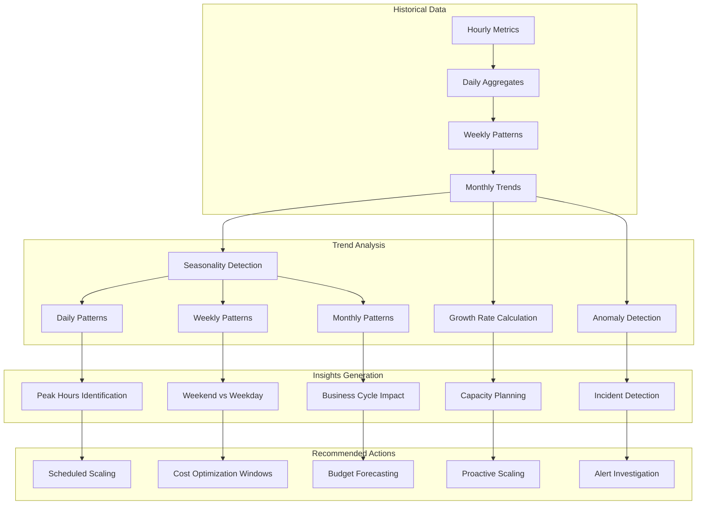

# How to Create Utilization Analysis

Author: [nawazdhandala](https://github.com/nawazdhandala)

Tags: Cloud, Cost Optimization, FinOps, Analysis

Description: Learn how to analyze resource utilization for cost optimization insights.

---

> **The fastest way to reduce cloud costs is not to negotiate discounts or switch providers- it is to stop paying for resources you are not using.**
>
> Utilization analysis transforms raw metrics into actionable insights, revealing where your infrastructure is overprovisioned, underutilized, or perfectly right-sized.

Cloud bills grow silently. Teams provision "just in case" capacity, autoscalers never scale down, and forgotten resources accumulate. Without systematic utilization analysis, you are flying blind- optimizing based on gut feelings rather than data.

This guide walks you through building a comprehensive utilization analysis system: collecting the right metrics, analyzing by resource type, detecting waste, identifying bottlenecks, tracking trends, and generating actionable recommendations.

---

## 1. Understanding Utilization Analysis

Utilization analysis measures how effectively your provisioned resources are being used. It answers critical questions:

- Are we paying for capacity we never use?
- Which resources are bottlenecks vs. over-provisioned?
- How do utilization patterns change over time?
- Where should we invest in optimization?

### The Utilization Spectrum

```
┌─────────────────────────────────────────────────────────────────────────────┐
│                        UTILIZATION SPECTRUM                                  │
├─────────────────────────────────────────────────────────────────────────────┤
│                                                                              │
│  0%        20%        40%        60%        80%        100%                 │
│  ├──────────┼──────────┼──────────┼──────────┼──────────┤                   │
│  │          │          │          │          │          │                   │
│  │  WASTE   │  UNDER   │ OPTIMAL  │  HIGH    │ CRITICAL │                   │
│  │          │  USED    │  ZONE    │  UTIL    │          │                   │
│  │          │          │          │          │          │                   │
│  └──────────┴──────────┴──────────┴──────────┴──────────┘                   │
│                                                                              │
│  Actions:                                                                    │
│  - WASTE: Terminate or consolidate                                          │
│  - UNDERUSED: Downsize or right-size                                        │
│  - OPTIMAL: Maintain current sizing                                         │
│  - HIGH UTIL: Monitor closely                                               │
│  - CRITICAL: Scale up or optimize code                                      │
│                                                                              │
└─────────────────────────────────────────────────────────────────────────────┘
```

The optimal utilization zone varies by resource type and workload characteristics. Stateless web servers can safely run at 70-80% CPU, while databases often need more headroom.

---

## 2. Utilization Metrics Collection

Effective analysis starts with comprehensive metrics collection. Here is a metrics collector that gathers utilization data across compute, memory, storage, and network resources.

### Core Metrics Collector

```typescript
import { MeterProvider, PeriodicExportingMetricReader } from '@opentelemetry/sdk-metrics';
import { OTLPMetricExporter } from '@opentelemetry/exporter-metrics-otlp-http';
import * as os from 'os';
import * as fs from 'fs';

interface UtilizationMetrics {
  timestamp: number;
  cpu: CPUMetrics;
  memory: MemoryMetrics;
  disk: DiskMetrics[];
  network: NetworkMetrics;
}

interface CPUMetrics {
  utilizationPercent: number;
  userPercent: number;
  systemPercent: number;
  ioWaitPercent: number;
  coreUtilization: number[];
}

interface MemoryMetrics {
  totalBytes: number;
  usedBytes: number;
  availableBytes: number;
  utilizationPercent: number;
  swapUsedBytes: number;
  swapTotalBytes: number;
}

interface DiskMetrics {
  mountPoint: string;
  totalBytes: number;
  usedBytes: number;
  availableBytes: number;
  utilizationPercent: number;
  iopsRead: number;
  iopsWrite: number;
  throughputReadBps: number;
  throughputWriteBps: number;
}

interface NetworkMetrics {
  bytesInPerSecond: number;
  bytesOutPerSecond: number;
  packetsInPerSecond: number;
  packetsOutPerSecond: number;
  bandwidthUtilizationPercent: number;
}

class UtilizationCollector {
  private meterProvider: MeterProvider;
  private meter: any;
  private previousCpuTimes: any = null;
  private previousNetworkStats: any = null;
  private previousTimestamp: number = 0;

  constructor(otlpEndpoint: string) {
    const exporter = new OTLPMetricExporter({
      url: `${otlpEndpoint}/v1/metrics`,
    });

    this.meterProvider = new MeterProvider({
      readers: [
        new PeriodicExportingMetricReader({
          exporter,
          exportIntervalMillis: 60000, // Export every minute
        }),
      ],
    });

    this.meter = this.meterProvider.getMeter('utilization-collector');
    this.initializeMetrics();
  }

  private initializeMetrics(): void {
    // CPU utilization gauge
    this.meter.createObservableGauge('system.cpu.utilization', {
      description: 'CPU utilization percentage',
      unit: '%',
    });

    // Memory utilization gauge
    this.meter.createObservableGauge('system.memory.utilization', {
      description: 'Memory utilization percentage',
      unit: '%',
    });

    // Disk utilization gauge
    this.meter.createObservableGauge('system.disk.utilization', {
      description: 'Disk utilization percentage',
      unit: '%',
    });

    // Network throughput gauge
    this.meter.createObservableGauge('system.network.throughput', {
      description: 'Network throughput in bytes per second',
      unit: 'By/s',
    });
  }

  async collectMetrics(): Promise<UtilizationMetrics> {
    const timestamp = Date.now();

    const [cpu, memory, disk, network] = await Promise.all([
      this.collectCPUMetrics(),
      this.collectMemoryMetrics(),
      this.collectDiskMetrics(),
      this.collectNetworkMetrics(),
    ]);

    return {
      timestamp,
      cpu,
      memory,
      disk,
      network,
    };
  }

  private async collectCPUMetrics(): Promise<CPUMetrics> {
    const cpus = os.cpus();
    const currentTimes = cpus.map(cpu => ({
      user: cpu.times.user,
      nice: cpu.times.nice,
      sys: cpu.times.sys,
      idle: cpu.times.idle,
      irq: cpu.times.irq,
    }));

    if (!this.previousCpuTimes) {
      this.previousCpuTimes = currentTimes;
      return {
        utilizationPercent: 0,
        userPercent: 0,
        systemPercent: 0,
        ioWaitPercent: 0,
        coreUtilization: cpus.map(() => 0),
      };
    }

    let totalUser = 0, totalSystem = 0, totalIdle = 0, totalIoWait = 0;
    const coreUtilization: number[] = [];

    for (let i = 0; i < cpus.length; i++) {
      const prev = this.previousCpuTimes[i];
      const curr = currentTimes[i];

      const userDiff = curr.user - prev.user;
      const sysDiff = curr.sys - prev.sys;
      const idleDiff = curr.idle - prev.idle;
      const total = userDiff + sysDiff + idleDiff + (curr.nice - prev.nice) + (curr.irq - prev.irq);

      totalUser += userDiff;
      totalSystem += sysDiff;
      totalIdle += idleDiff;

      coreUtilization.push(total > 0 ? ((total - idleDiff) / total) * 100 : 0);
    }

    const totalTime = totalUser + totalSystem + totalIdle + totalIoWait;

    this.previousCpuTimes = currentTimes;

    return {
      utilizationPercent: totalTime > 0 ? ((totalTime - totalIdle) / totalTime) * 100 : 0,
      userPercent: totalTime > 0 ? (totalUser / totalTime) * 100 : 0,
      systemPercent: totalTime > 0 ? (totalSystem / totalTime) * 100 : 0,
      ioWaitPercent: totalTime > 0 ? (totalIoWait / totalTime) * 100 : 0,
      coreUtilization,
    };
  }

  private async collectMemoryMetrics(): Promise<MemoryMetrics> {
    const totalMemory = os.totalmem();
    const freeMemory = os.freemem();
    const usedMemory = totalMemory - freeMemory;

    return {
      totalBytes: totalMemory,
      usedBytes: usedMemory,
      availableBytes: freeMemory,
      utilizationPercent: (usedMemory / totalMemory) * 100,
      swapUsedBytes: 0, // Platform-specific, simplified here
      swapTotalBytes: 0,
    };
  }

  private async collectDiskMetrics(): Promise<DiskMetrics[]> {
    // Simplified disk metrics - in production, use platform-specific tools
    const diskMetrics: DiskMetrics[] = [];

    // Example for root filesystem
    try {
      const stats = fs.statfsSync('/');
      const totalBytes = stats.bsize * stats.blocks;
      const availableBytes = stats.bsize * stats.bavail;
      const usedBytes = totalBytes - availableBytes;

      diskMetrics.push({
        mountPoint: '/',
        totalBytes,
        usedBytes,
        availableBytes,
        utilizationPercent: (usedBytes / totalBytes) * 100,
        iopsRead: 0, // Requires /proc/diskstats parsing
        iopsWrite: 0,
        throughputReadBps: 0,
        throughputWriteBps: 0,
      });
    } catch (error) {
      // Handle permission errors gracefully
    }

    return diskMetrics;
  }

  private async collectNetworkMetrics(): Promise<NetworkMetrics> {
    const interfaces = os.networkInterfaces();
    const timestamp = Date.now();

    // Calculate bandwidth based on interface speed
    // This is simplified - production would read from /sys/class/net
    const bandwidthBps = 1_000_000_000; // Assume 1 Gbps

    return {
      bytesInPerSecond: 0,
      bytesOutPerSecond: 0,
      packetsInPerSecond: 0,
      packetsOutPerSecond: 0,
      bandwidthUtilizationPercent: 0,
    };
  }
}
```

### Cloud Provider Metrics Integration

For cloud resources, integrate with provider APIs to collect instance-level metrics:

```typescript
import { CloudWatchClient, GetMetricDataCommand } from '@aws-sdk/client-cloudwatch';

interface CloudResourceMetrics {
  resourceId: string;
  resourceType: string;
  region: string;
  metrics: {
    cpuUtilization: number;
    memoryUtilization: number;
    networkIn: number;
    networkOut: number;
    diskReadOps: number;
    diskWriteOps: number;
  };
  cost: {
    hourlyRate: number;
    monthlyEstimate: number;
  };
}

class CloudMetricsCollector {
  private cloudwatch: CloudWatchClient;

  constructor(region: string) {
    this.cloudwatch = new CloudWatchClient({ region });
  }

  async getEC2Utilization(
    instanceId: string,
    startTime: Date,
    endTime: Date
  ): Promise<CloudResourceMetrics> {
    const metrics = await this.cloudwatch.send(new GetMetricDataCommand({
      StartTime: startTime,
      EndTime: endTime,
      MetricDataQueries: [
        {
          Id: 'cpu',
          MetricStat: {
            Metric: {
              Namespace: 'AWS/EC2',
              MetricName: 'CPUUtilization',
              Dimensions: [{ Name: 'InstanceId', Value: instanceId }],
            },
            Period: 300,
            Stat: 'Average',
          },
        },
        {
          Id: 'networkIn',
          MetricStat: {
            Metric: {
              Namespace: 'AWS/EC2',
              MetricName: 'NetworkIn',
              Dimensions: [{ Name: 'InstanceId', Value: instanceId }],
            },
            Period: 300,
            Stat: 'Average',
          },
        },
        {
          Id: 'networkOut',
          MetricStat: {
            Metric: {
              Namespace: 'AWS/EC2',
              MetricName: 'NetworkOut',
              Dimensions: [{ Name: 'InstanceId', Value: instanceId }],
            },
            Period: 300,
            Stat: 'Average',
          },
        },
        {
          Id: 'diskRead',
          MetricStat: {
            Metric: {
              Namespace: 'AWS/EC2',
              MetricName: 'DiskReadOps',
              Dimensions: [{ Name: 'InstanceId', Value: instanceId }],
            },
            Period: 300,
            Stat: 'Sum',
          },
        },
        {
          Id: 'diskWrite',
          MetricStat: {
            Metric: {
              Namespace: 'AWS/EC2',
              MetricName: 'DiskWriteOps',
              Dimensions: [{ Name: 'InstanceId', Value: instanceId }],
            },
            Period: 300,
            Stat: 'Sum',
          },
        },
      ],
    }));

    const getAverage = (id: string): number => {
      const result = metrics.MetricDataResults?.find(r => r.Id === id);
      if (!result?.Values?.length) return 0;
      return result.Values.reduce((a, b) => a + b, 0) / result.Values.length;
    };

    return {
      resourceId: instanceId,
      resourceType: 'EC2',
      region: 'us-east-1',
      metrics: {
        cpuUtilization: getAverage('cpu'),
        memoryUtilization: 0, // Requires CloudWatch agent
        networkIn: getAverage('networkIn'),
        networkOut: getAverage('networkOut'),
        diskReadOps: getAverage('diskRead'),
        diskWriteOps: getAverage('diskWrite'),
      },
      cost: {
        hourlyRate: 0, // Would fetch from pricing API
        monthlyEstimate: 0,
      },
    };
  }
}
```

---

## 3. Analysis by Resource Type

Different resource types require different analysis approaches. Here is a comprehensive analyzer that handles compute, database, storage, and container workloads.



### Resource Type Analyzer

```typescript
type UtilizationCategory = 'waste' | 'underutilized' | 'optimal' | 'high' | 'critical';

interface ResourceAnalysis {
  resourceId: string;
  resourceType: string;
  category: UtilizationCategory;
  metrics: {
    primary: { name: string; value: number; threshold: number };
    secondary: { name: string; value: number; threshold: number }[];
  };
  score: number; // 0-100 efficiency score
  potentialSavings: number;
  recommendations: string[];
}

interface AnalysisThresholds {
  waste: number;
  underutilized: number;
  optimal: number;
  high: number;
}

class ResourceTypeAnalyzer {
  private thresholds: Record<string, AnalysisThresholds> = {
    'ec2': { waste: 5, underutilized: 20, optimal: 60, high: 80 },
    'rds': { waste: 5, underutilized: 15, optimal: 50, high: 75 },
    'lambda': { waste: 1, underutilized: 10, optimal: 40, high: 70 },
    'container': { waste: 5, underutilized: 25, optimal: 65, high: 85 },
    'storage': { waste: 10, underutilized: 30, optimal: 70, high: 90 },
  };

  analyzeCompute(metrics: CloudResourceMetrics): ResourceAnalysis {
    const cpuUtil = metrics.metrics.cpuUtilization;
    const memUtil = metrics.metrics.memoryUtilization;
    const threshold = this.thresholds['ec2'];

    // Use the higher of CPU or memory for categorization
    const primaryUtil = Math.max(cpuUtil, memUtil);
    const category = this.categorize(primaryUtil, threshold);

    // Calculate efficiency score
    const score = this.calculateEfficiencyScore(cpuUtil, memUtil);

    // Estimate potential savings
    const potentialSavings = this.estimateSavings(category, metrics.cost.monthlyEstimate);

    return {
      resourceId: metrics.resourceId,
      resourceType: metrics.resourceType,
      category,
      metrics: {
        primary: { name: 'CPU Utilization', value: cpuUtil, threshold: threshold.optimal },
        secondary: [
          { name: 'Memory Utilization', value: memUtil, threshold: threshold.optimal },
          { name: 'Network In', value: metrics.metrics.networkIn, threshold: 0 },
          { name: 'Network Out', value: metrics.metrics.networkOut, threshold: 0 },
        ],
      },
      score,
      potentialSavings,
      recommendations: this.generateComputeRecommendations(category, cpuUtil, memUtil, metrics),
    };
  }

  analyzeDatabase(metrics: {
    cpuUtilization: number;
    connectionCount: number;
    maxConnections: number;
    readIOPS: number;
    writeIOPS: number;
    provisionedIOPS: number;
    storageUsed: number;
    storageAllocated: number;
    monthlyCost: number;
  }): ResourceAnalysis {
    const threshold = this.thresholds['rds'];

    // Database utilization is multi-dimensional
    const cpuUtil = metrics.cpuUtilization;
    const connectionUtil = (metrics.connectionCount / metrics.maxConnections) * 100;
    const iopsUtil = ((metrics.readIOPS + metrics.writeIOPS) / metrics.provisionedIOPS) * 100;
    const storageUtil = (metrics.storageUsed / metrics.storageAllocated) * 100;

    // Weight different factors
    const weightedUtil = (cpuUtil * 0.4) + (connectionUtil * 0.2) + (iopsUtil * 0.3) + (storageUtil * 0.1);
    const category = this.categorize(weightedUtil, threshold);

    return {
      resourceId: 'database',
      resourceType: 'RDS',
      category,
      metrics: {
        primary: { name: 'Weighted Utilization', value: weightedUtil, threshold: threshold.optimal },
        secondary: [
          { name: 'CPU Utilization', value: cpuUtil, threshold: threshold.optimal },
          { name: 'Connection Utilization', value: connectionUtil, threshold: 70 },
          { name: 'IOPS Utilization', value: iopsUtil, threshold: threshold.optimal },
          { name: 'Storage Utilization', value: storageUtil, threshold: 80 },
        ],
      },
      score: this.calculateDatabaseScore(cpuUtil, connectionUtil, iopsUtil, storageUtil),
      potentialSavings: this.estimateSavings(category, metrics.monthlyCost),
      recommendations: this.generateDatabaseRecommendations(category, {
        cpu: cpuUtil,
        connections: connectionUtil,
        iops: iopsUtil,
        storage: storageUtil,
      }),
    };
  }

  analyzeContainer(metrics: {
    cpuRequested: number;
    cpuUsed: number;
    cpuLimit: number;
    memoryRequested: number;
    memoryUsed: number;
    memoryLimit: number;
    podName: string;
    namespace: string;
  }): ResourceAnalysis {
    const threshold = this.thresholds['container'];

    // Container efficiency: actual vs requested
    const cpuEfficiency = metrics.cpuRequested > 0
      ? (metrics.cpuUsed / metrics.cpuRequested) * 100
      : 0;
    const memEfficiency = metrics.memoryRequested > 0
      ? (metrics.memoryUsed / metrics.memoryRequested) * 100
      : 0;

    // Limit utilization (for safety)
    const cpuLimitUtil = metrics.cpuLimit > 0
      ? (metrics.cpuUsed / metrics.cpuLimit) * 100
      : 0;
    const memLimitUtil = metrics.memoryLimit > 0
      ? (metrics.memoryUsed / metrics.memoryLimit) * 100
      : 0;

    const avgEfficiency = (cpuEfficiency + memEfficiency) / 2;
    const category = this.categorize(avgEfficiency, threshold);

    return {
      resourceId: `${metrics.namespace}/${metrics.podName}`,
      resourceType: 'Container',
      category,
      metrics: {
        primary: { name: 'Resource Efficiency', value: avgEfficiency, threshold: threshold.optimal },
        secondary: [
          { name: 'CPU Request Utilization', value: cpuEfficiency, threshold: threshold.optimal },
          { name: 'Memory Request Utilization', value: memEfficiency, threshold: threshold.optimal },
          { name: 'CPU Limit Utilization', value: cpuLimitUtil, threshold: 80 },
          { name: 'Memory Limit Utilization', value: memLimitUtil, threshold: 80 },
        ],
      },
      score: Math.min(100, avgEfficiency),
      potentialSavings: 0, // Calculated based on cluster costs
      recommendations: this.generateContainerRecommendations(category, {
        cpuEfficiency,
        memEfficiency,
        cpuLimitUtil,
        memLimitUtil,
        cpuRequested: metrics.cpuRequested,
        cpuUsed: metrics.cpuUsed,
        memoryRequested: metrics.memoryRequested,
        memoryUsed: metrics.memoryUsed,
      }),
    };
  }

  private categorize(utilization: number, thresholds: AnalysisThresholds): UtilizationCategory {
    if (utilization < thresholds.waste) return 'waste';
    if (utilization < thresholds.underutilized) return 'underutilized';
    if (utilization < thresholds.optimal) return 'optimal';
    if (utilization < thresholds.high) return 'high';
    return 'critical';
  }

  private calculateEfficiencyScore(cpu: number, memory: number): number {
    // Penalize both under and over utilization
    const cpuScore = this.utilizationToScore(cpu);
    const memScore = this.utilizationToScore(memory);
    return Math.round((cpuScore + memScore) / 2);
  }

  private utilizationToScore(util: number): number {
    // Optimal utilization (60-70%) gets highest score
    // Scores decrease for both under and over utilization
    if (util >= 60 && util <= 70) return 100;
    if (util < 60) return Math.max(0, util * 1.5);
    return Math.max(0, 100 - (util - 70) * 2);
  }

  private calculateDatabaseScore(cpu: number, conn: number, iops: number, storage: number): number {
    return Math.round(
      (this.utilizationToScore(cpu) * 0.4) +
      (this.utilizationToScore(conn) * 0.2) +
      (this.utilizationToScore(iops) * 0.3) +
      (storage < 80 ? 100 : 100 - (storage - 80) * 5) * 0.1
    );
  }

  private estimateSavings(category: UtilizationCategory, monthlyCost: number): number {
    const savingsMultiplier: Record<UtilizationCategory, number> = {
      'waste': 0.9,        // 90% savings by terminating
      'underutilized': 0.5, // 50% savings by right-sizing
      'optimal': 0,         // No change needed
      'high': 0,            // May need to scale up
      'critical': -0.2,     // May cost more after scaling
    };
    return monthlyCost * savingsMultiplier[category];
  }

  private generateComputeRecommendations(
    category: UtilizationCategory,
    cpu: number,
    memory: number,
    metrics: CloudResourceMetrics
  ): string[] {
    const recommendations: string[] = [];

    switch (category) {
      case 'waste':
        recommendations.push(`Instance ${metrics.resourceId} shows < 5% utilization. Consider terminating or consolidating workloads.`);
        recommendations.push('Review if this instance is part of an unused environment or deprecated service.');
        break;
      case 'underutilized':
        if (cpu < 20 && memory < 20) {
          recommendations.push(`Both CPU (${cpu.toFixed(1)}%) and memory (${memory.toFixed(1)}%) are underutilized. Downsize to a smaller instance type.`);
        } else if (cpu < 20) {
          recommendations.push(`CPU utilization is low (${cpu.toFixed(1)}%). Consider a compute-optimized smaller instance.`);
        } else if (memory < 20) {
          recommendations.push(`Memory utilization is low (${memory.toFixed(1)}%). Consider a memory-optimized smaller instance.`);
        }
        recommendations.push('Evaluate if workloads can be consolidated onto fewer instances.');
        break;
      case 'optimal':
        recommendations.push('Resource utilization is in the optimal range. No immediate action required.');
        recommendations.push('Continue monitoring for usage pattern changes.');
        break;
      case 'high':
        recommendations.push(`Utilization is high. Monitor for performance degradation.`);
        recommendations.push('Consider enabling auto-scaling if not already configured.');
        break;
      case 'critical':
        recommendations.push(`Critical utilization levels detected. Immediate scaling recommended.`);
        recommendations.push('Investigate for potential memory leaks or CPU-intensive processes.');
        recommendations.push('Consider horizontal scaling or upgrading to a larger instance type.');
        break;
    }

    return recommendations;
  }

  private generateDatabaseRecommendations(
    category: UtilizationCategory,
    metrics: { cpu: number; connections: number; iops: number; storage: number }
  ): string[] {
    const recommendations: string[] = [];

    if (metrics.cpu < 15) {
      recommendations.push(`Database CPU utilization is very low (${metrics.cpu.toFixed(1)}%). Consider downsizing the instance class.`);
    }

    if (metrics.connections < 20) {
      recommendations.push(`Connection utilization is low (${metrics.connections.toFixed(1)}%). Review if max_connections setting is too high.`);
    }

    if (metrics.iops < 20) {
      recommendations.push(`IOPS utilization is low (${metrics.iops.toFixed(1)}%). Consider switching to gp3 storage or reducing provisioned IOPS.`);
    }

    if (metrics.storage > 85) {
      recommendations.push(`Storage utilization is high (${metrics.storage.toFixed(1)}%). Plan for storage expansion or implement data archival.`);
    }

    if (category === 'underutilized') {
      recommendations.push('Consider using Aurora Serverless or on-demand capacity for variable workloads.');
    }

    return recommendations;
  }

  private generateContainerRecommendations(
    category: UtilizationCategory,
    metrics: {
      cpuEfficiency: number;
      memEfficiency: number;
      cpuLimitUtil: number;
      memLimitUtil: number;
      cpuRequested: number;
      cpuUsed: number;
      memoryRequested: number;
      memoryUsed: number;
    }
  ): string[] {
    const recommendations: string[] = [];

    if (metrics.cpuEfficiency < 30) {
      const suggested = Math.ceil(metrics.cpuUsed * 1.3);
      recommendations.push(
        `CPU request is oversized. Current usage: ${metrics.cpuUsed}m, Requested: ${metrics.cpuRequested}m. ` +
        `Suggest reducing to ${suggested}m.`
      );
    }

    if (metrics.memEfficiency < 30) {
      const suggestedMi = Math.ceil((metrics.memoryUsed / (1024 * 1024)) * 1.3);
      const requestedMi = Math.round(metrics.memoryRequested / (1024 * 1024));
      recommendations.push(
        `Memory request is oversized. Current usage: ${Math.round(metrics.memoryUsed / (1024 * 1024))}Mi, ` +
        `Requested: ${requestedMi}Mi. Suggest reducing to ${suggestedMi}Mi.`
      );
    }

    if (metrics.cpuLimitUtil > 90) {
      recommendations.push('CPU limit is frequently reached. Consider increasing the limit or optimizing the application.');
    }

    if (metrics.memLimitUtil > 90) {
      recommendations.push('Memory limit is frequently reached. Risk of OOMKilled. Increase limit or fix memory leaks.');
    }

    if (category === 'waste') {
      recommendations.push('This pod shows minimal resource usage. Verify it is still needed or consolidate with other workloads.');
    }

    return recommendations;
  }
}
```

---

## 4. Underutilization Detection

Detecting underutilized resources requires analyzing patterns over time, not just point-in-time snapshots. Here is a detector that identifies consistently underutilized resources.



### Underutilization Detector

```typescript
interface TimeSeriesPoint {
  timestamp: number;
  value: number;
}

interface UnderutilizationResult {
  resourceId: string;
  isUnderutilized: boolean;
  confidence: number; // 0-1
  utilizationStats: {
    p50: number;
    p75: number;
    p95: number;
    p99: number;
    max: number;
    avg: number;
  };
  pattern: 'constant_low' | 'periodic_spikes' | 'declining' | 'variable';
  peakHours: number[];
  recommendation: string;
  estimatedWaste: number;
}

class UnderutilizationDetector {
  private readonly underutilizationThreshold = 20; // percent
  private readonly wasteThreshold = 5; // percent
  private readonly minimumDataPoints = 168; // 1 week of hourly data

  async detectUnderutilization(
    resourceId: string,
    metrics: TimeSeriesPoint[],
    resourceCostPerHour: number
  ): Promise<UnderutilizationResult> {
    if (metrics.length < this.minimumDataPoints) {
      throw new Error(`Insufficient data points: ${metrics.length}. Need at least ${this.minimumDataPoints}`);
    }

    const values = metrics.map(m => m.value).sort((a, b) => a - b);
    const stats = this.calculateStats(values);
    const pattern = this.detectPattern(metrics);
    const peakHours = this.findPeakHours(metrics);

    // Determine if underutilized based on P95
    // Using P95 instead of max accounts for occasional spikes
    const isUnderutilized = stats.p95 < this.underutilizationThreshold;
    const isWaste = stats.p99 < this.wasteThreshold;

    // Calculate confidence based on data consistency
    const confidence = this.calculateConfidence(values, pattern);

    // Estimate wasted spend
    const avgUtilization = stats.avg / 100;
    const optimalUtilization = 0.65;
    const wastedCapacity = Math.max(0, optimalUtilization - avgUtilization);
    const estimatedWaste = wastedCapacity * resourceCostPerHour * 730; // Monthly hours

    return {
      resourceId,
      isUnderutilized,
      confidence,
      utilizationStats: stats,
      pattern,
      peakHours,
      recommendation: this.generateRecommendation(isUnderutilized, isWaste, pattern, stats, peakHours),
      estimatedWaste,
    };
  }

  private calculateStats(sortedValues: number[]): UnderutilizationResult['utilizationStats'] {
    const len = sortedValues.length;

    return {
      p50: sortedValues[Math.floor(len * 0.5)],
      p75: sortedValues[Math.floor(len * 0.75)],
      p95: sortedValues[Math.floor(len * 0.95)],
      p99: sortedValues[Math.floor(len * 0.99)],
      max: sortedValues[len - 1],
      avg: sortedValues.reduce((a, b) => a + b, 0) / len,
    };
  }

  private detectPattern(metrics: TimeSeriesPoint[]): UnderutilizationResult['pattern'] {
    const values = metrics.map(m => m.value);
    const avg = values.reduce((a, b) => a + b, 0) / values.length;
    const stdDev = Math.sqrt(
      values.reduce((sum, val) => sum + Math.pow(val - avg, 2), 0) / values.length
    );

    // Coefficient of variation
    const cv = stdDev / avg;

    // Check for declining trend
    const firstHalf = values.slice(0, Math.floor(values.length / 2));
    const secondHalf = values.slice(Math.floor(values.length / 2));
    const firstAvg = firstHalf.reduce((a, b) => a + b, 0) / firstHalf.length;
    const secondAvg = secondHalf.reduce((a, b) => a + b, 0) / secondHalf.length;

    if (secondAvg < firstAvg * 0.7) {
      return 'declining';
    }

    if (cv < 0.2) {
      return 'constant_low';
    }

    // Check for periodic spikes (daily pattern)
    const hourlyAverages = this.calculateHourlyAverages(metrics);
    const maxHourly = Math.max(...hourlyAverages);
    const minHourly = Math.min(...hourlyAverages);

    if (maxHourly > minHourly * 3) {
      return 'periodic_spikes';
    }

    return 'variable';
  }

  private findPeakHours(metrics: TimeSeriesPoint[]): number[] {
    const hourlyAverages = this.calculateHourlyAverages(metrics);
    const threshold = Math.max(...hourlyAverages) * 0.7;

    return hourlyAverages
      .map((avg, hour) => ({ hour, avg }))
      .filter(h => h.avg >= threshold)
      .map(h => h.hour);
  }

  private calculateHourlyAverages(metrics: TimeSeriesPoint[]): number[] {
    const hourlyBuckets: number[][] = Array.from({ length: 24 }, () => []);

    for (const point of metrics) {
      const hour = new Date(point.timestamp).getHours();
      hourlyBuckets[hour].push(point.value);
    }

    return hourlyBuckets.map(bucket =>
      bucket.length > 0 ? bucket.reduce((a, b) => a + b, 0) / bucket.length : 0
    );
  }

  private calculateConfidence(values: number[], pattern: string): number {
    // Higher confidence with more data and consistent patterns
    let confidence = Math.min(1, values.length / (this.minimumDataPoints * 4));

    // Constant patterns are more predictable
    if (pattern === 'constant_low') {
      confidence *= 1.0;
    } else if (pattern === 'periodic_spikes') {
      confidence *= 0.9;
    } else if (pattern === 'declining') {
      confidence *= 0.85;
    } else {
      confidence *= 0.7;
    }

    return Math.round(confidence * 100) / 100;
  }

  private generateRecommendation(
    isUnderutilized: boolean,
    isWaste: boolean,
    pattern: string,
    stats: UnderutilizationResult['utilizationStats'],
    peakHours: number[]
  ): string {
    if (isWaste) {
      return `Resource shows < ${this.wasteThreshold}% utilization at P99. Strongly recommend termination or consolidation. ` +
        `Average utilization: ${stats.avg.toFixed(1)}%.`;
    }

    if (!isUnderutilized) {
      return `Resource is adequately utilized (P95: ${stats.p95.toFixed(1)}%). No action needed.`;
    }

    switch (pattern) {
      case 'constant_low':
        return `Consistently low utilization (avg: ${stats.avg.toFixed(1)}%, max: ${stats.max.toFixed(1)}%). ` +
          `Right-size to ${Math.ceil(stats.max * 1.5)}% of current capacity.`;

      case 'periodic_spikes':
        const peakStr = peakHours.map(h => `${h}:00`).join(', ');
        return `Low baseline with spikes during peak hours (${peakStr}). ` +
          `Consider scheduled scaling or spot instances for peak periods.`;

      case 'declining':
        return `Utilization is declining over time (current avg: ${stats.avg.toFixed(1)}%). ` +
          `Review if this workload is being phased out or if traffic is shifting elsewhere.`;

      default:
        return `Variable utilization pattern (P50: ${stats.p50.toFixed(1)}%, P95: ${stats.p95.toFixed(1)}%). ` +
          `Consider auto-scaling to match demand patterns.`;
    }
  }
}
```

### Batch Detection for Fleet Analysis

```typescript
interface FleetUnderutilizationReport {
  totalResources: number;
  underutilizedCount: number;
  wasteCount: number;
  totalMonthlyWaste: number;
  byCategory: {
    waste: UnderutilizationResult[];
    underutilized: UnderutilizationResult[];
    adequate: UnderutilizationResult[];
  };
  topWasteful: UnderutilizationResult[];
}

class FleetAnalyzer {
  private detector: UnderutilizationDetector;

  constructor() {
    this.detector = new UnderutilizationDetector();
  }

  async analyzeFleet(
    resources: Array<{
      resourceId: string;
      metrics: TimeSeriesPoint[];
      costPerHour: number;
    }>
  ): Promise<FleetUnderutilizationReport> {
    const results = await Promise.all(
      resources.map(r =>
        this.detector.detectUnderutilization(r.resourceId, r.metrics, r.costPerHour)
          .catch(err => null) // Handle resources with insufficient data
      )
    );

    const validResults = results.filter((r): r is UnderutilizationResult => r !== null);

    const waste = validResults.filter(r => r.utilizationStats.p99 < 5);
    const underutilized = validResults.filter(r => r.isUnderutilized && r.utilizationStats.p99 >= 5);
    const adequate = validResults.filter(r => !r.isUnderutilized);

    const totalWaste = validResults.reduce((sum, r) => sum + r.estimatedWaste, 0);

    return {
      totalResources: resources.length,
      underutilizedCount: underutilized.length,
      wasteCount: waste.length,
      totalMonthlyWaste: totalWaste,
      byCategory: {
        waste,
        underutilized,
        adequate,
      },
      topWasteful: [...validResults]
        .sort((a, b) => b.estimatedWaste - a.estimatedWaste)
        .slice(0, 10),
    };
  }
}
```

---

## 5. Overutilization Identification

While underutilization wastes money, overutilization risks performance and reliability. Identifying overutilized resources helps prevent outages and ensures headroom for traffic spikes.

```typescript
interface OverutilizationAlert {
  resourceId: string;
  severity: 'warning' | 'critical';
  metric: string;
  currentValue: number;
  threshold: number;
  duration: number; // minutes
  trend: 'increasing' | 'stable' | 'decreasing';
  impactAssessment: string;
  recommendedActions: string[];
}

interface CapacityForecast {
  resourceId: string;
  currentUtilization: number;
  projectedUtilization: number;
  daysUntilCritical: number | null;
  confidence: number;
}

class OverutilizationDetector {
  private thresholds = {
    cpu: { warning: 75, critical: 90 },
    memory: { warning: 80, critical: 95 },
    disk: { warning: 80, critical: 90 },
    connections: { warning: 70, critical: 85 },
  };

  detectOverutilization(
    resourceId: string,
    metrics: {
      cpu: TimeSeriesPoint[];
      memory: TimeSeriesPoint[];
      disk?: TimeSeriesPoint[];
      connections?: TimeSeriesPoint[];
    }
  ): OverutilizationAlert[] {
    const alerts: OverutilizationAlert[] = [];

    // Check each metric type
    const metricChecks: Array<{
      name: keyof typeof this.thresholds;
      data: TimeSeriesPoint[] | undefined;
    }> = [
      { name: 'cpu', data: metrics.cpu },
      { name: 'memory', data: metrics.memory },
      { name: 'disk', data: metrics.disk },
      { name: 'connections', data: metrics.connections },
    ];

    for (const check of metricChecks) {
      if (!check.data || check.data.length === 0) continue;

      const alert = this.checkMetric(resourceId, check.name, check.data);
      if (alert) {
        alerts.push(alert);
      }
    }

    return alerts;
  }

  private checkMetric(
    resourceId: string,
    metricName: keyof typeof this.thresholds,
    data: TimeSeriesPoint[]
  ): OverutilizationAlert | null {
    const thresholds = this.thresholds[metricName];
    const recentData = data.slice(-60); // Last 60 data points

    if (recentData.length < 10) return null;

    const currentValue = recentData[recentData.length - 1].value;
    const avgRecent = recentData.reduce((sum, p) => sum + p.value, 0) / recentData.length;

    // Count how many points exceed thresholds
    const criticalCount = recentData.filter(p => p.value >= thresholds.critical).length;
    const warningCount = recentData.filter(p => p.value >= thresholds.warning).length;

    // Determine severity based on sustained high utilization
    let severity: 'warning' | 'critical' | null = null;

    if (criticalCount >= recentData.length * 0.3) {
      severity = 'critical';
    } else if (warningCount >= recentData.length * 0.5) {
      severity = 'warning';
    }

    if (!severity) return null;

    // Calculate trend
    const trend = this.calculateTrend(recentData);

    // Duration of elevated utilization
    let duration = 0;
    for (let i = recentData.length - 1; i >= 0; i--) {
      if (recentData[i].value >= thresholds.warning) {
        duration++;
      } else {
        break;
      }
    }

    return {
      resourceId,
      severity,
      metric: metricName,
      currentValue,
      threshold: severity === 'critical' ? thresholds.critical : thresholds.warning,
      duration,
      trend,
      impactAssessment: this.assessImpact(metricName, severity, trend),
      recommendedActions: this.generateActions(metricName, severity, trend, currentValue),
    };
  }

  private calculateTrend(data: TimeSeriesPoint[]): 'increasing' | 'stable' | 'decreasing' {
    if (data.length < 10) return 'stable';

    const firstHalf = data.slice(0, Math.floor(data.length / 2));
    const secondHalf = data.slice(Math.floor(data.length / 2));

    const firstAvg = firstHalf.reduce((sum, p) => sum + p.value, 0) / firstHalf.length;
    const secondAvg = secondHalf.reduce((sum, p) => sum + p.value, 0) / secondHalf.length;

    const change = (secondAvg - firstAvg) / firstAvg;

    if (change > 0.1) return 'increasing';
    if (change < -0.1) return 'decreasing';
    return 'stable';
  }

  private assessImpact(
    metric: string,
    severity: 'warning' | 'critical',
    trend: string
  ): string {
    const impacts: Record<string, Record<string, string>> = {
      cpu: {
        warning: 'Application response times may be degraded. Users may experience slower page loads.',
        critical: 'Severe performance degradation likely. Risk of request timeouts and service unavailability.',
      },
      memory: {
        warning: 'Memory pressure may trigger increased garbage collection, causing latency spikes.',
        critical: 'High risk of out-of-memory errors and application crashes. Immediate action required.',
      },
      disk: {
        warning: 'Disk space running low. Write operations may slow down.',
        critical: 'Critical disk space shortage. Application may fail to write logs or data.',
      },
      connections: {
        warning: 'Connection pool nearing capacity. New connections may queue.',
        critical: 'Connection exhaustion imminent. New requests will be rejected.',
      },
    };

    let impact = impacts[metric]?.[severity] || 'Performance impact possible.';

    if (trend === 'increasing') {
      impact += ' Trend is increasing - situation may worsen without intervention.';
    }

    return impact;
  }

  private generateActions(
    metric: string,
    severity: 'warning' | 'critical',
    trend: string,
    currentValue: number
  ): string[] {
    const actions: string[] = [];

    switch (metric) {
      case 'cpu':
        if (severity === 'critical') {
          actions.push('Immediately scale up instance size or add instances to the cluster.');
          actions.push('Check for runaway processes or infinite loops in application code.');
        }
        actions.push('Review recent deployments for performance regressions.');
        actions.push('Enable auto-scaling if not already configured.');
        actions.push('Profile application to identify CPU hotspots.');
        break;

      case 'memory':
        if (severity === 'critical') {
          actions.push('Immediately increase instance memory or restart to clear leaks.');
        }
        actions.push('Check for memory leaks using heap profiling.');
        actions.push('Review cache configurations - consider reducing cache sizes.');
        actions.push('Analyze object allocation patterns in application.');
        break;

      case 'disk':
        actions.push('Identify and remove unnecessary files (old logs, temp files).');
        actions.push('Implement log rotation if not configured.');
        if (severity === 'critical') {
          actions.push('Immediately expand disk or move data to external storage.');
        }
        actions.push('Review data retention policies.');
        break;

      case 'connections':
        actions.push('Review connection pool settings in application.');
        actions.push('Check for connection leaks (connections not being released).');
        actions.push('Consider implementing connection pooling middleware.');
        if (severity === 'critical') {
          actions.push('Increase max_connections or scale database horizontally.');
        }
        break;
    }

    if (trend === 'increasing') {
      actions.unshift('URGENT: Utilization trend is increasing. Prioritize immediate action.');
    }

    return actions;
  }

  forecastCapacity(
    resourceId: string,
    historicalData: TimeSeriesPoint[],
    criticalThreshold: number = 90
  ): CapacityForecast {
    if (historicalData.length < 168) { // 1 week minimum
      return {
        resourceId,
        currentUtilization: historicalData[historicalData.length - 1]?.value || 0,
        projectedUtilization: 0,
        daysUntilCritical: null,
        confidence: 0,
      };
    }

    // Simple linear regression for trend
    const n = historicalData.length;
    let sumX = 0, sumY = 0, sumXY = 0, sumXX = 0;

    for (let i = 0; i < n; i++) {
      sumX += i;
      sumY += historicalData[i].value;
      sumXY += i * historicalData[i].value;
      sumXX += i * i;
    }

    const slope = (n * sumXY - sumX * sumY) / (n * sumXX - sumX * sumX);
    const intercept = (sumY - slope * sumX) / n;

    const currentUtil = historicalData[historicalData.length - 1].value;

    // Project 30 days ahead
    const projectedUtil = intercept + slope * (n + 720); // 720 hours = 30 days

    // Calculate days until critical
    let daysUntilCritical: number | null = null;
    if (slope > 0 && currentUtil < criticalThreshold) {
      const hoursUntilCritical = (criticalThreshold - currentUtil) / slope;
      daysUntilCritical = Math.ceil(hoursUntilCritical / 24);
    }

    // Confidence based on R-squared
    const yMean = sumY / n;
    let ssTotal = 0, ssResidual = 0;
    for (let i = 0; i < n; i++) {
      const predicted = intercept + slope * i;
      ssTotal += Math.pow(historicalData[i].value - yMean, 2);
      ssResidual += Math.pow(historicalData[i].value - predicted, 2);
    }
    const rSquared = 1 - (ssResidual / ssTotal);

    return {
      resourceId,
      currentUtilization: currentUtil,
      projectedUtilization: Math.max(0, Math.min(100, projectedUtil)),
      daysUntilCritical,
      confidence: Math.max(0, rSquared),
    };
  }
}
```

---

## 6. Trend Analysis

Understanding utilization trends over time reveals optimization opportunities that point-in-time analysis misses.



### Trend Analyzer Implementation

```typescript
interface TrendAnalysis {
  resourceId: string;
  timeRange: { start: Date; end: Date };
  overallTrend: 'growing' | 'declining' | 'stable' | 'volatile';
  growthRate: number; // percentage per month
  seasonality: {
    daily: DailyPattern;
    weekly: WeeklyPattern;
    monthly: MonthlyPattern | null;
  };
  anomalies: Anomaly[];
  forecast: {
    nextWeek: number;
    nextMonth: number;
    confidence: number;
  };
  insights: string[];
}

interface DailyPattern {
  peakHours: number[];
  lowHours: number[];
  peakToLowRatio: number;
  hourlyAverages: number[];
}

interface WeeklyPattern {
  peakDays: number[]; // 0 = Sunday
  lowDays: number[];
  weekdayAvg: number;
  weekendAvg: number;
}

interface MonthlyPattern {
  peakWeeks: number[];
  lowWeeks: number[];
  startOfMonthEffect: boolean;
  endOfMonthEffect: boolean;
}

interface Anomaly {
  timestamp: Date;
  value: number;
  expected: number;
  deviation: number;
  type: 'spike' | 'drop';
}

class TrendAnalyzer {
  analyzetrends(
    resourceId: string,
    data: TimeSeriesPoint[],
    startDate: Date,
    endDate: Date
  ): TrendAnalysis {
    const sortedData = [...data].sort((a, b) => a.timestamp - b.timestamp);

    // Calculate overall trend
    const overallTrend = this.calculateOverallTrend(sortedData);
    const growthRate = this.calculateGrowthRate(sortedData);

    // Detect seasonality patterns
    const dailyPattern = this.detectDailyPattern(sortedData);
    const weeklyPattern = this.detectWeeklyPattern(sortedData);
    const monthlyPattern = sortedData.length >= 2160
      ? this.detectMonthlyPattern(sortedData)
      : null;

    // Find anomalies
    const anomalies = this.detectAnomalies(sortedData);

    // Generate forecast
    const forecast = this.generateForecast(sortedData, growthRate);

    // Generate insights
    const insights = this.generateInsights(
      overallTrend,
      growthRate,
      dailyPattern,
      weeklyPattern,
      anomalies
    );

    return {
      resourceId,
      timeRange: { start: startDate, end: endDate },
      overallTrend,
      growthRate,
      seasonality: {
        daily: dailyPattern,
        weekly: weeklyPattern,
        monthly: monthlyPattern,
      },
      anomalies,
      forecast,
      insights,
    };
  }

  private calculateOverallTrend(data: TimeSeriesPoint[]): TrendAnalysis['overallTrend'] {
    if (data.length < 48) return 'stable';

    const windowSize = Math.floor(data.length / 4);
    const windows = [
      data.slice(0, windowSize),
      data.slice(windowSize, windowSize * 2),
      data.slice(windowSize * 2, windowSize * 3),
      data.slice(windowSize * 3),
    ];

    const averages = windows.map(w =>
      w.reduce((sum, p) => sum + p.value, 0) / w.length
    );

    // Check for consistent direction
    const changes = [];
    for (let i = 1; i < averages.length; i++) {
      changes.push((averages[i] - averages[i - 1]) / averages[i - 1]);
    }

    const avgChange = changes.reduce((sum, c) => sum + c, 0) / changes.length;
    const changeVariance = changes.reduce((sum, c) => sum + Math.pow(c - avgChange, 2), 0) / changes.length;

    if (changeVariance > 0.04) return 'volatile';
    if (avgChange > 0.05) return 'growing';
    if (avgChange < -0.05) return 'declining';
    return 'stable';
  }

  private calculateGrowthRate(data: TimeSeriesPoint[]): number {
    if (data.length < 168) return 0;

    const weeklyAverages: number[] = [];
    for (let i = 0; i < data.length; i += 168) {
      const week = data.slice(i, i + 168);
      if (week.length >= 100) {
        weeklyAverages.push(week.reduce((sum, p) => sum + p.value, 0) / week.length);
      }
    }

    if (weeklyAverages.length < 2) return 0;

    const firstWeek = weeklyAverages[0];
    const lastWeek = weeklyAverages[weeklyAverages.length - 1];
    const weeks = weeklyAverages.length;

    // Compound growth rate
    const weeklyGrowth = Math.pow(lastWeek / firstWeek, 1 / weeks) - 1;
    return weeklyGrowth * 4.33 * 100; // Convert to monthly percentage
  }

  private detectDailyPattern(data: TimeSeriesPoint[]): DailyPattern {
    const hourlyBuckets: number[][] = Array.from({ length: 24 }, () => []);

    for (const point of data) {
      const hour = new Date(point.timestamp).getHours();
      hourlyBuckets[hour].push(point.value);
    }

    const hourlyAverages = hourlyBuckets.map(bucket =>
      bucket.length > 0 ? bucket.reduce((a, b) => a + b, 0) / bucket.length : 0
    );

    const maxAvg = Math.max(...hourlyAverages);
    const minAvg = Math.min(...hourlyAverages.filter(a => a > 0));

    const peakHours = hourlyAverages
      .map((avg, hour) => ({ hour, avg }))
      .filter(h => h.avg >= maxAvg * 0.8)
      .map(h => h.hour);

    const lowHours = hourlyAverages
      .map((avg, hour) => ({ hour, avg }))
      .filter(h => h.avg <= minAvg * 1.2 && h.avg > 0)
      .map(h => h.hour);

    return {
      peakHours,
      lowHours,
      peakToLowRatio: minAvg > 0 ? maxAvg / minAvg : 1,
      hourlyAverages,
    };
  }

  private detectWeeklyPattern(data: TimeSeriesPoint[]): WeeklyPattern {
    const dailyBuckets: number[][] = Array.from({ length: 7 }, () => []);

    for (const point of data) {
      const day = new Date(point.timestamp).getDay();
      dailyBuckets[day].push(point.value);
    }

    const dailyAverages = dailyBuckets.map(bucket =>
      bucket.length > 0 ? bucket.reduce((a, b) => a + b, 0) / bucket.length : 0
    );

    const maxAvg = Math.max(...dailyAverages);
    const minAvg = Math.min(...dailyAverages.filter(a => a > 0));

    const peakDays = dailyAverages
      .map((avg, day) => ({ day, avg }))
      .filter(d => d.avg >= maxAvg * 0.8)
      .map(d => d.day);

    const lowDays = dailyAverages
      .map((avg, day) => ({ day, avg }))
      .filter(d => d.avg <= minAvg * 1.2 && d.avg > 0)
      .map(d => d.day);

    // Weekday (Mon-Fri) vs Weekend (Sat-Sun)
    const weekdayAvg = [1, 2, 3, 4, 5]
      .map(d => dailyAverages[d])
      .reduce((a, b) => a + b, 0) / 5;

    const weekendAvg = [0, 6]
      .map(d => dailyAverages[d])
      .reduce((a, b) => a + b, 0) / 2;

    return {
      peakDays,
      lowDays,
      weekdayAvg,
      weekendAvg,
    };
  }

  private detectMonthlyPattern(data: TimeSeriesPoint[]): MonthlyPattern {
    const weekOfMonthBuckets: number[][] = Array.from({ length: 5 }, () => []);

    for (const point of data) {
      const date = new Date(point.timestamp);
      const weekOfMonth = Math.min(4, Math.floor((date.getDate() - 1) / 7));
      weekOfMonthBuckets[weekOfMonth].push(point.value);
    }

    const weeklyAverages = weekOfMonthBuckets.map(bucket =>
      bucket.length > 0 ? bucket.reduce((a, b) => a + b, 0) / bucket.length : 0
    );

    const maxAvg = Math.max(...weeklyAverages);
    const minAvg = Math.min(...weeklyAverages.filter(a => a > 0));

    return {
      peakWeeks: weeklyAverages
        .map((avg, week) => ({ week: week + 1, avg }))
        .filter(w => w.avg >= maxAvg * 0.9)
        .map(w => w.week),
      lowWeeks: weeklyAverages
        .map((avg, week) => ({ week: week + 1, avg }))
        .filter(w => w.avg <= minAvg * 1.1)
        .map(w => w.week),
      startOfMonthEffect: weeklyAverages[0] > weeklyAverages[2] * 1.2,
      endOfMonthEffect: weeklyAverages[4] > weeklyAverages[2] * 1.2,
    };
  }

  private detectAnomalies(data: TimeSeriesPoint[]): Anomaly[] {
    const anomalies: Anomaly[] = [];
    const windowSize = 24; // 24-hour moving average

    if (data.length < windowSize * 2) return anomalies;

    for (let i = windowSize; i < data.length - windowSize; i++) {
      const window = data.slice(i - windowSize, i);
      const mean = window.reduce((sum, p) => sum + p.value, 0) / windowSize;
      const stdDev = Math.sqrt(
        window.reduce((sum, p) => sum + Math.pow(p.value - mean, 2), 0) / windowSize
      );

      const current = data[i].value;
      const zScore = stdDev > 0 ? (current - mean) / stdDev : 0;

      if (Math.abs(zScore) > 3) {
        anomalies.push({
          timestamp: new Date(data[i].timestamp),
          value: current,
          expected: mean,
          deviation: zScore,
          type: zScore > 0 ? 'spike' : 'drop',
        });
      }
    }

    return anomalies;
  }

  private generateForecast(
    data: TimeSeriesPoint[],
    growthRate: number
  ): TrendAnalysis['forecast'] {
    const recentAvg = data.slice(-168)
      .reduce((sum, p) => sum + p.value, 0) / Math.min(168, data.length);

    const weeklyGrowth = growthRate / 4.33 / 100;

    return {
      nextWeek: recentAvg * (1 + weeklyGrowth),
      nextMonth: recentAvg * (1 + growthRate / 100),
      confidence: Math.min(0.9, data.length / 2000),
    };
  }

  private generateInsights(
    trend: string,
    growthRate: number,
    daily: DailyPattern,
    weekly: WeeklyPattern,
    anomalies: Anomaly[]
  ): string[] {
    const insights: string[] = [];

    // Trend insights
    if (trend === 'growing' && growthRate > 10) {
      insights.push(
        `Utilization is growing at ${growthRate.toFixed(1)}% per month. ` +
        `Plan for capacity increase or optimization.`
      );
    } else if (trend === 'declining' && growthRate < -10) {
      insights.push(
        `Utilization is declining at ${Math.abs(growthRate).toFixed(1)}% per month. ` +
        `Consider rightsizing or consolidating resources.`
      );
    }

    // Daily pattern insights
    if (daily.peakToLowRatio > 3) {
      insights.push(
        `Strong daily pattern detected. Peak hours (${daily.peakHours.join(', ')}) ` +
        `are ${daily.peakToLowRatio.toFixed(1)}x higher than low hours. ` +
        `Consider scheduled scaling.`
      );
    }

    // Weekly pattern insights
    if (weekly.weekdayAvg > weekly.weekendAvg * 1.5) {
      insights.push(
        `Weekend utilization is ${((1 - weekly.weekendAvg / weekly.weekdayAvg) * 100).toFixed(0)}% ` +
        `lower than weekdays. Consider scaling down during weekends.`
      );
    }

    // Anomaly insights
    if (anomalies.length > 0) {
      const spikes = anomalies.filter(a => a.type === 'spike').length;
      const drops = anomalies.filter(a => a.type === 'drop').length;

      if (spikes > 5) {
        insights.push(
          `${spikes} unusual spikes detected. Investigate causes and consider ` +
          `implementing auto-scaling or rate limiting.`
        );
      }

      if (drops > 5) {
        insights.push(
          `${drops} unusual drops detected. Check for service disruptions or ` +
          `traffic routing changes.`
        );
      }
    }

    return insights;
  }
}
```

---

## 7. Optimization Recommendations

Bringing it all together, the recommendation engine synthesizes all analysis to provide actionable optimization suggestions.

```typescript
interface OptimizationRecommendation {
  id: string;
  priority: 'critical' | 'high' | 'medium' | 'low';
  category: 'terminate' | 'downsize' | 'rightsize' | 'schedule' | 'modernize' | 'reserve';
  resourceId: string;
  resourceType: string;
  currentState: string;
  recommendedState: string;
  estimatedMonthlySavings: number;
  implementationEffort: 'trivial' | 'easy' | 'moderate' | 'complex';
  riskLevel: 'none' | 'low' | 'medium' | 'high';
  steps: string[];
  validationCriteria: string[];
}

interface OptimizationReport {
  generatedAt: Date;
  analyzedResources: number;
  totalCurrentMonthlyCost: number;
  totalPotentialSavings: number;
  savingsPercentage: number;
  recommendations: OptimizationRecommendation[];
  summaryByCategory: Record<string, {
    count: number;
    totalSavings: number;
  }>;
  summaryByPriority: Record<string, {
    count: number;
    totalSavings: number;
  }>;
}

class OptimizationRecommendationEngine {
  private readonly instanceSizeMap: Record<string, { cpu: number; memory: number; cost: number }> = {
    't3.micro': { cpu: 2, memory: 1, cost: 7.59 },
    't3.small': { cpu: 2, memory: 2, cost: 15.18 },
    't3.medium': { cpu: 2, memory: 4, cost: 30.37 },
    't3.large': { cpu: 2, memory: 8, cost: 60.74 },
    't3.xlarge': { cpu: 4, memory: 16, cost: 121.47 },
    'm5.large': { cpu: 2, memory: 8, cost: 70.08 },
    'm5.xlarge': { cpu: 4, memory: 16, cost: 140.16 },
    'm5.2xlarge': { cpu: 8, memory: 32, cost: 280.32 },
    'c5.large': { cpu: 2, memory: 4, cost: 62.05 },
    'c5.xlarge': { cpu: 4, memory: 8, cost: 124.10 },
    'r5.large': { cpu: 2, memory: 16, cost: 91.98 },
    'r5.xlarge': { cpu: 4, memory: 32, cost: 183.96 },
  };

  generateRecommendations(
    analyses: ResourceAnalysis[],
    trends: TrendAnalysis[],
    costs: Map<string, number>
  ): OptimizationReport {
    const recommendations: OptimizationRecommendation[] = [];

    for (const analysis of analyses) {
      const trend = trends.find(t => t.resourceId === analysis.resourceId);
      const monthlyCost = costs.get(analysis.resourceId) || 0;

      const recs = this.generateResourceRecommendations(analysis, trend, monthlyCost);
      recommendations.push(...recs);
    }

    // Sort by savings potential
    recommendations.sort((a, b) => b.estimatedMonthlySavings - a.estimatedMonthlySavings);

    // Assign priorities
    this.assignPriorities(recommendations);

    // Calculate summaries
    const totalCurrentCost = Array.from(costs.values()).reduce((sum, cost) => sum + cost, 0);
    const totalSavings = recommendations.reduce((sum, r) => sum + r.estimatedMonthlySavings, 0);

    return {
      generatedAt: new Date(),
      analyzedResources: analyses.length,
      totalCurrentMonthlyCost: totalCurrentCost,
      totalPotentialSavings: totalSavings,
      savingsPercentage: totalCurrentCost > 0 ? (totalSavings / totalCurrentCost) * 100 : 0,
      recommendations,
      summaryByCategory: this.summarizeByCategory(recommendations),
      summaryByPriority: this.summarizeByPriority(recommendations),
    };
  }

  private generateResourceRecommendations(
    analysis: ResourceAnalysis,
    trend: TrendAnalysis | undefined,
    monthlyCost: number
  ): OptimizationRecommendation[] {
    const recommendations: OptimizationRecommendation[] = [];

    switch (analysis.category) {
      case 'waste':
        recommendations.push(this.createTerminationRecommendation(analysis, monthlyCost));
        break;

      case 'underutilized':
        recommendations.push(this.createDownsizeRecommendation(analysis, monthlyCost, trend));

        // Check if scheduling could help
        if (trend?.seasonality.daily.peakToLowRatio > 2) {
          recommendations.push(this.createSchedulingRecommendation(analysis, trend, monthlyCost));
        }
        break;

      case 'optimal':
        // Check for reservation opportunities
        if (trend?.overallTrend === 'stable' && monthlyCost > 100) {
          recommendations.push(this.createReservationRecommendation(analysis, monthlyCost));
        }
        break;

      case 'high':
      case 'critical':
        recommendations.push(this.createScaleUpRecommendation(analysis, trend, monthlyCost));
        break;
    }

    return recommendations;
  }

  private createTerminationRecommendation(
    analysis: ResourceAnalysis,
    monthlyCost: number
  ): OptimizationRecommendation {
    return {
      id: `terminate-${analysis.resourceId}`,
      priority: 'high',
      category: 'terminate',
      resourceId: analysis.resourceId,
      resourceType: analysis.resourceType,
      currentState: `Running with ${analysis.metrics.primary.value.toFixed(1)}% utilization`,
      recommendedState: 'Terminated',
      estimatedMonthlySavings: monthlyCost * 0.95,
      implementationEffort: 'easy',
      riskLevel: 'medium',
      steps: [
        'Verify resource is not critical by checking dependencies.',
        'Notify stakeholders of planned termination.',
        'Create snapshot/backup if data exists.',
        'Remove from load balancers and DNS.',
        'Terminate resource.',
        'Monitor for any issues from dependent services.',
      ],
      validationCriteria: [
        'No increase in errors from dependent services.',
        'No alerts triggered after termination.',
        'Billing reflects removed resource.',
      ],
    };
  }

  private createDownsizeRecommendation(
    analysis: ResourceAnalysis,
    monthlyCost: number,
    trend: TrendAnalysis | undefined
  ): OptimizationRecommendation {
    const currentUtil = analysis.metrics.primary.value;
    const targetUtil = 65; // Target utilization
    const scaleFactor = currentUtil / targetUtil;

    const estimatedSavings = monthlyCost * (1 - scaleFactor) * 0.9;

    return {
      id: `downsize-${analysis.resourceId}`,
      priority: 'medium',
      category: 'downsize',
      resourceId: analysis.resourceId,
      resourceType: analysis.resourceType,
      currentState: `Current utilization: ${currentUtil.toFixed(1)}%`,
      recommendedState: `Downsize to achieve ~${targetUtil}% utilization`,
      estimatedMonthlySavings: Math.max(0, estimatedSavings),
      implementationEffort: 'moderate',
      riskLevel: 'low',
      steps: [
        'Analyze peak utilization to ensure new size can handle spikes.',
        `Current P95 utilization: ${analysis.metrics.primary.value.toFixed(1)}%`,
        'Schedule maintenance window for resize.',
        'Resize instance to smaller type.',
        'Monitor performance for 24-48 hours.',
        'Rollback if performance degrades.',
      ],
      validationCriteria: [
        'P95 latency remains within acceptable range.',
        'No increase in error rates.',
        'Utilization stays below 80% during peaks.',
      ],
    };
  }

  private createSchedulingRecommendation(
    analysis: ResourceAnalysis,
    trend: TrendAnalysis,
    monthlyCost: number
  ): OptimizationRecommendation {
    const lowHours = trend.seasonality.daily.lowHours;
    const offHoursRatio = lowHours.length / 24;
    const estimatedSavings = monthlyCost * offHoursRatio * 0.7;

    return {
      id: `schedule-${analysis.resourceId}`,
      priority: 'medium',
      category: 'schedule',
      resourceId: analysis.resourceId,
      resourceType: analysis.resourceType,
      currentState: 'Running 24/7',
      recommendedState: `Scheduled scaling during low hours (${lowHours.map(h => `${h}:00`).join(', ')})`,
      estimatedMonthlySavings: estimatedSavings,
      implementationEffort: 'moderate',
      riskLevel: 'low',
      steps: [
        'Set up scheduled scaling policy.',
        `Configure scale-down at ${lowHours[0]}:00 UTC.`,
        `Configure scale-up at ${24 - lowHours[lowHours.length - 1]}:00 UTC.`,
        'Test with gradual rollout.',
        'Monitor for missed scaling events.',
      ],
      validationCriteria: [
        'Scaling events trigger as scheduled.',
        'No performance impact during transitions.',
        'Cost reduction visible in billing.',
      ],
    };
  }

  private createReservationRecommendation(
    analysis: ResourceAnalysis,
    monthlyCost: number
  ): OptimizationRecommendation {
    const reservedSavings = monthlyCost * 0.35; // ~35% savings with 1-year reservation

    return {
      id: `reserve-${analysis.resourceId}`,
      priority: 'low',
      category: 'reserve',
      resourceId: analysis.resourceId,
      resourceType: analysis.resourceType,
      currentState: 'On-demand pricing',
      recommendedState: '1-year reserved instance',
      estimatedMonthlySavings: reservedSavings,
      implementationEffort: 'trivial',
      riskLevel: 'none',
      steps: [
        'Verify stable, long-term need for this resource.',
        'Purchase reserved instance matching current specs.',
        'Apply reservation to this resource.',
      ],
      validationCriteria: [
        'Reservation covers resource usage.',
        'Billing shows reserved pricing.',
      ],
    };
  }

  private createScaleUpRecommendation(
    analysis: ResourceAnalysis,
    trend: TrendAnalysis | undefined,
    monthlyCost: number
  ): OptimizationRecommendation {
    const growthInfo = trend
      ? ` (growing at ${trend.growthRate.toFixed(1)}% monthly)`
      : '';

    return {
      id: `scaleup-${analysis.resourceId}`,
      priority: analysis.category === 'critical' ? 'critical' : 'high',
      category: 'rightsize',
      resourceId: analysis.resourceId,
      resourceType: analysis.resourceType,
      currentState: `Utilization at ${analysis.metrics.primary.value.toFixed(1)}%${growthInfo}`,
      recommendedState: 'Scale up to larger instance or add capacity',
      estimatedMonthlySavings: -monthlyCost * 0.5, // Negative = additional cost
      implementationEffort: 'easy',
      riskLevel: 'low',
      steps: [
        'Identify performance bottleneck (CPU/memory/network).',
        'Choose appropriate larger instance type.',
        'Schedule upgrade during low-traffic window.',
        'Perform upgrade with minimal downtime.',
        'Verify improved performance.',
      ],
      validationCriteria: [
        'Utilization drops to 60-70% after scaling.',
        'Latency improves.',
        'No more resource exhaustion alerts.',
      ],
    };
  }

  private assignPriorities(recommendations: OptimizationRecommendation[]): void {
    // Already assigned during creation, but adjust based on savings
    for (const rec of recommendations) {
      if (rec.estimatedMonthlySavings > 1000 && rec.priority !== 'critical') {
        rec.priority = 'high';
      } else if (rec.estimatedMonthlySavings > 500 && rec.priority === 'low') {
        rec.priority = 'medium';
      }
    }
  }

  private summarizeByCategory(
    recommendations: OptimizationRecommendation[]
  ): Record<string, { count: number; totalSavings: number }> {
    const summary: Record<string, { count: number; totalSavings: number }> = {};

    for (const rec of recommendations) {
      if (!summary[rec.category]) {
        summary[rec.category] = { count: 0, totalSavings: 0 };
      }
      summary[rec.category].count++;
      summary[rec.category].totalSavings += Math.max(0, rec.estimatedMonthlySavings);
    }

    return summary;
  }

  private summarizeByPriority(
    recommendations: OptimizationRecommendation[]
  ): Record<string, { count: number; totalSavings: number }> {
    const summary: Record<string, { count: number; totalSavings: number }> = {};

    for (const rec of recommendations) {
      if (!summary[rec.priority]) {
        summary[rec.priority] = { count: 0, totalSavings: 0 };
      }
      summary[rec.priority].count++;
      summary[rec.priority].totalSavings += Math.max(0, rec.estimatedMonthlySavings);
    }

    return summary;
  }
}
```

---

## 8. Putting It All Together

Here is a complete example that ties together all the components into a utilization analysis pipeline.

```typescript
// Main orchestration
async function runUtilizationAnalysis(): Promise<void> {
  const otlpEndpoint = process.env.OTEL_EXPORTER_OTLP_ENDPOINT || 'http://localhost:4318';

  // Initialize components
  const collector = new UtilizationCollector(otlpEndpoint);
  const resourceAnalyzer = new ResourceTypeAnalyzer();
  const underutilDetector = new UnderutilizationDetector();
  const overutilDetector = new OverutilizationDetector();
  const trendAnalyzer = new TrendAnalyzer();
  const recommendationEngine = new OptimizationRecommendationEngine();

  // Fetch resources to analyze (example with AWS)
  const cloudCollector = new CloudMetricsCollector('us-east-1');

  // Example: Analyze a fleet of EC2 instances
  const instanceIds = ['i-1234567890abcdef0', 'i-0987654321fedcba0'];
  const endTime = new Date();
  const startTime = new Date(endTime.getTime() - 30 * 24 * 60 * 60 * 1000); // 30 days

  const analyses: ResourceAnalysis[] = [];
  const trends: TrendAnalysis[] = [];
  const costs = new Map<string, number>();

  for (const instanceId of instanceIds) {
    // Collect metrics
    const metrics = await cloudCollector.getEC2Utilization(instanceId, startTime, endTime);

    // Analyze resource
    const analysis = resourceAnalyzer.analyzeCompute(metrics);
    analyses.push(analysis);

    // Generate mock time series for trend analysis
    const timeSeriesData: TimeSeriesPoint[] = [];
    // In production, fetch from CloudWatch or your metrics store

    // Analyze trends
    if (timeSeriesData.length > 0) {
      const trend = trendAnalyzer.analyzetrends(instanceId, timeSeriesData, startTime, endTime);
      trends.push(trend);
    }

    // Store cost data
    costs.set(instanceId, metrics.cost.monthlyEstimate);
  }

  // Generate optimization report
  const report = recommendationEngine.generateRecommendations(analyses, trends, costs);

  // Output results
  console.log('\n========== UTILIZATION ANALYSIS REPORT ==========\n');
  console.log(`Generated: ${report.generatedAt.toISOString()}`);
  console.log(`Resources Analyzed: ${report.analyzedResources}`);
  console.log(`Total Monthly Cost: $${report.totalCurrentMonthlyCost.toFixed(2)}`);
  console.log(`Potential Savings: $${report.totalPotentialSavings.toFixed(2)} (${report.savingsPercentage.toFixed(1)}%)`);

  console.log('\n--- Recommendations by Priority ---');
  for (const [priority, summary] of Object.entries(report.summaryByPriority)) {
    console.log(`  ${priority.toUpperCase()}: ${summary.count} items, $${summary.totalSavings.toFixed(2)} savings`);
  }

  console.log('\n--- Recommendations by Category ---');
  for (const [category, summary] of Object.entries(report.summaryByCategory)) {
    console.log(`  ${category}: ${summary.count} items, $${summary.totalSavings.toFixed(2)} savings`);
  }

  console.log('\n--- Top Recommendations ---');
  for (const rec of report.recommendations.slice(0, 5)) {
    console.log(`\n[${rec.priority.toUpperCase()}] ${rec.category}: ${rec.resourceId}`);
    console.log(`  Current: ${rec.currentState}`);
    console.log(`  Recommended: ${rec.recommendedState}`);
    console.log(`  Estimated Savings: $${rec.estimatedMonthlySavings.toFixed(2)}/month`);
    console.log(`  Implementation: ${rec.implementationEffort}`);
    console.log(`  Risk: ${rec.riskLevel}`);
  }
}

// Run the analysis
runUtilizationAnalysis().catch(console.error);
```

---

## Summary

Utilization analysis is the foundation of cloud cost optimization. By systematically collecting metrics, analyzing patterns across resource types, detecting both under and overutilization, understanding trends, and generating actionable recommendations, you can transform your cloud spending from a black box into a well-understood, optimizable system.

**Key takeaways:**

1. **Collect comprehensively**: Gather CPU, memory, disk, and network metrics across all resource types.

2. **Analyze by type**: Different resources (compute, database, storage, containers) need different analysis approaches and thresholds.

3. **Detect patterns**: Look for both underutilization (waste) and overutilization (risk) using statistical methods over time windows.

4. **Understand trends**: Seasonal patterns, growth rates, and anomalies reveal optimization opportunities that point-in-time analysis misses.

5. **Generate actionable recommendations**: Prioritize by impact and effort, providing clear implementation steps and validation criteria.

6. **Automate continuously**: Run utilization analysis regularly (daily/weekly) to catch drift and new optimization opportunities.

The code examples in this guide provide a solid foundation for building your own utilization analysis system. Adapt the thresholds and recommendations to match your organization's risk tolerance and operational practices.

---

**Related Reading:**
- [The Three Pillars of Observability: Logs, Metrics, and Traces](https://oneuptime.com/blog/post/2025-08-20-three-pillars-of-observability-logs-metrics-traces/view)
- [Basics of Profiling: Turning CPU and Memory Hotspots into Action](https://oneuptime.com/blog/post/2025-09-09-basics-of-profiling/view)
- [Moving from AWS to Bare Metal: Two Years Later](https://oneuptime.com/blog/post/2025-10-29-aws-to-bare-metal-two-years-later/view)

---

*Want comprehensive observability to power your utilization analysis? OneUptime collects metrics, logs, and traces from your infrastructure, giving you the data foundation you need for effective cost optimization.*
