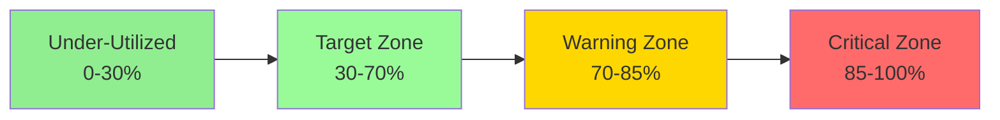
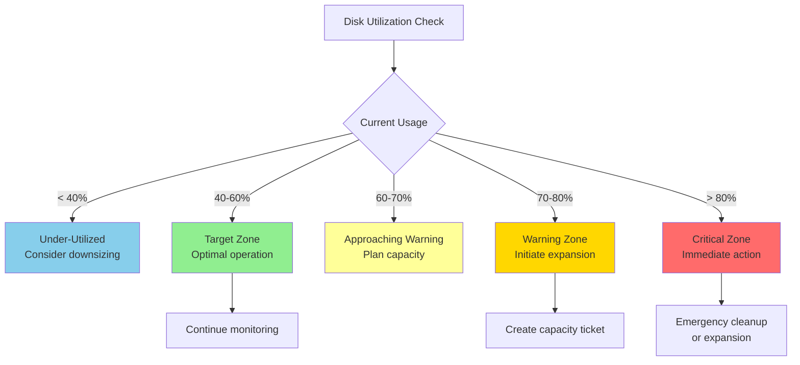
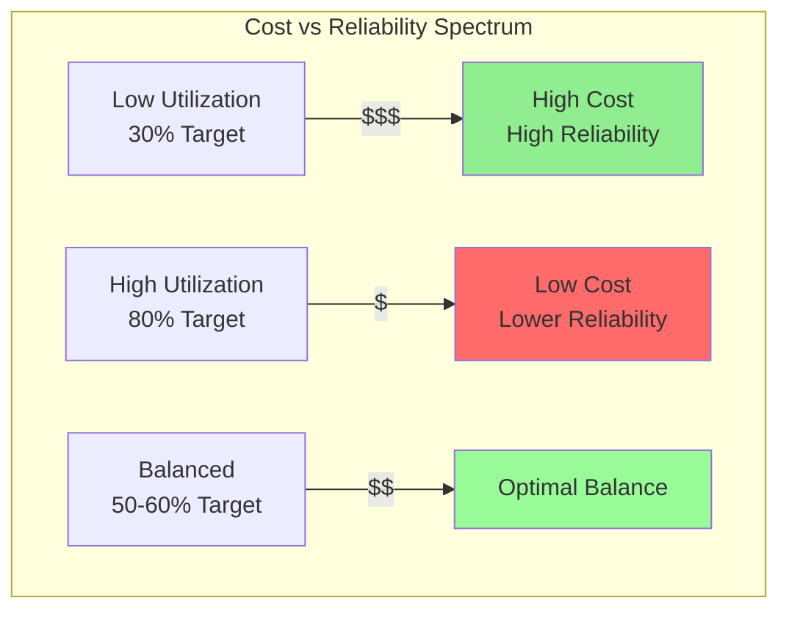
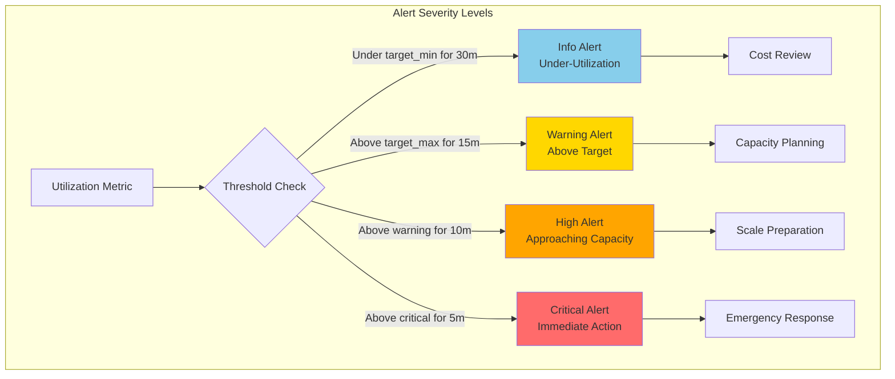
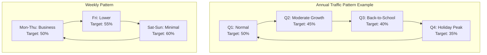
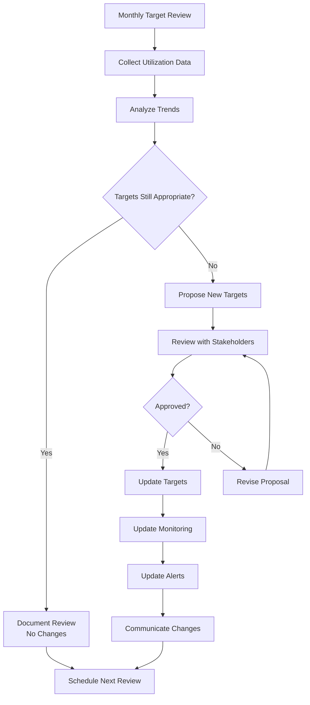

# How to Implement Utilization Targets

Author: [nawazdhandala](https://github.com/nawazdhandala)

Tags: Capacity Planning, Utilization, SRE, Infrastructure

Description: Learn how to set and monitor resource utilization targets for optimal efficiency.

---

Effective capacity planning requires more than just monitoring resource usage. It requires establishing clear utilization targets that balance efficiency with reliability. This guide will walk you through implementing utilization targets that help you optimize infrastructure costs while maintaining system performance.

## What Are Utilization Targets?

Utilization targets are predetermined thresholds that define the ideal operating range for your infrastructure resources. They serve as guardrails that help teams make informed decisions about scaling, alerting, and capacity planning.



## Target Utilization by Resource Type

Different resources have different optimal utilization ranges. Here is a comprehensive breakdown:

### CPU Utilization Targets

CPU resources can typically run at higher utilization levels, but you need headroom for traffic spikes.

| Environment | Target | Warning | Critical |
|-------------|--------|---------|----------|
| Production  | 40-60% | 70%     | 85%      |
| Staging     | 50-70% | 80%     | 90%      |
| Development | 60-80% | 85%     | 95%      |

```yaml
# Example: Prometheus alerting rules for CPU utilization
groups:
  - name: cpu_utilization_alerts
    rules:
      - alert: CPUUtilizationWarning
        expr: |
          100 - (avg by(instance) (rate(node_cpu_seconds_total{mode="idle"}[5m])) * 100) > 70
        for: 10m
        labels:
          severity: warning
        annotations:
          summary: "CPU utilization above target ({{ $labels.instance }})"
          description: "CPU utilization is {{ $value | printf \"%.1f\" }}%, exceeding 70% target"

      - alert: CPUUtilizationCritical
        expr: |
          100 - (avg by(instance) (rate(node_cpu_seconds_total{mode="idle"}[5m])) * 100) > 85
        for: 5m
        labels:
          severity: critical
        annotations:
          summary: "CPU utilization critical ({{ $labels.instance }})"
          description: "CPU utilization is {{ $value | printf \"%.1f\" }}%, exceeding 85% critical threshold"
```

### Memory Utilization Targets

Memory requires more conservative targets because running out of memory can cause application crashes or OOM kills.

| Environment | Target | Warning | Critical |
|-------------|--------|---------|----------|
| Production  | 50-65% | 75%     | 85%      |
| Staging     | 55-70% | 80%     | 90%      |
| Development | 60-75% | 85%     | 92%      |

```python
# Example: Python script for calculating memory utilization targets
import psutil
from dataclasses import dataclass
from typing import Dict

@dataclass
class UtilizationTarget:
    target_min: float
    target_max: float
    warning: float
    critical: float

class MemoryUtilizationMonitor:
    def __init__(self, environment: str = "production"):
        self.targets: Dict[str, UtilizationTarget] = {
            "production": UtilizationTarget(50, 65, 75, 85),
            "staging": UtilizationTarget(55, 70, 80, 90),
            "development": UtilizationTarget(60, 75, 85, 92),
        }
        self.environment = environment
        self.target = self.targets.get(environment, self.targets["production"])

    def get_current_utilization(self) -> float:
        """Get current memory utilization percentage."""
        memory = psutil.virtual_memory()
        return memory.percent

    def check_utilization(self) -> Dict[str, any]:
        """Check current utilization against targets."""
        current = self.get_current_utilization()

        status = "healthy"
        if current >= self.target.critical:
            status = "critical"
        elif current >= self.target.warning:
            status = "warning"
        elif current < self.target.target_min:
            status = "under-utilized"

        return {
            "current_utilization": current,
            "status": status,
            "target_range": f"{self.target.target_min}-{self.target.target_max}%",
            "headroom": self.target.critical - current,
            "recommendation": self._get_recommendation(current, status)
        }

    def _get_recommendation(self, current: float, status: str) -> str:
        """Generate recommendation based on utilization status."""
        if status == "critical":
            return "Immediate action required: Scale up or optimize memory usage"
        elif status == "warning":
            return "Consider scaling up or investigating memory consumers"
        elif status == "under-utilized":
            return "Consider rightsizing to reduce costs"
        return "Operating within target range"

# Usage
monitor = MemoryUtilizationMonitor("production")
result = monitor.check_utilization()
print(f"Memory Status: {result['status']}")
print(f"Current: {result['current_utilization']:.1f}%")
print(f"Recommendation: {result['recommendation']}")
```

### Disk Utilization Targets

Disk utilization requires the most conservative targets because disks cannot be quickly expanded and full disks can cause system failures.

| Environment | Target | Warning | Critical |
|-------------|--------|---------|----------|
| Production  | 40-60% | 70%     | 80%      |
| Staging     | 50-70% | 75%     | 85%      |
| Development | 60-75% | 80%     | 90%      |



## Balancing Efficiency and Reliability

Finding the right balance between resource efficiency and system reliability is crucial. Running too lean increases the risk of outages, while running too conservatively wastes money.

### The Cost-Reliability Tradeoff



### Calculating Your Optimal Target

Use this formula to determine your optimal utilization target based on your service level objectives:

```python
from dataclasses import dataclass
from typing import Tuple

@dataclass
class ServiceRequirements:
    availability_target: float  # e.g., 99.9
    peak_to_average_ratio: float  # e.g., 2.5
    scaling_time_minutes: int  # Time to scale up
    acceptable_degradation_minutes: int  # Max time at degraded performance

def calculate_optimal_target(requirements: ServiceRequirements) -> Tuple[float, float]:
    """
    Calculate optimal utilization target range based on service requirements.

    Returns:
        Tuple of (target_min, target_max) as percentages
    """
    # Base target starts at 50%
    base_target = 50.0

    # Adjust for availability requirements
    # Higher availability = lower target
    availability_adjustment = (requirements.availability_target - 99.0) * 10

    # Adjust for peak-to-average ratio
    # Higher ratio = lower target to handle spikes
    peak_adjustment = (requirements.peak_to_average_ratio - 1) * 10

    # Adjust for scaling time
    # Longer scaling time = lower target for headroom
    scaling_adjustment = requirements.scaling_time_minutes / 2

    # Calculate target max
    target_max = base_target - availability_adjustment - peak_adjustment - scaling_adjustment

    # Target min is typically 20% below max
    target_min = max(20, target_max - 20)

    # Ensure reasonable bounds
    target_max = max(30, min(70, target_max))
    target_min = max(20, min(target_max - 10, target_min))

    return (target_min, target_max)

# Example calculation
requirements = ServiceRequirements(
    availability_target=99.9,
    peak_to_average_ratio=2.0,
    scaling_time_minutes=5,
    acceptable_degradation_minutes=2
)

target_min, target_max = calculate_optimal_target(requirements)
print(f"Recommended utilization target: {target_min:.0f}% - {target_max:.0f}%")
# Output: Recommended utilization target: 27% - 47%
```

## Utilization Monitoring

Effective monitoring is essential for maintaining utilization within target ranges. Here is a comprehensive monitoring setup:

### Setting Up Comprehensive Monitoring

```yaml
# Kubernetes ConfigMap for utilization monitoring configuration
apiVersion: v1
kind: ConfigMap
metadata:
  name: utilization-monitoring-config
  namespace: monitoring
data:
  config.yaml: |
    monitoring:
      scrape_interval: 30s
      evaluation_interval: 30s

    resources:
      cpu:
        target_min: 40
        target_max: 60
        warning: 70
        critical: 85

      memory:
        target_min: 50
        target_max: 65
        warning: 75
        critical: 85

      disk:
        target_min: 40
        target_max: 60
        warning: 70
        critical: 80

      network:
        target_min: 20
        target_max: 50
        warning: 70
        critical: 85

    aggregation:
      windows:
        - 5m
        - 1h
        - 24h
        - 7d
```

### Building a Utilization Dashboard

```python
# Example: Generating Grafana dashboard JSON for utilization monitoring
import json
from typing import Dict, List

def create_utilization_panel(
    title: str,
    metric: str,
    target_min: float,
    target_max: float,
    warning: float,
    critical: float,
    grid_pos: Dict[str, int]
) -> Dict:
    """Create a Grafana panel for utilization monitoring."""
    return {
        "title": title,
        "type": "timeseries",
        "gridPos": grid_pos,
        "targets": [
            {
                "expr": metric,
                "legendFormat": "{{instance}}",
                "refId": "A"
            }
        ],
        "fieldConfig": {
            "defaults": {
                "thresholds": {
                    "mode": "absolute",
                    "steps": [
                        {"color": "blue", "value": None},
                        {"color": "green", "value": target_min},
                        {"color": "yellow", "value": target_max},
                        {"color": "orange", "value": warning},
                        {"color": "red", "value": critical}
                    ]
                },
                "min": 0,
                "max": 100,
                "unit": "percent"
            }
        },
        "options": {
            "legend": {"displayMode": "table"},
            "tooltip": {"mode": "multi"}
        }
    }

def generate_utilization_dashboard() -> Dict:
    """Generate a complete utilization monitoring dashboard."""
    panels = [
        create_utilization_panel(
            title="CPU Utilization",
            metric='100 - (avg by(instance) (rate(node_cpu_seconds_total{mode="idle"}[5m])) * 100)',
            target_min=40, target_max=60, warning=70, critical=85,
            grid_pos={"x": 0, "y": 0, "w": 12, "h": 8}
        ),
        create_utilization_panel(
            title="Memory Utilization",
            metric='(1 - (node_memory_MemAvailable_bytes / node_memory_MemTotal_bytes)) * 100',
            target_min=50, target_max=65, warning=75, critical=85,
            grid_pos={"x": 12, "y": 0, "w": 12, "h": 8}
        ),
        create_utilization_panel(
            title="Disk Utilization",
            metric='100 - ((node_filesystem_avail_bytes / node_filesystem_size_bytes) * 100)',
            target_min=40, target_max=60, warning=70, critical=80,
            grid_pos={"x": 0, "y": 8, "w": 12, "h": 8}
        ),
        create_utilization_panel(
            title="Network Utilization",
            metric='rate(node_network_transmit_bytes_total[5m]) / 1e9 * 100',
            target_min=20, target_max=50, warning=70, critical=85,
            grid_pos={"x": 12, "y": 8, "w": 12, "h": 8}
        )
    ]

    return {
        "title": "Resource Utilization Targets",
        "uid": "utilization-targets",
        "panels": panels,
        "refresh": "30s",
        "time": {"from": "now-6h", "to": "now"}
    }

# Generate and save dashboard
dashboard = generate_utilization_dashboard()
print(json.dumps(dashboard, indent=2))
```

## Alert Thresholds for Utilization

Properly configured alerts are critical for maintaining utilization within targets. Here is a tiered alerting strategy:



### Implementing Alert Rules

```yaml
# Comprehensive Prometheus alerting rules for utilization targets
groups:
  - name: utilization_targets
    interval: 30s
    rules:
      # Under-utilization alerts (cost optimization)
      - alert: ResourceUnderUtilized
        expr: |
          (
            # CPU under-utilized
            (100 - avg by(instance) (rate(node_cpu_seconds_total{mode="idle"}[1h])) * 100) < 30
            or
            # Memory under-utilized
            ((1 - (node_memory_MemAvailable_bytes / node_memory_MemTotal_bytes)) * 100) < 40
          )
        for: 30m
        labels:
          severity: info
          category: cost_optimization
        annotations:
          summary: "Resource under-utilized on {{ $labels.instance }}"
          description: "Current utilization {{ $value | printf \"%.1f\" }}% is below target minimum. Consider rightsizing."
          runbook_url: "https://runbooks.example.com/under-utilization"

      # Above target alerts (capacity planning)
      - alert: UtilizationAboveTarget
        expr: |
          (
            (100 - avg by(instance) (rate(node_cpu_seconds_total{mode="idle"}[15m])) * 100) > 60
            and
            (100 - avg by(instance) (rate(node_cpu_seconds_total{mode="idle"}[15m])) * 100) < 70
          )
        for: 15m
        labels:
          severity: warning
          category: capacity_planning
        annotations:
          summary: "CPU utilization above target on {{ $labels.instance }}"
          description: "CPU at {{ $value | printf \"%.1f\" }}% exceeds 60% target. Review capacity plan."

      # Warning threshold alerts
      - alert: UtilizationWarning
        expr: |
          (
            (100 - avg by(instance) (rate(node_cpu_seconds_total{mode="idle"}[10m])) * 100) > 70
            or
            ((1 - (node_memory_MemAvailable_bytes / node_memory_MemTotal_bytes)) * 100) > 75
            or
            (100 - ((node_filesystem_avail_bytes{mountpoint="/"} / node_filesystem_size_bytes{mountpoint="/"}) * 100)) > 70
          )
        for: 10m
        labels:
          severity: warning
          category: capacity
        annotations:
          summary: "Resource utilization warning on {{ $labels.instance }}"
          description: "Utilization at {{ $value | printf \"%.1f\" }}% - approaching capacity limits"

      # Critical threshold alerts
      - alert: UtilizationCritical
        expr: |
          (
            (100 - avg by(instance) (rate(node_cpu_seconds_total{mode="idle"}[5m])) * 100) > 85
            or
            ((1 - (node_memory_MemAvailable_bytes / node_memory_MemTotal_bytes)) * 100) > 85
            or
            (100 - ((node_filesystem_avail_bytes{mountpoint="/"} / node_filesystem_size_bytes{mountpoint="/"}) * 100)) > 80
          )
        for: 5m
        labels:
          severity: critical
          category: capacity
        annotations:
          summary: "Critical resource utilization on {{ $labels.instance }}"
          description: "Utilization at {{ $value | printf \"%.1f\" }}% - immediate action required"
          runbook_url: "https://runbooks.example.com/critical-utilization"
```

## Seasonal Adjustments

Utilization targets should not be static. They need to adapt to known patterns and seasonal variations in your traffic.

### Understanding Traffic Patterns



### Implementing Dynamic Targets

```python
from datetime import datetime, date
from enum import Enum
from typing import Dict, Tuple
import calendar

class Season(Enum):
    NORMAL = "normal"
    HIGH = "high"
    PEAK = "peak"
    LOW = "low"

class DynamicUtilizationTarget:
    """
    Manages dynamic utilization targets based on time patterns.
    """

    def __init__(self, base_target: Tuple[float, float] = (50, 60)):
        self.base_min, self.base_max = base_target

        # Define seasonal adjustments (percentage points to subtract from base)
        self.seasonal_adjustments: Dict[Season, float] = {
            Season.NORMAL: 0,
            Season.HIGH: 5,
            Season.PEAK: 15,
            Season.LOW: -10  # Can run higher during low periods
        }

        # Define monthly seasons (customize for your business)
        self.monthly_seasons: Dict[int, Season] = {
            1: Season.LOW,      # January - post-holiday
            2: Season.NORMAL,
            3: Season.NORMAL,
            4: Season.NORMAL,
            5: Season.NORMAL,
            6: Season.HIGH,     # Summer begins
            7: Season.HIGH,
            8: Season.HIGH,     # Back-to-school
            9: Season.HIGH,
            10: Season.HIGH,
            11: Season.PEAK,    # Black Friday prep
            12: Season.PEAK,    # Holiday peak
        }

        # Day-of-week adjustments (Monday = 0)
        self.dow_adjustments: Dict[int, float] = {
            0: 0,   # Monday
            1: 0,   # Tuesday
            2: 0,   # Wednesday
            3: 0,   # Thursday
            4: 2,   # Friday - slightly lower traffic
            5: 5,   # Saturday - can run higher
            6: 5,   # Sunday - can run higher
        }

        # Hour-of-day adjustments (24-hour format)
        self.hour_adjustments: Dict[int, float] = {
            **{h: 5 for h in range(0, 6)},   # Night - can run higher
            **{h: 0 for h in range(6, 9)},   # Morning ramp
            **{h: -5 for h in range(9, 17)}, # Business hours - lower target
            **{h: 0 for h in range(17, 21)}, # Evening
            **{h: 5 for h in range(21, 24)}, # Late night
        }

    def get_current_target(self, dt: datetime = None) -> Dict[str, any]:
        """
        Calculate the current utilization target based on date and time.
        """
        if dt is None:
            dt = datetime.now()

        # Get seasonal adjustment
        season = self.monthly_seasons[dt.month]
        seasonal_adj = self.seasonal_adjustments[season]

        # Get day-of-week adjustment
        dow_adj = self.dow_adjustments[dt.weekday()]

        # Get hour adjustment
        hour_adj = self.hour_adjustments[dt.hour]

        # Calculate total adjustment
        total_adj = seasonal_adj + (dow_adj * 0.5) + (hour_adj * 0.3)

        # Apply adjustment (subtract from base for more headroom)
        adjusted_min = max(20, self.base_min - total_adj)
        adjusted_max = max(30, self.base_max - total_adj)

        return {
            "target_min": round(adjusted_min, 1),
            "target_max": round(adjusted_max, 1),
            "warning": round(adjusted_max + 10, 1),
            "critical": round(adjusted_max + 25, 1),
            "season": season.value,
            "adjustments": {
                "seasonal": seasonal_adj,
                "day_of_week": dow_adj,
                "hour": hour_adj,
                "total": total_adj
            }
        }

    def get_forecast(self, days_ahead: int = 30) -> list:
        """
        Generate a forecast of targets for the coming period.
        """
        forecasts = []
        current = datetime.now()

        for day in range(days_ahead):
            forecast_date = current.replace(hour=12) + timedelta(days=day)
            target = self.get_current_target(forecast_date)
            forecasts.append({
                "date": forecast_date.strftime("%Y-%m-%d"),
                "target_range": f"{target['target_min']}-{target['target_max']}%",
                "season": target['season']
            })

        return forecasts

# Usage example
from datetime import timedelta

targets = DynamicUtilizationTarget(base_target=(50, 60))

# Get current target
current = targets.get_current_target()
print(f"Current target: {current['target_min']}-{current['target_max']}%")
print(f"Season: {current['season']}")

# Get holiday season target (December)
holiday = targets.get_current_target(datetime(2026, 12, 15, 14, 0))
print(f"\nHoliday target: {holiday['target_min']}-{holiday['target_max']}%")
print(f"Adjustments: {holiday['adjustments']}")
```

### Seasonal Adjustment Configuration

```yaml
# Example: Seasonal adjustment configuration
apiVersion: v1
kind: ConfigMap
metadata:
  name: seasonal-utilization-config
  namespace: capacity-planning
data:
  seasonal-targets.yaml: |
    base_targets:
      cpu:
        min: 50
        max: 60
      memory:
        min: 55
        max: 65
      disk:
        min: 45
        max: 55

    seasons:
      normal:
        months: [2, 3, 4, 5]
        adjustment: 0

      high:
        months: [6, 7, 8, 9, 10]
        adjustment: -5

      peak:
        months: [11, 12]
        adjustment: -15

      low:
        months: [1]
        adjustment: 10

    special_events:
      - name: "Black Friday"
        date: "2026-11-27"
        duration_days: 4
        adjustment: -20

      - name: "Cyber Monday"
        date: "2026-11-30"
        duration_days: 1
        adjustment: -25

      - name: "Holiday Peak"
        start_date: "2026-12-15"
        end_date: "2026-12-31"
        adjustment: -20
```

## Target Review Process

Utilization targets should be reviewed and updated regularly. Here is a structured review process:



### Review Checklist Implementation

```python
from dataclasses import dataclass, field
from datetime import datetime, timedelta
from typing import List, Dict, Optional
from enum import Enum

class ReviewStatus(Enum):
    PENDING = "pending"
    IN_PROGRESS = "in_progress"
    APPROVED = "approved"
    REJECTED = "rejected"

@dataclass
class TargetReviewItem:
    """Individual item in the target review checklist."""
    name: str
    description: str
    completed: bool = False
    findings: Optional[str] = None
    completed_at: Optional[datetime] = None
    completed_by: Optional[str] = None

@dataclass
class TargetReview:
    """
    Structured review process for utilization targets.
    """
    review_date: datetime
    review_period_start: datetime
    review_period_end: datetime
    reviewer: str
    status: ReviewStatus = ReviewStatus.PENDING
    checklist: List[TargetReviewItem] = field(default_factory=list)
    proposed_changes: Dict[str, Dict] = field(default_factory=dict)

    def __post_init__(self):
        if not self.checklist:
            self.checklist = self._create_default_checklist()

    def _create_default_checklist(self) -> List[TargetReviewItem]:
        """Create the standard review checklist."""
        return [
            TargetReviewItem(
                name="utilization_analysis",
                description="Analyze average, p50, p95, and p99 utilization over review period"
            ),
            TargetReviewItem(
                name="breach_analysis",
                description="Review all target breaches and their causes"
            ),
            TargetReviewItem(
                name="incident_correlation",
                description="Correlate utilization metrics with any incidents"
            ),
            TargetReviewItem(
                name="cost_analysis",
                description="Review infrastructure costs vs utilization efficiency"
            ),
            TargetReviewItem(
                name="capacity_forecast",
                description="Review capacity forecast for next period"
            ),
            TargetReviewItem(
                name="seasonal_adjustment",
                description="Verify seasonal adjustments are appropriate"
            ),
            TargetReviewItem(
                name="alert_effectiveness",
                description="Review alert accuracy and noise levels"
            ),
            TargetReviewItem(
                name="stakeholder_feedback",
                description="Gather feedback from operations and development teams"
            )
        ]

    def complete_item(self, item_name: str, findings: str, completed_by: str) -> bool:
        """Mark a checklist item as complete."""
        for item in self.checklist:
            if item.name == item_name:
                item.completed = True
                item.findings = findings
                item.completed_at = datetime.now()
                item.completed_by = completed_by
                return True
        return False

    def propose_change(self, resource: str, current: Dict, proposed: Dict, rationale: str):
        """Propose a target change."""
        self.proposed_changes[resource] = {
            "current": current,
            "proposed": proposed,
            "rationale": rationale,
            "proposed_at": datetime.now().isoformat()
        }

    def get_completion_status(self) -> Dict:
        """Get the completion status of the review."""
        completed = sum(1 for item in self.checklist if item.completed)
        total = len(self.checklist)

        return {
            "completed": completed,
            "total": total,
            "percentage": round((completed / total) * 100, 1),
            "pending_items": [item.name for item in self.checklist if not item.completed]
        }

    def generate_report(self) -> str:
        """Generate a review report."""
        status = self.get_completion_status()

        report = f"""
# Utilization Target Review Report

**Review Date:** {self.review_date.strftime('%Y-%m-%d')}
**Review Period:** {self.review_period_start.strftime('%Y-%m-%d')} to {self.review_period_end.strftime('%Y-%m-%d')}
**Reviewer:** {self.reviewer}
**Status:** {self.status.value}

## Checklist Completion: {status['percentage']}%

### Completed Items:
"""
        for item in self.checklist:
            if item.completed:
                report += f"\n- [x] **{item.name}**: {item.findings}"

        report += "\n\n### Pending Items:"
        for item in self.checklist:
            if not item.completed:
                report += f"\n- [ ] **{item.name}**: {item.description}"

        if self.proposed_changes:
            report += "\n\n## Proposed Changes:\n"
            for resource, change in self.proposed_changes.items():
                report += f"""
### {resource.upper()}
- **Current:** {change['current']}
- **Proposed:** {change['proposed']}
- **Rationale:** {change['rationale']}
"""

        return report

# Usage example
review = TargetReview(
    review_date=datetime.now(),
    review_period_start=datetime.now() - timedelta(days=30),
    review_period_end=datetime.now(),
    reviewer="sre-team"
)

# Complete some checklist items
review.complete_item(
    "utilization_analysis",
    "Average CPU at 52%, p95 at 68%, p99 at 75%. Within targets.",
    "jane.doe"
)

review.complete_item(
    "breach_analysis",
    "3 warning breaches, 0 critical. All during expected peak times.",
    "jane.doe"
)

# Propose a change
review.propose_change(
    resource="cpu",
    current={"target_min": 40, "target_max": 60, "warning": 70, "critical": 85},
    proposed={"target_min": 45, "target_max": 65, "warning": 75, "critical": 85},
    rationale="Consistent operation at lower end of target suggests we can safely increase targets"
)

# Generate report
print(review.generate_report())
```

## Summary

Implementing effective utilization targets requires a systematic approach that includes:

1. **Resource-specific targets**: Different resources require different utilization thresholds based on their characteristics and failure modes.

2. **Balance efficiency and reliability**: Use formulas and data to find the optimal balance for your specific service requirements.

3. **Comprehensive monitoring**: Implement multi-layered monitoring with dashboards that clearly show utilization against targets.

4. **Tiered alerting**: Create alerts at multiple severity levels to enable proactive capacity management.

5. **Seasonal adjustments**: Adapt targets dynamically based on known traffic patterns and business cycles.

6. **Regular reviews**: Establish a formal review process to ensure targets remain appropriate as your systems evolve.

By following these practices, you can optimize your infrastructure costs while maintaining the reliability your users expect. Remember that utilization targets are not set-and-forget metrics. They require ongoing attention and refinement as your system and business needs change.
