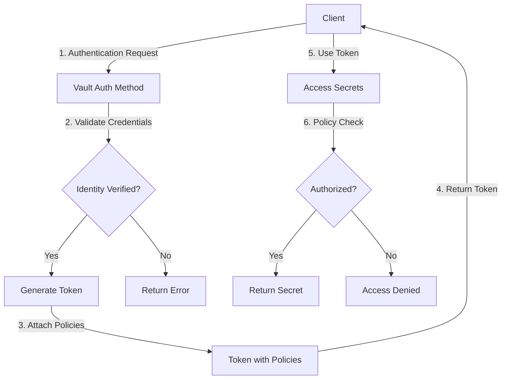
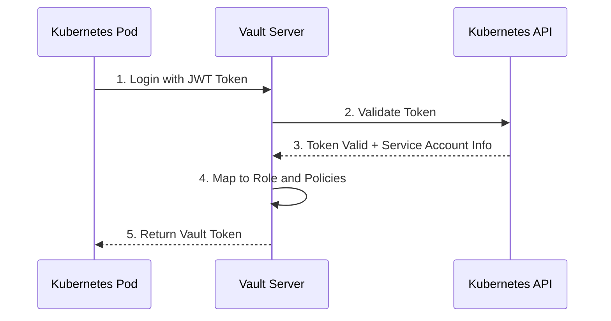
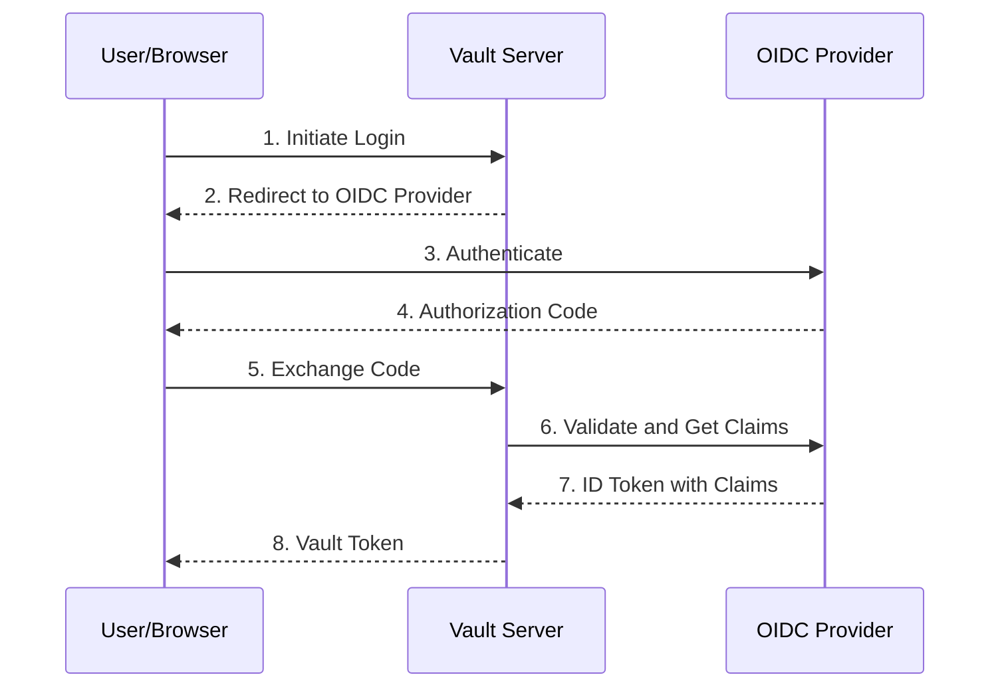
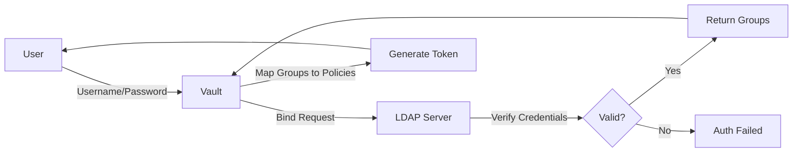
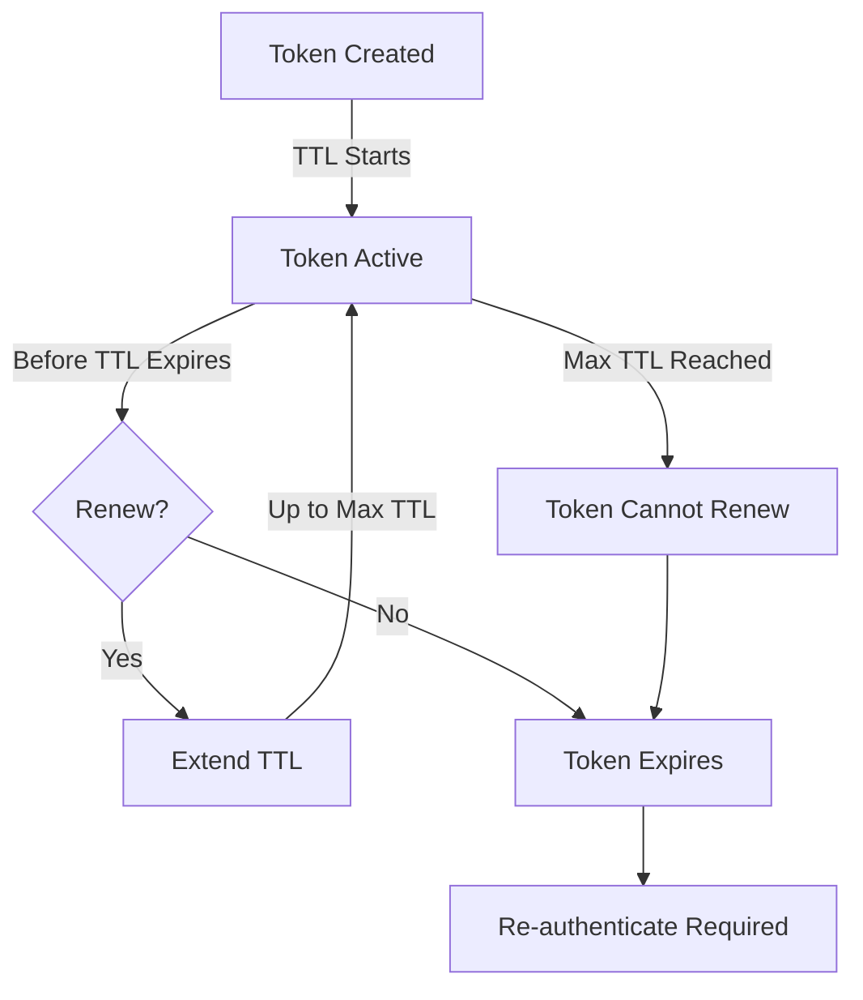

# How to Implement Vault Auth Method Configuration

Author: [nawazdhandala](https://github.com/nawazdhandala)

Tags: Vault, Security, Authentication, Configuration

Description: A comprehensive guide to configuring HashiCorp Vault authentication methods for secure identity verification and access control.

---

HashiCorp Vault is a powerful secrets management tool that provides a unified interface to manage sensitive data. One of its core features is the flexible authentication system that allows you to configure multiple auth methods to verify client identities. In this post, we will explore how to configure various auth methods in Vault, including mounting, role configuration, policy mapping, and TTL settings.

## Understanding Vault Authentication Flow

Before diving into configuration, let us understand how authentication works in Vault:



## Auth Method Mounting and Configuration

Every auth method in Vault must be enabled (mounted) before it can be used. Auth methods are mounted at a specific path and can be configured with various options.

### Basic Auth Method Mounting

```bash
# Enable an auth method at the default path
vault auth enable kubernetes

# Enable an auth method at a custom path
vault auth enable -path=k8s-prod kubernetes

# List all enabled auth methods
vault auth list

# View detailed information about an auth method
vault auth list -detailed
```

### Tuning Auth Method Configuration

After mounting, you can tune the auth method with specific parameters:

```bash
# Tune auth method settings
vault auth tune \
    -default-lease-ttl=1h \
    -max-lease-ttl=24h \
    -description="Production Kubernetes Auth" \
    kubernetes/
```

## Common Auth Methods

### 1. Kubernetes Authentication

The Kubernetes auth method allows pods to authenticate with Vault using their service account tokens.



#### Configuration Steps

```bash
# Step 1: Enable the Kubernetes auth method
vault auth enable kubernetes

# Step 2: Configure the Kubernetes auth method
# Get the Kubernetes host from within the cluster
KUBERNETES_HOST="https://kubernetes.default.svc"

# Get the CA certificate (from a pod or configmap)
KUBERNETES_CA_CERT=$(cat /var/run/secrets/kubernetes.io/serviceaccount/ca.crt)

# Configure the auth method
vault write auth/kubernetes/config \
    kubernetes_host="$KUBERNETES_HOST" \
    kubernetes_ca_cert="$KUBERNETES_CA_CERT" \
    issuer="https://kubernetes.default.svc.cluster.local"
```

#### Creating Kubernetes Roles

```bash
# Create a role for a specific application
vault write auth/kubernetes/role/webapp \
    bound_service_account_names=webapp-sa \
    bound_service_account_namespaces=production \
    policies=webapp-policy \
    ttl=1h \
    max_ttl=4h

# Create a role with multiple service accounts and namespaces
vault write auth/kubernetes/role/monitoring \
    bound_service_account_names=prometheus-sa,grafana-sa \
    bound_service_account_namespaces=monitoring,observability \
    policies=monitoring-read \
    ttl=2h
```

#### Authenticating from a Pod

```bash
# Login using the pod service account token
JWT=$(cat /var/run/secrets/kubernetes.io/serviceaccount/token)

vault write auth/kubernetes/login \
    role=webapp \
    jwt=$JWT
```

### 2. OIDC Authentication

OIDC (OpenID Connect) auth method allows users to authenticate using an external identity provider like Okta, Azure AD, or Google.



#### Configuration Steps

```bash
# Step 1: Enable the OIDC auth method
vault auth enable oidc

# Step 2: Configure the OIDC auth method
vault write auth/oidc/config \
    oidc_discovery_url="https://login.microsoftonline.com/YOUR_TENANT_ID/v2.0" \
    oidc_client_id="YOUR_CLIENT_ID" \
    oidc_client_secret="YOUR_CLIENT_SECRET" \
    default_role="default"

# Step 3: Create a role with claim mappings
vault write auth/oidc/role/default \
    bound_audiences="YOUR_CLIENT_ID" \
    allowed_redirect_uris="http://localhost:8250/oidc/callback" \
    allowed_redirect_uris="https://vault.example.com/ui/vault/auth/oidc/oidc/callback" \
    user_claim="email" \
    groups_claim="groups" \
    policies="default" \
    ttl=1h
```

#### Role Configuration with Group Mapping

```bash
# Create a role that maps OIDC groups to Vault policies
vault write auth/oidc/role/engineering \
    bound_audiences="YOUR_CLIENT_ID" \
    allowed_redirect_uris="https://vault.example.com/ui/vault/auth/oidc/oidc/callback" \
    user_claim="email" \
    groups_claim="groups" \
    bound_claims='{"groups": ["engineering-team"]}' \
    claim_mappings='{"email": "user_email", "groups": "user_groups"}' \
    policies="engineering-policy" \
    ttl=8h \
    max_ttl=24h
```

### 3. LDAP Authentication

LDAP auth method allows authentication against an LDAP directory service such as Active Directory.



#### Configuration Steps

```bash
# Step 1: Enable the LDAP auth method
vault auth enable ldap

# Step 2: Configure the LDAP connection
vault write auth/ldap/config \
    url="ldaps://ldap.example.com:636" \
    userdn="ou=Users,dc=example,dc=com" \
    userattr="sAMAccountName" \
    groupdn="ou=Groups,dc=example,dc=com" \
    groupfilter="(&(objectClass=group)(member:1.2.840.113556.1.4.1941:={{.UserDN}}))" \
    groupattr="cn" \
    binddn="cn=vault-bind,ou=ServiceAccounts,dc=example,dc=com" \
    bindpass="BIND_PASSWORD" \
    insecure_tls=false \
    starttls=true \
    certificate=@/path/to/ldap-ca.crt
```

#### Group and User Mappings

```bash
# Map LDAP groups to Vault policies
vault write auth/ldap/groups/devops \
    policies="devops-policy,common-policy"

vault write auth/ldap/groups/developers \
    policies="dev-policy,common-policy"

# Map specific users to additional policies
vault write auth/ldap/users/admin-user \
    policies="admin-policy" \
    groups="devops,developers"
```

## Role Configuration and Policy Mapping

Roles define how identities are mapped to policies. Here is a comprehensive example:

### Creating Policies

```hcl
# File: webapp-policy.hcl
# Policy for web application secrets access

# Allow reading database credentials
path "database/creds/webapp-role" {
  capabilities = ["read"]
}

# Allow reading KV secrets for the webapp
path "secret/data/webapp/*" {
  capabilities = ["read", "list"]
}

# Allow the app to renew its own token
path "auth/token/renew-self" {
  capabilities = ["update"]
}

# Allow looking up its own token info
path "auth/token/lookup-self" {
  capabilities = ["read"]
}
```

```bash
# Write the policy to Vault
vault policy write webapp-policy webapp-policy.hcl

# List all policies
vault policy list

# Read a specific policy
vault policy read webapp-policy
```

### Role Configuration Best Practices

```bash
# Create a role with explicit token settings
vault write auth/kubernetes/role/secure-app \
    bound_service_account_names=secure-app-sa \
    bound_service_account_namespaces=secure-ns \
    policies=secure-app-policy \
    token_ttl=30m \
    token_max_ttl=1h \
    token_policies=secure-app-policy \
    token_bound_cidrs="10.0.0.0/8" \
    token_explicit_max_ttl=2h \
    token_no_default_policy=false \
    token_num_uses=0 \
    token_period=0 \
    token_type=default
```

## TTL and Renewal Settings

Token Time-To-Live (TTL) and renewal settings are crucial for security. Here is how they work:



### TTL Configuration Options

```bash
# Auth method level TTL settings
vault auth tune \
    -default-lease-ttl=1h \
    -max-lease-ttl=24h \
    kubernetes/

# Role level TTL settings (override auth method defaults)
vault write auth/kubernetes/role/short-lived-app \
    bound_service_account_names=batch-job-sa \
    bound_service_account_namespaces=batch \
    policies=batch-policy \
    token_ttl=5m \
    token_max_ttl=15m \
    token_explicit_max_ttl=30m
```

### Token Renewal Example

```bash
# Renew the current token
vault token renew

# Renew with a specific increment
vault token renew -increment=30m

# Programmatic renewal in a script
#!/bin/bash
# Token renewal script for long-running applications

VAULT_TOKEN_FILE="/var/run/secrets/vault/token"
RENEWAL_INTERVAL=1800  # 30 minutes in seconds

while true; do
    # Attempt to renew the token
    if vault token renew > /dev/null 2>&1; then
        echo "Token renewed successfully"
    else
        echo "Token renewal failed, re-authenticating"
        # Re-authenticate using the appropriate method
        NEW_TOKEN=$(vault write -field=token auth/kubernetes/login \
            role=webapp \
            jwt=$(cat /var/run/secrets/kubernetes.io/serviceaccount/token))
        echo "$NEW_TOKEN" > "$VAULT_TOKEN_FILE"
    fi
    sleep $RENEWAL_INTERVAL
done
```

## Complete Configuration Example

Here is a complete example that ties everything together:

```bash
#!/bin/bash
# Complete Vault auth method configuration script

set -e

VAULT_ADDR="https://vault.example.com:8200"
export VAULT_ADDR

# Authenticate as admin
vault login -method=userpass username=admin

echo "Configuring Kubernetes auth method..."

# Enable and configure Kubernetes auth
vault auth enable -path=k8s kubernetes || true

vault write auth/k8s/config \
    kubernetes_host="https://kubernetes.default.svc:443" \
    kubernetes_ca_cert=@/var/run/secrets/kubernetes.io/serviceaccount/ca.crt

# Create policies
echo "Creating policies..."

vault policy write webapp - <<EOF
path "secret/data/webapp/*" {
  capabilities = ["read", "list"]
}
path "database/creds/webapp" {
  capabilities = ["read"]
}
path "auth/token/renew-self" {
  capabilities = ["update"]
}
EOF

vault policy write monitoring - <<EOF
path "secret/data/monitoring/*" {
  capabilities = ["read"]
}
path "sys/metrics" {
  capabilities = ["read"]
}
EOF

# Create roles
echo "Creating roles..."

vault write auth/k8s/role/webapp \
    bound_service_account_names=webapp-sa \
    bound_service_account_namespaces=production,staging \
    policies=webapp \
    token_ttl=1h \
    token_max_ttl=4h

vault write auth/k8s/role/monitoring \
    bound_service_account_names=prometheus-sa \
    bound_service_account_namespaces=monitoring \
    policies=monitoring \
    token_ttl=30m \
    token_max_ttl=2h

echo "Configuration complete!"

# Verify configuration
echo "Verifying configuration..."
vault auth list
vault policy list
vault read auth/k8s/role/webapp
vault read auth/k8s/role/monitoring
```

## Troubleshooting Common Issues

### 1. Authentication Failures

```bash
# Check auth method configuration
vault read auth/kubernetes/config

# Verify role exists and is configured correctly
vault read auth/kubernetes/role/YOUR_ROLE

# Test authentication manually
vault write auth/kubernetes/login \
    role=YOUR_ROLE \
    jwt=$(cat /var/run/secrets/kubernetes.io/serviceaccount/token)
```

### 2. Policy Permission Errors

```bash
# Check token policies
vault token lookup

# Verify policy allows the operation
vault policy read YOUR_POLICY

# Test with capability check
vault token capabilities secret/data/your/path
```

### 3. TTL and Renewal Issues

```bash
# Check token TTL information
vault token lookup -format=json | jq '.data | {ttl, expire_time, renewable}'

# Check auth method TTL settings
vault read sys/auth/kubernetes/tune
```

## Security Best Practices

1. **Use short TTLs**: Configure the shortest TTL that works for your use case. This limits the window of opportunity if a token is compromised.

2. **Enable audit logging**: Always enable audit logging to track authentication attempts and secret access.

```bash
vault audit enable file file_path=/var/log/vault/audit.log
```

3. **Use bound claims**: When using OIDC or JWT auth methods, always use bound claims to restrict which tokens can authenticate.

4. **Implement periodic tokens**: For long-running applications, use periodic tokens instead of very long max TTLs.

```bash
vault write auth/kubernetes/role/long-running-app \
    bound_service_account_names=app-sa \
    bound_service_account_namespaces=production \
    policies=app-policy \
    token_period=1h
```

5. **Restrict token CIDRs**: When possible, restrict tokens to specific IP ranges.

```bash
vault write auth/kubernetes/role/restricted-app \
    bound_service_account_names=app-sa \
    bound_service_account_namespaces=production \
    policies=app-policy \
    token_bound_cidrs="10.0.0.0/8,192.168.0.0/16"
```

## Conclusion

Configuring Vault auth methods properly is essential for maintaining a secure secrets management infrastructure. By understanding the authentication flow, choosing the appropriate auth method for your environment, and following security best practices, you can build a robust authentication system that protects your sensitive data while providing seamless access for authorized applications and users.

Remember to regularly audit your auth method configurations, rotate credentials, and keep your Vault installation up to date to maintain a strong security posture.
