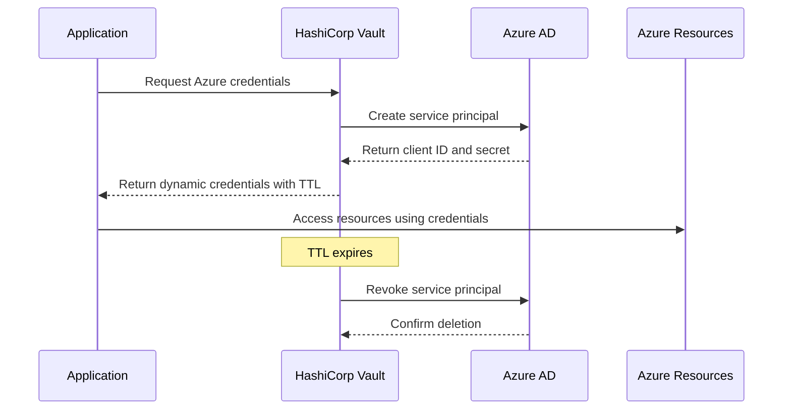
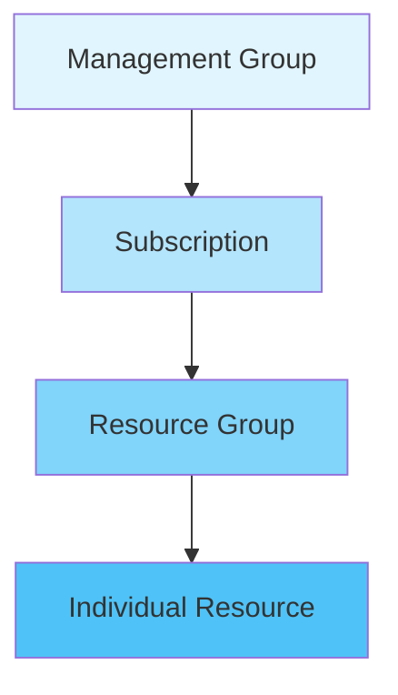
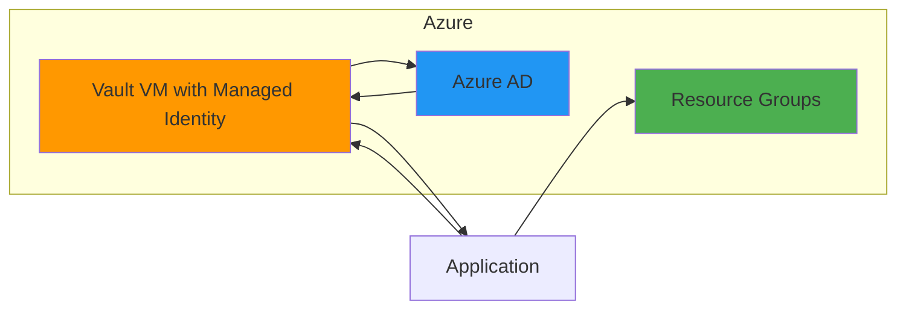
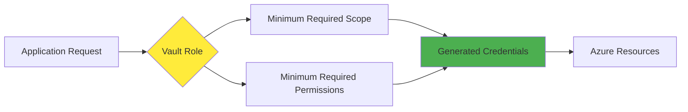

# How to Implement Vault Azure Credentials

Author: [nawazdhandala](https://github.com/nawazdhandala)

Tags: Vault, Security, Azure, DynamicSecrets

Description: Learn how to configure HashiCorp Vault's Azure secrets engine to generate dynamic service principal credentials for secure, time-limited Azure access.

---

## Introduction

Managing Azure credentials securely is a challenge that many organizations face. Static credentials pose significant security risks because they can be leaked, shared, or forgotten. HashiCorp Vault's Azure secrets engine solves this problem by generating dynamic, short-lived credentials on demand.

In this guide, we will walk through configuring Vault to dynamically generate Azure service principal credentials, set up role assignments, and integrate with managed identities.

## How Vault Azure Credentials Work

Before diving into the configuration, let us understand the credential generation flow:



## Prerequisites

Before you begin, ensure you have the following:

- HashiCorp Vault installed and initialized
- Azure subscription with appropriate permissions
- Azure CLI installed and authenticated
- An Azure AD application with sufficient privileges to create service principals

## Step 1: Enable the Azure Secrets Engine

First, enable the Azure secrets engine in Vault:

```bash
# Enable the Azure secrets engine at the default path
vault secrets enable azure

# Alternatively, enable at a custom path
vault secrets enable -path=azure-prod azure
```

## Step 2: Configure the Azure Secrets Engine

Configure the secrets engine with your Azure credentials. You need an existing service principal that Vault will use to create and manage other service principals.

```bash
# Configure the Azure secrets engine with service principal credentials
vault write azure/config \
    subscription_id="your-subscription-id" \
    tenant_id="your-tenant-id" \
    client_id="your-client-id" \
    client_secret="your-client-secret"
```

Here is a breakdown of each parameter:

| Parameter | Description |
|-----------|-------------|
| `subscription_id` | Your Azure subscription ID |
| `tenant_id` | Your Azure Active Directory tenant ID |
| `client_id` | The application (client) ID of your Vault service principal |
| `client_secret` | The client secret for the Vault service principal |

## Step 3: Create Azure Roles in Vault

Vault roles define what permissions the generated credentials will have. You can assign Azure RBAC roles or Azure AD roles.

### Example: Reader Role for a Resource Group

```bash
# Create a Vault role that assigns Azure Reader role to a specific resource group
vault write azure/roles/reader-role \
    ttl=1h \
    max_ttl=24h \
    azure_roles='[
        {
            "role_name": "Reader",
            "scope": "/subscriptions/your-subscription-id/resourceGroups/your-resource-group"
        }
    ]'
```

### Example: Multiple Role Assignments

```bash
# Create a role with multiple Azure RBAC assignments
vault write azure/roles/developer-role \
    ttl=2h \
    max_ttl=8h \
    azure_roles='[
        {
            "role_name": "Contributor",
            "scope": "/subscriptions/your-subscription-id/resourceGroups/dev-resources"
        },
        {
            "role_name": "Storage Blob Data Contributor",
            "scope": "/subscriptions/your-subscription-id/resourceGroups/dev-resources/providers/Microsoft.Storage/storageAccounts/devstorageaccount"
        }
    ]'
```

### Example: Custom Role Definition

```bash
# Create a role using a custom Azure role definition ID
vault write azure/roles/custom-role \
    ttl=1h \
    azure_roles='[
        {
            "role_id": "/subscriptions/your-subscription-id/providers/Microsoft.Authorization/roleDefinitions/your-custom-role-id",
            "scope": "/subscriptions/your-subscription-id"
        }
    ]'
```

## Understanding Role Scope

The scope parameter determines where the role assignment applies:



| Scope Level | Example |
|------------|---------|
| Management Group | `/providers/Microsoft.Management/managementGroups/mg-name` |
| Subscription | `/subscriptions/subscription-id` |
| Resource Group | `/subscriptions/subscription-id/resourceGroups/rg-name` |
| Resource | `/subscriptions/subscription-id/resourceGroups/rg-name/providers/Microsoft.Storage/storageAccounts/account-name` |

## Step 4: Generate Dynamic Credentials

Once the role is configured, applications can request credentials:

```bash
# Generate credentials for the reader-role
vault read azure/creds/reader-role
```

The output will look like this:

```plaintext
Key                Value
---                -----
lease_id           azure/creds/reader-role/abcd1234
lease_duration     1h
lease_renewable    true
client_id          generated-client-id
client_secret      generated-client-secret
```

## Step 5: Using Generated Credentials in Applications

### Python Example

```python
import hvac
from azure.identity import ClientSecretCredential
from azure.mgmt.resource import ResourceManagementClient

# Connect to Vault
client = hvac.Client(url='https://vault.example.com:8200')
client.token = 'your-vault-token'

# Request dynamic Azure credentials from Vault
azure_creds = client.secrets.azure.generate_credentials(
    name='reader-role',
    mount_point='azure'
)

# Extract the credentials
client_id = azure_creds['data']['client_id']
client_secret = azure_creds['data']['client_secret']
tenant_id = 'your-tenant-id'
subscription_id = 'your-subscription-id'

# Create Azure credential object
credential = ClientSecretCredential(
    tenant_id=tenant_id,
    client_id=client_id,
    client_secret=client_secret
)

# Use the credentials to interact with Azure
resource_client = ResourceManagementClient(credential, subscription_id)

# List resource groups (example operation)
for rg in resource_client.resource_groups.list():
    print(f"Resource Group: {rg.name}")
```

### Go Example

```go
package main

import (
    "context"
    "fmt"
    "log"

    "github.com/Azure/azure-sdk-for-go/sdk/azidentity"
    "github.com/Azure/azure-sdk-for-go/sdk/resourcemanager/resources/armresources"
    vault "github.com/hashicorp/vault/api"
)

func main() {
    // Initialize Vault client
    config := vault.DefaultConfig()
    config.Address = "https://vault.example.com:8200"

    client, err := vault.NewClient(config)
    if err != nil {
        log.Fatalf("Failed to create Vault client: %v", err)
    }

    client.SetToken("your-vault-token")

    // Request dynamic Azure credentials
    secret, err := client.Logical().Read("azure/creds/reader-role")
    if err != nil {
        log.Fatalf("Failed to read Azure credentials: %v", err)
    }

    // Extract credentials from Vault response
    clientID := secret.Data["client_id"].(string)
    clientSecret := secret.Data["client_secret"].(string)
    tenantID := "your-tenant-id"
    subscriptionID := "your-subscription-id"

    // Create Azure credential
    cred, err := azidentity.NewClientSecretCredential(
        tenantID,
        clientID,
        clientSecret,
        nil,
    )
    if err != nil {
        log.Fatalf("Failed to create Azure credential: %v", err)
    }

    // Create resource groups client
    rgClient, err := armresources.NewResourceGroupsClient(subscriptionID, cred, nil)
    if err != nil {
        log.Fatalf("Failed to create resource groups client: %v", err)
    }

    // List resource groups
    pager := rgClient.NewListPager(nil)
    ctx := context.Background()

    for pager.More() {
        page, err := pager.NextPage(ctx)
        if err != nil {
            log.Fatalf("Failed to get next page: %v", err)
        }
        for _, rg := range page.Value {
            fmt.Printf("Resource Group: %s\n", *rg.Name)
        }
    }
}
```

## Step 6: Managed Identity Integration

For workloads running in Azure, you can configure Vault to use managed identities instead of static credentials. This eliminates the need to store any secrets in Vault's configuration.

### Using System-Assigned Managed Identity

```bash
# Configure Vault to use managed identity
vault write azure/config \
    subscription_id="your-subscription-id" \
    tenant_id="your-tenant-id" \
    use_microsoft_graph_api=true
```

When `client_id` and `client_secret` are omitted, Vault will automatically use the managed identity of the VM or container it is running on.

### Architecture with Managed Identity



### Required Permissions for Managed Identity

The managed identity needs the following Microsoft Graph API permissions:

| Permission | Type | Description |
|------------|------|-------------|
| `Application.ReadWrite.All` | Application | Create and manage applications |
| `Directory.Read.All` | Application | Read directory data |

Additionally, it needs Azure RBAC permissions to assign roles:

```bash
# Grant User Access Administrator role to the managed identity
az role assignment create \
    --assignee "managed-identity-object-id" \
    --role "User Access Administrator" \
    --scope "/subscriptions/your-subscription-id"
```

## Step 7: Configure Credential Rotation

For enhanced security, configure automatic rotation of the root credentials:

```bash
# Rotate the root credentials used by Vault
vault write -f azure/rotate-root
```

This operation generates a new client secret for the service principal used by Vault and updates the configuration automatically.

## Best Practices

### 1. Use Short TTLs

Keep credential lifetimes as short as practical for your use case:

```bash
# Configure a role with a short TTL
vault write azure/roles/short-lived-role \
    ttl=15m \
    max_ttl=1h \
    azure_roles='[{"role_name": "Reader", "scope": "/subscriptions/your-subscription-id"}]'
```

### 2. Apply Least Privilege Principle

Only grant the minimum permissions needed:



### 3. Use Vault Policies to Control Access

Create Vault policies to control which applications can request which roles:

```hcl
# policy-developer.hcl
# Allow developers to generate credentials for dev environments only

path "azure/creds/dev-*" {
  capabilities = ["read"]
}

path "azure/creds/prod-*" {
  capabilities = ["deny"]
}
```

Apply the policy:

```bash
# Write the policy to Vault
vault policy write developer policy-developer.hcl
```

### 4. Enable Audit Logging

Enable audit logging to track credential generation:

```bash
# Enable file audit device
vault audit enable file file_path=/var/log/vault/audit.log
```

## Troubleshooting Common Issues

### Credential Generation Fails

If credential generation fails, check the following:

1. Verify the Vault service principal has sufficient permissions
2. Ensure the Azure role exists and is spelled correctly
3. Check that the scope is valid and accessible

```bash
# Test the configuration by listing roles
vault list azure/roles

# Read a specific role configuration
vault read azure/roles/reader-role
```

### Permissions Propagation Delay

Azure role assignments can take a few minutes to propagate. If you encounter "authorization failed" errors immediately after credential generation, wait a moment and retry:

```python
import time
from azure.core.exceptions import HttpResponseError

# Retry logic for permission propagation
max_retries = 5
retry_delay = 30  # seconds

for attempt in range(max_retries):
    try:
        # Attempt Azure operation
        result = resource_client.resource_groups.list()
        break
    except HttpResponseError as e:
        if "AuthorizationFailed" in str(e) and attempt < max_retries - 1:
            print(f"Waiting for permissions to propagate... (attempt {attempt + 1})")
            time.sleep(retry_delay)
        else:
            raise
```

## Conclusion

HashiCorp Vault's Azure secrets engine provides a robust solution for managing Azure credentials dynamically. By generating short-lived, scoped credentials on demand, you can significantly reduce the risk associated with static credentials while maintaining operational efficiency.

Key takeaways:

- Dynamic credentials reduce the attack surface by eliminating long-lived secrets
- Role-based configuration allows fine-grained access control
- Managed identity integration removes the need for bootstrap credentials in Azure environments
- Audit logging provides visibility into credential usage

Start with a pilot implementation in a development environment, then gradually expand to production workloads as you gain confidence in the system.

## References

- [Vault Azure Secrets Engine Documentation](https://developer.hashicorp.com/vault/docs/secrets/azure)
- [Azure RBAC Built-in Roles](https://learn.microsoft.com/en-us/azure/role-based-access-control/built-in-roles)
- [Microsoft Graph API Permissions](https://learn.microsoft.com/en-us/graph/permissions-reference)
