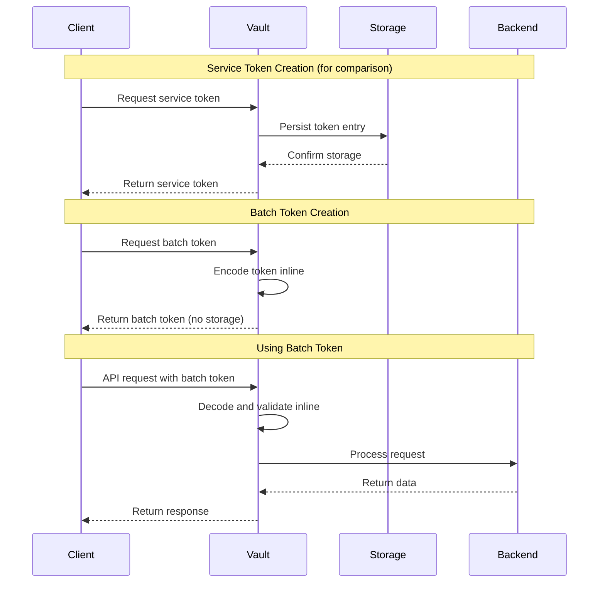

# How to Build Vault Batch Tokens

Author: [nawazdhandala](https://github.com/nawazdhandala)

Tags: Vault, Security, Tokens, Performance

Description: Learn how to leverage HashiCorp Vault batch tokens for high-volume operations with improved performance and reduced storage overhead.

---

## Introduction

HashiCorp Vault provides two primary token types: service tokens and batch tokens. While service tokens are the default and most commonly used, batch tokens offer significant advantages for high-volume, short-lived operations where performance is critical.

This guide explores batch tokens in depth, covering their characteristics, use cases, and practical implementation patterns.

## What Are Batch Tokens?

Batch tokens are lightweight tokens designed for high-volume workloads. Unlike service tokens, they are not persisted to storage, making them faster to create and validate. They are encoded with all necessary information, allowing Vault to process them without database lookups.

### Key Characteristics

| Feature | Batch Token | Service Token |
|---------|-------------|---------------|
| Storage persistence | No | Yes |
| Renewability | No | Yes |
| Revocability | No (parent only) | Yes |
| Performance | High | Standard |
| Token size | Larger | Smaller |
| Child tokens | Cannot create | Can create |
| Root/orphan capable | No | Yes |
| TTL limits | Capped by parent | Configurable |

## Batch Token Flow

The following diagram illustrates how batch tokens work in a typical high-volume scenario:



## When to Use Batch Tokens

### Ideal Use Cases

1. **CI/CD Pipelines**: Short-lived jobs that need quick token generation
2. **Serverless Functions**: Lambda or Cloud Functions with brief execution windows
3. **Kubernetes Jobs**: Ephemeral workloads with no need for token renewal
4. **High-Throughput Services**: Applications making thousands of requests per second
5. **Microservices**: Stateless services that request fresh tokens per operation

### When to Avoid Batch Tokens

- Long-running processes requiring token renewal
- Operations that need explicit token revocation
- Workflows requiring child token creation
- Scenarios needing root or orphan tokens

## Performance Benefits

Batch tokens provide measurable performance improvements:

1. **Faster Creation**: No storage write operations
2. **Faster Validation**: No storage read operations
3. **Reduced Storage Load**: No token entries consuming backend resources
4. **Better Scalability**: Linear scaling without storage bottlenecks
5. **Lower Latency**: Eliminated round-trip to persistent storage

### Performance Comparison

In high-volume scenarios, batch tokens can provide:
- 10x faster token creation
- 50% reduction in Vault storage operations
- Consistent latency under load (no storage contention)

## Creating Batch Tokens

### Method 1: Using the Vault CLI

```bash
# Create a batch token with a specific policy and TTL
vault token create \
  -type=batch \
  -policy=my-policy \
  -ttl=1h

# Create a batch token with metadata
vault token create \
  -type=batch \
  -policy=app-secrets \
  -ttl=30m \
  -metadata=environment=production \
  -metadata=service=api-gateway
```

### Method 2: Using the HTTP API

```bash
# Create a batch token via the API
curl --request POST \
  --header "X-Vault-Token: ${VAULT_TOKEN}" \
  --data '{
    "type": "batch",
    "policies": ["my-policy"],
    "ttl": "1h",
    "metadata": {
      "purpose": "ci-pipeline",
      "job_id": "build-123"
    }
  }' \
  ${VAULT_ADDR}/v1/auth/token/create
```

### Method 3: Using Token Roles

Token roles provide a reusable configuration for batch token creation:

```bash
# Create a token role configured for batch tokens
vault write auth/token/roles/ci-batch \
  allowed_policies="ci-secrets" \
  orphan=false \
  token_type="batch" \
  token_ttl="30m" \
  token_max_ttl="1h"

# Generate tokens using the role
vault token create -role=ci-batch
```

## Practical Code Examples

### Python Example with hvac Library

```python
import hvac
import os

# Initialize the Vault client
# Uses VAULT_ADDR and VAULT_TOKEN environment variables
client = hvac.Client(
    url=os.environ.get('VAULT_ADDR', 'http://127.0.0.1:8200'),
    token=os.environ['VAULT_TOKEN']
)

def create_batch_token(policies, ttl='1h', metadata=None):
    """
    Create a batch token for high-volume operations.

    Args:
        policies: List of policy names to attach
        ttl: Time-to-live for the token (default: 1 hour)
        metadata: Optional dict of key-value metadata

    Returns:
        The batch token string
    """
    response = client.auth.token.create(
        policies=policies,
        ttl=ttl,
        token_type='batch',  # Key parameter for batch tokens
        meta=metadata
    )

    return response['auth']['client_token']

def use_batch_token_for_secrets(batch_token, secret_path):
    """
    Use a batch token to retrieve secrets.

    Args:
        batch_token: The batch token string
        secret_path: Path to the secret in Vault

    Returns:
        The secret data dictionary
    """
    # Create a new client with the batch token
    batch_client = hvac.Client(
        url=os.environ.get('VAULT_ADDR', 'http://127.0.0.1:8200'),
        token=batch_token
    )

    # Read the secret using the batch token
    response = batch_client.secrets.kv.v2.read_secret_version(
        path=secret_path
    )

    return response['data']['data']

# Example usage
if __name__ == '__main__':
    # Create a batch token for CI operations
    token = create_batch_token(
        policies=['ci-secrets'],
        ttl='30m',
        metadata={'job': 'deploy-production'}
    )

    print(f"Created batch token: {token[:20]}...")

    # Use the token to fetch secrets
    secrets = use_batch_token_for_secrets(
        batch_token=token,
        secret_path='ci/database'
    )

    print(f"Retrieved {len(secrets)} secret keys")
```

### Go Example for High-Throughput Service

```go
package main

import (
	"context"
	"fmt"
	"log"
	"os"
	"sync"
	"time"

	vault "github.com/hashicorp/vault/api"
)

// BatchTokenManager handles batch token creation and caching
type BatchTokenManager struct {
	client    *vault.Client
	tokenRole string
	mu        sync.RWMutex
	cache     map[string]*cachedToken
}

type cachedToken struct {
	token     string
	expiresAt time.Time
}

// NewBatchTokenManager creates a new manager instance
func NewBatchTokenManager(client *vault.Client, tokenRole string) *BatchTokenManager {
	return &BatchTokenManager{
		client:    client,
		tokenRole: tokenRole,
		cache:     make(map[string]*cachedToken),
	}
}

// GetBatchToken retrieves or creates a batch token for the given purpose
func (m *BatchTokenManager) GetBatchToken(ctx context.Context, purpose string) (string, error) {
	// Check cache first with read lock
	m.mu.RLock()
	if cached, ok := m.cache[purpose]; ok {
		// Return cached token if still valid (with 5 minute buffer)
		if time.Now().Add(5 * time.Minute).Before(cached.expiresAt) {
			m.mu.RUnlock()
			return cached.token, nil
		}
	}
	m.mu.RUnlock()

	// Create new batch token
	m.mu.Lock()
	defer m.mu.Unlock()

	// Double-check after acquiring write lock
	if cached, ok := m.cache[purpose]; ok {
		if time.Now().Add(5 * time.Minute).Before(cached.expiresAt) {
			return cached.token, nil
		}
	}

	// Request new batch token using the configured role
	secret, err := m.client.Auth().Token().CreateWithRole(&vault.TokenCreateRequest{
		Metadata: map[string]string{
			"purpose": purpose,
		},
	}, m.tokenRole)
	if err != nil {
		return "", fmt.Errorf("failed to create batch token: %w", err)
	}

	// Calculate expiration time
	ttl, _ := secret.TokenTTL()
	expiresAt := time.Now().Add(ttl)

	// Cache the token
	m.cache[purpose] = &cachedToken{
		token:     secret.Auth.ClientToken,
		expiresAt: expiresAt,
	}

	return secret.Auth.ClientToken, nil
}

func main() {
	// Configure the Vault client
	config := vault.DefaultConfig()
	config.Address = os.Getenv("VAULT_ADDR")

	client, err := vault.NewClient(config)
	if err != nil {
		log.Fatalf("Failed to create Vault client: %v", err)
	}

	// Set the parent token (typically from environment)
	client.SetToken(os.Getenv("VAULT_TOKEN"))

	// Create the batch token manager
	manager := NewBatchTokenManager(client, "app-batch-role")

	// Simulate high-volume operations
	ctx := context.Background()
	var wg sync.WaitGroup

	for i := 0; i < 100; i++ {
		wg.Add(1)
		go func(id int) {
			defer wg.Done()

			// Get a batch token for this operation
			token, err := manager.GetBatchToken(ctx, "api-request")
			if err != nil {
				log.Printf("Worker %d: failed to get token: %v", id, err)
				return
			}

			// Create a client with the batch token
			workerClient, _ := vault.NewClient(config)
			workerClient.SetToken(token)

			// Perform secret read operation
			secret, err := workerClient.Logical().Read("secret/data/app/config")
			if err != nil {
				log.Printf("Worker %d: failed to read secret: %v", id, err)
				return
			}

			log.Printf("Worker %d: successfully retrieved secret with %d keys",
				id, len(secret.Data))
		}(i)
	}

	wg.Wait()
	fmt.Println("All operations completed")
}
```

### Kubernetes Integration Example

```yaml
# Vault configuration for Kubernetes batch tokens
# File: vault-batch-token-config.yaml

# First, create the token role in Vault
# vault write auth/token/roles/k8s-batch ...

---
apiVersion: v1
kind: ConfigMap
metadata:
  name: vault-agent-config
  namespace: app
data:
  config.hcl: |
    vault {
      address = "https://vault.example.com:8200"
    }

    auto_auth {
      method "kubernetes" {
        mount_path = "auth/kubernetes"
        config = {
          role = "app-role"
        }
      }

      sink "file" {
        config = {
          path = "/vault/secrets/.token"
        }
      }
    }

    template_config {
      # Use batch tokens for templating operations
      generate_token = true
      token_type = "batch"
    }

    template {
      source      = "/vault/templates/secrets.ctmpl"
      destination = "/vault/secrets/config.json"
    }
---
apiVersion: batch/v1
kind: Job
metadata:
  name: data-processor
  namespace: app
spec:
  template:
    spec:
      serviceAccountName: vault-auth
      containers:
        - name: processor
          image: myapp/processor:latest
          env:
            # Pass Vault address to the container
            - name: VAULT_ADDR
              value: "https://vault.example.com:8200"
          volumeMounts:
            - name: vault-secrets
              mountPath: /vault/secrets
              readOnly: true
      volumes:
        - name: vault-secrets
          emptyDir:
            medium: Memory
      restartPolicy: Never
  backoffLimit: 3
```

## Limitations and Considerations

### Token Size

Batch tokens are self-contained and encoded, making them larger than service tokens:

```bash
# Service token example (shorter)
s.aBcDeFgHiJkLmNoP

# Batch token example (longer, base64 encoded)
b.AAAAAQ...encoded_data...
```

This larger size may impact:
- HTTP header limits (typically 8KB)
- Log storage if tokens are logged
- Memory usage when handling many tokens

### No Revocation

Batch tokens cannot be individually revoked. Plan for this by:
- Using short TTLs appropriate for your use case
- Revoking the parent token when necessary (revokes all child batch tokens)
- Implementing application-level token validation if needed

### TTL Constraints

Batch token TTLs are limited by the parent token:

```bash
# If parent token has 2h remaining, batch token TTL is capped at 2h
# Even if you request a longer TTL

# Parent token TTL: 2h remaining
vault token create -type=batch -ttl=4h
# Actual TTL: 2h (capped by parent)
```

## Best Practices

1. **Set Appropriate TTLs**: Match token lifetime to operation duration
2. **Use Token Roles**: Define reusable configurations for consistency
3. **Monitor Token Creation**: Track batch token generation rates
4. **Plan for Failures**: Batch tokens cannot be renewed, so handle expiration gracefully
5. **Limit Policies**: Assign minimal required permissions
6. **Use Metadata**: Tag tokens for auditing and debugging
7. **Cache When Possible**: Reuse valid batch tokens for similar operations

## Conclusion

Vault batch tokens are a powerful tool for high-volume, performance-sensitive operations. By understanding their characteristics and limitations, you can significantly improve your application's throughput while maintaining security best practices.

Key takeaways:
- Use batch tokens when you need speed and have short-lived operations
- Stick with service tokens when you need renewal, revocation, or child tokens
- Implement proper caching and error handling for production workloads
- Monitor and audit token usage to ensure proper security posture

For more information, refer to the [official HashiCorp Vault documentation](https://developer.hashicorp.com/vault/docs/concepts/tokens).
