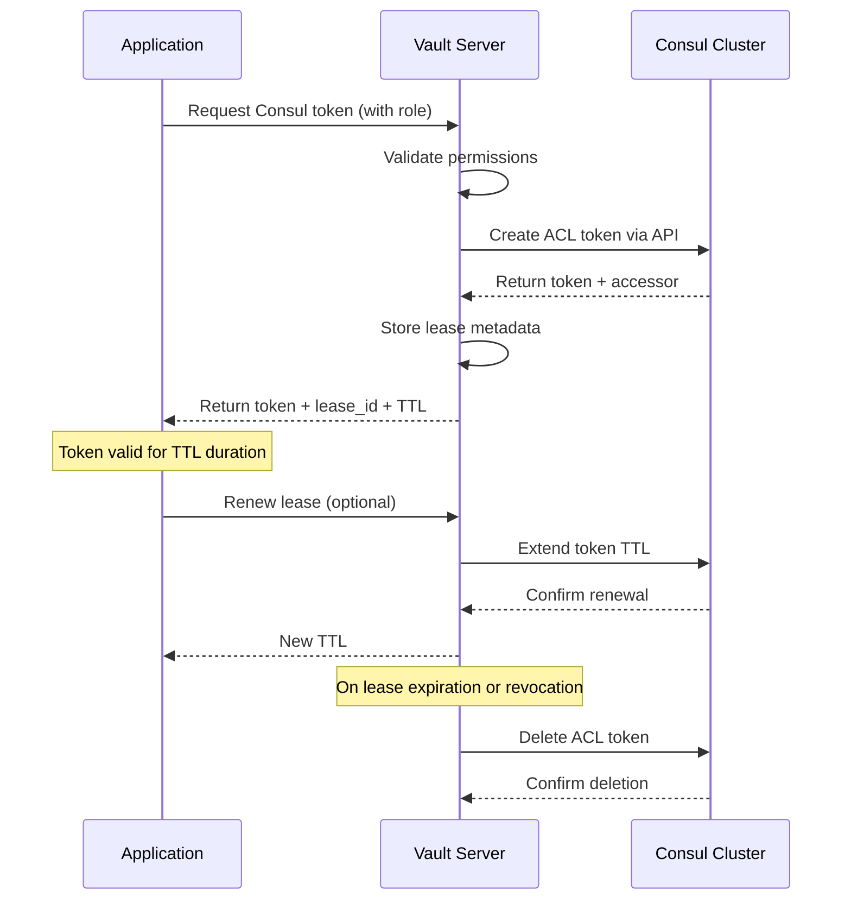
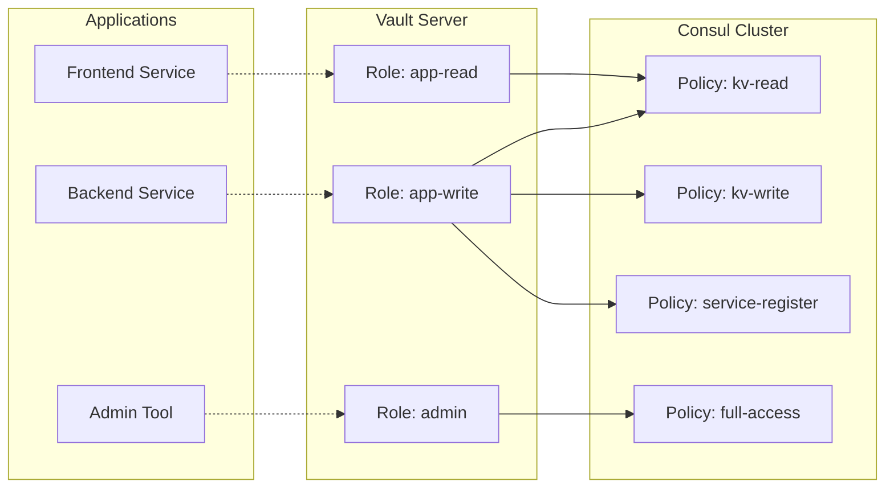
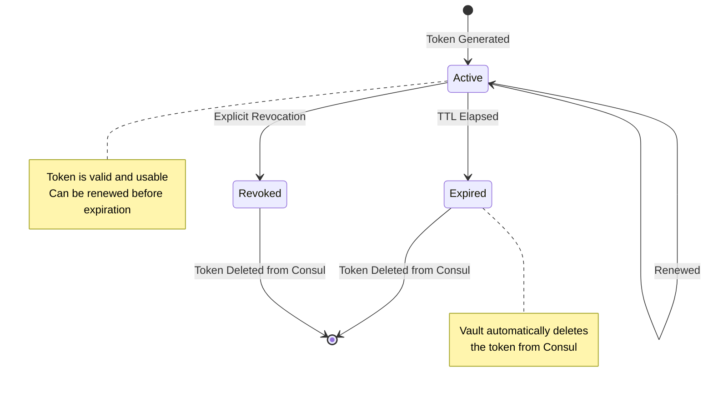

# How to Create Vault Consul Secrets

Author: [nawazdhandala](https://github.com/nawazdhandala)

Tags: Vault, Security, Consul, DynamicSecrets

Description: Generate dynamic Consul ACL tokens with HashiCorp Vault for automated, time-limited service authentication.

---

Static Consul ACL tokens are a security liability. They get leaked, shared, and never rotated. Vault's Consul secrets engine solves this by generating dynamic, short-lived tokens on demand. Services request tokens when they need them, and Vault handles creation, rotation, and revocation automatically.

## How Vault Consul Token Generation Works



## Prerequisites

Before configuring the Consul secrets engine, you need:

- Vault server running and unsealed
- Consul cluster with ACLs enabled
- A Consul management token with permissions to create other tokens

### Enable Consul ACLs

If ACLs are not enabled in Consul, add this to your Consul server configuration:

```hcl
# /etc/consul.d/acl.hcl
acl = {
  enabled        = true
  default_policy = "deny"
  down_policy    = "extend-cache"

  tokens = {
    # Bootstrap token for initial setup
    initial_management = "your-bootstrap-token-here"
  }
}
```

Restart Consul after applying ACL configuration.

## Enable the Consul Secrets Engine

The Consul secrets engine is not enabled by default. Enable it at a path of your choice.

```bash
# Enable at the default path 'consul/'
vault secrets enable consul

# Or enable at a custom path for multiple Consul clusters
vault secrets enable -path=consul-prod consul
vault secrets enable -path=consul-staging consul
```

## Configure the Secrets Engine

Vault needs a management token to communicate with Consul and create tokens on your behalf.

### Create a Vault Management Policy in Consul

First, create a Consul policy that grants Vault the permissions it needs:

```bash
# Create the policy file
cat > vault-management-policy.hcl << 'EOF'
# Allow Vault to manage all ACL tokens
acl = "write"

# Allow Vault to read agent information
agent_prefix "" {
  policy = "read"
}
EOF

# Apply the policy to Consul
consul acl policy create \
  -name "vault-management" \
  -description "Policy for Vault to manage ACL tokens" \
  -rules @vault-management-policy.hcl
```

### Create a Token for Vault

```bash
# Create a token with the vault-management policy
consul acl token create \
  -description "Vault secrets engine token" \
  -policy-name "vault-management" \
  -format=json | jq -r '.SecretID'
```

Save this token securely. You will need it for Vault configuration.

### Configure Vault with the Consul Token

```bash
# Configure the Consul secrets engine
vault write consul/config/access \
  address="consul.example.com:8500" \
  token="your-vault-management-token"

# For TLS-enabled Consul clusters
vault write consul/config/access \
  address="https://consul.example.com:8501" \
  token="your-vault-management-token" \
  scheme="https" \
  ca_cert="@/path/to/consul-ca.pem"
```

Verify the configuration:

```bash
vault read consul/config/access
```

## Create Token Generation Roles

Roles define what permissions the generated tokens will have. Each role maps to a Consul policy or set of policies.

### Architecture: Roles and Policies



### Create Consul Policies First

Define policies in Consul that your roles will reference:

```bash
# Read-only access to the app/ KV path
cat > kv-read-policy.hcl << 'EOF'
key_prefix "app/" {
  policy = "read"
}
EOF

consul acl policy create \
  -name "kv-read" \
  -description "Read-only access to app/ KV prefix" \
  -rules @kv-read-policy.hcl
```

```bash
# Read-write access to KV and service registration
cat > app-service-policy.hcl << 'EOF'
# Read and write to app configuration
key_prefix "app/" {
  policy = "write"
}

# Allow service registration
service_prefix "app-" {
  policy = "write"
}

# Allow health check registration
node_prefix "" {
  policy = "read"
}
EOF

consul acl policy create \
  -name "app-service" \
  -description "App service registration and KV access" \
  -rules @app-service-policy.hcl
```

### Create Vault Roles

Now create Vault roles that reference these Consul policies:

```bash
# Role for read-only access
# Tokens from this role live for 1 hour, max 24 hours
vault write consul/roles/app-read \
  policies="kv-read" \
  ttl="1h" \
  max_ttl="24h"

# Role for service workloads
# Shorter TTL for more frequent rotation
vault write consul/roles/app-service \
  policies="kv-read,app-service" \
  ttl="30m" \
  max_ttl="4h"

# Role with multiple policies for admin tasks
vault write consul/roles/admin \
  policies="global-management" \
  ttl="15m" \
  max_ttl="1h"
```

### Role Configuration Options

| Parameter | Description | Default |
|-----------|-------------|---------|
| `policies` | Comma-separated list of Consul policies | Required |
| `ttl` | Default lease duration | System default |
| `max_ttl` | Maximum lease duration | System default |
| `local` | Create local tokens (not replicated) | false |
| `token_type` | Token type: client or management | client |
| `consul_namespace` | Consul Enterprise namespace | default |

List all configured roles:

```bash
vault list consul/roles
```

Read a specific role configuration:

```bash
vault read consul/roles/app-service
```

## Generate Tokens

With roles configured, applications can now request tokens.

### Generate a Token via CLI

```bash
# Generate a token using the app-read role
vault read consul/creds/app-read

# Output:
# Key                 Value
# ---                 -----
# lease_id            consul/creds/app-read/abcd1234...
# lease_duration      1h
# lease_renewable     true
# accessor            a1b2c3d4-...
# token               12345678-abcd-efgh-ijkl-...
```

### Generate a Token via API

```bash
# Request a token from the Vault API
curl --header "X-Vault-Token: $VAULT_TOKEN" \
  --request GET \
  "$VAULT_ADDR/v1/consul/creds/app-service" | jq

# Response:
# {
#   "request_id": "...",
#   "lease_id": "consul/creds/app-service/xyz789...",
#   "lease_duration": 1800,
#   "renewable": true,
#   "data": {
#     "accessor": "...",
#     "token": "the-generated-token"
#   }
# }
```

### Use the Token with Consul

```bash
# Export the token for CLI use
export CONSUL_HTTP_TOKEN=$(vault read -field=token consul/creds/app-read)

# Now Consul commands use the dynamic token
consul kv get app/config/database

# Or pass directly to consul commands
consul kv get -token=$(vault read -field=token consul/creds/app-read) app/config/database
```

## TTL and Lease Management

Vault tracks every generated token with a lease. Understanding leases is critical for managing token lifecycle.

### Token Lifecycle Flow



### Renew a Token Lease

Extend the token's lifetime before it expires:

```bash
# Renew using the lease_id from token generation
vault lease renew consul/creds/app-service/xyz789...

# Renew with a specific increment (up to max_ttl)
vault lease renew -increment=2h consul/creds/app-service/xyz789...
```

Via API:

```bash
curl --header "X-Vault-Token: $VAULT_TOKEN" \
  --request POST \
  --data '{"lease_id": "consul/creds/app-service/xyz789...", "increment": 3600}' \
  "$VAULT_ADDR/v1/sys/leases/renew"
```

### Revoke Tokens

Immediately invalidate a token when it is no longer needed:

```bash
# Revoke a specific token by lease_id
vault lease revoke consul/creds/app-service/xyz789...

# Revoke all tokens from a role
vault lease revoke -prefix consul/creds/app-service

# Revoke all Consul tokens (emergency)
vault lease revoke -prefix consul/creds
```

### Check Lease Status

```bash
# Look up lease information
vault lease lookup consul/creds/app-service/xyz789...

# List all active leases for a role
vault list sys/leases/lookup/consul/creds/app-service
```

## Practical Integration Examples

### Application Startup Script

```bash
#!/bin/bash
# startup.sh - Get Consul token before starting application

set -e

# Authenticate to Vault (example using AppRole)
VAULT_TOKEN=$(vault write -field=token auth/approle/login \
  role_id="$VAULT_ROLE_ID" \
  secret_id="$VAULT_SECRET_ID")

export VAULT_TOKEN

# Get Consul token
CONSUL_RESPONSE=$(vault read -format=json consul/creds/app-service)
export CONSUL_HTTP_TOKEN=$(echo "$CONSUL_RESPONSE" | jq -r '.data.token')
LEASE_ID=$(echo "$CONSUL_RESPONSE" | jq -r '.lease_id')

# Store lease_id for renewal/cleanup
echo "$LEASE_ID" > /var/run/consul-lease-id

# Start the application
exec /usr/local/bin/myapp
```

### Token Renewal Sidecar

```bash
#!/bin/bash
# renew-consul-token.sh - Run as a sidecar or cron job

LEASE_FILE="/var/run/consul-lease-id"
RENEWAL_INTERVAL=1800  # Renew every 30 minutes

while true; do
    if [ -f "$LEASE_FILE" ]; then
        LEASE_ID=$(cat "$LEASE_FILE")

        # Attempt renewal
        if vault lease renew "$LEASE_ID" > /dev/null 2>&1; then
            echo "$(date): Lease renewed successfully"
        else
            echo "$(date): Lease renewal failed, requesting new token"
            # Trigger application to get new token
            kill -SIGHUP $(cat /var/run/app.pid)
        fi
    fi

    sleep "$RENEWAL_INTERVAL"
done
```

### Kubernetes Init Container

```yaml
apiVersion: v1
kind: Pod
metadata:
  name: app-with-consul-token
spec:
  serviceAccountName: app-service-account

  initContainers:
    # Get Consul token from Vault before app starts
    - name: vault-init
      image: hashicorp/vault:1.15
      command:
        - sh
        - -c
        - |
          # Login to Vault using Kubernetes auth
          vault login -method=kubernetes role=app-role

          # Get Consul token and write to shared volume
          vault read -field=token consul/creds/app-service > /consul/token
          vault read -field=lease_id consul/creds/app-service > /consul/lease_id
      env:
        - name: VAULT_ADDR
          value: "https://vault.example.com:8200"
      volumeMounts:
        - name: consul-token
          mountPath: /consul

  containers:
    - name: app
      image: myapp:latest
      env:
        - name: CONSUL_HTTP_TOKEN_FILE
          value: /consul/token
      volumeMounts:
        - name: consul-token
          mountPath: /consul
          readOnly: true

    # Sidecar to renew the token
    - name: token-renewer
      image: hashicorp/vault:1.15
      command:
        - sh
        - -c
        - |
          vault login -method=kubernetes role=app-role
          while true; do
            LEASE_ID=$(cat /consul/lease_id)
            vault lease renew "$LEASE_ID" || true
            sleep 900  # Renew every 15 minutes
          done
      env:
        - name: VAULT_ADDR
          value: "https://vault.example.com:8200"
      volumeMounts:
        - name: consul-token
          mountPath: /consul

  volumes:
    - name: consul-token
      emptyDir:
        medium: Memory  # Store token in memory only
```

### Vault Agent Auto-Auth

For production workloads, use Vault Agent to handle authentication and token renewal automatically:

```hcl
# vault-agent-config.hcl
vault {
  address = "https://vault.example.com:8200"
}

auto_auth {
  method "kubernetes" {
    mount_path = "auth/kubernetes"
    config = {
      role = "app-role"
    }
  }

  sink "file" {
    config = {
      path = "/var/run/vault-token"
    }
  }
}

template {
  source      = "/etc/vault-agent/consul-token.tpl"
  destination = "/var/run/consul-token"
  perms       = 0600

  # Re-render when token changes
  command     = "pkill -SIGHUP myapp || true"
}
```

Template file:

```
{{/* consul-token.tpl */}}
{{ with secret "consul/creds/app-service" }}
{{ .Data.token }}
{{ end }}
```

## Vault Policies for Consul Access

Control which Vault clients can generate which Consul tokens:

```hcl
# vault-policy-app-team.hcl
# Allow app team to generate read-only tokens
path "consul/creds/app-read" {
  capabilities = ["read"]
}

# Allow app team to generate service tokens
path "consul/creds/app-service" {
  capabilities = ["read"]
}

# Allow renewing their own leases
path "sys/leases/renew" {
  capabilities = ["update"]
}

# Deny admin token generation
path "consul/creds/admin" {
  capabilities = ["deny"]
}
```

```hcl
# vault-policy-platform-team.hcl
# Platform team can generate any token
path "consul/creds/*" {
  capabilities = ["read"]
}

# Platform team can revoke tokens
path "sys/leases/revoke" {
  capabilities = ["update"]
}

path "sys/leases/revoke-prefix/consul/*" {
  capabilities = ["update"]
}

# Platform team can manage roles
path "consul/roles/*" {
  capabilities = ["create", "read", "update", "delete", "list"]
}
```

Apply the policies:

```bash
vault policy write app-team vault-policy-app-team.hcl
vault policy write platform-team vault-policy-platform-team.hcl
```

## Monitoring and Auditing

### Enable Vault Audit Logging

```bash
# Log all Vault operations
vault audit enable file file_path=/var/log/vault/audit.log
```

Audit logs capture every token generation, renewal, and revocation.

### Monitor Token Usage

```bash
# Count active leases by path
vault list -format=json sys/leases/lookup/consul/creds/app-service | jq length

# Find tokens expiring soon
vault list sys/leases/lookup/consul/creds | while read role; do
  echo "=== $role ==="
  vault list "sys/leases/lookup/consul/creds/$role"
done
```

### Consul ACL Token Audit

```bash
# List all tokens created by Vault (match by description pattern)
consul acl token list -format=json | \
  jq '.[] | select(.Description | contains("Vault"))'
```

## Troubleshooting

### Common Issues

**Token generation fails with permission denied:**

```bash
# Verify the Vault management token has ACL write permission
consul acl token read -self

# Ensure the token is not expired
consul acl token read -id <accessor-id>
```

**Tokens not being cleaned up:**

```bash
# Check if Vault can reach Consul
vault write consul/config/access address="consul:8500" token="..."

# Manually trigger cleanup
vault lease revoke -prefix consul/creds
```

**Lease renewal fails:**

```bash
# Check if the lease still exists
vault lease lookup <lease_id>

# Verify max_ttl has not been exceeded
vault read consul/roles/<role-name>
```

### Health Check Script

```bash
#!/bin/bash
# check-vault-consul-health.sh

echo "Checking Vault Consul secrets engine health..."

# Test configuration
echo -n "Configuration: "
if vault read consul/config/access > /dev/null 2>&1; then
    echo "OK"
else
    echo "FAILED - Cannot read configuration"
    exit 1
fi

# Test token generation
echo -n "Token generation: "
TEST_TOKEN=$(vault read -field=token consul/creds/app-read 2>/dev/null)
if [ -n "$TEST_TOKEN" ]; then
    echo "OK"

    # Verify token works in Consul
    echo -n "Token validation: "
    if CONSUL_HTTP_TOKEN=$TEST_TOKEN consul members > /dev/null 2>&1; then
        echo "OK"
    else
        echo "FAILED - Token not valid in Consul"
    fi
else
    echo "FAILED - Could not generate token"
    exit 1
fi

echo "All checks passed"
```

---

Dynamic Consul tokens through Vault eliminate the risk of static credentials. Tokens are generated on demand, automatically expired, and centrally audited. Start with short TTLs and adjust based on your application's needs. The goal is tokens that live just long enough to do their job and disappear.
