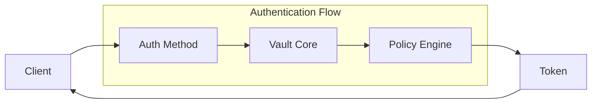

# How to Build Vault Custom Auth Methods

Author: [nawazdhandala](https://www.github.com/nawazdhandala)

Tags: Vault, Security, Authentication, HashiCorp, Secrets Management

Description: Implement custom authentication methods in HashiCorp Vault including Kubernetes, AWS IAM, OIDC, and AppRole for secure secret access.

---

HashiCorp Vault ships with a solid set of built-in auth methods, but real-world deployments often need something more tailored. Whether you are integrating with a proprietary identity provider, implementing custom trust relationships, or building specialized authentication flows, understanding how to extend Vault's authentication capabilities is essential.

This guide walks through implementing custom auth methods, from configuring built-in methods with custom logic to building plugin-based solutions for unique requirements.

## Understanding Vault Auth Methods

Before diving into customization, let's understand how Vault authentication works under the hood.



Auth methods in Vault are responsible for:
- Verifying client identity using external credentials
- Mapping authenticated identities to Vault policies
- Generating tokens with appropriate TTLs and capabilities

## Configuring AppRole for Custom Workflows

AppRole is the most flexible built-in auth method for machine-to-machine authentication. It separates the "role" (what permissions) from the "secret" (proof of identity).

Here is a production-ready AppRole configuration with custom constraints:

```hcl
# approle-config.hcl
# Custom AppRole configuration with security constraints

# Enable AppRole auth method at a custom path
path "auth/custom-approle" {
  type = "approle"
  description = "Custom AppRole for CI/CD pipelines"
}
```

Set up the auth method and create a customized role:

```bash
# Enable AppRole at a custom mount path
vault auth enable -path=custom-approle approle

# Create a role with strict binding constraints
vault write auth/custom-approle/role/deploy-role \
    token_policies="deploy-policy" \
    token_ttl=10m \
    token_max_ttl=30m \
    secret_id_ttl=5m \
    secret_id_num_uses=1 \
    token_num_uses=0 \
    bind_secret_id=true \
    secret_id_bound_cidrs="10.0.0.0/8,192.168.1.0/24"
```

The key customization here is the CIDR binding, which restricts where secret IDs can be used from. This prevents stolen credentials from working outside your network.

## Custom Kubernetes Auth with Bound Claims

Kubernetes auth can be customized to enforce additional constraints beyond service account names.

```bash
# Enable Kubernetes auth with custom configuration
vault auth enable kubernetes

# Configure with bound issuer and custom JWT validation
vault write auth/kubernetes/config \
    kubernetes_host="https://kubernetes.default.svc:443" \
    kubernetes_ca_cert=@/var/run/secrets/kubernetes.io/serviceaccount/ca.crt \
    issuer="https://kubernetes.default.svc.cluster.local" \
    disable_local_ca_jwt=false
```

Create roles with multiple bound constraints:

```bash
# Role with multiple namespace bindings and label selectors
vault write auth/kubernetes/role/webapp-role \
    bound_service_account_names="webapp-sa,webapp-worker-sa" \
    bound_service_account_namespaces="production,staging" \
    bound_service_account_namespace_selector="environment in (prod, staging)" \
    audience="vault" \
    token_policies="webapp-secrets" \
    token_ttl=1h \
    token_max_ttl=4h
```

## Building a Custom Auth Plugin

When built-in methods are not enough, you can write a custom auth plugin. Vault plugins are standalone binaries that communicate via gRPC.

Here is the structure of a custom auth plugin in Go:

```go
// main.go
// Custom Vault auth plugin that validates against an internal identity service

package main

import (
    "context"
    "encoding/json"
    "fmt"
    "net/http"
    "os"

    "github.com/hashicorp/vault/api"
    "github.com/hashicorp/vault/sdk/framework"
    "github.com/hashicorp/vault/sdk/logical"
    "github.com/hashicorp/vault/sdk/plugin"
)

// Backend implements the auth method logic
type backend struct {
    *framework.Backend
    identityServiceURL string
}

// Factory creates a new backend instance
func Factory(ctx context.Context, conf *logical.BackendConfig) (logical.Backend, error) {
    b := &backend{}

    b.Backend = &framework.Backend{
        Help: "Custom auth plugin for internal identity service",
        PathsSpecial: &logical.Paths{
            Unauthenticated: []string{"login"},
        },
        Paths: []*framework.Path{
            b.pathLogin(),
            b.pathConfig(),
        },
        BackendType: logical.TypeCredential,
    }

    if err := b.Setup(ctx, conf); err != nil {
        return nil, err
    }

    return b, nil
}

// pathLogin handles authentication requests
func (b *backend) pathLogin() *framework.Path {
    return &framework.Path{
        Pattern: "login",
        Fields: map[string]*framework.FieldSchema{
            "token": {
                Type:        framework.TypeString,
                Description: "Identity service token",
                Required:    true,
            },
            "service_name": {
                Type:        framework.TypeString,
                Description: "Name of the service requesting access",
                Required:    true,
            },
        },
        Operations: map[logical.Operation]framework.OperationHandler{
            logical.UpdateOperation: &framework.PathOperation{
                Callback: b.handleLogin,
            },
        },
    }
}

// handleLogin validates credentials against the identity service
func (b *backend) handleLogin(ctx context.Context, req *logical.Request, d *framework.FieldData) (*logical.Response, error) {
    token := d.Get("token").(string)
    serviceName := d.Get("service_name").(string)

    // Validate token with internal identity service
    identity, err := b.validateWithIdentityService(token, serviceName)
    if err != nil {
        return nil, logical.ErrPermissionDenied
    }

    // Create auth response with policies based on identity
    auth := &logical.Auth{
        Policies: identity.Policies,
        Metadata: map[string]string{
            "service_name": serviceName,
            "identity_id":  identity.ID,
        },
        LeaseOptions: logical.LeaseOptions{
            TTL:       3600 * 1e9, // 1 hour
            Renewable: true,
        },
        Alias: &logical.Alias{
            Name: identity.ID,
        },
    }

    return &logical.Response{
        Auth: auth,
    }, nil
}
```

The plugin needs a config path to store the identity service URL:

```go
// pathConfig handles plugin configuration
func (b *backend) pathConfig() *framework.Path {
    return &framework.Path{
        Pattern: "config",
        Fields: map[string]*framework.FieldSchema{
            "identity_service_url": {
                Type:        framework.TypeString,
                Description: "URL of the internal identity service",
                Required:    true,
            },
        },
        Operations: map[logical.Operation]framework.OperationHandler{
            logical.CreateOperation: &framework.PathOperation{
                Callback: b.handleConfigWrite,
            },
            logical.UpdateOperation: &framework.PathOperation{
                Callback: b.handleConfigWrite,
            },
            logical.ReadOperation: &framework.PathOperation{
                Callback: b.handleConfigRead,
            },
        },
    }
}

func (b *backend) handleConfigWrite(ctx context.Context, req *logical.Request, d *framework.FieldData) (*logical.Response, error) {
    url := d.Get("identity_service_url").(string)

    entry, err := logical.StorageEntryJSON("config", map[string]string{
        "identity_service_url": url,
    })
    if err != nil {
        return nil, err
    }

    if err := req.Storage.Put(ctx, entry); err != nil {
        return nil, err
    }

    b.identityServiceURL = url
    return nil, nil
}
```

## Registering and Using Custom Plugins

After building your plugin, register it with Vault:

```bash
# Calculate the SHA256 of your plugin binary
SHA256=$(sha256sum vault-plugin-auth-custom | cut -d ' ' -f1)

# Register the plugin in Vault's catalog
vault plugin register -sha256=$SHA256 auth vault-plugin-auth-custom

# Enable the custom auth method
vault auth enable -path=custom-auth vault-plugin-auth-custom

# Configure the plugin
vault write auth/custom-auth/config \
    identity_service_url="https://identity.internal.example.com"
```

## Implementing OIDC with Custom Claims

For organizations using OIDC providers with custom claims, you can map those claims to Vault policies:

```bash
# Enable OIDC auth
vault auth enable oidc

# Configure OIDC with custom claim mappings
vault write auth/oidc/config \
    oidc_discovery_url="https://auth.example.com/.well-known/openid-configuration" \
    oidc_client_id="vault-client" \
    oidc_client_secret="secret" \
    default_role="default"

# Create role with custom claim requirements
vault write auth/oidc/role/engineering \
    bound_audiences="vault-client" \
    allowed_redirect_uris="https://vault.example.com/ui/vault/auth/oidc/oidc/callback" \
    user_claim="email" \
    groups_claim="groups" \
    claim_mappings='{"department": "department", "team": "team"}' \
    bound_claims='{"department": "engineering", "verified": "true"}' \
    token_policies="engineering-secrets" \
    token_ttl=8h
```

The `bound_claims` parameter is where you enforce custom requirements. Only tokens with matching claim values will authenticate successfully.

## Auth Method Tuning and Security

Regardless of which auth method you use, proper tuning is essential:

```bash
# Tune auth method settings at the mount level
vault auth tune -default-lease-ttl=1h -max-lease-ttl=4h custom-approle/

# Set token type and other options
vault auth tune \
    -token-type=batch \
    -listing-visibility=unauth \
    custom-approle/
```

Consider these security settings for any custom auth implementation:

| Setting | Recommended Value | Purpose |
|---------|-------------------|---------|
| token_ttl | 1h or less | Limits exposure window |
| token_max_ttl | 4h | Prevents indefinite token refresh |
| secret_id_num_uses | 1 | Single-use credentials |
| bound_cidrs | Your network ranges | Network-level restriction |
| token_bound_cidrs | Application subnets | Token usage restriction |

## Testing Custom Auth Methods

Always test auth methods thoroughly before production deployment:

```bash
# Test AppRole login flow
ROLE_ID=$(vault read -field=role_id auth/custom-approle/role/deploy-role/role-id)
SECRET_ID=$(vault write -f -field=secret_id auth/custom-approle/role/deploy-role/secret-id)

# Attempt login
vault write auth/custom-approle/login \
    role_id=$ROLE_ID \
    secret_id=$SECRET_ID

# Verify token capabilities
vault token lookup
```

For custom plugins, implement comprehensive logging to trace authentication decisions:

```go
// Add structured logging to your plugin
b.Logger().Info("authentication attempt",
    "service_name", serviceName,
    "source_ip", req.Connection.RemoteAddr,
    "success", true,
)
```

---

Custom auth methods let you adapt Vault to your organization's specific identity and trust requirements. Start with the built-in methods and their customization options before building plugins. When you do need a plugin, keep it focused on the authentication logic and let Vault handle token management and policy enforcement.

For monitoring your Vault authentication across all methods, [OneUptime](https://oneuptime.com) provides real-time visibility into auth failures, token usage patterns, and security events that help you maintain a healthy secrets management infrastructure.
