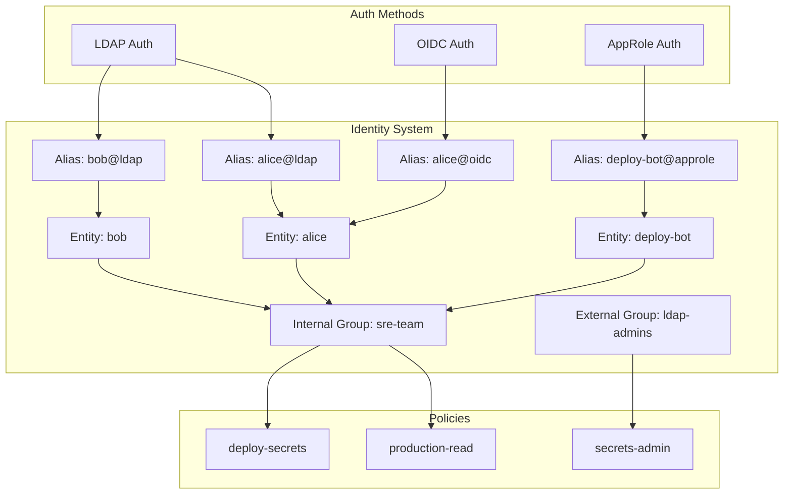
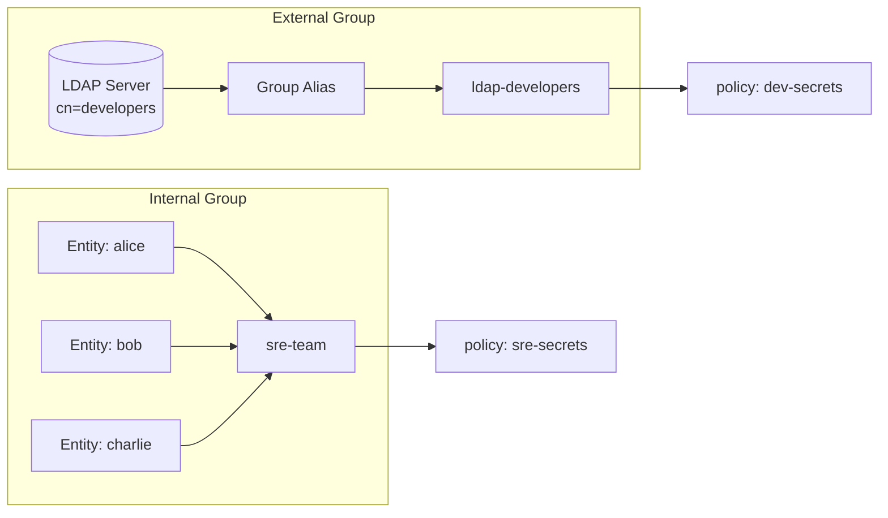
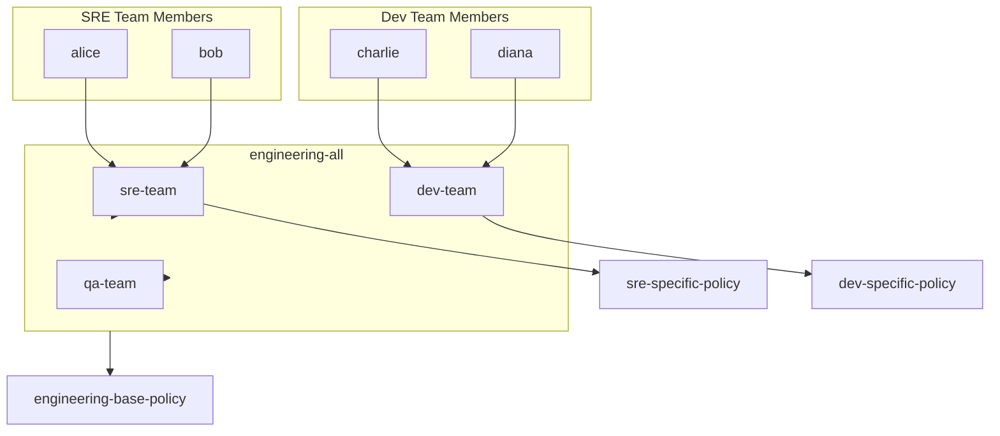

# How to Implement Vault Entity Groups

Author: [nawazdhandala](https://github.com/nawazdhandala)

Tags: Vault, Identity, Groups, Security

Description: A practical guide to managing identities at scale using Vault entity groups, covering internal groups, external groups, aliases, and policy attachment.

---

Managing individual Vault entities becomes unwieldy as your organization grows. Entity groups let you organize identities into logical collections and attach policies to groups rather than individual entities. This simplifies permission management and aligns Vault access with your organizational structure.

## Understanding Vault's Identity System

Vault's identity system has three core components: entities, aliases, and groups. Entities represent users or machines. Aliases link auth method logins to entities. Groups collect entities together for policy assignment.



## Internal Groups vs External Groups

Vault supports two types of groups with different use cases.

**Internal Groups** are managed entirely within Vault. You manually add entity IDs as members. Use these when you need fine-grained control over membership or when grouping entities across multiple auth methods.

**External Groups** link to groups from external identity providers like LDAP, OIDC, or Active Directory. Membership is managed outside Vault. Use these to mirror your existing organizational structure.



## Creating Internal Groups with CLI

### Create an Entity

First, create entities for your users or services.

```bash
# Create an entity for a user
vault write identity/entity \
    name="alice" \
    metadata="team=sre" \
    metadata="environment=production"

# Response includes the entity ID
# Key        Value
# ---        -----
# id         a8b9c0d1-e2f3-4567-8901-234567890abc
```

### Create an Entity Alias

Link the entity to an auth method login.

```bash
# Get the auth method accessor
vault auth list -format=json | jq -r '.["ldap/"].accessor'
# auth_ldap_abc123def

# Create an alias linking the entity to LDAP login
vault write identity/entity-alias \
    name="alice@corp.example.com" \
    canonical_id="a8b9c0d1-e2f3-4567-8901-234567890abc" \
    mount_accessor="auth_ldap_abc123def"
```

### Create an Internal Group

Create a group and add entity members.

```bash
# Create an internal group with member entities
vault write identity/group \
    name="sre-team" \
    type="internal" \
    policies="sre-read,sre-write" \
    member_entity_ids="a8b9c0d1-e2f3-4567-8901-234567890abc,b9c0d1e2-f345-6789-0123-456789abcdef" \
    metadata="team=sre" \
    metadata="cost-center=engineering"
```

### Add Members to Existing Group

Add or remove members from an existing group.

```bash
# Read current group to get existing member IDs
vault read -format=json identity/group/name/sre-team | jq '.data.member_entity_ids'

# Update group with additional members (include existing IDs)
vault write identity/group/name/sre-team \
    member_entity_ids="id1,id2,id3,new-id4"
```

## Creating External Groups with CLI

External groups mirror groups from your identity provider.

### Create an External Group

```bash
# Create external group (no member_entity_ids for external groups)
vault write identity/group \
    name="ldap-admins" \
    type="external" \
    policies="admin-policy,audit-policy"
```

### Create a Group Alias

Link the external group to an identity provider group.

```bash
# Get the LDAP auth method accessor
LDAP_ACCESSOR=$(vault auth list -format=json | jq -r '.["ldap/"].accessor')

# Get the group ID
GROUP_ID=$(vault read -format=json identity/group/name/ldap-admins | jq -r '.data.id')

# Create a group alias linking to LDAP group
vault write identity/group-alias \
    name="cn=admins,ou=groups,dc=corp,dc=example,dc=com" \
    mount_accessor="$LDAP_ACCESSOR" \
    canonical_id="$GROUP_ID"
```

When a user authenticates via LDAP and their LDAP groups include `cn=admins`, Vault automatically grants them the policies attached to the `ldap-admins` group.

## Using the Vault API

The CLI commands map directly to HTTP API calls.

### Create Entity via API

```bash
# Create entity
curl --header "X-Vault-Token: $VAULT_TOKEN" \
    --request POST \
    --data '{
        "name": "alice",
        "metadata": {
            "team": "sre",
            "environment": "production"
        }
    }' \
    $VAULT_ADDR/v1/identity/entity

# Response
# {
#   "data": {
#     "id": "a8b9c0d1-e2f3-4567-8901-234567890abc",
#     "aliases": null,
#     "name": "alice"
#   }
# }
```

### Create Internal Group via API

```bash
curl --header "X-Vault-Token: $VAULT_TOKEN" \
    --request POST \
    --data '{
        "name": "sre-team",
        "type": "internal",
        "policies": ["sre-read", "sre-write"],
        "member_entity_ids": [
            "a8b9c0d1-e2f3-4567-8901-234567890abc",
            "b9c0d1e2-f345-6789-0123-456789abcdef"
        ],
        "metadata": {
            "team": "sre",
            "cost-center": "engineering"
        }
    }' \
    $VAULT_ADDR/v1/identity/group
```

### Create External Group and Alias via API

```bash
# Create external group
curl --header "X-Vault-Token: $VAULT_TOKEN" \
    --request POST \
    --data '{
        "name": "oidc-developers",
        "type": "external",
        "policies": ["dev-secrets"]
    }' \
    $VAULT_ADDR/v1/identity/group

# Get the group ID from response, then create group alias
curl --header "X-Vault-Token: $VAULT_TOKEN" \
    --request POST \
    --data '{
        "name": "developers",
        "mount_accessor": "auth_oidc_xyz789",
        "canonical_id": "group-id-from-response"
    }' \
    $VAULT_ADDR/v1/identity/group-alias
```

### List and Read Groups

```bash
# List all groups
curl --header "X-Vault-Token: $VAULT_TOKEN" \
    $VAULT_ADDR/v1/identity/group/id?list=true

# Read group by name
curl --header "X-Vault-Token: $VAULT_TOKEN" \
    $VAULT_ADDR/v1/identity/group/name/sre-team

# Read group by ID
curl --header "X-Vault-Token: $VAULT_TOKEN" \
    $VAULT_ADDR/v1/identity/group/id/group-id-here
```

## Nested Groups

Groups can contain other groups, enabling hierarchical permission structures.



### Create Nested Groups

```bash
# Create child groups first
vault write identity/group name="sre-team" type="internal" \
    policies="sre-policy" \
    member_entity_ids="entity-id-1,entity-id-2"

vault write identity/group name="dev-team" type="internal" \
    policies="dev-policy" \
    member_entity_ids="entity-id-3,entity-id-4"

# Get child group IDs
SRE_ID=$(vault read -format=json identity/group/name/sre-team | jq -r '.data.id')
DEV_ID=$(vault read -format=json identity/group/name/dev-team | jq -r '.data.id')

# Create parent group with child groups as members
vault write identity/group name="engineering-all" type="internal" \
    policies="engineering-base-policy" \
    member_group_ids="$SRE_ID,$DEV_ID"
```

Members of `sre-team` inherit policies from both `sre-team` and `engineering-all`.

## Policy Attachment Strategies

### Direct Policy Assignment

Attach policies directly to groups for straightforward permission management.

```bash
# Create or update group with policies
vault write identity/group/name/sre-team \
    policies="kv-sre-read,kv-sre-write,pki-issue"
```

### Templated Policies

Use identity templating in policies for dynamic paths based on group metadata.

```hcl
# policy: team-secrets.hcl
path "secret/data/teams/{{identity.groups.names.sre-team.metadata.team}}/*" {
    capabilities = ["create", "read", "update", "delete", "list"]
}

path "secret/metadata/teams/{{identity.groups.names.sre-team.metadata.team}}/*" {
    capabilities = ["list", "read", "delete"]
}
```

```bash
# Write the templated policy
vault policy write team-secrets team-secrets.hcl

# Attach to group
vault write identity/group/name/sre-team policies="team-secrets"
```

## Practical Example: Multi-Team Setup

Here's a complete example setting up groups for a typical engineering organization.

```bash
#!/bin/bash

# Enable LDAP auth if not already enabled
vault auth enable ldap

# Configure LDAP (adjust for your LDAP server)
vault write auth/ldap/config \
    url="ldaps://ldap.corp.example.com" \
    userdn="ou=users,dc=corp,dc=example,dc=com" \
    groupdn="ou=groups,dc=corp,dc=example,dc=com" \
    groupattr="cn" \
    userattr="uid" \
    insecure_tls=false \
    starttls=true

# Get LDAP accessor
LDAP_ACCESSOR=$(vault auth list -format=json | jq -r '.["ldap/"].accessor')

# Create policies
vault policy write sre-policy - <<EOF
path "secret/data/sre/*" {
    capabilities = ["create", "read", "update", "delete", "list"]
}
path "secret/data/shared/*" {
    capabilities = ["read", "list"]
}
EOF

vault policy write dev-policy - <<EOF
path "secret/data/dev/*" {
    capabilities = ["create", "read", "update", "delete", "list"]
}
path "secret/data/shared/*" {
    capabilities = ["read", "list"]
}
EOF

vault policy write readonly-policy - <<EOF
path "secret/data/*" {
    capabilities = ["read", "list"]
}
EOF

# Create external groups linked to LDAP groups
vault write identity/group name="ldap-sre" type="external" \
    policies="sre-policy"

vault write identity/group name="ldap-developers" type="external" \
    policies="dev-policy"

vault write identity/group name="ldap-readonly" type="external" \
    policies="readonly-policy"

# Get group IDs
SRE_GROUP_ID=$(vault read -format=json identity/group/name/ldap-sre | jq -r '.data.id')
DEV_GROUP_ID=$(vault read -format=json identity/group/name/ldap-developers | jq -r '.data.id')
RO_GROUP_ID=$(vault read -format=json identity/group/name/ldap-readonly | jq -r '.data.id')

# Create group aliases to link to LDAP groups
vault write identity/group-alias \
    name="cn=sre,ou=groups,dc=corp,dc=example,dc=com" \
    mount_accessor="$LDAP_ACCESSOR" \
    canonical_id="$SRE_GROUP_ID"

vault write identity/group-alias \
    name="cn=developers,ou=groups,dc=corp,dc=example,dc=com" \
    mount_accessor="$LDAP_ACCESSOR" \
    canonical_id="$DEV_GROUP_ID"

vault write identity/group-alias \
    name="cn=employees,ou=groups,dc=corp,dc=example,dc=com" \
    mount_accessor="$LDAP_ACCESSOR" \
    canonical_id="$RO_GROUP_ID"

echo "Setup complete. LDAP users will receive policies based on their LDAP group membership."
```

## Verifying Group Membership

### Check Entity's Group Memberships

```bash
# Read entity and check group_ids
vault read -format=json identity/entity/name/alice | jq '.data.group_ids'

# Get full group details for each group
vault read identity/group/id/group-id-here
```

### Check Effective Policies

```bash
# Login as user and check token capabilities
vault login -method=ldap username=alice

# Check what policies the token has
vault token lookup | grep policies

# Test specific path capabilities
vault token capabilities secret/data/sre/app-config
```

### Audit Group Changes

```bash
# List all groups
vault list identity/group/id

# Read group details including modification history
vault read -format=json identity/group/name/sre-team | jq '{
    name: .data.name,
    type: .data.type,
    policies: .data.policies,
    member_count: (.data.member_entity_ids | length),
    child_groups: (.data.member_group_ids | length),
    last_update: .data.last_update_time
}'
```

## Common Pitfalls

**Mixing internal and external membership**: External groups cannot have `member_entity_ids`. Membership comes exclusively from the external identity provider.

**Forgetting group aliases**: Creating an external group without a group alias means no one will ever be a member. Always create the alias pointing to your identity provider group.

**Circular group membership**: Vault prevents direct circular references, but complex nested hierarchies can create confusing policy inheritance. Keep nesting shallow (2-3 levels max).

**Stale entity aliases**: When users are removed from your identity provider, their entities and aliases remain in Vault. Implement a cleanup process to remove orphaned entities.

## Cleanup Commands

```bash
# Delete a group alias
vault delete identity/group-alias/id/alias-id

# Delete a group
vault delete identity/group/name/sre-team

# Delete an entity alias
vault delete identity/entity-alias/id/alias-id

# Delete an entity
vault delete identity/entity/name/alice
```

---

Entity groups transform Vault from a per-user permission system into a scalable identity platform. Use internal groups for cross-auth-method organization and external groups to mirror your existing identity provider structure. Keep group hierarchies shallow, document your policy attachment strategy, and audit membership regularly.
