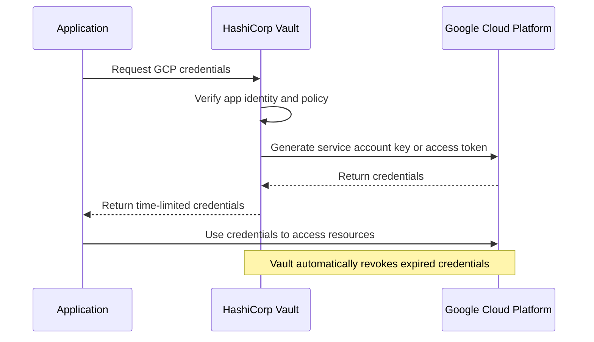
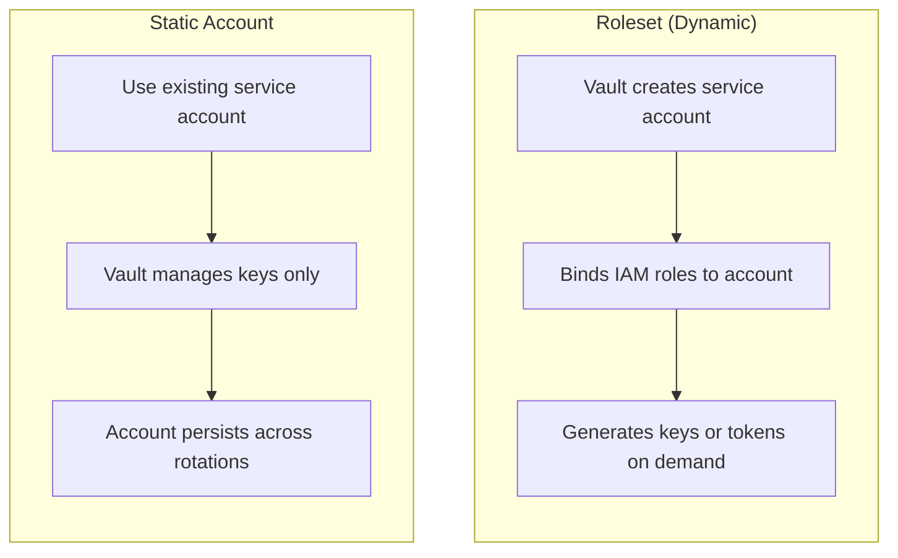
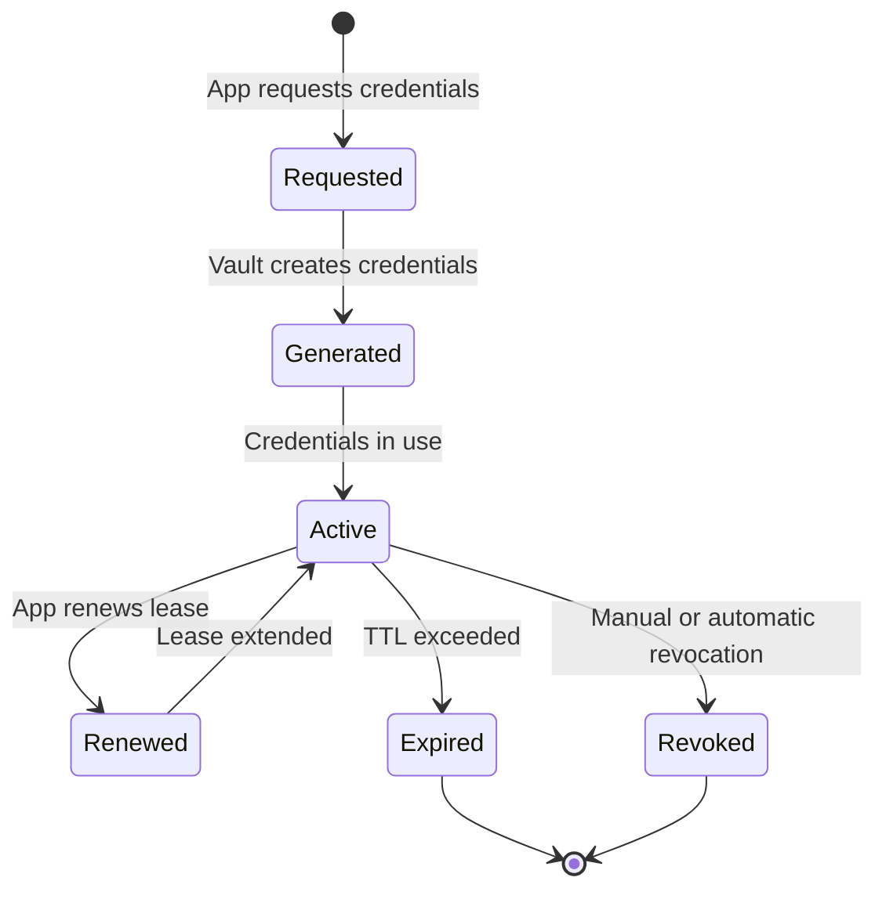

# How to Create Vault GCP Credentials

Author: [nawazdhandala](https://github.com/nawazdhandala)

Tags: Vault, Security, GCP, DynamicSecrets

Description: Learn how to configure HashiCorp Vault to generate dynamic GCP credentials for secure, short-lived access to Google Cloud resources.

---

Static credentials are a security nightmare. They get leaked in git repos, shared in Slack, and live forever in config files. Vault's GCP secrets engine solves this by generating short-lived credentials on demand. No more long-lived service account keys sitting around waiting to be compromised.

## How Vault GCP Credentials Work

Vault acts as a credential broker between your applications and GCP. When an application needs GCP access, it requests credentials from Vault. Vault then either generates a new service account key or creates an OAuth2 access token, depending on your configuration.



## Prerequisites

Before configuring the GCP secrets engine, you need:

1. A running Vault server (dev mode works for testing)
2. A GCP project with the necessary APIs enabled
3. A GCP service account with permissions to manage other service accounts

### Enable Required GCP APIs

```bash
# Enable the IAM API for service account management
gcloud services enable iam.googleapis.com

# Enable the IAM Credentials API for access token generation
gcloud services enable iamcredentials.googleapis.com

# Enable the Resource Manager API for project-level operations
gcloud services enable cloudresourcemanager.googleapis.com
```

### Create the Vault Service Account

Create a service account that Vault will use to manage credentials:

```bash
# Create the service account
gcloud iam service-accounts create vault-admin \
    --display-name="Vault GCP Secrets Engine"

# Grant permissions to create and manage service account keys
gcloud projects add-iam-policy-binding YOUR_PROJECT_ID \
    --member="serviceAccount:vault-admin@YOUR_PROJECT_ID.iam.gserviceaccount.com" \
    --role="roles/iam.serviceAccountKeyAdmin"

# Grant permissions to manage IAM bindings on service accounts
gcloud projects add-iam-policy-binding YOUR_PROJECT_ID \
    --member="serviceAccount:vault-admin@YOUR_PROJECT_ID.iam.gserviceaccount.com" \
    --role="roles/iam.serviceAccountAdmin"

# Download the service account key for Vault configuration
gcloud iam service-accounts keys create vault-admin-key.json \
    --iam-account=vault-admin@YOUR_PROJECT_ID.iam.gserviceaccount.com
```

## Enabling the GCP Secrets Engine

Mount the GCP secrets engine at a path of your choice:

```bash
# Enable the GCP secrets engine at the default path
vault secrets enable gcp

# Or enable at a custom path for organization
vault secrets enable -path=gcp-production gcp
```

## Configuring the Secrets Engine

Configure Vault with your GCP credentials:

```bash
# Configure using a service account key file
vault write gcp/config \
    credentials=@vault-admin-key.json \
    ttl=3600 \
    max_ttl=86400

# Or configure using JSON directly
vault write gcp/config \
    credentials='{"type": "service_account", "project_id": "your-project"...}' \
    ttl=3600 \
    max_ttl=86400
```

### Configuration Options

| Parameter | Description | Default |
|-----------|-------------|---------|
| credentials | GCP service account key JSON | - |
| ttl | Default lease duration for credentials | 3600s |
| max_ttl | Maximum lease duration allowed | 86400s |

## Understanding Rolesets vs Static Accounts

Vault's GCP secrets engine offers two approaches:



**Rolesets**: Vault creates and manages the entire lifecycle of service accounts. Best for ephemeral workloads.

**Static Accounts**: You provide an existing service account, Vault just manages the keys. Best when you need consistent service account identities.

## Creating a Roleset for Service Account Keys

Rolesets define what IAM bindings the generated credentials will have:

```bash
# Create a roleset that generates service account keys
vault write gcp/roleset/storage-admin \
    project="your-project-id" \
    secret_type="service_account_key" \
    bindings='resource "//cloudresourcemanager.googleapis.com/projects/your-project-id" {
        roles = ["roles/storage.admin"]
    }'
```

### Advanced Roleset with Multiple Bindings

```bash
# Create a roleset with multiple resource bindings
vault write gcp/roleset/data-pipeline \
    project="your-project-id" \
    secret_type="service_account_key" \
    bindings='
        resource "//cloudresourcemanager.googleapis.com/projects/your-project-id" {
            roles = [
                "roles/bigquery.dataEditor",
                "roles/storage.objectViewer"
            ]
        }
        resource "//storage.googleapis.com/projects/_/buckets/my-data-bucket" {
            roles = ["roles/storage.objectAdmin"]
        }
    '
```

### Roleset Binding Syntax

The bindings use HCL syntax with these components:

```hcl
# Project-level binding
resource "//cloudresourcemanager.googleapis.com/projects/PROJECT_ID" {
    roles = ["roles/ROLE_NAME"]
}

# Bucket-level binding
resource "//storage.googleapis.com/projects/_/buckets/BUCKET_NAME" {
    roles = ["roles/storage.objectAdmin"]
}

# BigQuery dataset binding
resource "//bigquery.googleapis.com/projects/PROJECT_ID/datasets/DATASET_ID" {
    roles = ["roles/bigquery.dataEditor"]
}

# Pub/Sub topic binding
resource "//pubsub.googleapis.com/projects/PROJECT_ID/topics/TOPIC_NAME" {
    roles = ["roles/pubsub.publisher"]
}
```

## Generating Service Account Keys

Once your roleset is configured, generate credentials:

```bash
# Generate a new service account key
vault read gcp/roleset/storage-admin/key

# Output includes the full service account key JSON
# Key output:
# lease_id           gcp/roleset/storage-admin/key/abc123
# lease_duration     1h
# lease_renewable    true
# private_key_data   eyJ0eXBlIjoi... (base64 encoded JSON key)
```

### Using the Generated Key

```bash
# Decode and save the key
vault read -field=private_key_data gcp/roleset/storage-admin/key | \
    base64 --decode > /tmp/gcp-key.json

# Use with gcloud
gcloud auth activate-service-account --key-file=/tmp/gcp-key.json

# Use with application default credentials
export GOOGLE_APPLICATION_CREDENTIALS=/tmp/gcp-key.json

# Clean up when done
rm /tmp/gcp-key.json
```

## Creating a Roleset for Access Tokens

Access tokens are preferable when you do not need the full key material:

```bash
# Create a roleset that generates OAuth2 access tokens
vault write gcp/roleset/compute-viewer \
    project="your-project-id" \
    secret_type="access_token" \
    token_scopes="https://www.googleapis.com/auth/compute.readonly" \
    bindings='resource "//cloudresourcemanager.googleapis.com/projects/your-project-id" {
        roles = ["roles/compute.viewer"]
    }'
```

### Generate an Access Token

```bash
# Get an access token
vault read gcp/roleset/compute-viewer/token

# Output:
# lease_id        gcp/roleset/compute-viewer/token/xyz789
# lease_duration  1h
# token           ya29.c.Ko8B... (OAuth2 access token)
# token_ttl       3599
```

### Using Access Tokens

```bash
# Use directly with curl
TOKEN=$(vault read -field=token gcp/roleset/compute-viewer/token)

curl -H "Authorization: Bearer $TOKEN" \
    "https://compute.googleapis.com/compute/v1/projects/your-project-id/zones/us-central1-a/instances"

# Use with gcloud
gcloud config set auth/access_token_file /dev/stdin <<< "$TOKEN"
```

## Configuring Static Accounts

For existing service accounts that need key rotation:

```bash
# Configure a static account
vault write gcp/static-account/legacy-app \
    service_account_email="legacy-app@your-project-id.iam.gserviceaccount.com" \
    secret_type="service_account_key" \
    bindings='resource "//cloudresourcemanager.googleapis.com/projects/your-project-id" {
        roles = ["roles/viewer"]
    }'
```

### Static Account Key Rotation

```bash
# Rotate the key immediately
vault write -f gcp/static-account/legacy-app/rotate-key

# Generate a new key (the old key is revoked)
vault read gcp/static-account/legacy-app/key
```

## Credential Lifecycle Management



### Lease Renewal

```bash
# Renew a lease to extend credential lifetime
vault lease renew gcp/roleset/storage-admin/key/abc123

# Renew with a specific duration
vault lease renew -increment=30m gcp/roleset/storage-admin/key/abc123
```

### Lease Revocation

```bash
# Revoke a specific lease (deletes the key in GCP)
vault lease revoke gcp/roleset/storage-admin/key/abc123

# Revoke all leases for a roleset
vault lease revoke -prefix gcp/roleset/storage-admin

# Revoke all GCP leases
vault lease revoke -prefix gcp/
```

## Vault Policies for GCP Access

Create policies to control who can generate credentials:

```hcl
# Allow reading storage-admin credentials
path "gcp/roleset/storage-admin/key" {
    capabilities = ["read"]
}

# Allow reading and renewing compute-viewer tokens
path "gcp/roleset/compute-viewer/token" {
    capabilities = ["read"]
}

# Allow managing leases
path "sys/leases/renew" {
    capabilities = ["update"]
}

path "sys/leases/revoke" {
    capabilities = ["update"]
}
```

Save and apply the policy:

```bash
# Write the policy
vault policy write gcp-storage-user - <<EOF
path "gcp/roleset/storage-admin/key" {
    capabilities = ["read"]
}
path "sys/leases/renew" {
    capabilities = ["update"]
}
EOF

# Create a token with the policy
vault token create -policy=gcp-storage-user
```

## Integration Examples

### Python Application

```python
import hvac
import json
import base64
from google.oauth2 import service_account
from google.cloud import storage

def get_gcp_credentials_from_vault():
    """Fetch dynamic GCP credentials from Vault."""

    # Initialize Vault client
    client = hvac.Client(
        url='https://vault.example.com:8200',
        token='your-vault-token'
    )

    # Read credentials from Vault
    response = client.secrets.gcp.generate_service_account_key(
        roleset='storage-admin',
        mount_point='gcp'
    )

    # Decode the private key data
    key_data = base64.b64decode(response['data']['private_key_data'])
    key_json = json.loads(key_data)

    # Create credentials object
    credentials = service_account.Credentials.from_service_account_info(
        key_json,
        scopes=['https://www.googleapis.com/auth/cloud-platform']
    )

    return credentials, response['lease_id']

def main():
    # Get credentials from Vault
    credentials, lease_id = get_gcp_credentials_from_vault()

    # Use credentials with GCP client
    storage_client = storage.Client(credentials=credentials)

    # List buckets
    buckets = list(storage_client.list_buckets())
    for bucket in buckets:
        print(f"Bucket: {bucket.name}")

if __name__ == "__main__":
    main()
```

### Kubernetes Integration with Vault Agent

```yaml
apiVersion: v1
kind: Pod
metadata:
  name: gcp-app
  annotations:
    # Vault Agent Injector annotations
    vault.hashicorp.com/agent-inject: "true"
    vault.hashicorp.com/role: "gcp-app-role"
    vault.hashicorp.com/agent-inject-secret-gcp-creds: "gcp/roleset/storage-admin/key"
    vault.hashicorp.com/agent-inject-template-gcp-creds: |
      {{- with secret "gcp/roleset/storage-admin/key" -}}
      {{ .Data.private_key_data | base64Decode }}
      {{- end -}}
spec:
  serviceAccountName: gcp-app
  containers:
    - name: app
      image: my-gcp-app:latest
      env:
        - name: GOOGLE_APPLICATION_CREDENTIALS
          value: /vault/secrets/gcp-creds
```

### Terraform Provider Configuration

```hcl
# Configure the Vault provider
provider "vault" {
  address = "https://vault.example.com:8200"
}

# Create a GCP roleset using Terraform
resource "vault_gcp_secret_roleset" "bigquery_writer" {
  backend      = "gcp"
  roleset      = "bigquery-writer"
  secret_type  = "service_account_key"
  project      = "your-project-id"

  binding {
    resource = "//cloudresourcemanager.googleapis.com/projects/your-project-id"
    roles    = [
      "roles/bigquery.dataEditor",
      "roles/bigquery.jobUser"
    ]
  }
}

# Read credentials for use in other resources
data "vault_gcp_secret_roleset_credentials" "bigquery_creds" {
  backend = vault_gcp_secret_roleset.bigquery_writer.backend
  roleset = vault_gcp_secret_roleset.bigquery_writer.roleset
}
```

## Troubleshooting

### Common Issues

**Error: Permission denied on IAM operations**

The Vault service account needs these roles:
- `roles/iam.serviceAccountKeyAdmin` - to create and delete keys
- `roles/iam.serviceAccountAdmin` - to create service accounts for rolesets

```bash
# Verify current permissions
gcloud projects get-iam-policy YOUR_PROJECT_ID \
    --flatten="bindings[].members" \
    --filter="bindings.members:vault-admin@"
```

**Error: Roleset binding failed**

Check that the resource path syntax is correct:

```bash
# List the roleset to see current bindings
vault read gcp/roleset/storage-admin

# Update bindings if needed
vault write gcp/roleset/storage-admin \
    bindings='...'
```

**Error: Token generation failed**

Ensure the IAM Credentials API is enabled and scopes are valid:

```bash
# Check API status
gcloud services list --enabled | grep iamcredentials

# Valid scopes can be found at
# https://developers.google.com/identity/protocols/oauth2/scopes
```

### Audit Logging

Enable audit logging to track credential generation:

```bash
# Enable file audit device
vault audit enable file file_path=/var/log/vault/audit.log

# GCP credentials operations will be logged
# Look for paths like gcp/roleset/*/key or gcp/roleset/*/token
```

## Security Best Practices

1. **Use short TTLs**: Set the shortest TTL that works for your use case. 1 hour is a good default.

2. **Prefer access tokens**: Use `access_token` secret type when possible. Tokens cannot be extracted and reused elsewhere.

3. **Scope bindings narrowly**: Grant only the permissions needed for each roleset.

4. **Rotate the Vault service account key**: Periodically rotate the credentials Vault uses to access GCP.

5. **Enable audit logging**: Track all credential generation and revocation events.

6. **Use Vault policies**: Restrict which applications can request which rolesets.

7. **Monitor GCP audit logs**: Watch for unusual credential usage patterns in Cloud Audit Logs.

---

Dynamic credentials eliminate the risk of long-lived secrets. With Vault managing your GCP credentials, you get automatic rotation, revocation on demand, and a clear audit trail of who accessed what and when. Start with a single roleset for your most sensitive workload and expand from there.
