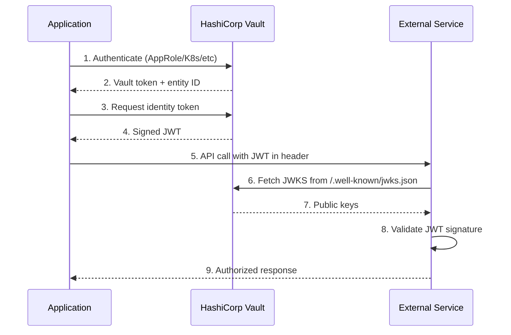
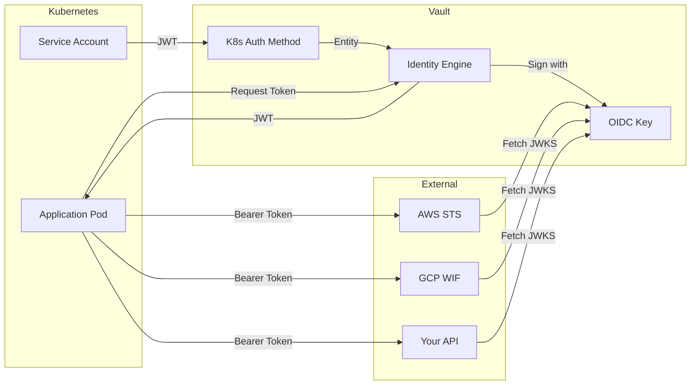

# How to Create Vault Identity Tokens

Author: [nawazdhandala](https://github.com/nawazdhandala)

Tags: Vault, Security, Identity, JWT

Description: Generate short-lived identity tokens in HashiCorp Vault for workload authentication to external services without managing static secrets.

---

Vault Identity Tokens let workloads prove their identity to external services using signed JWTs. Instead of distributing long-lived API keys or certificates, your applications request short-lived tokens from Vault. External services validate these tokens using Vault's OIDC discovery endpoint. No shared secrets required.

## How Identity Tokens Work

Vault acts as an OIDC identity provider. When a workload authenticates to Vault (via AppRole, Kubernetes auth, or any other method), it receives an identity. That identity can then request a signed JWT from Vault. The external service validates the JWT signature using Vault's public keys.



The external service only needs network access to Vault's OIDC discovery endpoint. It never needs to call Vault's authenticated APIs.

## Setting Up Identity Token Generation

### Step 1: Enable the Identity Secrets Engine

The identity secrets engine is enabled by default at the `/identity` path. Verify it exists:

```bash
# List enabled secrets engines
vault secrets list

# Output should include:
# identity/    identity    identity_c8e8d...    system    system    identity store
```

### Step 2: Create an OIDC Key

OIDC keys define the cryptographic parameters for signing tokens. Create a named key that your token roles will reference:

```bash
# Create an OIDC signing key
# algorithm: RS256 (RSA), ES256 (ECDSA), or EdDSA
# allowed_client_ids: which roles can use this key ("*" means all)
vault write identity/oidc/key/workload-key \
    algorithm="RS256" \
    allowed_client_ids="*" \
    rotation_period="24h" \
    verification_ttl="48h"
```

Key parameters explained:

- `algorithm`: The signing algorithm. RS256 is widely supported.
- `rotation_period`: How often Vault rotates the signing key.
- `verification_ttl`: How long old keys remain valid for verification after rotation.

### Step 3: Create a Token Template

Templates control what claims appear in the JWT. Use Go template syntax to include entity metadata:

```bash
# Create a template that includes useful workload information
vault write identity/oidc/role/workload-role \
    key="workload-key" \
    ttl="1h" \
    template='{{- /* Standard JWT claims plus custom workload info */ -}}
{
    "environment": {{.entity.metadata.environment | toJSON}},
    "service": {{.entity.metadata.service | toJSON}},
    "team": {{.entity.metadata.team | toJSON}},
    "entity_name": {{.entity.name | toJSON}},
    "groups": {{.entity.groups | toJSON}}
}'
```

### Step 4: Configure Entity Metadata

For the template to work, entities need metadata. Set metadata when creating entities or through aliases:

```bash
# Update an entity with metadata
# First, find the entity ID for your workload
vault read identity/entity/name/my-app-entity

# Then update its metadata
vault write identity/entity/name/my-app-entity \
    metadata=environment="production" \
    metadata=service="payment-api" \
    metadata=team="platform"
```

## Generating Identity Tokens

### Request a Token Programmatically

Once authenticated to Vault, request an identity token:

```bash
# Request an identity token using the role we created
vault read identity/oidc/token/workload-role

# Output:
# Key          Value
# ---          -----
# client_id    abc123...
# token        eyJhbGciOiJSUzI1NiIsInR5cCI6IkpXVCJ9...
# ttl          3600
```

### Using the Vault API

```bash
# Request token via API
# VAULT_TOKEN must have permission to read from identity/oidc/token/*
curl -s \
    --header "X-Vault-Token: ${VAULT_TOKEN}" \
    "${VAULT_ADDR}/v1/identity/oidc/token/workload-role" | jq

# Response:
# {
#   "data": {
#     "client_id": "abc123...",
#     "token": "eyJhbGciOiJSUzI1NiIsInR5cCI6IkpXVCJ9...",
#     "ttl": 3600
#   }
# }
```

### Decoded Token Structure

A generated token contains these claims:

```json
{
  "aud": "abc123...",
  "exp": 1706659200,
  "iat": 1706655600,
  "iss": "https://vault.example.com/v1/identity/oidc",
  "sub": "entity-id-12345",
  "environment": "production",
  "service": "payment-api",
  "team": "platform",
  "entity_name": "my-app-entity",
  "groups": ["developers", "payment-team"]
}
```

Standard claims:

- `iss`: Vault's OIDC issuer URL
- `sub`: The entity ID requesting the token
- `aud`: The client ID (role identifier)
- `iat`: Issued at timestamp
- `exp`: Expiration timestamp

Custom claims come from your template.

## OIDC Discovery Endpoint

Vault exposes standard OIDC discovery endpoints that external services use to validate tokens.

### Discovery Document

```bash
# Fetch the OIDC discovery document
curl -s "${VAULT_ADDR}/v1/identity/oidc/.well-known/openid-configuration" | jq

# Response:
# {
#   "issuer": "https://vault.example.com/v1/identity/oidc",
#   "jwks_uri": "https://vault.example.com/v1/identity/oidc/.well-known/keys",
#   "authorization_endpoint": "",
#   "token_endpoint": "",
#   "userinfo_endpoint": "",
#   "id_token_signing_alg_values_supported": ["RS256", "RS384", "RS512", "ES256", "ES384", "ES512", "EdDSA"]
# }
```

### JSON Web Key Set (JWKS)

External services fetch public keys from this endpoint:

```bash
# Fetch the JWKS containing public keys for signature verification
curl -s "${VAULT_ADDR}/v1/identity/oidc/.well-known/keys" | jq

# Response:
# {
#   "keys": [
#     {
#       "kty": "RSA",
#       "kid": "key-id-123",
#       "use": "sig",
#       "alg": "RS256",
#       "n": "modulus...",
#       "e": "AQAB"
#     }
#   ]
# }
```

These endpoints are unauthenticated. External services can fetch keys without a Vault token.

## Integrating with External Services

### AWS STS AssumeRoleWithWebIdentity

Use Vault identity tokens to assume AWS IAM roles:

```bash
# Configure AWS to trust Vault as an OIDC provider
# In AWS IAM, create an Identity Provider pointing to Vault's issuer URL

# Request a Vault identity token
VAULT_JWT=$(vault read -field=token identity/oidc/token/aws-role)

# Assume an AWS role using the token
aws sts assume-role-with-web-identity \
    --role-arn "arn:aws:iam::123456789012:role/VaultWorkloadRole" \
    --role-session-name "vault-workload" \
    --web-identity-token "$VAULT_JWT"
```

AWS IAM trust policy:

```json
{
  "Version": "2012-10-17",
  "Statement": [
    {
      "Effect": "Allow",
      "Principal": {
        "Federated": "arn:aws:iam::123456789012:oidc-provider/vault.example.com"
      },
      "Action": "sts:AssumeRoleWithWebIdentity",
      "Condition": {
        "StringEquals": {
          "vault.example.com:sub": "entity-id-12345"
        }
      }
    }
  ]
}
```

### GCP Workload Identity Federation

Configure GCP to accept Vault tokens:

```bash
# Create a workload identity pool in GCP
gcloud iam workload-identity-pools create vault-pool \
    --location="global" \
    --display-name="Vault Identity Pool"

# Create a provider for Vault
gcloud iam workload-identity-pools providers create-oidc vault-provider \
    --location="global" \
    --workload-identity-pool="vault-pool" \
    --issuer-uri="https://vault.example.com/v1/identity/oidc" \
    --attribute-mapping="google.subject=assertion.sub,attribute.service=assertion.service"

# Grant the workload identity permission to impersonate a service account
gcloud iam service-accounts add-iam-policy-binding \
    my-service@project.iam.gserviceaccount.com \
    --role="roles/iam.workloadIdentityUser" \
    --member="principalSet://iam.googleapis.com/projects/PROJECT_NUMBER/locations/global/workloadIdentityPools/vault-pool/attribute.service/payment-api"
```

### Custom Service Validation

Validate tokens in your own services using standard JWT libraries:

```python
# Python example using PyJWT
import jwt
import requests

def validate_vault_token(token: str, vault_addr: str, expected_audience: str) -> dict:
    """
    Validate a Vault identity token.

    Args:
        token: The JWT from Vault
        vault_addr: Vault server address (e.g., https://vault.example.com)
        expected_audience: The client_id to validate against

    Returns:
        Decoded token claims if valid

    Raises:
        jwt.InvalidTokenError: If token validation fails
    """
    # Fetch JWKS from Vault's discovery endpoint
    jwks_url = f"{vault_addr}/v1/identity/oidc/.well-known/keys"
    jwks_response = requests.get(jwks_url)
    jwks = jwks_response.json()

    # Create a PyJWKClient for key lookup
    jwk_client = jwt.PyJWKClient(jwks_url)
    signing_key = jwk_client.get_signing_key_from_jwt(token)

    # Validate and decode the token
    claims = jwt.decode(
        token,
        signing_key.key,
        algorithms=["RS256", "ES256", "EdDSA"],
        audience=expected_audience,
        issuer=f"{vault_addr}/v1/identity/oidc"
    )

    return claims


# Usage example
token = "eyJhbGciOiJSUzI1NiIsInR5cCI6IkpXVCJ9..."
claims = validate_vault_token(
    token=token,
    vault_addr="https://vault.example.com",
    expected_audience="abc123..."
)

# Access custom claims
print(f"Service: {claims['service']}")
print(f"Environment: {claims['environment']}")
```

```go
// Go example using go-jose
package main

import (
	"context"
	"fmt"

	"github.com/coreos/go-oidc/v3/oidc"
)

func ValidateVaultToken(ctx context.Context, token, vaultAddr, expectedAudience string) (*oidc.IDToken, error) {
	// Create an OIDC provider using Vault's issuer URL
	issuer := fmt.Sprintf("%s/v1/identity/oidc", vaultAddr)
	provider, err := oidc.NewProvider(ctx, issuer)
	if err != nil {
		return nil, fmt.Errorf("failed to create OIDC provider: %w", err)
	}

	// Configure the verifier with expected audience
	verifier := provider.Verifier(&oidc.Config{
		ClientID: expectedAudience,
	})

	// Verify the token
	idToken, err := verifier.Verify(ctx, token)
	if err != nil {
		return nil, fmt.Errorf("token verification failed: %w", err)
	}

	return idToken, nil
}

// Extract custom claims
type WorkloadClaims struct {
	Environment string   `json:"environment"`
	Service     string   `json:"service"`
	Team        string   `json:"team"`
	Groups      []string `json:"groups"`
}

func GetWorkloadClaims(idToken *oidc.IDToken) (*WorkloadClaims, error) {
	var claims WorkloadClaims
	if err := idToken.Claims(&claims); err != nil {
		return nil, err
	}
	return &claims, nil
}
```

## Token Flow in a Microservices Architecture



## Vault Policy for Identity Tokens

Grant workloads permission to generate identity tokens:

```hcl
# policy.hcl - Allow reading identity tokens for specific roles
path "identity/oidc/token/workload-role" {
  capabilities = ["read"]
}

# Allow reading own entity information
path "identity/entity/id/{{identity.entity.id}}" {
  capabilities = ["read"]
}

# Allow looking up own token info
path "auth/token/lookup-self" {
  capabilities = ["read"]
}
```

Apply the policy:

```bash
# Create the policy
vault policy write workload-identity policy.hcl

# Attach to an auth method (example: Kubernetes auth)
vault write auth/kubernetes/role/my-app \
    bound_service_account_names=my-app \
    bound_service_account_namespaces=production \
    policies=workload-identity \
    ttl=1h
```

## Advanced Template Examples

### Include Group Memberships

```bash
vault write identity/oidc/role/with-groups \
    key="workload-key" \
    ttl="1h" \
    template='
{
    "groups": {{.entity.groups | toJSON}},
    "group_names": [
        {{- range $i, $g := .entity.groups}}
        {{- if $i}},{{end}}
        {{$g.name | toJSON}}
        {{- end}}
    ]
}'
```

### Conditional Claims Based on Metadata

```bash
vault write identity/oidc/role/conditional-claims \
    key="workload-key" \
    ttl="1h" \
    template='
{
    "env": {{.entity.metadata.environment | toJSON}},
    {{- if eq .entity.metadata.environment "production"}}
    "pci_compliant": true,
    "audit_level": "full"
    {{- else}}
    "pci_compliant": false,
    "audit_level": "basic"
    {{- end}}
}'
```

### Include Auth Method Information

```bash
vault write identity/oidc/role/with-auth-info \
    key="workload-key" \
    ttl="1h" \
    template='
{
    "auth_method": {{.entity.aliases | toJSON}},
    "entity_id": {{.entity.id | toJSON}},
    "entity_name": {{.entity.name | toJSON}}
}'
```

## Security Best Practices

### Short Token Lifetimes

Keep TTLs short. One hour is reasonable for most workloads:

```bash
vault write identity/oidc/role/short-lived \
    key="workload-key" \
    ttl="15m"  # 15 minutes for sensitive operations
```

### Rotate Keys Regularly

Configure automatic key rotation:

```bash
vault write identity/oidc/key/workload-key \
    rotation_period="6h" \      # Rotate every 6 hours
    verification_ttl="12h"      # Old keys valid for 12 hours
```

### Restrict Token Audiences

Limit which roles can use each key:

```bash
# Create a key that only specific roles can use
vault write identity/oidc/key/restricted-key \
    algorithm="RS256" \
    allowed_client_ids="client-id-1,client-id-2"
```

### Audit Token Generation

Enable audit logging to track token requests:

```bash
vault audit enable file file_path=/var/log/vault/audit.log

# Token requests appear in audit log:
# {
#   "type": "response",
#   "request": {
#     "path": "identity/oidc/token/workload-role"
#   }
# }
```

## Troubleshooting

### Token Validation Fails

Check the issuer URL matches exactly:

```bash
# Get the configured issuer
vault read identity/oidc/config

# Ensure external services use the same issuer URL
# Common mistake: trailing slash mismatch
```

### Missing Claims in Token

Verify entity metadata is set:

```bash
# Check entity metadata
vault read identity/entity/id/<entity-id>

# Verify template syntax
vault read identity/oidc/role/workload-role
```

### Key Not Found in JWKS

Check key rotation settings:

```bash
# List OIDC keys
vault list identity/oidc/key

# Check key configuration
vault read identity/oidc/key/workload-key

# Ensure verification_ttl is long enough for external caches
```

### Permission Denied

Verify the token has the correct policy:

```bash
# Check token policies
vault token lookup

# Verify policy grants access to identity/oidc/token/*
vault policy read workload-identity
```

---

Vault Identity Tokens provide a clean solution for workload identity federation. Your applications authenticate to Vault once, then use signed JWTs to access any service that supports OIDC. No static credentials to manage, no secrets to rotate, and full audit trails of every token generated.
