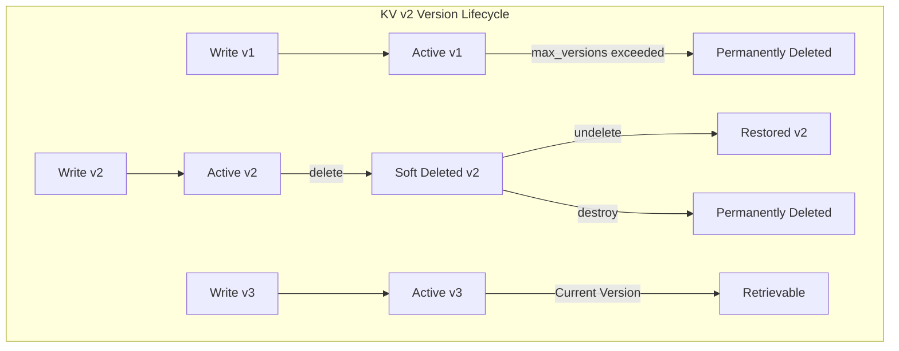
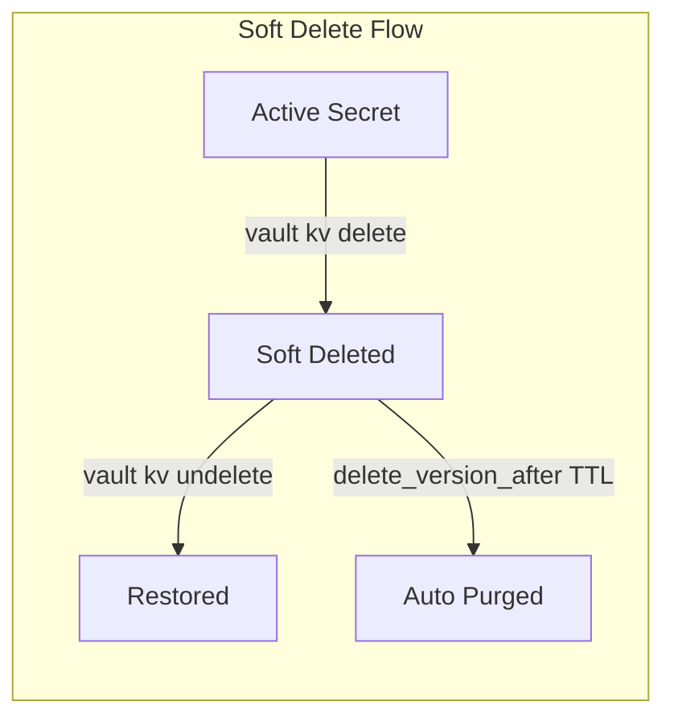
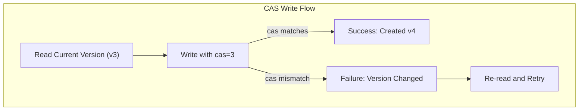

# How to Implement Vault KV Versioning

Author: [nawazdhandala](https://github.com/nawazdhandala)

Tags: Vault, Security, Secrets, Versioning

Description: Learn how to use HashiCorp Vault KV v2 secret versioning to maintain secret history, recover deleted secrets, and implement robust secret lifecycle management.

---

> Secrets change over time. API keys rotate, database passwords update, and certificates renew. Without version history, you lose the ability to audit changes, rollback mistakes, or recover accidentally deleted secrets. Vault KV v2 solves this with built-in versioning.

Secret management requires more than just storage. You need history, recovery, and lifecycle controls.

---

## Overview

The KV v2 secrets engine in HashiCorp Vault provides versioned secret storage. Each write creates a new version while preserving previous versions. This enables auditing, rollback, and recovery workflows.



---

## Enabling KV v2 Secrets Engine

### Enable with Default Configuration

Enable the KV v2 secrets engine at a specific path:

```bash
# Enable KV v2 at the default 'secret' path
vault secrets enable -version=2 -path=secret kv

# Verify the engine is enabled
vault secrets list
```

### Enable with Custom Configuration

Configure max versions and other settings when enabling:

```bash
# Enable KV v2 with custom configuration
vault secrets enable \
    -version=2 \
    -path=app-secrets \
    -description="Application secrets with versioning" \
    kv

# Configure the secrets engine settings
vault write app-secrets/config \
    max_versions=10 \
    cas_required=false \
    delete_version_after="720h"
```

---

## Version Configuration

### Setting Max Versions

Control how many versions to retain per secret:

```bash
# Set global max versions for the mount
vault write secret/config max_versions=5

# Read current configuration
vault read secret/config
```

Output:

```
Key                     Value
---                     -----
cas_required            false
delete_version_after    0s
max_versions            5
```

### Per-Secret Metadata Configuration

Override global settings for specific secrets:

```bash
# Set max versions for a specific secret path
vault kv metadata put -max-versions=15 secret/database/prod

# Set custom delete-version-after for a secret
vault kv metadata put -delete-version-after="168h" secret/api-keys/payment

# Read metadata for a secret
vault kv metadata get secret/database/prod
```

---

## Writing and Reading Versions

### Creating Versions

Each write operation creates a new version:

```bash
# Write initial version (v1)
vault kv put secret/myapp/config \
    db_host="db-1.example.com" \
    db_port="5432" \
    db_user="app_user"

# Write second version (v2) - updates the secret
vault kv put secret/myapp/config \
    db_host="db-2.example.com" \
    db_port="5432" \
    db_user="app_user"

# Write third version (v3) - another update
vault kv put secret/myapp/config \
    db_host="db-3.example.com" \
    db_port="5433" \
    db_user="app_admin"
```

### Reading Specific Versions

Retrieve any version of a secret:

```bash
# Read current (latest) version
vault kv get secret/myapp/config

# Read specific version
vault kv get -version=1 secret/myapp/config

# Read version 2
vault kv get -version=2 secret/myapp/config

# Output as JSON for scripting
vault kv get -format=json -version=1 secret/myapp/config
```

### Version Metadata

View version history and metadata:

```bash
# Get full metadata including all versions
vault kv metadata get secret/myapp/config
```

Output:

```
========== Metadata ==========
Key                     Value
---                     -----
cas_required            false
created_time            2026-01-30T10:00:00.000000Z
current_version         3
delete_version_after    0s
max_versions            0
oldest_version          1
updated_time            2026-01-30T12:30:00.000000Z

====== Version 1 ======
Key              Value
---              -----
created_time     2026-01-30T10:00:00.000000Z
deletion_time    n/a
destroyed        false

====== Version 2 ======
Key              Value
---              -----
created_time     2026-01-30T11:00:00.000000Z
deletion_time    n/a
destroyed        false

====== Version 3 ======
Key              Value
---              -----
created_time     2026-01-30T12:30:00.000000Z
deletion_time    n/a
destroyed        false
```

---

## Delete and Undelete Operations

### Soft Delete (Recoverable)

Soft delete marks versions as deleted but allows recovery:



```bash
# Soft delete the latest version
vault kv delete secret/myapp/config

# Soft delete specific versions
vault kv delete -versions="1,2" secret/myapp/config

# Check metadata - deletion_time will be set
vault kv metadata get secret/myapp/config
```

### Undelete (Recovery)

Recover soft-deleted versions:

```bash
# Undelete specific versions
vault kv undelete -versions="1,2" secret/myapp/config

# Undelete the latest version
vault kv undelete -versions="3" secret/myapp/config

# Verify recovery by reading the version
vault kv get -version=1 secret/myapp/config
```

### Permanent Destruction

Permanently destroy versions (cannot be recovered):

```bash
# Destroy specific versions permanently
vault kv destroy -versions="1" secret/myapp/config

# Destroy multiple versions
vault kv destroy -versions="1,2,3" secret/myapp/config

# Delete all versions and metadata (complete removal)
vault kv metadata delete secret/myapp/config
```

---

## TTL Configuration for Auto-Deletion

### Global Delete Version After

Configure automatic version deletion after a time period:

```bash
# Set versions to auto-delete after 30 days (720 hours)
vault write secret/config delete_version_after="720h"

# Set versions to auto-delete after 90 days
vault write secret/config delete_version_after="2160h"

# Disable auto-deletion (keep versions indefinitely)
vault write secret/config delete_version_after="0s"
```

### Per-Secret TTL Override

Set TTL for specific secrets:

```bash
# Sensitive secrets auto-delete versions after 7 days
vault kv metadata put -delete-version-after="168h" secret/temp-credentials/ci

# Long-term secrets keep versions for 1 year
vault kv metadata put -delete-version-after="8760h" secret/certificates/root-ca
```

---

## API Examples

### Writing Secrets via API

```bash
# Write a new version using the API
curl -X POST \
    -H "X-Vault-Token: $VAULT_TOKEN" \
    -H "Content-Type: application/json" \
    -d '{"data": {"username": "admin", "password": "secret123"}}' \
    "$VAULT_ADDR/v1/secret/data/myapp/credentials"
```

### Reading Specific Versions via API

```bash
# Read the latest version
curl -H "X-Vault-Token: $VAULT_TOKEN" \
    "$VAULT_ADDR/v1/secret/data/myapp/credentials"

# Read a specific version
curl -H "X-Vault-Token: $VAULT_TOKEN" \
    "$VAULT_ADDR/v1/secret/data/myapp/credentials?version=2"
```

### Delete and Undelete via API

```bash
# Soft delete specific versions
curl -X POST \
    -H "X-Vault-Token: $VAULT_TOKEN" \
    -H "Content-Type: application/json" \
    -d '{"versions": [1, 2]}' \
    "$VAULT_ADDR/v1/secret/delete/myapp/credentials"

# Undelete versions
curl -X POST \
    -H "X-Vault-Token: $VAULT_TOKEN" \
    -H "Content-Type: application/json" \
    -d '{"versions": [1, 2]}' \
    "$VAULT_ADDR/v1/secret/undelete/myapp/credentials"

# Permanently destroy versions
curl -X POST \
    -H "X-Vault-Token: $VAULT_TOKEN" \
    -H "Content-Type: application/json" \
    -d '{"versions": [1]}' \
    "$VAULT_ADDR/v1/secret/destroy/myapp/credentials"
```

---

## Programmatic Access with Python

### Complete Version Management Example

```python
# vault_versioning.py
import hvac
import os
from datetime import datetime

def create_vault_client():
    """Create an authenticated Vault client"""
    client = hvac.Client(
        url=os.getenv('VAULT_ADDR', 'http://127.0.0.1:8200'),
        token=os.getenv('VAULT_TOKEN')
    )

    # Verify authentication
    if not client.is_authenticated():
        raise Exception("Vault authentication failed")

    return client

def write_secret_version(client, path, data, mount_point='secret'):
    """Write a new version of a secret"""
    response = client.secrets.kv.v2.create_or_update_secret(
        path=path,
        secret=data,
        mount_point=mount_point
    )

    version = response['data']['version']
    print(f"Created version {version} at path {path}")
    return version

def read_secret_version(client, path, version=None, mount_point='secret'):
    """Read a specific version of a secret (None for latest)"""
    response = client.secrets.kv.v2.read_secret_version(
        path=path,
        version=version,
        mount_point=mount_point
    )

    metadata = response['data']['metadata']
    data = response['data']['data']

    print(f"Read version {metadata['version']} created at {metadata['created_time']}")
    return data, metadata

def get_version_history(client, path, mount_point='secret'):
    """Get the complete version history of a secret"""
    response = client.secrets.kv.v2.read_secret_metadata(
        path=path,
        mount_point=mount_point
    )

    metadata = response['data']
    versions = metadata.get('versions', {})

    print(f"Secret: {path}")
    print(f"Current version: {metadata['current_version']}")
    print(f"Oldest version: {metadata['oldest_version']}")
    print("\nVersion History:")

    for version_num, version_info in sorted(versions.items()):
        status = "destroyed" if version_info['destroyed'] else \
                 "deleted" if version_info['deletion_time'] else "active"
        print(f"  v{version_num}: {status} (created: {version_info['created_time']})")

    return versions

def soft_delete_versions(client, path, versions, mount_point='secret'):
    """Soft delete specific versions (recoverable)"""
    client.secrets.kv.v2.delete_secret_versions(
        path=path,
        versions=versions,
        mount_point=mount_point
    )
    print(f"Soft deleted versions {versions} at path {path}")

def undelete_versions(client, path, versions, mount_point='secret'):
    """Restore soft-deleted versions"""
    client.secrets.kv.v2.undelete_secret_versions(
        path=path,
        versions=versions,
        mount_point=mount_point
    )
    print(f"Restored versions {versions} at path {path}")

def destroy_versions(client, path, versions, mount_point='secret'):
    """Permanently destroy versions (not recoverable)"""
    client.secrets.kv.v2.destroy_secret_versions(
        path=path,
        versions=versions,
        mount_point=mount_point
    )
    print(f"Permanently destroyed versions {versions} at path {path}")

def configure_secret_metadata(client, path, max_versions=None,
                               delete_version_after=None, mount_point='secret'):
    """Configure versioning settings for a specific secret"""
    params = {}

    if max_versions is not None:
        params['max_versions'] = max_versions

    if delete_version_after is not None:
        # Format: "720h" for 30 days
        params['delete_version_after'] = delete_version_after

    client.secrets.kv.v2.update_metadata(
        path=path,
        mount_point=mount_point,
        **params
    )
    print(f"Updated metadata for {path}: {params}")


# Example usage
if __name__ == "__main__":
    client = create_vault_client()
    secret_path = "myapp/database"

    # Write multiple versions
    write_secret_version(client, secret_path, {
        "host": "db-1.example.com",
        "password": "initial-password"
    })

    write_secret_version(client, secret_path, {
        "host": "db-2.example.com",
        "password": "rotated-password-v2"
    })

    write_secret_version(client, secret_path, {
        "host": "db-3.example.com",
        "password": "rotated-password-v3"
    })

    # View version history
    get_version_history(client, secret_path)

    # Read specific version
    data, metadata = read_secret_version(client, secret_path, version=1)
    print(f"Version 1 data: {data}")

    # Soft delete version 1
    soft_delete_versions(client, secret_path, versions=[1])

    # Restore version 1
    undelete_versions(client, secret_path, versions=[1])

    # Configure max versions for this secret
    configure_secret_metadata(client, secret_path, max_versions=5)
```

---

## Check-And-Set (CAS) for Concurrent Writes

### Preventing Concurrent Write Conflicts

CAS ensures you are updating from a known version:



```bash
# Enable CAS requirement for the mount
vault write secret/config cas_required=true

# Write with CAS - must specify current version
vault kv put -cas=0 secret/new-secret key="value"

# Update with CAS - must match current version number
vault kv put -cas=1 secret/new-secret key="updated-value"

# This fails if someone else updated the secret
vault kv put -cas=1 secret/new-secret key="another-value"
# Error: check-and-set parameter did not match the current version
```

### CAS with API

```bash
# Write with CAS using API
curl -X POST \
    -H "X-Vault-Token: $VAULT_TOKEN" \
    -H "Content-Type: application/json" \
    -d '{"options": {"cas": 2}, "data": {"key": "value"}}' \
    "$VAULT_ADDR/v1/secret/data/myapp/config"
```

---

## Rollback Pattern

### Implementing Secret Rollback

```python
# rollback.py
def rollback_to_version(client, path, target_version, mount_point='secret'):
    """Rollback a secret to a previous version by copying its data"""

    # Read the target version
    old_data, old_metadata = read_secret_version(
        client, path, version=target_version, mount_point=mount_point
    )

    # Get current version for CAS
    current_metadata = client.secrets.kv.v2.read_secret_metadata(
        path=path,
        mount_point=mount_point
    )
    current_version = current_metadata['data']['current_version']

    # Write old data as new version (with CAS for safety)
    response = client.secrets.kv.v2.create_or_update_secret(
        path=path,
        secret=old_data,
        cas=current_version,
        mount_point=mount_point
    )

    new_version = response['data']['version']
    print(f"Rolled back from v{current_version} to v{target_version}")
    print(f"Created new version: v{new_version}")

    return new_version


# Example: Rollback after bad deployment
client = create_vault_client()

# Current version has bad credentials, rollback to version 2
rollback_to_version(client, "myapp/database", target_version=2)
```

---

## Best Practices

1. **Set appropriate max_versions** - balance storage costs with recovery needs
2. **Use delete_version_after for compliance** - auto-purge old versions
3. **Enable CAS for critical secrets** - prevent concurrent write conflicts
4. **Implement rollback procedures** - document recovery workflows
5. **Audit version changes** - use Vault audit logs to track modifications
6. **Test undelete operations** - verify recovery works before you need it

---

## Conclusion

Vault KV v2 versioning provides robust secret lifecycle management. Key capabilities:

- **Version history** - every change is tracked
- **Soft delete and recovery** - mistakes can be undone
- **TTL-based cleanup** - automatic version expiration
- **CAS protection** - safe concurrent updates
- **Rollback support** - restore previous configurations

Implement versioning from the start. The small storage overhead is worth the operational safety net when you need to recover from a bad secret rotation or audit historical access.

---

*Managing secrets at scale? [OneUptime](https://oneuptime.com) provides monitoring and alerting for your Vault infrastructure, ensuring your secrets management stays healthy and available.*
