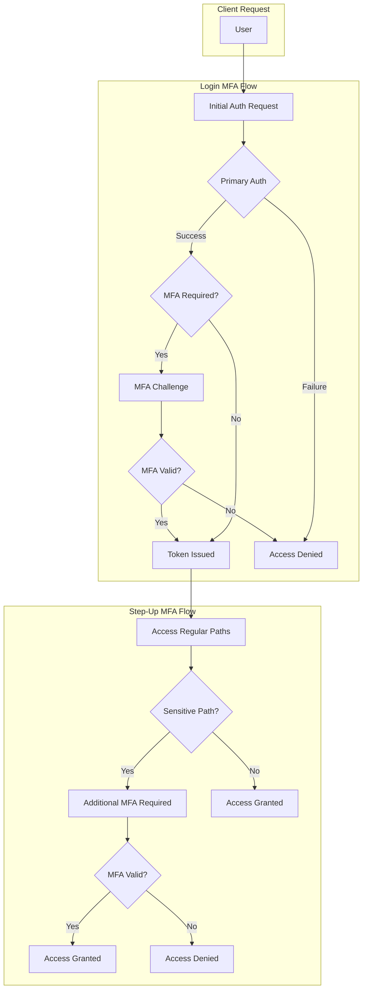
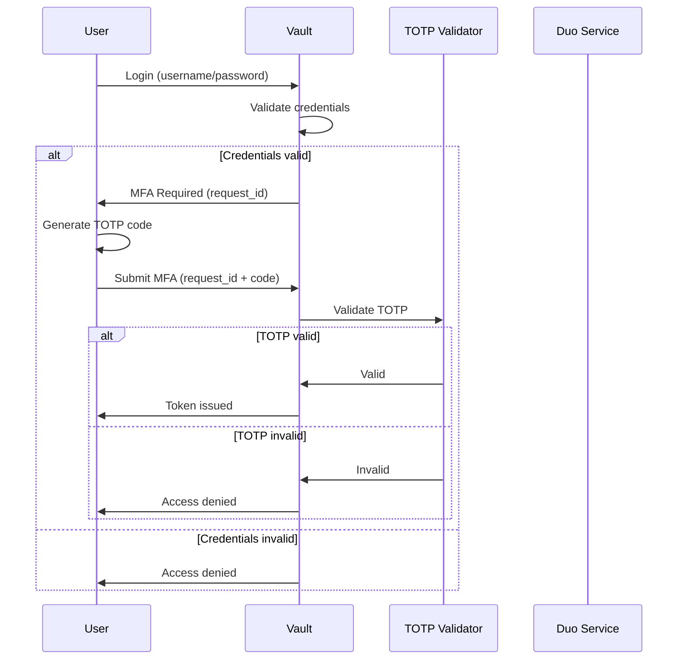
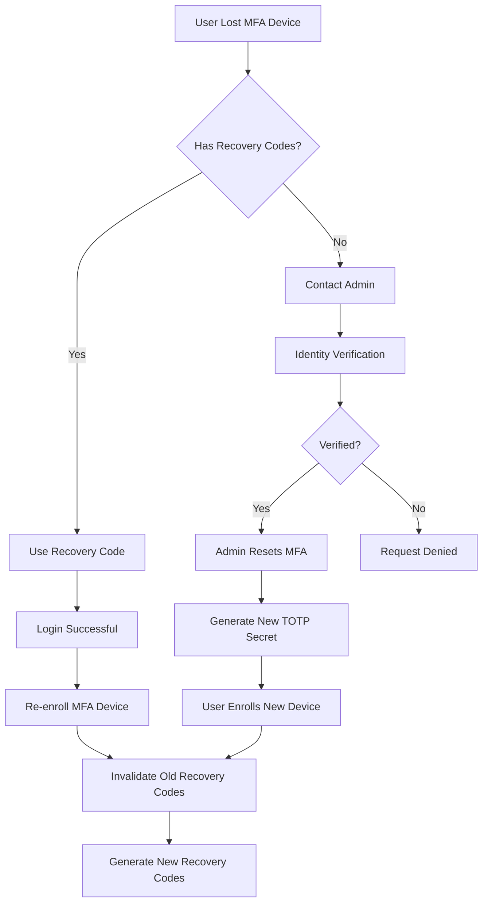

# How to Implement Vault MFA Configuration

Author: [nawazdhandala](https://github.com/nawazdhandala)

Tags: Vault, Security, MFA, Authentication

Description: A comprehensive guide to configuring multi-factor authentication in HashiCorp Vault with TOTP, Duo, and Okta methods.

---

Multi-factor authentication adds a critical security layer to your Vault deployment. Even if credentials are compromised, attackers cannot access secrets without the second factor. This guide covers MFA method configuration, login enforcement, step-up authentication, and recovery options.

## Understanding Vault MFA Architecture

Vault supports MFA at two levels: login MFA (required during authentication) and MFA for sensitive paths (step-up authentication). Understanding this architecture is essential before implementation.



## Enabling MFA Methods

Vault supports several MFA methods. Each has different use cases and security properties.

### TOTP (Time-based One-Time Password)

TOTP is the most common MFA method. Users generate codes with apps like Google Authenticator or Authy.

```bash
# Enable the TOTP MFA method
# This creates a new MFA method named "my-totp"
vault write sys/mfa/method/totp/my-totp \
    issuer="MyCompany" \
    period=30 \
    key_size=20 \
    qr_size=200 \
    algorithm=SHA256 \
    digits=6
```

Explanation of parameters:
- `issuer`: Name shown in authenticator apps
- `period`: How often codes rotate (30 seconds is standard)
- `key_size`: Length of the secret key in bytes
- `qr_size`: Size of the QR code image in pixels
- `algorithm`: Hash algorithm (SHA1, SHA256, or SHA512)
- `digits`: Number of digits in the code (6 or 8)

### Duo Security

Duo provides push notifications, phone calls, and SMS as second factors.

```bash
# Enable Duo MFA method
# Requires Duo Admin Panel credentials
vault write sys/mfa/method/duo/my-duo \
    secret_key="YOUR_DUO_SECRET_KEY" \
    integration_key="YOUR_DUO_INTEGRATION_KEY" \
    api_hostname="api-XXXXXXXX.duosecurity.com" \
    username_format="{{identity.entity.name}}" \
    push_info="Vault Access Request"
```

The `username_format` field uses Go template syntax to extract the username from the authenticated identity. Common options:
- `{{identity.entity.name}}`: Entity name
- `{{identity.entity.aliases.auth_method.name}}`: Username from specific auth method

### Okta Verify

Okta integration provides MFA through Okta Verify app.

```bash
# Enable Okta MFA method
vault write sys/mfa/method/okta/my-okta \
    org_name="your-org" \
    api_token="YOUR_OKTA_API_TOKEN" \
    base_url="okta.com" \
    username_format="{{identity.entity.aliases.auth_method.metadata.username}}" \
    primary_email="true"
```

### PingID

For enterprises using PingIdentity.

```bash
# Enable PingID MFA method
vault write sys/mfa/method/pingid/my-pingid \
    settings_file_base64="$(base64 < pingid_settings.txt)" \
    username_format="{{identity.entity.name}}"
```

## Configuring Login MFA Enforcement

Login MFA requires users to provide a second factor during initial authentication.

### Step 1: Create an MFA Enforcement Configuration

```bash
# Create MFA enforcement that applies to userpass auth
vault write sys/mfa/login-enforcement/require-totp \
    mfa_method_ids="my-totp" \
    auth_method_accessors="auth_userpass_12345" \
    auth_method_types="userpass" \
    identity_group_ids="" \
    identity_entity_ids=""
```

Parameters explained:
- `mfa_method_ids`: List of MFA methods to use
- `auth_method_accessors`: Specific auth method instances
- `auth_method_types`: Auth method types (userpass, ldap, etc.)
- `identity_group_ids`: Apply to specific identity groups
- `identity_entity_ids`: Apply to specific entities

### Step 2: Get Auth Method Accessor

```bash
# List auth methods to find the accessor
vault auth list -detailed

# Output example:
# Path          Type       Accessor                 Description
# ----          ----       --------                 -----------
# userpass/     userpass   auth_userpass_12345      n/a
```

### Step 3: Generate TOTP for a User

```bash
# Admin generates TOTP secret for user
vault write sys/mfa/method/totp/my-totp/admin-generate \
    entity_id="entity-uuid-here" \
    method_name="my-totp"

# Response includes:
# - barcode (base64 PNG of QR code)
# - url (otpauth:// URL for manual entry)
```

### Step 4: User Login with MFA

```bash
# Initial login returns MFA requirement
vault login -method=userpass username=alice password=secret

# Response indicates MFA is required:
# MFA requirement:
#   Key                   Value
#   ---                   -----
#   mfa_request_id        a1b2c3d4-e5f6-7890-abcd-ef1234567890
#   mfa_constraint        my-totp

# Complete login with TOTP code
vault login -method=userpass username=alice password=secret \
    -mfa="my-totp:123456"
```

## MFA Flow Diagram



## Step-Up Authentication for Sensitive Paths

Step-up MFA requires additional authentication when accessing high-value secrets, even after initial login.

### Define Sensitive Paths with ACL Policies

```hcl
# policy-sensitive.hcl
# This policy grants access to sensitive paths but requires MFA

path "secret/data/production/*" {
    capabilities = ["read", "list"]

    # Require MFA for any access to production secrets
    required_parameters = ["mfa_method_name"]

    # Alternative: use control groups for approval workflow
}

path "secret/data/pci/*" {
    capabilities = ["read"]

    # Multiple MFA methods can be required
    mfa {
        method_id = "my-totp"
    }
}
```

### Using Sentinel Policies for MFA (Enterprise)

```python
# sentinel-mfa-policy.sentinel
# Requires Vault Enterprise

import "mfa"
import "strings"

# Define sensitive path patterns
sensitive_paths = [
    "secret/data/production/",
    "secret/data/pci/",
    "database/creds/admin"
]

# Check if path is sensitive
is_sensitive = func(path) {
    for sensitive_paths as pattern {
        if strings.has_prefix(path, pattern) {
            return true
        }
    }
    return false
}

# Main rule
main = rule {
    if is_sensitive(request.path) {
        mfa.methods.my-totp.valid
    } else {
        true
    }
}
```

### Configure MFA for Specific Paths

```bash
# Create a policy requiring MFA for sensitive operations
vault policy write sensitive-access - <<EOF
path "secret/data/production/*" {
    capabilities = ["create", "update", "read", "delete", "list"]

    control_group = {
        factor "mfa" {
            identity {
                group_names = ["admins"]
            }
            controlled_capabilities = ["update", "delete"]
        }
    }
}
EOF

# Apply MFA enforcement to the policy
vault write sys/mfa/login-enforcement/production-access \
    mfa_method_ids="my-totp,my-duo" \
    auth_method_types="userpass,ldap"
```

## Recovery Codes and Bypass Options

Recovery options are critical for business continuity when users lose MFA devices.

### Generating Recovery Codes

```bash
# Generate recovery codes for a user (admin operation)
# These are one-time use codes that bypass MFA

vault write sys/mfa/method/totp/my-totp/admin-generate \
    entity_id="entity-uuid-here" \
    method_name="my-totp"

# Store recovery codes securely
# Example output:
# recovery_codes:
#   - ABCD-EFGH-IJKL
#   - MNOP-QRST-UVWX
#   - 1234-5678-9012
```

### Creating an MFA Bypass Policy

```bash
# Create a special bypass token for emergency access
# Use sparingly and audit all uses

vault write auth/token/create \
    policies="emergency-bypass" \
    ttl="1h" \
    num_uses=1 \
    meta="reason=mfa-recovery" \
    meta="approved_by=security-team"
```

### Implementing a Recovery Workflow



### Admin MFA Reset Procedure

```bash
# Step 1: Verify user identity through out-of-band channel

# Step 2: Destroy existing MFA enrollment
vault delete sys/mfa/method/totp/my-totp/admin-destroy \
    entity_id="entity-uuid-here"

# Step 3: Generate new TOTP enrollment
vault write sys/mfa/method/totp/my-totp/admin-generate \
    entity_id="entity-uuid-here" \
    method_name="my-totp"

# Step 4: Provide QR code to user securely

# Step 5: Log the recovery event
vault audit log -format=json | jq 'select(.request.path | contains("mfa"))'
```

## Multiple MFA Methods Configuration

For high-security environments, require multiple MFA factors.

```bash
# Require both TOTP and Duo for login
vault write sys/mfa/login-enforcement/high-security \
    mfa_method_ids="my-totp,my-duo" \
    auth_method_types="userpass,ldap"
```

### Login with Multiple MFA Methods

```bash
# User must provide both factors
vault login -method=userpass \
    username=alice \
    password=secret \
    -mfa="my-totp:123456" \
    -mfa="my-duo:push"
```

## User Self-Service MFA Enrollment

Allow users to manage their own MFA enrollment.

### Create Self-Service Policy

```hcl
# self-service-mfa.hcl
# Allow users to manage their own MFA

path "identity/mfa/method/totp/generate" {
    capabilities = ["update"]

    # Users can only generate for their own entity
    allowed_parameters = {
        "entity_id" = ["{{identity.entity.id}}"]
    }
}

path "identity/mfa/method/totp/admin-destroy" {
    capabilities = ["update"]

    allowed_parameters = {
        "entity_id" = ["{{identity.entity.id}}"]
    }
}
```

### User Enrollment Script

```bash
#!/bin/bash
# user-mfa-enroll.sh
# Script for users to self-enroll in MFA

set -e

# Get current user's entity ID
ENTITY_ID=$(vault token lookup -format=json | jq -r '.data.entity_id')

if [ -z "$ENTITY_ID" ]; then
    echo "Error: Could not determine entity ID"
    exit 1
fi

# Generate TOTP enrollment
RESULT=$(vault write -format=json sys/mfa/method/totp/my-totp/generate \
    entity_id="$ENTITY_ID")

# Extract QR code URL
URL=$(echo "$RESULT" | jq -r '.data.url')

echo "Scan this QR code with your authenticator app:"
echo "$URL"

# Generate QR code in terminal (requires qrencode)
if command -v qrencode &> /dev/null; then
    echo "$URL" | qrencode -t ANSIUTF8
fi

echo ""
echo "After scanning, verify your setup by logging in with MFA."
```

## Monitoring and Auditing MFA

### Enable Audit Logging

```bash
# Enable file audit device
vault audit enable file file_path=/var/log/vault/audit.log

# Enable syslog audit device
vault audit enable syslog tag="vault" facility="AUTH"
```

### Monitor MFA Events

```bash
# Filter audit logs for MFA events
cat /var/log/vault/audit.log | jq '
    select(
        .request.path | contains("mfa") or
        .auth.mfa_requirement != null
    )
'
```

### Alert on MFA Failures

```bash
#!/bin/bash
# mfa-failure-alert.sh
# Monitor for repeated MFA failures

LOG_FILE="/var/log/vault/audit.log"
THRESHOLD=5
WINDOW=300  # 5 minutes

# Count MFA failures in the last window
FAILURES=$(tail -n 10000 "$LOG_FILE" | jq -r '
    select(.response.error != null and
           (.response.error | contains("mfa")))
    | .time' |
    awk -v window=$WINDOW -v now=$(date +%s) '
    {
        gsub(/T/, " ", $1)
        gsub(/Z/, "", $1)
        cmd = "date -d \"" $1 "\" +%s"
        cmd | getline ts
        close(cmd)
        if (now - ts < window) count++
    }
    END { print count }')

if [ "$FAILURES" -ge "$THRESHOLD" ]; then
    echo "ALERT: $FAILURES MFA failures in the last $WINDOW seconds"
    # Send alert to monitoring system
fi
```

## Best Practices

### Security Recommendations

1. **Require MFA for all human access**: Service accounts may use tokens, but humans should always use MFA
2. **Use hardware tokens for privileged accounts**: YubiKeys provide stronger security than TOTP apps
3. **Implement step-up MFA for destructive operations**: Deleting secrets should require additional verification
4. **Rotate MFA secrets periodically**: Re-enroll users annually
5. **Monitor for MFA bypass attempts**: Alert on unusual patterns

### Operational Recommendations

1. **Document recovery procedures**: Ensure the team knows how to help users who lose devices
2. **Test MFA regularly**: Verify MFA works before an incident occurs
3. **Maintain backup MFA methods**: If Duo is down, TOTP should still work
4. **Train users on MFA**: Explain why MFA matters and how to use it

### Configuration Checklist

- [ ] Enable at least one MFA method
- [ ] Configure login MFA enforcement
- [ ] Set up step-up MFA for sensitive paths
- [ ] Document recovery code procedures
- [ ] Enable audit logging for MFA events
- [ ] Test MFA flow end to end
- [ ] Create runbook for MFA recovery
- [ ] Configure alerts for MFA failures

---

MFA is a fundamental security control that significantly reduces the risk of credential theft. By implementing login MFA, step-up authentication, and proper recovery procedures, you create defense in depth for your secrets management infrastructure. Start with TOTP for broad coverage, add Duo for push notifications, and consider hardware tokens for your most privileged accounts.
