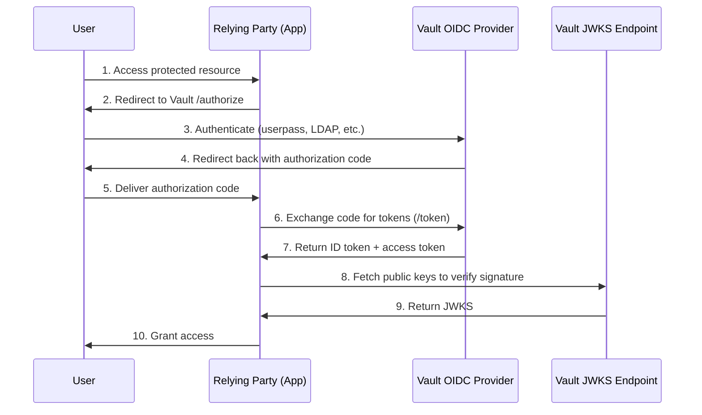
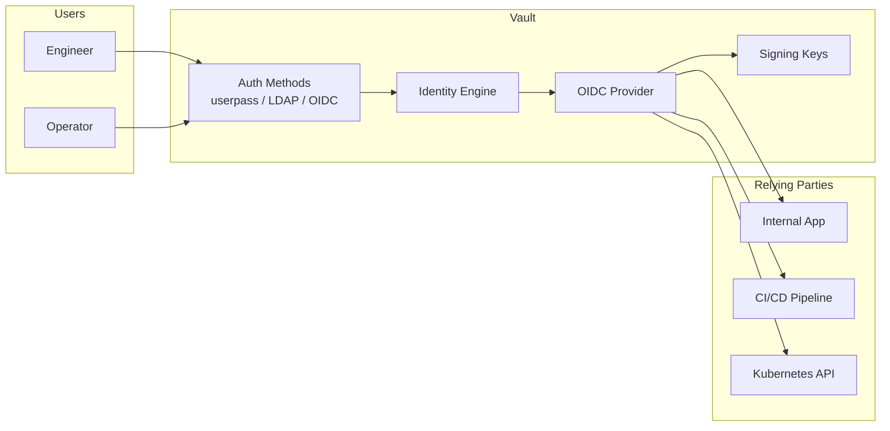

# How to Build Vault OIDC Provider

Author: [nawazdhandala](https://github.com/nawazdhandala)

Tags: Vault, Security, OIDC, Federation

Description: Configure HashiCorp Vault as an OIDC identity provider to federate authentication across your infrastructure and external applications.

---

HashiCorp Vault is widely known for secrets management, but it also ships a full OIDC provider that can issue identity tokens to any standards-compliant relying party. This lets you centralize authentication in Vault and federate identity to Kubernetes, CI/CD pipelines, third-party SaaS, or internal tools without spinning up a separate IdP.

This guide walks through enabling the OIDC provider, registering clients, defining scopes and claims, managing signing keys, and wiring everything together with practical examples.

---

## Why use Vault as an OIDC provider

- **Single source of identity.** Users authenticate once against Vault; downstream services trust the resulting ID token.
- **Fine-grained claims.** You control which metadata (groups, policies, custom attributes) appear in tokens.
- **Built-in key management.** Vault handles key generation, rotation, and JWKS publication automatically.
- **Unified audit trail.** Every token issuance is logged alongside secrets access for a complete security picture.

---

## OIDC authentication flow

The following diagram shows how a user authenticates through Vault and receives an ID token that a relying party can verify.



---

## Enable the OIDC provider

Vault's identity secrets engine must be enabled and the OIDC provider feature turned on. Run these commands against a Vault server with admin privileges.

```bash
# Enable the identity secrets engine (usually enabled by default)
vault secrets enable identity

# Create a named key that will sign ID tokens
vault write identity/oidc/key/app-key \
    rotation_period="24h" \
    verification_ttl="24h" \
    algorithm="RS256"
```

The `app-key` is a logical name you reference later when creating clients. Vault generates and stores the RSA key pair internally.

---

## Register an OIDC client

Each application that will request tokens needs a client registration. Vault calls these "assignments" and "clients."

### Step 1: Create an assignment

Assignments define which Vault entities or groups can obtain tokens for this client.

```bash
# Allow members of the "engineering" group to use this client
vault write identity/oidc/assignment/eng-assignment \
    group_ids="$(vault read -field=id identity/group/name/engineering)"
```

### Step 2: Create the client

```bash
vault write identity/oidc/client/my-app \
    key="app-key" \
    redirect_uris="https://my-app.example.com/callback,http://localhost:8080/callback" \
    assignments="eng-assignment" \
    id_token_ttl="1h" \
    access_token_ttl="1h"
```

Vault returns a `client_id` and `client_secret`. Store the secret securely; you will need it to exchange authorization codes for tokens.

---

## Define scopes and claims

Scopes control which claims appear in the ID token. Vault ships a default `openid` scope, but you can add custom scopes that expose additional user metadata.

### Create a scope template

Templates use Go template syntax and have access to the Vault identity object.

```bash
# Create a scope that exposes group membership
vault write identity/oidc/scope/groups \
    description="Include group names in the token" \
    template='{"groups": {{identity.entity.groups.names}}}'
```

### Create a scope for email

```bash
vault write identity/oidc/scope/email \
    description="Include email address" \
    template='{"email": {{identity.entity.metadata.email}}}'
```

### Attach scopes to an OIDC provider

Vault lets you define a named provider that bundles scopes and determines the issuer URL.

```bash
vault write identity/oidc/provider/main \
    issuer="https://vault.example.com" \
    allowed_client_ids="$(vault read -field=client_id identity/oidc/client/my-app)" \
    scopes_supported="openid,groups,email"
```

The issuer URL must match the external address where relying parties reach Vault.

---

## Key management and rotation

Vault automatically rotates signing keys based on the `rotation_period` you set. Old keys remain available for verification until `verification_ttl` expires, so tokens signed just before rotation can still be validated.

### Manual rotation

```bash
# Force an immediate rotation
vault write -f identity/oidc/key/app-key/rotate
```

### Viewing the JWKS

Relying parties fetch public keys from the well-known endpoint:

```
https://vault.example.com/v1/identity/oidc/provider/main/.well-known/keys
```

Sample response:

```json
{
  "keys": [
    {
      "kty": "RSA",
      "kid": "abc123",
      "alg": "RS256",
      "use": "sig",
      "n": "...",
      "e": "AQAB"
    }
  ]
}
```

---

## Integrate with external applications

### Example: Python Flask app

This snippet shows how a Flask application can validate incoming ID tokens.

```python
# app.py
import os
from flask import Flask, redirect, request, session
from authlib.integrations.flask_client import OAuth

app = Flask(__name__)
app.secret_key = os.environ["FLASK_SECRET"]

# Configure the OIDC client
oauth = OAuth(app)
oauth.register(
    name="vault",
    client_id=os.environ["VAULT_CLIENT_ID"],
    client_secret=os.environ["VAULT_CLIENT_SECRET"],
    # Discovery URL tells authlib where to find endpoints and JWKS
    server_metadata_url="https://vault.example.com/v1/identity/oidc/provider/main/.well-known/openid-configuration",
    client_kwargs={"scope": "openid groups email"},
)

@app.route("/login")
def login():
    # Redirect user to Vault for authentication
    redirect_uri = "https://my-app.example.com/callback"
    return oauth.vault.authorize_redirect(redirect_uri)

@app.route("/callback")
def callback():
    # Exchange the authorization code for tokens
    token = oauth.vault.authorize_access_token()
    # token["id_token"] contains the signed JWT
    # token["userinfo"] contains decoded claims
    session["user"] = token["userinfo"]
    return redirect("/dashboard")

@app.route("/dashboard")
def dashboard():
    user = session.get("user")
    if not user:
        return redirect("/login")
    return f"Hello, {user.get('email')}! Groups: {user.get('groups')}"
```

### Example: Kubernetes OIDC integration

Kubernetes can authenticate users via OIDC tokens issued by Vault. Add the following flags to your API server configuration.

```yaml
# kube-apiserver extra args
apiServer:
  extraArgs:
    oidc-issuer-url: "https://vault.example.com/v1/identity/oidc/provider/main"
    oidc-client-id: "kubernetes"
    oidc-username-claim: "sub"
    oidc-groups-claim: "groups"
    oidc-ca-file: "/etc/kubernetes/pki/vault-ca.crt"
```

Users then authenticate with `kubectl` using an OIDC plugin like `kubelogin`:

```bash
kubectl oidc-login setup \
    --oidc-issuer-url=https://vault.example.com/v1/identity/oidc/provider/main \
    --oidc-client-id=kubernetes \
    --oidc-client-secret=<secret>
```

---

## Architecture overview



---

## Security considerations

- **Restrict redirect URIs.** Only register URIs you control. Wildcards are not supported by design.
- **Use short token TTLs.** One hour or less limits exposure if a token leaks.
- **Rotate keys regularly.** A 24-hour rotation period with matching verification TTL balances security and availability.
- **Audit token issuance.** Enable Vault audit logging and forward events to your SIEM for anomaly detection.
- **Protect the client secret.** Store it in Vault itself or a secrets manager; never commit it to version control.

---

## Troubleshooting

| Symptom | Likely cause | Fix |
|---------|--------------|-----|
| `invalid_client` error | Wrong client ID or secret | Verify values match what Vault returned at client creation |
| Token signature fails | Key rotated, old JWKS cached | Clear relying party JWKS cache or wait for refresh |
| Missing claims in token | Scope not requested or not attached to provider | Add scope to both client request and provider `scopes_supported` |
| `redirect_uri_mismatch` | Callback URL not in registered list | Update client with correct `redirect_uris` |

---

## Wrapping up

Vault's OIDC provider turns your secrets manager into a lightweight identity hub. By defining clients, scopes, and signing keys in one place, you eliminate the need for a standalone IdP while keeping authentication close to your existing Vault policies and audit logs. Start with a single internal application, validate the flow, then expand to Kubernetes, CI runners, and partner integrations as confidence grows.
