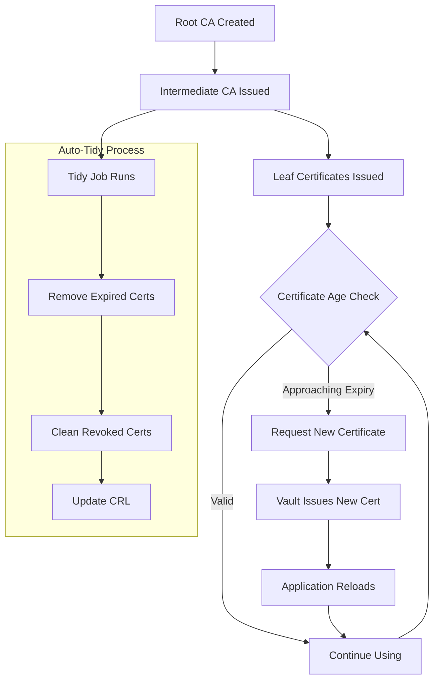
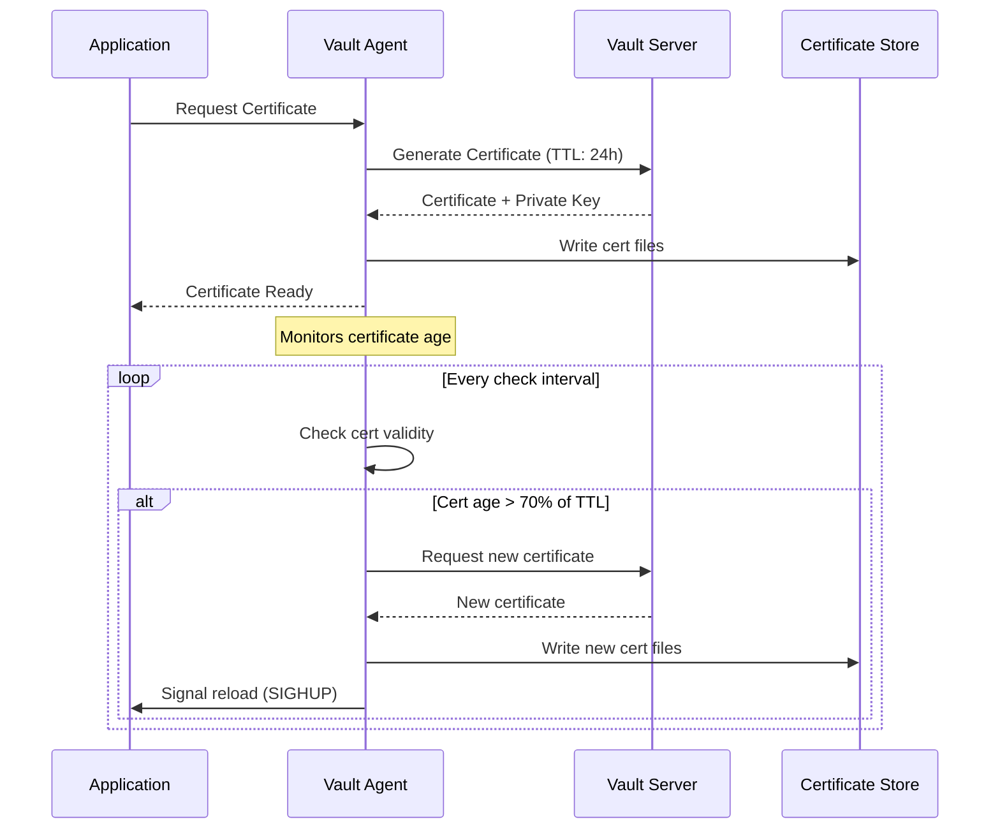
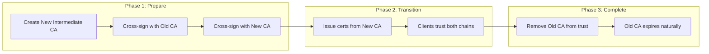

# How to Create Vault PKI Auto-Rotation

Author: [nawazdhandala](https://github.com/nawazdhandala)

Tags: Vault, Security, PKI, Automation

Description: Automate certificate lifecycle management with HashiCorp Vault PKI secrets engine, including auto-tidy, rotation strategies, and cert-manager integration.

---

Managing certificates manually is a recipe for outages. Expired certificates cause downtime, security incidents, and late-night pages. HashiCorp Vault's PKI secrets engine combined with auto-rotation eliminates this toil entirely.

## Certificate Lifecycle Overview

Before diving into configuration, let's understand the complete certificate lifecycle that we're automating.



## Setting Up the PKI Secrets Engine

### Enable and Configure the Root CA

```bash
# Enable the PKI secrets engine for the root CA
# Mount at pki for the root certificate authority
vault secrets enable -path=pki pki

# Set the maximum TTL for the root CA to 10 years
# Root CAs should have long lifetimes since rotating them is disruptive
vault secrets tune -max-lease-ttl=87600h pki

# Generate the root certificate
# This creates a self-signed root CA that will sign intermediate CAs
vault write pki/root/generate/internal \
    common_name="example.com Root CA" \
    issuer_name="root-2024" \
    ttl=87600h \
    key_bits=4096
```

### Configure CRL and OCSP Endpoints

```bash
# Configure the URLs for certificate validation
# These URLs will be embedded in issued certificates
vault write pki/config/urls \
    issuing_certificates="https://vault.example.com:8200/v1/pki/ca" \
    crl_distribution_points="https://vault.example.com:8200/v1/pki/crl" \
    ocsp_servers="https://vault.example.com:8200/v1/pki/ocsp"
```

### Create the Intermediate CA

```bash
# Enable a separate mount for the intermediate CA
# Keeping root and intermediate separate is a security best practice
vault secrets enable -path=pki_int pki

# Set intermediate CA max TTL to 5 years
vault secrets tune -max-lease-ttl=43800h pki_int

# Generate a CSR for the intermediate CA
# The CSR will be signed by the root CA
vault write -format=json pki_int/intermediate/generate/internal \
    common_name="example.com Intermediate CA" \
    issuer_name="intermediate-2024" \
    key_bits=4096 \
    | jq -r '.data.csr' > intermediate.csr

# Sign the intermediate CSR with the root CA
# TTL set to 5 years, shorter than root
vault write -format=json pki/root/sign-intermediate \
    csr=@intermediate.csr \
    format=pem_bundle \
    ttl=43800h \
    | jq -r '.data.certificate' > intermediate.cert

# Import the signed intermediate certificate
vault write pki_int/intermediate/set-signed \
    certificate=@intermediate.cert
```

## Auto-Tidy Configuration for CRL Management

Auto-tidy keeps your PKI backend clean by removing expired certificates and maintaining an accurate CRL (Certificate Revocation List).

### Enable Auto-Tidy

```bash
# Configure automatic tidying of expired certificates
# This runs periodically to clean up the certificate store
vault write pki_int/config/auto-tidy \
    enabled=true \
    interval_duration="12h" \
    tidy_cert_store=true \
    tidy_revoked_certs=true \
    tidy_revoked_cert_issuer_associations=true \
    tidy_expired_issuers=true \
    tidy_move_legacy_ca_bundle=true \
    tidy_acme=true \
    safety_buffer="72h" \
    issuer_safety_buffer="365d" \
    pause_duration="0s"
```

### Understanding Auto-Tidy Parameters

| Parameter | Purpose | Recommended Value |
|-----------|---------|-------------------|
| `interval_duration` | How often tidy runs | 12h for active PKIs |
| `safety_buffer` | Grace period before removing expired certs | 72h minimum |
| `issuer_safety_buffer` | Grace period for expired issuers | 365d (allow recovery time) |
| `tidy_cert_store` | Remove expired certificates | true |
| `tidy_revoked_certs` | Clean up revocation entries | true |
| `tidy_expired_issuers` | Remove expired CA certificates | true |

### Monitor Auto-Tidy Status

```bash
# Check the current tidy status and last run results
vault read pki_int/tidy-status

# Example output:
# Key                         Value
# ---                         -----
# state                       Finished
# error                       <nil>
# time_started                2024-01-15T10:00:00Z
# time_finished               2024-01-15T10:00:45Z
# last_auto_tidy_finished     2024-01-15T10:00:45Z
# cert_store_deleted_count    47
# revoked_cert_deleted_count  12
```

### Manual Tidy Trigger

```bash
# Force an immediate tidy operation
# Useful after bulk revocations or before audits
vault write pki_int/tidy \
    tidy_cert_store=true \
    tidy_revoked_certs=true \
    safety_buffer="24h"
```

## Certificate Rotation Strategies

### Strategy 1: Short-Lived Certificates

Issue certificates with short TTLs and rotate frequently. This minimizes the window of compromise if a certificate is stolen.

```bash
# Create a role for short-lived certificates (24 hours)
# Best for service-to-service communication
vault write pki_int/roles/short-lived \
    allowed_domains="svc.cluster.local,example.com" \
    allow_subdomains=true \
    max_ttl="24h" \
    ttl="12h" \
    key_bits=2048 \
    key_type="rsa" \
    require_cn=false \
    allow_ip_sans=true \
    server_flag=true \
    client_flag=true
```

### Strategy 2: Standard Rotation with Renewal

For certificates that need longer validity but still require rotation.

```bash
# Create a role for standard certificates (90 days)
# Good for external-facing services
vault write pki_int/roles/standard \
    allowed_domains="example.com" \
    allow_subdomains=true \
    max_ttl="2160h" \
    ttl="2160h" \
    key_bits=4096 \
    key_type="rsa" \
    require_cn=true \
    allow_ip_sans=true \
    server_flag=true \
    client_flag=false
```

### Strategy 3: Automated Renewal at Percentage

The rotation lifecycle with percentage-based renewal.



## Vault Agent Configuration for Auto-Rotation

Vault Agent handles certificate renewal automatically. Here's a production configuration.

### Vault Agent Config File

```hcl
# vault-agent.hcl
# Configure Vault Agent for automatic certificate rotation

# How to authenticate to Vault
auto_auth {
  method "kubernetes" {
    mount_path = "auth/kubernetes"
    config = {
      role = "myapp"
    }
  }

  sink "file" {
    config = {
      path = "/vault/token"
      mode = 0644
    }
  }
}

# Certificate template for TLS
template {
  source      = "/vault/templates/cert.tpl"
  destination = "/vault/secrets/tls.crt"
  perms       = 0644

  # Execute this command after rendering
  command     = "sh -c 'kill -HUP $(cat /var/run/nginx.pid) 2>/dev/null || true'"
}

template {
  source      = "/vault/templates/key.tpl"
  destination = "/vault/secrets/tls.key"
  perms       = 0600
}

template {
  source      = "/vault/templates/ca.tpl"
  destination = "/vault/secrets/ca.crt"
  perms       = 0644
}

# Template configuration
template_config {
  static_secret_render_interval = "5m"
  exit_on_retry_failure         = true

  # Renew certificates when 70% of TTL has elapsed
  # For a 24h cert, this means renewal at ~17 hours
  max_connections_per_host      = 10
}

# Vault server connection
vault {
  address = "https://vault.example.com:8200"
  retry {
    num_retries = 5
  }
}
```

### Certificate Templates

```hcl
# /vault/templates/cert.tpl
# Request a new certificate from Vault PKI
{{- with pkiCert "pki_int/issue/short-lived" "common_name=myapp.example.com" "ttl=24h" "alt_names=myapp.svc.cluster.local" -}}
{{ .Cert }}
{{ .CA }}
{{- .Key | writeToFile "/vault/secrets/tls.key" "vault" "vault" "0600" -}}
{{- end -}}
```

```hcl
# /vault/templates/key.tpl
# Key is written by cert.tpl, this just ensures file exists
{{- with pkiCert "pki_int/issue/short-lived" "common_name=myapp.example.com" "ttl=24h" -}}
{{ .Key }}
{{- end -}}
```

```hcl
# /vault/templates/ca.tpl
# CA certificate chain for verification
{{- with secret "pki_int/cert/ca_chain" -}}
{{ .Data.ca_chain }}
{{- end -}}
```

## Integration with cert-manager

cert-manager automates certificate management in Kubernetes and integrates seamlessly with Vault.

### Install cert-manager

```bash
# Install cert-manager with Helm
helm repo add jetstack https://charts.jetstack.io
helm repo update

helm install cert-manager jetstack/cert-manager \
    --namespace cert-manager \
    --create-namespace \
    --set crds.enabled=true \
    --set prometheus.enabled=true
```

### Configure Vault Issuer

```yaml
# vault-issuer.yaml
# ClusterIssuer that connects cert-manager to Vault PKI
apiVersion: cert-manager.io/v1
kind: ClusterIssuer
metadata:
  name: vault-issuer
spec:
  vault:
    # Vault server address
    server: https://vault.example.com:8200

    # Path to the PKI secrets engine
    path: pki_int/sign/standard

    # CA bundle for Vault TLS verification
    caBundle: <base64-encoded-ca-cert>

    # Authentication method
    auth:
      kubernetes:
        # Mount path of the Kubernetes auth method
        mountPath: /v1/auth/kubernetes

        # Role configured in Vault for cert-manager
        role: cert-manager

        # Service account for authentication
        secretRef:
          name: cert-manager-vault-token
          key: token
```

### Create Certificates Automatically

```yaml
# certificate.yaml
# Certificate resource that cert-manager will manage
apiVersion: cert-manager.io/v1
kind: Certificate
metadata:
  name: myapp-tls
  namespace: default
spec:
  # Secret where the certificate will be stored
  secretName: myapp-tls-secret

  # Certificate duration and renewal timing
  duration: 2160h    # 90 days
  renewBefore: 360h  # Renew 15 days before expiry

  # Certificate details
  commonName: myapp.example.com
  dnsNames:
    - myapp.example.com
    - myapp.default.svc.cluster.local
  ipAddresses:
    - 10.0.0.100

  # Use the Vault issuer
  issuerRef:
    name: vault-issuer
    kind: ClusterIssuer
    group: cert-manager.io

  # Private key configuration
  privateKey:
    algorithm: RSA
    size: 4096
    rotationPolicy: Always

  # Additional options
  usages:
    - server auth
    - client auth
```

### Monitor cert-manager Certificates

```bash
# Check certificate status
kubectl get certificates -A

# Detailed certificate info
kubectl describe certificate myapp-tls

# Check certificate requests
kubectl get certificaterequests -A

# View certificate events
kubectl get events --field-selector involvedObject.kind=Certificate
```

## Issuer Rotation and Cross-Signing

When rotating intermediate CAs, cross-signing ensures zero downtime during the transition.

### Cross-Signing Workflow



### Create a New Intermediate CA

```bash
# Generate new intermediate CA key pair
vault write -format=json pki_int/intermediate/generate/internal \
    common_name="example.com Intermediate CA 2025" \
    issuer_name="intermediate-2025" \
    key_bits=4096 \
    | jq -r '.data.csr' > intermediate-2025.csr
```

### Cross-Sign the New CA

```bash
# Sign with the existing root CA (primary trust chain)
vault write -format=json pki/root/sign-intermediate \
    csr=@intermediate-2025.csr \
    format=pem_bundle \
    ttl=43800h \
    | jq -r '.data.certificate' > intermediate-2025-primary.cert

# Cross-sign with the old intermediate (for backward compatibility)
# This creates a certificate that chains to the old intermediate
vault write -format=json pki_int/issuer/intermediate-2024/sign-intermediate \
    csr=@intermediate-2025.csr \
    format=pem_bundle \
    ttl=8760h \
    | jq -r '.data.certificate' > intermediate-2025-cross.cert
```

### Import Both Certificates

```bash
# Import the primary certificate (signed by root)
vault write pki_int/issuers/import/bundle \
    pem_bundle=@intermediate-2025-primary.cert

# Import the cross-signed certificate
vault write pki_int/issuers/import/bundle \
    pem_bundle=@intermediate-2025-cross.cert
```

### Set the Default Issuer

```bash
# Gradually transition to the new issuer
# First, update the default for new certificates
vault write pki_int/config/issuers \
    default="intermediate-2025"

# Verify the configuration
vault read pki_int/config/issuers
```

### Rotation Timeline

| Day | Action |
|-----|--------|
| 0 | Create new intermediate CA, cross-sign |
| 1-7 | Monitor for issues, new certs use new CA |
| 7-30 | Old certificates naturally renew with new CA |
| 30 | Verify no certificates use old CA |
| 60 | Remove old CA from active issuers |
| 365+ | Old CA expires, clean up |

## Practical Example: Full Setup Script

```bash
#!/bin/bash
# setup-vault-pki.sh
# Complete Vault PKI setup with auto-rotation

set -euo pipefail

VAULT_ADDR="${VAULT_ADDR:-https://vault.example.com:8200}"
DOMAIN="example.com"

echo "==> Enabling PKI secrets engines..."

# Root CA
vault secrets enable -path=pki pki 2>/dev/null || true
vault secrets tune -max-lease-ttl=87600h pki

# Intermediate CA
vault secrets enable -path=pki_int pki 2>/dev/null || true
vault secrets tune -max-lease-ttl=43800h pki_int

echo "==> Generating root CA..."
vault write pki/root/generate/internal \
    common_name="${DOMAIN} Root CA" \
    issuer_name="root-$(date +%Y)" \
    ttl=87600h \
    key_bits=4096

echo "==> Configuring URLs..."
vault write pki/config/urls \
    issuing_certificates="${VAULT_ADDR}/v1/pki/ca" \
    crl_distribution_points="${VAULT_ADDR}/v1/pki/crl" \
    ocsp_servers="${VAULT_ADDR}/v1/pki/ocsp"

vault write pki_int/config/urls \
    issuing_certificates="${VAULT_ADDR}/v1/pki_int/ca" \
    crl_distribution_points="${VAULT_ADDR}/v1/pki_int/crl" \
    ocsp_servers="${VAULT_ADDR}/v1/pki_int/ocsp"

echo "==> Generating intermediate CA..."
vault write -format=json pki_int/intermediate/generate/internal \
    common_name="${DOMAIN} Intermediate CA" \
    issuer_name="intermediate-$(date +%Y)" \
    key_bits=4096 \
    | jq -r '.data.csr' > /tmp/intermediate.csr

vault write -format=json pki/root/sign-intermediate \
    csr=@/tmp/intermediate.csr \
    format=pem_bundle \
    ttl=43800h \
    | jq -r '.data.certificate' > /tmp/intermediate.cert

vault write pki_int/intermediate/set-signed \
    certificate=@/tmp/intermediate.cert

echo "==> Configuring auto-tidy..."
vault write pki_int/config/auto-tidy \
    enabled=true \
    interval_duration="12h" \
    tidy_cert_store=true \
    tidy_revoked_certs=true \
    tidy_revoked_cert_issuer_associations=true \
    safety_buffer="72h" \
    issuer_safety_buffer="365d"

echo "==> Creating certificate roles..."

# Short-lived role for internal services
vault write pki_int/roles/internal \
    allowed_domains="svc.cluster.local,${DOMAIN}" \
    allow_subdomains=true \
    max_ttl="24h" \
    ttl="12h" \
    key_bits=2048 \
    require_cn=false \
    allow_ip_sans=true \
    server_flag=true \
    client_flag=true

# Standard role for external services
vault write pki_int/roles/external \
    allowed_domains="${DOMAIN}" \
    allow_subdomains=true \
    max_ttl="2160h" \
    ttl="720h" \
    key_bits=4096 \
    require_cn=true \
    server_flag=true \
    client_flag=false

echo "==> Creating policies..."

# Policy for cert-manager
vault policy write cert-manager - <<EOF
path "pki_int/sign/external" {
  capabilities = ["create", "update"]
}
path "pki_int/sign/internal" {
  capabilities = ["create", "update"]
}
path "pki_int/issue/external" {
  capabilities = ["create"]
}
path "pki_int/issue/internal" {
  capabilities = ["create"]
}
EOF

# Policy for applications
vault policy write app-certs - <<EOF
path "pki_int/issue/internal" {
  capabilities = ["create"]
}
path "pki_int/cert/ca_chain" {
  capabilities = ["read"]
}
EOF

echo "==> Setup complete!"
echo "    Root CA:         pki/root/generate/internal"
echo "    Intermediate CA: pki_int/intermediate"
echo "    Internal certs:  pki_int/issue/internal"
echo "    External certs:  pki_int/issue/external"

# Cleanup temp files
rm -f /tmp/intermediate.csr /tmp/intermediate.cert
```

## Monitoring and Alerting

### Prometheus Metrics

Vault exposes PKI metrics that you should monitor.

```yaml
# prometheus-rules.yaml
# Alert rules for Vault PKI health
groups:
  - name: vault-pki
    rules:
      # Alert when certificates are expiring soon
      - alert: VaultCertificateExpiringSoon
        expr: vault_pki_certificate_expiry_seconds < 86400 * 7
        for: 1h
        labels:
          severity: warning
        annotations:
          summary: "Certificate expiring within 7 days"
          description: "Certificate {{ $labels.common_name }} expires in {{ $value | humanizeDuration }}"

      # Alert when auto-tidy fails
      - alert: VaultAutoTidyFailed
        expr: vault_pki_tidy_failure_count > 0
        for: 5m
        labels:
          severity: critical
        annotations:
          summary: "Vault PKI auto-tidy failed"
          description: "Auto-tidy has failed {{ $value }} times"

      # Alert when CRL is stale
      - alert: VaultCRLStale
        expr: time() - vault_pki_crl_last_update_timestamp > 86400
        for: 1h
        labels:
          severity: warning
        annotations:
          summary: "Vault CRL is stale"
          description: "CRL has not been updated in over 24 hours"
```

### Health Check Script

```bash
#!/bin/bash
# check-pki-health.sh
# Verify PKI infrastructure health

echo "=== Checking Vault PKI Health ==="

# Check if Vault is accessible
if ! vault status > /dev/null 2>&1; then
    echo "ERROR: Cannot connect to Vault"
    exit 1
fi

# Check root CA
echo -n "Root CA: "
ROOT_EXPIRY=$(vault read -format=json pki/cert/ca | jq -r '.data.certificate' | openssl x509 -noout -enddate 2>/dev/null)
echo "$ROOT_EXPIRY"

# Check intermediate CA
echo -n "Intermediate CA: "
INT_EXPIRY=$(vault read -format=json pki_int/cert/ca | jq -r '.data.certificate' | openssl x509 -noout -enddate 2>/dev/null)
echo "$INT_EXPIRY"

# Check auto-tidy status
echo -e "\n=== Auto-Tidy Status ==="
vault read pki_int/tidy-status

# Check CRL
echo -e "\n=== CRL Status ==="
CRL_DATA=$(curl -s "${VAULT_ADDR}/v1/pki_int/crl" | openssl crl -inform DER -noout -lastupdate -nextupdate 2>/dev/null)
echo "$CRL_DATA"

# List active issuers
echo -e "\n=== Active Issuers ==="
vault list pki_int/issuers

# Count certificates
echo -e "\n=== Certificate Counts ==="
CERT_COUNT=$(vault list -format=json pki_int/certs 2>/dev/null | jq 'length')
echo "Total certificates: ${CERT_COUNT:-0}"

echo -e "\n=== Health Check Complete ==="
```

## Troubleshooting Common Issues

### Certificate Not Renewing

```bash
# Check Vault Agent logs
kubectl logs -l app=vault-agent -c vault-agent

# Verify template syntax
vault agent -config=vault-agent.hcl -exit-after-auth=true

# Check token permissions
vault token lookup
vault token capabilities pki_int/issue/internal
```

### CRL Not Updating

```bash
# Force CRL rebuild
vault write pki_int/crl/rotate

# Check CRL configuration
vault read pki_int/config/crl

# Verify CRL is accessible
curl -s "${VAULT_ADDR}/v1/pki_int/crl" | openssl crl -inform DER -text
```

### cert-manager Issues

```bash
# Check issuer status
kubectl describe clusterissuer vault-issuer

# Check certificate request
kubectl describe certificaterequest -l app=myapp

# View cert-manager logs
kubectl logs -n cert-manager -l app=cert-manager

# Test Vault connectivity from cluster
kubectl run vault-test --rm -it --image=curlimages/curl -- \
    curl -s "${VAULT_ADDR}/v1/sys/health"
```

---

Automated certificate rotation with Vault eliminates one of the most common causes of production outages. Configure auto-tidy, set up proper monitoring, and your certificates will manage themselves. The initial setup takes a few hours, but you'll never wake up to an expired certificate again.
