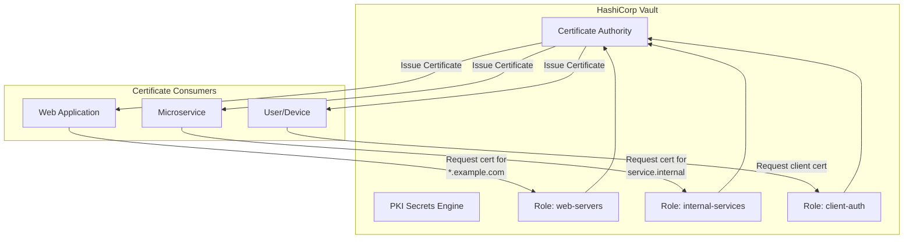
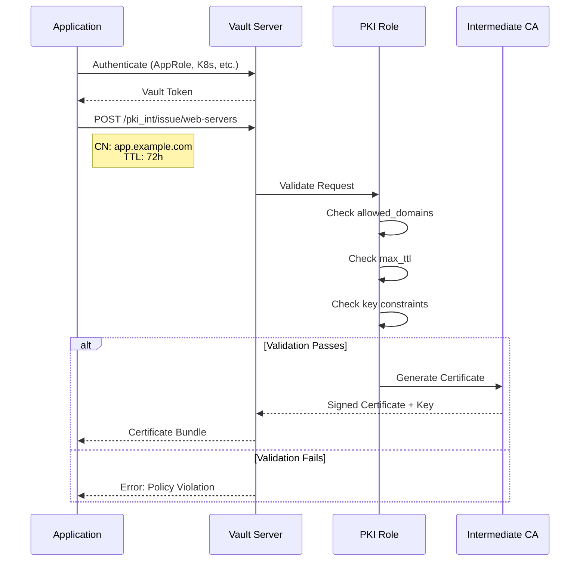

# How to Implement Vault PKI Certificate Roles

Author: [nawazdhandala](https://github.com/nawazdhandala)

Tags: Vault, Security, PKI, Certificates

Description: A comprehensive guide to configuring PKI certificate roles in HashiCorp Vault for secure and automated certificate issuance.

---

HashiCorp Vault's PKI secrets engine lets you run your own Certificate Authority. But the real power comes from PKI roles, which define what certificates can be issued and to whom. Roles are the policy layer between your CA and certificate consumers.

## Understanding PKI Roles

A PKI role is a named configuration that specifies what kind of certificates can be issued. Think of it as a template with constraints.



## Setting Up the PKI Secrets Engine

Before creating roles, you need a functioning PKI backend.

### Enable PKI and Generate Root CA

```bash
# Enable the PKI secrets engine at the default path
vault secrets enable pki

# Configure maximum lease TTL to 10 years for root CA
vault secrets tune -max-lease-ttl=87600h pki

# Generate the root CA certificate
vault write pki/root/generate/internal \
    common_name="Example Root CA" \
    ttl=87600h \
    key_bits=4096 \
    exclude_cn_from_sans=true
```

### Set Up Intermediate CA (Recommended for Production)

```bash
# Enable a separate mount for intermediate CA
vault secrets enable -path=pki_int pki

# Configure intermediate CA TTL (5 years)
vault secrets tune -max-lease-ttl=43800h pki_int

# Generate intermediate CSR
vault write -format=json pki_int/intermediate/generate/internal \
    common_name="Example Intermediate CA" \
    key_bits=4096 \
    | jq -r '.data.csr' > intermediate.csr

# Sign intermediate with root CA
vault write -format=json pki/root/sign-intermediate \
    csr=@intermediate.csr \
    format=pem_bundle \
    ttl=43800h \
    | jq -r '.data.certificate' > signed_intermediate.crt

# Import signed intermediate certificate
vault write pki_int/intermediate/set-signed \
    certificate=@signed_intermediate.crt
```

## Creating PKI Roles

Roles define the boundaries for certificate issuance. Each role should serve a specific use case.

### Basic Role Configuration

```bash
# Create a role for web server certificates
vault write pki_int/roles/web-servers \
    allowed_domains="example.com,example.org" \
    allow_subdomains=true \
    max_ttl="720h" \
    key_bits=2048 \
    key_type="rsa" \
    allow_ip_sans=false \
    server_flag=true \
    client_flag=false
```

### Role Parameters Explained

| Parameter | Description | Example |
|-----------|-------------|---------|
| `allowed_domains` | List of domains this role can issue certs for | `example.com,example.org` |
| `allow_subdomains` | Allow certificates for subdomains | `true` |
| `allow_bare_domains` | Allow certs for the domain itself (not just subdomains) | `false` |
| `allow_glob_domains` | Allow glob patterns in names | `false` |
| `allow_any_name` | Allow any CN (dangerous) | `false` |
| `max_ttl` | Maximum certificate lifetime | `720h` |
| `ttl` | Default certificate lifetime | `72h` |

## Domain Constraints and Allowed Domains

Domain restrictions are critical for security. They prevent certificates from being issued for unauthorized domains.

### Strict Domain Locking

```bash
# Role that only allows specific subdomains
vault write pki_int/roles/api-servers \
    allowed_domains="api.example.com" \
    allow_subdomains=false \
    allow_bare_domains=true \
    enforce_hostnames=true \
    max_ttl="168h"
```

### Wildcard and Glob Patterns

```bash
# Allow wildcard certificates
vault write pki_int/roles/wildcard-certs \
    allowed_domains="example.com" \
    allow_subdomains=true \
    allow_bare_domains=false \
    allow_wildcard_certificates=true \
    max_ttl="720h"

# Allow glob patterns for more flexibility
vault write pki_int/roles/internal-services \
    allowed_domains="*.internal.example.com" \
    allow_glob_domains=true \
    allow_subdomains=true \
    max_ttl="168h"
```

### Multi-Domain Certificates (SAN)

```bash
# Role allowing multiple SANs from different domains
vault write pki_int/roles/multi-domain \
    allowed_domains="example.com,example.org,example.net" \
    allow_subdomains=true \
    allow_bare_domains=true \
    max_ttl="720h" \
    # Limit number of SANs
    allowed_other_sans="" \
    allowed_uri_sans=""
```

## Certificate Issuance Flow



## Key Usage and Extended Key Usage

Key usage defines what operations the certificate can perform. Extended key usage provides more specific application-level restrictions.

### Server Authentication Role

```bash
# Role for TLS server certificates
vault write pki_int/roles/tls-server \
    allowed_domains="example.com" \
    allow_subdomains=true \
    key_usage="DigitalSignature,KeyEncipherment" \
    ext_key_usage="ServerAuth" \
    server_flag=true \
    client_flag=false \
    max_ttl="720h"
```

### Client Authentication Role

```bash
# Role for mTLS client certificates
vault write pki_int/roles/mtls-client \
    allowed_domains="clients.example.com" \
    allow_subdomains=true \
    key_usage="DigitalSignature" \
    ext_key_usage="ClientAuth" \
    server_flag=false \
    client_flag=true \
    max_ttl="168h" \
    # Organizational constraints
    organization="Example Corp" \
    ou="Engineering"
```

### Dual-Purpose Role (Server and Client Auth)

```bash
# Role for services that need both server and client auth
vault write pki_int/roles/service-mesh \
    allowed_domains="mesh.internal" \
    allow_subdomains=true \
    key_usage="DigitalSignature,KeyEncipherment" \
    ext_key_usage="ServerAuth,ClientAuth" \
    server_flag=true \
    client_flag=true \
    max_ttl="24h" \
    # Short TTL for service mesh
    ttl="1h"
```

### Code Signing Role

```bash
# Role for code signing certificates
vault write pki_int/roles/code-signing \
    allowed_domains="build.example.com" \
    allow_subdomains=false \
    allow_bare_domains=true \
    key_usage="DigitalSignature" \
    ext_key_usage="CodeSigning" \
    server_flag=false \
    client_flag=false \
    max_ttl="8760h" \
    key_bits=4096
```

## TTL and Maximum TTL Settings

TTL (Time To Live) controls certificate lifetime. Shorter TTLs reduce risk but increase operational overhead.

### TTL Strategy by Use Case

```bash
# Short-lived certificates for ephemeral workloads (Kubernetes pods)
vault write pki_int/roles/k8s-pods \
    allowed_domains="pod.cluster.local" \
    allow_subdomains=true \
    ttl="1h" \
    max_ttl="4h" \
    generate_lease=true \
    no_store=true

# Medium TTL for internal services
vault write pki_int/roles/internal-services \
    allowed_domains="internal.example.com" \
    allow_subdomains=true \
    ttl="168h" \
    max_ttl="720h"

# Longer TTL for external-facing certificates (still shorter than public CAs)
vault write pki_int/roles/external-web \
    allowed_domains="example.com" \
    allow_subdomains=true \
    ttl="720h" \
    max_ttl="2160h"
```

### TTL Recommendations

| Use Case | Default TTL | Max TTL | Rationale |
|----------|-------------|---------|-----------|
| Service Mesh (Istio, Linkerd) | 1h | 24h | Frequent rotation, automated renewal |
| Kubernetes Pods | 1h | 4h | Short-lived workloads |
| Internal APIs | 7d | 30d | Balance security and operations |
| External Web Servers | 30d | 90d | Manual renewal processes |
| IoT Devices | 90d | 365d | Limited update capabilities |

## Practical Code Examples

### Issuing a Certificate via CLI

```bash
# Issue a certificate using the web-servers role
vault write pki_int/issue/web-servers \
    common_name="app.example.com" \
    alt_names="www.app.example.com,api.app.example.com" \
    ttl="168h"
```

### Issuing a Certificate via API (curl)

```bash
# Set your Vault token
export VAULT_TOKEN="hvs.your-token-here"
export VAULT_ADDR="https://vault.example.com:8200"

# Request a certificate
curl --silent \
    --header "X-Vault-Token: $VAULT_TOKEN" \
    --request POST \
    --data '{
        "common_name": "api.example.com",
        "ttl": "72h",
        "format": "pem"
    }' \
    "$VAULT_ADDR/v1/pki_int/issue/web-servers" | jq
```

### Issuing a Certificate in Python

```python
import hvac
import json

# Initialize the Vault client
client = hvac.Client(
    url='https://vault.example.com:8200',
    token='hvs.your-token-here'
)

# Issue a certificate using the PKI role
response = client.secrets.pki.generate_certificate(
    name='web-servers',  # Role name
    common_name='myapp.example.com',
    extra_params={
        'ttl': '168h',
        'alt_names': 'www.myapp.example.com',
        'ip_sans': '10.0.0.50',
        'format': 'pem'
    },
    mount_point='pki_int'
)

# Extract certificate components
certificate = response['data']['certificate']
private_key = response['data']['private_key']
ca_chain = response['data']['ca_chain']

# Save to files
with open('cert.pem', 'w') as f:
    f.write(certificate)

with open('key.pem', 'w') as f:
    f.write(private_key)

with open('ca-chain.pem', 'w') as f:
    f.write('\n'.join(ca_chain))

print(f"Certificate issued, expires: {response['data']['expiration']}")
```

### Issuing a Certificate in Go

```go
package main

import (
    "context"
    "fmt"
    "log"
    "os"

    vault "github.com/hashicorp/vault/api"
)

func main() {
    // Configure Vault client
    config := vault.DefaultConfig()
    config.Address = "https://vault.example.com:8200"

    client, err := vault.NewClient(config)
    if err != nil {
        log.Fatalf("Failed to create Vault client: %v", err)
    }

    // Set token (in production, use AppRole or other auth method)
    client.SetToken(os.Getenv("VAULT_TOKEN"))

    // Request certificate from PKI role
    secret, err := client.Logical().Write("pki_int/issue/web-servers", map[string]interface{}{
        "common_name": "service.example.com",
        "ttl":         "72h",
        "alt_names":   "service-alt.example.com",
    })
    if err != nil {
        log.Fatalf("Failed to issue certificate: %v", err)
    }

    // Extract certificate data
    cert := secret.Data["certificate"].(string)
    key := secret.Data["private_key"].(string)
    caChain := secret.Data["ca_chain"].([]interface{})

    // Write certificate to file
    os.WriteFile("cert.pem", []byte(cert), 0644)
    os.WriteFile("key.pem", []byte(key), 0600)

    fmt.Printf("Certificate issued successfully\n")
    fmt.Printf("Serial: %s\n", secret.Data["serial_number"])
}
```

### Kubernetes Integration with cert-manager

```yaml
# Install Vault issuer for cert-manager
apiVersion: cert-manager.io/v1
kind: ClusterIssuer
metadata:
  name: vault-issuer
spec:
  vault:
    server: https://vault.example.com:8200
    path: pki_int/sign/web-servers  # PKI role path
    auth:
      kubernetes:
        mountPath: /v1/auth/kubernetes
        role: cert-manager
        secretRef:
          name: cert-manager-vault-token
          key: token
---
# Request a certificate
apiVersion: cert-manager.io/v1
kind: Certificate
metadata:
  name: app-tls
  namespace: production
spec:
  secretName: app-tls-secret
  duration: 720h
  renewBefore: 360h
  commonName: app.example.com
  dnsNames:
    - app.example.com
    - www.app.example.com
  issuerRef:
    name: vault-issuer
    kind: ClusterIssuer
```

## Role Security Best Practices

### Principle of Least Privilege

```bash
# Bad: Overly permissive role
vault write pki_int/roles/dangerous \
    allow_any_name=true \
    enforce_hostnames=false \
    max_ttl="8760h"

# Good: Tightly scoped role
vault write pki_int/roles/secure \
    allowed_domains="specific-service.internal.example.com" \
    allow_subdomains=false \
    allow_bare_domains=true \
    enforce_hostnames=true \
    max_ttl="168h" \
    require_cn=true
```

### Vault Policy for Role Access

```hcl
# policy-web-team.hcl
# Allow web team to issue certificates from web-servers role only
path "pki_int/issue/web-servers" {
  capabilities = ["create", "update"]
}

path "pki_int/sign/web-servers" {
  capabilities = ["create", "update"]
}

# Allow reading the CA certificate
path "pki_int/ca/pem" {
  capabilities = ["read"]
}

# Deny access to other roles
path "pki_int/issue/*" {
  capabilities = ["deny"]
}

path "pki_int/roles/*" {
  capabilities = ["deny"]
}
```

### Apply the Policy

```bash
# Create the policy
vault policy write web-team policy-web-team.hcl

# Create AppRole for automation
vault write auth/approle/role/web-deploy \
    token_policies="web-team" \
    token_ttl=1h \
    token_max_ttl=4h \
    secret_id_ttl=24h
```

## Monitoring and Auditing

### Enable Audit Logging

```bash
# Enable file audit log
vault audit enable file file_path=/var/log/vault/audit.log

# Enable syslog audit
vault audit enable syslog tag="vault" facility="AUTH"
```

### Certificate Metrics with Prometheus

```yaml
# Vault Prometheus metrics endpoint
# Configure in vault.hcl
telemetry {
  prometheus_retention_time = "30s"
  disable_hostname = true
}
```

### Key Metrics to Monitor

- `vault.secrets.pki.tidy.cert_store_current_entry` - Certificates in store
- `vault.secrets.pki.tidy.revoked_cert_deleted_count` - Revoked certs cleaned up
- Certificate issuance rate by role
- Certificate expiration dates

## Troubleshooting Common Issues

### Error: "common name not allowed by this role"

```bash
# Check role configuration
vault read pki_int/roles/web-servers

# Verify allowed_domains includes your domain
# Verify allow_subdomains is true if requesting subdomain
# Verify allow_bare_domains if requesting root domain
```

### Error: "requested TTL exceeds maximum allowed"

```bash
# Check max_ttl on role
vault read pki_int/roles/web-servers | grep max_ttl

# Check backend max lease TTL
vault read sys/mounts/pki_int | grep max_lease_ttl

# Request with shorter TTL
vault write pki_int/issue/web-servers \
    common_name="app.example.com" \
    ttl="168h"  # Must be less than max_ttl
```

### Error: "permission denied"

```bash
# Check token capabilities
vault token capabilities pki_int/issue/web-servers

# Verify policy grants issue capability
vault policy read <policy-name>
```

## Role Configuration Reference

```bash
# Complete role with all common options
vault write pki_int/roles/complete-example \
    # Domain constraints
    allowed_domains="example.com,example.org" \
    allow_subdomains=true \
    allow_bare_domains=false \
    allow_glob_domains=false \
    allow_wildcard_certificates=true \
    allow_any_name=false \
    enforce_hostnames=true \

    # SAN constraints
    allow_ip_sans=true \
    allowed_uri_sans="spiffe://cluster.local/*" \
    allowed_other_sans="" \

    # Key configuration
    key_type="rsa" \
    key_bits=2048 \
    signature_bits=256 \

    # Usage flags
    key_usage="DigitalSignature,KeyEncipherment" \
    ext_key_usage="ServerAuth,ClientAuth" \
    server_flag=true \
    client_flag=true \
    code_signing_flag=false \
    email_protection_flag=false \

    # TTL settings
    ttl="72h" \
    max_ttl="720h" \

    # Certificate fields
    organization="Example Corp" \
    ou="Engineering" \
    country="US" \
    locality="San Francisco" \
    province="California" \

    # Storage options
    generate_lease=false \
    no_store=false \
    require_cn=true \

    # Policy identifiers (OIDs)
    policy_identifiers="1.3.6.1.4.1.example"
```

---

PKI roles are the enforcement mechanism for your certificate policy. Get them right, and you have a secure, automated certificate infrastructure. Get them wrong, and you have created a shadow CA that can mint certificates for any domain. Start restrictive, audit regularly, and only relax constraints when you have a documented business need.
