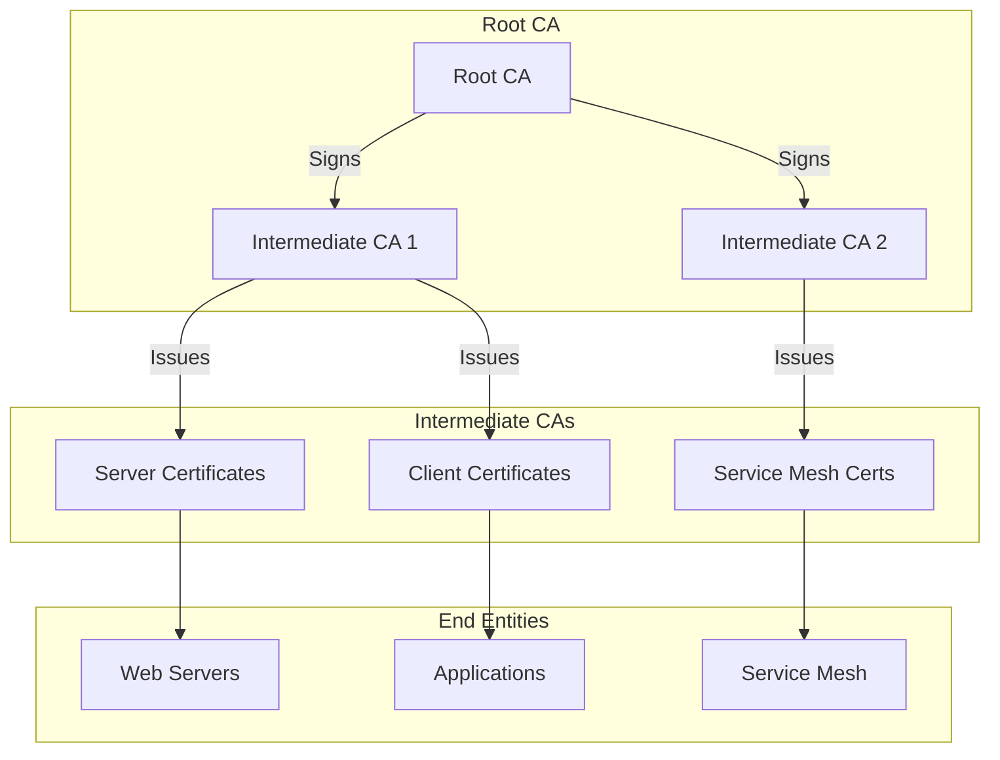
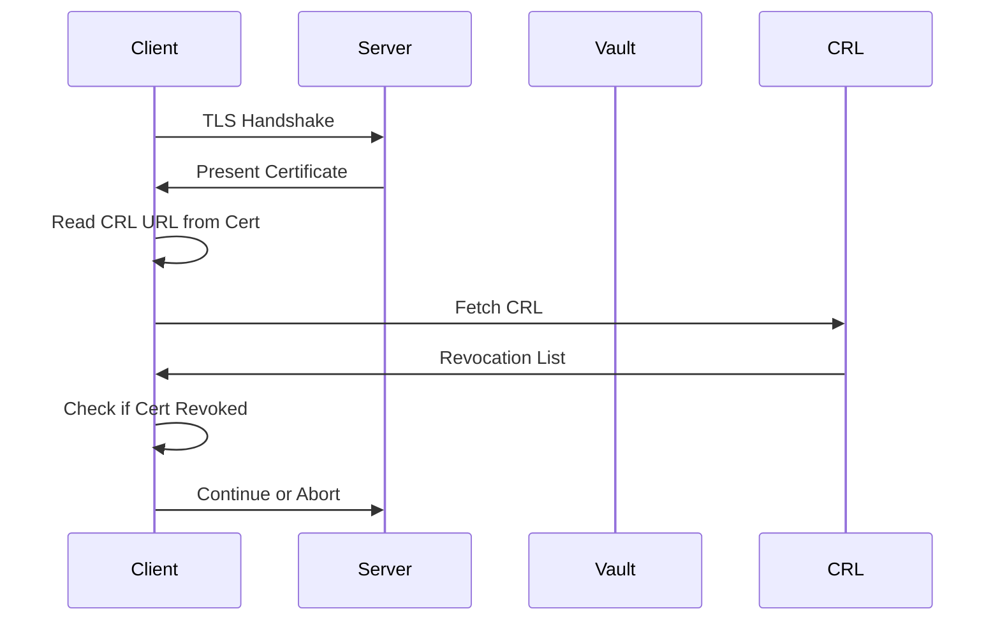
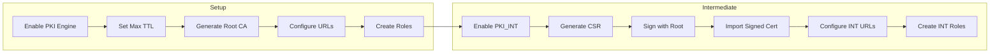

# How to Create Vault PKI Root CA

Author: [nawazdhandala](https://github.com/nawazdhandala)

Tags: Vault, PKI, Certificates, Security

Description: A practical guide to setting up a Root Certificate Authority using HashiCorp Vault's PKI secrets engine.

---

Managing certificates manually is painful. Self-signed certificates scattered across servers, spreadsheets tracking expiration dates, and midnight pages when something expires unexpectedly. HashiCorp Vault solves this with its PKI secrets engine. You can build a proper certificate hierarchy, automate issuance, and forget about certificate management headaches.

## PKI Hierarchy Overview

Before jumping into commands, understand the structure we are building:



The Root CA sits at the top, rarely used and heavily protected. Intermediate CAs handle day-to-day certificate issuance. If an intermediate is compromised, you revoke it without rebuilding the entire PKI.

## Prerequisites

You need a running Vault instance. For testing:

```bash
# Start Vault in dev mode (not for production)
vault server -dev -dev-root-token-id="root"

# In another terminal, set environment variables
export VAULT_ADDR='http://127.0.0.1:8200'
export VAULT_TOKEN='root'
```

For production, use a properly initialized and unsealed Vault cluster with secure storage backend.

## Enable the PKI Secrets Engine

First, enable the PKI engine for your root CA:

```bash
# Enable PKI secrets engine at pki path
vault secrets enable pki

# Set the maximum TTL to 10 years for root CA
vault secrets tune -max-lease-ttl=87600h pki
```

The max-lease-ttl defines how long certificates can be valid. Root CAs typically have long lifetimes (10-20 years), while intermediates and end-entity certificates are much shorter.

## Generate the Root CA Certificate

You have two options: generate internally or import an existing root.

### Option 1: Generate Root CA Internally

```bash
# Generate a root CA certificate
vault write -field=certificate pki/root/generate/internal \
    common_name="Example Organization Root CA" \
    issuer_name="root-2026" \
    ttl=87600h > root_ca.crt

# List the issuers to verify
vault list pki/issuers
```

This creates a self-signed root certificate. The private key never leaves Vault.

### Option 2: Generate CSR for External Signing

If you have an existing root CA or need an external CA to sign:

```bash
# Generate a CSR
vault write -field=csr pki/intermediate/generate/internal \
    common_name="Example Organization Root CA" \
    > root_ca.csr

# Have it signed externally, then import
vault write pki/intermediate/set-signed certificate=@signed_root.crt
```

## Configure CA URLs

Certificates need to point to CRL (Certificate Revocation List) and CA endpoints:

```bash
# Configure the CA and CRL URLs
vault write pki/config/urls \
    issuing_certificates="https://vault.example.com:8200/v1/pki/ca" \
    crl_distribution_points="https://vault.example.com:8200/v1/pki/crl"
```

These URLs get embedded in every certificate issued. Clients use them to verify certificate validity and check revocation status.

## PKI URL Flow



## Create a Role for Certificate Issuance

Roles define certificate templates. They specify allowed domains, key types, and TTLs:

```bash
# Create a role for issuing server certificates
vault write pki/roles/server-certs \
    allowed_domains="example.com" \
    allow_subdomains=true \
    max_ttl="720h" \
    key_type="rsa" \
    key_bits=4096 \
    require_cn=true \
    allow_ip_sans=true \
    allow_localhost=false
```

Role parameters explained:

| Parameter | Description |
|-----------|-------------|
| allowed_domains | Base domains allowed in certificates |
| allow_subdomains | Permit subdomains of allowed_domains |
| max_ttl | Maximum certificate lifetime |
| key_type | RSA or EC key type |
| key_bits | Key size (2048, 4096 for RSA) |
| require_cn | Require Common Name field |
| allow_ip_sans | Allow IP addresses in SAN |

## Issue Your First Certificate

With the role configured, request a certificate:

```bash
# Issue a certificate
vault write pki/issue/server-certs \
    common_name="api.example.com" \
    alt_names="api-internal.example.com" \
    ip_sans="10.0.0.50" \
    ttl="720h"
```

Output includes the certificate, private key, CA chain, and serial number. The private key is generated fresh for each request and not stored in Vault.

## Set Up an Intermediate CA

Production deployments should use intermediate CAs for daily operations. Keep the root CA offline or heavily restricted.

```bash
# Enable PKI for intermediate CA
vault secrets enable -path=pki_int pki

# Set max TTL (shorter than root)
vault secrets tune -max-lease-ttl=43800h pki_int

# Generate intermediate CSR
vault write -format=json pki_int/intermediate/generate/internal \
    common_name="Example Organization Intermediate CA" \
    issuer_name="intermediate-2026" \
    | jq -r '.data.csr' > intermediate.csr

# Sign the intermediate with root CA
vault write -format=json pki/root/sign-intermediate \
    issuer_ref="root-2026" \
    csr=@intermediate.csr \
    format=pem_bundle \
    ttl="43800h" \
    | jq -r '.data.certificate' > intermediate.crt

# Import the signed intermediate certificate
vault write pki_int/intermediate/set-signed \
    certificate=@intermediate.crt
```

## Complete PKI Setup Flow



## Configure Intermediate CA URLs and Roles

```bash
# Configure URLs for intermediate
vault write pki_int/config/urls \
    issuing_certificates="https://vault.example.com:8200/v1/pki_int/ca" \
    crl_distribution_points="https://vault.example.com:8200/v1/pki_int/crl"

# Create role for intermediate CA
vault write pki_int/roles/app-certs \
    allowed_domains="internal.example.com" \
    allow_subdomains=true \
    max_ttl="72h" \
    key_type="ec" \
    key_bits=256 \
    allow_ip_sans=true
```

Now issue certificates from the intermediate:

```bash
vault write pki_int/issue/app-certs \
    common_name="myapp.internal.example.com" \
    ttl="24h"
```

## Revoke a Certificate

When a certificate is compromised or no longer needed:

```bash
# Revoke by serial number
vault write pki/revoke serial_number="39:dd:2e:90:..."

# Or revoke by certificate content
vault write pki/revoke certificate=@compromised.crt

# Rotate the CRL
vault read pki/crl/rotate
```

## Automate Certificate Rotation

Use Vault Agent or cert-manager for automatic renewal:

```bash
# Check certificate expiration
vault write pki/tidy \
    tidy_cert_store=true \
    tidy_revoked_certs=true \
    safety_buffer="72h"
```

For Kubernetes environments, cert-manager integrates directly with Vault:

```yaml
apiVersion: cert-manager.io/v1
kind: Issuer
metadata:
  name: vault-issuer
spec:
  vault:
    server: https://vault.example.com:8200
    path: pki_int/sign/app-certs
    auth:
      kubernetes:
        role: cert-manager
        mountPath: /v1/auth/kubernetes
```

## Best Practices

1. **Keep root CA offline**: Only bring it online to sign intermediates or during disaster recovery
2. **Short-lived certificates**: Use 24-72 hour TTLs for application certificates
3. **Separate intermediates by purpose**: Different intermediates for internal services, external services, and client auth
4. **Monitor CRL size**: Large CRLs slow down TLS handshakes
5. **Enable audit logging**: Track all certificate operations
6. **Test revocation**: Verify clients actually check CRL/OCSP
7. **Document your PKI**: Record root CA procedures, role definitions, and recovery processes

## Troubleshooting

### Certificate Chain Issues

```bash
# Verify the certificate chain
openssl verify -CAfile root_ca.crt -untrusted intermediate.crt server.crt

# Check certificate details
openssl x509 -in server.crt -text -noout
```

### CRL Problems

```bash
# Download and inspect CRL
curl -s https://vault.example.com:8200/v1/pki/crl | openssl crl -inform DER -text

# Force CRL regeneration
vault read pki/crl/rotate
```

### Permission Denied

```bash
# Check your token policies
vault token lookup

# Required policy for issuing certificates
vault policy write pki-issue - <<EOF
path "pki_int/issue/app-certs" {
  capabilities = ["create", "update"]
}
path "pki_int/sign/app-certs" {
  capabilities = ["create", "update"]
}
EOF
```

---

A properly configured Vault PKI eliminates certificate sprawl and manual renewal headaches. Start with a simple setup, add intermediates as you scale, and automate certificate issuance for your applications. Your future self will thank you when certificates renew automatically instead of expiring at 3 AM.
