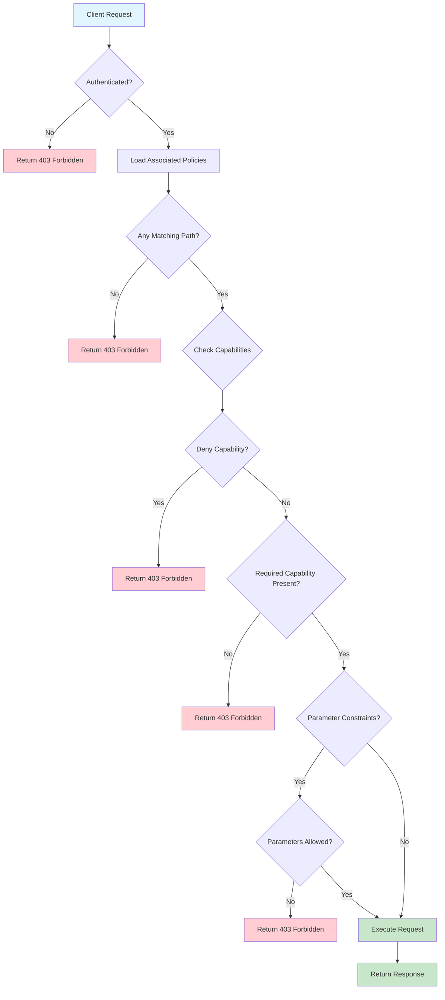
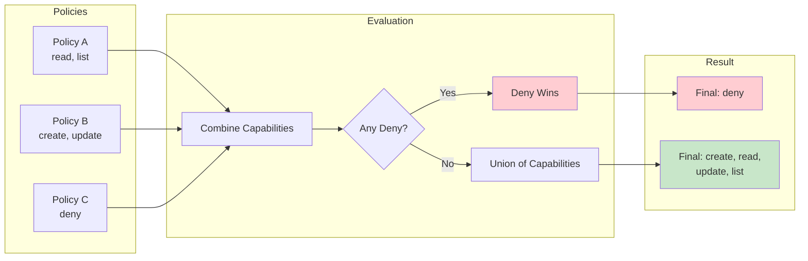

# How to Build Vault Policy Paths

Author: [nawazdhandala](https://github.com/nawazdhandala)

Tags: Vault, Security, Policy, AccessControl

Description: A comprehensive guide to constructing HashiCorp Vault policy paths for fine-grained access control.

---

HashiCorp Vault uses policies to control what secrets and operations users and applications can access. At the heart of Vault's authorization system are policy paths. Understanding how to construct these paths effectively is essential for implementing secure, maintainable access control.

## Policy Path Syntax and Capabilities

A Vault policy consists of one or more path rules. Each rule specifies a path and a set of capabilities that define what operations are allowed on that path.

### Basic Structure

```hcl
# Basic policy structure
path "secret/data/myapp/*" {
  capabilities = ["create", "read", "update", "delete", "list"]
}
```

### Available Capabilities

Vault supports the following capabilities:

| Capability | Description | HTTP Methods |
|------------|-------------|--------------|
| `create` | Create new secrets | POST/PUT (when key does not exist) |
| `read` | Read secrets | GET |
| `update` | Modify existing secrets | POST/PUT (when key exists) |
| `delete` | Remove secrets | DELETE |
| `list` | List keys at a path | LIST |
| `sudo` | Access root-protected paths | Varies |
| `deny` | Explicitly deny access | All (overrides other capabilities) |

### Example: Read-Only Policy

```hcl
# Allow read-only access to application secrets
path "secret/data/production/app/*" {
  capabilities = ["read", "list"]
}

# Deny access to sensitive credentials
path "secret/data/production/app/admin-credentials" {
  capabilities = ["deny"]
}
```

## Glob Patterns and Path Templates

Vault supports glob patterns and templating to create flexible, reusable policies.

### Glob Pattern Types

```hcl
# Single asterisk: matches any characters within a single path segment
# Matches: secret/data/myapp/config
# Does NOT match: secret/data/myapp/nested/config
path "secret/data/myapp/*" {
  capabilities = ["read"]
}

# Plus sign: matches one or more path segments
# Matches: secret/data/myapp/config
# Matches: secret/data/myapp/nested/deep/config
path "secret/data/myapp/+" {
  capabilities = ["read"]
}

# Combine patterns for complex matching
# Matches any path under any environment for myapp
path "secret/data/+/myapp/*" {
  capabilities = ["read"]
}
```

### Path Templating with Identity

Vault supports templating using identity information. This allows dynamic path construction based on the authenticated entity.

```hcl
# Allow users to manage their own secrets
# {{identity.entity.name}} resolves to the authenticated user's name
path "secret/data/users/{{identity.entity.name}}/*" {
  capabilities = ["create", "read", "update", "delete", "list"]
}

# Allow access based on group membership
path "secret/data/teams/{{identity.groups.names}}/*" {
  capabilities = ["read", "list"]
}

# Use entity metadata for dynamic paths
path "secret/data/projects/{{identity.entity.metadata.project_id}}/*" {
  capabilities = ["read"]
}
```

### Practical Template Example

```hcl
# Development team policy with templating
# Each developer can only access their assigned project

path "secret/data/dev/{{identity.entity.metadata.team}}/*" {
  capabilities = ["create", "read", "update", "delete", "list"]
}

path "secret/data/shared/{{identity.entity.metadata.team}}/+" {
  capabilities = ["read", "list"]
}
```

## Policy Evaluation Flow

The following diagram illustrates how Vault evaluates policy paths when a request is made:



## Allowed and Denied Parameters

Vault policies can restrict which parameters can be set when writing secrets or configuring backends.

### Parameter Restrictions

```hcl
# Restrict which keys can be written to a secret
path "secret/data/production/database" {
  capabilities = ["create", "update"]

  # Only allow these specific parameters
  allowed_parameters = {
    "data" = {
      "username" = []
      "password" = []
      "host"     = []
      "port"     = []
    }
  }
}

# Deny specific sensitive parameters
path "secret/data/production/app-config" {
  capabilities = ["create", "update", "read"]

  # Prevent setting these parameters
  denied_parameters = {
    "data" = {
      "admin_password" = []
      "root_token"     = []
    }
  }
}
```

### Parameter Value Constraints

```hcl
# Restrict parameter values to specific options
path "auth/userpass/users/*" {
  capabilities = ["create", "update"]

  allowed_parameters = {
    # Only allow specific policies to be assigned
    "policies" = ["app-readonly", "app-readwrite"]

    # Restrict TTL to specific values
    "token_ttl" = ["1h", "4h", "8h"]
  }
}
```

### Combining Allowed and Denied Parameters

```hcl
# Complex parameter control
path "secret/data/shared/config" {
  capabilities = ["create", "update", "read"]

  # Allow only these parameters
  allowed_parameters = {
    "data" = {
      "api_endpoint" = []
      "api_version"  = ["v1", "v2"]
      "timeout"      = []
      "retry_count"  = []
    }
  }

  # But deny setting timeout to zero
  denied_parameters = {
    "data" = {
      "timeout" = ["0"]
    }
  }
}
```

## Policy Composition and Inheritance

Vault policies are additive. When multiple policies apply to a token, their permissions are combined.

### Policy Combination Rules



### Layered Policy Example

```hcl
# Base policy: common read access for all team members
# File: base-policy.hcl
path "secret/data/shared/*" {
  capabilities = ["read", "list"]
}

path "secret/metadata/shared/*" {
  capabilities = ["read", "list"]
}
```

```hcl
# Developer policy: extends base with write access
# File: developer-policy.hcl
path "secret/data/dev/*" {
  capabilities = ["create", "read", "update", "delete", "list"]
}

path "secret/metadata/dev/*" {
  capabilities = ["read", "list", "delete"]
}

# Developers can read production but not write
path "secret/data/production/*" {
  capabilities = ["read", "list"]
}
```

```hcl
# Admin policy: full access with sudo
# File: admin-policy.hcl
path "secret/*" {
  capabilities = ["create", "read", "update", "delete", "list", "sudo"]
}

path "sys/*" {
  capabilities = ["read", "list", "sudo"]
}

# Even admins cannot access root token paths without explicit sudo
path "auth/token/create-orphan" {
  capabilities = ["create", "sudo"]
}
```

### Applying Multiple Policies

```bash
# Create a token with multiple policies
vault token create \
  -policy="base-policy" \
  -policy="developer-policy" \
  -ttl="8h"

# The resulting token has combined capabilities from both policies
```

## Practical Code Examples

### Complete Application Policy

```hcl
# Application: payment-service
# Environment: production
# Role: Service account with specific access patterns

# Read application configuration
path "secret/data/production/payment-service/config" {
  capabilities = ["read"]
}

# Manage application secrets with rotation
path "secret/data/production/payment-service/credentials/*" {
  capabilities = ["read"]

  # Restrict to specific credential types
  allowed_parameters = {
    "data" = {
      "api_key"      = []
      "api_secret"   = []
      "webhook_key"  = []
    }
  }
}

# Access database credentials through dynamic secrets
path "database/creds/payment-service-role" {
  capabilities = ["read"]
}

# Allow the service to renew its own token
path "auth/token/renew-self" {
  capabilities = ["update"]
}

# Allow looking up its own token info
path "auth/token/lookup-self" {
  capabilities = ["read"]
}

# Access transit encryption for sensitive data
path "transit/encrypt/payment-service-key" {
  capabilities = ["update"]
}

path "transit/decrypt/payment-service-key" {
  capabilities = ["update"]
}
```

### CI/CD Pipeline Policy

```hcl
# Policy for CI/CD pipelines with limited scope

# Read deployment secrets
path "secret/data/+/deployment/*" {
  capabilities = ["read", "list"]
}

# Access specific environment credentials
path "secret/data/{{identity.entity.metadata.environment}}/services/+/deploy-key" {
  capabilities = ["read"]
}

# Generate short-lived tokens for deployments
path "auth/token/create" {
  capabilities = ["create", "update"]

  # Restrict token creation parameters
  allowed_parameters = {
    "policies"    = ["app-deploy-readonly"]
    "ttl"         = ["15m", "30m"]
    "num_uses"    = ["1", "2", "3"]
    "renewable"   = ["false"]
  }
}

# Deny access to production admin paths
path "secret/data/production/admin/*" {
  capabilities = ["deny"]
}
```

### Namespace-Aware Policy

```hcl
# Policy for multi-tenant environments using namespaces

# Access secrets within the team namespace
path "{{identity.entity.aliases.auth_ldap_12345.metadata.namespace}}/secret/data/*" {
  capabilities = ["create", "read", "update", "delete", "list"]
}

# Read shared secrets across namespaces
path "+/secret/data/shared/common-config" {
  capabilities = ["read"]
}

# Manage auth methods within own namespace only
path "{{identity.entity.metadata.namespace}}/auth/*" {
  capabilities = ["read", "list"]
}
```

### Audit and Monitoring Policy

```hcl
# Read-only policy for security auditing

# Access audit logs
path "sys/audit" {
  capabilities = ["read", "list"]
}

# View policy configurations
path "sys/policies/acl/*" {
  capabilities = ["read", "list"]
}

# List auth methods and their configurations
path "sys/auth" {
  capabilities = ["read"]
}

path "sys/auth/*" {
  capabilities = ["read"]
}

# View secret engine mounts
path "sys/mounts" {
  capabilities = ["read"]
}

# Access lease information
path "sys/leases/lookup/*" {
  capabilities = ["read", "list"]
}

# Deny any write operations explicitly
path "sys/*" {
  capabilities = ["deny"]

  # Override deny for specific read paths above
  # Note: More specific paths take precedence
}
```

## Best Practices Summary

1. **Start with least privilege**: Begin with minimal access and add capabilities as needed.

2. **Use explicit deny**: When security is critical, use explicit deny rules for sensitive paths.

3. **Leverage templating**: Use identity templates to create reusable, dynamic policies.

4. **Separate by environment**: Create distinct policies for development, staging, and production.

5. **Document your policies**: Add comments explaining the purpose of each path rule.

6. **Test thoroughly**: Use `vault token capabilities` to verify policy behavior before deployment.

```bash
# Test what capabilities a token has on a path
vault token capabilities secret/data/production/app/config

# Output: read, list
```

7. **Review regularly**: Audit policies periodically to remove unused access and update for new requirements.

Building effective Vault policies requires understanding path syntax, capabilities, and how policies combine. By following these patterns and examples, you can create secure, maintainable access control for your secrets infrastructure.
