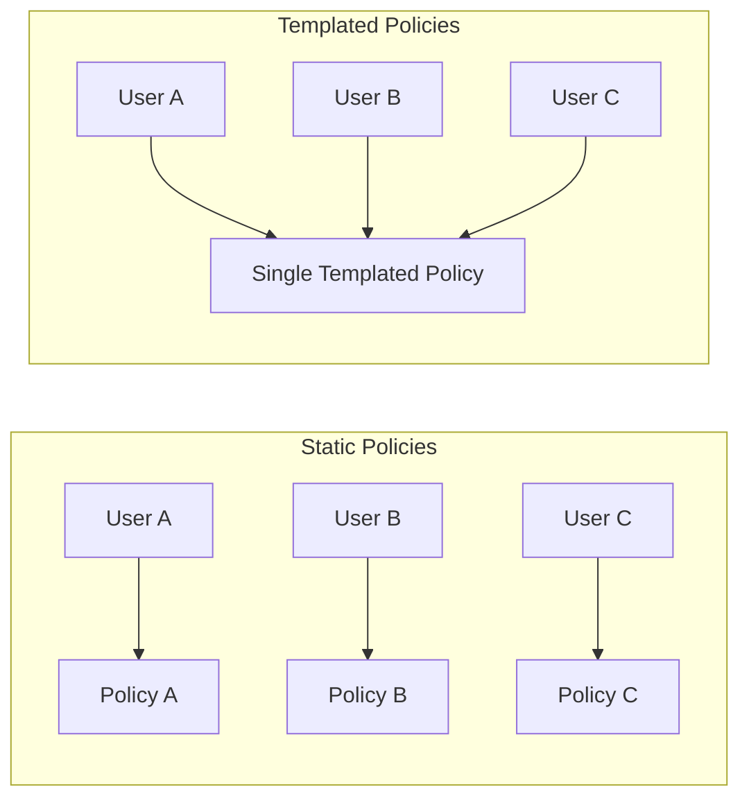
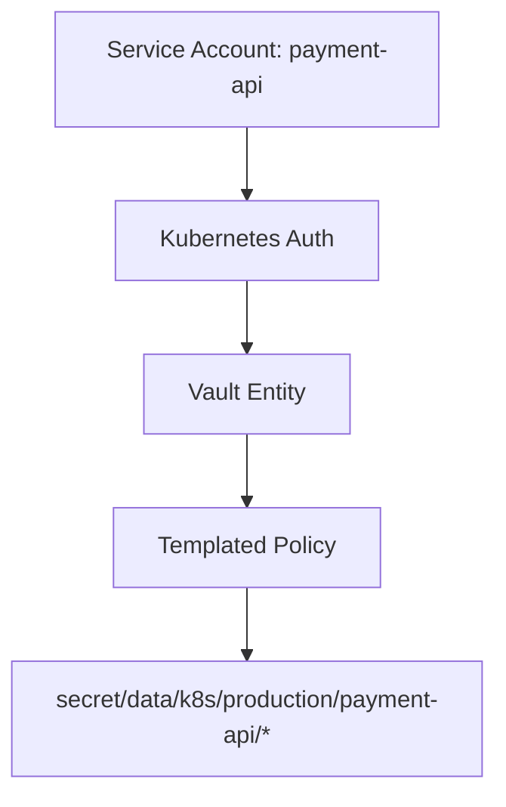
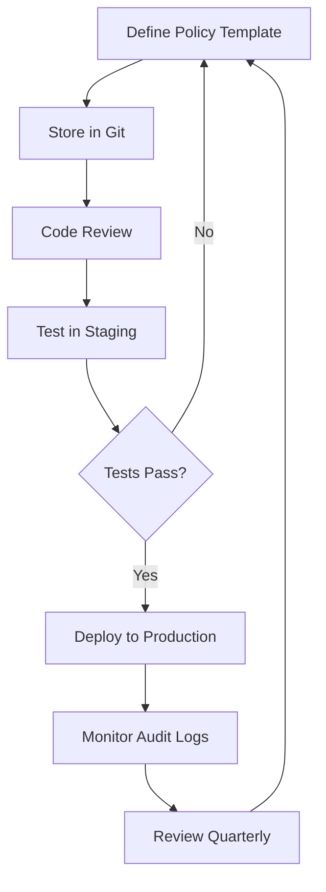

# How to Create Vault Policy Templating

Author: [nawazdhandala](https://github.com/nawazdhandala)

Tags: HashiCorp Vault, Security, DevOps, Secrets Management

Description: Learn how to use HashiCorp Vault policy templating to create dynamic, identity-aware access controls that scale with your organization.

---

Managing secrets at scale requires more than static access rules. HashiCorp Vault policy templating lets you write dynamic policies that adapt based on who is requesting access, eliminating the need to create individual policies for every user or application.

## Understanding Vault Policies

Vault policies define what actions (create, read, update, delete, list) are allowed on which paths. Without templating, you would need a separate policy for each user or service.



## Policy Templating Basics

Vault policies use templating syntax with double curly braces. The most common template variable is `identity`, which gives you access to information about the authenticated entity.

Here is a basic templated policy that grants users access to their own secrets path based on their entity name.

```hcl
# Allow users to manage secrets under their own path
# The {{identity.entity.name}} variable resolves to the authenticated user's entity name
path "secret/data/users/{{identity.entity.name}}/*" {
  capabilities = ["create", "read", "update", "delete", "list"]
}

# Allow users to read their own metadata
path "secret/metadata/users/{{identity.entity.name}}/*" {
  capabilities = ["list", "read"]
}
```

## Available Template Variables

Vault provides several template variables you can use in policies.

| Variable | Description | Example Value |
|----------|-------------|---------------|
| `{{identity.entity.id}}` | Unique entity ID | `7d2e3179-f69b-450c-7179-ac8ee8bd8ca9` |
| `{{identity.entity.name}}` | Entity name | `alice` |
| `{{identity.entity.aliases.<mount_accessor>.name}}` | Auth method alias name | `alice@example.com` |
| `{{identity.entity.metadata.<key>}}` | Entity metadata value | `engineering` |
| `{{identity.groups.ids.<group_id>.name}}` | Group name by ID | `developers` |
| `{{identity.groups.names.<group_name>.id}}` | Group ID by name | `a3b2c1d4-...` |

## Real-World Use Cases

### Use Case 1: Team-Based Secret Access

This policy allows teams to access secrets based on their team metadata. Each team gets isolated access to their own secrets without needing separate policy files.

```hcl
# Team-based secret access policy
# Users can only access secrets for their assigned team
# The team is stored as metadata on the user's entity

# Full access to team secrets
path "secret/data/teams/{{identity.entity.metadata.team}}/*" {
  capabilities = ["create", "read", "update", "delete", "list"]
}

# List team secret paths
path "secret/metadata/teams/{{identity.entity.metadata.team}}/*" {
  capabilities = ["list", "read"]
}

# Read-only access to shared company secrets
path "secret/data/shared/*" {
  capabilities = ["read", "list"]
}
```

To set up the team metadata on an entity, use the following commands.

```bash
# First, get the entity ID for the user
# This finds the entity associated with the userpass auth method
ENTITY_ID=$(vault read -format=json identity/entity/name/alice | jq -r '.data.id')

# Update the entity with team metadata
# This assigns Alice to the "platform" team
vault write identity/entity/id/${ENTITY_ID} \
    metadata=team=platform \
    metadata=environment=production
```

### Use Case 2: Environment-Scoped Database Credentials

This pattern restricts database credential access based on the environment metadata attached to the service identity.

```hcl
# Environment-scoped database credentials
# Services can only request credentials for their designated environment

# Allow requesting database credentials for the service's environment
path "database/creds/{{identity.entity.metadata.environment}}-readonly" {
  capabilities = ["read"]
}

# Allow services with write permission to get read-write credentials
# Only works if the entity has metadata write_access=true
path "database/creds/{{identity.entity.metadata.environment}}-readwrite" {
  capabilities = ["read"]
}
```

### Use Case 3: Kubernetes Service Account Integration

When using Kubernetes authentication, you can template policies based on the service account and namespace.



The following policy grants Kubernetes workloads access to secrets matching their namespace and service account.

```hcl
# Kubernetes workload secret access
# Uses the bound service account name from the Kubernetes auth alias

# Get the namespace from the auth alias metadata
# Format: <namespace>/<service_account>
path "secret/data/k8s/{{identity.entity.aliases.auth_kubernetes_abc123.metadata.service_account_namespace}}/*" {
  capabilities = ["read", "list"]
}

# Service-specific secrets using the full service account identity
path "secret/data/services/{{identity.entity.aliases.auth_kubernetes_abc123.metadata.service_account_name}}/*" {
  capabilities = ["read", "list"]
}
```

To find your Kubernetes auth mount accessor for the policy, run the following.

```bash
# List auth methods to find the Kubernetes mount accessor
# You need this accessor ID to reference aliases in policies
vault auth list -format=json | jq -r '.["kubernetes/"].accessor'
```

### Use Case 4: Group-Based Access Control

Templated policies can also use group membership to determine access. This is useful when you want to grant permissions based on organizational groups.

```hcl
# Group-based PKI certificate issuance
# Members of specific groups can issue certificates for their domains

# Allow infrastructure team to issue wildcard certificates
path "pki/issue/{{identity.groups.names.infrastructure.id}}-issuer" {
  capabilities = ["create", "update"]
}

# Dynamic path based on group metadata
path "secret/data/groups/{{identity.groups.names.developers.metadata.project}}/*" {
  capabilities = ["read", "list"]
}
```

## Setting Up Entities and Groups

Before templated policies work, you need to configure entities and groups in Vault.

### Create an Entity with Metadata

Entities represent users or services across multiple auth methods. This script creates an entity with metadata that can be used in templated policies.

```bash
# Create a new entity with metadata
# The metadata fields (team, environment, project) can be used in policy templates
vault write identity/entity \
    name="payment-service" \
    metadata=team=payments \
    metadata=environment=production \
    metadata=project=checkout

# Store the entity ID for later use
ENTITY_ID=$(vault read -format=json identity/entity/name/payment-service | jq -r '.data.id')
echo "Entity ID: ${ENTITY_ID}"
```

### Create an Entity Alias

Entity aliases link authentication method identities to entities. This connects an AppRole role to the entity we created.

```bash
# Get the AppRole auth method accessor
APPROLE_ACCESSOR=$(vault auth list -format=json | jq -r '.["approle/"].accessor')

# Create an alias linking the AppRole identity to our entity
# The name must match the role name used in AppRole authentication
vault write identity/entity-alias \
    name="payment-service-role" \
    canonical_id="${ENTITY_ID}" \
    mount_accessor="${APPROLE_ACCESSOR}"
```

### Create Groups

Groups allow you to assign policies to multiple entities and add group-level metadata.

```bash
# Create an internal group for the payments team
vault write identity/group \
    name="payments-team" \
    member_entity_ids="${ENTITY_ID}" \
    metadata=cost_center=cc-1234 \
    metadata=slack_channel=payments-team

# Create policies and attach them to the group
vault write identity/group/name/payments-team \
    policies="payments-secrets,payments-database"
```

## Advanced Templating Patterns

### Pattern 1: Multi-Level Path Templates

Combine multiple template variables to create fine-grained access paths.

```hcl
# Multi-level templated path
# Combines team, environment, and service for precise scoping
path "secret/data/{{identity.entity.metadata.team}}/{{identity.entity.metadata.environment}}/{{identity.entity.name}}/*" {
  capabilities = ["create", "read", "update", "delete", "list"]
}
```

### Pattern 2: Conditional Capabilities with Metadata

Use different paths to provide conditional access based on metadata values.

```hcl
# Read-only access for all team members
path "secret/data/teams/{{identity.entity.metadata.team}}/shared/*" {
  capabilities = ["read", "list"]
}

# Write access path - only accessible if entity has admin metadata
# You would only add this alias to admin entities
path "secret/data/teams/{{identity.entity.metadata.team}}/admin/*" {
  capabilities = ["create", "read", "update", "delete", "list"]
}
```

### Pattern 3: Cross-Reference Group and Entity

Access group information through entity membership.

```hcl
# Allow access based on the first group the entity belongs to
path "secret/data/projects/{{identity.groups.ids.*.name}}/*" {
  capabilities = ["read", "list"]
}
```

## Testing Templated Policies

Always test policies before deploying to production. Use these commands to verify your templated policies work correctly.

```bash
# Create the templated policy
vault policy write team-secrets - <<EOF
path "secret/data/teams/{{identity.entity.metadata.team}}/*" {
  capabilities = ["create", "read", "update", "delete", "list"]
}
EOF

# Create a test user with userpass auth
vault auth enable userpass
vault write auth/userpass/users/testuser password="testpass" policies="team-secrets"

# Create entity and set metadata
vault write identity/entity name="testuser" metadata=team=platform

# Get the accessor for userpass
USERPASS_ACCESSOR=$(vault auth list -format=json | jq -r '.["userpass/"].accessor')

# Get the entity ID
ENTITY_ID=$(vault read -format=json identity/entity/name/testuser | jq -r '.data.id')

# Create the alias
vault write identity/entity-alias \
    name="testuser" \
    canonical_id="${ENTITY_ID}" \
    mount_accessor="${USERPASS_ACCESSOR}"

# Login as testuser
vault login -method=userpass username=testuser password=testpass

# Test writing to the templated path - should succeed
vault kv put secret/teams/platform/config api_key="test123"

# Test writing to a different team - should fail
vault kv put secret/teams/other-team/config api_key="test123"
```

## Debugging Policy Templates

When templated policies do not work as expected, use these debugging techniques.

### Check Entity Information

View the current entity and its metadata to verify template variables will resolve correctly.

```bash
# Look up current token's entity information
vault token lookup -format=json | jq '.data.entity_id'

# Get full entity details including metadata and aliases
ENTITY_ID=$(vault token lookup -format=json | jq -r '.data.entity_id')
vault read -format=json identity/entity/id/${ENTITY_ID} | jq '.data'
```

### Check Group Membership

Verify the entity belongs to expected groups.

```bash
# List groups the entity belongs to
vault read -format=json identity/entity/id/${ENTITY_ID} | jq '.data.group_ids'

# Get details about a specific group
vault read identity/group/id/<group_id>
```

### Test Policy Rendering

Use the `vault token capabilities` command to see what a token can actually do.

```bash
# Check capabilities on a specific path
vault token capabilities secret/data/teams/platform/config

# Check capabilities for a different token
vault token capabilities -token="s.xxxxx" secret/data/teams/platform/config
```

## Common Pitfalls

### Pitfall 1: Missing Entity Alias

If a user authenticates but the templated policy does not work, ensure an entity alias exists linking their auth method identity to an entity with the required metadata.

### Pitfall 2: Incorrect Accessor Reference

When using auth method aliases in templates, double-check the accessor ID. Accessors are regenerated if you disable and re-enable an auth method.

```bash
# Always retrieve the current accessor dynamically in scripts
ACCESSOR=$(vault auth list -format=json | jq -r '.["kubernetes/"].accessor')
```

### Pitfall 3: KV v2 Path Prefixes

When using KV secrets engine version 2, remember that the actual data lives under `secret/data/` not `secret/`. Metadata is under `secret/metadata/`.

```hcl
# Correct KV v2 paths
path "secret/data/users/{{identity.entity.name}}/*" {
  capabilities = ["create", "read", "update", "delete"]
}

path "secret/metadata/users/{{identity.entity.name}}/*" {
  capabilities = ["list", "read", "delete"]
}
```

## Production Workflow

Here is a recommended workflow for managing templated policies in production.



### Store Policies in Version Control

Keep your policies in Git alongside your infrastructure code.

```
vault-policies/
  base/
    admin.hcl
    default.hcl
  templates/
    team-secrets.hcl
    environment-database.hcl
    kubernetes-workload.hcl
  groups/
    developers.hcl
    infrastructure.hcl
```

### Apply Policies with Terraform

Using Terraform ensures policies are applied consistently and changes are tracked.

```hcl
# Terraform configuration for templated Vault policy
resource "vault_policy" "team_secrets" {
  name   = "team-secrets"
  policy = file("${path.module}/policies/team-secrets.hcl")
}

resource "vault_identity_entity" "service" {
  name = "payment-service"

  metadata = {
    team        = "payments"
    environment = "production"
  }
}

resource "vault_identity_group" "payments" {
  name              = "payments-team"
  member_entity_ids = [vault_identity_entity.service.id]

  metadata = {
    cost_center = "cc-1234"
  }
}
```

---

Vault policy templating transforms how you manage access control at scale. Instead of maintaining hundreds of individual policies, you create a handful of templates that dynamically resolve based on identity. Start with simple entity metadata templating and gradually adopt group-based patterns as your organization grows. The investment in setting up proper entities and groups pays off quickly when you no longer need to create a new policy every time a team onboards a new service.
