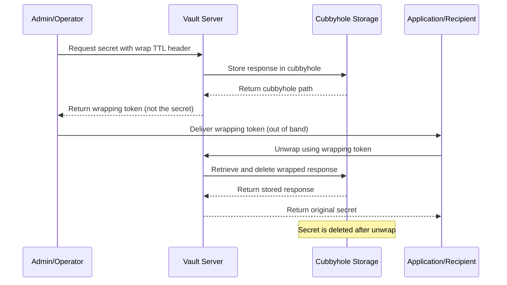

# How to Create Vault Response Wrapping

Author: [nawazdhandala](https://github.com/nawazdhandala)

Tags: Vault, Security, SecretDelivery, Wrapping

Description: Learn how to securely deliver secrets using HashiCorp Vault response wrapping with cubbyhole tokens and TTL configuration.

---

## Introduction

When distributing secrets in a production environment, the challenge is not just storing them securely but also delivering them safely. HashiCorp Vault solves this problem with **response wrapping**, a mechanism that wraps any Vault response in a single-use token. This ensures that secrets are never exposed in transit and can only be retrieved once by the intended recipient.

## What is Response Wrapping?

Response wrapping takes any Vault response and wraps it in a single-use token. Instead of returning the secret directly, Vault returns a wrapping token that references the actual secret stored temporarily in a cubbyhole. The recipient uses this token to unwrap and retrieve the secret exactly once.

Key benefits:

- **Single-use tokens**: The wrapping token can only be used once, preventing replay attacks
- **TTL enforcement**: Wrapped secrets expire after a configurable time-to-live
- **Audit trail**: Every wrap and unwrap operation is logged for compliance
- **Malfeasance detection**: If someone intercepts and uses the token first, the legitimate recipient will know

## How Response Wrapping Works

The following diagram illustrates the flow of wrapped secret delivery:



## Cubbyhole Response Wrapping

Vault uses its **cubbyhole** secrets engine for response wrapping. A cubbyhole is a private, token-scoped storage area. Each token has its own cubbyhole that no other token can access. When a response is wrapped:

1. Vault creates a new single-use token
2. The original response is stored in that token's cubbyhole
3. Only the wrapping token can access its cubbyhole
4. Once unwrapped, the cubbyhole data is destroyed

This architecture ensures complete isolation between wrapped secrets.

## TTL Configuration for Wrapped Tokens

You can configure the TTL (time-to-live) for wrapped tokens to control how long the recipient has to unwrap the secret. After the TTL expires, the wrapping token and its cubbyhole data are automatically deleted.

### Setting TTL via CLI

```bash
# Wrap a secret with a 5-minute TTL
vault kv get -wrap-ttl=5m secret/data/myapp/credentials

# Wrap a secret with a 1-hour TTL
vault kv get -wrap-ttl=1h secret/data/myapp/api-key

# Wrap with a 30-second TTL for highly sensitive operations
vault kv get -wrap-ttl=30s secret/data/myapp/one-time-password
```

### Setting TTL via API

```bash
# Use the X-Vault-Wrap-TTL header to specify wrap duration
curl \
    --header "X-Vault-Token: $VAULT_TOKEN" \
    --header "X-Vault-Wrap-TTL: 300" \
    --request GET \
    https://vault.example.com/v1/secret/data/myapp/credentials
```

The response will contain a wrapping token instead of the actual secret:

```json
{
  "request_id": "a1b2c3d4-e5f6-7890-abcd-ef1234567890",
  "wrap_info": {
    "token": "hvs.CAESIPL3K8RqNxC5Wv...",
    "accessor": "4fVq9...",
    "ttl": 300,
    "creation_time": "2026-01-30T10:00:00.000000Z",
    "creation_path": "secret/data/myapp/credentials",
    "wrapped_accessor": ""
  }
}
```

## Unwrapping Secrets

The recipient uses the wrapping token to retrieve the actual secret. This operation can only be performed once.

### Unwrapping via CLI

```bash
# Set the wrapping token
export WRAPPING_TOKEN="hvs.CAESIPL3K8RqNxC5Wv..."

# Unwrap to retrieve the secret
vault unwrap $WRAPPING_TOKEN
```

### Unwrapping via API

```bash
# Unwrap using the sys/wrapping/unwrap endpoint
curl \
    --header "X-Vault-Token: $WRAPPING_TOKEN" \
    --request POST \
    https://vault.example.com/v1/sys/wrapping/unwrap
```

### Unwrapping with Python

```python
import hvac
import os

# Initialize the Vault client
client = hvac.Client(url='https://vault.example.com')

# The wrapping token received from the admin
wrapping_token = os.environ.get('WRAPPING_TOKEN')

# Unwrap the secret using the wrapping token
# This will only work once; subsequent attempts will fail
try:
    unwrap_response = client.sys.unwrap(token=wrapping_token)

    # Extract the secret data from the unwrapped response
    secret_data = unwrap_response['data']['data']

    print("Successfully retrieved secret")
    # Use the secret in your application
    api_key = secret_data.get('api_key')

except hvac.exceptions.InvalidRequest as e:
    # Token was already used or has expired
    print(f"Failed to unwrap: {e}")
    # Alert security team about potential malfeasance
```

### Unwrapping with Go

```go
package main

import (
    "fmt"
    "log"
    "os"

    vault "github.com/hashicorp/vault/api"
)

func main() {
    // Create a new Vault client
    config := vault.DefaultConfig()
    config.Address = "https://vault.example.com"

    client, err := vault.NewClient(config)
    if err != nil {
        log.Fatalf("Failed to create Vault client: %v", err)
    }

    // Get the wrapping token from environment
    wrappingToken := os.Getenv("WRAPPING_TOKEN")

    // Set the wrapping token as the client token
    client.SetToken(wrappingToken)

    // Unwrap the secret
    // The Logical().Unwrap() method handles the unwrap operation
    secret, err := client.Logical().Unwrap("")
    if err != nil {
        // Token was already used, expired, or invalid
        log.Fatalf("Failed to unwrap secret: %v", err)
    }

    // Access the unwrapped data
    if secret != nil && secret.Data != nil {
        // For KV v2, data is nested under "data" key
        if data, ok := secret.Data["data"].(map[string]interface{}); ok {
            fmt.Printf("API Key: %s\n", data["api_key"])
        }
    }
}
```

## Audit Logging

Vault automatically logs all wrapping and unwrapping operations. This creates an audit trail that helps detect unauthorized access attempts.

### Sample Audit Log Entry for Wrap Operation

```json
{
  "type": "response",
  "time": "2026-01-30T10:00:00.000000Z",
  "auth": {
    "token_type": "service",
    "accessor": "auth-accessor-12345"
  },
  "request": {
    "id": "req-id-67890",
    "operation": "read",
    "path": "secret/data/myapp/credentials",
    "wrap_ttl": 300
  },
  "response": {
    "wrap_info": {
      "token": "hmac-sha256:abc123...",
      "accessor": "hmac-sha256:def456...",
      "ttl": 300,
      "creation_time": "2026-01-30T10:00:00Z",
      "creation_path": "secret/data/myapp/credentials"
    }
  }
}
```

### Sample Audit Log Entry for Unwrap Operation

```json
{
  "type": "response",
  "time": "2026-01-30T10:05:00.000000Z",
  "auth": {
    "token_type": "service",
    "accessor": "wrap-accessor-12345"
  },
  "request": {
    "id": "req-id-11111",
    "operation": "update",
    "path": "sys/wrapping/unwrap"
  },
  "response": {
    "data": {
      "api_key": "hmac-sha256:xyz789..."
    }
  }
}
```

## Verifying Wrapped Token Validity

Before attempting to unwrap, you can look up the wrapping token to verify it is still valid:

```bash
# Look up wrapping token metadata without unwrapping
vault token lookup $WRAPPING_TOKEN

# Or via API
curl \
    --header "X-Vault-Token: $VAULT_TOKEN" \
    --request POST \
    --data "{\"token\": \"$WRAPPING_TOKEN\"}" \
    https://vault.example.com/v1/sys/wrapping/lookup
```

This returns metadata about the wrapping token including its TTL and creation path, without consuming the token.

## Best Practices

1. **Use short TTLs**: Set the TTL just long enough for the recipient to unwrap. Shorter TTLs reduce the window for interception.

2. **Deliver tokens out of band**: Send the wrapping token through a different channel than the one used to communicate about the secret.

3. **Monitor audit logs**: Set up alerts for failed unwrap attempts, which may indicate token interception.

4. **Verify before unwrapping**: Use the lookup endpoint to verify the token is valid before attempting to unwrap in automated workflows.

5. **Handle failures gracefully**: If an unwrap fails, assume the token was compromised and rotate the underlying secret.

## Complete Workflow Example

Here is a complete example showing the admin wrapping a secret and the application unwrapping it:

```bash
# Admin: Enable the KV secrets engine if not already enabled
vault secrets enable -path=secret kv-v2

# Admin: Store a secret
vault kv put secret/myapp/database \
    username="dbuser" \
    password="supersecret123"

# Admin: Wrap the secret with a 10-minute TTL
# This returns a wrapping token, not the secret itself
WRAP_RESPONSE=$(vault kv get -wrap-ttl=10m -format=json secret/myapp/database)

# Admin: Extract the wrapping token
WRAPPING_TOKEN=$(echo $WRAP_RESPONSE | jq -r '.wrap_info.token')

# Admin: Securely deliver WRAPPING_TOKEN to the application
echo "Deliver this token to the application: $WRAPPING_TOKEN"

# Application: Unwrap and use the secret
# This can only be done once
vault unwrap -format=json $WRAPPING_TOKEN
```

## Conclusion

Vault response wrapping provides a secure mechanism for delivering secrets to applications and users. By combining single-use tokens, TTL enforcement, cubbyhole isolation, and comprehensive audit logging, you can ensure that secrets are delivered safely and any interception attempts are detected. Implement response wrapping as part of your secret distribution workflow to enhance your security posture.

## References

- [HashiCorp Vault Response Wrapping Documentation](https://developer.hashicorp.com/vault/docs/concepts/response-wrapping)
- [Cubbyhole Secrets Engine](https://developer.hashicorp.com/vault/docs/secrets/cubbyhole)
- [Vault Audit Devices](https://developer.hashicorp.com/vault/docs/audit)
