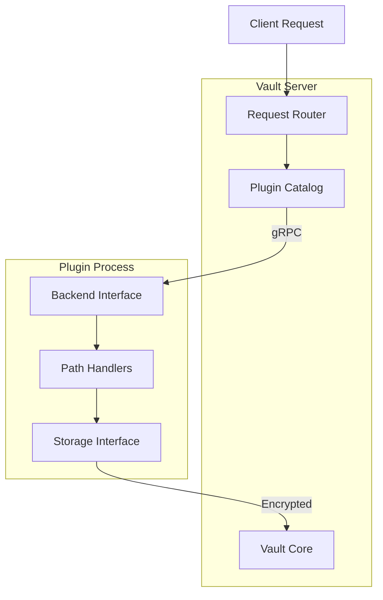
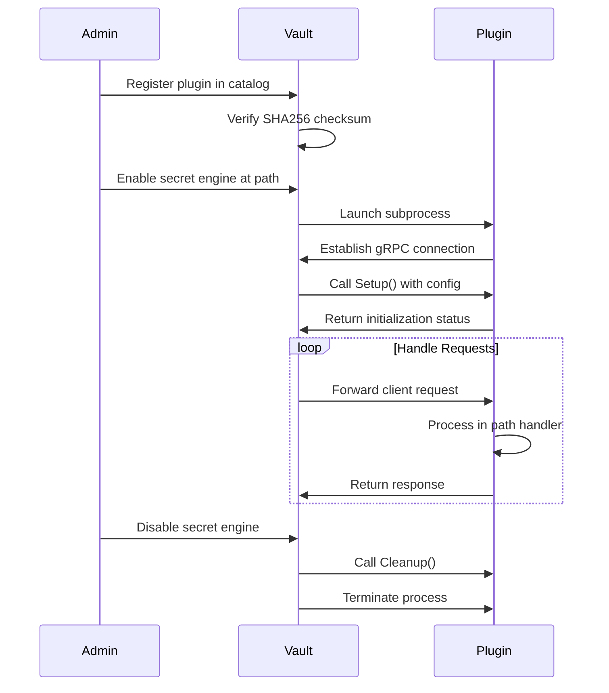

# How to Build Vault Secret Engines Custom

Author: [nawazdhandala](https://github.com/nawazdhandala)

Tags: Vault, Security, Secrets, Development

Description: Learn how to build custom Vault secret engines with Go plugins to manage specialized credentials and secrets for your infrastructure.

---

HashiCorp Vault provides built-in secret engines for databases, cloud providers, and PKI. But sometimes you need to manage secrets that are specific to your organization or integrate with systems that Vault does not support natively. Custom secret engines let you extend Vault to handle any type of credential or secret.

## Plugin Architecture Overview

Vault uses a plugin architecture where secret engines run as separate processes that communicate with the main Vault server over gRPC. This design provides isolation, security, and flexibility.



### Key Components

| Component | Purpose |
|-----------|---------|
| Plugin Catalog | Registry of available plugins and their checksums |
| Backend Interface | Main entry point that implements secret engine logic |
| Path Framework | Defines API endpoints and handlers |
| Storage Interface | Provides encrypted storage for plugin data |
| Logical Request | Contains client request data and context |
| Logical Response | Structured response with secrets or data |

## Plugin Lifecycle

Understanding the plugin lifecycle helps you design robust secret engines.



## Setting Up the Development Environment

First, set up your Go project structure:

```bash
# Create project directory
mkdir vault-secrets-myengine && cd vault-secrets-myengine

# Initialize Go module
go mod init github.com/myorg/vault-secrets-myengine

# Install Vault SDK
go get github.com/hashicorp/vault/sdk@latest
go get github.com/hashicorp/vault/api@latest
```

Project structure:

```
vault-secrets-myengine/
├── main.go              # Plugin entry point
├── backend.go           # Backend factory and setup
├── path_config.go       # Configuration endpoint
├── path_creds.go        # Credentials endpoint
├── path_roles.go        # Role management endpoint
├── client.go            # External service client
└── go.mod
```

## Implementing the Backend Interface

The backend is the core of your secret engine. It implements the `logical.Backend` interface and defines all paths and operations.

### Backend Factory

```go
// backend.go
package myengine

import (
    "context"
    "sync"

    "github.com/hashicorp/vault/sdk/framework"
    "github.com/hashicorp/vault/sdk/logical"
)

// Factory creates a new backend instance
// Vault calls this function when enabling the secret engine
func Factory(ctx context.Context, conf *logical.BackendConfig) (logical.Backend, error) {
    b := Backend()
    if err := b.Setup(ctx, conf); err != nil {
        return nil, err
    }
    return b, nil
}

// myEngineBackend holds the backend state
type myEngineBackend struct {
    *framework.Backend

    // lock protects concurrent access to the client
    lock sync.RWMutex

    // client connects to the external service
    client *MyServiceClient
}

// Backend creates a new unconfigured backend
func Backend() *myEngineBackend {
    var b myEngineBackend

    b.Backend = &framework.Backend{
        // Help text shown when users query the mount
        Help: "The MyEngine secret engine generates credentials for MyService.",

        // BackendType indicates this is a secret engine (not auth)
        BackendType: logical.TypeLogical,

        // Paths defines all API endpoints
        Paths: framework.PathAppend(
            pathConfig(&b),  // /config endpoint
            pathRoles(&b),   // /roles/* endpoints
            pathCreds(&b),   // /creds/* endpoints
        ),

        // Secrets defines secret types this engine can generate
        Secrets: []*framework.Secret{
            secretCredentials(&b),
        },

        // Invalidate is called when configuration changes
        Invalidate: b.invalidate,

        // Clean up resources when the engine is disabled
        Clean: b.cleanup,
    }

    return &b
}

// cleanup releases resources when the engine shuts down
func (b *myEngineBackend) cleanup(ctx context.Context) {
    b.lock.Lock()
    defer b.lock.Unlock()

    if b.client != nil {
        b.client.Close()
        b.client = nil
    }
}

// invalidate resets cached data when configuration changes
func (b *myEngineBackend) invalidate(ctx context.Context, key string) {
    if key == "config" {
        b.reset()
    }
}

// reset clears the cached client connection
func (b *myEngineBackend) reset() {
    b.lock.Lock()
    defer b.lock.Unlock()
    b.client = nil
}

// getClient returns a configured client, creating one if needed
func (b *myEngineBackend) getClient(ctx context.Context, s logical.Storage) (*MyServiceClient, error) {
    b.lock.RLock()
    if b.client != nil {
        b.lock.RUnlock()
        return b.client, nil
    }
    b.lock.RUnlock()

    // Upgrade to write lock to create client
    b.lock.Lock()
    defer b.lock.Unlock()

    // Double-check after acquiring write lock
    if b.client != nil {
        return b.client, nil
    }

    // Load configuration from storage
    config, err := getConfig(ctx, s)
    if err != nil {
        return nil, err
    }
    if config == nil {
        return nil, fmt.Errorf("configuration not set")
    }

    // Create new client with configuration
    client, err := NewMyServiceClient(config.URL, config.APIKey)
    if err != nil {
        return nil, err
    }

    b.client = client
    return b.client, nil
}
```

## Configuration Endpoint

The configuration endpoint stores connection details for your external service.

```go
// path_config.go
package myengine

import (
    "context"

    "github.com/hashicorp/vault/sdk/framework"
    "github.com/hashicorp/vault/sdk/logical"
)

// configEntry stores the configuration for the backend
type configEntry struct {
    URL    string `json:"url"`
    APIKey string `json:"api_key"`
}

// pathConfig returns the path configuration for the config endpoint
func pathConfig(b *myEngineBackend) []*framework.Path {
    return []*framework.Path{
        {
            // Pattern matches /config
            Pattern: "config",

            // Fields define accepted parameters
            Fields: map[string]*framework.FieldSchema{
                "url": {
                    Type:        framework.TypeString,
                    Description: "The URL of the MyService API endpoint",
                    Required:    true,
                },
                "api_key": {
                    Type:        framework.TypeString,
                    Description: "The API key for authenticating with MyService",
                    Required:    true,
                    DisplayAttrs: &framework.DisplayAttributes{
                        Sensitive: true, // Mark as sensitive in UI
                    },
                },
            },

            // Operations define supported HTTP methods
            Operations: map[logical.Operation]framework.OperationHandler{
                logical.ReadOperation: &framework.PathOperation{
                    Callback: b.pathConfigRead,
                    Summary:  "Read the current configuration",
                },
                logical.CreateOperation: &framework.PathOperation{
                    Callback: b.pathConfigWrite,
                    Summary:  "Configure the MyService connection",
                },
                logical.UpdateOperation: &framework.PathOperation{
                    Callback: b.pathConfigWrite,
                    Summary:  "Update the MyService configuration",
                },
                logical.DeleteOperation: &framework.PathOperation{
                    Callback: b.pathConfigDelete,
                    Summary:  "Delete the configuration",
                },
            },

            HelpSynopsis:    "Configure the MyService connection",
            HelpDescription: "Configure the URL and credentials for connecting to MyService.",
        },
    }
}

// pathConfigRead handles GET /config
func (b *myEngineBackend) pathConfigRead(ctx context.Context, req *logical.Request, data *framework.FieldData) (*logical.Response, error) {
    config, err := getConfig(ctx, req.Storage)
    if err != nil {
        return nil, err
    }
    if config == nil {
        return nil, nil // Return 404 if not configured
    }

    // Return configuration without sensitive fields
    return &logical.Response{
        Data: map[string]interface{}{
            "url": config.URL,
            // Note: api_key is intentionally omitted for security
        },
    }, nil
}

// pathConfigWrite handles POST/PUT /config
func (b *myEngineBackend) pathConfigWrite(ctx context.Context, req *logical.Request, data *framework.FieldData) (*logical.Response, error) {
    // Validate required fields
    url := data.Get("url").(string)
    if url == "" {
        return logical.ErrorResponse("url is required"), nil
    }

    apiKey := data.Get("api_key").(string)
    if apiKey == "" {
        return logical.ErrorResponse("api_key is required"), nil
    }

    // Create configuration entry
    entry := &configEntry{
        URL:    url,
        APIKey: apiKey,
    }

    // Serialize and store configuration
    storageEntry, err := logical.StorageEntryJSON("config", entry)
    if err != nil {
        return nil, err
    }

    if err := req.Storage.Put(ctx, storageEntry); err != nil {
        return nil, err
    }

    // Reset the client so it picks up new configuration
    b.reset()

    return nil, nil
}

// pathConfigDelete handles DELETE /config
func (b *myEngineBackend) pathConfigDelete(ctx context.Context, req *logical.Request, data *framework.FieldData) (*logical.Response, error) {
    if err := req.Storage.Delete(ctx, "config"); err != nil {
        return nil, err
    }

    b.reset()
    return nil, nil
}

// getConfig retrieves the configuration from storage
func getConfig(ctx context.Context, s logical.Storage) (*configEntry, error) {
    entry, err := s.Get(ctx, "config")
    if err != nil {
        return nil, err
    }
    if entry == nil {
        return nil, nil
    }

    var config configEntry
    if err := entry.DecodeJSON(&config); err != nil {
        return nil, err
    }

    return &config, nil
}
```

## Role Management

Roles define templates for credential generation. Each role specifies permissions and TTL settings.

```go
// path_roles.go
package myengine

import (
    "context"
    "time"

    "github.com/hashicorp/vault/sdk/framework"
    "github.com/hashicorp/vault/sdk/logical"
)

// roleEntry stores the configuration for a role
type roleEntry struct {
    Name        string        `json:"name"`
    Permissions []string      `json:"permissions"`
    TTL         time.Duration `json:"ttl"`
    MaxTTL      time.Duration `json:"max_ttl"`
}

// pathRoles returns the paths for role management
func pathRoles(b *myEngineBackend) []*framework.Path {
    return []*framework.Path{
        {
            // Pattern matches /roles/:name
            Pattern: "roles/" + framework.GenericNameRegex("name"),

            Fields: map[string]*framework.FieldSchema{
                "name": {
                    Type:        framework.TypeString,
                    Description: "Name of the role",
                    Required:    true,
                },
                "permissions": {
                    Type:        framework.TypeCommaStringSlice,
                    Description: "List of permissions to grant (comma-separated)",
                    Required:    true,
                },
                "ttl": {
                    Type:        framework.TypeDurationSecond,
                    Description: "Default TTL for credentials",
                    Default:     3600, // 1 hour
                },
                "max_ttl": {
                    Type:        framework.TypeDurationSecond,
                    Description: "Maximum TTL for credentials",
                    Default:     86400, // 24 hours
                },
            },

            Operations: map[logical.Operation]framework.OperationHandler{
                logical.ReadOperation: &framework.PathOperation{
                    Callback: b.pathRoleRead,
                    Summary:  "Read a role configuration",
                },
                logical.CreateOperation: &framework.PathOperation{
                    Callback: b.pathRoleWrite,
                    Summary:  "Create a new role",
                },
                logical.UpdateOperation: &framework.PathOperation{
                    Callback: b.pathRoleWrite,
                    Summary:  "Update an existing role",
                },
                logical.DeleteOperation: &framework.PathOperation{
                    Callback: b.pathRoleDelete,
                    Summary:  "Delete a role",
                },
            },

            ExistenceCheck:  b.pathRoleExistenceCheck,
            HelpSynopsis:    "Manage roles for credential generation",
            HelpDescription: "Roles define the permissions and TTL for generated credentials.",
        },
        {
            // Pattern matches /roles (list endpoint)
            Pattern: "roles/?$",

            Operations: map[logical.Operation]framework.OperationHandler{
                logical.ListOperation: &framework.PathOperation{
                    Callback: b.pathRoleList,
                    Summary:  "List all configured roles",
                },
            },

            HelpSynopsis: "List all roles",
        },
    }
}

// pathRoleExistenceCheck checks if a role exists
func (b *myEngineBackend) pathRoleExistenceCheck(ctx context.Context, req *logical.Request, data *framework.FieldData) (bool, error) {
    name := data.Get("name").(string)
    role, err := getRole(ctx, req.Storage, name)
    if err != nil {
        return false, err
    }
    return role != nil, nil
}

// pathRoleRead handles GET /roles/:name
func (b *myEngineBackend) pathRoleRead(ctx context.Context, req *logical.Request, data *framework.FieldData) (*logical.Response, error) {
    name := data.Get("name").(string)

    role, err := getRole(ctx, req.Storage, name)
    if err != nil {
        return nil, err
    }
    if role == nil {
        return nil, nil
    }

    return &logical.Response{
        Data: map[string]interface{}{
            "name":        role.Name,
            "permissions": role.Permissions,
            "ttl":         int64(role.TTL.Seconds()),
            "max_ttl":     int64(role.MaxTTL.Seconds()),
        },
    }, nil
}

// pathRoleWrite handles POST/PUT /roles/:name
func (b *myEngineBackend) pathRoleWrite(ctx context.Context, req *logical.Request, data *framework.FieldData) (*logical.Response, error) {
    name := data.Get("name").(string)
    if name == "" {
        return logical.ErrorResponse("name is required"), nil
    }

    permissions := data.Get("permissions").([]string)
    if len(permissions) == 0 {
        return logical.ErrorResponse("permissions is required"), nil
    }

    ttl := time.Duration(data.Get("ttl").(int)) * time.Second
    maxTTL := time.Duration(data.Get("max_ttl").(int)) * time.Second

    // Validate TTL settings
    if ttl > maxTTL {
        return logical.ErrorResponse("ttl cannot exceed max_ttl"), nil
    }

    role := &roleEntry{
        Name:        name,
        Permissions: permissions,
        TTL:         ttl,
        MaxTTL:      maxTTL,
    }

    // Store the role
    entry, err := logical.StorageEntryJSON("roles/"+name, role)
    if err != nil {
        return nil, err
    }

    if err := req.Storage.Put(ctx, entry); err != nil {
        return nil, err
    }

    return nil, nil
}

// pathRoleDelete handles DELETE /roles/:name
func (b *myEngineBackend) pathRoleDelete(ctx context.Context, req *logical.Request, data *framework.FieldData) (*logical.Response, error) {
    name := data.Get("name").(string)

    if err := req.Storage.Delete(ctx, "roles/"+name); err != nil {
        return nil, err
    }

    return nil, nil
}

// pathRoleList handles LIST /roles
func (b *myEngineBackend) pathRoleList(ctx context.Context, req *logical.Request, data *framework.FieldData) (*logical.Response, error) {
    roles, err := req.Storage.List(ctx, "roles/")
    if err != nil {
        return nil, err
    }

    return logical.ListResponse(roles), nil
}

// getRole retrieves a role from storage
func getRole(ctx context.Context, s logical.Storage, name string) (*roleEntry, error) {
    entry, err := s.Get(ctx, "roles/"+name)
    if err != nil {
        return nil, err
    }
    if entry == nil {
        return nil, nil
    }

    var role roleEntry
    if err := entry.DecodeJSON(&role); err != nil {
        return nil, err
    }

    return &role, nil
}
```

## Credential Generation and Revocation

The credentials path generates new secrets and the secret definition handles renewal and revocation.

```go
// path_creds.go
package myengine

import (
    "context"
    "fmt"
    "time"

    "github.com/hashicorp/vault/sdk/framework"
    "github.com/hashicorp/vault/sdk/logical"
)

// pathCreds returns the path for credential generation
func pathCreds(b *myEngineBackend) []*framework.Path {
    return []*framework.Path{
        {
            // Pattern matches /creds/:role
            Pattern: "creds/" + framework.GenericNameRegex("role"),

            Fields: map[string]*framework.FieldSchema{
                "role": {
                    Type:        framework.TypeString,
                    Description: "Name of the role to generate credentials for",
                    Required:    true,
                },
            },

            Operations: map[logical.Operation]framework.OperationHandler{
                logical.ReadOperation: &framework.PathOperation{
                    Callback: b.pathCredsRead,
                    Summary:  "Generate credentials for the specified role",
                },
            },

            HelpSynopsis:    "Generate credentials for a role",
            HelpDescription: "This endpoint generates new credentials based on the role configuration.",
        },
    }
}

// pathCredsRead handles GET /creds/:role
func (b *myEngineBackend) pathCredsRead(ctx context.Context, req *logical.Request, data *framework.FieldData) (*logical.Response, error) {
    roleName := data.Get("role").(string)

    // Retrieve the role configuration
    role, err := getRole(ctx, req.Storage, roleName)
    if err != nil {
        return nil, err
    }
    if role == nil {
        return logical.ErrorResponse("role not found: %s", roleName), nil
    }

    // Get the client connection
    client, err := b.getClient(ctx, req.Storage)
    if err != nil {
        return nil, err
    }

    // Generate credentials using the external service
    creds, err := client.CreateCredentials(ctx, role.Permissions)
    if err != nil {
        return nil, fmt.Errorf("failed to create credentials: %w", err)
    }

    // Create the response with the secret
    resp := b.Secret(secretCredsType).Response(
        // Data returned to the user
        map[string]interface{}{
            "credential_id": creds.ID,
            "api_key":       creds.APIKey,
            "permissions":   role.Permissions,
        },
        // Internal data for renewal/revocation (not shown to user)
        map[string]interface{}{
            "credential_id": creds.ID,
            "role":          roleName,
        },
    )

    // Set the lease duration
    resp.Secret.TTL = role.TTL
    resp.Secret.MaxTTL = role.MaxTTL

    return resp, nil
}

// secretCredsType is the type identifier for credentials secrets
const secretCredsType = "myengine_credentials"

// secretCredentials defines the secret type for credentials
func secretCredentials(b *myEngineBackend) *framework.Secret {
    return &framework.Secret{
        Type: secretCredsType,

        // Fields that can be returned in the secret
        Fields: map[string]*framework.FieldSchema{
            "credential_id": {
                Type:        framework.TypeString,
                Description: "The ID of the generated credential",
            },
            "api_key": {
                Type:        framework.TypeString,
                Description: "The API key for authentication",
            },
        },

        // Renew extends the lease
        Renew: b.secretCredsRenew,

        // Revoke deletes the credential
        Revoke: b.secretCredsRevoke,
    }
}

// secretCredsRenew handles lease renewal
func (b *myEngineBackend) secretCredsRenew(ctx context.Context, req *logical.Request, data *framework.FieldData) (*logical.Response, error) {
    // Get the role to check max TTL
    roleName, ok := req.Secret.InternalData["role"].(string)
    if !ok {
        return nil, fmt.Errorf("internal data missing role")
    }

    role, err := getRole(ctx, req.Storage, roleName)
    if err != nil {
        return nil, err
    }
    if role == nil {
        return nil, fmt.Errorf("role not found")
    }

    // Create renewal response
    resp := &logical.Response{Secret: req.Secret}
    resp.Secret.TTL = role.TTL
    resp.Secret.MaxTTL = role.MaxTTL

    return resp, nil
}

// secretCredsRevoke handles credential revocation
func (b *myEngineBackend) secretCredsRevoke(ctx context.Context, req *logical.Request, data *framework.FieldData) (*logical.Response, error) {
    // Get the credential ID from internal data
    credentialID, ok := req.Secret.InternalData["credential_id"].(string)
    if !ok {
        return nil, fmt.Errorf("internal data missing credential_id")
    }

    // Get the client
    client, err := b.getClient(ctx, req.Storage)
    if err != nil {
        return nil, err
    }

    // Revoke the credential in the external service
    if err := client.DeleteCredentials(ctx, credentialID); err != nil {
        return nil, fmt.Errorf("failed to revoke credentials: %w", err)
    }

    return nil, nil
}
```

## External Service Client

The client handles communication with your external service.

```go
// client.go
package myengine

import (
    "bytes"
    "context"
    "encoding/json"
    "fmt"
    "net/http"
    "time"
)

// Credentials represents generated credentials
type Credentials struct {
    ID     string `json:"id"`
    APIKey string `json:"api_key"`
}

// MyServiceClient communicates with the external service
type MyServiceClient struct {
    url        string
    apiKey     string
    httpClient *http.Client
}

// NewMyServiceClient creates a new client
func NewMyServiceClient(url, apiKey string) (*MyServiceClient, error) {
    if url == "" {
        return nil, fmt.Errorf("url is required")
    }
    if apiKey == "" {
        return nil, fmt.Errorf("api_key is required")
    }

    return &MyServiceClient{
        url:    url,
        apiKey: apiKey,
        httpClient: &http.Client{
            Timeout: 30 * time.Second,
        },
    }, nil
}

// CreateCredentials generates new credentials
func (c *MyServiceClient) CreateCredentials(ctx context.Context, permissions []string) (*Credentials, error) {
    body := map[string]interface{}{
        "permissions": permissions,
    }

    jsonBody, err := json.Marshal(body)
    if err != nil {
        return nil, err
    }

    req, err := http.NewRequestWithContext(ctx, "POST", c.url+"/api/credentials", bytes.NewBuffer(jsonBody))
    if err != nil {
        return nil, err
    }

    req.Header.Set("Authorization", "Bearer "+c.apiKey)
    req.Header.Set("Content-Type", "application/json")

    resp, err := c.httpClient.Do(req)
    if err != nil {
        return nil, err
    }
    defer resp.Body.Close()

    if resp.StatusCode != http.StatusCreated {
        return nil, fmt.Errorf("unexpected status code: %d", resp.StatusCode)
    }

    var creds Credentials
    if err := json.NewDecoder(resp.Body).Decode(&creds); err != nil {
        return nil, err
    }

    return &creds, nil
}

// DeleteCredentials revokes credentials
func (c *MyServiceClient) DeleteCredentials(ctx context.Context, credentialID string) error {
    req, err := http.NewRequestWithContext(ctx, "DELETE", c.url+"/api/credentials/"+credentialID, nil)
    if err != nil {
        return err
    }

    req.Header.Set("Authorization", "Bearer "+c.apiKey)

    resp, err := c.httpClient.Do(req)
    if err != nil {
        return err
    }
    defer resp.Body.Close()

    if resp.StatusCode != http.StatusNoContent && resp.StatusCode != http.StatusOK {
        return fmt.Errorf("unexpected status code: %d", resp.StatusCode)
    }

    return nil
}

// Close releases client resources
func (c *MyServiceClient) Close() {
    // Clean up any resources
    c.httpClient.CloseIdleConnections()
}
```

## Plugin Entry Point

The main function sets up the plugin and communicates with Vault.

```go
// main.go
package main

import (
    "os"

    "github.com/hashicorp/go-hclog"
    "github.com/hashicorp/vault/api"
    "github.com/hashicorp/vault/sdk/plugin"

    myengine "github.com/myorg/vault-secrets-myengine"
)

func main() {
    // Create a logger for the plugin
    logger := hclog.New(&hclog.LoggerOptions{
        Level:      hclog.Trace,
        Output:     os.Stderr,
        JSONFormat: true,
    })

    // Configure plugin metadata
    apiClientMeta := &api.PluginAPIClientMeta{}
    flags := apiClientMeta.FlagSet()
    flags.Parse(os.Args[1:])

    // Create TLS configuration for gRPC
    tlsConfig := apiClientMeta.GetTLSConfig()
    tlsProviderFunc := api.VaultPluginTLSProvider(tlsConfig)

    // Serve the plugin
    err := plugin.ServeMultiplex(&plugin.ServeOpts{
        BackendFactoryFunc: myengine.Factory,
        TLSProviderFunc:    tlsProviderFunc,
        Logger:             logger,
    })
    if err != nil {
        logger.Error("plugin shutting down", "error", err)
        os.Exit(1)
    }
}
```

## Building and Registering the Plugin

Build the plugin and register it with Vault.

```bash
# Build the plugin binary
go build -o vault/plugins/myengine ./cmd/myengine

# Calculate the SHA256 checksum
SHASUM=$(sha256sum vault/plugins/myengine | cut -d ' ' -f1)
echo "Plugin SHA256: $SHASUM"
```

Register the plugin with Vault:

```bash
# Register the plugin in the catalog
vault plugin register \
    -sha256=$SHASUM \
    -command=myengine \
    secret myengine

# Enable the secret engine at a path
vault secrets enable -path=myengine myengine

# Verify the engine is enabled
vault secrets list
```

## Using the Secret Engine

Configure and use your custom secret engine.

```bash
# Configure the connection
vault write myengine/config \
    url="https://api.myservice.com" \
    api_key="sk-abc123..."

# Create a role
vault write myengine/roles/admin \
    permissions="read,write,delete" \
    ttl=1h \
    max_ttl=24h

# Create a read-only role
vault write myengine/roles/readonly \
    permissions="read" \
    ttl=30m \
    max_ttl=4h

# List roles
vault list myengine/roles

# Generate credentials
vault read myengine/creds/admin

# Output:
# Key                Value
# ---                -----
# lease_id           myengine/creds/admin/abcd1234...
# lease_duration     1h
# lease_renewable    true
# api_key            myengine-key-xyz789
# credential_id      cred-123456
# permissions        [read write delete]

# Renew the lease
vault lease renew myengine/creds/admin/abcd1234...

# Revoke the credentials
vault lease revoke myengine/creds/admin/abcd1234...
```

## Testing Your Plugin

Write tests to verify your plugin works correctly.

```go
// backend_test.go
package myengine

import (
    "context"
    "testing"

    "github.com/hashicorp/vault/sdk/logical"
)

func getTestBackend(t *testing.T) (logical.Backend, logical.Storage) {
    config := &logical.BackendConfig{
        System: &logical.StaticSystemView{},
    }

    b := Backend()
    if err := b.Setup(context.Background(), config); err != nil {
        t.Fatal(err)
    }

    storage := &logical.InmemStorage{}
    return b, storage
}

func TestConfigReadWrite(t *testing.T) {
    b, storage := getTestBackend(t)

    // Write configuration
    req := &logical.Request{
        Operation: logical.CreateOperation,
        Path:      "config",
        Storage:   storage,
        Data: map[string]interface{}{
            "url":     "https://api.test.com",
            "api_key": "test-key",
        },
    }

    resp, err := b.HandleRequest(context.Background(), req)
    if err != nil {
        t.Fatal(err)
    }
    if resp != nil && resp.IsError() {
        t.Fatalf("unexpected error: %v", resp.Error())
    }

    // Read configuration back
    req = &logical.Request{
        Operation: logical.ReadOperation,
        Path:      "config",
        Storage:   storage,
    }

    resp, err = b.HandleRequest(context.Background(), req)
    if err != nil {
        t.Fatal(err)
    }

    if resp.Data["url"] != "https://api.test.com" {
        t.Fatalf("expected url to be https://api.test.com, got %s", resp.Data["url"])
    }

    // Verify api_key is not returned
    if _, ok := resp.Data["api_key"]; ok {
        t.Fatal("api_key should not be returned in read response")
    }
}

func TestRoleLifecycle(t *testing.T) {
    b, storage := getTestBackend(t)

    // Create role
    req := &logical.Request{
        Operation: logical.CreateOperation,
        Path:      "roles/test-role",
        Storage:   storage,
        Data: map[string]interface{}{
            "permissions": []string{"read", "write"},
            "ttl":         3600,
            "max_ttl":     86400,
        },
    }

    resp, err := b.HandleRequest(context.Background(), req)
    if err != nil {
        t.Fatal(err)
    }
    if resp != nil && resp.IsError() {
        t.Fatalf("unexpected error: %v", resp.Error())
    }

    // Read role
    req = &logical.Request{
        Operation: logical.ReadOperation,
        Path:      "roles/test-role",
        Storage:   storage,
    }

    resp, err = b.HandleRequest(context.Background(), req)
    if err != nil {
        t.Fatal(err)
    }

    permissions := resp.Data["permissions"].([]string)
    if len(permissions) != 2 {
        t.Fatalf("expected 2 permissions, got %d", len(permissions))
    }

    // List roles
    req = &logical.Request{
        Operation: logical.ListOperation,
        Path:      "roles/",
        Storage:   storage,
    }

    resp, err = b.HandleRequest(context.Background(), req)
    if err != nil {
        t.Fatal(err)
    }

    keys := resp.Data["keys"].([]string)
    if len(keys) != 1 || keys[0] != "test-role" {
        t.Fatalf("expected [test-role], got %v", keys)
    }

    // Delete role
    req = &logical.Request{
        Operation: logical.DeleteOperation,
        Path:      "roles/test-role",
        Storage:   storage,
    }

    _, err = b.HandleRequest(context.Background(), req)
    if err != nil {
        t.Fatal(err)
    }
}
```

Run the tests:

```bash
go test -v ./...
```

## Production Deployment

Deploy your plugin in a production Vault cluster.

```bash
# Copy plugin to all Vault nodes
scp vault/plugins/myengine vault-node-1:/etc/vault/plugins/
scp vault/plugins/myengine vault-node-2:/etc/vault/plugins/
scp vault/plugins/myengine vault-node-3:/etc/vault/plugins/

# Ensure proper permissions
chmod 755 /etc/vault/plugins/myengine
chown vault:vault /etc/vault/plugins/myengine
```

Configure Vault to use the plugin directory:

```hcl
# vault.hcl
plugin_directory = "/etc/vault/plugins"

# Enable plugin multiplexing for better performance
plugin_multiplexed = true
```

Register and enable on the leader node:

```bash
# Register with version
vault plugin register \
    -sha256=$SHASUM \
    -command=myengine \
    -version=v1.0.0 \
    secret myengine

# Enable with specific version
vault secrets enable \
    -path=myengine \
    -plugin-version=v1.0.0 \
    myengine
```

## Best Practices

1. **Validate all inputs** - Check field types and values before using them
2. **Use storage encryption** - Vault encrypts storage automatically; do not roll your own
3. **Implement revocation** - Always clean up credentials when leases expire
4. **Log appropriately** - Use structured logging with appropriate levels
5. **Handle errors gracefully** - Return meaningful error messages to users
6. **Test thoroughly** - Write unit tests and integration tests
7. **Version your plugins** - Use semantic versioning for updates
8. **Document your API** - Use HelpSynopsis and HelpDescription fields

---

Custom secret engines let you extend Vault to manage any type of credential. Start with a simple implementation, add features incrementally, and test thoroughly before production deployment. The plugin architecture provides isolation and security while giving you full control over credential lifecycle management.
