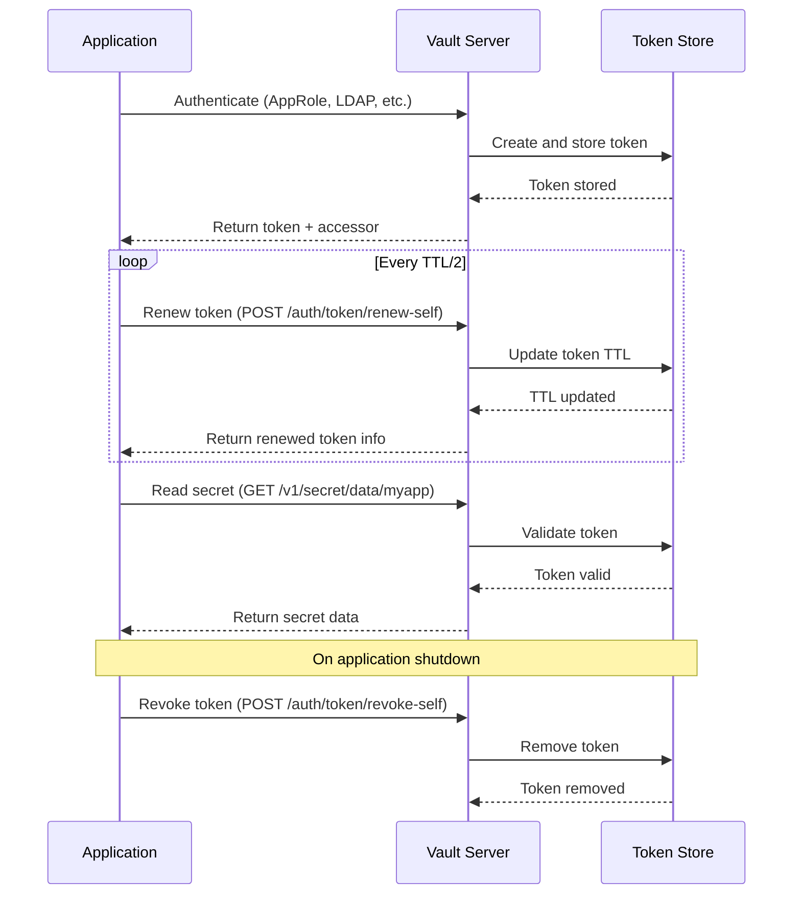
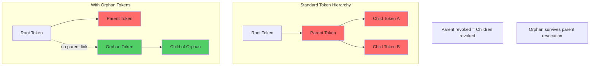
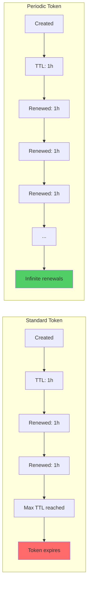

# How to Implement Vault Service Tokens

Author: [nawazdhandala](https://github.com/nawazdhandala)

Tags: Vault, Security, Tokens, Applications

Description: Learn how to implement HashiCorp Vault service tokens for long-lived operations with proper lifecycle management, renewal strategies, and orphan token handling.

---

HashiCorp Vault uses tokens as the primary authentication method for API requests. Service tokens are specifically designed for applications and automated processes that need long-lived access to secrets. Understanding their lifecycle, hierarchy, and renewal mechanisms is critical for building reliable systems.

## Service Token Characteristics

Service tokens differ from batch tokens in several important ways:

| Feature | Service Tokens | Batch Tokens |
|---------|---------------|--------------|
| Storage | Stored in Vault | Not stored |
| Renewal | Can be renewed | Cannot be renewed |
| Revocation | Can be revoked individually | Revoked with parent |
| Performance | Slightly slower (storage lookup) | Faster (self-contained) |
| Use case | Long-lived operations | Short-lived, high-volume |

### Creating a Service Token

```bash
# Create a basic service token with a policy attached
vault token create \
  -policy="app-secrets-read" \
  -ttl="24h" \
  -display-name="my-application"
```

The response includes critical fields:

```json
{
  "auth": {
    "client_token": "hvs.CAESIJlR...",
    "accessor": "aGvs.abc123...",
    "policies": ["default", "app-secrets-read"],
    "token_policies": ["default", "app-secrets-read"],
    "lease_duration": 86400,
    "renewable": true
  }
}
```

## Service Token Flow

Here is how service tokens interact with Vault during their lifecycle:



## Token Accessor and Revocation

The token accessor is a reference to a token that allows limited operations without exposing the actual token value. This is crucial for security auditing and administrative operations.

### Why Use Accessors

- List active tokens without exposing secrets
- Revoke tokens without knowing their values
- Audit token usage safely
- Allow operators to manage tokens they did not create

### Managing Tokens via Accessor

```bash
# Look up token information using accessor (does not reveal the token)
vault token lookup -accessor "aGvs.abc123..."

# Revoke a token using its accessor
vault token revoke -accessor "aGvs.abc123..."

# List all accessors (requires appropriate policy)
vault list auth/token/accessors
```

### Programmatic Accessor Management

```python
import hvac

# Initialize the Vault client
client = hvac.Client(url='https://vault.example.com:8200')
client.token = 'hvs.admin-token...'

# Look up token by accessor without exposing the token value
accessor = "aGvs.abc123..."
token_info = client.auth.token.lookup_accessor(accessor)

print(f"Token policies: {token_info['data']['policies']}")
print(f"Token TTL remaining: {token_info['data']['ttl']} seconds")
print(f"Token created: {token_info['data']['creation_time']}")

# Revoke token by accessor when the application no longer needs it
client.auth.token.revoke_accessor(accessor)
print("Token revoked successfully")
```

### Batch Revocation Script

```bash
#!/bin/bash
# Revoke all tokens matching a specific policy
# Useful for rotating credentials after a security incident

POLICY_TO_REVOKE="compromised-app-policy"

# List all token accessors
for accessor in $(vault list -format=json auth/token/accessors | jq -r '.[]'); do
    # Check if token has the target policy
    policies=$(vault token lookup -accessor "$accessor" -format=json 2>/dev/null | jq -r '.data.policies[]')

    if echo "$policies" | grep -q "$POLICY_TO_REVOKE"; then
        echo "Revoking token with accessor: $accessor"
        vault token revoke -accessor "$accessor"
    fi
done

echo "Revocation complete"
```

## Orphan Tokens and Hierarchy

By default, Vault tokens form a hierarchy. When a parent token is revoked, all child tokens are also revoked. Orphan tokens break this chain.



### When to Use Orphan Tokens

- Long-running background jobs that outlive the creating process
- Services that need independent lifecycle management
- CI/CD pipelines where the orchestrator may terminate
- Microservices that should not be affected by other service restarts

### Creating Orphan Tokens

```bash
# Create an orphan token (requires sudo or root capability)
vault token create \
  -orphan \
  -policy="background-job-policy" \
  -ttl="168h" \
  -display-name="weekly-batch-processor"
```

### Orphan Token in Application Code

```python
import hvac

client = hvac.Client(url='https://vault.example.com:8200')
client.token = 'hvs.parent-token...'

# Create an orphan token for a background worker
# The worker will survive even if this process terminates
orphan_token_response = client.auth.token.create(
    policies=['worker-secrets-read'],
    ttl='24h',
    renewable=True,
    orphan=True,  # Critical: breaks parent-child relationship
    display_name='background-worker'
)

orphan_token = orphan_token_response['auth']['client_token']
orphan_accessor = orphan_token_response['auth']['accessor']

print(f"Created orphan token with accessor: {orphan_accessor}")
print("This token will survive parent revocation")

# Pass the orphan token to the background worker
start_background_worker(orphan_token)
```

## Token Renewal and Periodic Tokens

### Standard Token Renewal

Tokens have a TTL (time to live) and a max TTL. You must renew before the TTL expires.

```python
import hvac
import time
import threading

class VaultTokenManager:
    """Manages Vault token lifecycle with automatic renewal."""

    def __init__(self, vault_url, initial_token):
        self.client = hvac.Client(url=vault_url, token=initial_token)
        self._stop_renewal = threading.Event()
        self._renewal_thread = None

    def start_renewal_loop(self):
        """Start background thread to renew token before expiration."""
        self._renewal_thread = threading.Thread(target=self._renewal_worker)
        self._renewal_thread.daemon = True
        self._renewal_thread.start()

    def _renewal_worker(self):
        """Worker that renews token at half of TTL."""
        while not self._stop_renewal.is_set():
            try:
                # Look up current token TTL
                token_info = self.client.auth.token.lookup_self()
                ttl = token_info['data']['ttl']

                # Sleep for half the TTL before renewing
                sleep_time = max(ttl // 2, 60)  # At least 60 seconds
                print(f"Token TTL: {ttl}s, sleeping for {sleep_time}s before renewal")

                if self._stop_renewal.wait(timeout=sleep_time):
                    break  # Stop signal received

                # Renew the token
                renewal_response = self.client.auth.token.renew_self()
                new_ttl = renewal_response['auth']['lease_duration']
                print(f"Token renewed successfully, new TTL: {new_ttl}s")

            except hvac.exceptions.Forbidden:
                print("Token renewal failed: token may be at max TTL")
                break
            except Exception as e:
                print(f"Renewal error: {e}, retrying in 30s")
                self._stop_renewal.wait(timeout=30)

    def stop(self):
        """Stop the renewal loop and revoke the token."""
        self._stop_renewal.set()
        if self._renewal_thread:
            self._renewal_thread.join(timeout=5)

        # Clean up: revoke the token
        try:
            self.client.auth.token.revoke_self()
            print("Token revoked on shutdown")
        except Exception as e:
            print(f"Failed to revoke token: {e}")


# Usage example
if __name__ == "__main__":
    manager = VaultTokenManager(
        vault_url='https://vault.example.com:8200',
        initial_token='hvs.app-token...'
    )
    manager.start_renewal_loop()

    # Your application logic here
    try:
        while True:
            time.sleep(1)
    except KeyboardInterrupt:
        manager.stop()
```

### Periodic Tokens

Periodic tokens have no max TTL limit. They can be renewed indefinitely as long as the renewal happens before the TTL expires.



### Creating and Using Periodic Tokens

```bash
# Create a periodic token (requires sudo capability)
vault token create \
  -policy="long-running-service" \
  -period="1h" \
  -display-name="eternal-worker"
```

```python
import hvac

client = hvac.Client(url='https://vault.example.com:8200')
client.token = 'hvs.admin-token...'

# Create a periodic token for a service that must never lose access
periodic_response = client.auth.token.create(
    policies=['critical-service-policy'],
    period='3600',  # 1 hour period
    renewable=True,
    display_name='critical-background-service'
)

# Periodic tokens reset their TTL to the period value on each renewal
# They have no max_ttl limit
token_data = periodic_response['auth']
print(f"Periodic token created")
print(f"Period: {token_data.get('period', 'N/A')}s")
print(f"This token can be renewed indefinitely")
```

### Token Role for Consistent Configuration

Define token roles to standardize token creation across your organization:

```bash
# Create a token role for application service tokens
vault write auth/token/roles/app-service-token \
  allowed_policies="app-secrets-read,app-database-creds" \
  disallowed_policies="admin,root" \
  orphan=true \
  renewable=true \
  token_period="1h" \
  token_explicit_max_ttl="0"
```

```python
# Create tokens using the role for consistency
client = hvac.Client(url='https://vault.example.com:8200')
client.token = 'hvs.orchestrator-token...'

# Create a token using the predefined role
# This ensures consistent settings across all application tokens
token_response = client.auth.token.create(
    role_name='app-service-token',
    display_name='payment-service-prod'
)

print("Token created with role-defined settings")
print(f"Policies: {token_response['auth']['policies']}")
print(f"Renewable: {token_response['auth']['renewable']}")
```

## Complete Application Example

Here is a full example showing proper service token management in a production application:

```python
import hvac
import os
import signal
import sys
import threading
import time
from contextlib import contextmanager


class VaultServiceTokenClient:
    """Production-ready Vault client with automatic token lifecycle management."""

    def __init__(self, vault_addr, role_id, secret_id):
        self.vault_addr = vault_addr
        self.role_id = role_id
        self.secret_id = secret_id
        self.client = hvac.Client(url=vault_addr)
        self._renewal_thread = None
        self._shutdown = threading.Event()
        self._token_accessor = None

    def authenticate(self):
        """Authenticate using AppRole and get a service token."""
        response = self.client.auth.approle.login(
            role_id=self.role_id,
            secret_id=self.secret_id
        )

        self.client.token = response['auth']['client_token']
        self._token_accessor = response['auth']['accessor']

        print(f"Authenticated successfully")
        print(f"Token accessor: {self._token_accessor}")
        print(f"Token TTL: {response['auth']['lease_duration']}s")
        print(f"Renewable: {response['auth']['renewable']}")

        return response['auth']

    def start_token_renewal(self):
        """Start background renewal of the service token."""
        self._renewal_thread = threading.Thread(
            target=self._token_renewal_loop,
            name="vault-token-renewal"
        )
        self._renewal_thread.daemon = True
        self._renewal_thread.start()

    def _token_renewal_loop(self):
        """Continuously renew token before expiration."""
        consecutive_failures = 0
        max_failures = 3

        while not self._shutdown.is_set():
            try:
                # Get current TTL
                lookup = self.client.auth.token.lookup_self()
                ttl = lookup['data']['ttl']

                # Renew at 50% of TTL, minimum 30 seconds
                sleep_duration = max(ttl * 0.5, 30)

                if self._shutdown.wait(timeout=sleep_duration):
                    break

                # Perform renewal
                self.client.auth.token.renew_self()
                consecutive_failures = 0
                print(f"Token renewed, next renewal in {sleep_duration}s")

            except hvac.exceptions.Forbidden:
                # Token cannot be renewed (max TTL or revoked)
                print("Token cannot be renewed, re-authenticating...")
                try:
                    self.authenticate()
                    consecutive_failures = 0
                except Exception as auth_error:
                    print(f"Re-authentication failed: {auth_error}")
                    consecutive_failures += 1

            except Exception as e:
                consecutive_failures += 1
                print(f"Renewal failed ({consecutive_failures}/{max_failures}): {e}")

                if consecutive_failures >= max_failures:
                    print("Max renewal failures reached, attempting re-auth")
                    try:
                        self.authenticate()
                        consecutive_failures = 0
                    except Exception:
                        self._shutdown.wait(timeout=30)

    def get_secret(self, path):
        """Retrieve a secret from Vault KV v2."""
        response = self.client.secrets.kv.v2.read_secret_version(
            path=path,
            mount_point='secret'
        )
        return response['data']['data']

    def shutdown(self):
        """Gracefully shutdown and revoke the token."""
        print("Shutting down Vault client...")
        self._shutdown.set()

        if self._renewal_thread:
            self._renewal_thread.join(timeout=5)

        # Revoke our token on shutdown
        try:
            self.client.auth.token.revoke_self()
            print("Token revoked successfully")
        except Exception as e:
            print(f"Failed to revoke token: {e}")


@contextmanager
def vault_client(vault_addr, role_id, secret_id):
    """Context manager for proper Vault client lifecycle."""
    client = VaultServiceTokenClient(vault_addr, role_id, secret_id)
    client.authenticate()
    client.start_token_renewal()

    try:
        yield client
    finally:
        client.shutdown()


# Application entry point
def main():
    vault_addr = os.environ.get('VAULT_ADDR', 'https://vault.example.com:8200')
    role_id = os.environ['VAULT_ROLE_ID']
    secret_id = os.environ['VAULT_SECRET_ID']

    with vault_client(vault_addr, role_id, secret_id) as vault:
        # Handle graceful shutdown
        def signal_handler(sig, frame):
            print("\nReceived shutdown signal")
            sys.exit(0)

        signal.signal(signal.SIGINT, signal_handler)
        signal.signal(signal.SIGTERM, signal_handler)

        # Main application loop
        while True:
            # Fetch secrets as needed
            db_creds = vault.get_secret('myapp/database')
            print(f"Using database: {db_creds.get('host')}")

            # Your application logic here
            time.sleep(60)


if __name__ == "__main__":
    main()
```

## Best Practices Summary

1. **Always use the minimum required TTL** for your use case to limit exposure if a token is compromised.

2. **Implement automatic renewal** rather than creating tokens with very long TTLs.

3. **Use orphan tokens** for background jobs that need independent lifecycles.

4. **Use periodic tokens** for services that must run indefinitely.

5. **Store and track accessors** for auditing and emergency revocation.

6. **Revoke tokens on shutdown** to prevent token accumulation.

7. **Use token roles** to enforce consistent security policies across your organization.

8. **Monitor token usage** through Vault audit logs to detect anomalies.

---

Service tokens are the backbone of Vault-based secret management for applications. By understanding their lifecycle, hierarchy, and renewal mechanisms, you can build systems that maintain secure access to secrets without manual intervention or downtime.
