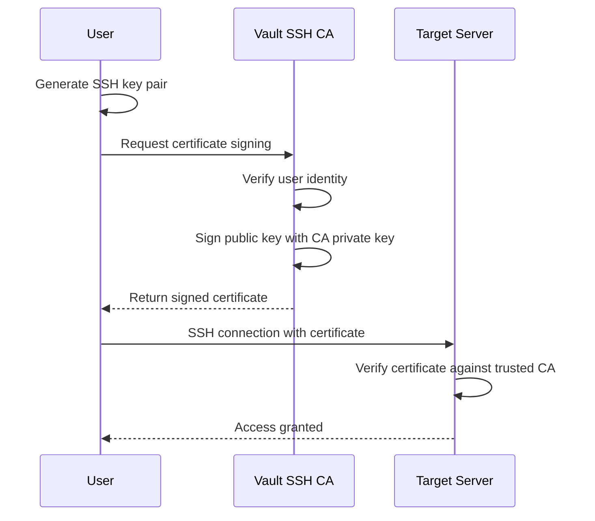
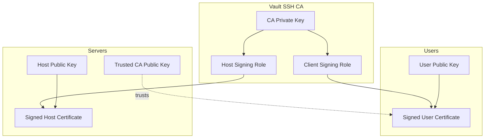
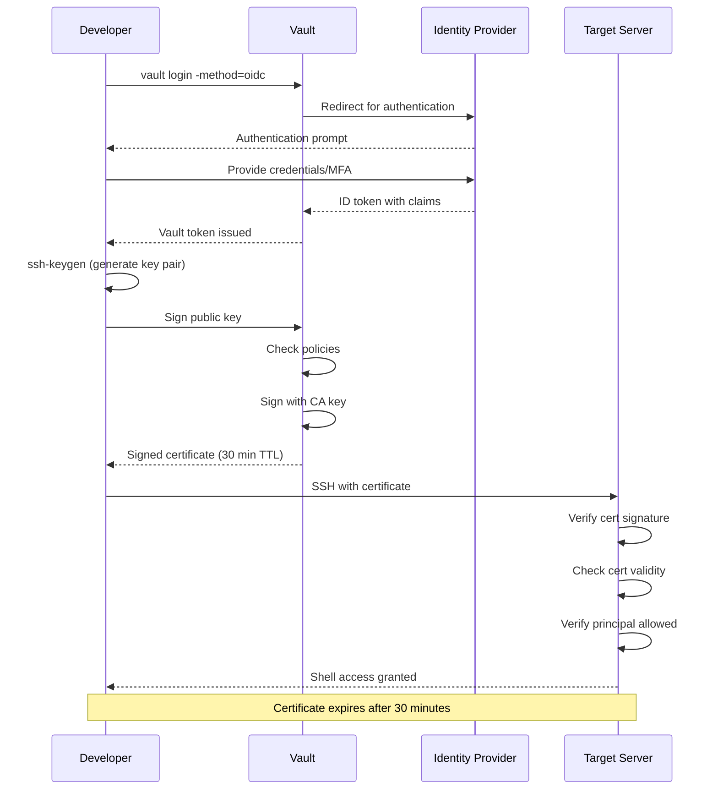

# How to Implement Vault SSH CA

Author: [nawazdhandala](https://github.com/nawazdhandala)

Tags: Vault, Security, SSH, Certificates

Description: A complete guide to implementing certificate-based SSH authentication using HashiCorp Vault as your SSH Certificate Authority.

---

Managing SSH keys at scale is painful. Keys get copied around, never expire, and you have no idea who has access to what. Vault SSH CA solves this by issuing short-lived certificates instead of managing static keys. No more authorized_keys files scattered across hundreds of servers.

## How SSH Certificates Work

Instead of trusting individual public keys, servers trust a Certificate Authority (CA). The CA signs user public keys, creating certificates that servers automatically trust.



## Setting Up Vault SSH CA

### Enable the SSH Secrets Engine

Vault's SSH secrets engine handles certificate signing. Enable it first.

```bash
# Enable SSH secrets engine at the default path
vault secrets enable ssh

# Or enable at a custom path for multiple CAs
vault secrets enable -path=ssh-client-signer ssh
vault secrets enable -path=ssh-host-signer ssh
```

### Generate the CA Key Pair

Vault can generate the CA key pair or you can provide your own.

```bash
# Let Vault generate the CA key pair (recommended)
vault write ssh-client-signer/config/ca generate_signing_key=true

# Read the public key to distribute to servers
vault read -field=public_key ssh-client-signer/config/ca > trusted-user-ca-keys.pem
```

If you need to import an existing CA:

```bash
# Import existing CA key pair
vault write ssh-client-signer/config/ca \
    private_key=@ca-private-key.pem \
    public_key=@ca-public-key.pem
```

## Certificate Architecture



## Creating Signing Roles

Roles define the constraints for issued certificates. Create different roles for different access levels.

### Basic User Certificate Role

```bash
# Create a role for regular users
vault write ssh-client-signer/roles/default-user \
    key_type=ca \
    default_user=ubuntu \
    allowed_users="ubuntu,deploy,app" \
    allowed_extensions="permit-pty,permit-agent-forwarding" \
    default_extensions='{"permit-pty": ""}' \
    ttl=30m \
    max_ttl=24h
```

### Role Parameters Explained

| Parameter | Description |
|-----------|-------------|
| key_type | Must be "ca" for certificate signing |
| default_user | Username if none specified in request |
| allowed_users | Comma-separated list of allowed usernames |
| allowed_extensions | SSH certificate extensions to allow |
| default_extensions | Extensions included by default |
| ttl | Default certificate lifetime |
| max_ttl | Maximum certificate lifetime |

### Admin Role with Extended Access

```bash
# Create a role for administrators with more permissions
vault write ssh-client-signer/roles/admin \
    key_type=ca \
    default_user=root \
    allowed_users="*" \
    allowed_extensions="permit-pty,permit-agent-forwarding,permit-port-forwarding" \
    default_extensions='{"permit-pty": "", "permit-agent-forwarding": ""}' \
    allow_user_certificates=true \
    ttl=1h \
    max_ttl=4h
```

### Role for CI/CD Systems

```bash
# Create a role for automated systems with no PTY
vault write ssh-client-signer/roles/automation \
    key_type=ca \
    default_user=deploy \
    allowed_users="deploy" \
    allowed_extensions="" \
    default_extensions='{}' \
    allow_user_certificates=true \
    ttl=10m \
    max_ttl=1h
```

## Signing Client Certificates

### Sign a User's Public Key

```bash
# Generate a new SSH key pair (if needed)
ssh-keygen -t ed25519 -f ~/.ssh/id_ed25519 -N ""

# Sign the public key with Vault
vault write -field=signed_key ssh-client-signer/sign/default-user \
    public_key=@$HOME/.ssh/id_ed25519.pub > ~/.ssh/id_ed25519-cert.pub

# Verify the certificate
ssh-keygen -L -f ~/.ssh/id_ed25519-cert.pub
```

### Certificate Output Example

```
/home/user/.ssh/id_ed25519-cert.pub:
        Type: ssh-ed25519-cert-v01@openssh.com user certificate
        Public key: ED25519-CERT SHA256:ABC123...
        Signing CA: ED25519 SHA256:XYZ789... (using ssh-ed25519)
        Key ID: "vault-token-abc123"
        Serial: 1234567890
        Valid: from 2026-01-30T10:00:00 to 2026-01-30T10:30:00
        Principals:
                ubuntu
        Critical Options: (none)
        Extensions:
                permit-pty
```

### Request Certificate with Specific User

```bash
# Request certificate for a specific valid principal
vault write -field=signed_key ssh-client-signer/sign/default-user \
    public_key=@$HOME/.ssh/id_ed25519.pub \
    valid_principals="deploy" > ~/.ssh/id_ed25519-cert.pub
```

## Configuring Servers to Trust the CA

### Add Trusted CA to SSH Server

```bash
# Copy the CA public key to the server
sudo tee /etc/ssh/trusted-user-ca-keys.pem << 'EOF'
ssh-ed25519 AAAAC3NzaC1lZDI1NTE5AAAAI... vault-ssh-ca
EOF

# Set proper permissions
sudo chmod 644 /etc/ssh/trusted-user-ca-keys.pem
```

### Configure sshd_config

```bash
# Add these lines to /etc/ssh/sshd_config
sudo tee -a /etc/ssh/sshd_config << 'EOF'

# Trust certificates signed by our Vault CA
TrustedUserCAKeys /etc/ssh/trusted-user-ca-keys.pem

# Optional: Require certificates (disable password and key auth)
# AuthorizedKeysFile none
# PasswordAuthentication no

# Optional: Map certificate principals to local users
AuthorizedPrincipalsFile /etc/ssh/auth_principals/%u
EOF

# Restart SSH daemon
sudo systemctl restart sshd
```

### Set Up Principal Mapping

Principals in certificates map to local users. Create principal files for each user.

```bash
# Create principals directory
sudo mkdir -p /etc/ssh/auth_principals

# Allow 'ubuntu' principal to log in as ubuntu user
echo "ubuntu" | sudo tee /etc/ssh/auth_principals/ubuntu

# Allow 'deploy' principal to log in as deploy user
echo "deploy" | sudo tee /etc/ssh/auth_principals/deploy

# Allow multiple principals for root
cat << 'EOF' | sudo tee /etc/ssh/auth_principals/root
admin
emergency-access
EOF
```

## Host Certificate Signing

Signing host certificates prevents "unknown host key" warnings and man-in-the-middle attacks.

### Create Host Signing Role

```bash
# Enable host certificate signing
vault write ssh-host-signer/config/ca generate_signing_key=true

# Create role for signing host keys
vault write ssh-host-signer/roles/host-cert \
    key_type=ca \
    algorithm_signer=rsa-sha2-256 \
    ttl=87600h \
    allow_host_certificates=true \
    allowed_domains="example.com,internal.example.com" \
    allow_subdomains=true
```

### Sign Host Keys

```bash
# Sign the server's host key
vault write -field=signed_key ssh-host-signer/sign/host-cert \
    cert_type=host \
    public_key=@/etc/ssh/ssh_host_ed25519_key.pub \
    valid_principals="server1.example.com,192.168.1.100" \
    > /etc/ssh/ssh_host_ed25519_key-cert.pub

# Configure sshd to use the host certificate
echo "HostCertificate /etc/ssh/ssh_host_ed25519_key-cert.pub" >> /etc/ssh/sshd_config
sudo systemctl restart sshd
```

### Configure Clients to Trust Host CA

```bash
# Add to ~/.ssh/known_hosts or /etc/ssh/ssh_known_hosts
# Format: @cert-authority <domain-pattern> <ca-public-key>
echo "@cert-authority *.example.com $(vault read -field=public_key ssh-host-signer/config/ca)" >> ~/.ssh/known_hosts
```

## Complete Authentication Flow



## Vault Policies for SSH CA

### Policy for Regular Users

```hcl
# ssh-user-policy.hcl
# Allow users to sign their own keys with default-user role
path "ssh-client-signer/sign/default-user" {
  capabilities = ["create", "update"]
}

# Allow reading the CA public key
path "ssh-client-signer/config/ca" {
  capabilities = ["read"]
}
```

### Policy for Admins

```hcl
# ssh-admin-policy.hcl
# Allow admins to use the admin role
path "ssh-client-signer/sign/admin" {
  capabilities = ["create", "update"]
}

# Allow managing roles
path "ssh-client-signer/roles/*" {
  capabilities = ["create", "read", "update", "delete", "list"]
}

# Allow reading CA config
path "ssh-client-signer/config/ca" {
  capabilities = ["read"]
}
```

### Apply Policies

```bash
# Create and assign policies
vault policy write ssh-user ssh-user-policy.hcl
vault policy write ssh-admin ssh-admin-policy.hcl

# Assign to OIDC groups
vault write auth/oidc/role/developer \
    bound_audiences="vault" \
    allowed_redirect_uris="http://localhost:8250/oidc/callback" \
    user_claim="sub" \
    policies="ssh-user"
```

## Automation Scripts

### Helper Script for Users

```bash
#!/bin/bash
# ssh-cert.sh - Get a signed SSH certificate from Vault

set -e

VAULT_ADDR="${VAULT_ADDR:-https://vault.example.com}"
SSH_KEY="${SSH_KEY:-$HOME/.ssh/id_ed25519}"
ROLE="${ROLE:-default-user}"

# Check if logged into Vault
if ! vault token lookup > /dev/null 2>&1; then
    echo "Not logged into Vault. Running vault login..."
    vault login -method=oidc
fi

# Generate key if it does not exist
if [[ ! -f "$SSH_KEY" ]]; then
    echo "Generating new SSH key..."
    ssh-keygen -t ed25519 -f "$SSH_KEY" -N ""
fi

# Sign the public key
echo "Requesting certificate from Vault..."
vault write -field=signed_key "ssh-client-signer/sign/$ROLE" \
    public_key=@"${SSH_KEY}.pub" > "${SSH_KEY}-cert.pub"

# Show certificate details
echo "Certificate obtained:"
ssh-keygen -L -f "${SSH_KEY}-cert.pub" | head -20

# Add to SSH agent
ssh-add "$SSH_KEY" 2>/dev/null || true

echo "Ready to SSH. Certificate valid for:"
ssh-keygen -L -f "${SSH_KEY}-cert.pub" | grep "Valid:"
```

### Ansible Playbook for Server Configuration

```yaml
# configure-ssh-ca.yml
---
- name: Configure SSH CA Trust
  hosts: all
  become: yes
  vars:
    vault_addr: "https://vault.example.com"
    ca_public_key: "{{ lookup('url', vault_addr + '/v1/ssh-client-signer/config/ca', headers={'X-Vault-Token': vault_token}) | from_json | json_query('data.public_key') }}"

  tasks:
    - name: Write trusted CA key
      copy:
        content: "{{ ca_public_key }}"
        dest: /etc/ssh/trusted-user-ca-keys.pem
        mode: '0644'

    - name: Configure sshd to trust CA
      lineinfile:
        path: /etc/ssh/sshd_config
        line: "TrustedUserCAKeys /etc/ssh/trusted-user-ca-keys.pem"
        regexp: "^TrustedUserCAKeys"
      notify: Restart sshd

    - name: Create auth_principals directory
      file:
        path: /etc/ssh/auth_principals
        state: directory
        mode: '0755'

    - name: Configure AuthorizedPrincipalsFile
      lineinfile:
        path: /etc/ssh/sshd_config
        line: "AuthorizedPrincipalsFile /etc/ssh/auth_principals/%u"
        regexp: "^AuthorizedPrincipalsFile"
      notify: Restart sshd

    - name: Create principal files
      copy:
        content: "{{ item.principals | join('\n') }}"
        dest: "/etc/ssh/auth_principals/{{ item.user }}"
        mode: '0644'
      loop:
        - { user: 'ubuntu', principals: ['ubuntu', 'deploy'] }
        - { user: 'root', principals: ['admin'] }

  handlers:
    - name: Restart sshd
      service:
        name: sshd
        state: restarted
```

## Troubleshooting

### Certificate Rejected

```bash
# Check certificate validity
ssh-keygen -L -f ~/.ssh/id_ed25519-cert.pub

# Common issues:
# 1. Certificate expired - request a new one
# 2. Principal not allowed - check auth_principals file
# 3. CA not trusted - verify TrustedUserCAKeys path
```

### Debug SSH Connection

```bash
# Verbose SSH to see certificate negotiation
ssh -vvv user@server.example.com 2>&1 | grep -i cert

# Check server logs
sudo journalctl -u sshd -f
```

### Verify Server Configuration

```bash
# Test sshd configuration
sudo sshd -t

# Check if CA key is readable
sudo cat /etc/ssh/trusted-user-ca-keys.pem

# Verify principals file exists
cat /etc/ssh/auth_principals/ubuntu
```

## Security Best Practices

1. **Short TTLs** - Use 30 minute certificates for interactive sessions
2. **Restrict principals** - Map principals to specific users, avoid wildcards
3. **Audit certificate issuance** - Enable Vault audit logging
4. **Rotate CA keys** - Plan for CA key rotation before deployment
5. **Require MFA** - Use OIDC with MFA for Vault authentication
6. **Limit extensions** - Only allow necessary SSH extensions per role

## Comparison with Static Keys

| Aspect | Static SSH Keys | Vault SSH CA |
|--------|-----------------|--------------|
| Key management | Manual distribution | Automated signing |
| Expiration | Never (unless manually revoked) | Built-in TTL |
| Audit trail | Limited | Full Vault audit logs |
| Onboarding | Copy keys to servers | One-time CA trust setup |
| Offboarding | Remove keys from all servers | Revoke Vault access |
| Scaling | Linear complexity | Constant complexity |

---

Vault SSH CA transforms SSH access management from a key distribution nightmare into a streamlined certificate workflow. Short-lived certificates mean compromised keys expire quickly. Centralized signing means one place to audit and revoke access. The initial setup takes effort, but the operational benefits compound as your infrastructure grows.
