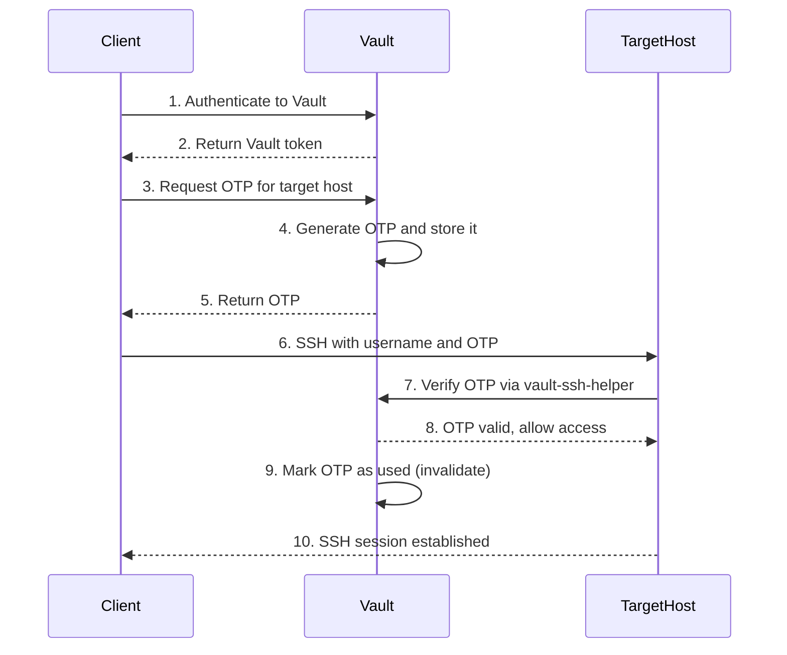
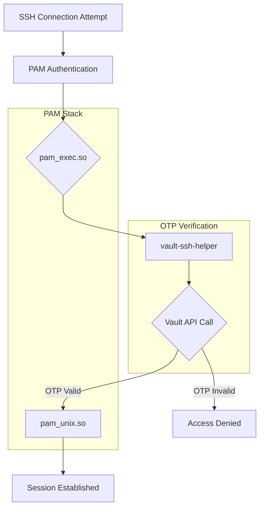
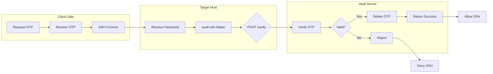

# How to Build Vault SSH OTP

Author: [nawazdhandala](https://github.com/nawazdhandala)

Tags: Vault, Security, SSH, OTP

Description: Implement secure SSH access using HashiCorp Vault's SSH OTP secrets engine for one-time password authentication.

---

Traditional SSH authentication relies on static passwords or long-lived SSH keys. Both approaches have security weaknesses: passwords can be guessed or stolen, and SSH keys that never expire become a liability. Vault's SSH OTP secrets engine solves this by generating one-time passwords that expire after a single use.

## How Vault SSH OTP Works

The SSH OTP workflow involves three components: Vault server, target host, and the client requesting access. Each OTP is valid for a single authentication attempt and a short time window.



## Prerequisites

Before configuring the SSH OTP secrets engine, ensure you have:

- HashiCorp Vault server running and unsealed
- Root or admin access to Vault
- Root access to target SSH hosts
- Network connectivity between target hosts and Vault

```bash
# Verify Vault is running and accessible
vault status

# Authenticate to Vault (using root token for setup)
export VAULT_ADDR='https://vault.example.com:8200'
vault login
```

## Enable the SSH Secrets Engine

First, enable the SSH secrets engine at a mount path.

```bash
# Enable SSH secrets engine at the default path
vault secrets enable ssh

# Or enable at a custom path for organization
vault secrets enable -path=ssh-otp ssh
```

Verify the secrets engine is enabled:

```bash
vault secrets list
```

## Configure the OTP Role

Roles define which users can request OTPs and for which target hosts. Create a role that specifies the allowed CIDR blocks and default username.

```bash
# Create an OTP role for server access
vault write ssh/roles/otp_key_role \
    key_type=otp \
    default_user=ubuntu \
    allowed_users="ubuntu,admin,deploy" \
    cidr_list="10.0.0.0/8,192.168.0.0/16"
```

### Role Configuration Options

| Parameter | Description | Example |
|-----------|-------------|---------|
| key_type | Must be "otp" for OTP mode | otp |
| default_user | Default SSH username if none specified | ubuntu |
| allowed_users | Comma-separated list of allowed usernames | ubuntu,admin |
| cidr_list | IP ranges of target hosts | 10.0.0.0/8 |
| port | SSH port on target hosts | 22 |
| ttl | OTP validity period | 30s |

### Advanced Role Configuration

```bash
# Create a role with stricter settings
vault write ssh/roles/production_servers \
    key_type=otp \
    default_user=deploy \
    allowed_users="deploy" \
    cidr_list="10.100.0.0/16" \
    port=22 \
    ttl=30s
```

## Install vault-ssh-helper on Target Hosts

The target host needs vault-ssh-helper to verify OTPs against Vault. This lightweight binary handles the verification process.

### Download and Install

```bash
# Download vault-ssh-helper
wget https://releases.hashicorp.com/vault-ssh-helper/0.2.1/vault-ssh-helper_0.2.1_linux_amd64.zip

# Unzip and install
unzip vault-ssh-helper_0.2.1_linux_amd64.zip
sudo mv vault-ssh-helper /usr/local/bin/
sudo chmod 0755 /usr/local/bin/vault-ssh-helper

# Create configuration directory
sudo mkdir -p /etc/vault-ssh-helper.d
```

### Configure vault-ssh-helper

Create the configuration file that tells vault-ssh-helper how to reach your Vault server.

```bash
# Create configuration file
sudo tee /etc/vault-ssh-helper.d/config.hcl << 'EOF'
vault_addr = "https://vault.example.com:8200"
ssh_mount_point = "ssh"
tls_skip_verify = false
ca_cert = "/etc/ssl/certs/vault-ca.pem"
allowed_roles = "*"
allowed_cidr_list = "0.0.0.0/0"
EOF
```

### Configuration File Options

```hcl
# /etc/vault-ssh-helper.d/config.hcl

# Vault server address (required)
vault_addr = "https://vault.example.com:8200"

# Mount point of SSH secrets engine (default: ssh)
ssh_mount_point = "ssh"

# Namespace for Vault Enterprise (optional)
# namespace = "admin"

# TLS verification (set to false only for testing)
tls_skip_verify = false

# CA certificate for Vault TLS
ca_cert = "/etc/ssl/certs/vault-ca.pem"

# Roles allowed to authenticate (use "*" for all)
allowed_roles = "otp_key_role,production_servers"

# CIDR ranges allowed to connect
allowed_cidr_list = "0.0.0.0/0"
```

### Verify vault-ssh-helper Configuration

```bash
# Test the configuration
vault-ssh-helper -verify-only -config=/etc/vault-ssh-helper.d/config.hcl

# Expected output: Using SSH Mount point: ssh
```

## Configure PAM for OTP Authentication

PAM (Pluggable Authentication Modules) must be configured to use vault-ssh-helper for SSH authentication.

### Update PAM SSH Configuration

```bash
# Backup original PAM configuration
sudo cp /etc/pam.d/sshd /etc/pam.d/sshd.backup

# Edit PAM configuration for SSH
sudo tee /etc/pam.d/sshd << 'EOF'
# Vault OTP authentication
auth requisite pam_exec.so quiet expose_authtok log=/var/log/vault-ssh.log /usr/local/bin/vault-ssh-helper -config=/etc/vault-ssh-helper.d/config.hcl
auth optional pam_unix.so not_set_pass use_first_pass nodelay

# Standard PAM includes for account, session, and password
account required pam_nologin.so
account include password-auth
password include password-auth
session optional pam_keyinit.so revoke
session required pam_limits.so
session optional pam_systemd.so
session include password-auth
EOF
```

### PAM Authentication Flow



### Configure SSHD for PAM Authentication

Update the SSH daemon configuration to use PAM and allow password authentication.

```bash
# Edit SSHD configuration
sudo tee -a /etc/ssh/sshd_config.d/vault-otp.conf << 'EOF'
# Enable PAM authentication
UsePAM yes

# Enable keyboard-interactive authentication for OTP
ChallengeResponseAuthentication yes
PasswordAuthentication no
KbdInteractiveAuthentication yes

# Disable public key auth if using OTP only (optional)
# PubkeyAuthentication no
EOF

# Validate configuration
sudo sshd -t

# Restart SSH daemon
sudo systemctl restart sshd
```

## Create Vault Policies for OTP Access

Define policies that control who can request OTPs for which roles.

```bash
# Create policy for developers
vault policy write ssh-otp-developer - << 'EOF'
# Allow requesting OTPs for the otp_key_role
path "ssh/creds/otp_key_role" {
  capabilities = ["create", "update"]
}

# Allow listing available roles
path "ssh/roles/*" {
  capabilities = ["list", "read"]
}
EOF

# Create policy for operations team
vault policy write ssh-otp-ops - << 'EOF'
# Allow requesting OTPs for production servers
path "ssh/creds/production_servers" {
  capabilities = ["create", "update"]
}

path "ssh/creds/otp_key_role" {
  capabilities = ["create", "update"]
}

path "ssh/roles/*" {
  capabilities = ["list", "read"]
}
EOF
```

## Request and Use an OTP

Once everything is configured, users can request OTPs from Vault.

### Using the Vault CLI

```bash
# Authenticate to Vault
vault login -method=ldap username=jsmith

# Request an OTP for a target host
vault write ssh/creds/otp_key_role \
    ip=10.0.1.50

# Response includes the OTP
# Key             Value
# ---             -----
# lease_id        ssh/creds/otp_key_role/abcd1234
# lease_duration  768h
# key             2f7e25a2-24c9-4b7b-0d35-27d5e5203a5c
# key_type        otp
# port            22
# username        ubuntu
```

### Using the OTP to Connect

```bash
# SSH to the target host using the OTP as password
ssh ubuntu@10.0.1.50
# Enter the OTP when prompted for password

# Or use sshpass for automation (not recommended for interactive use)
sshpass -p "2f7e25a2-24c9-4b7b-0d35-27d5e5203a5c" ssh ubuntu@10.0.1.50
```

### Using the Vault SSH Command

Vault provides a convenient SSH command that handles OTP generation automatically.

```bash
# Use vault ssh command for streamlined access
vault ssh -role otp_key_role -mode otp ubuntu@10.0.1.50

# With specific Vault address
VAULT_ADDR=https://vault.example.com:8200 vault ssh \
    -role otp_key_role \
    -mode otp \
    ubuntu@10.0.1.50
```

## OTP Verification and Cleanup

### How OTP Verification Works



### OTP Lifecycle

1. **Generation**: OTP is created and stored in Vault with a TTL
2. **Delivery**: OTP is returned to the authenticated client
3. **Usage**: Client uses OTP to authenticate via SSH
4. **Verification**: Target host verifies OTP against Vault
5. **Invalidation**: OTP is immediately marked as used
6. **Cleanup**: Expired or used OTPs are automatically purged

### Monitor OTP Usage

```bash
# View audit logs for OTP requests
vault audit enable file file_path=/var/log/vault/audit.log

# Check audit log for OTP activities
grep "ssh/creds" /var/log/vault/audit.log | jq .
```

## Automation Script

Create a helper script for requesting and using OTPs.

```bash
#!/bin/bash
# vault-ssh.sh - Helper script for Vault SSH OTP

set -e

# Configuration
VAULT_ADDR="${VAULT_ADDR:-https://vault.example.com:8200}"
SSH_ROLE="${SSH_ROLE:-otp_key_role}"

# Parse arguments
if [ $# -lt 1 ]; then
    echo "Usage: $0 [user@]host [ssh-options]"
    exit 1
fi

TARGET="$1"
shift
SSH_OPTS="$@"

# Extract username and host
if [[ "$TARGET" == *"@"* ]]; then
    USERNAME="${TARGET%@*}"
    HOST="${TARGET#*@}"
else
    USERNAME=""
    HOST="$TARGET"
fi

# Resolve hostname to IP if needed
IP=$(getent hosts "$HOST" | awk '{ print $1 }' | head -1)
if [ -z "$IP" ]; then
    IP="$HOST"
fi

# Request OTP from Vault
echo "Requesting OTP for $IP..."
if [ -n "$USERNAME" ]; then
    OTP_RESPONSE=$(vault write -format=json ssh/creds/$SSH_ROLE ip=$IP username=$USERNAME)
else
    OTP_RESPONSE=$(vault write -format=json ssh/creds/$SSH_ROLE ip=$IP)
fi

# Extract OTP and username from response
OTP=$(echo "$OTP_RESPONSE" | jq -r '.data.key')
SSH_USER=$(echo "$OTP_RESPONSE" | jq -r '.data.username')

# Connect via SSH
echo "Connecting to $SSH_USER@$HOST..."
sshpass -p "$OTP" ssh -o StrictHostKeyChecking=accept-new $SSH_OPTS $SSH_USER@$HOST
```

## Troubleshooting

### Common Issues and Solutions

**OTP verification fails with "permission denied"**

```bash
# Check vault-ssh-helper logs
sudo tail -f /var/log/vault-ssh.log

# Verify network connectivity to Vault
curl -k https://vault.example.com:8200/v1/sys/health

# Check if the IP is in the allowed CIDR list
vault read ssh/roles/otp_key_role
```

**vault-ssh-helper cannot reach Vault**

```bash
# Test DNS resolution
nslookup vault.example.com

# Test TLS connection
openssl s_client -connect vault.example.com:8200

# Check firewall rules
sudo iptables -L -n | grep 8200
```

**PAM authentication not working**

```bash
# Check PAM configuration syntax
sudo pam_parse /etc/pam.d/sshd

# Test vault-ssh-helper manually
echo "test-otp" | /usr/local/bin/vault-ssh-helper -config=/etc/vault-ssh-helper.d/config.hcl

# Check SELinux or AppArmor
sudo ausearch -m avc -ts recent
```

### Debug Mode

Enable debug logging for vault-ssh-helper:

```bash
# Add debug flag to PAM configuration
auth requisite pam_exec.so quiet expose_authtok log=/var/log/vault-ssh.log /usr/local/bin/vault-ssh-helper -dev -config=/etc/vault-ssh-helper.d/config.hcl
```

## Security Best Practices

### Recommendations

1. **Use TLS**: Always configure TLS between vault-ssh-helper and Vault
2. **Short TTLs**: Set short OTP TTLs (30 seconds or less) to minimize exposure
3. **Restrict CIDR**: Limit allowed CIDR ranges to only necessary hosts
4. **Audit logging**: Enable Vault audit logging for all OTP requests
5. **Separate roles**: Create distinct roles for different environments
6. **Network segmentation**: Isolate Vault traffic on a management network

### Security Checklist

- [ ] TLS enabled for Vault communication
- [ ] CA certificate properly configured on target hosts
- [ ] OTP TTL set to 30 seconds or less
- [ ] CIDR restrictions in place for each role
- [ ] Vault audit logging enabled
- [ ] PAM configuration restricts fallback authentication
- [ ] SSH daemon disables direct password authentication
- [ ] vault-ssh-helper runs with minimal privileges
- [ ] Regular review of OTP role configurations

---

Vault SSH OTP eliminates the risks of static credentials and long-lived SSH keys. Each authentication attempt uses a unique, time-limited password that cannot be reused. Combined with Vault policies and audit logging, you get complete visibility and control over SSH access to your infrastructure.
