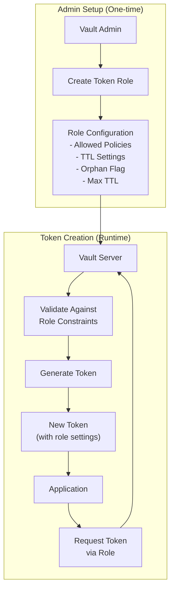
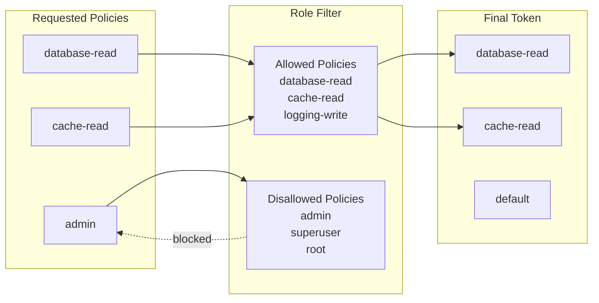
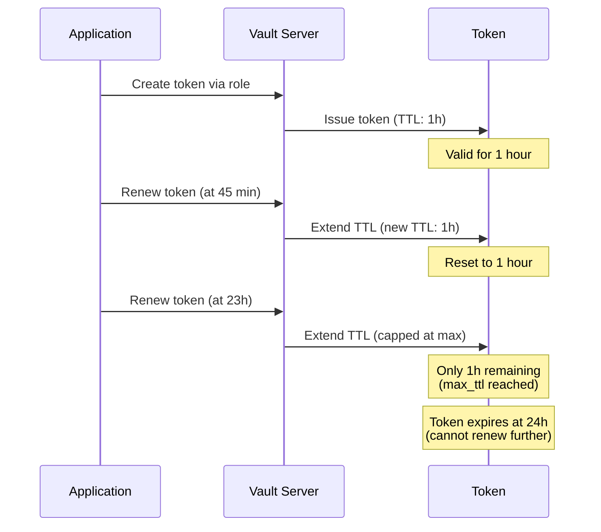
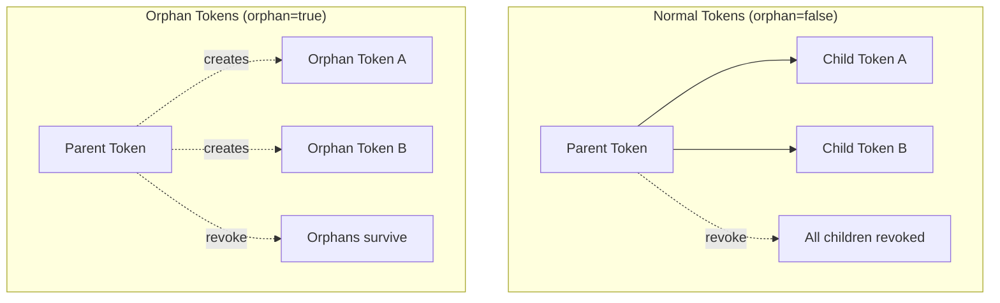

# How to Create Vault Token Roles

Author: [nawazdhandala](https://github.com/nawazdhandala)

Tags: Vault, Security, Tokens, Roles

Description: Learn how to create and configure Vault token roles as reusable templates for generating tokens with predefined policies, TTLs, and security constraints.

---

> Token roles in HashiCorp Vault act as templates for token creation. They define allowed policies, TTL settings, and other constraints. Instead of specifying parameters on every token creation request, you reference a role and Vault applies its configuration automatically.

Token roles provide consistency and security by centralizing token configuration. They prevent policy escalation and enforce organizational standards.

---

## Overview



---

## Basic Token Role Configuration

### Create a Simple Token Role

The following command creates a basic token role with default settings:

```bash
# Create a token role named "app-token-role"
# This role will be used to generate tokens for application services
vault write auth/token/roles/app-token-role \
    allowed_policies="app-read,app-write" \
    disallowed_policies="admin,root" \
    orphan=false \
    renewable=true
```

### View Role Configuration

Inspect an existing token role to verify its settings:

```bash
# Read the configuration of an existing token role
vault read auth/token/roles/app-token-role
```

Output:

```
Key                         Value
---                         -----
allowed_policies            [app-read app-write]
disallowed_policies         [admin root]
explicit_max_ttl            0s
orphan                      false
path_suffix                 n/a
period                      0s
renewable                   true
token_bound_cidrs           []
token_explicit_max_ttl      0s
token_no_default_policy     false
token_period                0s
token_type                  default-service
```

---

## Allowed Policies and Parameters

### Restricting Policy Assignment

Token roles control which policies can be assigned to generated tokens:

```bash
# Create a role that restricts tokens to specific policies
# allowed_policies: Only these policies can be assigned to tokens
# disallowed_policies: These policies can never be assigned, even if requested
vault write auth/token/roles/service-role \
    allowed_policies="database-read,cache-read,logging-write" \
    disallowed_policies="admin,superuser,root" \
    token_no_default_policy=false
```

### Policy Hierarchy Example



### Wildcard Policy Matching

Use glob patterns to allow policies matching a pattern:

```bash
# Allow any policy starting with "team-a-"
# The asterisk acts as a wildcard for flexible policy matching
vault write auth/token/roles/team-a-role \
    allowed_policies_glob="team-a-*" \
    disallowed_policies="*-admin"
```

---

## TTL and Renewal Settings

### Configure Token Lifetime

Control how long tokens remain valid and whether they can be renewed:

```bash
# Create a role with specific TTL settings
# token_ttl: Initial lifetime of the token (1 hour)
# token_max_ttl: Maximum lifetime including renewals (24 hours)
# renewable: Whether the token can be renewed before expiration
vault write auth/token/roles/short-lived-role \
    allowed_policies="app-read" \
    token_ttl="1h" \
    token_max_ttl="24h" \
    renewable=true
```

### TTL Behavior Diagram



### Periodic Tokens

Periodic tokens can be renewed indefinitely as long as they are renewed within the period:

```bash
# Create a role for long-running services
# token_period: The renewal period (service must renew within this window)
# Periodic tokens have no max_ttl and can run indefinitely
vault write auth/token/roles/daemon-role \
    allowed_policies="daemon-policy" \
    token_period="72h" \
    orphan=true
```

---

## Orphan and Explicit Max TTL

### Understanding Orphan Tokens

Orphan tokens are not children of the creating token. When the parent token is revoked, orphan tokens survive:

```bash
# Create a role that generates orphan tokens
# Orphan tokens are independent of their parent token lifecycle
# Use for tokens that should survive parent revocation
vault write auth/token/roles/independent-role \
    allowed_policies="app-policy" \
    orphan=true \
    token_ttl="8h" \
    token_max_ttl="168h"
```

### Token Hierarchy Comparison



### Explicit Max TTL

Set an absolute maximum lifetime that cannot be exceeded regardless of renewals:

```bash
# Create a role with explicit maximum TTL
# token_explicit_max_ttl: Hard limit on token lifetime
# Even with renewals, the token cannot live beyond this time
vault write auth/token/roles/contractor-role \
    allowed_policies="limited-access" \
    token_ttl="4h" \
    token_explicit_max_ttl="30d" \
    renewable=true
```

---

## Practical Code Examples

### Create Token Using a Role (CLI)

Generate a token using a predefined role:

```bash
# Create a token using the app-token-role
# The token inherits all settings from the role
vault token create -role=app-token-role

# Output:
# Key                  Value
# ---                  -----
# token                hvs.CAESIG...
# token_accessor       4Kz9Jx...
# token_duration       1h
# token_renewable      true
# token_policies       ["app-read" "app-write" "default"]
```

### Create Token Using a Role (API)

Use the HTTP API to create tokens programmatically:

```bash
# Create a token via the API using curl
# The role name is specified in the URL path
curl --request POST \
    --header "X-Vault-Token: $VAULT_TOKEN" \
    --data '{"policies": ["app-read"]}' \
    https://vault.example.com/v1/auth/token/create/app-token-role
```

### Python Example

Create and manage tokens using the hvac Python library:

```python
# token_manager.py
import hvac
import os
from datetime import datetime, timedelta

def create_vault_client():
    """Initialize Vault client with environment configuration"""
    client = hvac.Client(
        url=os.getenv('VAULT_ADDR', 'http://localhost:8200'),
        token=os.getenv('VAULT_TOKEN')
    )

    if not client.is_authenticated():
        raise Exception("Vault authentication failed")

    return client

def create_token_role(client, role_name, config):
    """
    Create a token role with the specified configuration

    Args:
        client: Authenticated hvac client
        role_name: Name for the token role
        config: Dictionary of role configuration options
    """
    # Write the role configuration to Vault
    client.write(
        f'auth/token/roles/{role_name}',
        **config
    )
    print(f"Created token role: {role_name}")

def create_token_from_role(client, role_name, policies=None, ttl=None):
    """
    Create a token using a predefined role

    Args:
        client: Authenticated hvac client
        role_name: Name of the token role to use
        policies: Optional list of policies (must be allowed by role)
        ttl: Optional TTL override (must be within role limits)

    Returns:
        dict: Token creation response containing token and metadata
    """
    # Build the request parameters
    params = {'role_name': role_name}

    if policies:
        params['policies'] = policies
    if ttl:
        params['ttl'] = ttl

    # Create the token using the role
    response = client.auth.token.create(**params)

    return response['auth']

def main():
    client = create_vault_client()

    # Define a role for microservices
    microservice_role_config = {
        'allowed_policies': ['database-read', 'cache-read', 'metrics-write'],
        'disallowed_policies': ['admin', 'root'],
        'token_ttl': '2h',
        'token_max_ttl': '24h',
        'renewable': True,
        'orphan': False
    }

    # Create the role
    create_token_role(client, 'microservice-role', microservice_role_config)

    # Create a token using the role
    token_info = create_token_from_role(
        client,
        'microservice-role',
        policies=['database-read', 'cache-read']
    )

    print(f"Token: {token_info['client_token']}")
    print(f"Accessor: {token_info['accessor']}")
    print(f"TTL: {token_info['lease_duration']} seconds")
    print(f"Renewable: {token_info['renewable']}")
    print(f"Policies: {token_info['policies']}")

if __name__ == '__main__':
    main()
```

### Go Example

Create and use token roles in Go applications:

```go
// token_role.go
package main

import (
    "context"
    "fmt"
    "log"
    "os"
    "time"

    vault "github.com/hashicorp/vault/api"
)

// TokenRoleConfig defines the configuration for a token role
type TokenRoleConfig struct {
    AllowedPolicies    []string
    DisallowedPolicies []string
    TokenTTL           time.Duration
    TokenMaxTTL        time.Duration
    Renewable          bool
    Orphan             bool
}

// CreateTokenRole creates a new token role with the given configuration
func CreateTokenRole(client *vault.Client, roleName string, config TokenRoleConfig) error {
    // Prepare the role data
    data := map[string]interface{}{
        "allowed_policies":    config.AllowedPolicies,
        "disallowed_policies": config.DisallowedPolicies,
        "token_ttl":           config.TokenTTL.String(),
        "token_max_ttl":       config.TokenMaxTTL.String(),
        "renewable":           config.Renewable,
        "orphan":              config.Orphan,
    }

    // Write the role to Vault
    _, err := client.Logical().Write(
        fmt.Sprintf("auth/token/roles/%s", roleName),
        data,
    )
    if err != nil {
        return fmt.Errorf("failed to create token role: %w", err)
    }

    log.Printf("Created token role: %s", roleName)
    return nil
}

// CreateTokenFromRole creates a new token using a predefined role
func CreateTokenFromRole(client *vault.Client, roleName string, policies []string) (*vault.Secret, error) {
    // Prepare the token creation request
    tokenRequest := &vault.TokenCreateRequest{
        Policies: policies,
    }

    // Create token using the role
    secret, err := client.Auth().Token().CreateWithRole(tokenRequest, roleName)
    if err != nil {
        return nil, fmt.Errorf("failed to create token from role: %w", err)
    }

    return secret, nil
}

func main() {
    // Initialize Vault client
    config := vault.DefaultConfig()
    config.Address = os.Getenv("VAULT_ADDR")

    client, err := vault.NewClient(config)
    if err != nil {
        log.Fatalf("Failed to create Vault client: %v", err)
    }

    // Set the token for authentication
    client.SetToken(os.Getenv("VAULT_TOKEN"))

    // Define the role configuration
    roleConfig := TokenRoleConfig{
        AllowedPolicies:    []string{"app-read", "app-write", "metrics"},
        DisallowedPolicies: []string{"admin", "root"},
        TokenTTL:           1 * time.Hour,
        TokenMaxTTL:        24 * time.Hour,
        Renewable:          true,
        Orphan:             false,
    }

    // Create the token role
    err = CreateTokenRole(client, "go-app-role", roleConfig)
    if err != nil {
        log.Fatalf("Failed to create role: %v", err)
    }

    // Create a token using the role
    secret, err := CreateTokenFromRole(client, "go-app-role", []string{"app-read"})
    if err != nil {
        log.Fatalf("Failed to create token: %v", err)
    }

    // Print token information
    fmt.Printf("Token: %s\n", secret.Auth.ClientToken)
    fmt.Printf("Accessor: %s\n", secret.Auth.Accessor)
    fmt.Printf("TTL: %d seconds\n", secret.Auth.LeaseDuration)
    fmt.Printf("Renewable: %t\n", secret.Auth.Renewable)
    fmt.Printf("Policies: %v\n", secret.Auth.Policies)
}
```

---

## Role Configuration Reference

### Complete Role Options

Create a fully configured token role with all available options:

```bash
# Comprehensive token role configuration
vault write auth/token/roles/comprehensive-role \
    allowed_policies="app-read,app-write,metrics" \
    allowed_policies_glob="team-*-read" \
    disallowed_policies="admin,root,superuser" \
    disallowed_policies_glob="*-admin" \
    orphan=true \
    renewable=true \
    token_ttl="2h" \
    token_max_ttl="48h" \
    token_explicit_max_ttl="720h" \
    token_period="0" \
    token_type="service" \
    token_no_default_policy=false \
    token_num_uses=0 \
    token_bound_cidrs="10.0.0.0/8,192.168.1.0/24"
```

### Configuration Parameters Table

| Parameter | Description | Default |
|-----------|-------------|---------|
| allowed_policies | List of policies that can be assigned | [] |
| allowed_policies_glob | Glob patterns for allowed policies | [] |
| disallowed_policies | Policies that cannot be assigned | [] |
| disallowed_policies_glob | Glob patterns for disallowed policies | [] |
| orphan | Create tokens without parent | false |
| renewable | Allow token renewal | true |
| token_ttl | Initial token TTL | System default |
| token_max_ttl | Maximum TTL with renewals | System default |
| token_explicit_max_ttl | Absolute maximum lifetime | 0 (no limit) |
| token_period | Renewal period for periodic tokens | 0 |
| token_type | Token type (service, batch, default) | default |
| token_no_default_policy | Exclude default policy | false |
| token_num_uses | Maximum uses (0 = unlimited) | 0 |
| token_bound_cidrs | IP ranges that can use token | [] |

---

## Best Practices

1. **Use specific allowed policies** instead of wildcards when possible
2. **Always set disallowed_policies** to prevent privilege escalation
3. **Configure appropriate TTLs** based on use case
4. **Use orphan tokens sparingly** as they bypass automatic revocation
5. **Set token_bound_cidrs** for network-restricted environments
6. **Document role purposes** in a central location
7. **Audit role usage** regularly using Vault audit logs

---

## Conclusion

Vault token roles provide a powerful mechanism for standardizing token creation across your organization. By defining roles with specific policies, TTLs, and constraints, you can:

- Enforce security policies consistently
- Prevent accidental privilege escalation
- Simplify token management for applications
- Audit and control token creation patterns

Token roles are essential for any production Vault deployment. Start with restrictive settings and adjust based on your application requirements.

---

*Need to manage secrets securely? HashiCorp Vault provides enterprise-grade secrets management with token roles for fine-grained access control.*
