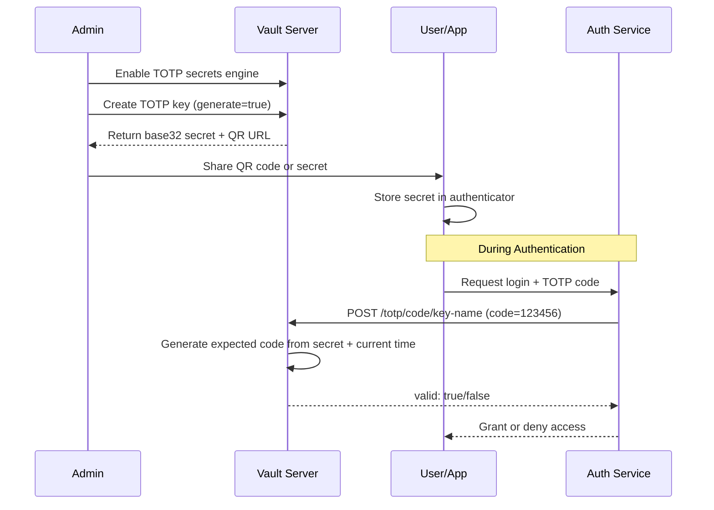

# How to Implement Vault TOTP Secrets

Author: [nawazdhandala](https://github.com/nawazdhandala)

Tags: Vault, Security, TOTP, MFA

Description: Use HashiCorp Vault's TOTP secrets engine to generate and validate time-based one-time passwords for multi-factor authentication.

---

HashiCorp Vault's TOTP (Time-based One-Time Password) secrets engine generates and validates OTPs following the RFC 6238 standard. This makes Vault a centralized authenticator for MFA workflows, eliminating the need for external authenticator apps in server-to-server scenarios.

## TOTP Verification Flow

Before diving into configuration, here is how TOTP verification works with Vault:



## 1. Enable the TOTP Secrets Engine

The TOTP secrets engine is not enabled by default. Mount it at a path of your choosing. Using a descriptive path like `totp` keeps your Vault namespace organized.

```bash
# Enable the TOTP secrets engine at the default path
vault secrets enable totp

# Or mount at a custom path for organizational clarity
vault secrets enable -path=mfa/totp totp
```

Verify the engine is mounted:

```bash
# List all enabled secrets engines
vault secrets list
```

You should see `totp/` in the output with type `totp`.

## 2. Create a TOTP Key with Automatic Generation

When Vault generates the key, it creates a cryptographically secure base32-encoded secret. This is the recommended approach for new keys.

```bash
# Create a new TOTP key with automatic secret generation
# The issuer and account_name appear in authenticator apps
vault write totp/keys/my-app-admin \
    generate=true \
    issuer="MyApp" \
    account_name="admin@myapp.com"
```

Vault returns:

```json
{
  "request_id": "abc123",
  "data": {
    "barcode": "iVBORw0KGgoAAAANSUhEUgAA...",
    "url": "otpauth://totp/MyApp:admin@myapp.com?algorithm=SHA1&digits=6&issuer=MyApp&period=30&secret=JBSWY3DPEHPK3PXP"
  }
}
```

The `barcode` field contains a base64-encoded PNG image of the QR code. The `url` field is the otpauth URI that authenticator apps use.

## 3. Configure Algorithm and Period

TOTP supports different hash algorithms and time periods. The defaults (SHA1, 30 seconds, 6 digits) work with most authenticator apps, but you can customize these for stricter security requirements.

```bash
# Create a key with SHA256 algorithm and 8-digit codes
vault write totp/keys/high-security-service \
    generate=true \
    issuer="SecureApp" \
    account_name="service@secureapp.com" \
    algorithm=SHA256 \
    digits=8 \
    period=30
```

Available options:

| Parameter | Default | Options | Description |
|-----------|---------|---------|-------------|
| algorithm | SHA1 | SHA1, SHA256, SHA512 | Hash algorithm for code generation |
| digits | 6 | 6, 8 | Number of digits in the OTP |
| period | 30 | Any positive integer | Seconds before code rotates |
| skew | 1 | 0, 1 | Number of periods to allow for clock drift |

Note: Many authenticator apps only support SHA1 with 6 digits. Test compatibility before deploying SHA256/SHA512 or 8-digit codes.

## 4. Import an Existing TOTP Secret

If you already have a TOTP secret from another system, import it into Vault:

```bash
# Import an existing base32-encoded secret
vault write totp/keys/imported-service \
    generate=false \
    issuer="ExternalApp" \
    account_name="user@external.com" \
    key="JBSWY3DPEHPK3PXP"
```

The `key` parameter accepts base32-encoded secrets (the standard format used by authenticator apps).

## 5. Generate a TOTP Code

Vault can act as an authenticator, generating codes for stored keys. This is useful for automated systems that need to authenticate against TOTP-protected services.

```bash
# Generate the current valid code for a key
vault read totp/code/my-app-admin
```

Response:

```json
{
  "data": {
    "code": "123456"
  }
}
```

This code is valid for the current time period (typically 30 seconds).

## 6. Validate a TOTP Code

Validation checks whether a user-provided code matches the expected value. Vault handles clock drift automatically based on the `skew` parameter.

```bash
# Validate a code submitted by a user
vault write totp/code/my-app-admin \
    code="123456"
```

Response when valid:

```json
{
  "data": {
    "valid": true
  }
}
```

Response when invalid:

```json
{
  "data": {
    "valid": false
  }
}
```

## 7. Handle Clock Drift

Clock drift occurs when the server and client clocks are not perfectly synchronized. The `skew` parameter allows codes from adjacent time periods to be accepted.

```mermaid
flowchart LR
    subgraph Time Windows with skew=1
        P1[Previous Period<br/>T-30s to T]
        P2[Current Period<br/>T to T+30s]
        P3[Next Period<br/>T+30s to T+60s]
    end

    P1 -->|Valid| V[Code Accepted]
    P2 -->|Valid| V
    P3 -->|Invalid| X[Code Rejected]

    style P1 fill:#90EE90
    style P2 fill:#90EE90
    style P3 fill:#FFB6C1
```

With `skew=1` (default), Vault accepts:
- The current period's code
- The previous period's code (to handle slight clock delays)

Set `skew=0` for stricter validation that only accepts the current period's code.

```bash
# Create a key with no drift tolerance
vault write totp/keys/strict-service \
    generate=true \
    issuer="StrictApp" \
    account_name="secure@strictapp.com" \
    skew=0
```

## 8. Practical Code Examples

### Python: Validate TOTP in an Authentication Flow

```python
import hvac
import os

# Initialize the Vault client
# VAULT_ADDR and VAULT_TOKEN should be set in your environment
client = hvac.Client(
    url=os.environ.get('VAULT_ADDR', 'http://127.0.0.1:8200'),
    token=os.environ.get('VAULT_TOKEN')
)

def validate_totp(key_name: str, code: str) -> bool:
    """
    Validate a TOTP code against Vault.

    Args:
        key_name: The name of the TOTP key in Vault
        code: The 6-digit code from the user's authenticator

    Returns:
        True if the code is valid, False otherwise
    """
    try:
        # Call Vault's TOTP validation endpoint
        response = client.secrets.totp.validate_code(
            name=key_name,
            code=code,
            mount_point='totp'
        )
        return response['data']['valid']
    except hvac.exceptions.InvalidPath:
        # Key does not exist
        return False
    except hvac.exceptions.VaultError as e:
        # Log the error and fail securely
        print(f"Vault error during TOTP validation: {e}")
        return False


def create_totp_key(key_name: str, issuer: str, account: str) -> dict:
    """
    Create a new TOTP key and return the provisioning URL.

    Args:
        key_name: Unique identifier for this key in Vault
        issuer: Organization name shown in authenticator apps
        account: User identifier shown in authenticator apps

    Returns:
        Dictionary with 'url' for QR code generation and 'barcode' as base64 PNG
    """
    response = client.secrets.totp.create_key(
        name=key_name,
        generate=True,
        issuer=issuer,
        account_name=account,
        algorithm='SHA1',
        digits=6,
        period=30,
        mount_point='totp'
    )
    return {
        'url': response['data']['url'],
        'barcode': response['data']['barcode']
    }


# Example usage in a login flow
def authenticate_user(username: str, password: str, totp_code: str) -> bool:
    """
    Two-factor authentication: verify password then TOTP.
    """
    # Step 1: Verify password (placeholder for your auth logic)
    if not verify_password(username, password):
        return False

    # Step 2: Validate TOTP code
    # Key naming convention: totp-{username}
    key_name = f"totp-{username}"
    if not validate_totp(key_name, totp_code):
        return False

    return True
```

### Go: TOTP Validation Middleware

```go
package auth

import (
    "context"
    "fmt"
    "net/http"

    vault "github.com/hashicorp/vault/api"
)

// TOTPValidator handles TOTP validation against Vault
type TOTPValidator struct {
    client    *vault.Client
    mountPath string
}

// NewTOTPValidator creates a validator with the given Vault client
func NewTOTPValidator(client *vault.Client, mountPath string) *TOTPValidator {
    return &TOTPValidator{
        client:    client,
        mountPath: mountPath,
    }
}

// ValidateCode checks if the provided TOTP code is valid
func (v *TOTPValidator) ValidateCode(ctx context.Context, keyName, code string) (bool, error) {
    // Build the path for TOTP code validation
    path := fmt.Sprintf("%s/code/%s", v.mountPath, keyName)

    // Write the code to Vault for validation
    secret, err := v.client.Logical().WriteWithContext(ctx, path, map[string]interface{}{
        "code": code,
    })
    if err != nil {
        return false, fmt.Errorf("vault TOTP validation failed: %w", err)
    }

    // Extract the validation result
    valid, ok := secret.Data["valid"].(bool)
    if !ok {
        return false, fmt.Errorf("unexpected response format from Vault")
    }

    return valid, nil
}

// GenerateCode returns the current valid TOTP code for a key
// Useful when your service needs to authenticate against external TOTP-protected APIs
func (v *TOTPValidator) GenerateCode(ctx context.Context, keyName string) (string, error) {
    path := fmt.Sprintf("%s/code/%s", v.mountPath, keyName)

    secret, err := v.client.Logical().ReadWithContext(ctx, path)
    if err != nil {
        return "", fmt.Errorf("vault TOTP generation failed: %w", err)
    }

    code, ok := secret.Data["code"].(string)
    if !ok {
        return "", fmt.Errorf("unexpected response format from Vault")
    }

    return code, nil
}

// Middleware wraps an HTTP handler with TOTP validation
func (v *TOTPValidator) Middleware(next http.Handler) http.Handler {
    return http.HandlerFunc(func(w http.ResponseWriter, r *http.Request) {
        // Extract TOTP code from header
        code := r.Header.Get("X-TOTP-Code")
        if code == "" {
            http.Error(w, "Missing TOTP code", http.StatusUnauthorized)
            return
        }

        // Extract user identifier (from JWT, session, etc.)
        userID := r.Context().Value("user_id").(string)
        keyName := fmt.Sprintf("totp-%s", userID)

        // Validate the code
        valid, err := v.ValidateCode(r.Context(), keyName, code)
        if err != nil {
            http.Error(w, "TOTP validation error", http.StatusInternalServerError)
            return
        }

        if !valid {
            http.Error(w, "Invalid TOTP code", http.StatusUnauthorized)
            return
        }

        // Code is valid, proceed to the next handler
        next.ServeHTTP(w, r)
    })
}
```

### Bash: QR Code Generation for User Onboarding

```bash
#!/bin/bash

# Script to create a TOTP key and display QR code for user enrollment

set -euo pipefail

USERNAME="${1:?Usage: $0 <username>}"
ISSUER="MyCompany"
KEY_NAME="totp-${USERNAME}"

# Create the TOTP key in Vault and capture the URL
RESPONSE=$(vault write -format=json totp/keys/${KEY_NAME} \
    generate=true \
    issuer="${ISSUER}" \
    account_name="${USERNAME}@mycompany.com")

# Extract the otpauth URL
URL=$(echo "${RESPONSE}" | jq -r '.data.url')

# Generate QR code in terminal using qrencode (install with: brew install qrencode)
echo "Scan this QR code with your authenticator app:"
echo ""
echo "${URL}" | qrencode -t ANSIUTF8

# Also save the URL for backup purposes (store securely)
echo ""
echo "Backup URL (keep secure): ${URL}"
```

## 9. Access Control with Vault Policies

Restrict who can create, read, and validate TOTP keys:

```hcl
# totp-admin.hcl - Full access for administrators
path "totp/keys/*" {
  capabilities = ["create", "read", "update", "delete", "list"]
}

path "totp/code/*" {
  capabilities = ["create", "read"]
}

# totp-validator.hcl - Only validate codes (for auth services)
path "totp/code/*" {
  capabilities = ["create"]  # create = write for validation
}

# Deny reading keys (prevents secret exfiltration)
path "totp/keys/*" {
  capabilities = ["deny"]
}
```

Apply the policies:

```bash
# Create the policies
vault policy write totp-admin totp-admin.hcl
vault policy write totp-validator totp-validator.hcl

# Assign to auth methods or tokens
vault token create -policy=totp-validator -ttl=24h
```

## 10. List and Delete Keys

Manage existing TOTP keys:

```bash
# List all TOTP keys
vault list totp/keys

# Read key metadata (does not expose the secret)
vault read totp/keys/my-app-admin

# Delete a key when a user is offboarded
vault delete totp/keys/totp-former-employee
```

---

Vault's TOTP secrets engine centralizes one-time password management, making it ideal for service-to-service authentication and automated MFA validation. By storing TOTP secrets in Vault rather than application databases, you gain audit logging, access control, and secret rotation capabilities out of the box.
