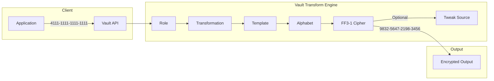
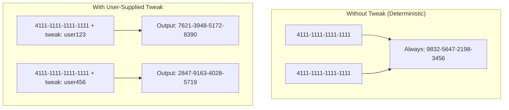
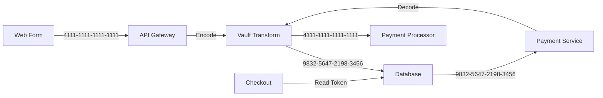

# How to Build Vault Transform FPE

Author: [nawazdhandala](https://github.com/nawazdhandala)

Tags: Vault, Security, FPE, Encryption

Description: A practical guide to implementing format-preserving encryption with HashiCorp Vault Transform secrets engine for protecting sensitive data like credit cards and SSNs.

---

Format-Preserving Encryption (FPE) encrypts data while maintaining its original format. A 16-digit credit card number stays 16 digits. A 9-digit SSN stays 9 digits. This is invaluable when you need encryption but cannot change database schemas, validation logic, or downstream systems.

HashiCorp Vault's Transform secrets engine provides FPE through the FF3-1 algorithm. This guide walks through configuring alphabets, templates, roles, and transformations for real-world use cases.

---

## Why Format-Preserving Encryption?

Traditional encryption produces ciphertext that looks nothing like the original:

```
Input:  4111-1111-1111-1111
AES:    7f3d8a2b1e9c4f6a8b2d1e3f5a7c9b0d...
FPE:    9832-5647-2198-3456
```

FPE preserves:

- **Length**: Same number of characters
- **Character set**: Same alphabet (digits, letters, etc.)
- **Structure**: Dashes, spaces, and formatting intact

This matters because:

- **Legacy systems**: Old databases with fixed column widths
- **Validation**: Credit card checksums, SSN formats
- **Analytics**: Masked data still useful for pattern analysis
- **Compliance**: PCI-DSS, HIPAA require encryption but data must remain usable

---

## How Vault Transform FPE Works



The components work together:

1. **Alphabet**: Defines valid characters (digits, letters, symbols)
2. **Template**: Defines data structure with regex patterns
3. **Transformation**: Combines alphabet and template with encryption settings
4. **Role**: Groups transformations and controls access
5. **Tweak**: Optional value that changes encryption output for same input

---

## Setting Up the Transform Engine

### Enable the Transform Secrets Engine

```bash
# Enable transform engine at default path
vault secrets enable transform

# Or at a custom path
vault secrets enable -path=tokenization transform
```

### Create a Custom Alphabet

Alphabets define which characters can be encrypted. Vault includes built-in alphabets, but custom ones give you control.

```bash
# Numeric only (for credit cards, SSNs)
vault write transform/alphabet/numeric \
    alphabet="0123456789"

# Alphanumeric lowercase
vault write transform/alphabet/alphanumeric-lower \
    alphabet="0123456789abcdefghijklmnopqrstuvwxyz"

# Full alphanumeric with symbols
vault write transform/alphabet/alphanumeric-full \
    alphabet="0123456789ABCDEFGHIJKLMNOPQRSTUVWXYZabcdefghijklmnopqrstuvwxyz"
```

Built-in alphabets you can use directly:

- `builtin/numeric`: 0-9
- `builtin/alphalower`: a-z
- `builtin/alphaupper`: A-Z
- `builtin/alphanumericlower`: a-z, 0-9
- `builtin/alphanumericupper`: A-Z, 0-9

### Define Templates

Templates use regex to specify which parts of the data to encrypt. Characters outside the pattern remain unchanged.

```bash
# Credit card: encrypt all 16 digits, preserve dashes
vault write transform/template/credit-card \
    type=regex \
    pattern='(\d{4})-(\d{4})-(\d{4})-(\d{4})' \
    alphabet=numeric

# SSN: encrypt all 9 digits, preserve dashes
vault write transform/template/ssn \
    type=regex \
    pattern='(\d{3})-(\d{2})-(\d{4})' \
    alphabet=numeric

# Phone number: encrypt only the last 7 digits
vault write transform/template/phone-partial \
    type=regex \
    pattern='\d{3}-(\d{3})-(\d{4})' \
    alphabet=numeric
```

Template patterns use capture groups `()` to mark what gets encrypted. Everything outside capture groups passes through unchanged.

---

## Creating Transformations

Transformations combine templates with encryption behavior.

### Basic FPE Transformation

```bash
# Credit card transformation
vault write transform/transformation/credit-card-fpe \
    type=fpe \
    template=credit-card \
    tweak_source=internal \
    allowed_roles=payments

# SSN transformation
vault write transform/transformation/ssn-fpe \
    type=fpe \
    template=ssn \
    tweak_source=internal \
    allowed_roles=hr-systems
```

### Create Roles

Roles group transformations and control which applications can use them.

```bash
# Role for payment processing
vault write transform/role/payments \
    transformations=credit-card-fpe

# Role with multiple transformations
vault write transform/role/hr-systems \
    transformations=ssn-fpe,phone-fpe

# Role for analytics (might have different transformations)
vault write transform/role/analytics \
    transformations=credit-card-fpe,ssn-fpe
```

---

## Encrypting and Decrypting Data

### Encode (Encrypt)

```bash
# Encrypt a credit card number
vault write transform/encode/payments \
    value="4111-1111-1111-1111" \
    transformation=credit-card-fpe

# Response:
# Key              Value
# ---              -----
# encoded_value    9832-5647-2198-3456
```

### Decode (Decrypt)

```bash
# Decrypt the credit card number
vault write transform/decode/payments \
    value="9832-5647-2198-3456" \
    transformation=credit-card-fpe

# Response:
# Key              Value
# ---              -----
# decoded_value    4111-1111-1111-1111
```

### Batch Operations

```bash
# Encode multiple values at once
vault write transform/encode/payments \
    transformation=credit-card-fpe \
    batch_input='[
        {"value": "4111-1111-1111-1111"},
        {"value": "5500-0000-0000-0004"},
        {"value": "3400-000000-00009"}
    ]'
```

---

## Understanding Tweak Sources

Tweaks add variability to FPE. The same plaintext with different tweaks produces different ciphertext. This prevents frequency analysis attacks.



### Tweak Source Options

```bash
# Internal: Vault manages tweaks automatically (stored with ciphertext)
vault write transform/transformation/cc-internal \
    type=fpe \
    template=credit-card \
    tweak_source=internal \
    allowed_roles=payments

# Supplied: Application provides tweak (must store it yourself)
vault write transform/transformation/cc-supplied \
    type=fpe \
    template=credit-card \
    tweak_source=supplied \
    allowed_roles=payments

# Generated: Vault generates tweak, returns it to you
vault write transform/transformation/cc-generated \
    type=fpe \
    template=credit-card \
    tweak_source=generated \
    allowed_roles=payments
```

### Using Supplied Tweaks

```bash
# Encode with a user-specific tweak
vault write transform/encode/payments \
    value="4111-1111-1111-1111" \
    transformation=cc-supplied \
    tweak="dXNlcjEyMw=="  # base64 encoded

# Must use same tweak to decode
vault write transform/decode/payments \
    value="7621-3948-5172-8390" \
    transformation=cc-supplied \
    tweak="dXNlcjEyMw=="
```

---

## Convergent Encryption

Convergent encryption ensures the same plaintext always produces the same ciphertext. This is useful for:

- Searching encrypted fields
- Deduplication
- Indexing

```bash
# Create convergent transformation
vault write transform/transformation/cc-convergent \
    type=fpe \
    template=credit-card \
    tweak_source=internal \
    allowed_roles=payments

# With convergent encryption:
# Same input always produces same output
# "4111-1111-1111-1111" -> "9832-5647-2198-3456" (every time)
```

Convergent encryption trades some security for usability. An attacker who knows a plaintext/ciphertext pair can identify other occurrences of that plaintext.

---

## Real-World Use Cases

### Use Case 1: Credit Card Tokenization



Setup:

```bash
# Create the transformation
vault write transform/alphabet/numeric alphabet="0123456789"

vault write transform/template/credit-card \
    type=regex \
    pattern='(\d{4})-(\d{4})-(\d{4})-(\d{4})' \
    alphabet=numeric

vault write transform/transformation/credit-card-fpe \
    type=fpe \
    template=credit-card \
    tweak_source=internal \
    allowed_roles=payments

vault write transform/role/payments \
    transformations=credit-card-fpe
```

Application code (Python):

```python
import hvac

# Initialize Vault client
client = hvac.Client(url='https://vault.example.com:8200')
client.token = 'your-token'

def encrypt_credit_card(card_number):
    """
    Encrypt a credit card number using Vault Transform FPE.
    Input format: 1234-5678-9012-3456
    Output format: same structure, different digits
    """
    response = client.secrets.transform.encode(
        role_name='payments',
        value=card_number,
        transformation='credit-card-fpe',
        mount_point='transform'
    )
    return response['data']['encoded_value']

def decrypt_credit_card(encrypted_card):
    """
    Decrypt a credit card number back to plaintext.
    Must have decode permissions on the payments role.
    """
    response = client.secrets.transform.decode(
        role_name='payments',
        value=encrypted_card,
        transformation='credit-card-fpe',
        mount_point='transform'
    )
    return response['data']['decoded_value']

# Usage
original = "4111-1111-1111-1111"
encrypted = encrypt_credit_card(original)
print(f"Encrypted: {encrypted}")  # 9832-5647-2198-3456

decrypted = decrypt_credit_card(encrypted)
print(f"Decrypted: {decrypted}")  # 4111-1111-1111-1111
```

### Use Case 2: SSN Protection for HR Systems

```bash
# SSN transformation setup
vault write transform/template/ssn \
    type=regex \
    pattern='(\d{3})-(\d{2})-(\d{4})' \
    alphabet=numeric

vault write transform/transformation/ssn-fpe \
    type=fpe \
    template=ssn \
    tweak_source=internal \
    allowed_roles=hr-systems

vault write transform/role/hr-systems \
    transformations=ssn-fpe
```

Application code (Node.js):

```javascript
const vault = require('node-vault')({
  apiVersion: 'v1',
  endpoint: 'https://vault.example.com:8200',
  token: process.env.VAULT_TOKEN
});

async function encryptSSN(ssn) {
  // Encrypt SSN while preserving XXX-XX-XXXX format
  // Input: 123-45-6789, Output: 987-65-4321 (example)
  const result = await vault.write('transform/encode/hr-systems', {
    value: ssn,
    transformation: 'ssn-fpe'
  });
  return result.data.encoded_value;
}

async function decryptSSN(encryptedSSN) {
  // Decrypt SSN back to original value
  // Requires decode permission on hr-systems role
  const result = await vault.write('transform/decode/hr-systems', {
    value: encryptedSSN,
    transformation: 'ssn-fpe'
  });
  return result.data.decoded_value;
}

// Batch encrypt multiple SSNs for efficiency
async function encryptSSNBatch(ssnList) {
  const batchInput = ssnList.map(ssn => ({ value: ssn }));
  const result = await vault.write('transform/encode/hr-systems', {
    transformation: 'ssn-fpe',
    batch_input: batchInput
  });
  return result.data.batch_results.map(r => r.encoded_value);
}
```

### Use Case 3: Partial Data Masking

Encrypt only part of the data, leaving some visible for verification:

```bash
# Template that only encrypts middle digits of credit card
# First 4 and last 4 remain visible
vault write transform/template/cc-partial \
    type=regex \
    pattern='\d{4}-(\d{4})-(\d{4})-\d{4}' \
    alphabet=numeric

vault write transform/transformation/cc-partial-fpe \
    type=fpe \
    template=cc-partial \
    tweak_source=internal \
    allowed_roles=customer-service

vault write transform/role/customer-service \
    transformations=cc-partial-fpe

# Result:
# Input:  4111-1111-1111-1111
# Output: 4111-5832-7294-1111 (first and last 4 unchanged)
```

---

## Access Control with Vault Policies

Create granular policies for different teams:

```hcl
# Policy: payments-encode-only
# Can only encrypt, cannot decrypt
path "transform/encode/payments" {
  capabilities = ["update"]
}

# Policy: payments-full
# Can encrypt and decrypt
path "transform/encode/payments" {
  capabilities = ["update"]
}
path "transform/decode/payments" {
  capabilities = ["update"]
}

# Policy: transform-admin
# Full administrative access
path "transform/*" {
  capabilities = ["create", "read", "update", "delete", "list"]
}
```

Apply policies:

```bash
# Create policies
vault policy write payments-encode-only payments-encode-only.hcl
vault policy write payments-full payments-full.hcl

# Assign to authentication methods
vault write auth/approle/role/web-app \
    policies=payments-encode-only

vault write auth/approle/role/payment-processor \
    policies=payments-full
```

---

## Performance Considerations

FPE operations are CPU-intensive. Consider these optimizations:

### Batch Operations

```bash
# Single call for multiple values (much faster)
vault write transform/encode/payments \
    transformation=credit-card-fpe \
    batch_input='[
        {"value": "4111-1111-1111-1111"},
        {"value": "5500-0000-0000-0004"}
    ]'
```

### Caching

For convergent encryption, cache results at the application layer:

```python
from functools import lru_cache

@lru_cache(maxsize=10000)
def encrypt_credit_card_cached(card_number):
    """
    Cache encrypted values for convergent encryption.
    Same plaintext always produces same ciphertext,
    so caching is safe and reduces Vault calls.
    """
    return encrypt_credit_card(card_number)
```

### Connection Pooling

```python
import hvac
from urllib3.util.retry import Retry
from requests.adapters import HTTPAdapter

# Configure connection pooling for high-throughput scenarios
session = requests.Session()
retries = Retry(total=3, backoff_factor=0.1)
adapter = HTTPAdapter(pool_connections=100, pool_maxsize=100, max_retries=retries)
session.mount('https://', adapter)

client = hvac.Client(url='https://vault.example.com:8200', session=session)
```

---

## Monitoring and Auditing

Enable audit logging to track all transform operations:

```bash
# Enable file audit device
vault audit enable file file_path=/var/log/vault/audit.log

# Enable syslog audit device
vault audit enable syslog tag="vault" facility="LOCAL0"
```

Audit logs capture:

- Who performed the operation (token/identity)
- What transformation was used
- When the operation occurred
- Success or failure status

**Note**: Audit logs never contain plaintext values or encrypted outputs by default, maintaining security.

---

## Troubleshooting Common Issues

### Issue: Template Pattern Does Not Match

```
Error: unable to find match for input value
```

Fix: Verify your input matches the template regex exactly:

```bash
# Test your regex pattern
echo "4111-1111-1111-1111" | grep -E '(\d{4})-(\d{4})-(\d{4})-(\d{4})'
```

### Issue: Alphabet Mismatch

```
Error: character not in alphabet
```

Fix: Ensure all characters in the captured groups exist in the alphabet:

```bash
# Check alphabet includes all needed characters
vault read transform/alphabet/numeric
```

### Issue: Tweak Decode Failure

```
Error: invalid tweak for decode operation
```

Fix: For `tweak_source=supplied`, you must provide the same tweak for decode:

```bash
# Store the tweak with the encrypted value
# Decode must use identical tweak
```

---

## Security Best Practices

1. **Use unique roles per application**: Limit blast radius if credentials leak
2. **Separate encode and decode permissions**: Most apps only need encode
3. **Enable audit logging**: Track all transform operations
4. **Rotate keys periodically**: Use Vault's key rotation features
5. **Use supplied tweaks for high-security data**: Prevents deterministic attacks
6. **Never log plaintext or ciphertext**: Keep sensitive data out of application logs
7. **Test templates thoroughly**: Ensure patterns match all expected input formats

---

## Complete Setup Script

Here is a full setup script for a production-ready FPE configuration:

```bash
#!/bin/bash
# setup-transform-fpe.sh
# Complete Vault Transform FPE setup for credit cards and SSNs

set -e

# Enable transform engine
vault secrets enable transform || true

# Create numeric alphabet
vault write transform/alphabet/numeric \
    alphabet="0123456789"

# Credit card template (preserves dashes)
vault write transform/template/credit-card \
    type=regex \
    pattern='(\d{4})-(\d{4})-(\d{4})-(\d{4})' \
    alphabet=numeric

# SSN template (preserves dashes)
vault write transform/template/ssn \
    type=regex \
    pattern='(\d{3})-(\d{2})-(\d{4})' \
    alphabet=numeric

# Credit card transformation with internal tweak
vault write transform/transformation/credit-card-fpe \
    type=fpe \
    template=credit-card \
    tweak_source=internal \
    allowed_roles=payments,analytics

# SSN transformation with internal tweak
vault write transform/transformation/ssn-fpe \
    type=fpe \
    template=ssn \
    tweak_source=internal \
    allowed_roles=hr-systems

# Create roles
vault write transform/role/payments \
    transformations=credit-card-fpe

vault write transform/role/hr-systems \
    transformations=ssn-fpe

vault write transform/role/analytics \
    transformations=credit-card-fpe,ssn-fpe

echo "Transform FPE setup complete!"
echo "Test with: vault write transform/encode/payments value='4111-1111-1111-1111' transformation=credit-card-fpe"
```

---

Vault Transform FPE provides a powerful way to protect sensitive data while maintaining compatibility with existing systems. By preserving format, length, and structure, FPE allows encryption without the massive refactoring that traditional encryption requires. Start with the basics, understand tweaks and convergent encryption tradeoffs, and build from there.
