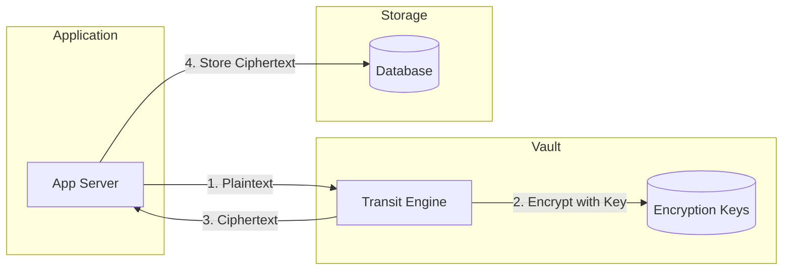
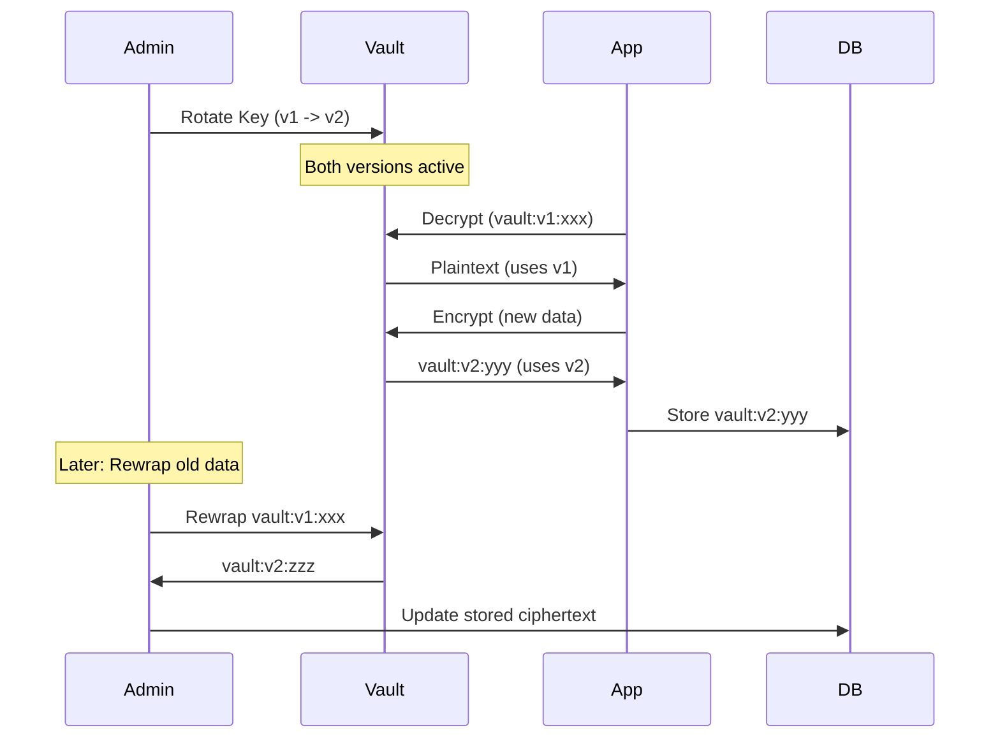
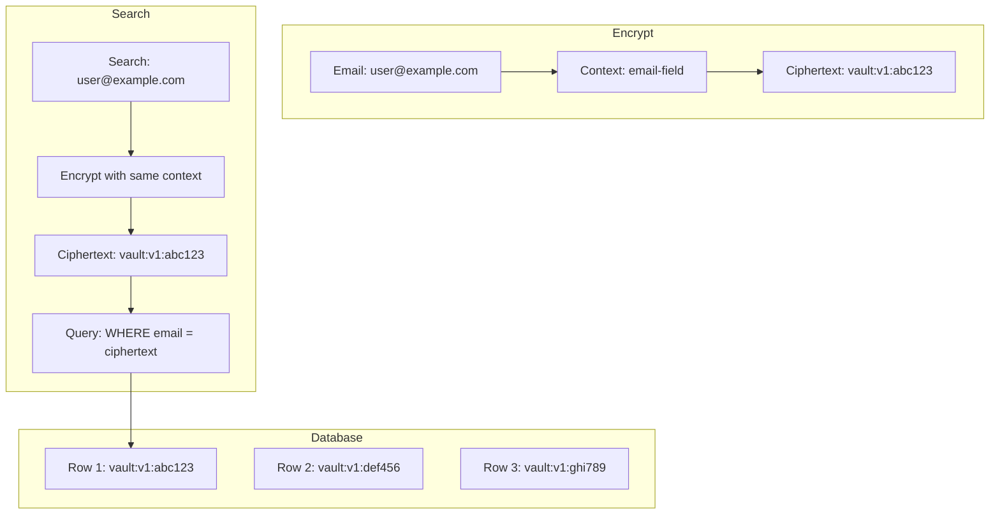
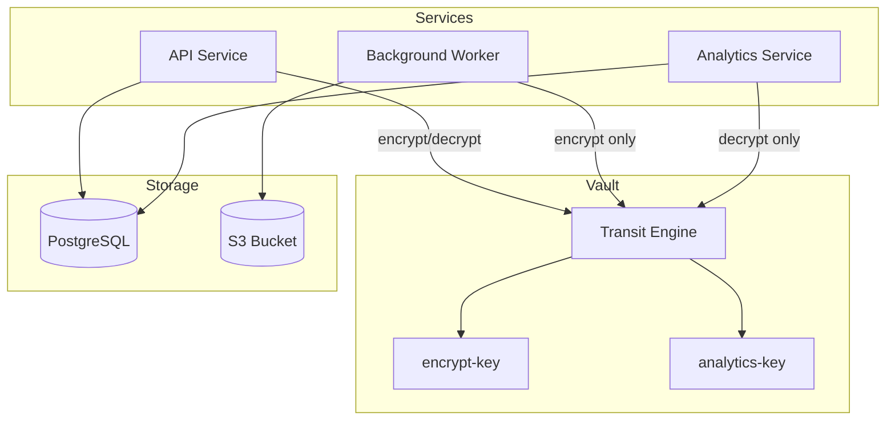

# How to Build Vault Transit Encryption

Author: [nawazdhandala](https://github.com/nawazdhandala)

Tags: Vault, Transit, Encryption, Security

Description: A practical guide to implementing encryption-as-a-service with HashiCorp Vault Transit secrets engine, covering key management, API usage, key rotation, and convergent encryption patterns.

---

Most applications handle encryption poorly. Developers either roll their own crypto (please don't), hardcode keys in environment variables, or skip encryption entirely because "it's too complicated." HashiCorp Vault's Transit secrets engine solves this by providing encryption-as-a-service. Your application sends plaintext to Vault, gets ciphertext back, and never touches the encryption keys directly.

This guide walks through setting up Vault Transit, encrypting and decrypting data via the API, rotating keys safely, and using advanced features like convergent encryption for searchable encrypted fields.

---

## Why Transit Encryption?

The Transit engine is not a storage engine. It performs cryptographic operations on data in-transit. Your application remains responsible for storing the ciphertext wherever it belongs (database, object storage, files). Vault handles the hard parts:

- **Key management**: Keys never leave Vault. Your app never sees them.
- **Key rotation**: Rotate keys without re-encrypting all data immediately.
- **Audit logging**: Every encrypt/decrypt operation is logged.
- **Access control**: Policies define which services can use which keys.



The application never handles raw keys. If your app server is compromised, the attacker gets ciphertext they cannot decrypt without also compromising Vault.

---

## Setting Up the Transit Engine

### Enable the Engine

```bash
vault secrets enable transit
```

### Create an Encryption Key

```bash
vault write -f transit/keys/my-app-key
```

This creates an AES-256-GCM key by default. For different algorithms:

```bash
# RSA-4096 for asymmetric encryption
vault write transit/keys/rsa-key type=rsa-4096

# ChaCha20-Poly1305 for high-performance scenarios
vault write transit/keys/chacha-key type=chacha20-poly1305

# ECDSA P-256 for signing
vault write transit/keys/signing-key type=ecdsa-p256
```

### View Key Configuration

```bash
vault read transit/keys/my-app-key
```

Output shows key metadata, versions, and rotation schedule. The actual key material is never exposed.

---

## Encrypting and Decrypting Data

### Encrypt via API

All data must be base64-encoded before sending to Vault.

```bash
# Encode plaintext
PLAINTEXT=$(echo -n "sensitive-data" | base64)

# Encrypt
vault write transit/encrypt/my-app-key plaintext=$PLAINTEXT
```

Response:

```json
{
  "ciphertext": "vault:v1:8SDd3WHDOjf7mq69CyCqy..."
}
```

The `vault:v1:` prefix indicates the key version used. This becomes important during rotation.

### Decrypt via API

```bash
vault write transit/decrypt/my-app-key ciphertext="vault:v1:8SDd3WHDOjf7mq69CyCqy..."
```

Response contains base64-encoded plaintext:

```json
{
  "plaintext": "c2Vuc2l0aXZlLWRhdGE="
}
```

Decode it:

```bash
echo "c2Vuc2l0aXZlLWRhdGE=" | base64 -d
# Output: sensitive-data
```

---

## Using the HTTP API Directly

Most applications call Vault's REST API rather than using the CLI.

### Encrypt Request

```bash
curl \
  --header "X-Vault-Token: $VAULT_TOKEN" \
  --request POST \
  --data '{"plaintext": "c2Vuc2l0aXZlLWRhdGE="}' \
  $VAULT_ADDR/v1/transit/encrypt/my-app-key
```

### Decrypt Request

```bash
curl \
  --header "X-Vault-Token: $VAULT_TOKEN" \
  --request POST \
  --data '{"ciphertext": "vault:v1:8SDd3WHDOjf7mq69CyCqy..."}' \
  $VAULT_ADDR/v1/transit/decrypt/my-app-key
```

### Batch Operations

For bulk encryption, send multiple items in one request:

```bash
curl \
  --header "X-Vault-Token: $VAULT_TOKEN" \
  --request POST \
  --data '{
    "batch_input": [
      {"plaintext": "Zmlyc3Qtc2VjcmV0"},
      {"plaintext": "c2Vjb25kLXNlY3JldA=="},
      {"plaintext": "dGhpcmQtc2VjcmV0"}
    ]
  }' \
  $VAULT_ADDR/v1/transit/encrypt/my-app-key
```

Batch decryption follows the same pattern with `ciphertext` fields.

---

## Key Rotation

Key rotation is where Vault Transit really shines. You can rotate keys without immediately re-encrypting all stored data.

### The Rotation Workflow



### Rotate a Key

```bash
vault write -f transit/keys/my-app-key/rotate
```

After rotation:
- New encryptions use the latest key version
- Old ciphertext still decrypts (Vault keeps old versions)
- The version number in ciphertext prefixes increments

### Rewrapping Ciphertext

Rewrapping updates ciphertext to use the latest key version without exposing plaintext:

```bash
vault write transit/rewrap/my-app-key \
  ciphertext="vault:v1:8SDd3WHDOjf7mq69CyCqy..."
```

Response:

```json
{
  "ciphertext": "vault:v2:new-ciphertext-here..."
}
```

The plaintext is never returned. Vault decrypts internally with v1, re-encrypts with v2, and returns new ciphertext.

### Batch Rewrapping

```bash
curl \
  --header "X-Vault-Token: $VAULT_TOKEN" \
  --request POST \
  --data '{
    "batch_input": [
      {"ciphertext": "vault:v1:aaa..."},
      {"ciphertext": "vault:v1:bbb..."},
      {"ciphertext": "vault:v2:ccc..."}
    ]
  }' \
  $VAULT_ADDR/v1/transit/rewrap/my-app-key
```

Items already on the latest version pass through unchanged.

### Setting Minimum Decryption Version

After rewrapping all data, enforce that old key versions cannot decrypt:

```bash
vault write transit/keys/my-app-key/config min_decryption_version=2
```

This prevents decryption of any ciphertext encrypted with v1. Use this after confirming all stored ciphertext has been rewrapped.

---

## Convergent Encryption

Standard encryption produces different ciphertext each time, even for identical plaintext. This breaks searching and indexing. Convergent encryption solves this by deriving the nonce from the plaintext, producing deterministic ciphertext.

### Enable Convergent Encryption

```bash
vault write transit/keys/searchable-key \
  type=aes256-gcm96 \
  convergent_encryption=true \
  derived=true
```

### Encrypt with Context

Convergent encryption requires a context parameter:

```bash
# Context must be base64-encoded
CONTEXT=$(echo -n "user-email-field" | base64)
PLAINTEXT=$(echo -n "user@example.com" | base64)

vault write transit/encrypt/searchable-key \
  plaintext=$PLAINTEXT \
  context=$CONTEXT
```

The same plaintext with the same context always produces the same ciphertext.

### Use Case: Searchable Encrypted Fields



To search for a user by email:
1. Encrypt the search term with the same context
2. Query the database for matching ciphertext
3. Exact matches work; range queries do not

### Security Tradeoffs

Convergent encryption leaks information about duplicate values. An attacker with database access can see that two rows have identical encrypted emails. Use it only when searchability outweighs this risk.

---

## Access Control with Policies

Restrict which services can perform which operations.

### Encrypt-Only Policy

```hcl
path "transit/encrypt/my-app-key" {
  capabilities = ["update"]
}
```

Services with this policy can encrypt but cannot decrypt. Useful for data ingestion pipelines.

### Decrypt-Only Policy

```hcl
path "transit/decrypt/my-app-key" {
  capabilities = ["update"]
}
```

For services that only need to read encrypted data.

### Full Access Policy

```hcl
path "transit/encrypt/my-app-key" {
  capabilities = ["update"]
}

path "transit/decrypt/my-app-key" {
  capabilities = ["update"]
}

path "transit/rewrap/my-app-key" {
  capabilities = ["update"]
}
```

### Apply Policies

```bash
vault policy write app-encrypt policy-encrypt.hcl
vault policy write app-decrypt policy-decrypt.hcl

# Create tokens with specific policies
vault token create -policy=app-encrypt
```

---

## Integration Patterns

### Application Architecture



### Code Example: Node.js

```javascript
const vault = require('node-vault')({
  apiVersion: 'v1',
  endpoint: process.env.VAULT_ADDR,
  token: process.env.VAULT_TOKEN
});

async function encrypt(plaintext) {
  const encoded = Buffer.from(plaintext).toString('base64');
  const result = await vault.write('transit/encrypt/my-app-key', {
    plaintext: encoded
  });
  return result.data.ciphertext;
}

async function decrypt(ciphertext) {
  const result = await vault.write('transit/decrypt/my-app-key', {
    ciphertext: ciphertext
  });
  return Buffer.from(result.data.plaintext, 'base64').toString();
}

// Usage
const encrypted = await encrypt('user-ssn-123-45-6789');
// Store encrypted in database

const decrypted = await decrypt(encrypted);
// Returns: user-ssn-123-45-6789
```

### Code Example: Python

```python
import hvac
import base64

client = hvac.Client(url=os.environ['VAULT_ADDR'], token=os.environ['VAULT_TOKEN'])

def encrypt(plaintext: str, key_name: str = 'my-app-key') -> str:
    encoded = base64.b64encode(plaintext.encode()).decode()
    result = client.secrets.transit.encrypt_data(
        name=key_name,
        plaintext=encoded
    )
    return result['data']['ciphertext']

def decrypt(ciphertext: str, key_name: str = 'my-app-key') -> str:
    result = client.secrets.transit.decrypt_data(
        name=key_name,
        ciphertext=ciphertext
    )
    decoded = base64.b64decode(result['data']['plaintext']).decode()
    return decoded

# Usage
encrypted = encrypt('credit-card-4111-1111-1111-1111')
decrypted = decrypt(encrypted)
```

---

## Operational Best Practices

### Key Naming Conventions

Use descriptive, hierarchical names:

```
transit/keys/prod/payments/card-encryption
transit/keys/prod/users/pii-encryption
transit/keys/staging/payments/card-encryption
```

### Rotation Schedule

Set automatic rotation:

```bash
vault write transit/keys/my-app-key/config \
  auto_rotate_period=720h  # 30 days
```

### Monitoring

Track these metrics:
- Encryption/decryption request rates
- Latency percentiles (p50, p95, p99)
- Error rates by key name
- Key version distribution in stored ciphertext

### Backup Considerations

Vault Transit keys are part of Vault's storage backend. Regular Vault snapshots include all key material. For disaster recovery:

1. Take regular Vault snapshots
2. Test restoration in isolated environments
3. Document key names and their purposes
4. Keep policy definitions in version control

---

## Troubleshooting Common Issues

### "encryption key not found"

The key does not exist or the path is wrong:

```bash
vault list transit/keys
vault read transit/keys/my-app-key
```

### "permission denied"

The token lacks required capabilities:

```bash
vault token lookup
vault policy read <policy-name>
```

### "ciphertext or signature did not match"

Key version mismatch or corrupted ciphertext. Check:
- Ciphertext was not modified in transit
- The correct key name is being used
- min_decryption_version has not excluded the ciphertext's version

### High Latency

- Use batch operations instead of individual calls
- Deploy Vault closer to application servers
- Enable response wrapping for frequently accessed data
- Consider Vault performance replication

---

## Summary

Vault Transit provides encryption-as-a-service without the pain of key management. Start with a basic encrypt/decrypt workflow, then layer in key rotation, access policies, and convergent encryption as needs grow.

Key takeaways:

1. Applications never touch raw keys. Vault handles all cryptographic operations.
2. Key rotation is non-disruptive. Old ciphertext continues to decrypt while new data uses fresh keys.
3. Rewrapping upgrades ciphertext to new key versions without exposing plaintext.
4. Convergent encryption enables searching encrypted data with security tradeoffs.
5. Policies control which services can encrypt, decrypt, or rewrap.

The Transit engine fits naturally into microservices architectures where centralized key management beats scattered secrets in environment variables.
