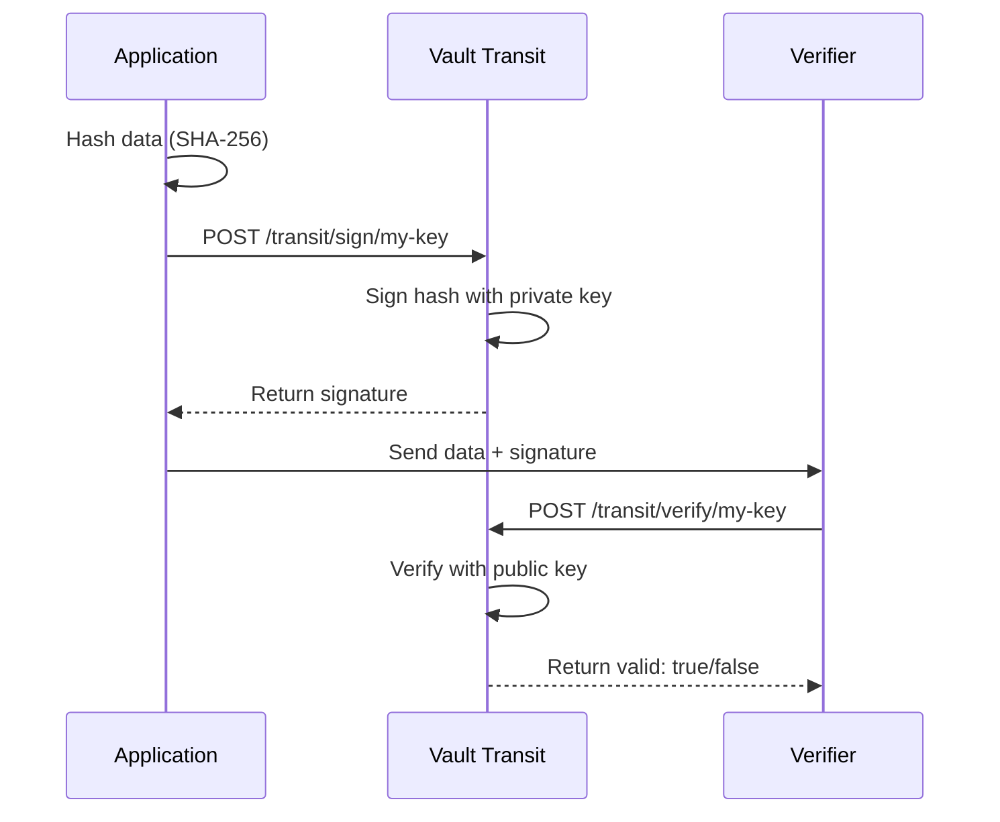
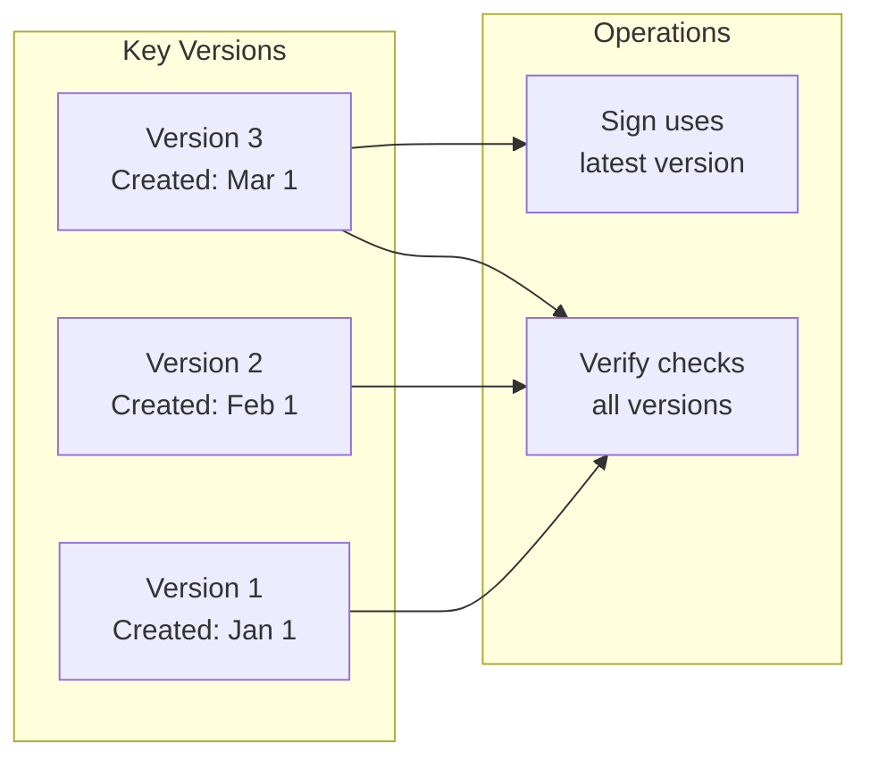

# How to Implement Vault Transit Signing

Author: [nawazdhandala](https://github.com/nawazdhandala)

Tags: Vault, Security, Transit, Signing, Cryptography, HashiCorp

Description: A practical guide to implementing cryptographic signing and verification using HashiCorp Vault's Transit secrets engine.

---

HashiCorp Vault's Transit secrets engine provides encryption as a service. Beyond encryption, it offers cryptographic signing capabilities that let you sign and verify data without exposing private keys. This is essential for secure software distribution, API authentication, and audit trails.

## Understanding Transit Signing

Transit signing uses asymmetric cryptography. Vault holds the private key and performs signing operations. Your application never sees the private key, reducing the attack surface significantly.



## Setting Up Transit Signing

### Enable the Transit Engine

```bash
# Enable transit secrets engine at the default path
vault secrets enable transit

# Or enable at a custom path
vault secrets enable -path=signing transit
```

### Key Types for Signing

Vault supports several key types for signing operations. Each has different security properties and performance characteristics.

| Key Type | Algorithm | Use Case | Performance |
|----------|-----------|----------|-------------|
| `rsa-2048` | RSA | Legacy compatibility, broad support | Slow |
| `rsa-3072` | RSA | Higher security RSA | Slower |
| `rsa-4096` | RSA | Maximum RSA security | Slowest |
| `ecdsa-p256` | ECDSA | Modern standard, good balance | Fast |
| `ecdsa-p384` | ECDSA | Higher security ECDSA | Fast |
| `ecdsa-p521` | ECDSA | Maximum ECDSA security | Medium |
| `ed25519` | EdDSA | Modern, fastest, recommended | Fastest |

### Creating Signing Keys

```bash
# Create an Ed25519 key (recommended for new projects)
vault write transit/keys/my-signing-key type=ed25519

# Create an ECDSA P-256 key
vault write transit/keys/ecdsa-key type=ecdsa-p256

# Create an RSA-2048 key for legacy compatibility
vault write transit/keys/rsa-key type=rsa-2048

# Create a key that allows export of public key
vault write transit/keys/exportable-key \
    type=ed25519 \
    exportable=false \
    allow_plaintext_backup=false
```

### Viewing Key Information

```bash
# Get key details
vault read transit/keys/my-signing-key

# Output shows key versions, type, and capabilities
# Key              Value
# ---              -----
# type             ed25519
# keys             map[1:...]
# latest_version   1
# supports_signing true
```

## Signing Operations

### Basic Signing

The sign endpoint requires base64-encoded input. Vault signs the raw bytes, not the base64 string.

```bash
# Sign a message
# First, base64 encode your data
echo -n "Hello, World!" | base64
# SGVsbG8sIFdvcmxkIQ==

# Sign the data
vault write transit/sign/my-signing-key \
    input="SGVsbG8sIFdvcmxkIQ=="

# Response includes the signature
# Key          Value
# ---          -----
# signature    vault:v1:MEUCIQDx...
```

### Signing with Hash Pre-image

When signing large files, hash locally and send the hash to Vault.

```bash
# Hash the file locally (SHA-256)
HASH=$(sha256sum large-file.bin | awk '{print $1}' | xxd -r -p | base64)

# Sign the hash with prehashed=true
vault write transit/sign/my-signing-key \
    input="$HASH" \
    prehashed=true

# For RSA keys, specify the hash algorithm used
vault write transit/sign/rsa-key \
    input="$HASH" \
    prehashed=true \
    hash_algorithm=sha2-256
```

### Signature Algorithms

Different key types support different signature algorithms.

```bash
# RSA supports multiple padding schemes
vault write transit/sign/rsa-key \
    input="SGVsbG8sIFdvcmxkIQ==" \
    signature_algorithm=pkcs1v15

# RSA-PSS padding (more secure)
vault write transit/sign/rsa-key \
    input="SGVsbG8sIFdvcmxkIQ==" \
    signature_algorithm=pss

# ECDSA uses the curve's native algorithm
vault write transit/sign/ecdsa-key \
    input="SGVsbG8sIFdvcmxkIQ=="

# Ed25519 uses EdDSA (no options needed)
vault write transit/sign/my-signing-key \
    input="SGVsbG8sIFdvcmxkIQ=="
```

### Marshaling Options

Vault can output signatures in different formats.

```bash
# Default: Vault format (vault:v1:base64signature)
vault write transit/sign/my-signing-key \
    input="SGVsbG8sIFdvcmxkIQ=="

# ASN.1 DER encoding (standard format)
vault write transit/sign/ecdsa-key \
    input="SGVsbG8sIFdvcmxkIQ==" \
    marshaling_algorithm=asn1

# JWS encoding (for JWT use cases)
vault write transit/sign/my-signing-key \
    input="SGVsbG8sIFdvcmxkIQ==" \
    marshaling_algorithm=jws
```

## Signature Verification

### Verify with Vault

```bash
# Verify a signature
vault write transit/verify/my-signing-key \
    input="SGVsbG8sIFdvcmxkIQ==" \
    signature="vault:v1:MEUCIQDx..."

# Response
# Key      Value
# ---      -----
# valid    true
```

### Verify Prehashed Data

```bash
# Verify a prehashed signature
vault write transit/verify/my-signing-key \
    input="$HASH" \
    signature="vault:v1:MEUCIQDx..." \
    prehashed=true \
    hash_algorithm=sha2-256
```

### Batch Verification

Verify multiple signatures in a single request.

```bash
vault write transit/verify/my-signing-key \
    batch_input='[
        {"input": "SGVsbG8=", "signature": "vault:v1:..."},
        {"input": "V29ybGQ=", "signature": "vault:v1:..."}
    ]'
```

## Practical Code Examples

### Python: Sign and Verify

```python
import hvac
import base64
import hashlib

# Initialize Vault client
client = hvac.Client(url='https://vault.example.com:8200')
client.token = 'your-token'

def sign_data(key_name: str, data: bytes) -> str:
    """
    Sign data using Vault Transit.

    Args:
        key_name: Name of the signing key in Vault
        data: Raw bytes to sign

    Returns:
        Vault signature string (vault:v1:...)
    """
    # Encode data as base64 for Vault API
    encoded_data = base64.b64encode(data).decode('utf-8')

    # Call Vault sign endpoint
    response = client.secrets.transit.sign_data(
        name=key_name,
        hash_input=encoded_data,
    )

    return response['data']['signature']

def sign_large_file(key_name: str, file_path: str) -> str:
    """
    Sign a large file by hashing locally first.

    Args:
        key_name: Name of the signing key in Vault
        file_path: Path to the file to sign

    Returns:
        Vault signature string
    """
    # Hash the file locally to avoid sending large data to Vault
    sha256_hash = hashlib.sha256()
    with open(file_path, 'rb') as f:
        for chunk in iter(lambda: f.read(4096), b''):
            sha256_hash.update(chunk)

    # Encode the raw hash bytes as base64
    hash_bytes = sha256_hash.digest()
    encoded_hash = base64.b64encode(hash_bytes).decode('utf-8')

    # Sign with prehashed flag
    response = client.secrets.transit.sign_data(
        name=key_name,
        hash_input=encoded_hash,
        prehashed=True,
        hash_algorithm='sha2-256',
    )

    return response['data']['signature']

def verify_signature(key_name: str, data: bytes, signature: str) -> bool:
    """
    Verify a signature using Vault Transit.

    Args:
        key_name: Name of the signing key in Vault
        data: Original data that was signed
        signature: Vault signature to verify

    Returns:
        True if signature is valid, False otherwise
    """
    encoded_data = base64.b64encode(data).decode('utf-8')

    response = client.secrets.transit.verify_signed_data(
        name=key_name,
        hash_input=encoded_data,
        signature=signature,
    )

    return response['data']['valid']

# Usage example
if __name__ == '__main__':
    message = b'Important document content'

    # Sign the message
    sig = sign_data('my-signing-key', message)
    print(f'Signature: {sig}')

    # Verify the signature
    is_valid = verify_signature('my-signing-key', message, sig)
    print(f'Valid: {is_valid}')

    # Sign a large file
    file_sig = sign_large_file('my-signing-key', '/path/to/large/file.bin')
    print(f'File signature: {file_sig}')
```

### Go: Sign and Verify

```go
package main

import (
    "crypto/sha256"
    "encoding/base64"
    "fmt"
    "io"
    "log"
    "os"

    vault "github.com/hashicorp/vault/api"
)

// VaultSigner handles signing operations with Vault Transit
type VaultSigner struct {
    client  *vault.Client
    keyName string
}

// NewVaultSigner creates a new signer instance
func NewVaultSigner(addr, token, keyName string) (*VaultSigner, error) {
    config := vault.DefaultConfig()
    config.Address = addr

    client, err := vault.NewClient(config)
    if err != nil {
        return nil, fmt.Errorf("failed to create vault client: %w", err)
    }

    client.SetToken(token)

    return &VaultSigner{
        client:  client,
        keyName: keyName,
    }, nil
}

// Sign signs data using Vault Transit
func (s *VaultSigner) Sign(data []byte) (string, error) {
    // Encode data as base64
    encoded := base64.StdEncoding.EncodeToString(data)

    // Write to the sign endpoint
    secret, err := s.client.Logical().Write(
        fmt.Sprintf("transit/sign/%s", s.keyName),
        map[string]interface{}{
            "input": encoded,
        },
    )
    if err != nil {
        return "", fmt.Errorf("failed to sign data: %w", err)
    }

    signature, ok := secret.Data["signature"].(string)
    if !ok {
        return "", fmt.Errorf("invalid signature response")
    }

    return signature, nil
}

// SignFile signs a file by hashing it locally first
func (s *VaultSigner) SignFile(filePath string) (string, error) {
    // Open and hash the file
    f, err := os.Open(filePath)
    if err != nil {
        return "", fmt.Errorf("failed to open file: %w", err)
    }
    defer f.Close()

    hasher := sha256.New()
    if _, err := io.Copy(hasher, f); err != nil {
        return "", fmt.Errorf("failed to hash file: %w", err)
    }

    // Encode hash as base64
    hashBytes := hasher.Sum(nil)
    encoded := base64.StdEncoding.EncodeToString(hashBytes)

    // Sign with prehashed flag
    secret, err := s.client.Logical().Write(
        fmt.Sprintf("transit/sign/%s", s.keyName),
        map[string]interface{}{
            "input":          encoded,
            "prehashed":      true,
            "hash_algorithm": "sha2-256",
        },
    )
    if err != nil {
        return "", fmt.Errorf("failed to sign hash: %w", err)
    }

    signature, ok := secret.Data["signature"].(string)
    if !ok {
        return "", fmt.Errorf("invalid signature response")
    }

    return signature, nil
}

// Verify verifies a signature using Vault Transit
func (s *VaultSigner) Verify(data []byte, signature string) (bool, error) {
    encoded := base64.StdEncoding.EncodeToString(data)

    secret, err := s.client.Logical().Write(
        fmt.Sprintf("transit/verify/%s", s.keyName),
        map[string]interface{}{
            "input":     encoded,
            "signature": signature,
        },
    )
    if err != nil {
        return false, fmt.Errorf("failed to verify signature: %w", err)
    }

    valid, ok := secret.Data["valid"].(bool)
    if !ok {
        return false, fmt.Errorf("invalid verify response")
    }

    return valid, nil
}

func main() {
    // Create signer instance
    signer, err := NewVaultSigner(
        "https://vault.example.com:8200",
        "your-token",
        "my-signing-key",
    )
    if err != nil {
        log.Fatal(err)
    }

    // Sign a message
    message := []byte("Important document content")
    signature, err := signer.Sign(message)
    if err != nil {
        log.Fatal(err)
    }
    fmt.Printf("Signature: %s\n", signature)

    // Verify the signature
    valid, err := signer.Verify(message, signature)
    if err != nil {
        log.Fatal(err)
    }
    fmt.Printf("Valid: %v\n", valid)
}
```

### Node.js: Sign and Verify

```javascript
const vault = require('node-vault');
const crypto = require('crypto');
const fs = require('fs');

// Initialize Vault client
const client = vault({
    apiVersion: 'v1',
    endpoint: 'https://vault.example.com:8200',
    token: 'your-token'
});

/**
 * Sign data using Vault Transit
 * @param {string} keyName - Name of the signing key
 * @param {Buffer} data - Data to sign
 * @returns {Promise<string>} - Vault signature
 */
async function signData(keyName, data) {
    // Encode data as base64
    const encoded = data.toString('base64');

    // Call Vault sign endpoint
    const response = await client.write(`transit/sign/${keyName}`, {
        input: encoded
    });

    return response.data.signature;
}

/**
 * Sign a large file by hashing locally
 * @param {string} keyName - Name of the signing key
 * @param {string} filePath - Path to file
 * @returns {Promise<string>} - Vault signature
 */
async function signFile(keyName, filePath) {
    // Hash the file using streams for memory efficiency
    const hash = await new Promise((resolve, reject) => {
        const hasher = crypto.createHash('sha256');
        const stream = fs.createReadStream(filePath);

        stream.on('data', (chunk) => hasher.update(chunk));
        stream.on('end', () => resolve(hasher.digest()));
        stream.on('error', reject);
    });

    // Encode hash as base64
    const encoded = hash.toString('base64');

    // Sign with prehashed flag
    const response = await client.write(`transit/sign/${keyName}`, {
        input: encoded,
        prehashed: true,
        hash_algorithm: 'sha2-256'
    });

    return response.data.signature;
}

/**
 * Verify a signature using Vault Transit
 * @param {string} keyName - Name of the signing key
 * @param {Buffer} data - Original data
 * @param {string} signature - Signature to verify
 * @returns {Promise<boolean>} - True if valid
 */
async function verifySignature(keyName, data, signature) {
    const encoded = data.toString('base64');

    const response = await client.write(`transit/verify/${keyName}`, {
        input: encoded,
        signature: signature
    });

    return response.data.valid;
}

// Usage example
async function main() {
    const message = Buffer.from('Important document content');

    // Sign the message
    const signature = await signData('my-signing-key', message);
    console.log('Signature:', signature);

    // Verify the signature
    const isValid = await verifySignature('my-signing-key', message, signature);
    console.log('Valid:', isValid);

    // Sign a file
    const fileSignature = await signFile('my-signing-key', '/path/to/file.bin');
    console.log('File signature:', fileSignature);
}

main().catch(console.error);
```

## Key Rotation and Versioning

Vault supports key rotation without breaking existing signatures.



### Rotate Keys

```bash
# Rotate to a new key version
vault write -f transit/keys/my-signing-key/rotate

# Check versions
vault read transit/keys/my-signing-key
# Shows all versions and which is latest
```

### Set Minimum Decryption Version

```bash
# Prevent verification with old key versions
vault write transit/keys/my-signing-key \
    min_decryption_version=2

# Now signatures made with v1 will fail verification
```

### Export Public Key

For external verification, export the public key.

```bash
# Enable key export (must be set at creation)
vault write transit/keys/exportable-key \
    type=ed25519 \
    exportable=true

# Export public key
vault read transit/export/public-key/exportable-key

# Export specific version
vault read transit/export/public-key/exportable-key/1
```

## Security Best Practices

### Policy Configuration

Create minimal policies for signing operations.

```hcl
# Policy for applications that only need to sign
path "transit/sign/app-signing-key" {
    capabilities = ["update"]
}

# Policy for applications that only need to verify
path "transit/verify/app-signing-key" {
    capabilities = ["update"]
}

# Policy for key administrators
path "transit/keys/app-signing-key" {
    capabilities = ["read"]
}

path "transit/keys/app-signing-key/rotate" {
    capabilities = ["update"]
}
```

### Audit Logging

Enable audit logging to track all signing operations.

```bash
# Enable file audit device
vault audit enable file file_path=/var/log/vault/audit.log

# All sign/verify operations are logged with:
# - Timestamp
# - Client token (hashed)
# - Operation type
# - Key name
# - Request/response data (if not redacted)
```

### Rate Limiting

Use Vault quotas to prevent abuse.

```bash
# Create rate limit quota for signing
vault write sys/quotas/rate-limit/signing-limit \
    path="transit/sign" \
    rate=100 \
    interval=60
```

## Common Use Cases

### Software Distribution

Sign release artifacts to verify authenticity.

```bash
# Sign a release binary
HASH=$(sha256sum release-v1.0.0.tar.gz | awk '{print $1}' | xxd -r -p | base64)
vault write transit/sign/release-key input="$HASH" prehashed=true

# Users can verify with the public key or via Vault
```

### API Request Signing

Sign API requests for authentication.

```python
import time
import json

def sign_api_request(method, path, body, key_name):
    """Create a signed API request."""
    timestamp = str(int(time.time()))

    # Create canonical request string
    canonical = f"{method}\n{path}\n{timestamp}\n{json.dumps(body, sort_keys=True)}"

    # Sign the canonical request
    signature = sign_data(key_name, canonical.encode())

    return {
        'X-Timestamp': timestamp,
        'X-Signature': signature,
    }
```

### Audit Trail

Sign log entries to prove they have not been tampered with.

```python
def sign_log_entry(entry: dict, key_name: str) -> dict:
    """Add signature to log entry for tamper evidence."""
    # Serialize entry deterministically
    canonical = json.dumps(entry, sort_keys=True)

    # Sign the entry
    signature = sign_data(key_name, canonical.encode())

    # Return entry with signature
    return {
        **entry,
        '_signature': signature,
    }
```

## Troubleshooting

### Common Errors

**Error: unsupported operation**
- The key type does not support signing
- Check `supports_signing` in key metadata

**Error: invalid signature**
- Data or signature was corrupted
- Wrong key or key version used
- Prehashed flag mismatch

**Error: permission denied**
- Token lacks sign/verify capability
- Check Vault policies

### Debug Checklist

1. Verify key exists and supports signing
2. Check token has correct permissions
3. Ensure input is properly base64 encoded
4. Match prehashed flag with your workflow
5. Check key version if using rotation

---

Vault Transit signing keeps your private keys secure while providing flexible cryptographic signing. Start with Ed25519 for new projects, use prehashing for large files, and always rotate keys regularly. The separation of signing capability from key access is a significant security improvement over managing keys directly in your applications.
