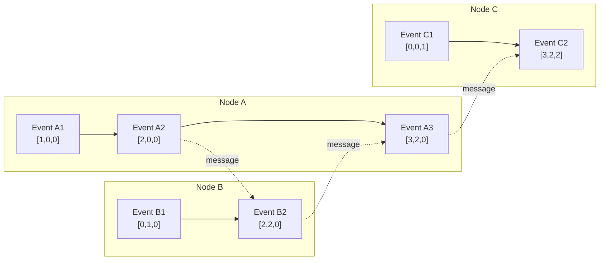
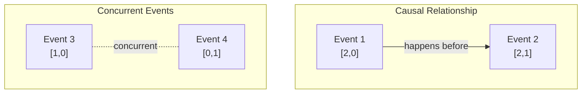
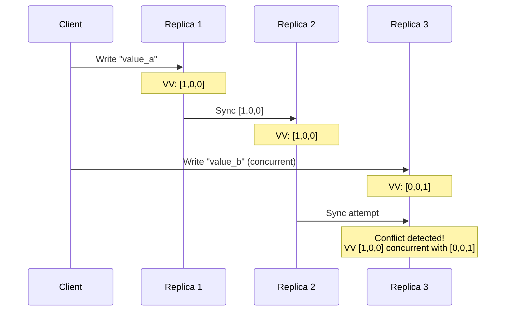
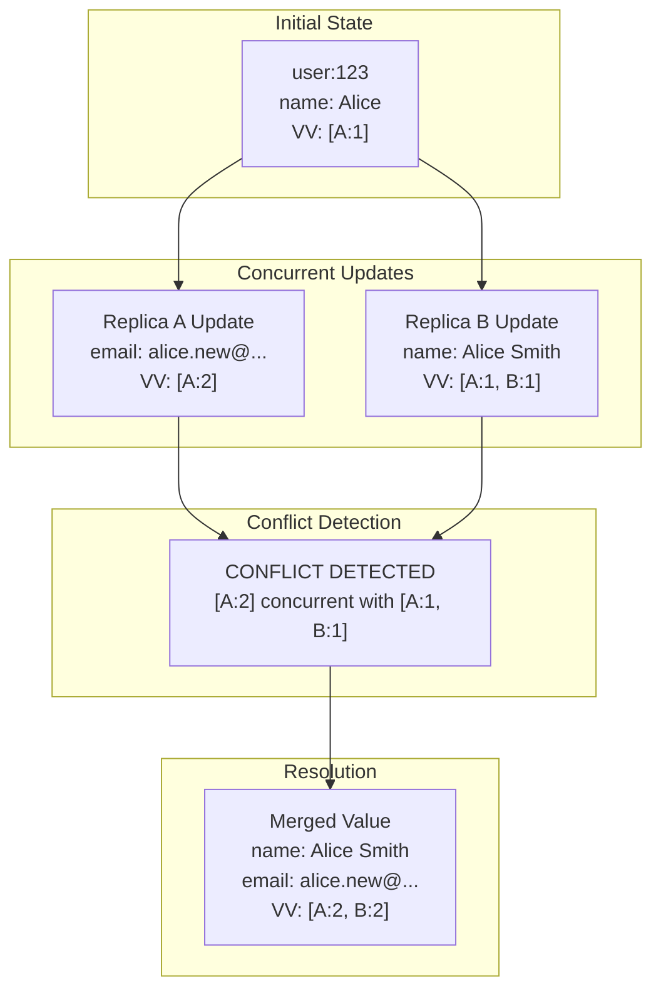

# How to Create Vector Clocks

Author: [nawazdhandala](https://github.com/nawazdhandala)

Tags: Distributed Systems, Concurrency, Architecture, Database

Description: Learn how to implement vector clocks for tracking causality in distributed systems.

---

## Introduction

In distributed systems, understanding the order of events across multiple nodes is a fundamental challenge. Physical clocks cannot be perfectly synchronized, and network delays make it impossible to rely on timestamps alone. Vector clocks provide an elegant solution by tracking causality between events without depending on synchronized time.

This guide will walk you through implementing vector clocks from scratch, understanding their properties, and using them for conflict detection in real-world applications.

## What Are Vector Clocks?

A vector clock is a data structure that assigns a logical timestamp to each event in a distributed system. Unlike simple Lamport timestamps, vector clocks can determine whether two events are causally related or concurrent.

Each node in the system maintains a vector of counters, one for each node. When an event occurs, the node increments its own counter. When sending messages, nodes include their vector clock. When receiving messages, nodes merge the incoming vector with their own.



## Core Vector Clock Operations

Let us implement a vector clock class that supports the three fundamental operations: increment, send, and receive.

### Basic Implementation

```python
from typing import Dict, Optional
from copy import deepcopy


class VectorClock:
    """
    A vector clock implementation for tracking causality in distributed systems.

    Each node maintains a dictionary mapping node IDs to logical timestamps.
    The clock tracks the number of events that have occurred at each node
    from the perspective of the current node.
    """

    def __init__(self, node_id: str, initial_clock: Optional[Dict[str, int]] = None):
        """
        Initialize a vector clock for a specific node.

        Args:
            node_id: Unique identifier for this node
            initial_clock: Optional starting state for the clock
        """
        self.node_id = node_id
        # Initialize the clock with zero for this node if not provided
        self.clock: Dict[str, int] = initial_clock if initial_clock else {node_id: 0}

    def increment(self) -> "VectorClock":
        """
        Increment this node's counter when a local event occurs.

        This operation is called before any local event that needs
        to be tracked for causality purposes.

        Returns:
            Self for method chaining
        """
        # Ensure this node exists in the clock
        if self.node_id not in self.clock:
            self.clock[self.node_id] = 0

        # Increment the local counter
        self.clock[self.node_id] += 1
        return self

    def send(self) -> Dict[str, int]:
        """
        Prepare the clock for sending with a message.

        Before sending a message to another node, increment the local
        counter and return a copy of the clock to include with the message.

        Returns:
            A copy of the current clock state to send with the message
        """
        # Increment before sending to mark the send event
        self.increment()
        # Return a deep copy to prevent external modification
        return deepcopy(self.clock)

    def receive(self, incoming_clock: Dict[str, int]) -> "VectorClock":
        """
        Merge an incoming clock with the local clock.

        When receiving a message, take the element-wise maximum of
        the local clock and the incoming clock, then increment
        the local counter to mark the receive event.

        Args:
            incoming_clock: The vector clock received with the message

        Returns:
            Self for method chaining
        """
        # Merge by taking the maximum of each component
        all_nodes = set(self.clock.keys()) | set(incoming_clock.keys())

        for node in all_nodes:
            local_time = self.clock.get(node, 0)
            incoming_time = incoming_clock.get(node, 0)
            self.clock[node] = max(local_time, incoming_time)

        # Increment local counter to mark the receive event
        self.increment()
        return self

    def get_time(self) -> Dict[str, int]:
        """
        Get the current clock state.

        Returns:
            A copy of the current vector clock
        """
        return deepcopy(self.clock)

    def __repr__(self) -> str:
        """String representation of the vector clock."""
        return f"VectorClock({self.node_id}, {self.clock})"
```

### Usage Example

```python
# Create vector clocks for three nodes
clock_a = VectorClock("A")
clock_b = VectorClock("B")
clock_c = VectorClock("C")

# Node A performs a local event
clock_a.increment()
print(f"After A's local event: {clock_a}")
# Output: VectorClock(A, {'A': 1})

# Node A sends a message to Node B
message_clock = clock_a.send()
print(f"A sends message with clock: {message_clock}")
# Output: A sends message with clock: {'A': 2}

# Node B receives the message from A
clock_b.receive(message_clock)
print(f"After B receives from A: {clock_b}")
# Output: VectorClock(B, {'A': 2, 'B': 1})

# Node B sends to Node C
message_clock_2 = clock_b.send()
clock_c.receive(message_clock_2)
print(f"After C receives from B: {clock_c}")
# Output: VectorClock(C, {'A': 2, 'B': 2, 'C': 1})
```

## Comparing Vector Clocks

The power of vector clocks lies in their ability to determine causal relationships. Two events can be:

1. **Causally related**: One event happened before the other
2. **Concurrent**: Neither event happened before the other



### Comparison Implementation

```python
from enum import Enum


class ClockRelation(Enum):
    """Possible relationships between two vector clocks."""
    BEFORE = "before"      # First clock happened before second
    AFTER = "after"        # First clock happened after second
    CONCURRENT = "concurrent"  # Events are concurrent (no causal relation)
    EQUAL = "equal"        # Clocks are identical


def compare_clocks(clock1: Dict[str, int], clock2: Dict[str, int]) -> ClockRelation:
    """
    Compare two vector clocks to determine their causal relationship.

    Clock1 is BEFORE Clock2 if all components of Clock1 are less than
    or equal to the corresponding components of Clock2, and at least
    one component is strictly less.

    Args:
        clock1: First vector clock
        clock2: Second vector clock

    Returns:
        The relationship between the two clocks
    """
    # Get all nodes from both clocks
    all_nodes = set(clock1.keys()) | set(clock2.keys())

    # Track comparison results
    has_less = False      # clock1 has at least one component less than clock2
    has_greater = False   # clock1 has at least one component greater than clock2

    for node in all_nodes:
        time1 = clock1.get(node, 0)
        time2 = clock2.get(node, 0)

        if time1 < time2:
            has_less = True
        elif time1 > time2:
            has_greater = True

    # Determine relationship based on comparison results
    if not has_less and not has_greater:
        return ClockRelation.EQUAL
    elif has_less and not has_greater:
        return ClockRelation.BEFORE
    elif has_greater and not has_less:
        return ClockRelation.AFTER
    else:
        # Both has_less and has_greater are True
        return ClockRelation.CONCURRENT


# Example usage
clock_v1 = {"A": 2, "B": 1}
clock_v2 = {"A": 2, "B": 3}
clock_v3 = {"A": 3, "B": 1}

print(compare_clocks(clock_v1, clock_v2))  # BEFORE (v1 happened before v2)
print(compare_clocks(clock_v2, clock_v1))  # AFTER (v2 happened after v1)
print(compare_clocks(clock_v2, clock_v3))  # CONCURRENT (no causal relation)
```

## Version Vectors for Data Replication

Version vectors are a practical application of vector clocks used in distributed databases to track data versions and detect conflicts. Each replica maintains a version vector that gets updated when data changes.



### Version Vector Implementation

```python
from dataclasses import dataclass
from typing import Any, List, Tuple


@dataclass
class VersionedValue:
    """
    A value with an associated version vector.

    This structure pairs data with its causal history,
    enabling conflict detection during replication.
    """
    value: Any
    version: Dict[str, int]

    def __repr__(self) -> str:
        return f"VersionedValue({self.value}, {self.version})"


class VersionVectorStore:
    """
    A key-value store that uses version vectors for conflict detection.

    This implementation tracks the causal history of each key and
    can detect when concurrent writes create conflicts.
    """

    def __init__(self, replica_id: str):
        """
        Initialize a replica of the version vector store.

        Args:
            replica_id: Unique identifier for this replica
        """
        self.replica_id = replica_id
        # Store maps keys to lists of versioned values
        # Multiple values indicate unresolved conflicts
        self.store: Dict[str, List[VersionedValue]] = {}

    def write(self, key: str, value: Any,
              context: Optional[Dict[str, int]] = None) -> Dict[str, int]:
        """
        Write a value to the store with version tracking.

        If a context (previous version vector) is provided, the write
        is considered a descendant of that version. Otherwise, it creates
        a new causal history.

        Args:
            key: The key to write to
            value: The value to store
            context: Optional version vector from a previous read

        Returns:
            The new version vector for this write
        """
        # Start with the context or empty clock
        new_version = dict(context) if context else {}

        # Ensure replica ID exists and increment it
        if self.replica_id not in new_version:
            new_version[self.replica_id] = 0
        new_version[self.replica_id] += 1

        new_entry = VersionedValue(value, new_version)

        if key not in self.store:
            # First write to this key
            self.store[key] = [new_entry]
        else:
            # Filter out any versions that the new version dominates
            surviving_versions = []
            for existing in self.store[key]:
                relation = compare_clocks(existing.version, new_version)
                # Keep versions that are concurrent or newer
                if relation in (ClockRelation.CONCURRENT, ClockRelation.AFTER):
                    surviving_versions.append(existing)

            surviving_versions.append(new_entry)
            self.store[key] = surviving_versions

        return new_version

    def read(self, key: str) -> Tuple[List[Any], Dict[str, int]]:
        """
        Read a value from the store.

        Returns all concurrent versions (if conflicts exist) along with
        a merged version vector that can be used as context for subsequent writes.

        Args:
            key: The key to read

        Returns:
            Tuple of (list of values, merged version vector)
        """
        if key not in self.store:
            return [], {}

        versions = self.store[key]
        values = [v.value for v in versions]

        # Merge all version vectors to create a context for future writes
        merged_version: Dict[str, int] = {}
        for v in versions:
            for node, time in v.version.items():
                merged_version[node] = max(merged_version.get(node, 0), time)

        return values, merged_version

    def has_conflict(self, key: str) -> bool:
        """
        Check if a key has unresolved conflicts.

        Args:
            key: The key to check

        Returns:
            True if multiple concurrent versions exist
        """
        return key in self.store and len(self.store[key]) > 1

    def resolve_conflict(self, key: str, resolved_value: Any) -> Dict[str, int]:
        """
        Resolve conflicts by writing a new value that dominates all existing versions.

        Args:
            key: The key with conflicts
            resolved_value: The value that resolves the conflict

        Returns:
            The new version vector
        """
        # Read to get merged context of all versions
        _, context = self.read(key)
        # Write the resolved value with full context
        return self.write(key, resolved_value, context)
```

### Conflict Detection Example

```python
# Create two replicas of the store
replica_a = VersionVectorStore("A")
replica_b = VersionVectorStore("B")

# Write initial value on replica A
version_a = replica_a.write("user:123", {"name": "Alice", "email": "alice@example.com"})
print(f"Replica A writes: version {version_a}")
# Output: Replica A writes: version {'A': 1}

# Simulate replication to replica B
replica_b.store["user:123"] = [VersionedValue(
    {"name": "Alice", "email": "alice@example.com"},
    {"A": 1}
)]

# Concurrent writes happen on both replicas
# Replica A updates the email
values_a, context_a = replica_a.read("user:123")
version_a2 = replica_a.write(
    "user:123",
    {"name": "Alice", "email": "alice.new@example.com"},
    context_a
)
print(f"Replica A updates email: version {version_a2}")
# Output: Replica A updates email: version {'A': 2}

# Replica B updates the name (concurrently)
values_b, context_b = replica_b.read("user:123")
version_b = replica_b.write(
    "user:123",
    {"name": "Alice Smith", "email": "alice@example.com"},
    context_b
)
print(f"Replica B updates name: version {version_b}")
# Output: Replica B updates name: version {'A': 1, 'B': 1}

# Check the relationship between these versions
relation = compare_clocks(version_a2, version_b)
print(f"Versions are: {relation.value}")
# Output: Versions are: concurrent

# When syncing, replica B receives A's update
# This creates a conflict because the versions are concurrent
replica_b.store["user:123"].append(VersionedValue(
    {"name": "Alice", "email": "alice.new@example.com"},
    {"A": 2}
))

print(f"Replica B has conflict: {replica_b.has_conflict('user:123')}")
# Output: Replica B has conflict: True

# Read shows both conflicting values
values, merged_context = replica_b.read("user:123")
print(f"Conflicting values: {values}")
print(f"Merged context: {merged_context}")
# Output: Conflicting values: [{'name': 'Alice Smith', 'email': 'alice@example.com'},
#                              {'name': 'Alice', 'email': 'alice.new@example.com'}]
# Output: Merged context: {'A': 2, 'B': 1}

# Resolve the conflict by merging the changes
resolved_value = {"name": "Alice Smith", "email": "alice.new@example.com"}
final_version = replica_b.resolve_conflict("user:123", resolved_value)
print(f"Conflict resolved with version: {final_version}")
# Output: Conflict resolved with version: {'A': 2, 'B': 2}
```

## Visualizing Conflict Detection

The following diagram shows how conflicts arise and get detected:



## Practical Considerations

### Clock Pruning

In long-running systems, vector clocks can grow unbounded as new nodes join. Implementing clock pruning helps manage this:

```python
def prune_clock(clock: Dict[str, int], active_nodes: set, threshold: int = 0) -> Dict[str, int]:
    """
    Remove entries for nodes that are no longer active or have low values.

    This helps prevent unbounded growth of vector clocks in systems
    where nodes frequently join and leave.

    Args:
        clock: The vector clock to prune
        active_nodes: Set of currently active node IDs
        threshold: Minimum value to keep for inactive nodes

    Returns:
        A pruned copy of the clock
    """
    pruned = {}
    for node, time in clock.items():
        # Keep if node is active or has significant history
        if node in active_nodes or time > threshold:
            pruned[node] = time
    return pruned
```

### Dotted Version Vectors

For better accuracy in conflict detection, consider using dotted version vectors which separate the event that created a value from the causal context:

```python
@dataclass
class DottedVersionedValue:
    """
    A value with a dotted version vector.

    The dot represents the specific event that created this version,
    while the context represents all events known at creation time.
    """
    value: Any
    dot: Tuple[str, int]           # (node_id, counter) of creating event
    context: Dict[str, int]        # Causal context at creation

    def dominates(self, other: "DottedVersionedValue") -> bool:
        """
        Check if this version dominates (happened after) another.

        A version dominates another if its context includes the other's dot.
        """
        other_node, other_counter = other.dot
        return self.context.get(other_node, 0) >= other_counter
```

## Summary

Vector clocks provide a powerful mechanism for tracking causality in distributed systems. The key concepts to remember are:

1. **Local events**: Increment the local counter
2. **Send events**: Include the current vector clock with messages
3. **Receive events**: Merge clocks by taking the element-wise maximum
4. **Comparison**: Determine if events are causally related or concurrent

When implementing version vectors for data replication:

- Track versions for each piece of data separately
- Detect conflicts when versions are concurrent
- Provide mechanisms for conflict resolution
- Consider pruning strategies for long-running systems

Vector clocks form the foundation for many distributed systems including Amazon Dynamo, Riak, and various CRDTs (Conflict-free Replicated Data Types).

## Further Reading

- Leslie Lamport's original paper on logical clocks
- The Dynamo paper from Amazon
- Research on dotted version vectors and delta-state CRDTs
- Practical implementations in databases like Riak and Cassandra
