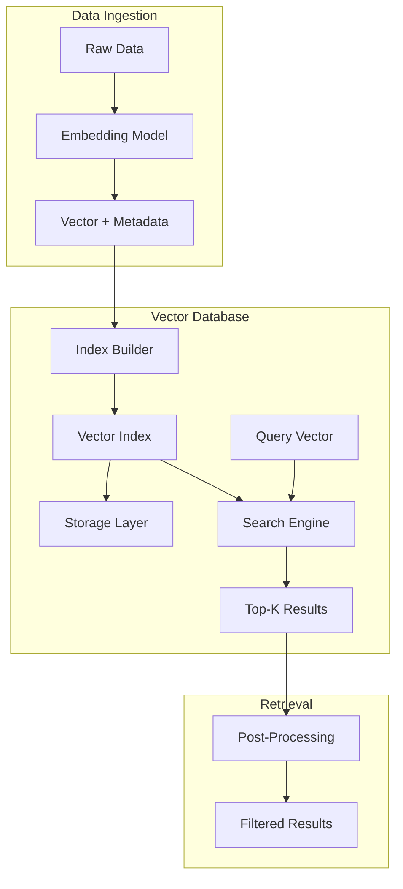
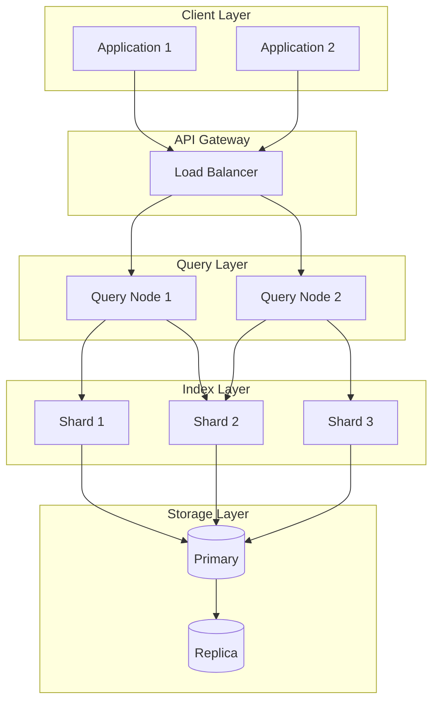

# How to Build Vector Database Architecture

Author: [nawazdhandala](https://www.github.com/nawazdhandala)

Tags: Vector Database, AI, Embeddings, Search, Machine Learning

Description: Design vector database architecture with indexing strategies, distance metrics, filtering, and scaling for AI-powered semantic search.

---

Vector databases have become essential infrastructure for AI applications. Whether you are building semantic search, recommendation systems, or retrieval-augmented generation (RAG) pipelines, understanding how to architect a vector database system from the ground up will help you make better decisions about performance, scalability, and cost.

In this guide, we will walk through the core components of vector database architecture, explore indexing strategies, and build a working implementation that you can adapt for your own projects.

## What Makes Vector Databases Different

Traditional databases excel at exact matching and structured queries. Vector databases solve a fundamentally different problem: finding items that are similar to a query, not identical to it.

When you convert text, images, or other data into embeddings (dense numerical vectors), you need a system that can efficiently search through millions or billions of these vectors to find the most similar ones. This is where vector database architecture comes in.



## Core Components of Vector Database Architecture

A production-ready vector database needs several interconnected components. Let us examine each one.

### 1. The Embedding Layer

Before vectors reach your database, they need to be generated. Here is a simple embedding service that converts text to vectors.

```python
# embedding_service.py
# Handles conversion of raw data into vector embeddings

import numpy as np
from sentence_transformers import SentenceTransformer
from typing import List, Dict, Any

class EmbeddingService:
    def __init__(self, model_name: str = "all-MiniLM-L6-v2"):
        # Load the embedding model once and reuse it
        self.model = SentenceTransformer(model_name)
        self.dimension = self.model.get_sentence_embedding_dimension()

    def embed_text(self, text: str) -> np.ndarray:
        """Convert a single text string to a vector."""
        return self.model.encode(text, normalize_embeddings=True)

    def embed_batch(self, texts: List[str]) -> np.ndarray:
        """Convert multiple texts to vectors efficiently."""
        # Batch processing is significantly faster than one-by-one
        return self.model.encode(
            texts,
            normalize_embeddings=True,
            batch_size=32,
            show_progress_bar=False
        )

    def get_dimension(self) -> int:
        """Return the vector dimension for index configuration."""
        return self.dimension
```

### 2. Distance Metrics

The choice of distance metric affects both accuracy and performance. The three most common metrics are cosine similarity, Euclidean distance, and dot product.

```python
# distance_metrics.py
# Implements common distance functions for vector similarity

import numpy as np
from enum import Enum
from typing import Callable

class DistanceMetric(Enum):
    COSINE = "cosine"
    EUCLIDEAN = "euclidean"
    DOT_PRODUCT = "dot_product"

def cosine_distance(a: np.ndarray, b: np.ndarray) -> float:
    """
    Cosine distance: 1 - cosine_similarity
    Best for: normalized embeddings, text similarity
    Range: 0 (identical) to 2 (opposite)
    """
    dot = np.dot(a, b)
    norm_a = np.linalg.norm(a)
    norm_b = np.linalg.norm(b)
    return 1 - (dot / (norm_a * norm_b))

def euclidean_distance(a: np.ndarray, b: np.ndarray) -> float:
    """
    L2 distance: straight-line distance between points
    Best for: image embeddings, spatial data
    Range: 0 (identical) to infinity
    """
    return np.linalg.norm(a - b)

def dot_product_distance(a: np.ndarray, b: np.ndarray) -> float:
    """
    Negative dot product (for minimization)
    Best for: pre-normalized vectors, maximum inner product search
    """
    return -np.dot(a, b)

def get_distance_function(metric: DistanceMetric) -> Callable:
    """Factory function to get the appropriate distance calculator."""
    functions = {
        DistanceMetric.COSINE: cosine_distance,
        DistanceMetric.EUCLIDEAN: euclidean_distance,
        DistanceMetric.DOT_PRODUCT: dot_product_distance
    }
    return functions[metric]
```

### 3. Indexing Strategies

The index is the heart of any vector database. A brute-force search works fine for small datasets, but at scale you need approximate nearest neighbor (ANN) algorithms.

Here is how different indexing strategies compare:

| Index Type | Build Time | Query Speed | Memory Usage | Accuracy |
|------------|------------|-------------|--------------|----------|
| Flat (Brute Force) | Fast | Slow | Low | 100% |
| IVF (Inverted File) | Medium | Fast | Medium | 95-99% |
| HNSW (Hierarchical NSW) | Slow | Very Fast | High | 95-99% |
| PQ (Product Quantization) | Medium | Fast | Very Low | 90-95% |

Let us implement a simple HNSW-inspired index structure.

```python
# vector_index.py
# Implements a vector index with multiple strategy support

import numpy as np
from dataclasses import dataclass
from typing import List, Tuple, Optional, Dict, Any
import heapq

@dataclass
class VectorRecord:
    id: str
    vector: np.ndarray
    metadata: Dict[str, Any]

class VectorIndex:
    def __init__(
        self,
        dimension: int,
        metric: str = "cosine",
        index_type: str = "flat"
    ):
        self.dimension = dimension
        self.metric = metric
        self.index_type = index_type

        # Storage for vectors and metadata
        self.vectors: List[VectorRecord] = []
        self.id_to_index: Dict[str, int] = {}

    def add(self, id: str, vector: np.ndarray, metadata: Dict[str, Any] = None):
        """Add a vector to the index."""
        if vector.shape[0] != self.dimension:
            raise ValueError(f"Expected dimension {self.dimension}, got {vector.shape[0]}")

        # Normalize for cosine similarity
        if self.metric == "cosine":
            vector = vector / np.linalg.norm(vector)

        record = VectorRecord(id=id, vector=vector, metadata=metadata or {})
        self.id_to_index[id] = len(self.vectors)
        self.vectors.append(record)

    def search(
        self,
        query_vector: np.ndarray,
        k: int = 10,
        filter_fn: Optional[callable] = None
    ) -> List[Tuple[str, float, Dict[str, Any]]]:
        """
        Find the k nearest neighbors to the query vector.
        Returns list of (id, distance, metadata) tuples.
        """
        if self.metric == "cosine":
            query_vector = query_vector / np.linalg.norm(query_vector)

        # Calculate distances to all vectors (flat search)
        # In production, use FAISS or similar for ANN search
        results = []

        for record in self.vectors:
            # Apply metadata filter if provided
            if filter_fn and not filter_fn(record.metadata):
                continue

            distance = self._calculate_distance(query_vector, record.vector)
            results.append((record.id, distance, record.metadata))

        # Return top-k results sorted by distance
        results.sort(key=lambda x: x[1])
        return results[:k]

    def _calculate_distance(self, a: np.ndarray, b: np.ndarray) -> float:
        """Calculate distance based on configured metric."""
        if self.metric == "cosine":
            # For normalized vectors, cosine distance = 1 - dot product
            return 1 - np.dot(a, b)
        elif self.metric == "euclidean":
            return np.linalg.norm(a - b)
        else:
            return -np.dot(a, b)
```

### 4. Metadata Filtering

Real applications rarely need pure vector search. You almost always want to filter by category, date range, user ID, or other attributes. This is called hybrid search.

```python
# filter_builder.py
# Creates composable filters for metadata-based filtering

from typing import Dict, Any, Callable, List
from dataclasses import dataclass

@dataclass
class FilterCondition:
    field: str
    operator: str
    value: Any

class FilterBuilder:
    """Build complex filters for vector search."""

    def __init__(self):
        self.conditions: List[FilterCondition] = []

    def equals(self, field: str, value: Any) -> "FilterBuilder":
        """Add an equality condition."""
        self.conditions.append(FilterCondition(field, "eq", value))
        return self

    def greater_than(self, field: str, value: Any) -> "FilterBuilder":
        """Add a greater-than condition."""
        self.conditions.append(FilterCondition(field, "gt", value))
        return self

    def less_than(self, field: str, value: Any) -> "FilterBuilder":
        """Add a less-than condition."""
        self.conditions.append(FilterCondition(field, "lt", value))
        return self

    def in_list(self, field: str, values: List[Any]) -> "FilterBuilder":
        """Add an 'in' condition for list membership."""
        self.conditions.append(FilterCondition(field, "in", values))
        return self

    def build(self) -> Callable[[Dict[str, Any]], bool]:
        """Compile conditions into a filter function."""
        conditions = self.conditions.copy()

        def filter_fn(metadata: Dict[str, Any]) -> bool:
            for cond in conditions:
                value = metadata.get(cond.field)
                if value is None:
                    return False

                if cond.operator == "eq" and value != cond.value:
                    return False
                elif cond.operator == "gt" and value <= cond.value:
                    return False
                elif cond.operator == "lt" and value >= cond.value:
                    return False
                elif cond.operator == "in" and value not in cond.value:
                    return False

            return True

        return filter_fn
```

## Putting It All Together

Now let us combine these components into a complete vector database service.

```python
# vector_database.py
# Complete vector database service combining all components

from embedding_service import EmbeddingService
from vector_index import VectorIndex
from filter_builder import FilterBuilder
from typing import List, Dict, Any, Optional
import json

class VectorDatabase:
    def __init__(self, collection_name: str, dimension: int = 384):
        self.collection_name = collection_name
        self.embedding_service = EmbeddingService()
        self.index = VectorIndex(
            dimension=dimension,
            metric="cosine",
            index_type="flat"
        )

    def upsert(
        self,
        id: str,
        text: str,
        metadata: Dict[str, Any] = None
    ):
        """Insert or update a document with its embedding."""
        vector = self.embedding_service.embed_text(text)

        # Store original text in metadata for retrieval
        full_metadata = {"text": text, **(metadata or {})}
        self.index.add(id, vector, full_metadata)

    def query(
        self,
        query_text: str,
        k: int = 10,
        filter_builder: Optional[FilterBuilder] = None
    ) -> List[Dict[str, Any]]:
        """Search for similar documents."""
        query_vector = self.embedding_service.embed_text(query_text)

        filter_fn = filter_builder.build() if filter_builder else None

        results = self.index.search(query_vector, k=k, filter_fn=filter_fn)

        return [
            {
                "id": id,
                "score": 1 - distance,  # Convert distance to similarity
                "metadata": metadata
            }
            for id, distance, metadata in results
        ]

# Example usage
if __name__ == "__main__":
    db = VectorDatabase("documents")

    # Add some documents
    db.upsert("doc1", "Python is great for machine learning", {"category": "tech"})
    db.upsert("doc2", "TensorFlow and PyTorch are popular ML frameworks", {"category": "tech"})
    db.upsert("doc3", "The weather is sunny today", {"category": "general"})

    # Search with filter
    filter = FilterBuilder().equals("category", "tech")
    results = db.query("deep learning frameworks", k=2, filter_builder=filter)

    for result in results:
        print(f"Score: {result['score']:.3f} - {result['metadata']['text']}")
```

## Scaling Considerations

When moving to production, consider these architectural patterns:



Key scaling strategies include:

1. **Sharding**: Partition vectors across multiple nodes based on ID hash or metadata
2. **Replication**: Keep copies of indexes for read scalability and fault tolerance
3. **Caching**: Cache frequent queries and their results
4. **Async indexing**: Queue new vectors and batch-process index updates

## Conclusion

Building a vector database from scratch teaches you the fundamental tradeoffs between accuracy, speed, and memory. While production systems like Pinecone, Weaviate, or Milvus handle these concerns for you, understanding the underlying architecture helps you choose the right tool and configure it properly for your use case.

The key takeaways are: choose your distance metric based on your embedding model, select an index type that balances your accuracy and latency requirements, and always plan for metadata filtering from the start. With these principles in mind, you can build vector search systems that scale with your AI applications.
