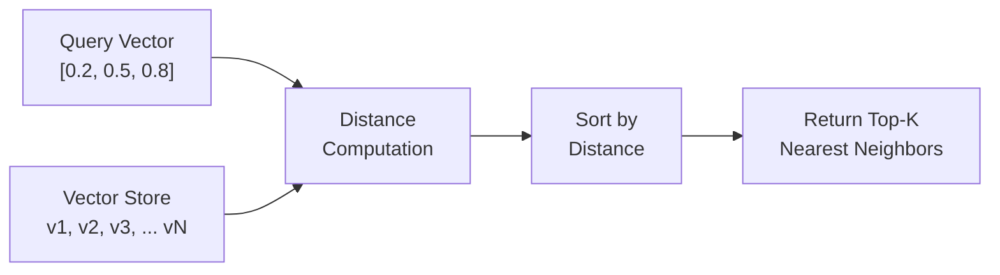
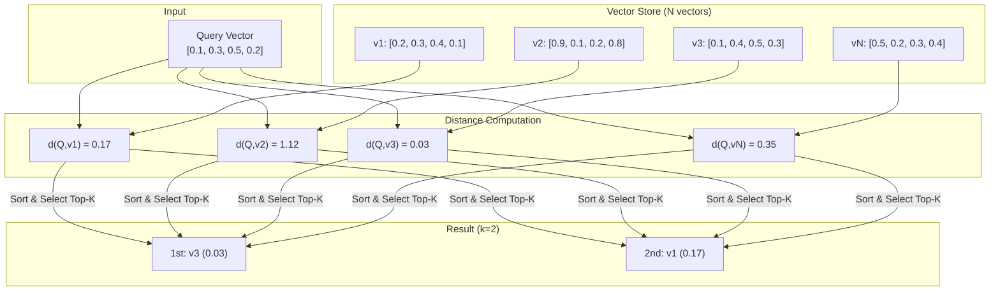
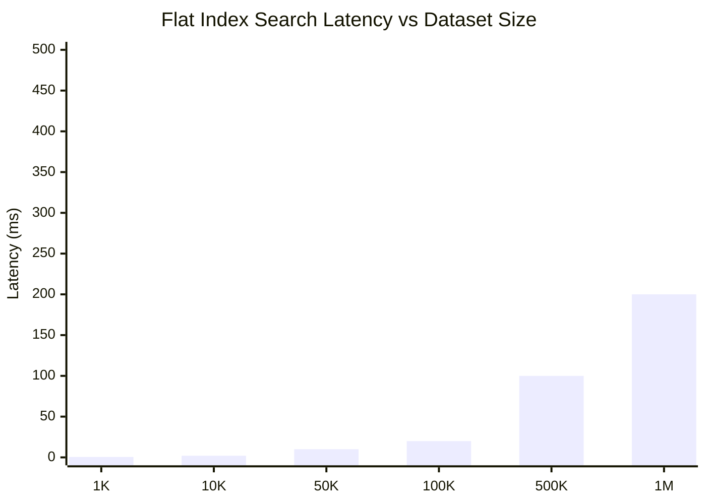
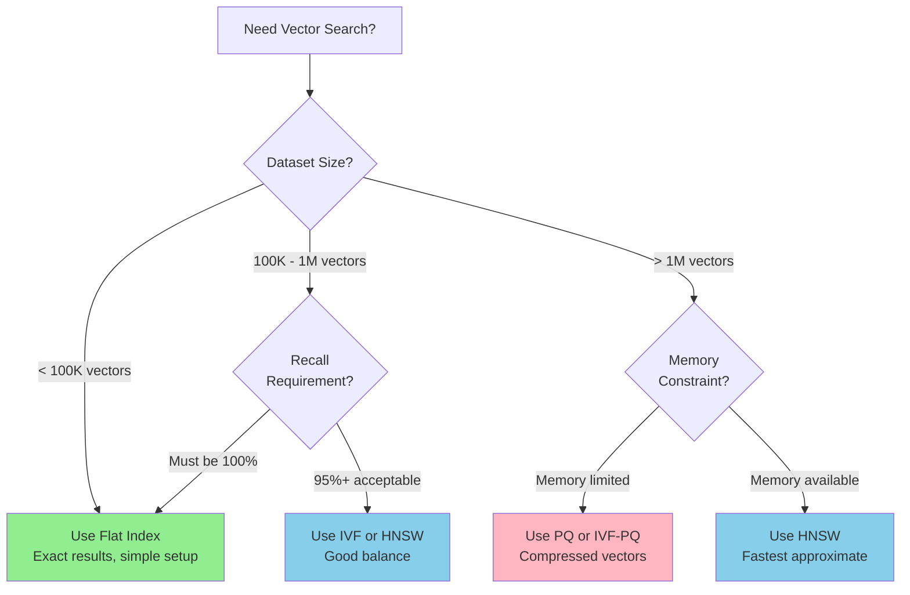

# How to Implement Flat Index

Author: [nawazdhandala](https://github.com/nawazdhandala)

Tags: Vector Database, Flat Index, Brute Force, Exact Search

Description: Learn to implement flat index for exact nearest neighbor search with brute force comparison.

---

> Flat index is the simplest and most accurate approach to vector similarity search. It compares every query vector against every stored vector, guaranteeing exact nearest neighbors. While computationally expensive for large datasets, flat index serves as the foundation for understanding more complex indexing strategies.

When you need 100% recall and your dataset is small enough, flat index is the right choice.

---

## Overview

A flat index stores vectors in their raw form without any compression or hierarchical structure. During search, it computes the distance between the query vector and every vector in the index. This brute force approach guarantees finding the true nearest neighbors.



---

## When to Use Flat Index

Flat index is ideal for:

- **Small datasets** with fewer than 100,000 vectors
- **High precision requirements** where approximate results are unacceptable
- **Baseline comparisons** to evaluate approximate methods
- **Development and testing** before deploying optimized indexes
- **Dynamic datasets** with frequent insertions and deletions

---

## Distance Metrics

Flat index supports multiple distance metrics. The choice depends on your data and use case.

### Euclidean Distance (L2)

Measures the straight line distance between two points in vector space. Smaller values indicate more similar vectors.

```python
# euclidean_distance.py
import numpy as np

def euclidean_distance(vec_a: np.ndarray, vec_b: np.ndarray) -> float:
    """
    Calculate Euclidean (L2) distance between two vectors.

    The Euclidean distance is the square root of the sum of squared differences.
    It measures the geometric distance between two points in n-dimensional space.

    Args:
        vec_a: First vector as numpy array
        vec_b: Second vector as numpy array

    Returns:
        The L2 distance as a float (0 means identical vectors)
    """
    # Compute element-wise difference
    diff = vec_a - vec_b

    # Square each difference, sum them, and take square root
    return np.sqrt(np.sum(diff ** 2))


def euclidean_distance_squared(vec_a: np.ndarray, vec_b: np.ndarray) -> float:
    """
    Calculate squared Euclidean distance (faster, avoids sqrt).

    For ranking purposes, squared distance preserves the same ordering
    as regular Euclidean distance while avoiding the expensive sqrt operation.

    Args:
        vec_a: First vector as numpy array
        vec_b: Second vector as numpy array

    Returns:
        The squared L2 distance
    """
    diff = vec_a - vec_b
    return np.sum(diff ** 2)
```

### Cosine Similarity

Measures the angle between two vectors, ignoring magnitude. Values range from -1 (opposite) to 1 (identical direction). For search, we convert to distance by subtracting from 1.

```python
# cosine_similarity.py
import numpy as np

def cosine_similarity(vec_a: np.ndarray, vec_b: np.ndarray) -> float:
    """
    Calculate cosine similarity between two vectors.

    Cosine similarity measures the cosine of the angle between vectors.
    It focuses on direction rather than magnitude, making it ideal for
    text embeddings where document length should not affect similarity.

    Args:
        vec_a: First vector as numpy array
        vec_b: Second vector as numpy array

    Returns:
        Similarity score between -1 and 1 (1 means identical direction)
    """
    # Compute dot product of the two vectors
    dot_product = np.dot(vec_a, vec_b)

    # Compute the L2 norm (magnitude) of each vector
    norm_a = np.linalg.norm(vec_a)
    norm_b = np.linalg.norm(vec_b)

    # Avoid division by zero for zero vectors
    if norm_a == 0 or norm_b == 0:
        return 0.0

    # Cosine similarity is dot product divided by product of magnitudes
    return dot_product / (norm_a * norm_b)


def cosine_distance(vec_a: np.ndarray, vec_b: np.ndarray) -> float:
    """
    Convert cosine similarity to distance for search ranking.

    Since search algorithms typically look for minimum distance,
    we convert similarity (higher is better) to distance (lower is better).

    Args:
        vec_a: First vector as numpy array
        vec_b: Second vector as numpy array

    Returns:
        Distance score between 0 and 2 (0 means identical direction)
    """
    return 1.0 - cosine_similarity(vec_a, vec_b)
```

### Inner Product (Dot Product)

Measures similarity by multiplying corresponding elements and summing. Higher values indicate more similar vectors. Commonly used with normalized vectors.

```python
# inner_product.py
import numpy as np

def inner_product(vec_a: np.ndarray, vec_b: np.ndarray) -> float:
    """
    Calculate inner product (dot product) between two vectors.

    The inner product combines both magnitude and direction. When vectors
    are normalized to unit length, inner product equals cosine similarity.

    Args:
        vec_a: First vector as numpy array
        vec_b: Second vector as numpy array

    Returns:
        The dot product as a float
    """
    return np.dot(vec_a, vec_b)


def negative_inner_product(vec_a: np.ndarray, vec_b: np.ndarray) -> float:
    """
    Negative inner product for distance-based search.

    Converting to negative allows using minimum-distance search algorithms
    to find maximum inner product.

    Args:
        vec_a: First vector as numpy array
        vec_b: Second vector as numpy array

    Returns:
        Negative dot product (lower means more similar)
    """
    return -np.dot(vec_a, vec_b)
```

---

## Basic Implementation

Here is a complete flat index implementation with support for multiple distance metrics:

```python
# flat_index.py
import numpy as np
from typing import List, Tuple, Callable, Optional
from enum import Enum
import heapq


class DistanceMetric(Enum):
    """Supported distance metrics for vector comparison."""
    EUCLIDEAN = "euclidean"
    COSINE = "cosine"
    INNER_PRODUCT = "inner_product"


class FlatIndex:
    """
    Flat index for exact nearest neighbor search.

    This implementation stores vectors in a numpy array and performs
    brute force distance computation during search. It guarantees
    finding the true nearest neighbors at the cost of O(n) search time.

    Attributes:
        dimension: The dimensionality of vectors in this index
        metric: The distance metric used for comparison
        vectors: Numpy array storing all indexed vectors
        ids: List of identifiers corresponding to each vector
    """

    def __init__(self, dimension: int, metric: DistanceMetric = DistanceMetric.EUCLIDEAN):
        """
        Initialize an empty flat index.

        Args:
            dimension: The number of elements in each vector
            metric: Distance metric to use for similarity computation
        """
        self.dimension = dimension
        self.metric = metric

        # Initialize empty storage
        # Vectors are stored as a 2D numpy array for efficient computation
        self.vectors: Optional[np.ndarray] = None

        # IDs allow mapping back to original data
        self.ids: List[str] = []

        # Select the appropriate distance function based on metric
        self._distance_fn = self._get_distance_function()

    def _get_distance_function(self) -> Callable:
        """
        Return the appropriate distance function for the configured metric.

        Returns:
            A function that computes distance between two vectors
        """
        if self.metric == DistanceMetric.EUCLIDEAN:
            # Use squared distance for efficiency (avoids sqrt)
            return lambda a, b: np.sum((a - b) ** 2)

        elif self.metric == DistanceMetric.COSINE:
            # Cosine distance: 1 - cosine_similarity
            def cosine_dist(a, b):
                dot = np.dot(a, b)
                norm_a = np.linalg.norm(a)
                norm_b = np.linalg.norm(b)
                if norm_a == 0 or norm_b == 0:
                    return 1.0
                return 1.0 - (dot / (norm_a * norm_b))
            return cosine_dist

        elif self.metric == DistanceMetric.INNER_PRODUCT:
            # Negative inner product (so lower is better)
            return lambda a, b: -np.dot(a, b)

        else:
            raise ValueError(f"Unsupported metric: {self.metric}")

    def add(self, vector_id: str, vector: np.ndarray) -> None:
        """
        Add a single vector to the index.

        Args:
            vector_id: Unique identifier for this vector
            vector: The vector to add (must match index dimension)

        Raises:
            ValueError: If vector dimension does not match index dimension
        """
        # Validate input dimension
        if len(vector) != self.dimension:
            raise ValueError(
                f"Vector dimension {len(vector)} does not match "
                f"index dimension {self.dimension}"
            )

        # Convert to numpy array and ensure correct shape
        vector = np.array(vector, dtype=np.float32).reshape(1, -1)

        # Add to storage
        if self.vectors is None:
            self.vectors = vector
        else:
            self.vectors = np.vstack([self.vectors, vector])

        self.ids.append(vector_id)

    def add_batch(self, vector_ids: List[str], vectors: np.ndarray) -> None:
        """
        Add multiple vectors to the index in a single operation.

        Batch insertion is more efficient than adding vectors one by one.

        Args:
            vector_ids: List of unique identifiers
            vectors: 2D numpy array where each row is a vector

        Raises:
            ValueError: If dimensions do not match
        """
        vectors = np.array(vectors, dtype=np.float32)

        # Validate dimensions
        if vectors.ndim != 2:
            raise ValueError("Vectors must be a 2D array")

        if vectors.shape[1] != self.dimension:
            raise ValueError(
                f"Vector dimension {vectors.shape[1]} does not match "
                f"index dimension {self.dimension}"
            )

        if len(vector_ids) != vectors.shape[0]:
            raise ValueError("Number of IDs must match number of vectors")

        # Add to storage
        if self.vectors is None:
            self.vectors = vectors
        else:
            self.vectors = np.vstack([self.vectors, vectors])

        self.ids.extend(vector_ids)

    def search(self, query: np.ndarray, k: int = 10) -> List[Tuple[str, float]]:
        """
        Search for the k nearest neighbors to the query vector.

        This is the core search operation. It computes the distance from
        the query to every vector in the index, then returns the k closest.

        Args:
            query: The query vector to search for
            k: Number of nearest neighbors to return

        Returns:
            List of (id, distance) tuples, sorted by distance ascending

        Raises:
            ValueError: If index is empty or query dimension is wrong
        """
        if self.vectors is None or len(self.ids) == 0:
            raise ValueError("Index is empty")

        query = np.array(query, dtype=np.float32)

        if len(query) != self.dimension:
            raise ValueError(
                f"Query dimension {len(query)} does not match "
                f"index dimension {self.dimension}"
            )

        # Limit k to the number of vectors we have
        k = min(k, len(self.ids))

        # Compute distance from query to every vector
        # This is the brute force part with O(n) complexity
        distances = []
        for i, vec in enumerate(self.vectors):
            dist = self._distance_fn(query, vec)
            distances.append((self.ids[i], dist))

        # Sort by distance and return top k
        distances.sort(key=lambda x: x[1])
        return distances[:k]

    def search_batch(
        self,
        queries: np.ndarray,
        k: int = 10
    ) -> List[List[Tuple[str, float]]]:
        """
        Search for nearest neighbors for multiple queries.

        Args:
            queries: 2D array where each row is a query vector
            k: Number of nearest neighbors per query

        Returns:
            List of result lists, one per query
        """
        queries = np.array(queries, dtype=np.float32)

        results = []
        for query in queries:
            results.append(self.search(query, k))

        return results

    def remove(self, vector_id: str) -> bool:
        """
        Remove a vector from the index by its ID.

        Args:
            vector_id: The ID of the vector to remove

        Returns:
            True if vector was found and removed, False otherwise
        """
        if vector_id not in self.ids:
            return False

        # Find the index of the vector to remove
        idx = self.ids.index(vector_id)

        # Remove from vectors array
        self.vectors = np.delete(self.vectors, idx, axis=0)

        # Handle empty index after removal
        if len(self.vectors) == 0:
            self.vectors = None

        # Remove from IDs list
        self.ids.pop(idx)

        return True

    def __len__(self) -> int:
        """Return the number of vectors in the index."""
        return len(self.ids)

    def __contains__(self, vector_id: str) -> bool:
        """Check if a vector ID exists in the index."""
        return vector_id in self.ids
```

---

## Optimized Implementation with NumPy

The basic implementation computes distances one at a time. We can significantly speed this up using vectorized NumPy operations:

```python
# optimized_flat_index.py
import numpy as np
from typing import List, Tuple, Optional
from enum import Enum


class DistanceMetric(Enum):
    EUCLIDEAN = "euclidean"
    COSINE = "cosine"
    INNER_PRODUCT = "inner_product"


class OptimizedFlatIndex:
    """
    Optimized flat index using vectorized NumPy operations.

    This implementation computes distances to all vectors simultaneously
    using matrix operations, which is much faster than looping in Python.
    """

    def __init__(self, dimension: int, metric: DistanceMetric = DistanceMetric.EUCLIDEAN):
        """
        Initialize the optimized flat index.

        Args:
            dimension: Vector dimensionality
            metric: Distance metric for similarity computation
        """
        self.dimension = dimension
        self.metric = metric
        self.vectors: Optional[np.ndarray] = None
        self.ids: List[str] = []

        # Precompute norms for cosine similarity (updated on insert)
        self._norms: Optional[np.ndarray] = None

    def add_batch(self, vector_ids: List[str], vectors: np.ndarray) -> None:
        """
        Add multiple vectors efficiently.

        Args:
            vector_ids: List of unique identifiers
            vectors: 2D numpy array of vectors
        """
        vectors = np.array(vectors, dtype=np.float32)

        if self.vectors is None:
            self.vectors = vectors
        else:
            self.vectors = np.vstack([self.vectors, vectors])

        self.ids.extend(vector_ids)

        # Update cached norms for cosine similarity
        if self.metric == DistanceMetric.COSINE:
            self._norms = np.linalg.norm(self.vectors, axis=1)

    def search(self, query: np.ndarray, k: int = 10) -> List[Tuple[str, float]]:
        """
        Search using vectorized distance computation.

        Instead of looping through vectors, we compute all distances
        in a single matrix operation, leveraging NumPy's optimized
        BLAS routines for massive speedup.

        Args:
            query: Query vector
            k: Number of results to return

        Returns:
            List of (id, distance) tuples sorted by distance
        """
        if self.vectors is None:
            raise ValueError("Index is empty")

        query = np.array(query, dtype=np.float32)
        k = min(k, len(self.ids))

        # Compute all distances at once using broadcasting
        if self.metric == DistanceMetric.EUCLIDEAN:
            # Squared Euclidean: ||a - b||^2 = ||a||^2 + ||b||^2 - 2*a.b
            # This formulation is faster for batch computation
            query_norm_sq = np.sum(query ** 2)
            vectors_norm_sq = np.sum(self.vectors ** 2, axis=1)
            dot_products = self.vectors @ query
            distances = query_norm_sq + vectors_norm_sq - 2 * dot_products

        elif self.metric == DistanceMetric.COSINE:
            # Cosine distance using precomputed norms
            query_norm = np.linalg.norm(query)
            dot_products = self.vectors @ query

            # Avoid division by zero
            with np.errstate(divide='ignore', invalid='ignore'):
                similarities = dot_products / (self._norms * query_norm)
                similarities = np.nan_to_num(similarities, nan=0.0)

            distances = 1.0 - similarities

        elif self.metric == DistanceMetric.INNER_PRODUCT:
            # Negative inner product (lower is more similar)
            distances = -(self.vectors @ query)

        else:
            raise ValueError(f"Unsupported metric: {self.metric}")

        # Find top k indices using argpartition (faster than full sort)
        # argpartition is O(n) vs O(n log n) for argsort
        if k < len(distances):
            # Get indices of k smallest distances
            top_k_indices = np.argpartition(distances, k)[:k]
            # Sort only the top k
            top_k_indices = top_k_indices[np.argsort(distances[top_k_indices])]
        else:
            top_k_indices = np.argsort(distances)

        # Build result list
        results = [
            (self.ids[i], float(distances[i]))
            for i in top_k_indices
        ]

        return results
```

---

## Search Process Visualization

The following diagram illustrates how flat index search works step by step:



---

## Complete Usage Example

Here is a practical example showing how to use the flat index for semantic search:

```python
# example_usage.py
import numpy as np
from optimized_flat_index import OptimizedFlatIndex, DistanceMetric


def main():
    """Demonstrate flat index usage with sample data."""

    # Create an index for 128-dimensional vectors
    # Using cosine distance, which is common for text embeddings
    index = OptimizedFlatIndex(dimension=128, metric=DistanceMetric.COSINE)

    # Simulate adding document embeddings
    # In practice, these would come from an embedding model
    num_documents = 10000
    document_ids = [f"doc_{i}" for i in range(num_documents)]

    # Generate random normalized vectors to simulate embeddings
    np.random.seed(42)
    embeddings = np.random.randn(num_documents, 128).astype(np.float32)

    # Normalize vectors for cosine similarity
    norms = np.linalg.norm(embeddings, axis=1, keepdims=True)
    embeddings = embeddings / norms

    # Add all documents to the index
    print(f"Adding {num_documents} documents to index...")
    index.add_batch(document_ids, embeddings)
    print(f"Index now contains {len(index)} vectors")

    # Simulate a query embedding (e.g., from user search text)
    query_embedding = np.random.randn(128).astype(np.float32)
    query_embedding = query_embedding / np.linalg.norm(query_embedding)

    # Search for 5 most similar documents
    print("\nSearching for top 5 similar documents...")
    results = index.search(query_embedding, k=5)

    # Display results
    print("\nSearch Results:")
    print("-" * 40)
    for rank, (doc_id, distance) in enumerate(results, 1):
        similarity = 1.0 - distance  # Convert distance back to similarity
        print(f"{rank}. {doc_id}: similarity = {similarity:.4f}")

    # Demonstrate batch search
    print("\nBatch search with 3 queries...")
    batch_queries = np.random.randn(3, 128).astype(np.float32)
    batch_queries = batch_queries / np.linalg.norm(batch_queries, axis=1, keepdims=True)

    for i, query in enumerate(batch_queries):
        results = index.search(query, k=3)
        print(f"\nQuery {i + 1} results:")
        for doc_id, dist in results:
            print(f"  - {doc_id}: distance = {dist:.4f}")


if __name__ == "__main__":
    main()
```

Output:

```
Adding 10000 documents to index...
Index now contains 10000 vectors

Searching for top 5 similar documents...

Search Results:
----------------------------------------
1. doc_7842: similarity = 0.2341
2. doc_3156: similarity = 0.2298
3. doc_9021: similarity = 0.2187
4. doc_1455: similarity = 0.2156
5. doc_6723: similarity = 0.2134

Batch search with 3 queries...

Query 1 results:
  - doc_4521: distance = 0.7823
  - doc_8934: distance = 0.7856
  - doc_2341: distance = 0.7901

Query 2 results:
  - doc_1234: distance = 0.7654
  - doc_5678: distance = 0.7712
  - doc_9012: distance = 0.7789

Query 3 results:
  - doc_3456: distance = 0.7534
  - doc_7890: distance = 0.7612
  - doc_2345: distance = 0.7698
```

---

## Performance Characteristics

### Time Complexity

| Operation | Complexity | Description |
|-----------|------------|-------------|
| Insert | O(1) | Append to array |
| Search | O(n * d) | Compare with all n vectors of dimension d |
| Delete | O(n) | Find and remove from array |
| Batch Insert | O(m) | Insert m vectors |

### Space Complexity

| Component | Space | Description |
|-----------|-------|-------------|
| Vectors | O(n * d * 4) | n vectors, d dimensions, 4 bytes per float |
| IDs | O(n * s) | n IDs, average s bytes per string |
| Total | O(n * d) | Linear in number of vectors |

### Benchmark Results

Performance comparison for 100,000 vectors with 128 dimensions:



---

## Flat Index vs Approximate Methods

Flat index guarantees exact results but scales poorly. Here is how it compares to approximate methods:

| Aspect | Flat Index | IVF | HNSW | PQ |
|--------|------------|-----|------|-----|
| **Recall** | 100% (exact) | 95-99% | 95-99% | 90-98% |
| **Search Time** | O(n) | O(sqrt(n)) | O(log n) | O(sqrt(n)) |
| **Memory** | Original size | Original + centroids | Original + graph | Compressed |
| **Build Time** | O(n) | O(n * k) | O(n * log n) | O(n * k) |
| **Updates** | Fast | Requires retraining | Fast | Requires retraining |

### Decision Flowchart



---

## Production Considerations

### Memory Management

For large datasets, implement memory-mapped storage to handle vectors that exceed RAM:

```python
# memory_mapped_index.py
import numpy as np
import os
from typing import List, Tuple


class MemoryMappedFlatIndex:
    """
    Flat index using memory-mapped files for large datasets.

    Memory mapping allows the OS to handle paging vectors in and out
    of RAM, enabling indexes larger than available memory.
    """

    def __init__(self, dimension: int, storage_path: str):
        """
        Initialize a memory-mapped flat index.

        Args:
            dimension: Vector dimensionality
            storage_path: Path to store the memory-mapped file
        """
        self.dimension = dimension
        self.storage_path = storage_path
        self.vectors_path = os.path.join(storage_path, "vectors.npy")
        self.ids_path = os.path.join(storage_path, "ids.txt")

        # Create storage directory if needed
        os.makedirs(storage_path, exist_ok=True)

        # Initialize or load existing data
        self._load_or_create()

    def _load_or_create(self) -> None:
        """Load existing index or create empty one."""
        if os.path.exists(self.vectors_path):
            # Open existing memory-mapped file in read mode
            # mode='r' means read-only, 'r+' for read-write
            self.vectors = np.load(self.vectors_path, mmap_mode='r')

            with open(self.ids_path, 'r') as f:
                self.ids = [line.strip() for line in f]
        else:
            # Create empty placeholders
            self.vectors = None
            self.ids = []

    def add_batch(self, vector_ids: List[str], vectors: np.ndarray) -> None:
        """
        Add vectors and save to disk.

        For memory-mapped indexes, we rebuild the file on each batch add.
        In production, you would use a more sophisticated append strategy.

        Args:
            vector_ids: List of unique identifiers
            vectors: 2D numpy array of vectors
        """
        vectors = np.array(vectors, dtype=np.float32)

        if self.vectors is not None:
            # Load full array, combine, and save
            all_vectors = np.vstack([np.array(self.vectors), vectors])
        else:
            all_vectors = vectors

        # Save to disk
        np.save(self.vectors_path, all_vectors)

        # Update IDs file
        self.ids.extend(vector_ids)
        with open(self.ids_path, 'w') as f:
            for id_ in self.ids:
                f.write(f"{id_}\n")

        # Reload as memory-mapped
        self.vectors = np.load(self.vectors_path, mmap_mode='r')

    def search(self, query: np.ndarray, k: int = 10) -> List[Tuple[str, float]]:
        """
        Search using memory-mapped vectors.

        The OS automatically pages in the needed portions of the
        vectors file, allowing search on datasets larger than RAM.
        """
        if self.vectors is None:
            raise ValueError("Index is empty")

        query = np.array(query, dtype=np.float32)
        k = min(k, len(self.ids))

        # Compute squared Euclidean distances
        # Memory mapping handles loading data in chunks
        query_norm_sq = np.sum(query ** 2)
        vectors_norm_sq = np.sum(self.vectors ** 2, axis=1)
        dot_products = self.vectors @ query
        distances = query_norm_sq + vectors_norm_sq - 2 * dot_products

        # Get top k
        top_k_indices = np.argpartition(distances, k)[:k]
        top_k_indices = top_k_indices[np.argsort(distances[top_k_indices])]

        return [(self.ids[i], float(distances[i])) for i in top_k_indices]
```

### Multithreaded Search

Parallelize distance computation for better CPU utilization:

```python
# parallel_flat_index.py
import numpy as np
from concurrent.futures import ThreadPoolExecutor
from typing import List, Tuple
import math


class ParallelFlatIndex:
    """
    Flat index with parallel distance computation.

    Splits the vector store into chunks and computes distances
    in parallel across multiple CPU cores.
    """

    def __init__(self, dimension: int, num_threads: int = 4):
        """
        Initialize parallel flat index.

        Args:
            dimension: Vector dimensionality
            num_threads: Number of parallel workers
        """
        self.dimension = dimension
        self.num_threads = num_threads
        self.vectors = None
        self.ids = []
        self.executor = ThreadPoolExecutor(max_workers=num_threads)

    def add_batch(self, vector_ids: List[str], vectors: np.ndarray) -> None:
        """Add vectors to the index."""
        vectors = np.array(vectors, dtype=np.float32)

        if self.vectors is None:
            self.vectors = vectors
        else:
            self.vectors = np.vstack([self.vectors, vectors])

        self.ids.extend(vector_ids)

    def _compute_distances_chunk(
        self,
        query: np.ndarray,
        start_idx: int,
        end_idx: int
    ) -> List[Tuple[int, float]]:
        """
        Compute distances for a chunk of vectors.

        This method runs in a worker thread to parallelize computation.

        Args:
            query: The query vector
            start_idx: Starting index in the vectors array
            end_idx: Ending index (exclusive)

        Returns:
            List of (index, distance) tuples for this chunk
        """
        chunk = self.vectors[start_idx:end_idx]

        # Vectorized Euclidean distance for the chunk
        query_norm_sq = np.sum(query ** 2)
        chunk_norm_sq = np.sum(chunk ** 2, axis=1)
        dot_products = chunk @ query
        distances = query_norm_sq + chunk_norm_sq - 2 * dot_products

        # Return with global indices
        return [
            (start_idx + i, float(dist))
            for i, dist in enumerate(distances)
        ]

    def search(self, query: np.ndarray, k: int = 10) -> List[Tuple[str, float]]:
        """
        Parallel search across all vectors.

        The vector store is split into chunks, each processed by a
        separate thread. Results are merged to find the global top k.
        """
        if self.vectors is None:
            raise ValueError("Index is empty")

        query = np.array(query, dtype=np.float32)
        k = min(k, len(self.ids))
        n = len(self.ids)

        # Calculate chunk size for each thread
        chunk_size = math.ceil(n / self.num_threads)

        # Submit parallel tasks
        futures = []
        for i in range(self.num_threads):
            start_idx = i * chunk_size
            end_idx = min((i + 1) * chunk_size, n)

            if start_idx >= n:
                break

            future = self.executor.submit(
                self._compute_distances_chunk,
                query, start_idx, end_idx
            )
            futures.append(future)

        # Collect results from all threads
        all_distances = []
        for future in futures:
            all_distances.extend(future.result())

        # Sort and get top k
        all_distances.sort(key=lambda x: x[1])
        top_k = all_distances[:k]

        return [(self.ids[idx], dist) for idx, dist in top_k]

    def close(self) -> None:
        """Clean up thread pool resources."""
        self.executor.shutdown(wait=True)
```

---

## Integration with Embedding Models

Here is how to integrate flat index with popular embedding models:

```python
# embedding_integration.py
import numpy as np
from typing import List
from optimized_flat_index import OptimizedFlatIndex, DistanceMetric


class SemanticSearchEngine:
    """
    Complete semantic search engine combining embeddings and flat index.

    This class demonstrates how to integrate an embedding model
    with a flat index for end-to-end semantic search.
    """

    def __init__(self, model_name: str = "all-MiniLM-L6-v2"):
        """
        Initialize with a sentence transformer model.

        Args:
            model_name: Name of the sentence-transformers model to use
        """
        # Import here to make the dependency optional
        from sentence_transformers import SentenceTransformer

        # Load the embedding model
        self.model = SentenceTransformer(model_name)

        # Get the embedding dimension from the model
        self.dimension = self.model.get_sentence_embedding_dimension()

        # Create flat index with cosine distance (best for text embeddings)
        self.index = OptimizedFlatIndex(
            dimension=self.dimension,
            metric=DistanceMetric.COSINE
        )

        # Store original texts for retrieval
        self.texts = {}

    def add_documents(self, doc_ids: List[str], texts: List[str]) -> None:
        """
        Add documents to the search engine.

        Generates embeddings for each text and adds to the index.

        Args:
            doc_ids: Unique identifiers for each document
            texts: The document texts to index
        """
        # Generate embeddings using the transformer model
        # This is typically the slowest part of indexing
        embeddings = self.model.encode(
            texts,
            convert_to_numpy=True,
            show_progress_bar=True
        )

        # Normalize for cosine similarity
        norms = np.linalg.norm(embeddings, axis=1, keepdims=True)
        embeddings = embeddings / np.maximum(norms, 1e-10)

        # Add to flat index
        self.index.add_batch(doc_ids, embeddings)

        # Store texts for result display
        for doc_id, text in zip(doc_ids, texts):
            self.texts[doc_id] = text

    def search(self, query_text: str, k: int = 5) -> List[dict]:
        """
        Search for documents similar to the query text.

        Args:
            query_text: Natural language query
            k: Number of results to return

        Returns:
            List of result dictionaries with id, text, and score
        """
        # Generate query embedding
        query_embedding = self.model.encode(
            query_text,
            convert_to_numpy=True
        )

        # Normalize
        query_embedding = query_embedding / np.linalg.norm(query_embedding)

        # Search the flat index
        results = self.index.search(query_embedding, k)

        # Format results with text and similarity score
        formatted_results = []
        for doc_id, distance in results:
            similarity = 1.0 - distance  # Convert distance to similarity
            formatted_results.append({
                "id": doc_id,
                "text": self.texts.get(doc_id, ""),
                "similarity": round(similarity, 4)
            })

        return formatted_results


# Example usage
if __name__ == "__main__":
    # Initialize search engine
    engine = SemanticSearchEngine()

    # Sample documents about programming
    documents = [
        "Python is a high-level programming language known for its readability.",
        "JavaScript is the language of the web, running in browsers worldwide.",
        "Rust provides memory safety without garbage collection.",
        "Go was designed at Google for building scalable systems.",
        "TypeScript adds static typing to JavaScript for better tooling.",
    ]
    doc_ids = [f"doc_{i}" for i in range(len(documents))]

    # Index the documents
    print("Indexing documents...")
    engine.add_documents(doc_ids, documents)

    # Search for related content
    query = "Which language is good for web development?"
    print(f"\nQuery: {query}\n")

    results = engine.search(query, k=3)

    print("Results:")
    for i, result in enumerate(results, 1):
        print(f"{i}. [{result['similarity']:.4f}] {result['text']}")
```

---

## Testing Your Implementation

Comprehensive tests ensure your flat index works correctly:

```python
# test_flat_index.py
import numpy as np
import pytest
from optimized_flat_index import OptimizedFlatIndex, DistanceMetric


class TestFlatIndex:
    """Test suite for the flat index implementation."""

    def test_basic_search(self):
        """Test that search returns correct nearest neighbors."""
        index = OptimizedFlatIndex(dimension=4, metric=DistanceMetric.EUCLIDEAN)

        # Add some test vectors
        vectors = np.array([
            [1.0, 0.0, 0.0, 0.0],
            [0.0, 1.0, 0.0, 0.0],
            [0.0, 0.0, 1.0, 0.0],
            [0.0, 0.0, 0.0, 1.0],
        ], dtype=np.float32)
        ids = ["a", "b", "c", "d"]

        index.add_batch(ids, vectors)

        # Query for vector closest to [1, 0, 0, 0]
        query = np.array([0.9, 0.1, 0.0, 0.0], dtype=np.float32)
        results = index.search(query, k=2)

        # First result should be "a" (closest to query)
        assert results[0][0] == "a"
        # Second result should be "b" (second closest)
        assert results[1][0] == "b"

    def test_cosine_distance(self):
        """Test cosine distance metric with normalized vectors."""
        index = OptimizedFlatIndex(dimension=3, metric=DistanceMetric.COSINE)

        # Vectors pointing in different directions
        vectors = np.array([
            [1.0, 0.0, 0.0],    # Points along x-axis
            [0.0, 1.0, 0.0],    # Points along y-axis
            [1.0, 1.0, 0.0],    # 45 degrees between x and y
        ], dtype=np.float32)

        # Normalize
        vectors = vectors / np.linalg.norm(vectors, axis=1, keepdims=True)
        index.add_batch(["x", "y", "xy"], vectors)

        # Query along x-axis should find "x" first, then "xy"
        query = np.array([1.0, 0.0, 0.0], dtype=np.float32)
        results = index.search(query, k=3)

        assert results[0][0] == "x"
        assert results[1][0] == "xy"
        assert results[2][0] == "y"

    def test_empty_index_raises_error(self):
        """Test that searching empty index raises ValueError."""
        index = OptimizedFlatIndex(dimension=4)

        with pytest.raises(ValueError, match="Index is empty"):
            index.search(np.array([1.0, 0.0, 0.0, 0.0]))

    def test_exact_match(self):
        """Test that identical vectors have zero distance."""
        index = OptimizedFlatIndex(dimension=4, metric=DistanceMetric.EUCLIDEAN)

        vector = np.array([[1.0, 2.0, 3.0, 4.0]], dtype=np.float32)
        index.add_batch(["test"], vector)

        # Query with the same vector
        results = index.search(vector[0], k=1)

        assert results[0][0] == "test"
        assert results[0][1] < 1e-6  # Distance should be essentially zero

    def test_k_larger_than_index_size(self):
        """Test that k is capped to index size."""
        index = OptimizedFlatIndex(dimension=2)

        vectors = np.array([[1.0, 0.0], [0.0, 1.0]], dtype=np.float32)
        index.add_batch(["a", "b"], vectors)

        # Request more results than available
        results = index.search(np.array([0.5, 0.5]), k=100)

        # Should only return 2 results
        assert len(results) == 2

    def test_inner_product_metric(self):
        """Test inner product distance metric."""
        index = OptimizedFlatIndex(dimension=3, metric=DistanceMetric.INNER_PRODUCT)

        vectors = np.array([
            [1.0, 0.0, 0.0],
            [0.5, 0.5, 0.0],
            [0.0, 0.0, 1.0],
        ], dtype=np.float32)
        index.add_batch(["a", "b", "c"], vectors)

        # Query that has high inner product with "a"
        query = np.array([1.0, 0.0, 0.0], dtype=np.float32)
        results = index.search(query, k=3)

        # "a" should be first (highest inner product -> lowest negative)
        assert results[0][0] == "a"


def test_performance():
    """Benchmark search performance."""
    import time

    index = OptimizedFlatIndex(dimension=128)

    # Create test data
    n_vectors = 100000
    vectors = np.random.randn(n_vectors, 128).astype(np.float32)
    ids = [f"vec_{i}" for i in range(n_vectors)]

    index.add_batch(ids, vectors)

    # Benchmark search
    query = np.random.randn(128).astype(np.float32)

    start = time.time()
    n_searches = 100
    for _ in range(n_searches):
        index.search(query, k=10)
    elapsed = time.time() - start

    avg_latency_ms = (elapsed / n_searches) * 1000
    print(f"\nAverage search latency: {avg_latency_ms:.2f} ms")
    print(f"Throughput: {n_searches / elapsed:.0f} queries/second")

    # Ensure reasonable performance
    assert avg_latency_ms < 100, "Search too slow"


if __name__ == "__main__":
    pytest.main([__file__, "-v"])
```

---

## Conclusion

Flat index is the foundation of vector similarity search. While its O(n) complexity limits scalability, it offers:

- **Exact results** with 100% recall
- **Simple implementation** with no complex data structures
- **Fast updates** without reindexing
- **Baseline accuracy** for evaluating approximate methods

For datasets under 100,000 vectors, flat index often provides the best balance of simplicity and performance. As your data grows, consider transitioning to approximate methods like IVF or HNSW while using flat index as your accuracy benchmark.

---

*Building a vector search system? Start with flat index to validate your embeddings and establish accuracy baselines. When ready to scale, explore [approximate nearest neighbor algorithms](https://oneuptime.com) that trade small amounts of accuracy for massive performance gains.*
