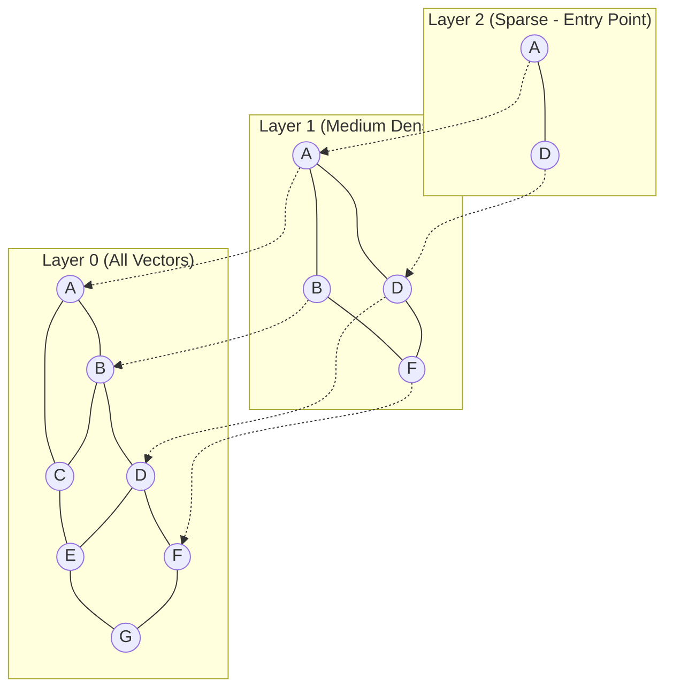
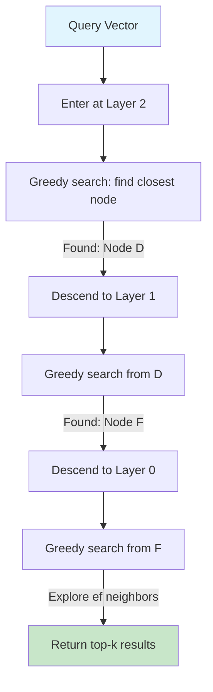
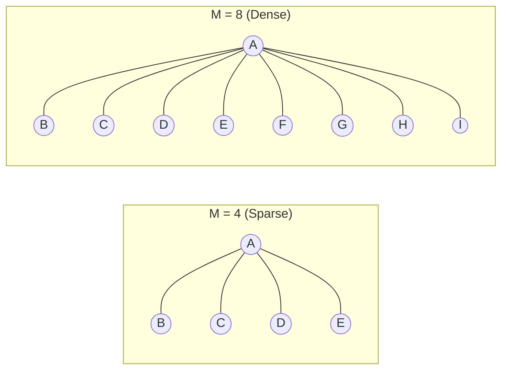
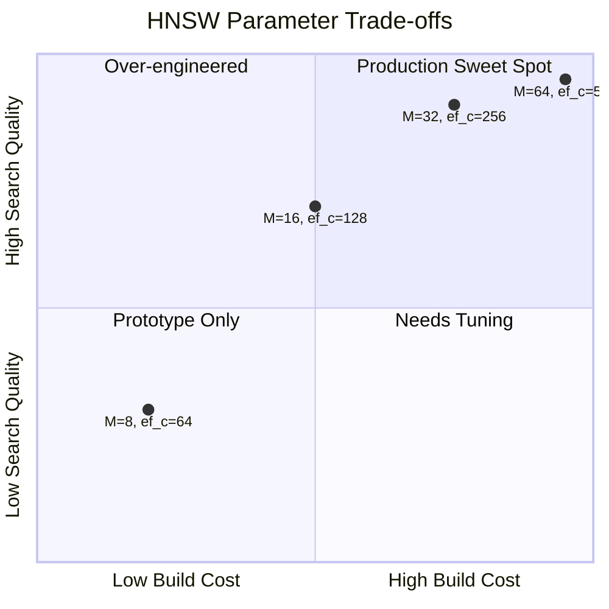
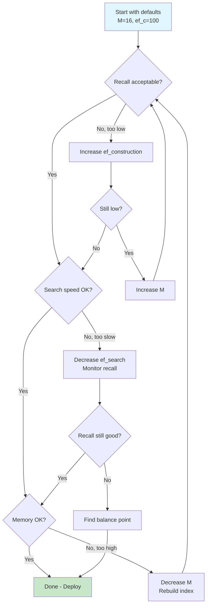
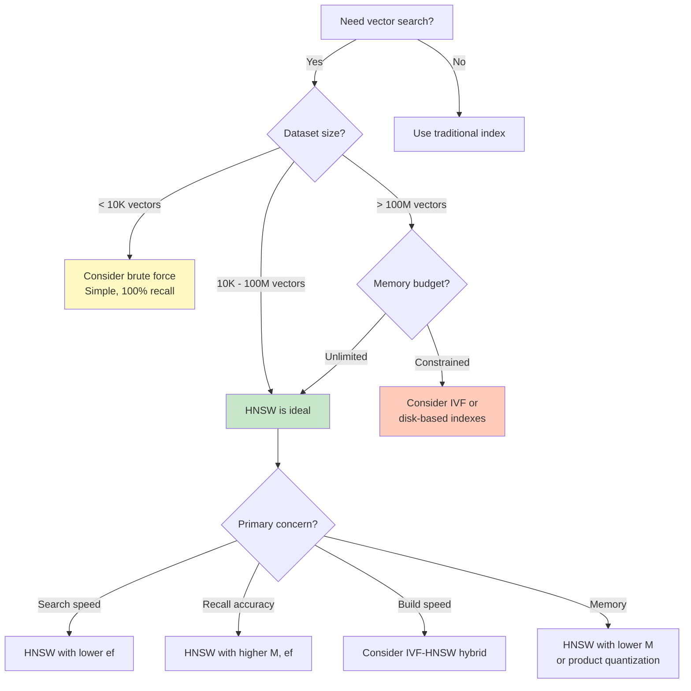

# How to Create HNSW Index

Author: [nawazdhandala](https://github.com/nawazdhandala)

Tags: Vector Database, HNSW, Indexing, Similarity Search

Description: Learn to create HNSW (Hierarchical Navigable Small World) index for approximate nearest neighbor search.

---

> Vector search is only as fast as your index allows. HNSW delivers sub-millisecond queries on millions of vectors where brute force would take seconds.

Finding the most similar items in high-dimensional vector spaces is fundamental to modern AI applications: semantic search, recommendation engines, image retrieval, and RAG (Retrieval Augmented Generation) pipelines. Brute force comparison scales linearly with dataset size, making it impractical for production workloads. Enter HNSW (Hierarchical Navigable Small World), the gold standard algorithm for approximate nearest neighbor (ANN) search.

This guide walks through how HNSW works, how to create and tune indexes across popular vector databases, and the critical trade-offs between build time, search speed, memory usage, and recall accuracy.

---

## Table of Contents

1. What is HNSW?
2. How HNSW Works (Visual Explanation)
3. Key Parameters: M and ef
4. Creating HNSW Indexes (Code Examples)
5. Build vs Search Trade-offs
6. Parameter Tuning Guide
7. Memory Estimation
8. When to Use HNSW
9. Common Pitfalls
10. Benchmarking Your Index
11. Summary

---

## 1. What is HNSW?

HNSW stands for **Hierarchical Navigable Small World**. It is a graph-based algorithm for approximate nearest neighbor search that builds a multi-layer graph structure where:

- **Higher layers** contain fewer nodes with long-range connections (for fast global navigation)
- **Lower layers** contain more nodes with short-range connections (for precise local search)
- **Layer 0** contains all vectors in your dataset

| Aspect | Description |
|--------|-------------|
| Type | Graph-based ANN algorithm |
| Complexity | O(log N) search time |
| Memory | Higher than flat indexes (stores graph edges) |
| Accuracy | Tunable via parameters (typically 95-99%+ recall) |
| Use Case | Large-scale similarity search where speed matters |

HNSW was introduced by Malkov and Yashunin in 2016 and has become the default choice for most vector databases due to its excellent balance of speed, accuracy, and scalability.

---

## 2. How HNSW Works (Visual Explanation)

The algorithm builds a hierarchical graph where each layer is a "small world" graph. During search, it starts at the top layer and greedily navigates toward the query vector, then descends to lower layers for refinement.

### Multi-Layer Structure



### Search Process



### Search Algorithm Steps

1. **Enter at top layer**: Start from a fixed entry point node
2. **Greedy traversal**: At each layer, move to the neighbor closest to query
3. **Descend**: When no closer neighbor exists, move down one layer
4. **Final search**: At layer 0, explore `ef_search` candidates to find best matches
5. **Return results**: Output the k nearest neighbors found

---

## 3. Key Parameters: M and ef

HNSW has three critical parameters that control the trade-off between build time, search speed, memory, and accuracy:

### Parameter Overview

| Parameter | Phase | Description | Typical Range |
|-----------|-------|-------------|---------------|
| `M` | Build | Max connections per node per layer | 8-64 |
| `ef_construction` | Build | Candidate list size during index building | 64-512 |
| `ef_search` | Search | Candidate list size during query | 16-512 |

### M (Maximum Connections)

`M` controls how many edges each node maintains in the graph.



| M Value | Memory | Build Time | Search Speed | Recall |
|---------|--------|------------|--------------|--------|
| Low (8-12) | Lower | Faster | Slower | Lower |
| Medium (16-32) | Medium | Medium | Balanced | Good |
| High (48-64) | Higher | Slower | Faster | Higher |

**Rule of thumb**: Start with `M=16` for most use cases. Increase for higher recall requirements.

### ef_construction (Build-time Candidate List)

`ef_construction` determines how many candidates are considered when inserting each vector.

```
ef_construction = 64:  Consider 64 potential neighbors per insertion
ef_construction = 200: Consider 200 potential neighbors per insertion (better quality, slower build)
```

| ef_construction | Build Time | Index Quality |
|-----------------|------------|---------------|
| 64 | Fast | Good |
| 128 | Medium | Better |
| 256+ | Slow | Best |

**Rule of thumb**: Set `ef_construction >= 2 * M`. Higher values improve recall but increase build time.

### ef_search (Query-time Candidate List)

`ef_search` controls how many candidates to explore during search. It can be tuned per query without rebuilding the index.

```
ef_search = 10:  Fast but lower recall
ef_search = 100: Balanced speed and recall
ef_search = 500: High recall but slower
```

**Constraint**: `ef_search >= k` where k is the number of results requested.

---

## 4. Creating HNSW Indexes (Code Examples)

### PostgreSQL with pgvector

```sql
-- Enable the pgvector extension
CREATE EXTENSION IF NOT EXISTS vector;

-- Create a table with a vector column
-- 1536 dimensions is common for OpenAI embeddings
CREATE TABLE documents (
    id SERIAL PRIMARY KEY,
    title TEXT NOT NULL,
    content TEXT,
    -- Vector column with 1536 dimensions
    embedding vector(1536)
);

-- Create the HNSW index
-- m: maximum number of connections per layer (default: 16)
-- ef_construction: size of dynamic candidate list for construction (default: 64)
CREATE INDEX documents_embedding_hnsw_idx
ON documents
USING hnsw (embedding vector_cosine_ops)
WITH (
    m = 16,              -- Balance between memory and recall
    ef_construction = 64 -- Higher = better recall, slower build
);

-- For L2 (Euclidean) distance instead of cosine:
-- CREATE INDEX documents_embedding_hnsw_idx
-- ON documents
-- USING hnsw (embedding vector_l2_ops)
-- WITH (m = 16, ef_construction = 64);

-- Set ef_search for queries (can be changed per session)
SET hnsw.ef_search = 100;

-- Query: find 10 most similar documents
SELECT id, title, embedding <=> '[0.1, 0.2, ...]'::vector AS distance
FROM documents
ORDER BY embedding <=> '[0.1, 0.2, ...]'::vector
LIMIT 10;
```

### Python with FAISS

```python
import numpy as np
import faiss

# Configuration
DIMENSION = 1536      # Vector dimension (e.g., OpenAI embeddings)
NUM_VECTORS = 100000  # Number of vectors to index
M = 32                # Max connections per node
EF_CONSTRUCTION = 64  # Candidate list size during build
EF_SEARCH = 100       # Candidate list size during search

# Generate sample data (replace with your actual embeddings)
np.random.seed(42)
vectors = np.random.random((NUM_VECTORS, DIMENSION)).astype('float32')

# Normalize vectors for cosine similarity
# FAISS HNSW uses inner product, so normalize for cosine
faiss.normalize_L2(vectors)

# Create HNSW index
# HNSW uses inner product by default
# For normalized vectors, inner product = cosine similarity
index = faiss.IndexHNSWFlat(DIMENSION, M)

# Set construction-time parameter
# Must be set BEFORE adding vectors
index.hnsw.efConstruction = EF_CONSTRUCTION

# Add vectors to index (this builds the graph)
print(f"Building index with {NUM_VECTORS} vectors...")
index.add(vectors)
print(f"Index built. Total vectors: {index.ntotal}")

# Set search-time parameter
# Can be changed anytime without rebuilding
index.hnsw.efSearch = EF_SEARCH

# Query the index
query_vector = np.random.random((1, DIMENSION)).astype('float32')
faiss.normalize_L2(query_vector)

# Find 10 nearest neighbors
k = 10
distances, indices = index.search(query_vector, k)

print(f"\nTop {k} results:")
for i, (dist, idx) in enumerate(zip(distances[0], indices[0])):
    print(f"  {i+1}. Index: {idx}, Distance: {dist:.4f}")

# Save index to disk
faiss.write_index(index, "documents.index")

# Load index from disk
# loaded_index = faiss.read_index("documents.index")
```

### Python with Qdrant

```python
from qdrant_client import QdrantClient
from qdrant_client.models import (
    Distance,
    VectorParams,
    HnswConfigDiff,
    PointStruct,
    SearchParams,
)
import numpy as np

# Connect to Qdrant (local or cloud)
client = QdrantClient(host="localhost", port=6333)
# For Qdrant Cloud:
# client = QdrantClient(url="https://xxx.qdrant.io", api_key="your-api-key")

COLLECTION_NAME = "documents"
DIMENSION = 1536

# Create collection with HNSW configuration
client.recreate_collection(
    collection_name=COLLECTION_NAME,
    vectors_config=VectorParams(
        size=DIMENSION,
        distance=Distance.COSINE,  # or EUCLID, DOT
    ),
    # HNSW-specific parameters
    hnsw_config=HnswConfigDiff(
        m=16,                    # Max connections per node
        ef_construct=128,        # Build-time candidate list
        full_scan_threshold=10000,  # Use brute force below this size
        max_indexing_threads=0,  # 0 = use all available CPUs
        on_disk=False,           # True for large datasets
    ),
)

# Generate sample data
np.random.seed(42)
NUM_VECTORS = 10000
vectors = np.random.random((NUM_VECTORS, DIMENSION)).astype('float32')

# Insert vectors in batches
BATCH_SIZE = 100
for i in range(0, NUM_VECTORS, BATCH_SIZE):
    batch_vectors = vectors[i:i + BATCH_SIZE]
    points = [
        PointStruct(
            id=i + j,
            vector=vec.tolist(),
            payload={"title": f"Document {i + j}"}
        )
        for j, vec in enumerate(batch_vectors)
    ]
    client.upsert(collection_name=COLLECTION_NAME, points=points)

print(f"Inserted {NUM_VECTORS} vectors")

# Search with custom ef parameter
query_vector = np.random.random(DIMENSION).astype('float32').tolist()

results = client.search(
    collection_name=COLLECTION_NAME,
    query_vector=query_vector,
    limit=10,
    search_params=SearchParams(
        hnsw_ef=128,  # Search-time ef (higher = better recall, slower)
        exact=False,  # True to bypass HNSW and use brute force
    ),
)

print("\nSearch results:")
for result in results:
    print(f"  ID: {result.id}, Score: {result.score:.4f}")
```

### Python with Pinecone

```python
from pinecone import Pinecone, ServerlessSpec

# Initialize Pinecone client
pc = Pinecone(api_key="your-api-key")

INDEX_NAME = "documents"
DIMENSION = 1536

# Create index with pod-based deployment (supports HNSW tuning)
# Note: Serverless indexes have automatic optimization
pc.create_index(
    name=INDEX_NAME,
    dimension=DIMENSION,
    metric="cosine",  # or "euclidean", "dotproduct"
    spec=ServerlessSpec(
        cloud="aws",
        region="us-east-1"
    ),
    # For pod-based indexes, you can specify:
    # spec=PodSpec(
    #     environment="us-east-1-aws",
    #     pod_type="p1.x1",
    #     pods=1,
    #     metadata_config={"indexed": ["title", "category"]},
    # )
)

# Connect to index
index = pc.Index(INDEX_NAME)

# Upsert vectors
import numpy as np
np.random.seed(42)

vectors_to_upsert = [
    {
        "id": f"doc_{i}",
        "values": np.random.random(DIMENSION).tolist(),
        "metadata": {"title": f"Document {i}", "category": "tech"}
    }
    for i in range(1000)
]

# Upsert in batches of 100
for i in range(0, len(vectors_to_upsert), 100):
    batch = vectors_to_upsert[i:i + 100]
    index.upsert(vectors=batch)

# Query the index
query_response = index.query(
    vector=np.random.random(DIMENSION).tolist(),
    top_k=10,
    include_metadata=True,
)

print("Search results:")
for match in query_response.matches:
    print(f"  ID: {match.id}, Score: {match.score:.4f}")
```

### Python with Weaviate

```python
import weaviate
from weaviate.classes.config import Configure, Property, DataType
import numpy as np

# Connect to Weaviate
client = weaviate.connect_to_local()  # or connect_to_wcs() for cloud

# Define collection with HNSW configuration
client.collections.create(
    name="Document",
    # HNSW vector index configuration
    vectorizer_config=Configure.Vectorizer.none(),  # We provide our own vectors
    vector_index_config=Configure.VectorIndex.hnsw(
        distance_metric=weaviate.classes.config.VectorDistances.COSINE,
        ef_construction=128,     # Build-time candidate list
        max_connections=32,      # M parameter
        ef=-1,                   # Search-time ef (-1 = dynamic)
        dynamic_ef_min=100,      # Min ef for dynamic mode
        dynamic_ef_max=500,      # Max ef for dynamic mode
        dynamic_ef_factor=8,     # ef = k * factor
        flat_search_cutoff=40000,  # Use flat search below this
    ),
    properties=[
        Property(name="title", data_type=DataType.TEXT),
        Property(name="content", data_type=DataType.TEXT),
    ],
)

# Get collection reference
documents = client.collections.get("Document")

# Insert documents with vectors
np.random.seed(42)
DIMENSION = 1536

with documents.batch.dynamic() as batch:
    for i in range(1000):
        batch.add_object(
            properties={
                "title": f"Document {i}",
                "content": f"Content for document {i}",
            },
            vector=np.random.random(DIMENSION).tolist(),
        )

# Query with vector
query_vector = np.random.random(DIMENSION).tolist()

results = documents.query.near_vector(
    near_vector=query_vector,
    limit=10,
    return_metadata=weaviate.classes.query.MetadataQuery(distance=True),
)

print("Search results:")
for obj in results.objects:
    print(f"  Title: {obj.properties['title']}, Distance: {obj.metadata.distance:.4f}")

client.close()
```

### Python with Milvus

```python
from pymilvus import (
    connections,
    Collection,
    CollectionSchema,
    FieldSchema,
    DataType,
    utility,
)
import numpy as np

# Connect to Milvus
connections.connect(host="localhost", port="19530")

COLLECTION_NAME = "documents"
DIMENSION = 1536

# Define schema
fields = [
    FieldSchema(name="id", dtype=DataType.INT64, is_primary=True, auto_id=True),
    FieldSchema(name="title", dtype=DataType.VARCHAR, max_length=512),
    FieldSchema(name="embedding", dtype=DataType.FLOAT_VECTOR, dim=DIMENSION),
]
schema = CollectionSchema(fields=fields, description="Document embeddings")

# Create collection
if utility.has_collection(COLLECTION_NAME):
    utility.drop_collection(COLLECTION_NAME)

collection = Collection(name=COLLECTION_NAME, schema=schema)

# Insert data
np.random.seed(42)
NUM_VECTORS = 10000

data = [
    [f"Document {i}" for i in range(NUM_VECTORS)],  # titles
    np.random.random((NUM_VECTORS, DIMENSION)).tolist(),  # embeddings
]

collection.insert(data)
print(f"Inserted {collection.num_entities} entities")

# Create HNSW index
index_params = {
    "index_type": "HNSW",
    "metric_type": "COSINE",  # or "L2", "IP"
    "params": {
        "M": 16,              # Max connections per layer
        "efConstruction": 256  # Build-time candidate list
    }
}

print("Building HNSW index...")
collection.create_index(field_name="embedding", index_params=index_params)
print("Index built successfully")

# Load collection into memory for searching
collection.load()

# Search
search_params = {
    "metric_type": "COSINE",
    "params": {
        "ef": 128  # Search-time ef parameter
    }
}

query_vector = [np.random.random(DIMENSION).tolist()]

results = collection.search(
    data=query_vector,
    anns_field="embedding",
    param=search_params,
    limit=10,
    output_fields=["title"],
)

print("\nSearch results:")
for hits in results:
    for hit in hits:
        print(f"  ID: {hit.id}, Title: {hit.entity.get('title')}, Distance: {hit.distance:.4f}")

# Cleanup
collection.release()
connections.disconnect("default")
```

---

## 5. Build vs Search Trade-offs

Understanding the trade-offs helps you optimize for your specific use case.

### Trade-off Matrix



### Detailed Comparison

| Scenario | M | ef_construction | ef_search | Build Time | Memory | Recall | QPS |
|----------|---|-----------------|-----------|------------|--------|--------|-----|
| Fast prototype | 8 | 40 | 50 | Very fast | Low | ~90% | High |
| Balanced | 16 | 100 | 100 | Medium | Medium | ~95% | Medium |
| High recall | 32 | 200 | 200 | Slow | High | ~98% | Medium |
| Maximum quality | 48 | 400 | 400 | Very slow | Very high | ~99% | Lower |

### Build Time vs Index Quality

```
Build Time Impact:

ef_construction = 64   |████████                        | Fast
ef_construction = 128  |████████████████                | Medium
ef_construction = 256  |████████████████████████        | Slow
ef_construction = 512  |████████████████████████████████| Very Slow

Higher ef_construction = Better neighbor selection = Higher recall
```

### Search Time vs Recall

```
                    Recall vs Latency

Recall %  |                                    ****
   99     |                              *****
   98     |                        ******
   95     |                  ******
   90     |            ******
   85     |      ******
   80     |******
          +----------------------------------------
              10    50   100   200   400   ef_search

          Lower ef = Faster but less accurate
          Higher ef = Slower but more accurate
```

---

## 6. Parameter Tuning Guide

### Step-by-Step Tuning Process



### Recommended Starting Points by Use Case

```python
# Configuration presets for different use cases

PRESETS = {
    # Fast prototyping - quick iteration, lower accuracy OK
    "prototype": {
        "M": 8,
        "ef_construction": 40,
        "ef_search": 40,
        "expected_recall": 0.85,
        "build_speed": "very fast",
        "memory": "low",
    },

    # Development - balanced for testing
    "development": {
        "M": 16,
        "ef_construction": 64,
        "ef_search": 64,
        "expected_recall": 0.92,
        "build_speed": "fast",
        "memory": "medium",
    },

    # Production balanced - good default
    "production_balanced": {
        "M": 16,
        "ef_construction": 128,
        "ef_search": 100,
        "expected_recall": 0.95,
        "build_speed": "medium",
        "memory": "medium",
    },

    # Production high recall - when accuracy matters
    "production_high_recall": {
        "M": 32,
        "ef_construction": 256,
        "ef_search": 200,
        "expected_recall": 0.98,
        "build_speed": "slow",
        "memory": "high",
    },

    # Maximum quality - cost not a concern
    "maximum_quality": {
        "M": 48,
        "ef_construction": 400,
        "ef_search": 400,
        "expected_recall": 0.99,
        "build_speed": "very slow",
        "memory": "very high",
    },
}

def get_preset(name: str) -> dict:
    """Get HNSW configuration preset."""
    return PRESETS.get(name, PRESETS["production_balanced"])
```

### Tuning for Specific Constraints

**Memory constrained:**
```python
# Lower M reduces memory significantly
# Memory per vector ~= 4 * M * dimension bytes (approx)
config = {
    "M": 8,              # Minimum practical value
    "ef_construction": 100,  # Keep quality reasonable
    "ef_search": 80,     # Adjust based on recall needs
}
```

**Latency constrained (need sub-millisecond search):**
```python
# Lower ef_search is the primary lever
config = {
    "M": 24,             # Higher M can reduce ef_search needed
    "ef_construction": 200,
    "ef_search": 32,     # Very low for speed
}
```

**Recall constrained (need 99%+ accuracy):**
```python
# Both M and ef parameters need to be high
config = {
    "M": 48,
    "ef_construction": 400,
    "ef_search": 500,    # Very high
}
```

---

## 7. Memory Estimation

HNSW indexes require additional memory beyond the raw vector data.

### Memory Formula

```
Total Memory = Vector Memory + Graph Memory + Overhead

Vector Memory = num_vectors * dimension * 4 bytes (float32)
Graph Memory  = num_vectors * M * 2 * 8 bytes (approximate)
Overhead      = ~10-20% for internal structures
```

### Memory Calculator

```python
def estimate_hnsw_memory(
    num_vectors: int,
    dimension: int,
    M: int,
    include_vectors: bool = True
) -> dict:
    """
    Estimate memory requirements for an HNSW index.

    Args:
        num_vectors: Number of vectors to index
        dimension: Vector dimension
        M: HNSW M parameter
        include_vectors: Whether to include raw vector storage

    Returns:
        Dictionary with memory estimates in various units
    """
    # Raw vector storage (float32 = 4 bytes per component)
    vector_bytes = num_vectors * dimension * 4

    # Graph storage
    # Each node has up to M connections on each layer
    # Layer 0 has 2*M connections, upper layers have M
    # Average across layers: approximately M * 1.5 connections per node
    # Each connection is a 64-bit pointer/index
    avg_connections_per_node = M * 2  # Conservative estimate
    graph_bytes = num_vectors * avg_connections_per_node * 8

    # Overhead for metadata, level assignments, etc.
    overhead_factor = 1.15  # 15% overhead

    if include_vectors:
        total_bytes = (vector_bytes + graph_bytes) * overhead_factor
    else:
        total_bytes = graph_bytes * overhead_factor

    return {
        "vectors_mb": vector_bytes / (1024 ** 2),
        "graph_mb": graph_bytes / (1024 ** 2),
        "total_mb": total_bytes / (1024 ** 2),
        "total_gb": total_bytes / (1024 ** 3),
        "bytes_per_vector": total_bytes / num_vectors,
    }

# Example calculations
examples = [
    (100_000, 1536, 16),      # 100K vectors, OpenAI dimensions, default M
    (1_000_000, 1536, 16),    # 1M vectors
    (10_000_000, 768, 32),    # 10M vectors, smaller dimension, higher M
]

print("Memory Estimates for HNSW Indexes\n")
print(f"{'Vectors':>12} {'Dim':>6} {'M':>4} {'Total GB':>10} {'Per Vector':>12}")
print("-" * 50)

for num_vectors, dimension, M in examples:
    estimate = estimate_hnsw_memory(num_vectors, dimension, M)
    print(f"{num_vectors:>12,} {dimension:>6} {M:>4} {estimate['total_gb']:>10.2f} {estimate['bytes_per_vector']:>10.0f} B")
```

Output:
```
Memory Estimates for HNSW Indexes

     Vectors    Dim    M   Total GB   Per Vector
--------------------------------------------------
     100,000   1536   16       0.71       7526 B
   1,000,000   1536   16       7.12       7526 B
  10,000,000    768   32      46.77       4953 B
```

---

## 8. When to Use HNSW

### Decision Matrix



### HNSW vs Other Index Types

| Index Type | Build Time | Search Time | Memory | Recall | Best For |
|------------|------------|-------------|--------|--------|----------|
| Flat (Brute Force) | O(1) | O(n) | Low | 100% | < 10K vectors |
| IVF | Fast | Medium | Medium | 90-98% | Large datasets, memory constrained |
| **HNSW** | Medium | Fast | High | 95-99% | General purpose, sub-ms latency |
| LSH | Fast | Fast | Low | 80-95% | Very large, approximate OK |
| DiskANN | Slow | Medium | Low (disk) | 95-99% | Billion-scale, SSD-backed |

### Use HNSW When:

1. **Dataset size is 10K to 100M vectors** - Sweet spot for HNSW
2. **Sub-millisecond latency required** - HNSW excels here
3. **High recall needed (95%+)** - Tunable to your requirements
4. **Data updates frequently** - HNSW supports incremental insertion
5. **Memory is available** - HNSW needs more RAM than alternatives

### Avoid HNSW When:

1. **Dataset < 10K vectors** - Brute force is simpler and exact
2. **Memory severely constrained** - Consider IVF or disk-based options
3. **Billion-scale data** - Consider DiskANN or distributed solutions
4. **100% recall required** - Use flat index or increase ef_search significantly

---

## 9. Common Pitfalls

### Pitfall 1: Setting ef_search Too Low

```python
# BAD: ef_search less than k
results = index.search(query, k=100)  # Want 100 results
# But ef_search = 50 means we only explore 50 candidates
# Will return fewer than 100 results or poor quality

# GOOD: ef_search >= k, ideally 2-10x k
index.hnsw.efSearch = 200  # At least 2x the k value
results = index.search(query, k=100)
```

### Pitfall 2: Not Normalizing Vectors for Cosine Similarity

```python
import numpy as np
import faiss

# BAD: Raw vectors with inner product
vectors = get_embeddings()  # Not normalized
index = faiss.IndexHNSWFlat(dim, M)
index.add(vectors)  # Will not give cosine similarity results

# GOOD: Normalize vectors first
vectors = get_embeddings()
faiss.normalize_L2(vectors)  # Normalize in-place
index = faiss.IndexHNSWFlat(dim, M)
index.add(vectors)  # Now inner product = cosine similarity
```

### Pitfall 3: Setting ef_construction After Adding Vectors

```python
# BAD: Setting ef_construction after adding vectors has no effect
index = faiss.IndexHNSWFlat(dim, M)
index.add(vectors)  # Uses default ef_construction
index.hnsw.efConstruction = 200  # TOO LATE - index already built

# GOOD: Set ef_construction before adding
index = faiss.IndexHNSWFlat(dim, M)
index.hnsw.efConstruction = 200  # Set BEFORE adding
index.add(vectors)  # Now uses ef_construction=200
```

### Pitfall 4: Ignoring the Build Time Cost

```python
# Rebuilding a large HNSW index is expensive
# Plan for this in your architecture

# BAD: Frequent full rebuilds
def update_index(new_vectors):
    global index
    all_vectors = get_all_vectors() + new_vectors
    index = build_hnsw_from_scratch(all_vectors)  # Very slow

# GOOD: Incremental updates when possible
def update_index(new_vectors):
    global index
    index.add(new_vectors)  # HNSW supports incremental add
```

### Pitfall 5: Not Testing Recall on Your Data

```python
def measure_recall(index, test_vectors, ground_truth, k=10, ef_search=100):
    """
    Measure recall by comparing HNSW results to brute force.

    Args:
        index: HNSW index
        test_vectors: Vectors to query
        ground_truth: True nearest neighbors from brute force
        k: Number of neighbors to retrieve
        ef_search: ef parameter for search

    Returns:
        Recall percentage
    """
    index.hnsw.efSearch = ef_search

    total_correct = 0
    total_expected = 0

    for i, query in enumerate(test_vectors):
        # Get HNSW results
        distances, indices = index.search(query.reshape(1, -1), k)
        hnsw_results = set(indices[0])

        # Get ground truth
        true_neighbors = set(ground_truth[i][:k])

        # Count matches
        correct = len(hnsw_results & true_neighbors)
        total_correct += correct
        total_expected += k

    recall = total_correct / total_expected
    return recall

# Always validate recall on a sample of your actual data
# Different data distributions can yield different recall
```

---

## 10. Benchmarking Your Index

### Comprehensive Benchmark Script

```python
import numpy as np
import faiss
import time
from typing import List, Tuple

def benchmark_hnsw(
    vectors: np.ndarray,
    queries: np.ndarray,
    ground_truth: np.ndarray,
    M_values: List[int],
    ef_construction_values: List[int],
    ef_search_values: List[int],
    k: int = 10
) -> List[dict]:
    """
    Benchmark HNSW with different parameter combinations.

    Args:
        vectors: Dataset vectors (n_vectors, dimension)
        queries: Query vectors (n_queries, dimension)
        ground_truth: True k-NN for each query
        M_values: List of M values to test
        ef_construction_values: List of ef_construction values
        ef_search_values: List of ef_search values
        k: Number of neighbors to retrieve

    Returns:
        List of benchmark results
    """
    dim = vectors.shape[1]
    n_queries = queries.shape[0]
    results = []

    for M in M_values:
        for ef_construction in ef_construction_values:
            # Build index
            print(f"\nBuilding index: M={M}, ef_construction={ef_construction}")
            index = faiss.IndexHNSWFlat(dim, M)
            index.hnsw.efConstruction = ef_construction

            build_start = time.time()
            index.add(vectors)
            build_time = time.time() - build_start

            # Estimate memory
            memory_mb = (index.ntotal * dim * 4 + index.ntotal * M * 2 * 8) / 1e6

            # Test different ef_search values
            for ef_search in ef_search_values:
                index.hnsw.efSearch = ef_search

                # Measure search time
                search_start = time.time()
                distances, indices = index.search(queries, k)
                search_time = time.time() - search_start

                # Calculate recall
                recall = 0
                for i in range(n_queries):
                    retrieved = set(indices[i])
                    relevant = set(ground_truth[i][:k])
                    recall += len(retrieved & relevant) / k
                recall /= n_queries

                # Calculate QPS
                qps = n_queries / search_time
                latency_ms = (search_time / n_queries) * 1000

                result = {
                    "M": M,
                    "ef_construction": ef_construction,
                    "ef_search": ef_search,
                    "build_time_s": round(build_time, 2),
                    "memory_mb": round(memory_mb, 1),
                    "recall": round(recall, 4),
                    "qps": round(qps, 1),
                    "latency_ms": round(latency_ms, 3),
                }
                results.append(result)

                print(f"  ef_search={ef_search}: recall={recall:.3f}, "
                      f"latency={latency_ms:.2f}ms, QPS={qps:.0f}")

    return results


def compute_ground_truth(vectors: np.ndarray, queries: np.ndarray, k: int) -> np.ndarray:
    """Compute exact k-NN using brute force."""
    index = faiss.IndexFlatIP(vectors.shape[1])  # Inner product for normalized vectors
    index.add(vectors)
    _, indices = index.search(queries, k)
    return indices


# Example usage
if __name__ == "__main__":
    # Generate sample data
    np.random.seed(42)
    n_vectors = 100_000
    n_queries = 1000
    dimension = 128
    k = 10

    print(f"Generating {n_vectors} vectors with dimension {dimension}")
    vectors = np.random.random((n_vectors, dimension)).astype('float32')
    queries = np.random.random((n_queries, dimension)).astype('float32')

    # Normalize for cosine similarity
    faiss.normalize_L2(vectors)
    faiss.normalize_L2(queries)

    # Compute ground truth
    print("Computing ground truth...")
    ground_truth = compute_ground_truth(vectors, queries, k)

    # Run benchmark
    results = benchmark_hnsw(
        vectors=vectors,
        queries=queries,
        ground_truth=ground_truth,
        M_values=[8, 16, 32],
        ef_construction_values=[64, 128],
        ef_search_values=[32, 64, 128, 256],
        k=k
    )

    # Print summary table
    print("\n" + "=" * 80)
    print("BENCHMARK RESULTS")
    print("=" * 80)
    print(f"{'M':>4} {'ef_c':>6} {'ef_s':>6} {'Build(s)':>10} {'Mem(MB)':>10} "
          f"{'Recall':>8} {'QPS':>8} {'Lat(ms)':>10}")
    print("-" * 80)

    for r in results:
        print(f"{r['M']:>4} {r['ef_construction']:>6} {r['ef_search']:>6} "
              f"{r['build_time_s']:>10} {r['memory_mb']:>10} {r['recall']:>8.3f} "
              f"{r['qps']:>8.0f} {r['latency_ms']:>10.3f}")
```

Sample Output:
```
================================================================================
BENCHMARK RESULTS
================================================================================
   M   ef_c   ef_s   Build(s)    Mem(MB)   Recall      QPS    Lat(ms)
--------------------------------------------------------------------------------
   8     64     32       1.23       52.4    0.891     8542      0.117
   8     64     64       1.23       52.4    0.934     6231      0.161
   8     64    128       1.23       52.4    0.962     4102      0.244
   8     64    256       1.23       52.4    0.978     2341      0.427
  16     64     32       2.15       71.2    0.912     7821      0.128
  16     64     64       2.15       71.2    0.956     5834      0.171
  16     64    128       2.15       71.2    0.981     3912      0.256
  16     64    256       2.15       71.2    0.992     2156      0.464
  32    128     32       5.42      108.9    0.924     6542      0.153
  32    128     64       5.42      108.9    0.968     5123      0.195
  32    128    128       5.42      108.9    0.989     3521      0.284
  32    128    256       5.42      108.9    0.997     1987      0.503
```

---

## 11. Summary

### Key Takeaways

| Concept | Key Points |
|---------|------------|
| What is HNSW | Graph-based ANN algorithm with hierarchical structure |
| M parameter | Controls graph connectivity; higher = more memory, better recall |
| ef_construction | Build-time quality; set before adding vectors |
| ef_search | Search-time accuracy; tunable per query |
| Trade-offs | Build cost vs search quality vs memory vs recall |
| Sweet spot | M=16, ef_c=128, ef_s=100 for most production use cases |

### Quick Reference

```python
# Production-ready HNSW configuration
HNSW_CONFIG = {
    "M": 16,                    # Graph connectivity
    "ef_construction": 128,      # Build quality
    "ef_search": 100,           # Search quality (tune per use case)
}

# Constraints
# - ef_search >= k (number of results requested)
# - ef_construction >= M
# - Set ef_construction BEFORE adding vectors
# - Normalize vectors for cosine similarity
```

### Decision Tree Summary

```
Dataset < 10K vectors?
  -> Use brute force (simple, 100% accurate)

Need 99%+ recall?
  -> HNSW with M=32+, ef_construction=256+, ef_search=400+

Memory constrained?
  -> HNSW with M=8-12, or consider IVF

Need sub-millisecond search?
  -> HNSW with higher M, lower ef_search

General production use?
  -> HNSW with M=16, ef_construction=128, ef_search=100
```

---

HNSW has become the de facto standard for approximate nearest neighbor search in production systems. By understanding its parameters and trade-offs, you can build vector search systems that deliver both speed and accuracy for your specific requirements.

---

### Related Reading

- [What are Vector Embeddings?](https://oneuptime.com/blog)
- [Choosing the Right Distance Metric for Vector Search](https://oneuptime.com/blog)
- [Scaling Vector Search to Billions of Vectors](https://oneuptime.com/blog)
